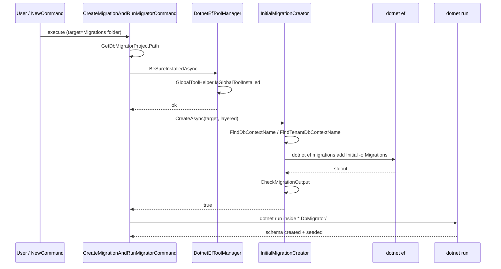

The ABP Framework CLI ships a cluster of related commands for maintenance of an existing solution: `abp update` bumps every `Volo.*` NuGet and NPM package to the latest version, the four `abp switch-to-*` commands swap the package feed between nightly, preview, RC, and stable, and the internal `create-migration-and-run-migrator` command pairs `dotnet ef migrations add` with `dotnet run` against the `*.DbMigrator` host project to take a project from "templates dropped on disk" to "database schema seeded". This page walks every file involved in those flows under `framework/src/Volo.Abp.Cli.Core/Volo/Abp/Cli/Commands/`.

## `abp update` at a glance

`UpdateCommand` (`UpdateCommand.cs`) is registered as `ITransientDependency`, named `update`, and is the single entry point for upgrading a solution. It composes two collaborators that live in `Volo.Abp.Cli.ProjectModification`:

```csharp
public UpdateCommand(VoloNugetPackagesVersionUpdater nugetPackagesVersionUpdater,
    NpmPackagesUpdater npmPackagesUpdater, ITelemetryService telemetryService)
{
    _nugetPackagesVersionUpdater = nugetPackagesVersionUpdater;
    _npmPackagesUpdater = npmPackagesUpdater;
    _telemetryService = telemetryService;

    Logger = NullLogger<UpdateCommand>.Instance;
}
```

The options are mapped through nested `Options` classes (the convention used everywhere in the CLI — see [`/cli/cli-core-abstractions`](/cli/cli-core-abstractions)):

| Short | Long | Default | Behaviour |
| --- | --- | --- | --- |
| `-sp` | `--solution-path` | `Directory.GetCurrentDirectory()` | Where to scan for `.sln`/`.slnx` |
| `-sn` | `--solution-name` | _scan_ | Explicit solution file path |
| `-v` | `--version` | _latest_ | Pin all `Volo.*` packages to this version |
| `-lv` | `--leptonx-version` | _latest_ | Pin LeptonX-family packages separately |
| n/a | `--npm` | _false_ | Only update NPM (skip NuGet) |
| n/a | `--nuget` | _false_ | Only update NuGet (skip NPM) |
| n/a | `--check-all` | _false_ | Probe new version per package instead of bulk-bumping |

A subtlety in `ExecuteAsync`: by default `updateNpm` and `updateNuget` are both `false`, but the runner intentionally does both halves unless the user explicitly asks for one:

```csharp
if (updateNuget || !updateNpm)
{
    await UpdateNugetPackages(commandLineArgs, directory, version, leptonXVersion);
}

if (updateNpm || !updateNuget)
{
    await UpdateNpmPackages(directory, version, leptonXVersion);
}
```

That double-negation pattern means `abp update` updates both, `abp update --nuget` only NuGet, `abp update --npm` only NPM, and `abp update --nuget --npm` updates both. Each branch is wrapped in a `_telemetryService.TrackActivityAsync(ActivityNameConsts.AbpCliCommandsUpdate)` scope so the abp.io analytics endpoint records the activity.

## Solution discovery

When no `--solution-name` is given, the command scans for both legacy `.sln` and modern `.slnx` files anywhere under the working directory:

```csharp
solutions.AddRange(Directory.GetFiles(directory, "*.sln", SearchOption.AllDirectories));
solutions.AddRange(Directory.GetFiles(directory, "*.slnx", SearchOption.AllDirectories));
```

Each match is passed to `VoloNugetPackagesVersionUpdater.UpdateSolutionAsync(solution, checkAll, version, leptonXVersion)`. When no solutions are found but a `.csproj` exists at the top level, the fallback is `UpdateProjectAsync`. That makes `abp update` work both for the full layered template and for the single-project `app-nolayers` template.

```mermaid
flowchart TD
    A[ExecuteAsync] --> B{--solution-name?}
    B -- yes --> C[solutions = single file]
    B -- no --> D[Scan *.sln *.slnx]
    D --> E{any?}
    E -- yes --> F[For each: UpdateSolutionAsync]
    E -- no --> G{any *.csproj at top level?}
    G -- yes --> H[UpdateProjectAsync]
    G -- no --> X[CliUsageException]
    F --> I{updateNpm || !updateNuget?}
    H --> I
    I -- yes --> J[NpmPackagesUpdater.Update directory, version, leptonXVersion]
```

## `--check-all` behaviour

The `--check-all` flag exists because by default `VoloNugetPackagesVersionUpdater` assumes every `Volo.*` package shares the same version — true for the framework, but not for separately-released sub-projects (LeptonX, Studio). With `--check-all` the updater queries `PackageVersionCheckerService.GetLatestVersionOrNullAsync` per package. That service is the one covered in [`/cli/cli-core-abstractions`](/cli/cli-core-abstractions) and routes through either `nuget.org`, `nuget.abp.io`, or MyGet depending on whether the package is commercial and whether prereleases were requested.

## NPM updates

`UpdateNpmPackages` simply forwards to `NpmPackagesUpdater.Update(directory, version, leptonXVersion)`. The updater scans every `package.json` under the directory, looks for `@abp/*` and `@volo/*` entries, and either substitutes the explicit version or asks the NPM registry for the latest tag. After updating, `RunYarn` is _not_ invoked — running `abp install-libs` is the recommended follow-up, which is covered in [`/cli/install-libs`](/cli/install-libs).

## The four `switch-to-*` commands

`SwitchToNightlyCommand`, `SwitchToPreviewCommand`, `SwitchToPreRcCommand`, and `SwitchToStableCommand` are siblings — each is a five-line shell over `PackagePreviewSwitcher` from `Volo.Abp.Cli.ProjectModification`. The nightly example shows the pattern:

```csharp
public class SwitchToNightlyCommand : IConsoleCommand, ITransientDependency
{
    public const string Name = "switch-to-nightly";

    private readonly PackagePreviewSwitcher _packagePreviewSwitcher;

    public SwitchToNightlyCommand(PackagePreviewSwitcher packagePreviewSwitcher)
    {
        _packagePreviewSwitcher = packagePreviewSwitcher;
    }

    public async Task ExecuteAsync(CommandLineArgs commandLineArgs)
    {
        await _packagePreviewSwitcher.SwitchToNightlyPreview(commandLineArgs);
    }
    // ...
}
```

The other three differ only in the method name they forward to. Each accepts a single `-d|--directory` option (handled inside the switcher, not the command).

| Command | Forwards to | Target feed |
| --- | --- | --- |
| `switch-to-nightly` | `PackagePreviewSwitcher.SwitchToNightlyPreview` | `myget.org/F/abp-nightly` |
| `switch-to-preview` | `PackagePreviewSwitcher.SwitchToPreview` | `-preview` tag on `nuget.org` / `nuget.abp.io` |
| `switch-to-prerc` | `PackagePreviewSwitcher.SwitchToPreRc` | `-prerc` tag |
| `switch-to-stable` | `PackagePreviewSwitcher.SwitchToStable` | `nuget.org` / `nuget.abp.io` stable |

Internally the switcher rewrites two things in the solution: every `<PackageReference>` element's `Version` attribute and the `NuGet.config` package-source list. Stable mode removes the `abp-nightly` and prerelease feeds; the three preview modes add them.

## `SwitchToLocal` is special

`SwitchToLocalCommand.cs` declares the class `SwitchToLocal` (note the missing `Command` suffix in the class name, though the public command keyword is still `switch-to-local`) and behaves very differently from its preview siblings. It points the solution at a local clone of the `abpframework/abp` repository so framework developers can `dotnet build` against in-progress framework changes. It takes two arguments:

```csharp
public const string Name = "switch-to-local";

public async Task ExecuteAsync(CommandLineArgs commandLineArgs)
{
    var workingDirectory = GetWorkingDirectory(commandLineArgs) ?? Directory.GetCurrentDirectory();

    if (!Directory.Exists(workingDirectory))
    {
        throw new CliUsageException(
            "Specified directory does not exist." + // ...
        );
    }

    await _localReferenceConverter.ConvertAsync(workingDirectory, GetPaths(commandLineArgs));
}
```

The `GetPaths` helper splits a pipe-delimited string of local repo roots, which is exactly the format `--local-paths "C:/abp|C:/leptonx"` produces. `LocalReferenceConverter.ConvertAsync` walks the solution and rewrites every matching `<PackageReference>` into a `<ProjectReference>` pointing at the local clone. There is a counterpart switch (back to packages) that none of these four commands handles — the conversion is one-way and must be undone manually or by re-cloning.

## `create-migration-and-run-migrator`

`CreateMigrationAndRunMigratorCommand.cs` is decorated with `[HideFromCommandList]` so it does not appear in `abp help`, but it is the spine of how a freshly-scaffolded ABP solution gets a working database. It is invoked by the new-project pipeline after the template ZIP has been extracted and the connection string has been updated.

```csharp
[HideFromCommandList]
public class CreateMigrationAndRunMigratorCommand : IConsoleCommand, ITransientDependency
{
    private readonly InitialMigrationCreator _initialMigrationCreator;
    public const string Name = "create-migration-and-run-migrator";

    public ICmdHelper CmdHelper { get; }
    public DotnetEfToolManager DotnetEfToolManager { get; }
```

The `Target` of the command line is the path to the `*.EntityFrameworkCore` project's `Migrations/` folder. The flow is:

1. Resolve the `*.DbMigrator` project folder by walking up to the `src/` parent and looking for a subdirectory ending with `.DbMigrator`.
2. Ensure the `dotnet-ef` global tool is installed via `DotnetEfToolManager.BeSureInstalledAsync`.
3. Run `InitialMigrationCreator.CreateAsync(target, layered)` — which itself shells out to `dotnet ef migrations add Initial`.
4. If migrations were created successfully, shell out to `dotnet run` against the `.DbMigrator` project (or `dotnet run --migrate-database` against the no-layers single project).

The decision between layered and no-layers is driven by a single option, `--nolayers`:

```csharp
var nolayers = commandLineArgs.Options.ContainsKey("nolayers");
var dbMigratorProjectPath = GetDbMigratorProjectPath(dbMigrationsFolder);
if (!nolayers && dbMigratorProjectPath == null)
{
    throw new Exception("DbMigrator is not found!");
}

await DotnetEfToolManager.BeSureInstalledAsync();

var migrationsCreatedSuccessfully = await _initialMigrationCreator.CreateAsync(commandLineArgs.Target, !nolayers);

if (migrationsCreatedSuccessfully)
{
    if (nolayers)
    {
        CmdHelper.RunCmd("dotnet run --migrate-database", Path.GetDirectoryName(Path.Combine(dbMigrationsFolder, "MyCompanyName.MyProjectName")));
    }
    else
    {
        CmdHelper.RunCmd("dotnet run",  Path.GetDirectoryName(dbMigratorProjectPath));
    }
```

`GetDbMigratorProjectPath` is the discovery helper — it scans the `src/` sibling tree looking for `*.DbMigrator/*.csproj`:

```csharp
private static string GetDbMigratorProjectPath(string dbMigrationsFolderPath)
{
    var srcFolder = Directory.GetParent(dbMigrationsFolderPath);
    var dbMigratorDirectory = Directory.GetDirectories(srcFolder.FullName)
        .FirstOrDefault(d => d.EndsWith(".DbMigrator"));

    return dbMigratorDirectory == null
        ? null
        : Directory.GetFiles(dbMigratorDirectory).FirstOrDefault(f => f.EndsWith(".csproj"));
}
```

## `InitialMigrationCreator`

`framework/src/Volo.Abp.Cli.Core/Volo/Abp/Cli/Commands/Services/InitialMigrationCreator.cs` is where the EF Core scaffold actually happens. It discovers the `*MigrationsDbContext.cs` (and, when present, the multi-tenant `*TenantMigrationsDbContext.cs`) and runs `dotnet ef migrations add Initial -o Migrations` for each:

```csharp
public async Task<bool> CreateAsync(string targetProjectFolder, bool layeredTemplate = true)
{
    if (targetProjectFolder == null || !Directory.Exists(targetProjectFolder))
    {
        Logger.LogError($"This path doesn't exist: {targetProjectFolder}");
        return false;
    }

    Logger.LogInformation("Creating initial migrations...");

    await DotnetEfToolManager.BeSureInstalledAsync();

    var tenantDbContextName = FindTenantDbContextName(targetProjectFolder);
    var dbContextName = tenantDbContextName != null ?
        FindDbContextName(targetProjectFolder)
        : null;

    var migrationOutput = AddMigrationAndGetOutput(targetProjectFolder, dbContextName, "Migrations");
    var tenantMigrationOutput = tenantDbContextName != null ?
        AddMigrationAndGetOutput(targetProjectFolder, tenantDbContextName, "TenantMigrations")
        : null;

    var migrationSuccess = CheckMigrationOutput(migrationOutput) && CheckMigrationOutput(tenantMigrationOutput);

    if (migrationSuccess)
    {
        Logger.LogInformation("Initial migrations are created.");
    }
```

The naming conventions are exact: `FindTenantDbContextName` looks for `*TenantMigrationsDbContext.cs` first and falls back to `*TenantDbContext.cs`. `FindDbContextName` mirrors that but excludes anything that ends in the tenant suffix so the two contexts cannot collide.

| File matched | Selected as |
| --- | --- |
| `*TenantMigrationsDbContext.cs` | `tenantDbContextName` (priority 1) |
| `*TenantDbContext.cs` | `tenantDbContextName` (fallback) |
| `*MigrationsDbContext.cs` _excl. above_ | `dbContextName` (priority 1) |
| `*DbContext.cs` _excl. tenant_ | `dbContextName` (fallback) |

The choice of output directory (`Migrations` vs `TenantMigrations`) is what keeps the two contexts' migration history in separate folders, which is critical for SaaS solutions where the host DB and the tenant DB schemas can diverge.

## `dotnet ef` invocation

Both contexts go through the same `AddMigrationAndGetOutput` helper. It runs `dotnet build` first to make sure the project compiles before attempting EF migrations, and only proceeds when the build's exit code is zero:

```csharp
private string AddMigrationAndGetOutput(string dbMigrationsFolder, string dbContext, string outputDirectory)
{
    var output = CmdHelper.RunCmdAndGetOutput("dotnet build", out int buildExitCode, dbMigrationsFolder);
    if (buildExitCode != 0)
    {
        return output;
    }
    // ... subsequent dotnet ef migrations add ...
}
```

`CheckMigrationOutput` looks at the stdout for canonical EF error messages and returns `false` if any of them are present — that result bubbles up to `CreateAsync`, which bubbles up to `CreateMigrationAndRunMigratorCommand`, which throws and surfaces the original `dotnet ef` output:

```csharp
else
{
    var exceptionMsg = "Migrations failed! A migration command didn't run successfully.";

    Logger.LogError(exceptionMsg);
    throw new Exception(exceptionMsg);
}
```

## `DotnetEfToolManager`

`DotnetEfToolManager.BeSureInstalledAsync` is the dependency that guarantees `dotnet ef` is on the path. When the global tool is not installed, the manager runs `dotnet tool install -g dotnet-ef`; if a version is already installed but is out of date relative to the targeted runtime, it updates instead. The check uses `GlobalToolHelper.IsGlobalToolInstalled("dotnet-ef")` (see [`/cli/cli-core-abstractions`](/cli/cli-core-abstractions)), which on Linux/macOS looks in `~/.dotnet/tools/dotnet-ef` and on Windows in `%USERPROFILE%/.dotnet/tools/dotnet-ef.exe`.

## End-to-end migration sequence



## Interactions with `abp new`

`CreateMigrationAndRunMigratorCommand` is `[HideFromCommandList]` because end users never type it; the `abp new` pipeline calls it automatically when the new-project flow has chosen an EF Core data layer. The chain looks like:

1. `NewCommand` resolves a template and downloads it (`AbpIoSourceCodeStore`).
2. The template's placeholders are replaced.
3. `abp install-libs` runs (see [`/cli/install-libs`](/cli/install-libs)).
4. `create-migration-and-run-migrator` runs to scaffold the initial migration and seed.

The user can opt out by passing `--no-database-migrations` to `abp new`, in which case step 4 is skipped and the developer has to call the command directly later.

## Telemetry

Both `UpdateCommand` and the migration command wrap their core logic in `_telemetryService.TrackActivityAsync(...)` scopes. The activity names are constants under `ActivityNameConsts`:

| Command | Activity constant |
| --- | --- |
| `UpdateCommand` | `ActivityNameConsts.AbpCliCommandsUpdate` |
| `McpCommand` | `ActivityNameConsts.AbpCliCommandsMcp` |
| `CliService.RunAsync` (root) | `ActivityNameConsts.AbpCliRun` |

When the user is offline or has opted out, `NullTelemetryService` (see [`/cli/cli-core-abstractions`](/cli/cli-core-abstractions)) is the registered implementation and every `TrackActivityAsync` call becomes a no-op disposable.

## Failure surface summary

| Command | Failure | Source |
| --- | --- | --- |
| `update` | No solution / project in directory | `CliUsageException("No solution or project found in this directory.")` |
| `switch-to-local` | `--solution-path` is non-existent | `CliUsageException("Specified directory does not exist.")` |
| `switch-to-local` | `--local-paths` missing | `CliUsageException("Local paths are not specified!")` |
| `create-migration-and-run-migrator` | `Target` is empty | `CliUsageException("DbMigrations folder path is missing!")` |
| `create-migration-and-run-migrator` | DbMigrator missing in layered template | `Exception("DbMigrator is not found!")` |
| `create-migration-and-run-migrator` | `dotnet ef` returned non-zero | `Exception("Migrations failed! ...")` |

## Cross-references

<CardGroup cols={2}>
  <Card title="CLI Overview" icon="map" href="/cli/overview">
    How `UpdateCommand` and the switch commands are dispatched.
  </Card>
  <Card title="Command Selector" icon="route" href="/cli/command-selector">
    `[HideFromCommandList]` and short-name resolution.
  </Card>
  <Card title="CLI Core Abstractions" icon="layer-group" href="/cli/cli-core-abstractions">
    `CmdHelper`, `GlobalToolHelper`, `PackageVersionCheckerService` plumbing.
  </Card>
  <Card title="MVC Bundling" icon="boxes-packing" href="/ui-mvc/bundling">
    Post-update step for refreshing static assets.
  </Card>
</CardGroup>
