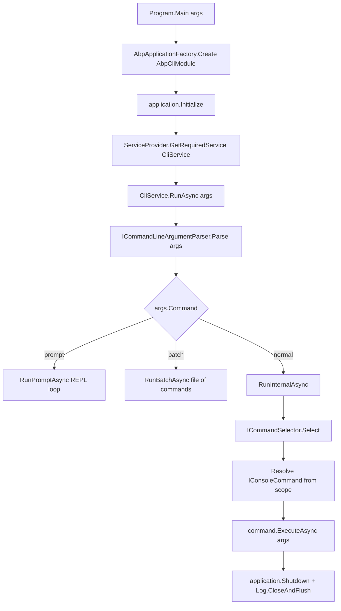
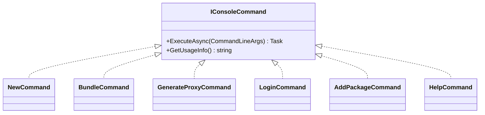
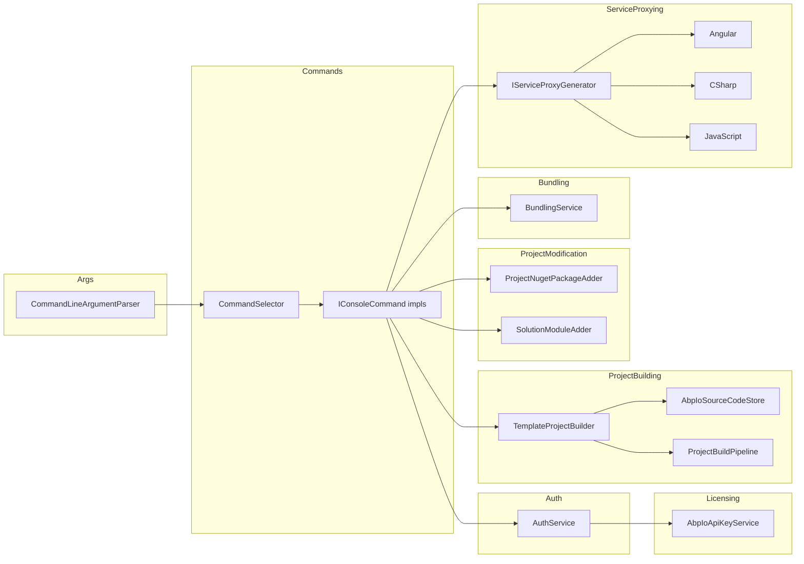

The ABP Framework ships a `dotnet` global tool called `Volo.Abp.Cli` whose job is to scaffold new solutions, add and remove pre-built modules, generate service proxies, bundle Blazor assets, log developers into `account.abp.io`, and run a handful of repository-maintenance commands. This page is the map for the other seven pages in this section — it walks the layering between `framework/src/Volo.Abp.Cli` (the thin host) and `framework/src/Volo.Abp.Cli.Core` (where the real work lives), and it shows how a string like `abp new Acme.Books -t app` becomes an `IConsoleCommand.ExecuteAsync` call.

## Two assemblies, one tool

`framework/src/Volo.Abp.Cli/Volo/Abp/Cli/Program.cs` is the dotnet-tool entry point and contains nothing more than `Main`, Serilog wiring, and a call into `CliService.RunAsync`. All command implementations, all DI registrations, all template handling, every HTTP client — everything else — sits in `framework/src/Volo.Abp.Cli.Core/Volo/Abp/Cli/`. The split exists so unit tests and the Studio CLI can reuse the core without pulling in Autofac and Serilog.

| Assembly | Project file | Role |
| --- | --- | --- |
| `Volo.Abp.Cli` | `framework/src/Volo.Abp.Cli/Volo.Abp.Cli.csproj` | dotnet-tool packaging, `Program.Main`, Serilog config, `AbpAutofacModule` |
| `Volo.Abp.Cli.Core` | `framework/src/Volo.Abp.Cli.Core/Volo.Abp.Cli.Core.csproj` | All commands, options, services, HTTP, templates, proxy generators |

The module graph reflects this. `framework/src/Volo.Abp.Cli/Volo/Abp/Cli/AbpCliModule.cs` only depends on `AbpCliCoreModule` and `AbpAutofacModule`:

```csharp
[DependsOn(
    typeof(AbpCliCoreModule),
    typeof(AbpAutofacModule)
)]
public class AbpCliModule : AbpModule
{

}
```

`framework/src/Volo.Abp.Cli.Core/Volo/Abp/Cli/AbpCliCoreModule.cs` then depends on the runtime pieces it actually needs: `AbpDddDomainModule`, `AbpJsonModule`, `AbpIdentityModelModule`, `AbpMinifyModule`, `AbpHttpModule`, and `AbpLocalizationModule`. That last set is what lets one CLI process do JSON serialization for `api/abp/api-definition`, OIDC password-grant flows against `account.abp.io`, and JS/CSS minification for the `bundle` command — all without re-implementing those concerns.

## The runtime loop



Every box maps to a concrete file in the repo. `Program.cs` performs steps 1–3 and 14, `CliService.cs` covers 4–6 and dispatches to the three runner methods, and the boxes below the diamond live in their own files inside `Commands/`.

## `CliService` is the conductor

`framework/src/Volo.Abp.Cli.Core/Volo/Abp/Cli/CliService.cs` is registered as `ITransientDependency` and is the single class that `Program.Main` resolves. Its constructor pulls in every cross-cutting collaborator the CLI needs:

```csharp
public CliService(
    ICommandLineArgumentParser commandLineArgumentParser,
    ICommandSelector commandSelector,
    IServiceScopeFactory serviceScopeFactory,
    PackageVersionCheckerService nugetService,
    ICmdHelper cmdHelper,
    MemoryService memoryService,
    CliVersionService cliVersionService,
    ITelemetryService telemetryService,
    IMcpLogger mcpLogger)
```

`RunAsync` prints the banner (skipped for `mcp` to keep the JSON-RPC stdout stream clean), optionally calls `CheckCliVersionAsync` (which talks to NuGet through `PackageVersionCheckerService` and remembers the result in `MemoryService` under `CliConsts.MemoryKeys.LatestCliVersionCheckDate`), wraps the whole thing in a telemetry `TrackActivityAsync(ActivityNameConsts.AbpCliRun)`, and finally calls one of three runner methods.

| Sub-command keyword | Runner method | What it does |
| --- | --- | --- |
| `prompt` | `RunPromptAsync` | Reads lines from `Console.ReadLine`, parses each into `CommandLineArgs`, and re-enters `RunInternalAsync` until the user types `exit`. |
| `batch` | `RunBatchAsync` | Opens `commandLineArgs.Target` as a text file, ignores lines starting with `#`, and runs each remaining line through `RunInternalAsync`. |
| _(anything else)_ | `RunInternalAsync` | One-shot path used for normal `abp <command>` invocations. |

`RunInternalAsync` is six lines but is the heart of the system — it asks the selector for a `Type`, opens an `IServiceScope`, resolves that type as `IConsoleCommand`, and calls `ExecuteAsync`:

```csharp
private async Task RunInternalAsync(CommandLineArgs commandLineArgs)
{
    var commandType = CommandSelector.Select(commandLineArgs);

    using (var scope = ServiceScopeFactory.CreateScope())
    {
        var command = (IConsoleCommand)scope.ServiceProvider.GetRequiredService(commandType);
        await command.ExecuteAsync(commandLineArgs);
    }
}
```

The new scope-per-command pattern matters: it gives commands their own DI scope so transient services (HTTP handlers, file readers) get fresh instances and any disposables they own are cleaned up between commands when running under `prompt` or `batch`.

## How arguments are parsed

`framework/src/Volo.Abp.Cli.Core/Volo/Abp/Cli/Args/CommandLineArgumentParser.cs` is a hand-rolled parser, not a third-party library. The grammar is positional: argv\[0] is the command (`new`, `bundle`, `add-package`, …), argv\[1] is the optional `Target` (a project name, a package id, a username — whatever the command interprets), and everything after that is a stream of `-x value` / `--xxx value` pairs that fill `CommandLineArgs.Options`.

```csharp
public class CommandLineArgs
{
    [CanBeNull] public string Command { get; }
    [CanBeNull] public string Target { get; }
    [NotNull]   public AbpCommandLineOptions Options { get; }
    // ...
    public bool IsCommand(string command)
        => string.Equals(Command, command, StringComparison.OrdinalIgnoreCase);
}
```

`AbpCommandLineOptions` derives from `Dictionary<string, string>` (`framework/src/Volo.Abp.Cli.Core/Volo/Abp/Cli/Args/AbpCommandLineOptions.cs`) and exposes a `GetOrNull(name, params alternativeNames)` helper — that is why every command class declares twin `Short`/`Long` constants and calls `GetOrNull(Options.X.Short, Options.X.Long)`.

`CommandLineArgsExtensions.IsMcpCommand` adds a single extension method to make the `mcp` carve-out in `Program.cs` and `CliService.RunAsync` self-documenting.

## How commands are discovered

There is no reflection scan. Every command is explicitly added to a dictionary in `AbpCliCoreModule.ConfigureServices`:

```csharp
Configure<AbpCliOptions>(options =>
{
    options.Commands[HelpCommand.Name]            = typeof(HelpCommand);
    options.Commands[NewCommand.Name]             = typeof(NewCommand);
    options.Commands[AddPackageCommand.Name]      = typeof(AddPackageCommand);
    options.Commands[AddModuleCommand.Name]       = typeof(AddModuleCommand);
    options.Commands[BuildCommand.Name]           = typeof(BuildCommand);
    options.Commands[BundleCommand.Name]          = typeof(BundleCommand);
    options.Commands[GenerateProxyCommand.Name]   = typeof(GenerateProxyCommand);
    options.Commands[RemoveProxyCommand.Name]     = typeof(RemoveProxyCommand);
    options.Commands[InstallLibsCommand.Name]     = typeof(InstallLibsCommand);
    options.Commands[LoginCommand.Name]           = typeof(LoginCommand);
    options.Commands[LogoutCommand.Name]          = typeof(LogoutCommand);
    options.Commands[McpCommand.Name]             = typeof(McpCommand);
    // ... and ~20 more
});
```

`AbpCliOptions` (`framework/src/Volo.Abp.Cli.Core/Volo/Abp/Cli/AbpCliOptions.cs`) is the public extension point: an integrating module can `Configure<AbpCliOptions>` and add its own `IConsoleCommand` type to the same dictionary. The dictionary is `StringComparer.OrdinalIgnoreCase`, so `abp NEW` and `abp new` resolve identically.

`CommandSelector` (`Commands/CommandSelector.cs`) is the dumbest possible map lookup — see [`/cli/command-selector`](/cli/command-selector) for the full breakdown:

```csharp
public Type Select(CommandLineArgs commandLineArgs)
{
    if (commandLineArgs.Command.IsNullOrWhiteSpace())
    {
        return typeof(HelpCommand);
    }

    return Options.Commands.GetOrDefault(commandLineArgs.Command)
           ?? typeof(HelpCommand);
}
```

The "default to help" fallback is what makes both `abp` and `abp something-that-does-not-exist` print the command list.

## What every command implements

`framework/src/Volo.Abp.Cli.Core/Volo/Abp/Cli/Commands/IConsoleCommand.cs` is two methods:

```csharp
public interface IConsoleCommand
{
    Task ExecuteAsync(CommandLineArgs commandLineArgs);
    string GetUsageInfo();
}
```

Most commands also declare a `public const string Name = "..."` and a `public static string GetShortDescription()`. `HelpCommand` uses reflection on those static members to render the global command list, which means a command that forgets `GetShortDescription` simply gets skipped in the listing.



## The command catalog

The table below maps every entry in `AbpCliCoreModule.ConfigureServices` to the file it lives in and to the page in this section that goes deep on it.

| Command keyword | Class | File | Deep-dive |
| --- | --- | --- | --- |
| `help` | `HelpCommand` | `Commands/HelpCommand.cs` | [Command selector](/cli/command-selector) |
| `prompt` | `PromptCommand` | `Commands/PromptCommand.cs` | [Program & bootstrap](/cli/program-and-bootstrap) |
| `new` | `NewCommand` | `Commands/NewCommand.cs` | [Templates & bundling](/cli/templates-and-bundling) |
| `get-source` | `GetSourceCommand` | `Commands/GetSourceCommand.cs` | [Project building](/cli/project-building) |
| `update` | `UpdateCommand` | `Commands/UpdateCommand.cs` | [Project modification](/cli/project-modification) |
| `add-package` | `AddPackageCommand` | `Commands/AddPackageCommand.cs` | [Project modification](/cli/project-modification) |
| `add-module` | `AddModuleCommand` | `Commands/AddModuleCommand.cs` | [Project modification](/cli/project-modification) |
| `list-modules` | `ListModulesCommand` | `Commands/ListModulesCommand.cs` | [Project modification](/cli/project-modification) |
| `list-templates` | `ListTemplatesCommand` | `Commands/ListTemplatesCommand.cs` | [Templates & bundling](/cli/templates-and-bundling) |
| `login` | `LoginCommand` | `Commands/LoginCommand.cs` | [Auth & licensing](/cli/auth-and-licensing) |
| `login-info` | `LoginInfoCommand` | `Commands/LoginInfoCommand.cs` | [Auth & licensing](/cli/auth-and-licensing) |
| `logout` | `LogoutCommand` | `Commands/LogoutCommand.cs` | [Auth & licensing](/cli/auth-and-licensing) |
| `generate-proxy` | `GenerateProxyCommand` | `Commands/GenerateProxyCommand.cs` | [Service proxying](/cli/service-proxying) |
| `remove-proxy` | `RemoveProxyCommand` | `Commands/RemoveProxyCommand.cs` | [Service proxying](/cli/service-proxying) |
| `suite` | `SuiteCommand` | `Commands/SuiteCommand.cs` | [Command selector](/cli/command-selector) |
| `switch-to-preview` | `SwitchToPreviewCommand` | `Commands/SwitchToPreviewCommand.cs` | [Project modification](/cli/project-modification) |
| `switch-to-stable` | `SwitchToStableCommand` | `Commands/SwitchToStableCommand.cs` | [Project modification](/cli/project-modification) |
| `switch-to-nightly` | `SwitchToNightlyCommand` | `Commands/SwitchToNightlyCommand.cs` | [Project modification](/cli/project-modification) |
| `switch-to-prerc` | `SwitchToPreRcCommand` | `Commands/SwitchToPreRcCommand.cs` | [Project modification](/cli/project-modification) |
| `switch-to-local` | `SwitchToLocal` | `Commands/SwitchToLocalCommand.cs` | [Project modification](/cli/project-modification) |
| `translate` | `TranslateCommand` | `Commands/TranslateCommand.cs` | [Command selector](/cli/command-selector) |
| `build` | `BuildCommand` | `Commands/BuildCommand.cs` | [Project building](/cli/project-building) |
| `bundle` | `BundleCommand` | `Commands/BundleCommand.cs` | [Templates & bundling](/cli/templates-and-bundling) |
| `create-migration-and-run-migrator` | `CreateMigrationAndRunMigratorCommand` | `Commands/CreateMigrationAndRunMigratorCommand.cs` | [Project modification](/cli/project-modification) |
| `install-libs` | `InstallLibsCommand` | `Commands/InstallLibsCommand.cs` | [Templates & bundling](/cli/templates-and-bundling) |
| `clean` | `CleanCommand` | `Commands/CleanCommand.cs` | [Project modification](/cli/project-modification) |
| `cli` | `CliCommand` | `Commands/CliCommand.cs` | [Program & bootstrap](/cli/program-and-bootstrap) |
| `clear-download-cache` | `ClearDownloadCacheCommand` | `Commands/ClearDownloadCacheCommand.cs` | [Templates & bundling](/cli/templates-and-bundling) |
| `recreate-initial-migration` | `RecreateInitialMigrationCommand` | `Commands/Internal/RecreateInitialMigrationCommand.cs` | [Project modification](/cli/project-modification) |
| `generate-razor-page` | `GenerateRazorPage` | `Commands/GenerateRazorPage.cs` | [Project modification](/cli/project-modification) |
| `mcp` | `McpCommand` | `Commands/McpCommand.cs` | [Program & bootstrap](/cli/program-and-bootstrap) |

## Subsystem boundaries

Each top-level folder under `framework/src/Volo.Abp.Cli.Core/Volo/Abp/Cli/` is its own subsystem. The CLI is, in effect, a collection of these subsystems wired together by `CliService`:



| Folder | Page that documents it |
| --- | --- |
| `Args/`, `Commands/CommandSelector.cs`, `Commands/HelpCommand.cs` | [Command selector](/cli/command-selector) |
| `ProjectBuilding/`, `ProjectBuilding/Building/`, `ProjectBuilding/Building/Steps/` | [Project building](/cli/project-building) |
| `ProjectModification/`, plus `add-*`, `update`, `switch-to-*`, `clean` commands | [Project modification](/cli/project-modification) |
| `ProjectBuilding/Templates/`, `Bundling/`, `LIbs/` | [Templates & bundling](/cli/templates-and-bundling) and [`/ui-mvc/bundling`](/ui-mvc/bundling) |
| `ServiceProxying/`, plus `generate-proxy` / `remove-proxy` | [Service proxying](/cli/service-proxying) |
| `Auth/`, `Licensing/` | [Auth & licensing](/cli/auth-and-licensing) |

## On-disk artifacts

`framework/src/Volo.Abp.Cli.Core/Volo/Abp/Cli/CliPaths.cs` centralizes every file the CLI reads or writes. Everything lives under `%USERPROFILE%/.abp/` (or `~/.abp/` on Linux) so commands can share state across runs:

```csharp
public static string TemplateCache => Path.Combine(AbpRootPath, "templates");
public static string Log           => Path.Combine(AbpRootPath, "cli", "logs");
public static string AccessToken   => Path.Combine(AbpRootPath, "cli", "access-token.bin");
public static string ComputerId    => Path.Combine(AbpRootPath, "cli", "computer-id.bin");
public static string Memory        => Path.Combine(/* assembly dir */, "memory.bin");
public static string Lic           => Path.Combine(Path.GetTempPath(), /* AbpLicense.bin */);
```

| Path | Owner subsystem | Notes |
| --- | --- | --- |
| `~/.abp/templates/` | `AbpIoSourceCodeStore` | ZIP cache for downloaded templates and modules |
| `~/.abp/cli/logs/abp-cli-logs.txt` | `Program.Main` via Serilog | Plain text Serilog sink |
| `~/.abp/cli/access-token.bin` | `AuthService` | OIDC access token after `abp login` |
| `~/.abp/cli/computer-id.bin` | `Telemetry/` | Stable installation id used by `TelemetrySessionInfoEnricher` |
| `memory.bin` (next to the DLL) | `MemoryService` | Key-value cache, e.g. `LatestCliVersionCheckDate` |
| Temp `AbpLicense.bin` | `AbpIoApiKeyService` / `AuthService` | License code dropped at logout |

## Version channels

`CliService.GetUpdateChannel` reads the current package version and decides which NuGet channel to look at. This is a tidy, self-contained enum that also explains the `switch-to-*` commands:

| Channel | Detection rule (in `CliService.cs`) | NuGet feed |
| --- | --- | --- |
| `Stable` | `!currentCliVersion.IsPrerelease` | `Volo.Abp.Cli` on nuget.org |
| `Prerelease` | Has a release label that is not `preview` or `dev` | `Volo.Abp.Cli` with `includeReleaseCandidates: true` |
| `Nightly` | Release label contains `"preview"` | `https://www.myget.org/F/abp-nightly/api/v3/index.json` |
| `Development` | Release label contains `"dev"` | Same nightly feed, with `dotnet tool uninstall` + `install` |

`LogNewVersionInfo` then prints the matching `dotnet tool update` / `install` command pair. Pre-release upgrades use uninstall+install because of [dotnet/sdk#2551](https://github.com/dotnet/sdk/issues/2551), which the source code explicitly references.

## Error handling and exit codes

`CliService.RunAsync` catches two kinds of exceptions deliberately:

- `CliUsageException` (`framework/src/Volo.Abp.Cli.Core/Volo/Abp/Cli/CliUsageException.cs`) is the "the user typed it wrong" channel. Almost every command throws one when a required `Target` or option is missing, attaching `GetUsageInfo()` to the message. `CliService` logs it at `LogWarning` and sets `Environment.ExitCode = 1`.
- Any other `Exception` is logged via `Logger.LogException(ex)`, reported through `_telemetryService.AddErrorActivityAsync`, and re-thrown so the process exits non-zero.

For `mcp` invocations both branches re-route the log through `_mcpLogger.Error(McpLogSource, ...)` to avoid corrupting the JSON-RPC stdout stream — the same reason the banner is suppressed.

## Where to read next

<CardGroup cols={2}>
  <Card title="Program & bootstrap" href="/cli/program-and-bootstrap">
    Serilog setup, `AbpApplicationFactory`, MCP-aware logging, and shutdown.
  </Card>
  <Card title="Command selector" href="/cli/command-selector">
    `ICommandSelector`, the `Commands` dictionary, and how `HelpCommand` discovers everything.
  </Card>
  <Card title="Project building" href="/cli/project-building">
    `TemplateProjectBuilder`, `ProjectBuildContext`, and the pipeline of `ProjectBuildPipelineStep` instances.
  </Card>
  <Card title="Project modification" href="/cli/project-modification">
    `ProjectNugetPackageAdder`, `SolutionModuleAdder`, and `add-package` / `add-module`.
  </Card>
  <Card title="Templates & bundling" href="/cli/templates-and-bundling">
    `abp new` template fetch, `BundleCommand`, and `install-libs`.
  </Card>
  <Card title="Service proxying" href="/cli/service-proxying">
    `IServiceProxyGenerator`, Angular schematics, C# `ClientProxyBase`, jQuery JS.
  </Card>
  <Card title="Auth & licensing" href="/cli/auth-and-licensing">
    `LoginCommand`, OIDC password / device flow, `IApiKeyService`, and the on-disk cookie.
  </Card>
  <Card title="MVC bundling" href="/ui-mvc/bundling">
    The runtime bundle pipeline that the CLI's `bundle` command mirrors for Blazor.
  </Card>
</CardGroup>
