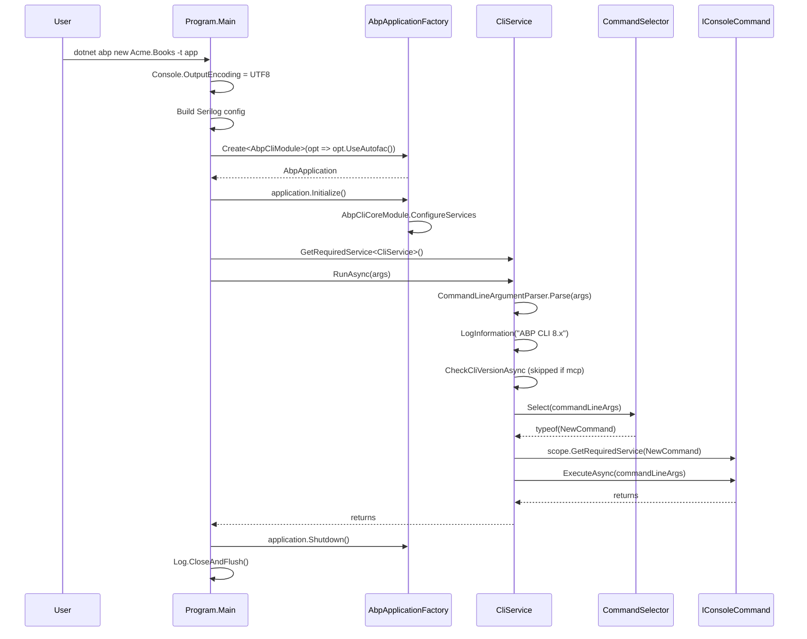
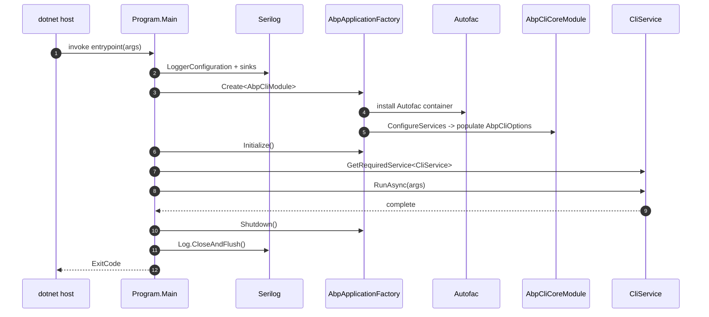

The ABP Framework packages the CLI as a `dotnet` global tool. This page traces the process from the moment `dotnet abp …` launches `Volo.Abp.Cli.exe` to the moment the host disposes — what Serilog sinks are configured, why MCP gets its own log file, how `AbpApplicationFactory` is used in a console host (not the usual ASP.NET host), and what the `prompt` and `batch` runners do beyond the normal one-shot flow. The two files in scope are `framework/src/Volo.Abp.Cli/Volo/Abp/Cli/Program.cs` and `framework/src/Volo.Abp.Cli/Volo/Abp/Cli/AbpCliModule.cs`, both intentionally tiny.

## The full `Program.Main`

`framework/src/Volo.Abp.Cli/Volo/Abp/Cli/Program.cs` is ~60 lines. It does five things in order: set the console encoding, build the Serilog config, branch the file sink on `mcp`, run the ABP application, and call `Log.CloseAndFlush()`. The literal source:

```csharp
public class Program
{
    private static async Task Main(string[] args)
    {
        Console.OutputEncoding = System.Text.Encoding.UTF8;

        var loggerOutputTemplate = "{Message:lj}{NewLine}{Exception}";
        var config = new LoggerConfiguration()
            .MinimumLevel.Information()
            .MinimumLevel.Override("Microsoft", LogEventLevel.Warning)
            .MinimumLevel.Override("Volo.Abp", LogEventLevel.Warning)
            .MinimumLevel.Override("System.Net.Http.HttpClient", LogEventLevel.Warning)
            .MinimumLevel.Override("Volo.Abp.IdentityModel", LogEventLevel.Information)
#if DEBUG
            .MinimumLevel.Override("Volo.Abp.Cli", LogEventLevel.Debug)
#else
            .MinimumLevel.Override("Volo.Abp.Cli", LogEventLevel.Information)
#endif
            .Enrich.FromLogContext();

        if (args.Length > 0 && args[0].Equals("mcp", StringComparison.OrdinalIgnoreCase))
        {
            Log.Logger = config
                .WriteTo.File(Path.Combine(CliPaths.Log, "abp-cli-mcp-logs.txt"), outputTemplate: loggerOutputTemplate)
                .CreateLogger();
        }
        else
        {
            Log.Logger = config
                .WriteTo.File(Path.Combine(CliPaths.Log, "abp-cli-logs.txt"), outputTemplate: loggerOutputTemplate)
                .WriteTo.Console(theme: AnsiConsoleTheme.Sixteen, outputTemplate: loggerOutputTemplate)
                .CreateLogger();
        }

        using (var application = AbpApplicationFactory.Create<AbpCliModule>(
            options =>
            {
                options.UseAutofac();
                options.Services.AddLogging(c => c.AddSerilog());
            }))
        {
            application.Initialize();

            await application.ServiceProvider
                .GetRequiredService<CliService>()
                .RunAsync(args);

            application.Shutdown();

            Log.CloseAndFlush();
        }
    }
}
```

Everything else in this page is a deep-dive on those lines.

## Why UTF-8 first

`Console.OutputEncoding = System.Text.Encoding.UTF8` runs before anything else because the CLI writes JSON (`abp generate-proxy` output), trademark glyphs in `account.abp.io` license messages, and CJK module descriptions. Without this line, Windows consoles using `CP437` corrupt non-ASCII bytes from `Logger.LogInformation` calls inside commands such as `LoginInfoCommand` (`Commands/LoginInfoCommand.cs`) which print user names from the licensing portal.

It is also required by `Encoding.RegisterProvider(CodePagesEncodingProvider.Instance)` in `AbpCliCoreModule.ConfigureServices` — the CLI later parses files with non-default encodings (e.g. legacy `csproj` files) and that helper relies on the same encoding stack having been initialized.

## Serilog configuration

The CLI uses Serilog directly rather than `ILoggingBuilder` because the host is not an ASP.NET host — there is no `appsettings.json` reload, no `IHostBuilder`, no `Configuration` pipeline. The minimum levels are deliberately tuned:

| Override | Effect |
| --- | --- |
| Root `Information` | Default for `IConsoleCommand` user output. |
| `Microsoft` → `Warning` | Suppresses `Microsoft.Extensions.*` plumbing noise. |
| `Volo.Abp` → `Warning` | Hides framework startup chatter from `AbpApplicationFactory` itself. |
| `System.Net.Http.HttpClient` → `Warning` | Quiets every `CliHttpClientFactory` request log line. |
| `Volo.Abp.IdentityModel` → `Information` | Keeps `IdentityModelAuthenticationService` token-acquisition messages, which power `AuthService.LoginAsync`. |
| `Volo.Abp.Cli` → `Debug` (DEBUG) / `Information` (RELEASE) | Lets developers see every command's chatter when running from source. |

The output template `"{Message:lj}{NewLine}{Exception}"` deliberately omits the timestamp and category — CLI users want clean tool output, not `2024-01-01T12:34:56.789 INFO Volo.Abp.Cli.Commands.NewCommand …`.

```mermaid
flowchart LR
    A[Program.Main args] --> B[Console.OutputEncoding UTF8]
    B --> C[LoggerConfiguration]
    C --> D{ args[0] == mcp }
    D -- yes --> E[File sink abp-cli-mcp-logs.txt]
    D -- no --> F[File sink abp-cli-logs.txt + AnsiConsoleTheme.Sixteen console]
    E --> G[Log.Logger]
    F --> G
    G --> H[AbpApplicationFactory.Create AbpCliModule]
```

## MCP changes the sink set

Lines 21–30 detect `args[0] == "mcp"` and drop the `WriteTo.Console` sink entirely. This is critical: the [Model Context Protocol](https://modelcontextprotocol.io/) sub-server implemented by `Commands/McpCommand.cs` speaks JSON-RPC over **stdout**. Any stray Serilog line on stdout would corrupt the wire protocol and the host (Claude Desktop, Cursor, etc.) would disconnect.

The same case-insensitive match (`StringComparison.OrdinalIgnoreCase`) is mirrored inside `CliService.RunAsync` via `CommandLineArgsExtensions.IsMcpCommand` (`Args/CommandLineArgsExtensions.cs`), which suppresses both the `ABP CLI <version>` banner and the version-check warning:

```csharp
public static bool IsMcpCommand(this CommandLineArgs args)
{
    return args.IsCommand(McpCommand.Name);
}
```

`CliPaths.Log` resolves to `~/.abp/cli/logs`, and the two files are deliberately separated so an interactive `abp` session and an MCP session can run side-by-side without trampling each other's log buffers.

## `AbpApplicationFactory` with `UseAutofac`

The next block is the standard ABP host bootstrap, just without a web server:

```csharp
using (var application = AbpApplicationFactory.Create<AbpCliModule>(
    options =>
    {
        options.UseAutofac();
        options.Services.AddLogging(c => c.AddSerilog());
    }))
{
    application.Initialize();

    await application.ServiceProvider
        .GetRequiredService<CliService>()
        .RunAsync(args);

    application.Shutdown();

    Log.CloseAndFlush();
}
```

Three things matter here:

1. **`UseAutofac()`** — switches the underlying DI container from the default `Microsoft.Extensions.DependencyInjection` container to Autofac. ABP modules can rely on property injection and richer interception, which `CliService`'s `ILogger<CliService>` property uses (`Logger { get; set; }` pattern visible across every `*Command` class).
2. **`AddLogging(c => c.AddSerilog())`** — bridges `Microsoft.Extensions.Logging` (what every command takes as `ILogger<T>`) to the global `Log.Logger` configured a few lines earlier.
3. **`application.Initialize()`** runs the entire module-pre-config / config / init lifecycle, including `AbpCliCoreModule.ConfigureServices` where the `Commands` dictionary is populated.

The `using` block guarantees `application.Shutdown()` and Autofac container disposal even when a command throws. `Log.CloseAndFlush()` is called explicitly because Serilog buffers writes — losing the last few log lines would defeat the purpose of having a file sink for postmortems.

## `AbpCliModule` is a module manifest

`framework/src/Volo.Abp.Cli/Volo/Abp/Cli/AbpCliModule.cs` is intentionally empty:

```csharp
[DependsOn(
    typeof(AbpCliCoreModule),
    typeof(AbpAutofacModule)
)]
public class AbpCliModule : AbpModule
{

}
```

It is a one-line bridge between the `dotnet` tool packaging assembly and the core. Anyone integrating the CLI into another host — for example the Studio CLI — depends on `AbpCliCoreModule` directly and is free to skip `AbpAutofacModule`. See [`/cli/overview`](/cli/overview) for the side-by-side view of the two assemblies.

## `AbpCliCoreModule` is where work happens

`framework/src/Volo.Abp.Cli.Core/Volo/Abp/Cli/AbpCliCoreModule.cs` registers HttpClients, the `Commands` map, the proxy generator map, and the telemetry pipeline. Highlights:

```csharp
context.Services.AddHttpClient(CliConsts.HttpClientName)
    .ConfigurePrimaryHttpMessageHandler(() => new CliHttpClientHandler());

context.Services.AddHttpClient(CliConsts.GithubHttpClientName, client =>
{
    client.DefaultRequestHeaders.UserAgent.ParseAdd("MyAgent/1.0");
});

Encoding.RegisterProvider(CodePagesEncodingProvider.Instance);

Configure<AbpCliOptions>(options =>
{
    options.Commands[HelpCommand.Name]   = typeof(HelpCommand);
    // ... ~30 more
});

Configure<AbpCliServiceProxyOptions>(options =>
{
    options.Generators[JavaScriptServiceProxyGenerator.Name] = typeof(JavaScriptServiceProxyGenerator);
    options.Generators[AngularServiceProxyGenerator.Name]    = typeof(AngularServiceProxyGenerator);
    options.Generators[CSharpServiceProxyGenerator.Name]     = typeof(CSharpServiceProxyGenerator);
});

ConfigureTelemetry(context.Services);
```

| HTTP client name | Default headers | Used by |
| --- | --- | --- |
| `CliConsts.HttpClientName` ("AbpHttpClient") | `CliHttpClientHandler` adds the Bearer token from `CliPaths.AccessToken` when needed | `AuthService`, `AbpIoApiKeyService`, `AbpIoSourceCodeStore`, every proxy generator |
| `CliConsts.GithubHttpClientName` ("GithubHttpClient") | `User-Agent: MyAgent/1.0` (GitHub rejects requests without UA) | `GitHub/` helpers, `latest-versions.json` checks |

## Telemetry opt-out

`ConfigureTelemetry` reads the `ABP_STUDIO_ENABLE_TELEMETRY` environment variable across Machine, User, and Process scopes, in that order. The behavior is intentionally opt-out:

```csharp
if (enableTelemetryEnvironmentVariable.IsNullOrEmpty()
    || !enableTelemetryEnvironmentVariable.Equals("false", StringComparison.InvariantCultureIgnoreCase))
{
    services.Remove(services.First(p => p.ImplementationType == typeof(TelemetrySessionInfoEnricher)));
}
else
{
    services.Replace(ServiceDescriptor.Singleton<ITelemetryService, NullTelemetryService>());
}
```

Telemetry is enabled by default (variable unset → "not false" → enabled, but `TelemetrySessionInfoEnricher` is removed because the enricher is only needed inside Studio). Setting the variable to `"false"` (any case) replaces `ITelemetryService` with `NullTelemetryService`, turning every `TrackActivityAsync` and `AddActivityAsync` call inside `CliService` into a no-op. The relevant Activity name constants — `ActivityNameConsts.AbpCliRun`, `AbpCliExit`, `AbpCliCommandsNewSolution`, `AbpCliCommandsAddPackage` — are defined in `Volo.Abp.Internal.Telemetry`.

## Resolving `CliService` from the container

`Program.Main` calls:

```csharp
await application.ServiceProvider
    .GetRequiredService<CliService>()
    .RunAsync(args);
```

`CliService` is registered automatically through the conventional `ITransientDependency` marker:

```csharp
public class CliService : ITransientDependency
{
    public CliService(
        ICommandLineArgumentParser commandLineArgumentParser,
        ICommandSelector commandSelector,
        IServiceScopeFactory serviceScopeFactory,
        PackageVersionCheckerService nugetService,
        ICmdHelper cmdHelper,
        MemoryService memoryService,
        CliVersionService cliVersionService,
        ITelemetryService telemetryService,
        IMcpLogger mcpLogger) { /* ... */ }
}
```

That single ctor pulls every infrastructure piece the runtime loop needs:

| Dependency | File | Why it is injected at this level |
| --- | --- | --- |
| `ICommandLineArgumentParser` | `Args/CommandLineArgumentParser.cs` | Parse argv into `CommandLineArgs`. |
| `ICommandSelector` | `Commands/CommandSelector.cs` | Map `Command` string to `Type`. |
| `IServiceScopeFactory` | DI built-in | Open a per-command scope. |
| `PackageVersionCheckerService` | `Commands/Services/PackageVersionCheckerService.cs` | Talk to NuGet for upgrade hints. |
| `ICmdHelper` | `Utils/CmdHelper.cs` | Shell out to `dotnet`, `git`, `npm`, `ng`. |
| `MemoryService` | `Memory/MemoryService.cs` | Cache the "last version-check date" in `memory.bin`. |
| `CliVersionService` | `Version/CliVersionService.cs` | Read the running tool version via `dotnet tool list -g`. |
| `ITelemetryService` | `Volo.Abp.Internal.Telemetry` | Wrap each command in an Activity. |
| `IMcpLogger` | `Telemetry/IMcpLogger.cs` | Side-channel logger that does not go to stdout. |

## The runtime loop in detail



## `RunAsync` — the three modes

`CliService.RunAsync` decides between three runner methods by looking at the *string* command (no enum, no routing table). The logic is:

```csharp
if (commandLineArgs.IsCommand("prompt"))
{
    await RunPromptAsync();
}
else if (commandLineArgs.IsCommand("batch"))
{
    await RunBatchAsync(commandLineArgs);
}
else
{
    await RunInternalAsync(commandLineArgs);
}
```

| Mode | Trigger | Loop body | Where it lives |
| --- | --- | --- | --- |
| One-shot | `abp <anything except prompt/batch>` | `RunInternalAsync` resolves the command in a new scope and executes once. | `CliService.RunInternalAsync` |
| REPL | `abp prompt` | `RunPromptAsync` reads `Console.ReadLine` in a loop until `exit`. | `CliService.RunPromptAsync` |
| Batch | `abp batch commands.txt` | Reads the file line-by-line; lines starting with `#` are comments, inline `#` truncates the line. | `CliService.RunBatchAsync` |

### Prompt mode

`RunPromptAsync` shows why `CliService` opens a fresh `IServiceScope` per command:

```csharp
private async Task RunPromptAsync()
{
    string GetPromptInput()
    {
        Console.WriteLine("Enter the command to execute or `exit` to exit the prompt model");
        Console.Write("> ");
        return Console.ReadLine();
    }

    var promptInput = GetPromptInput();
    do
    {
        try
        {
            var commandLineArgs = CommandLineArgumentParser.Parse(
                promptInput.Split(" ").Where(x => !x.IsNullOrWhiteSpace()).ToArray());

            if (commandLineArgs.IsCommand("batch"))   { await RunBatchAsync(commandLineArgs); }
            else                                      { await RunInternalAsync(commandLineArgs); }
        }
        catch (CliUsageException usageException) { Logger.LogWarning(usageException.Message); }
        catch (Exception ex)                     { Logger.LogException(ex); }

        promptInput = GetPromptInput();
    } while (promptInput?.ToLower() != "exit");
}
```

A long-lived prompt session repeatedly invokes commands that reach out to NuGet, the file system, and `account.abp.io`. Without per-call scopes, transient HttpClients and FileStreams from `AbpIoSourceCodeStore` would pile up.

### Batch mode

`RunBatchAsync` accepts a file path through `commandLineArgs.Target`:

```csharp
var filePath = Path.Combine(Directory.GetCurrentDirectory(), targetFile);
var fileLines = File.ReadAllLines(filePath);
foreach (var line in fileLines)
{
    var lineText = line;
    if (lineText.IsNullOrWhiteSpace() || lineText.StartsWith("#")) { continue; }

    if (lineText.Contains('#'))
    {
        lineText = lineText.Substring(0, lineText.IndexOf('#'));
    }

    var args = CommandLineArgumentParser.Parse(lineText);
    await RunInternalAsync(args);
}
```

A typical batch file used by scripted maintenance pipelines:

```text
# Refresh local dependencies after a framework bump
update                     # bump every Volo.Abp.* reference
install-libs               # restore wwwroot/libs
bundle -t webassembly      # rebuild the Blazor bundle
```

## Version check pre-flight

Before dispatching to a command, `RunAsync` performs a version check, but only when:

- The build is `RELEASE` (the call site is guarded by `#if !DEBUG`).
- The command is *not* `mcp` (no banner, no stdout chatter).
- `commandLineArgs.Options` does not contain `skip-cli-version-check`.

`CheckCliVersionAsync` calls `MemoryService.GetAsync(CliConsts.MemoryKeys.LatestCliVersionCheckDate)` to throttle to once-per-day. The check itself goes through `PackageVersionCheckerService`, which respects the `UpdateChannel` derived from the running version (`Stable`, `Prerelease`, `Nightly`, `Development`). When a newer version is found it prints the exact `dotnet tool update` / `install` command — see [`/cli/overview`](/cli/overview) for the per-channel rules.

## Error envelope

The `try`/`catch` around the command dispatch is intentionally narrow:

```csharp
try
{
    await using var _ = _telemetryService.TrackActivityAsync(ActivityNameConsts.AbpCliRun);
    // ... runner dispatch
}
catch (CliUsageException usageException)
{
    if (commandLineArgs.IsMcpCommand())
        _mcpLogger.Error(McpLogSource, usageException.Message);
    else
        Logger.LogWarning(usageException.Message);
    Environment.ExitCode = 1;
}
catch (Exception ex)
{
    await _telemetryService.AddErrorActivityAsync(ex.Message);
    if (commandLineArgs.IsMcpCommand())
        _mcpLogger.Error(McpLogSource, "Fatal error", ex);
    else
        Logger.LogException(ex);
    throw;
}
finally
{
    await _telemetryService.AddActivityAsync(ActivityNameConsts.AbpCliExit);
}
```

| Exception type | Origin | Exit code | Re-thrown? |
| --- | --- | --- | --- |
| `CliUsageException` | `Commands/*Command.cs` when required input is missing | `1` (set explicitly) | No — warning is enough |
| Anything else | NuGet errors, network errors, IO errors, OIDC errors | Whatever the runtime sets after rethrow | Yes — preserves stack |

The `await using` `TrackActivityAsync` guarantees the matching telemetry "exit" event regardless of which branch executes.

## Shutdown

After `RunAsync` returns, `Program.Main` invokes `application.Shutdown()`. ABP's module lifecycle calls every `IAbpApplicationShutdownService` and disposes the container; for the CLI that flushes `MemoryService` writes, releases the Autofac scope holding `CliHttpClientFactory`, and runs any `IDisposable` registered as a singleton. Only after the container is disposed does `Log.CloseAndFlush()` run, so any "goodbye" log lines from shutdown handlers still reach the file sink.

The `using` block on `application` is what guarantees this order — even a fatal exception inside `RunAsync` triggers `Dispose` via stack unwind before re-throwing.

## File-system side-effects of bootstrap

`Program.Main` itself only creates the log file. Everything else is lazy:

| Path | Created by | Why it appears |
| --- | --- | --- |
| `~/.abp/cli/logs/abp-cli-logs.txt` | Serilog file sink in `Program.Main` | Always |
| `~/.abp/cli/logs/abp-cli-mcp-logs.txt` | Same, but only on `mcp` startup | MCP session active |
| `~/.abp/cli/access-token.bin` | `AuthService.LoginAsync` (`Auth/AuthService.cs`) | After successful `abp login` — see [`/cli/auth-and-licensing`](/cli/auth-and-licensing) |
| `memory.bin` (alongside the tool DLL) | `MemoryService.SetAsync` | After the first version check |
| `~/.abp/templates/` | `AbpIoSourceCodeStore.GetAsync` | After the first `abp new` — see [`/cli/project-building`](/cli/project-building) |

## Putting the diagram together



## What to read next

<CardGroup cols={2}>
  <Card title="Overview" href="/cli/overview">
    The CLI's architecture diagram and command catalog at a glance.
  </Card>
  <Card title="Command selector" href="/cli/command-selector">
    The map lookup that turns `commandLineArgs.Command` into a `Type`.
  </Card>
  <Card title="Project building" href="/cli/project-building">
    Where `abp new` actually fetches and rewrites a solution ZIP.
  </Card>
  <Card title="Auth & licensing" href="/cli/auth-and-licensing">
    What the `LoginCommand` flow writes to `~/.abp/cli/access-token.bin`.
  </Card>
</CardGroup>
