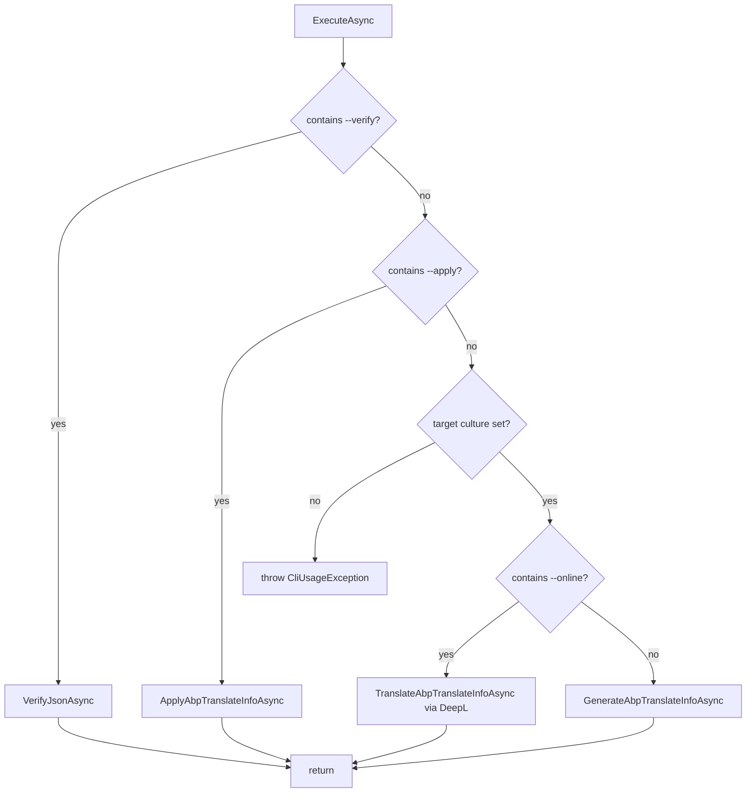

`abp translate` is the ABP Framework's batch tool for handling localization resources. Every framework module ships its texts as JSON files named `<culture>.json`, and the command exists to scan a solution for those files, gather the keys missing from a target culture, write them to a single `abp-translation.json` blob, optionally call DeepL to fill in the values, and finally fold the results back into the per-module JSON files. This page covers the full implementation in `framework/src/Volo.Abp.Cli.Core/Volo/Abp/Cli/Commands/TranslateCommand.cs`, including the DTOs, the directory walk, the apply step, and the `--verify` short-circuit.

## Command surface

`TranslateCommand` is registered as `ITransientDependency` and named `translate`. Its `ExecuteAsync` branches on three mutually exclusive sub-modes — verify, apply, and generate — and a fourth modifier (`--online`) layered over generate:

```csharp
public const string Name = "translate";

public async Task ExecuteAsync(CommandLineArgs commandLineArgs)
{
    var currentDirectory = Directory.GetCurrentDirectory();

    if (commandLineArgs.Options.ContainsKey(Options.Verify.Long))
    {
        await VerifyJsonAsync(currentDirectory);
        return;
    }
    // ...
}
```

The options come from a nested static `Options` class that follows the same `Short` / `Long` convention used throughout the CLI:

| Short | Long | Default | Purpose |
| --- | --- | --- | --- |
| `-c` | `--culture` | _(required for generate)_ | Target culture, e.g. `zh-Hans` |
| `-r` | `--reference-culture` | `en` | Culture whose values seed the reference text |
| `-o` | `--output` | `abp-translation.json` | Output file when generating |
| `-all` | `--all-values` | `false` | Include every key, not just missing ones |
| `-a` | `--apply` | n/a | Apply mode — write `abp-translation.json` back into `<culture>.json` files |
| `-f` | `--file` | `abp-translation.json` | Input file in apply mode |
| `-deepl-auth-key` | n/a | n/a | DeepL API key for `--online` |
| n/a | `--online` | n/a | Translate through DeepL while generating |
| n/a | `--verify` | n/a | JSON-validity sweep without writing anything |

The `GetShortDescription()` is `"Mainly used to translate ABP's resources (JSON files) easier."` and the usage info enumerates every option above plus six example invocations.

## Modes at a glance



## DTOs

`TranslateCommand` ships four POCOs declared as nested public classes. They are the canonical shape of `abp-translation.json` on disk:

```csharp
public class AbpTranslateInfo
{
    public string ReferenceCulture { get; set; }
    public string TargetCulture { get; set; }
    public List<AbpTranslateResource> Resources { get; set; }
}

public class AbpTranslateResource
{
    public string ResourcePath { get; set; }
    public List<AbpTranslateResourceText> Texts { get; set; }
}

public class AbpTranslateResourceText
{
    public string LocalizationKey { get; set; }
    public string Reference { get; set; }
    public string Target { get; set; }
}

public class AbpLocalizationInfo
{
    public string Culture { get; set; }
    public List<NameValue> Texts { get; set; }
}
```

`AbpLocalizationInfo` mirrors the on-disk shape of a per-culture JSON file (`{ "culture": "en", "texts": { ... } }`) and uses the framework's `NameValue` pair from `Volo.Abp.Core` for its keys.

## Finding the JSON files

The directory walk lives in `GetCultureJsonFiles`, which is reused by all three modes. Its filter is two-stage: drop anything under `node_modules`, `wwwroot`, `.git`, `bin`, or `obj`, then keep files whose name matches a known `CultureInfo`:

```csharp
var excludeDirectory = new List<string>()
{
    "node_modules",
    "wwwroot",
    ".git",
    "bin",
    "obj"
};

var allCultureNames = CultureInfo.GetCultures(CultureTypes.AllCultures)
    .Where(x => !x.Name.IsNullOrWhiteSpace())
    .Select(x => x.Name).ToList();
return Directory.GetFiles(path, "*.json", SearchOption.AllDirectories)
    .Where(file => excludeDirectory.All(x => file.IndexOf(x, StringComparison.OrdinalIgnoreCase) == -1))
    .Where(file => allCultureNames.Any(x => Path.GetFileName(file).Equals($"{x}.json", StringComparison.OrdinalIgnoreCase)))
    .WhereIf(!cultureName.IsNullOrWhiteSpace(),
        jsonFile => Path.GetFileName(jsonFile).Equals($"{cultureName}.json", StringComparison.OrdinalIgnoreCase));
```

That `CultureInfo.GetCultures(CultureTypes.AllCultures)` call is the cheapest reliable way to recognise ".../Localization/Foo/zh-Hans.json" as a localization file without false positives such as `package.json` or `appsettings.json`.

## Validating an ABP localization JSON

Not every `<culture>.json` file under a solution is necessarily an ABP localization resource — some modules embed unrelated JSON. `GetAbpLocalizationInfoOrNull` is the gatekeeper: it parses the file as JSON, looks for both a `culture` and a `texts` property (case-insensitive), and returns `null` if either is missing:

```csharp
var culture = jObject.GetValue("culture") ?? jObject.GetValue("Culture");
var texts = jObject.GetValue("texts") ?? jObject.GetValue("Texts");
if (culture == null || texts == null)
{
    return null;
}
```

Returning `null` (rather than throwing) is what lets the generator silently skip non-ABP JSON it stumbles across. Any caller that does require a valid file — for example the apply step — re-throws as `CliUsageException` after seeing `null`.

## Generate mode

`GenerateAbpTranslateInfoAsync` is the most common path. It logs the operation, calls `GetAbpTranslateInfo`, and serialises the result with `Newtonsoft.Json` `Formatting.Indented`:

```csharp
var translateInfo = GetAbpTranslateInfo(currentDirectory, targetCulture, referenceCulture, allValues);
File.WriteAllText(outputFile, JsonConvert.SerializeObject(translateInfo, Formatting.Indented));
Logger.LogInformation($"The translation file has been created.");
```

`GetAbpTranslateInfo` enumerates every reference-culture file (e.g. every `en.json` discovered), turns it into an `AbpTranslateResource`, and merges any existing translations from `<targetCulture>.json` in the same directory:

```csharp
var targetFile = Path.Combine(directoryName, $"{targetCultureName}.json");
if (File.Exists(targetFile))
{
    var targetLocalizationInfo = GetAbpLocalizationInfoOrNull(targetFile);
    foreach (var referenceResourceText in resource.Texts)
    {
        var text = targetLocalizationInfo.Texts.FirstOrDefault(x => x.Name == referenceResourceText.LocalizationKey);
        referenceResourceText.Target = text?.Value ?? string.Empty;
    }
}

if (!allValues)
{
    resource.Texts.RemoveAll(x => !x.Target.Equals(string.Empty));
}
```

When `--all-values` is omitted, the resource only keeps entries whose `Target` is still empty — that is, only the missing translations.

| Input | Output |
| --- | --- |
| `en.json` only | `abp-translation.json` lists every key with empty `Target` |
| `en.json` + partial `zh-Hans.json` | Lists only keys missing from `zh-Hans.json` |
| `en.json` + partial `zh-Hans.json` + `--all-values` | Lists every key, pre-filled where `zh-Hans.json` had a value |

## Apply mode

`ApplyAbpTranslateInfoAsync` is the reverse path. It loads `abp-translation.json`, walks each resource, opens the matching `<targetCulture>.json` (creating it from scratch if absent), and either updates existing entries or inserts new ones:

```csharp
foreach (var text in resource.Texts)
{
    var targetText = targetLocalizationInfo.Texts.FirstOrDefault(x => x.Name == text.LocalizationKey);
    if (targetText != null)
    {
        if (!text.Target.IsNullOrEmpty())
        {
            Logger.LogInformation($"Update translation: {targetText.Name} => " + text.Target);
            targetText.Value = text.Target;
        }
    }
    else
    {
        Logger.LogInformation($"Create translation: {text.LocalizationKey} => " + text.Target);
        targetLocalizationInfo.Texts.Add(new NameValue(text.LocalizationKey, text.Target));
    }
}
```

After applying, the file is sorted to match the key order of the reference culture (more on `SortLocalizedKeys` below), serialised with `AbpLocalizationInfoToJsonFile`, and the original `abp-translation.json` is deleted. The delete is intentional — re-running `abp translate -a` against the same file would no-op or, worse, re-apply stale values:

```csharp
File.Delete(translateJsonPath);
Logger.LogInformation($"Delete the {translateJsonPath} file, if you need to translate again, please re-run the [abp translate] command.");
```

## Key ordering

`SortLocalizedKeys` is what keeps `<culture>.json` files diff-clean across runs. It reuses the reference culture as a source of truth for ordering — every key present in both files ends up in the same order in the output:

```csharp
private static AbpLocalizationInfo SortLocalizedKeys(AbpLocalizationInfo targetLocalizationInfo, AbpLocalizationInfo referenceLocalizationInfo)
{
    var sortedLocalizationInfo = new AbpLocalizationInfo
    {
        Culture = targetLocalizationInfo.Culture,
        Texts = new List<NameValue>()
    };

    foreach (var targetText in referenceLocalizationInfo.Texts.Select(text =>
        targetLocalizationInfo.Texts.FirstOrDefault(x => x.Name == text.Name))
        .Where(targetText => targetText != null))
    {
        sortedLocalizationInfo.Texts.Add(targetText);
    }

    return sortedLocalizationInfo;
}
```

A subtle implication: keys present in the target file but not in the reference file are dropped. That is by design — orphan translations exist because either the source key was renamed or the resource was removed, and they cause stale-text bugs that the sort step catches automatically.

## Online mode (DeepL)

`TranslateAbpTranslateInfoAsync` adds DeepL integration on top of the generate path. It builds the same `AbpTranslateInfo`, but instead of writing it to disk, it streams every resource's reference texts to DeepL and walks the response back into each `Target`:

```csharp
var translator = new Translator(authKey);

var texts = resource.Texts.Select(x => x.Reference);

var translations = await translator.TranslateTextAsync(
    texts,
    await GetDeeplLanguageCode(referenceCulture),
    await GetDeeplLanguageCode(targetCulture));
for (var i = 0; i < translations.Length; i++)
{
    resource.Texts[i].Target = translations[i].Text;
}
```

The DeepL client comes from the `DeepL` NuGet package. After translation, the same update-or-insert logic from apply mode runs and the per-culture JSON file is written directly — there is no intermediate `abp-translation.json`. That makes `--online` a one-step batch command useful in CI pipelines that want to keep all translations fresh against a single source of truth.

## Culture mapping for DeepL

DeepL does not share ABP's culture codes. `GetDeeplLanguageCode` carries an allow-list and a one-off translation for `zh-Hans`:

```csharp
var deeplLanguages = new List<string>()
{
    LanguageCode.Bulgarian,
    LanguageCode.Czech,
    LanguageCode.Danish,
    LanguageCode.German,
    LanguageCode.Greek,
    LanguageCode.English,
    LanguageCode.EnglishBritish,
    LanguageCode.EnglishAmerican,
    LanguageCode.Spanish,
    LanguageCode.Estonian,
    LanguageCode.Finnish,
    LanguageCode.French,
    LanguageCode.Hungarian,
    // ...
    LanguageCode.Chinese
};

if (abpCulture == "zh-Hans")
{
    return Task.FromResult(LanguageCode.Chinese);
}

var deeplCulture = deeplLanguages.FirstOrDefault(x => x.Equals(abpCulture, StringComparison.OrdinalIgnoreCase));
if (deeplCulture == null)
{
    throw new CliUsageException(
        $"DeepL does not support {abpCulture} culture." + // ...
    );
}
```

The list covers all DeepL-supported languages as of the SDK version pinned in `Volo.Abp.Cli.Core.csproj`. Cultures outside the list — Persian, Hebrew, Arabic — fail fast before any HTTP call is made.

## Verify mode

`--verify` is a fast diagnostic that does not need a target culture. It enumerates every culture file under the current directory and feeds each one to `JsonLocalizationDictionaryBuilder.BuildFromJsonString` (from `Volo.Abp.Localization.Json`):

```csharp
foreach (var jsonFile in jsonFiles)
{
    try
    {
        var jsonString = File.ReadAllText(jsonFile);
        _ = JsonLocalizationDictionaryBuilder.BuildFromJsonString(jsonString);
    }
    catch (Exception)
    {
        Logger.LogError($"Invalid json file: {jsonFile}");
        hasInvalidJsonFile = true;
    }
}

Logger.LogInformation(!hasInvalidJsonFile ? "All json files are valid." : "Some json files are invalid.");
```

The builder throws if a file has malformed JSON, missing required fields, or a duplicate key. That is exactly the check the framework's own runtime performs at module-initialisation time, so passing `abp translate --verify` is a strong proxy for "no localization-related startup crash".

## Serialisation oddity

`AbpLocalizationInfoToJsonFile` does **not** use `JsonConvert.SerializeObject`. It builds a `JObject` directly because the on-disk format is `{ "culture": "...", "texts": { name: value, ... } }`, but the in-memory shape is `List<NameValue>`:

```csharp
var jObject = new JObject { { "culture", localizationInfo.Culture } };
var value = new JObject();
foreach (var text in localizationInfo.Texts)
{
    value.Add(text.Name, text.Value);
}
jObject.Add("texts", value);
return jObject.ToString();
```

Building the `texts` object key-by-key is what preserves the order returned by `SortLocalizedKeys`. A naive serialise-from-list would either explode (`JsonConvert` cannot represent a list as a JSON object) or lose order (with a `Dictionary<string,string>`).

## Failure surface

Every mode delegates to `GetUsageInfo()` when something is wrong:

| Mode | Failure | Exception |
| --- | --- | --- |
| Generate | Missing `--culture` | `CliUsageException("Target culture is missing!")` |
| Online | Missing `--deepl-auth-key` | `CliUsageException("DeepL auth key is missing!")` |
| Online / Apply | Missing reference culture file | `CliUsageException("{file} does not exist..")` |
| Online / Apply | Invalid target file | `CliUsageException("Failed to get localization information from {file}")` |
| Apply | Missing `abp-translation.json` | `CliUsageException("{path} file does not exist..")` |
| Online | Culture unsupported by DeepL | `CliUsageException("DeepL does not support {culture} culture.")` |

The whole command does not call any networked ABP service except DeepL. That is what makes it safe to run inside locked-down CI runners.

## Cross-references

<CardGroup cols={2}>
  <Card title="CLI Overview" icon="map" href="/cli/overview">
    Where `TranslateCommand` fits in the host.
  </Card>
  <Card title="Command Selector" icon="route" href="/cli/command-selector">
    Resolution of the `translate` command name to `TranslateCommand`.
  </Card>
  <Card title="CLI Core Abstractions" icon="layer-group" href="/cli/cli-core-abstractions">
    `CommandLineArgs.Options.GetOrNull` and the option-parsing rules behind every flag listed above.
  </Card>
  <Card title="MVC Bundling" icon="boxes-packing" href="/ui-mvc/bundling">
    The other JSON-driven CLI command pair.
  </Card>
</CardGroup>
