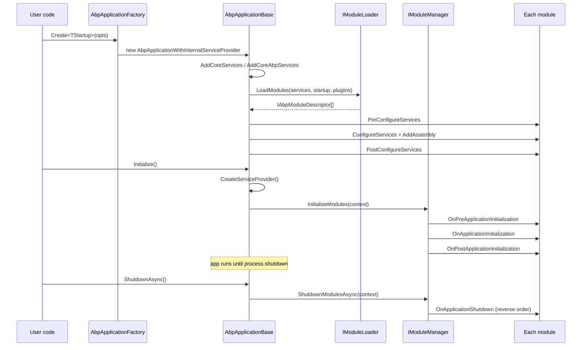

Every ABP Framework process is a single instance of `AbpApplicationBase` that owns one `IServiceCollection`, one `IServiceProvider`, and an ordered, dependency-sorted list of `IAbpModuleDescriptor`. This page traces the bootstrap pipeline from `AbpApplicationFactory.Create` in `framework/src/Volo.Abp.Core/Volo/Abp/AbpApplicationFactory.cs` down through service registration and module initialization, and out to graceful shutdown. The two concrete subclasses — `AbpApplicationWithInternalServiceProvider` and `AbpApplicationWithExternalServiceProvider` — differ only in who owns the provider; the rest of the lifecycle is identical.

## File inventory

| File | Symbol | Role |
| --- | --- | --- |
| `Volo/Abp/AbpApplicationFactory.cs` | `AbpApplicationFactory` | Static `Create` / `CreateAsync` overloads that pick the right variant. |
| `Volo/Abp/AbpApplicationBase.cs` | `AbpApplicationBase` | The shared base class that holds `Services`, `Modules`, and the configuration/init logic. |
| `Volo/Abp/AbpApplicationWithInternalServiceProvider.cs` | `AbpApplicationWithInternalServiceProvider` | Builds its own `IServiceProvider` via `BuildServiceProviderFromFactory().CreateScope()`. |
| `Volo/Abp/AbpApplicationWithExternalServiceProvider.cs` | `AbpApplicationWithExternalServiceProvider` | Expects the host to pass an `IServiceProvider` to `Initialize`. |
| `Volo/Abp/IAbpApplication.cs` | `IAbpApplication` | Public surface: `StartupModuleType`, `Services`, `ServiceProvider`, `ConfigureServicesAsync`, `ShutdownAsync`. |
| `Volo/Abp/IAbpApplicationWithInternalServiceProvider.cs` | `IAbpApplicationWithInternalServiceProvider` | Adds `CreateServiceProvider()`, `Initialize()`, `InitializeAsync()`. |
| `Volo/Abp/IAbpApplicationWithExternalServiceProvider.cs` | `IAbpApplicationWithExternalServiceProvider` | Adds `SetServiceProvider`, `Initialize(sp)`, `InitializeAsync(sp)`. |
| `Volo/Abp/AbpApplicationCreationOptions.cs` | `AbpApplicationCreationOptions` | The DTO the caller mutates inside `optionsAction`. |
| `Volo/Abp/ApplicationInitializationContext.cs` | `ApplicationInitializationContext` | Passed to every `OnApplicationInitialization` hook. |
| `Volo/Abp/ApplicationShutdownContext.cs` | `ApplicationShutdownContext` | Passed to every `OnApplicationShutdown` hook. |
| `Volo/Abp/IAbpHostEnvironment.cs`, `AbpHostEnvironment.cs` | `IAbpHostEnvironment` | Holds `EnvironmentName` independently of `IHostEnvironment`. |
| `Volo/Abp/AbpInitializationException.cs` | `AbpInitializationException` | Thrown when a module's `Configure*` or initialization hook throws. |
| `Volo/Abp/AbpShutdownException.cs` | `AbpShutdownException` | Thrown when a contributor's shutdown hook throws. |

## The two flavours

`AbpApplicationFactory` is the only entry point users ever touch. Its eight overloads cluster into two pairs — sync vs async, and internal-SP vs external-SP — defined in `framework/src/Volo.Abp.Core/Volo/Abp/AbpApplicationFactory.cs`:

```csharp
public static IAbpApplicationWithInternalServiceProvider Create<TStartupModule>(
    Action<AbpApplicationCreationOptions>? optionsAction = null)
    where TStartupModule : IAbpModule
{
    return Create(typeof(TStartupModule), optionsAction);
}

public static IAbpApplicationWithExternalServiceProvider Create(
    [NotNull] Type startupModuleType,
    [NotNull] IServiceCollection services,
    Action<AbpApplicationCreationOptions>? optionsAction = null)
{
    return new AbpApplicationWithExternalServiceProvider(startupModuleType, services, optionsAction);
}
```

The `async` overloads in the same file set `options.SkipConfigureServices = true` before constructing the application, then immediately call `await app.ConfigureServicesAsync()`. That detail matters: the synchronous `Create` calls run `ConfigureServices()` inside the `AbpApplicationBase` constructor, while the async path defers it so the entire pipeline can use `async/await` from module `PreConfigureServicesAsync` to `PostConfigureServicesAsync`.

<Note>
  The internal-SP variant — `AbpApplicationWithInternalServiceProvider` in `framework/src/Volo.Abp.Core/Volo/Abp/AbpApplicationWithInternalServiceProvider.cs` — is the default for console apps and unit tests. The external-SP variant — `AbpApplicationWithExternalServiceProvider` — is what `Microsoft.Extensions.Hosting` based hosts (ASP.NET Core, Generic Host) use, because the host already owns the `IServiceProvider`.
</Note>

## What the base constructor does

`AbpApplicationBase` is `internal`-constructible: only its two subclasses can instantiate it. Its constructor in `framework/src/Volo.Abp.Core/Volo/Abp/AbpApplicationBase.cs` runs the boot sequence in a single pass:

```csharp
internal AbpApplicationBase(
    [NotNull] Type startupModuleType,
    [NotNull] IServiceCollection services,
    Action<AbpApplicationCreationOptions>? optionsAction)
{
    Check.NotNull(startupModuleType, nameof(startupModuleType));
    Check.NotNull(services, nameof(services));

    StartupModuleType = startupModuleType;
    Services = services;

    services.TryAddObjectAccessor<IServiceProvider>();

    var options = new AbpApplicationCreationOptions(services);
    optionsAction?.Invoke(options);

    ApplicationName = GetApplicationName(options);

    services.AddSingleton<IAbpApplication>(this);
    services.AddSingleton<IApplicationInfoAccessor>(this);
    services.AddSingleton<IModuleContainer>(this);
    services.AddSingleton<IAbpHostEnvironment>(new AbpHostEnvironment()
    {
        EnvironmentName = options.Environment
    });

    services.AddCoreServices();
    services.AddCoreAbpServices(this, options);

    Modules = LoadModules(services, options);

    if (!options.SkipConfigureServices)
    {
        ConfigureServices();
    }
}
```

Notice the registration order: `AbpApplicationBase` registers itself three times — as `IAbpApplication`, as `IApplicationInfoAccessor` (giving callers access to `InstanceId` and `ApplicationName`) and as `IModuleContainer` so the future `IAssemblyFinder` and `ModuleManager` can iterate `Modules` without an extra dependency. `services.TryAddObjectAccessor<IServiceProvider>()` writes an `ObjectAccessor<IServiceProvider>` singleton whose `.Value` will be filled in later by `SetServiceProvider` — see [Dependency injection](/core/dependency-injection) for the pattern.

The two helper calls — `AddCoreServices()` and `AddCoreAbpServices(this, options)` — live in `framework/src/Volo.Abp.Core/Volo/Abp/Internal/InternalServiceCollectionExtensions.cs` and do the following:

```csharp
internal static void AddCoreServices(this IServiceCollection services)
{
    services.AddOptions();
    services.AddLogging();
    services.AddLocalization();
}

internal static void AddCoreAbpServices(this IServiceCollection services,
    IAbpApplication abpApplication,
    AbpApplicationCreationOptions applicationCreationOptions)
{
    var moduleLoader = new ModuleLoader();
    var assemblyFinder = new AssemblyFinder(abpApplication);
    // ...
    services.TryAddSingleton<IModuleLoader>(moduleLoader);
    services.TryAddSingleton<IAssemblyFinder>(assemblyFinder);
    services.TryAddSingleton<IInitLoggerFactory>(new DefaultInitLoggerFactory());
    var typeFinder = new TypeFinder(services.GetInitLogger<TypeFinder>(), assemblyFinder);
    services.TryAddSingleton<ITypeFinder>(typeFinder);
    services.AddAssemblyOf<IAbpApplication>();
    services.AddTransient(typeof(ISimpleStateCheckerManager<>), typeof(SimpleStateCheckerManager<>));
    services.AddSingleton(typeof(IStaticDefinitionCache<,>), typeof(StaticDefinitionCache<,>));
    services.Configure<AbpModuleLifecycleOptions>(options =>
    {
        options.Contributors.Add<OnPreApplicationInitializationModuleLifecycleContributor>();
        options.Contributors.Add<OnApplicationInitializationModuleLifecycleContributor>();
        options.Contributors.Add<OnPostApplicationInitializationModuleLifecycleContributor>();
        options.Contributors.Add<OnApplicationShutdownModuleLifecycleContributor>();
    });
}
```

<Warning>
  The order in which the four `IModuleLifecycleContributor` types are added to `AbpModuleLifecycleOptions.Contributors` defines the order in which lifecycle hooks fire across modules. See [Modularity and modules](/core/modularity-and-modules) for the per-contributor expansion.
</Warning>

## AbpApplicationCreationOptions

`AbpApplicationCreationOptions` in `framework/src/Volo.Abp.Core/Volo/Abp/AbpApplicationCreationOptions.cs` is intentionally tiny — three read-only collections (`Services`, `PlugInSources`, `Configuration`) plus three writable scalars (`SkipConfigureServices`, `ApplicationName`, `Environment`):

```csharp
public class AbpApplicationCreationOptions
{
    [NotNull] public IServiceCollection Services { get; }
    [NotNull] public PlugInSourceList PlugInSources { get; }
    [NotNull] public AbpConfigurationBuilderOptions Configuration { get; }
    public bool SkipConfigureServices { get; set; }
    public string? ApplicationName { get; set; }
    public string? Environment { get; set; }
}
```

`PlugInSources` is a `PlugInSourceList` (a `List<IPlugInSource>`) — adding `FolderPlugInSource`, `FilePlugInSource`, or `TypePlugInSource` here is how an application brings in modules that are not statically referenced via `[DependsOn]`. The `Configuration` builder only applies if the caller has not already registered an `IConfiguration` singleton in `Services`, per the check in `InternalServiceCollectionExtensions.AddCoreAbpServices`.

## Loading modules

`AbpApplicationBase.LoadModules` resolves `IModuleLoader` from the *service collection itself* — not the not-yet-built provider — using the `GetSingletonInstance<T>` helper:

```csharp
protected virtual IReadOnlyList<IAbpModuleDescriptor> LoadModules(
    IServiceCollection services,
    AbpApplicationCreationOptions options)
{
    return services
        .GetSingletonInstance<IModuleLoader>()
        .LoadModules(
            services,
            StartupModuleType,
            options.PlugInSources
        );
}
```

The returned `IAbpModuleDescriptor[]` is dependency-sorted with the startup module last. See [Modularity and modules](/core/modularity-and-modules) for the `AbpModuleHelper.FindAllModuleTypes` / `SortByDependencies` algorithm.

## ConfigureServices: the three-phase scan

`ConfigureServices` and its async twin `ConfigureServicesAsync` in `AbpApplicationBase` run three passes over `Modules`. The pseudo-sequence is identical between the two methods — the async version simply `await`s each module hook. The relevant excerpt:

```csharp
public virtual async Task ConfigureServicesAsync()
{
    CheckMultipleConfigureServices();
    var context = new ServiceConfigurationContext(Services);
    Services.AddSingleton(context);

    foreach (var module in Modules)
    {
        if (module.Instance is AbpModule abpModule)
        {
            abpModule.ServiceConfigurationContext = context;
        }
    }

    //PreConfigureServices
    foreach (var module in Modules.Where(m => m.Instance is IPreConfigureServices))
    {
        await ((IPreConfigureServices)module.Instance).PreConfigureServicesAsync(context);
    }

    var assemblies = new HashSet<Assembly>();

    //ConfigureServices
    foreach (var module in Modules)
    {
        if (module.Instance is AbpModule abpModule && !abpModule.SkipAutoServiceRegistration)
        {
            foreach (var assembly in module.AllAssemblies)
            {
                if (!assemblies.Contains(assembly))
                {
                    Services.AddAssembly(assembly);
                    assemblies.Add(assembly);
                }
            }
        }

        await module.Instance.ConfigureServicesAsync(context);
    }

    //PostConfigureServices
    foreach (var module in Modules.Where(m => m.Instance is IPostConfigureServices))
    {
        await ((IPostConfigureServices)module.Instance).PostConfigureServicesAsync(context);
    }
    // ...
    _configuredServices = true;
    TryToSetEnvironment(Services);
}
```

Three things to notice:

1. The same `ServiceConfigurationContext` instance is propagated to every module by assignment to `AbpModule.ServiceConfigurationContext`. After all three phases complete, the property is nulled (`abpModule.ServiceConfigurationContext = null!;`) to fail loudly if a developer caches the context for use outside `ConfigureServices`.
2. Inside the middle phase, before calling each module's `ConfigureServicesAsync`, the framework calls `Services.AddAssembly(assembly)` for each of the module's assemblies (returned by `IAbpModuleDescriptor.AllAssemblies`). That call routes through the `IConventionalRegistrar` chain — see [Dependency injection](/core/dependency-injection).
3. The `SkipAutoServiceRegistration` flag on `AbpModule` lets a module opt out of this scanning entirely. Some modules — typically ones that drop in third-party libraries with conflicting attributes — set it inside their own constructor.

<Tip>
  `CheckMultipleConfigureServices` will throw `AbpInitializationException` if `ConfigureServices` runs twice — that is what enforces the "call `await app.ConfigureServicesAsync()` *only once* when you set `SkipConfigureServices = true`" rule.
</Tip>

## Internal-SP variant: who builds the provider

`AbpApplicationWithInternalServiceProvider` in `framework/src/Volo.Abp.Core/Volo/Abp/AbpApplicationWithInternalServiceProvider.cs` adds three things on top of the base:

```csharp
internal class AbpApplicationWithInternalServiceProvider : AbpApplicationBase,
    IAbpApplicationWithInternalServiceProvider
{
    public IServiceScope? ServiceScope { get; private set; }

    public IServiceProvider CreateServiceProvider()
    {
        if (ServiceProvider != null) return ServiceProvider;
        ServiceScope = Services.BuildServiceProviderFromFactory().CreateScope();
        SetServiceProvider(ServiceScope.ServiceProvider);
        return ServiceProvider!;
    }

    public async Task InitializeAsync()
    {
        CreateServiceProvider();
        await InitializeModulesAsync();
        await SetupTelemetryTrackingAsync();
    }

    public void Initialize()
    {
        CreateServiceProvider();
        InitializeModules();
        SetupTelemetryTracking();
    }

    public override void Dispose()
    {
        base.Dispose();
        ServiceScope?.Dispose();
    }
}
```

The key call is `Services.BuildServiceProviderFromFactory().CreateScope()` — the application builds the root provider from the `ServiceCollection` and immediately creates a scope so transient and scoped services have an outer scope to live in. Disposing the application disposes that scope.

## External-SP variant: who builds the provider

`AbpApplicationWithExternalServiceProvider` defers provider creation to the host:

```csharp
internal class AbpApplicationWithExternalServiceProvider : AbpApplicationBase,
    IAbpApplicationWithExternalServiceProvider
{
    public AbpApplicationWithExternalServiceProvider(
        [NotNull] Type startupModuleType,
        [NotNull] IServiceCollection services,
        Action<AbpApplicationCreationOptions>? optionsAction)
        : base(startupModuleType, services, optionsAction)
    {
        services.AddSingleton<IAbpApplicationWithExternalServiceProvider>(this);
    }

    void IAbpApplicationWithExternalServiceProvider.SetServiceProvider(
        [NotNull] IServiceProvider serviceProvider)
    {
        if (ServiceProvider != null)
        {
            if (ServiceProvider != serviceProvider)
                throw new AbpException("Service provider was already set before to another service provider instance.");
            return;
        }
        SetServiceProvider(serviceProvider);
    }

    public async Task InitializeAsync(IServiceProvider serviceProvider)
    {
        SetServiceProvider(serviceProvider);
        await InitializeModulesAsync();
        await SetupTelemetryTrackingAsync();
    }
}
```

`SetServiceProvider` is reentrant for the *same* provider but throws `AbpException` if a different instance is offered. This guards against double-initialization in hosting scenarios where both the framework and the host might wire up the provider.

## SetServiceProvider plumbing

`AbpApplicationBase.SetServiceProvider` is where the deferred `ObjectAccessor<IServiceProvider>` (registered in the constructor) finally gets its target:

```csharp
protected virtual void SetServiceProvider(IServiceProvider serviceProvider)
{
    ServiceProvider = serviceProvider;
    ServiceProvider.GetRequiredService<ObjectAccessor<IServiceProvider>>().Value = ServiceProvider;
}
```

That mutation is what allows `RootServiceProvider` (registered as `ISingletonDependency` in `framework/src/Volo.Abp.Core/Volo/Abp/DependencyInjection/RootServiceProvider.cs`) to expose the root provider through a singleton even though the provider didn't exist when the singleton was first registered.

## InitializeModules: lifecycle contributors

Both `InitializeModules` and `InitializeModulesAsync` create a new `IServiceScope`, drain the init logs through `WriteInitLogs`, and then hand control to `IModuleManager`:

```csharp
protected virtual async Task InitializeModulesAsync()
{
    using (var scope = ServiceProvider.CreateScope())
    {
        WriteInitLogs(scope.ServiceProvider);
        await scope.ServiceProvider
            .GetRequiredService<IModuleManager>()
            .InitializeModulesAsync(new ApplicationInitializationContext(scope.ServiceProvider));
    }
}
```

The scope is significant — it means the `IModuleManager`, `IExceptionNotifier`, and any per-request services consumed by lifecycle hooks come from a fresh DI scope that is disposed when initialization is complete. The same pattern is repeated for `ShutdownModulesAsync`/`ShutdownModules`.

`WriteInitLogs` flushes the buffered entries from `DefaultInitLogger<T>` (one of `IInitLogger<T>`'s impls) into the real `ILogger<AbpApplicationBase>`. The buffer is needed because services like `ConventionalRegistrarBase.AddAssembly` run before any logger factory has been built; see `framework/src/Volo.Abp.Core/Volo/Abp/Logging/DefaultInitLoggerFactory.cs`.

## Sequence: from Create to Initialize



## Shutdown

`ShutdownAsync` mirrors `InitializeModulesAsync` — it creates a scope and delegates to `IModuleManager.ShutdownModulesAsync(new ApplicationShutdownContext(scope.ServiceProvider))`:

```csharp
public virtual async Task ShutdownAsync()
{
    using (var scope = ServiceProvider.CreateScope())
    {
        await scope.ServiceProvider
            .GetRequiredService<IModuleManager>()
            .ShutdownModulesAsync(new ApplicationShutdownContext(scope.ServiceProvider));
    }
}
```

Inside `ModuleManager` (see [Modularity and modules](/core/modularity-and-modules)), shutdown iterates `_moduleContainer.Modules.Reverse()` so dependents shut down before their dependencies. Errors are wrapped in `AbpShutdownException`.

`Dispose` on `AbpApplicationBase` is intentionally minimal — there is a `//TODO: Shutdown if not done before?` in the source. Hosting integrations typically wire `IHostApplicationLifetime.ApplicationStopping` to `ShutdownAsync` so a clean call happens before the runtime tears down DI.

## ApplicationInitializationContext and ApplicationShutdownContext

Both contexts in `framework/src/Volo.Abp.Core/Volo/Abp/ApplicationInitializationContext.cs` and `ApplicationShutdownContext.cs` are deliberately small:

```csharp
public class ApplicationInitializationContext : IServiceProviderAccessor
{
    public IServiceProvider ServiceProvider { get; set; }
    public ApplicationInitializationContext([NotNull] IServiceProvider serviceProvider) { ... }
}

public class ApplicationShutdownContext
{
    public IServiceProvider ServiceProvider { get; }
    public ApplicationShutdownContext([NotNull] IServiceProvider serviceProvider) { ... }
}
```

`ApplicationInitializationContext` implements `IServiceProviderAccessor` so generic helpers like `context.ServiceProvider.GetRequiredService<T>()` extension idioms compose naturally. `ApplicationShutdownContext` keeps `ServiceProvider` read-only.

## IAbpHostEnvironment

The framework defines its own host environment abstraction (in `framework/src/Volo.Abp.Core/Volo/Abp/IAbpHostEnvironment.cs`) so non-ASP.NET hosts (a CLI, a Windows Service, a unit test) don't need to depend on `Microsoft.AspNetCore.Hosting`:

```csharp
public interface IAbpHostEnvironment
{
    string? EnvironmentName { get; set; }
}
```

`AbpApplicationBase.TryToSetEnvironment` falls back to `Environments.Production` if neither the caller nor configuration provided a name. The extension methods in `framework/src/Volo.Abp.Core/Volo/Abp/AbpHostEnvironmentExtensions.cs` then give you `IsDevelopment()`, `IsStaging()`, and `IsProduction()` semantics independent of the ASP.NET Core ones.

## Telemetry hook

After `InitializeModules`, the base also calls `SetupTelemetryTracking()`/`SetupTelemetryTrackingAsync()`. Those methods read `Abp:Telemetry:IsEnabled` from `IConfiguration` and, when running on Windows/macOS/Linux in *development*, post an `ApplicationRun` activity through `ITelemetryService`. See [Reflection and internal](/core/reflection-and-internal) for the full telemetry plumbing.

## Putting it together

<Steps>
  <Step title="Pick a factory overload">
    Use `AbpApplicationFactory.Create<TStartup>(...)` for the internal-SP path (console apps, tests) or `AbpApplicationFactory.Create<TStartup>(services, ...)` for the external-SP path (Generic Host, ASP.NET Core).
  </Step>
  <Step title="Build services">
    Call `await app.ConfigureServicesAsync()` if you set `SkipConfigureServices = true`. Otherwise the constructor already did that work.
  </Step>
  <Step title="Initialize modules">
    Call `Initialize`/`InitializeAsync` (passing in the host's `IServiceProvider` when using the external variant). This runs `IModuleLifecycleContributor`s in order, including the four built-in contributors registered in `InternalServiceCollectionExtensions.AddCoreAbpServices`.
  </Step>
  <Step title="Shutdown">
    Call `await app.ShutdownAsync()` so each module's `OnApplicationShutdownAsync` runs in reverse dependency order before the host disposes the DI container.
  </Step>
</Steps>

Continue with [Modularity and modules](/core/modularity-and-modules) to see how `IModuleLoader`, the dependency graph and the four `IModuleLifecycleContributor` types make `ConfigureServices` and `InitializeModules` work.
