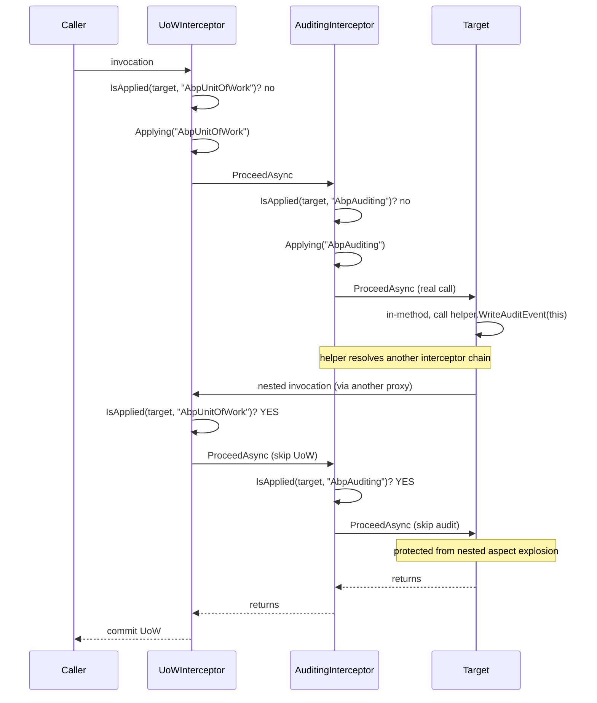
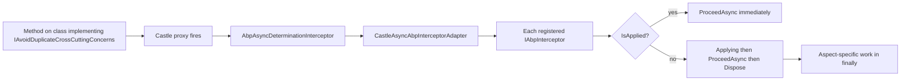

The `Aspects/` folder of `Volo.Abp.Core` is two files, but it solves a real problem: when an `IAbpInterceptor` calls into a method that another interceptor would *also* intercept with the same concern, the framework needs to suppress the duplicate application without re-architecting the whole chain. `AbpCrossCuttingConcerns` is a tiny helper that records "this concern has been applied to this object", and `IAvoidDuplicateCrossCuttingConcerns` is the contract that opt-in classes implement to participate. This page covers both files in `framework/src/Volo.Abp.Core/Volo/Abp/Aspects/` and walks the integration with `IAbpMethodInvocation` from [Dynamic proxy and interceptors](/core/dynamic-proxy-and-interceptors).

## File inventory

| File | Symbol | Role |
| --- | --- | --- |
| `Aspects/AbpCrossCuttingConcerns.cs` | `AbpCrossCuttingConcerns` | Static `Add/Remove/IsApplied/Applying/GetApplieds`. |
| `Aspects/IAvoidDuplicateCrossCuttingConcerns.cs` | `IAvoidDuplicateCrossCuttingConcerns` | `List<string> AppliedCrossCuttingConcerns`. |

## The reentrancy problem

Consider an interceptor chain that includes both auditing and unit-of-work. When the audit interceptor logs an event, it persists an audit-log entity through a repository. That repository call is *also* wrapped by the UoW interceptor. If the audit interceptor is run inside a UoW scope and the repository call would start a new one, you get nested UoWs by accident — the inner one might commit, the outer one might roll back, the audit entry persists when it shouldn't.

The fix is for the second `IAbpInterceptor` to ask "is this concern already applied to this object?" and skip itself if yes. That's what `AbpCrossCuttingConcerns` provides.

## IAvoidDuplicateCrossCuttingConcerns

The contract is a single property — a *mutable* list of concern names. From `framework/src/Volo.Abp.Core/Volo/Abp/Aspects/IAvoidDuplicateCrossCuttingConcerns.cs`:

```csharp
public interface IAvoidDuplicateCrossCuttingConcerns
{
    List<string> AppliedCrossCuttingConcerns { get; }
}
```

A class that wants concerns deduplicated implements this interface and exposes the list. Application service base classes, repository base classes, and event-handler base classes typically implement it.

## AbpCrossCuttingConcerns

The static helper offers five operations. The complete file is:

```csharp
public static class AbpCrossCuttingConcerns
{
    //TODO: Move these constants to their own assemblies!
    public const string Auditing = "AbpAuditing";
    public const string UnitOfWork = "AbpUnitOfWork";
    public const string FeatureChecking = "AbpFeatureChecking";
    public const string GlobalFeatureChecking = "AbpGlobalFeatureChecking";

    public static void AddApplied(object obj, params string[] concerns)
    {
        if (concerns.IsNullOrEmpty())
            throw new ArgumentNullException(nameof(concerns), $"{nameof(concerns)} should be provided!");
        (obj as IAvoidDuplicateCrossCuttingConcerns)?.AppliedCrossCuttingConcerns.AddRange(concerns);
    }

    public static void RemoveApplied(object obj, params string[] concerns)
    {
        if (concerns.IsNullOrEmpty())
            throw new ArgumentNullException(nameof(concerns), $"{nameof(concerns)} should be provided!");
        var crossCuttingEnabledObj = obj as IAvoidDuplicateCrossCuttingConcerns;
        if (crossCuttingEnabledObj == null) return;
        foreach (var concern in concerns)
            crossCuttingEnabledObj.AppliedCrossCuttingConcerns.RemoveAll(c => c == concern);
    }

    public static bool IsApplied(object? obj, [NotNull] string concern)
    {
        if (obj == null) throw new ArgumentNullException(nameof(obj));
        if (concern == null) throw new ArgumentNullException(nameof(concern));
        return (obj as IAvoidDuplicateCrossCuttingConcerns)?.AppliedCrossCuttingConcerns.Contains(concern) ?? false;
    }

    public static IDisposable Applying(object obj, params string[] concerns)
    {
        AddApplied(obj, concerns);
        return new DisposeAction<ValueTuple<object, string[]>>(static (state) =>
        {
            var (obj, concerns) = state;
            RemoveApplied(obj, concerns);
        }, (obj, concerns));
    }

    public static string[] GetApplieds(object obj)
    {
        var crossCuttingEnabledObj = obj as IAvoidDuplicateCrossCuttingConcerns;
        if (crossCuttingEnabledObj == null) return new string[0];
        return crossCuttingEnabledObj.AppliedCrossCuttingConcerns.ToArray();
    }
}
```

### Notable details

- **Constants** — the four well-known concern names live here. The `// TODO` notes the duplication: higher packages would prefer to own their own constant.
- **`Applying`** — the scope-block variant. It adds the concerns, returns an `IDisposable` whose `Dispose` removes them, and uses a state-passing `DisposeAction<T>` to avoid allocating a closure (matching the pattern used in `SemaphoreSlimExtensions`).
- **`obj` may not implement the interface** — every method does a `(obj as IAvoidDuplicateCrossCuttingConcerns)?` cast, so calling code can treat the helper as universally safe.
- **`IsApplied` rejects `null`** — by design, asking "did this concern apply to nothing" is a programming error.

## How interceptors use it

A typical interceptor pattern:

```csharp
public class AuditingInterceptor : AbpInterceptor, ITransientDependency
{
    private readonly IAuditingHelper _auditingHelper;

    public override async Task InterceptAsync(IAbpMethodInvocation invocation)
    {
        if (AbpCrossCuttingConcerns.IsApplied(invocation.TargetObject!, AbpCrossCuttingConcerns.Auditing))
        {
            await invocation.ProceedAsync();
            return;
        }

        using (AbpCrossCuttingConcerns.Applying(invocation.TargetObject!, AbpCrossCuttingConcerns.Auditing))
        {
            // start audit scope
            try { await invocation.ProceedAsync(); }
            finally { /* persist audit-log entry */ }
        }
    }
}
```

Step by step:

<Steps>
  <Step title="Check">
    `IsApplied` consults `TargetObject` (the real subject). If audit is already in flight on this object, skip everything.
  </Step>
  <Step title="Apply">
    `Applying` registers the concern and returns a disposable. Anything else on the same object that asks `IsApplied("AbpAuditing")` inside the using block sees `true`.
  </Step>
  <Step title="Proceed">
    Call `invocation.ProceedAsync()` to run the target / next interceptor.
  </Step>
  <Step title="Release">
    Dispose removes the concern automatically — even on exception.
  </Step>
</Steps>

## When a class does not implement the interface

The helper degrades gracefully — both `AddApplied` and `IsApplied` short-circuit when the cast fails. So legacy or third-party classes that have no idea about `IAvoidDuplicateCrossCuttingConcerns` simply don't get deduplication; they always run the concern. That is safer than throwing, because the alternative would force every intercepted class to opt in just to coexist with the framework.

For classes that *should* deduplicate, the implementation is a one-liner:

```csharp
public abstract class ApplicationService : IAvoidDuplicateCrossCuttingConcerns
{
    public List<string> AppliedCrossCuttingConcerns { get; } = new List<string>();
    // ... rest of the class
}
```

The list lives for the instance's lifetime; concerns come and go but the list is never re-allocated.

<Note>
  The list is `List<string>` — not a `HashSet<string>`. That lets `GetApplieds(obj)` return the names in the order they were added (useful for diagnostics) and lets a single `Applying(obj, concernA, concernB)` call add multiple entries that are removed together on dispose. Note that `RemoveApplied` calls `RemoveAll(c => c == concern)` — every matching entry is removed at once, so do not interleave manual `AddApplied`/`RemoveApplied` pairs with `Applying` scopes for the same concern.
</Note>

## Aspects vs interceptors: the boundary

There's a subtle distinction between an *aspect* and an *interceptor* worth making:

| Concept | Definition | Where it lives |
| --- | --- | --- |
| **Interceptor** | Castle.DynamicProxy/IAbpInterceptor object that wraps method calls. | Higher-level packages (`UnitOfWorkInterceptor`, `AuditingInterceptor`). |
| **Aspect** | A named cross-cutting concern (e.g. `"AbpAuditing"`) that may be applied or skipped per-target. | `AbpCrossCuttingConcerns` constants + `IAvoidDuplicateCrossCuttingConcerns`. |

An interceptor *is the runtime carrier* of an aspect. Multiple aspects can be applied through one interceptor (the auditing interceptor might check both auditing and global-feature concerns), and multiple interceptors can apply the same aspect (a user might write a second auditing interceptor that defers to the first via `IsApplied`).

## Composition example: chained interceptors



Without the `IsApplied` check, the inner call would start its own UoW, its own audit scope, and so on — producing duplicate audit entries and the wrong commit boundary.

## Custom concerns

A team can define its own concern names alongside the framework's:

```csharp
public static class MyCompanyConcerns
{
    public const string TenantRouting = "MyCompany.TenantRouting";
    public const string CacheInvalidation = "MyCompany.CacheInvalidation";
}

// in an interceptor
if (AbpCrossCuttingConcerns.IsApplied(invocation.TargetObject!, MyCompanyConcerns.TenantRouting))
{
    await invocation.ProceedAsync();
    return;
}
using (AbpCrossCuttingConcerns.Applying(invocation.TargetObject!, MyCompanyConcerns.TenantRouting))
{
    await DoRoutingAsync(invocation);
}
```

The helper is concern-name-agnostic — strings are the contract.

## Edge cases and pitfalls

<Warning>
  - **`obj` must be the real target, not a proxy** — `ProxyHelper.UnProxy(invocation.TargetObject)` returns the underlying instance. Without unproxying, the `AppliedCrossCuttingConcerns` list lives on the proxy and a second call through a different proxy would not see it. In practice `invocation.TargetObject` already returns the unproxied target — but if you maintain your own object reference, unproxy first.
  - **Forgetting to dispose** — `Applying` returns an `IDisposable`. If you forget the `using`, the concern stays applied forever and downstream calls silently skip it.
  - **Add/Remove imbalance** — `AddApplied` adds names; `RemoveApplied` removes *every* matching entry. Mixing manual add/remove with `Applying` will desync the list. Use one style consistently.
  - **Thread safety** — the `List<string>` is *not* thread-safe. The aspect helper assumes a single logical flow per object — usually true within one DI scope, but worth noting if you share the same target across threads.
</Warning>

## Recap

<CardGroup cols={2}>
  <Card title="Interceptors" icon="link" href="/core/dynamic-proxy-and-interceptors">
    `IAbpInterceptor` is the runtime carrier; `AbpCrossCuttingConcerns` is the per-call ledger.
  </Card>
  <Card title="Threading" icon="gauge" href="/core/threading-and-async">
    `DisposeAction<T>` is the state-passing pattern used by `Applying`.
  </Card>
  <Card title="DI" icon="syringe" href="/core/dependency-injection">
    Application services typically implement `IAvoidDuplicateCrossCuttingConcerns`.
  </Card>
  <Card title="Modularity" icon="cubes" href="/core/modularity-and-modules">
    Each module typically ships its own interceptor and may add its own concern constants.
  </Card>
</CardGroup>

## Interaction with IAbpMethodInvocation

The aspect helper and the invocation contract are orthogonal but routinely composed. `IAbpMethodInvocation.TargetObject` — defined in `framework/src/Volo.Abp.Core/Volo/Abp/DynamicProxy/IAbpMethodInvocation.cs` and implemented by `CastleAbpMethodInvocationAdapterBase` — is the natural argument to `AbpCrossCuttingConcerns.IsApplied`. The invocation also exposes `Method`, `Arguments`, `ArgumentsDictionary`, `GenericArguments`, and `ReturnValue` so an interceptor can decide *whether* a concern applies before flipping the bit.

A representative pattern is "skip auditing for methods marked `[DisableAuditing]`":

```csharp
public override async Task InterceptAsync(IAbpMethodInvocation invocation)
{
    if (invocation.Method.IsDefined(typeof(DisableAuditingAttribute), true)
        || invocation.Method.DeclaringType!.IsDefined(typeof(DisableAuditingAttribute), true))
    {
        await invocation.ProceedAsync();
        return;
    }

    if (AbpCrossCuttingConcerns.IsApplied(invocation.TargetObject!, AbpCrossCuttingConcerns.Auditing))
    {
        await invocation.ProceedAsync();
        return;
    }

    using (AbpCrossCuttingConcerns.Applying(invocation.TargetObject!, AbpCrossCuttingConcerns.Auditing))
    {
        await invocation.ProceedAsync();
    }
}
```

Three checks combine: method attribute, declaring-type attribute, and the runtime aspect ledger. The interceptor only "fires" the concern when *all* opt-in conditions are met and the concern is not already applied.

## Why a list and not a counter

A naive design would use a `Dictionary<string, int>` and increment/decrement. ABP chose `List<string>` for two reasons:

- **Diagnostics**: `GetApplieds(obj)` returns the *names* in order — debuggers can show "this object is currently inside `[AbpUnitOfWork, AbpAuditing]`".
- **Multi-purpose Applying calls**: `Applying(obj, concernA, concernB)` adds two entries; the corresponding dispose removes both with `RemoveAll(c => c == concern)`. A counter could not faithfully represent the order in which they were added.

The trade-off is that `IsApplied` is O(n) on the list. In practice n rarely exceeds 4 (the four built-in concerns plus one or two custom ones), so the cost is negligible.

## Putting it all together



The result is a coherent stack of cross-cutting concerns that does not duplicate itself on nested calls, regardless of which interceptor enters first.

UoW reentrancy, audit-log nesting, feature-check reentrancy and authorization re-evaluation are all examples covered in [/ddd/overview](/ddd/overview) (application services), [/data/overview](/data/overview) (UoW interceptor) and [/infrastructure/overview](/infrastructure/overview) (auditing infrastructure) — each relies on this small helper to stay coherent.
