`Volo.Abp.Core` differentiates between *technical* failures (timeouts, bugs, infrastructure) and *business* failures (validation, rule violations) by deriving the latter from `BusinessException`. Anything implementing `IBusinessException` is treated by the HTTP middleware and audit logging as a domain-level signal: it gets a structured error code, an optional details payload, an HTTP status, and a localizable message. This page covers the marker interfaces (`IBusinessException`, `IUserFriendlyException`), the concrete `BusinessException` and `UserFriendlyException` classes, and the four metadata interfaces (`IHasErrorCode`, `IHasErrorDetails`, `IHasHttpStatusCode`, `ILocalizeErrorMessage`) that combine to form the public error contract.

## File inventory

| File | Symbol | Role |
| --- | --- | --- |
| `Volo/Abp/AbpException.cs` | `AbpException` | Base of every framework-thrown exception. |
| `Volo/Abp/IBusinessException.cs` | `IBusinessException` | Empty marker for "this is a domain rule, not a bug". |
| `Volo/Abp/BusinessException.cs` | `BusinessException` | Concrete `Exception` with `Code`, `Details`, `LogLevel`. |
| `Volo/Abp/IUserFriendlyException.cs` | `IUserFriendlyException` | Sub-marker: message is shown directly to end users. |
| `Volo/Abp/UserFriendlyException.cs` | `UserFriendlyException` | Concrete `BusinessException` with mandatory message. |
| `Volo/Abp/ExceptionHandling/IHasErrorCode.cs` | `IHasErrorCode` | `string? Code`. |
| `Volo/Abp/ExceptionHandling/IHasErrorDetails.cs` | `IHasErrorDetails` | `string? Details`. |
| `Volo/Abp/ExceptionHandling/IHasHttpStatusCode.cs` | `IHasHttpStatusCode` | `int HttpStatusCode`. |
| `Volo/Abp/ExceptionHandling/ILocalizeErrorMessage.cs` | `ILocalizeErrorMessage` | `string LocalizeMessage(LocalizationContext)`. |
| `Volo/Abp/Logging/IHasLogLevel.cs` | `IHasLogLevel` | `LogLevel LogLevel { get; set; }`. |

## AbpException at the root

`AbpException` is the simplest of all — it adds nothing to `Exception` except a stable type to catch. From `framework/src/Volo.Abp.Core/Volo/Abp/AbpException.cs`:

```csharp
public class AbpException : Exception
{
    public AbpException() { }
    public AbpException(string? message) : base(message) { }
    public AbpException(string? message, Exception? innerException) : base(message, innerException) { }
}
```

`AbpInitializationException : AbpException` and `AbpShutdownException : AbpException` (covered in [ABP application and bootstrap](/core/abp-application-and-bootstrap)) sit next to it in the hierarchy.

## IBusinessException

The marker is intentionally empty:

```csharp
public interface IBusinessException { }
```

Why a marker? Two reasons. First, *anyone* — including third-party code that does not derive from `BusinessException` — can opt into the "business" semantics by implementing this interface. Second, the HTTP and audit log integrations can check `exception is IBusinessException` without knowing the concrete type.

## BusinessException — the workhorse

`BusinessException` implements four interfaces simultaneously: `IBusinessException`, `IHasErrorCode`, `IHasErrorDetails`, and `IHasLogLevel`. From `framework/src/Volo.Abp.Core/Volo/Abp/BusinessException.cs`:

```csharp
public class BusinessException : Exception,
    IBusinessException,
    IHasErrorCode,
    IHasErrorDetails,
    IHasLogLevel
{
    public string? Code { get; set; }
    public string? Details { get; set; }
    public LogLevel LogLevel { get; set; }

    public BusinessException(
        string? code = null,
        string? message = null,
        string? details = null,
        Exception? innerException = null,
        LogLevel logLevel = LogLevel.Warning)
        : base(message, innerException)
    {
        Code = code;
        Details = details;
        LogLevel = logLevel;
    }

    public BusinessException WithData(string name, object value)
    {
        Data[name] = value;
        return this;
    }
}
```

Notable defaults:

- **`logLevel = LogLevel.Warning`** — business exceptions are *not* errors by default; they are warnings. Servers that log all `LogLevel.Error` to an alerting backend will not page anyone because a user violated a domain rule.
- **`Code` is nullable** — but the convention is to populate it with a localized message key like `"Volo.Users:010001"` so the same exception can be localized later via `ILocalizeErrorMessage`.
- **`Data[name] = value`** — `BusinessException.WithData` writes to the inherited `Exception.Data` dictionary; localization placeholders read those values back, so a localized template `"User {UserName} is already registered"` can interpolate `Data["UserName"]`.

## UserFriendlyException

`UserFriendlyException` is the subclass whose **message is shown to end users**. From `framework/src/Volo.Abp.Core/Volo/Abp/UserFriendlyException.cs`:

```csharp
/// <summary>
/// This exception type is directly shown to the user.
/// </summary>
public class UserFriendlyException : BusinessException, IUserFriendlyException
{
    public UserFriendlyException(
        string message,
        string? code = null,
        string? details = null,
        Exception? innerException = null,
        LogLevel logLevel = LogLevel.Warning)
        : base(code, message, details, innerException, logLevel)
    {
        Details = details;
    }
}
```

Two differences from `BusinessException`:

1. `message` is *required* — there's no parameterless overload.
2. It implements `IUserFriendlyException`, which inherits `IBusinessException`. The HTTP integration uses this distinction to decide whether to pass the exception message through verbatim (for `IUserFriendlyException`) or to substitute a generic "An internal error has occurred" message (for other exception types).

<Tip>
  Pick `UserFriendlyException` when the message is already user-ready (no PII, no internals, friendly tone). Pick `BusinessException` plus a `Code` when you want the front-end to look up a localized template instead.
</Tip>

## Metadata interfaces

Each metadata interface is independently optional, so a custom exception can pick the subset it needs.

### IHasErrorCode

```csharp
public interface IHasErrorCode { string? Code { get; } }
```

Used by HTTP middleware to populate `error.code` in the standard error envelope (`{ "error": { "code": "...", "message": "...", "details": "..." } }`). Codes also drive localization lookups — see `ILocalizeErrorMessage` below.

### IHasErrorDetails

```csharp
public interface IHasErrorDetails { string? Details { get; } }
```

Long-form details that may include a stack trace or a structured payload. The HTTP middleware respects `AbpExceptionHandlingOptions.SendExceptionsDetailsToClients` to decide whether to include them.

### IHasHttpStatusCode

```csharp
public interface IHasHttpStatusCode { int HttpStatusCode { get; } }
```

A custom exception that implements this returns the HTTP status the response should use. Without it, the HTTP layer falls back to a table keyed by exception type (typically 400 for `IBusinessException`, 401 for `AbpAuthenticationException`, 403 for `AbpAuthorizationException`, 500 otherwise).

### ILocalizeErrorMessage

```csharp
public interface ILocalizeErrorMessage
{
    string LocalizeMessage(LocalizationContext context);
}
```

Lets the exception resolve its own localized message at the moment an `IStringLocalizer` is available. The signature accepts a `LocalizationContext` (from `Volo.Abp.Localization`) which the HTTP/MVC integration constructs once it knows the requested culture. This is how an exception thrown deep in the domain ends up rendered as `"User {0} not found"` translated to the caller's culture.

## Interaction matrix

The table below summarises which interfaces each built-in exception implements:

| Class | `IBusinessException` | `IUserFriendlyException` | `IHasErrorCode` | `IHasErrorDetails` | `IHasLogLevel` | `IHasHttpStatusCode` |
| --- | --- | --- | --- | --- | --- | --- |
| `AbpException` |   |   |   |   |   |   |
| `AbpInitializationException` |   |   |   |   |   |   |
| `BusinessException` | ✅ |   | ✅ | ✅ | ✅ |   |
| `UserFriendlyException` | ✅ | ✅ | ✅ | ✅ | ✅ |   |

Custom exceptions in higher-level modules (e.g. `EntityNotFoundException`) typically extend `BusinessException` and add `IHasHttpStatusCode` themselves.

## The localization pipeline

```mermaid
flowchart LR
    A[Domain code throws BusinessException with Code='X:001'] --> B[Interceptor catches]
    B --> C[IExceptionNotifier.NotifyAsync]
    C --> D[HTTP filter chooses status from IHasHttpStatusCode]
    D --> E{Implements ILocalizeErrorMessage?}
    E -- yes --> F[exception.LocalizeMessage&#40;ctx&#41;]
    E -- no  --> G[Look up Code as localization key]
    G --> H[IStringLocalizer.GetString&#40;Code, Data values&#41;]
    F --> I[Final localized text]
    H --> I
    I --> J[HTTP error envelope]
```



The two flows converge on the localized text. The `IStringLocalizer` lookup typically uses `Code` as the resource key and `exception.Data` as the named-argument source — that's why `BusinessException.WithData("UserName", userName)` is the idiomatic way to seed placeholders.

## How log levels propagate

Because `BusinessException : IHasLogLevel`, the `ExceptionNotificationContext` constructor reads `LogLevel` from the exception when no explicit override is supplied. From [Exception handling](/core/exception-handling):

```csharp
public ExceptionNotificationContext(
    [NotNull] Exception exception,
    LogLevel? logLevel = null,
    bool handled = true)
{
    Exception = Check.NotNull(exception, nameof(exception));
    LogLevel = logLevel ?? exception.GetLogLevel();
    Handled = handled;
}
```

`exception.GetLogLevel()` (in the `Logging` namespace) returns `(exception as IHasLogLevel)?.LogLevel ?? LogLevel.Error`. So:

- A plain `Exception` defaults to `LogLevel.Error`.
- A `BusinessException` defaults to `LogLevel.Warning`.
- Calling `ex.WithLogLevel(LogLevel.Information)` overrides the per-instance level via `HasLogLevelExtensions.WithLogLevel`.

<Warning>
  Subscribers should read `context.LogLevel` rather than picking their own level — that way a business operation can mark its expected-failure paths as `LogLevel.Information` without forking every subscriber.
</Warning>

## Worked examples

<Tabs>
  <Tab title="Code-based exception">
    Throw a `BusinessException` with a code that maps to a localization key:
    ```csharp
    throw new BusinessException("MyModule:010001")
        .WithData("UserName", input.UserName);
    ```
    The HTTP layer will look up `MyModule:010001` in the localizer with `UserName` available as `{UserName}`.
  </Tab>
  <Tab title="User-facing message">
    When you have the message text in hand and don't need localization:
    ```csharp
    throw new UserFriendlyException(
        message: $"Email {email} is already registered.",
        code: "Identity:Email:Duplicate");
    ```
    The exact message is rendered to the user; the code is still useful for client-side handling.
  </Tab>
  <Tab title="Custom HTTP status">
    Compose `BusinessException` with `IHasHttpStatusCode`:
    ```csharp
    public class TenantInactiveException : BusinessException, IHasHttpStatusCode
    {
        public int HttpStatusCode => 423; // Locked
        public TenantInactiveException(Guid tenantId)
            : base("MultiTenancy:TenantInactive")
            => WithData("TenantId", tenantId);
    }
    ```
    The middleware sets status 423 and emits the localized text.
  </Tab>
  <Tab title="Self-localizing">
    Implement `ILocalizeErrorMessage` for exceptions where the message needs context-aware lookup:
    ```csharp
    public class PolicyDeniedException : BusinessException, ILocalizeErrorMessage
    {
        public string PolicyName { get; }
        public PolicyDeniedException(string policyName)
            : base("Authorization:PolicyDenied") => PolicyName = policyName;

        public string LocalizeMessage(LocalizationContext context)
        {
            var localizer = context.LocalizerFactory.Create<AuthorizationResource>();
            return localizer["Authorization:PolicyDenied", PolicyName];
        }
    }
    ```
  </Tab>
</Tabs>

## Anti-patterns

<Warning>
  Avoid these usage mistakes that the framework cannot catch for you:

  - **Throwing `Exception`** for domain failures — it forces every consumer to handle it as a 500 server error and pollutes logs at `LogLevel.Error`.
  - **Building `UserFriendlyException` messages with PII** — the message text is shown to end users; usernames and email addresses are fine, but stack traces and connection strings are not.
  - **Forgetting `Code`** on a `BusinessException` that the front-end needs to switch on. Without a code, the only signal is the localized message.
  - **Hard-coding HTTP status** in `BusinessException` instances. Prefer subclassing and implementing `IHasHttpStatusCode` so the API contract is discoverable from the type.
</Warning>

## How it appears on the wire

The standard ABP error JSON (produced by the AspNetCore exception filter, not by `Volo.Abp.Core` itself) reads each metadata interface and formats:

```json
{
  "error": {
    "code": "<IHasErrorCode.Code>",
    "message": "<ILocalizeErrorMessage.LocalizeMessage(...) or .Message>",
    "details": "<IHasErrorDetails.Details>",
    "data": { /* values from Exception.Data */ },
    "validationErrors": [ /* for AbpValidationException */ ]
  }
}
```

The HTTP status comes from `IHasHttpStatusCode` if present, otherwise the type-to-status table.

## Related pages

<CardGroup cols={2}>
  <Card title="Exception handling" icon="triangle-exclamation" href="/core/exception-handling">
    `IExceptionNotifier`, `IExceptionSubscriber`, and how `ExceptionNotificationContext` reads `IHasLogLevel`.
  </Card>
  <Card title="DI" icon="syringe" href="/core/dependency-injection">
    Where `[ExposeServices]` is used to register subscribers and exception-aware services.
  </Card>
  <Card title="Bootstrap" icon="rocket" href="/core/abp-application-and-bootstrap">
    `AbpInitializationException` wraps configure-time failures.
  </Card>
  <Card title="Tracing" icon="route" href="/core/tracing-and-correlation">
    Subscribers usually attach the current correlation id when logging exceptions.
  </Card>
</CardGroup>

The validation system in [/ddd/overview](/ddd/overview) defines `AbpValidationException : BusinessException` that adds a `ValidationErrors` collection; the data layer ([/data/overview](/data/overview)) ships `EntityNotFoundException` and `OptimisticConcurrencyException`; the HTTP layer ([/infrastructure/overview](/infrastructure/overview)) is the one that produces the JSON envelope you see at the wire.
