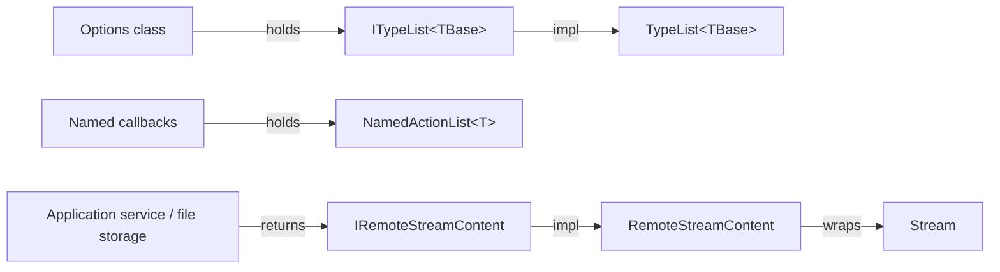

The `Collections/` and `Content/` folders of `Volo.Abp.Core` are small but pervasive. `ITypeList<TBaseType>` enforces a base-type constraint on a `List<Type>` so options classes (like `AbpModuleLifecycleOptions.Contributors`) can advertise the contract. `IRemoteStreamContent` and its concrete `RemoteStreamContent` form the abstraction for binary payloads — uploads, downloads, file storage — that the rest of the framework's remote-service stack speaks. This page covers every file under `framework/src/Volo.Abp.Core/Volo/Abp/Collections/` and `framework/src/Volo.Abp.Core/Volo/Abp/Content/`.

## File inventory

| File | Symbol | Role |
| --- | --- | --- |
| `Collections/ITypeList.cs` | `ITypeList`, `ITypeList<in TBaseType>` | Typed list with `Add<T>()` constraint. |
| `Collections/TypeList.cs` | `TypeList`, `TypeList<TBaseType>` | Concrete impl with runtime base-type check. |
| `Collections/NamedObjectList.cs` | `NamedObjectList<T>` | `List<T>` where `T : NamedObject`. |
| `Collections/NamedActionList.cs` | `NamedActionList<T>` | List of named `Action<T>`s. |
| `Content/IRemoteStreamContent.cs` | `IRemoteStreamContent` | `Stream GetStream()`, `FileName`, `ContentType`, `ContentLength`. |
| `Content/RemoteStreamContent.cs` | `RemoteStreamContent` | Default disposable implementation. |

## ITypeList\<TBaseType\>

`ITypeList<TBaseType>` constrains a list of `Type` so that every element implements a known base type, while still being a regular `IList<Type>`. From `framework/src/Volo.Abp.Core/Volo/Abp/Collections/ITypeList.cs`:

```csharp
public interface ITypeList : ITypeList<object> { }

public interface ITypeList<in TBaseType> : IList<Type>
{
    void Add<T>() where T : TBaseType;
    bool TryAdd<T>() where T : TBaseType;
    bool Contains<T>() where T : TBaseType;
    void Remove<T>() where T : TBaseType;
}
```

The generic constraint `where T : TBaseType` is compile-time guarantee: `options.Contributors.Add<NotAContributor>()` will not build. The non-generic `ITypeList` is a shortcut for `ITypeList<object>` — useful for "any class" lists.

`TypeList<TBaseType>` enforces the same rule at runtime for the `IList<Type>` operations (`Add(Type)`, `Insert(int, Type)`, indexer setter). From `framework/src/Volo.Abp.Core/Volo/Abp/Collections/TypeList.cs`:

```csharp
public class TypeList<TBaseType> : ITypeList<TBaseType>
{
    private readonly List<Type> _typeList;

    public TypeList() => _typeList = new List<Type>();

    public Type this[int index] {
        get => _typeList[index];
        set { CheckType(value); _typeList[index] = value; }
    }

    public void Add<T>() where T : TBaseType => _typeList.Add(typeof(T));

    public bool TryAdd<T>() where T : TBaseType
    {
        if (Contains<T>()) return false;
        Add<T>();
        return true;
    }

    public void Add(Type item) { CheckType(item); _typeList.Add(item); }
    public void Insert(int index, Type item) { CheckType(item); _typeList.Insert(index, item); }

    private static void CheckType(Type item)
    {
        if (!typeof(TBaseType).GetTypeInfo().IsAssignableFrom(item))
            throw new ArgumentException(
                $"Given type ({item.AssemblyQualifiedName}) should be instance of {typeof(TBaseType).AssemblyQualifiedName} ",
                nameof(item));
    }
}
```

Concrete `TypeList : TypeList<object>` is the "any class" variant. The `CheckType` guard means `Add(typeof(string))` will throw if the list base is `IMyService`. The exception's message is intentionally explicit so debugging registration bugs is easy.

### Where ITypeList shows up

The most visible occurrence is `AbpModuleLifecycleOptions.Contributors` in `framework/src/Volo.Abp.Core/Volo/Abp/Modularity/AbpModuleLifecycleOptions.cs`:

```csharp
public class AbpModuleLifecycleOptions
{
    public ITypeList<IModuleLifecycleContributor> Contributors { get; }
    public AbpModuleLifecycleOptions() => Contributors = new TypeList<IModuleLifecycleContributor>();
}
```

Other examples include `IOnServiceRegistredContext.Interceptors` (`ITypeList<IAbpInterceptor>`) — see [Dynamic proxy and interceptors](/core/dynamic-proxy-and-interceptors) — and `AbpSecurityLogOptions.IgnoredTypes` in higher-level packages.

<Tip>
  When designing an options class that holds a list of "types implementing X", reach for `ITypeList<X>` instead of `List<Type>`. The compile-time `Add<T>()` constraint and runtime check together remove a class of bugs.
</Tip>

## NamedObjectList and NamedActionList

`NamedObjectList<T>` and `NamedActionList<T>` live in the unusual `Volo.Abp.AI` namespace inside `Volo.Abp.Core` (the namespace name is historical):

```csharp
namespace Volo.Abp.AI;

public class NamedObjectList<T> : List<T> where T : NamedObject { }

public class NamedActionList<T> : NamedObjectList<NamedAction<T>>
{
    public void Add(Action<T> action) => this.Add(Guid.NewGuid().ToString("N"), action);
    public void Add(string name, Action<T> action) => this.Add(new NamedAction<T>(name, action));
}
```

`NamedObject`, `NamedAction<T>`, `NameValue` and similar live one folder up at `framework/src/Volo.Abp.Core/Volo/Abp/`. The pattern is "a list whose elements have a stable string name" — useful for options where callers want to look up, replace, or remove individual entries by id.

A canonical use is a registry of `Action<TContext>` callbacks (think interceptors of a sort) where consumers want to:

- add a callback with an autogenerated name (returning the name),
- replace by name,
- enumerate in order.

The two `Add` overloads — one with a generated `Guid.NewGuid().ToString("N")` and one with a user-provided name — match those idioms exactly.

## IRemoteStreamContent

`IRemoteStreamContent` is ABP's mime-aware stream wrapper. From `framework/src/Volo.Abp.Core/Volo/Abp/Content/IRemoteStreamContent.cs`:

```csharp
public interface IRemoteStreamContent : IDisposable
{
    string? FileName { get; }
    string ContentType { get; }
    long? ContentLength { get; }
    Stream GetStream();
}
```

Four observations:

- `FileName` is nullable — many streams are anonymous (a generated PDF, for instance).
- `ContentType` is *not* nullable — every stream must declare a media type. `RemoteStreamContent` defaults to `application/octet-stream` if the caller passes `null`.
- `ContentLength` is nullable — chunked or unknown-length streams (HTTP responses with no `Content-Length`) set it to `null`.
- The interface itself is `IDisposable` — the caller must own the stream's lifetime.

## RemoteStreamContent

`RemoteStreamContent` is the default implementation. It owns the underlying stream unless told otherwise:

```csharp
public class RemoteStreamContent : IRemoteStreamContent
{
    private readonly Stream _stream;
    private readonly bool _disposeStream;
    private bool _disposed;

    public virtual string? FileName { get; }
    public virtual string ContentType { get; } = "application/octet-stream";
    public virtual long? ContentLength { get; }

    public RemoteStreamContent(Stream stream, string? fileName = null, string? contentType = null,
        long? readOnlyLength = null, bool disposeStream = true)
    {
        _stream = stream;
        FileName = fileName;
        if (contentType != null) ContentType = contentType;
        ContentLength = readOnlyLength ?? (_stream.CanSeek ? _stream.Length - _stream.Position : null);
        _disposeStream = disposeStream;
    }

    public virtual Stream GetStream() => _stream;

    public virtual void Dispose()
    {
        if (_disposed) return;
        if (_disposeStream) _stream.Dispose();
        _disposed = true;
    }
}
```

Subtle behaviour worth noting:

- **`ContentLength` defaults**: if the caller does not pass `readOnlyLength` and the stream is seekable, `_stream.Length - _stream.Position` is used. That handles the common case of opening a `FileStream` and passing it straight in.
- **`disposeStream = true`** by default — the wrapper is meant to assume ownership. Pass `disposeStream: false` when the stream's lifetime is tied to something else (e.g. an HTTP response body whose disposal is managed by `HttpClient`).
- The `_disposed` flag makes `Dispose` idempotent.

### Where IRemoteStreamContent shows up

The wrapper is the lingua franca for binary payloads across:

- **HTTP remote services** — the AspNetCore client/server pipelines marshal `IRemoteStreamContent` as `multipart/form-data` parts or `application/octet-stream` bodies.
- **File storage** (`Volo.Abp.BlobStoring.*` packages) — `SaveAsync(stream)` and `GetAsync()` exchange `IRemoteStreamContent` so the storage provider can decide whether to seek, length-prefix, or stream as chunks.
- **Application services** that download generated content (reports, exports). Returning `IRemoteStreamContent` from an application-service method lets the HTTP layer stream the response without first buffering it in memory.

<Warning>
  Always wrap streams that come from `HttpResponseMessage.Content.ReadAsStreamAsync()` with `disposeStream: false` — the response disposes the stream itself. Failing to do so will produce `ObjectDisposedException`s during retries.
</Warning>

## Composition example

A simple application service that returns a generated CSV demonstrates the full pattern:

```csharp
public class ReportAppService : ApplicationService
{
    public async Task<IRemoteStreamContent> GetMonthlyReportAsync(int year, int month)
    {
        var ms = new MemoryStream();
        await using (var writer = new StreamWriter(ms, leaveOpen: true))
            await WriteCsv(writer, year, month);
        ms.Position = 0;
        return new RemoteStreamContent(ms,
            fileName: $"report-{year}-{month:D2}.csv",
            contentType: "text/csv");
    }
}
```

On the wire, the AspNetCore integration recognises `IRemoteStreamContent` as the return type and emits a `Content-Disposition: attachment; filename="report-2024-06.csv"` header plus the stream as the response body, with `Content-Length` set from `ContentLength` if known. The client SDK reads it back as a `RemoteStreamContent` for the caller to consume.

## Putting it all together



## Cheat sheet

<Tabs>
  <Tab title="Declare a typed list option">
    ```csharp
    public class MyHookOptions
    {
        public ITypeList<IMyHook> Hooks { get; } = new TypeList<IMyHook>();
    }
    ```
  </Tab>
  <Tab title="Register hooks from a module">
    ```csharp
    public override void ConfigureServices(ServiceConfigurationContext context)
    {
        Configure<MyHookOptions>(o => o.Hooks.Add<AuditHook>());
    }
    ```
    The `Add<T>` constraint enforces `AuditHook : IMyHook` at compile time.
  </Tab>
  <Tab title="Stream a file">
    ```csharp
    var stream = File.OpenRead(path);
    return new RemoteStreamContent(stream,
        fileName: Path.GetFileName(path),
        contentType: "application/pdf");
    ```
    `disposeStream` defaults to `true` — disposing the wrapper closes the file.
  </Tab>
  <Tab title="Stream a response body">
    ```csharp
    var response = await _httpClient.SendAsync(req, HttpCompletionOption.ResponseHeadersRead);
    var inner = await response.Content.ReadAsStreamAsync();
    return new RemoteStreamContent(inner,
        contentType: response.Content.Headers.ContentType?.ToString(),
        readOnlyLength: response.Content.Headers.ContentLength,
        disposeStream: false);
    ```
    `disposeStream: false` because the `HttpResponseMessage` owns the stream.
  </Tab>
</Tabs>

## Related pages

<CardGroup cols={2}>
  <Card title="Modularity" icon="cubes" href="/core/modularity-and-modules">
    `AbpModuleLifecycleOptions.Contributors` is an `ITypeList<IModuleLifecycleContributor>`.
  </Card>
  <Card title="Interceptors" icon="link" href="/core/dynamic-proxy-and-interceptors">
    `OnServiceRegistredContext.Interceptors` is an `ITypeList<IAbpInterceptor>`.
  </Card>
  <Card title="Options" icon="sliders" href="/core/options-and-configuration">
    Typed option lists pair naturally with `PreConfigure<TOptions>` callbacks.
  </Card>
  <Card title="DI" icon="syringe" href="/core/dependency-injection">
    `ConventionalRegistrarList` is a `List<IConventionalRegistrar>` held inside an `ObjectAccessor`.
  </Card>
</CardGroup>

## ITypeList vs alternatives

There are a handful of "list of types" patterns floating around the .NET ecosystem. The table below compares them:

| Choice | Compile-time check | Runtime check | Mutable | Used by ABP for |
| --- | --- | --- | --- | --- |
| `List<Type>` | none | none | yes | nowhere — too unsafe. |
| `IEnumerable<Type>` | none | none | no | service registration result snapshots. |
| `HashSet<Type>` | none | none | yes | uniqueness-only sets like `DynamicProxyIgnoreTypes.IgnoredTypes`. |
| `ITypeList<TBase>` | `Add<T>()` constrained | `CheckType` on `Add(Type)` | yes | options classes (`Contributors`, `Interceptors`). |
| `ITypeList` (=`ITypeList<object>`) | weak | weak | yes | rare; almost always prefer a typed base. |

The `ITypeList<TBase>` choice is the sweet spot — strong enough that buggy registrations fail at the call site, light enough that it remains a regular `IList<Type>` for LINQ.

## Disposing IRemoteStreamContent — `await using`

Because `IRemoteStreamContent : IDisposable` (not `IAsyncDisposable`), the standard `using` pattern applies:

```csharp
using var content = await _service.GetAsync(id);
await using var fs = File.Create(target);
await content.GetStream().CopyToAsync(fs);
```

If you need to forward an `IRemoteStreamContent` to an HTTP response and the framework owns disposal (typical in MVC return values), do *not* dispose it manually — the response writer does. Wrapping it in a `using` will close the underlying stream before the response can read it.

## Custom IRemoteStreamContent

Subclassing `RemoteStreamContent` lets you carry extra metadata while staying compatible with the rest of the framework:

```csharp
public class ImageRemoteStreamContent : RemoteStreamContent
{
    public int Width { get; }
    public int Height { get; }

    public ImageRemoteStreamContent(Stream stream, int width, int height,
        string? fileName = null, string contentType = "image/png")
        : base(stream, fileName, contentType)
    {
        Width = width;
        Height = height;
    }
}
```

Consumers that don't know about `ImageRemoteStreamContent` treat it as `IRemoteStreamContent`; consumers that do, downcast safely.

## NamedObject hierarchy at a glance

`NamedObject` and its descendants live in `framework/src/Volo.Abp.Core/Volo/Abp/`:

| Class | File | Use |
| --- | --- | --- |
| `NameValue` | `NameValue.cs` | Generic name+value pair, no constraint. |
| `NamedObject` | `NamedObject.cs` | Base class with a single `Name` property. |
| `NamedAction<T>` | `NamedAction.cs` | Pairs a name with an `Action<T>`. |
| `NamedObjectList<T>` | `Collections/NamedObjectList.cs` | `List<T> where T : NamedObject`. |
| `NamedActionList<T>` | `Collections/NamedActionList.cs` | `List<NamedAction<T>>` with helpers. |
| `NamedTypeSelector` | `NamedTypeSelector.cs` | A predicate paired with a name. |
| `NamedTypeSelectorListExtensions` | `NamedTypeSelectorListExtensions.cs` | `Remove(name)` helpers. |

The `NamedTypeSelectorList` is what `ServiceRegistrationActionList.DisabledClassInterceptorsSelectors` actually is (an `IClassInterceptorsSelectorList`, see [Dependency injection](/core/dependency-injection)).

File storage and blob streaming are documented under [/infrastructure/overview](/infrastructure/overview); upload/download flows in DDD application services live under [/ddd/overview](/ddd/overview); persistence-backed file metadata sits in [/data/overview](/data/overview).
