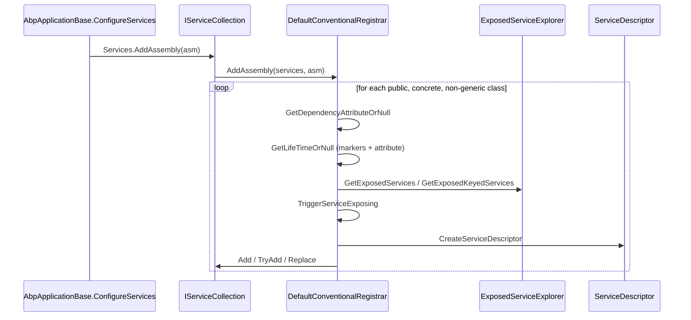

ABP Framework wraps `Microsoft.Extensions.DependencyInjection` with a convention-driven registration pipeline that scans every assembly the module loader knows about and registers types according to marker interfaces, attributes, and an extensible chain of `IConventionalRegistrar`. The same package adds an `IObjectAccessor<T>` indirection (so consumers can hold a singleton reference to something that doesn't exist yet) and cached service providers that act as scope-local memoization. Every file referenced below lives in `framework/src/Volo.Abp.Core/Volo/Abp/DependencyInjection/` or under `framework/src/Volo.Abp.Core/Microsoft/Extensions/DependencyInjection/`.

## File inventory

| File | Purpose |
| --- | --- |
| `ITransientDependency.cs`, `IScopedDependency.cs`, `ISingletonDependency.cs` | Empty marker interfaces that pick a `ServiceLifetime`. |
| `IConventionalRegistrar.cs` | `AddAssembly`, `AddTypes`, `AddType`. |
| `ConventionalRegistrarBase.cs` | The reflection-driven scan engine. |
| `DefaultConventionalRegistrar.cs` | Built-in implementation registered by default. |
| `DependencyAttribute.cs` | Per-class override: `Lifetime`, `TryRegister`, `ReplaceServices`. |
| `ExposeServicesAttribute.cs` | Per-class declaration of which service types to expose. |
| `ExposeKeyedServiceAttribute.cs` | Keyed-service variant. |
| `ExposedServiceExplorer.cs` | Default convention: "interface name minus leading I". |
| `DisableConventionalRegistrationAttribute.cs` | Opt-out marker. |
| `IObjectAccessor.cs`, `ObjectAccessor.cs` | The deferred-binding pattern used everywhere. |
| `ICachedServiceProvider.cs`, `CachedServiceProvider.cs`, `CachedServiceProviderBase.cs` | Per-scope resolution cache. |
| `ITransientCachedServiceProvider.cs`, `TransientCachedServiceProvider.cs` | Transient variant. |
| `IAbpLazyServiceProvider.cs`, `AbpLazyServiceProvider.cs` | Legacy alias kept for compatibility. |
| `IRootServiceProvider*.cs`, `RootServiceProvider.cs` | Singleton wrapper around the host's root provider. |
| `IServiceProviderAccessor.cs`, `IClientScopeServiceProviderAccessor.cs` | Accessor interfaces used by lifetime helpers. |
| `IInjectPropertiesService.cs`, `NullInjectPropertiesService.cs` | Property injection abstraction. |
| `DisablePropertyInjectionAttribute.cs` | Opt-out for property injection. |
| `OnServiceRegistredContext.cs`, `OnServiceExposingContext.cs`, `OnServiceActivatedContext.cs` | DTOs for the three registration events. |
| `ServiceRegistrationActionList.cs`, `ServiceExposingActionList.cs`, `ServiceActivatedActionList.cs` | The bag of registered callbacks. |
| `ClassInterceptorsSelectorList.cs`, `IClassInterceptorsSelectorList.cs` | Decides which classes can carry interceptors. |
| `ServiceIdentifier.cs` | Tuple-like `(Type, object? key)`. |
| `Microsoft/Extensions/DependencyInjection/ServiceCollectionConventionalRegistrationExtensions.cs` | `AddAssembly`, `AddAssemblyOf<T>`, `AddType`, `GetConventionalRegistrars`. |
| `Microsoft/Extensions/DependencyInjection/ServiceCollectionObjectAccessorExtensions.cs` | `AddObjectAccessor`, `TryAddObjectAccessor`, `GetObject`. |
| `Microsoft/Extensions/DependencyInjection/ServiceCollectionPreConfigureExtensions.cs` | `PreConfigure`, `GetPreConfigureActions`. |

## The three markers

The three empty interfaces in `framework/src/Volo.Abp.Core/Volo/Abp/DependencyInjection/` carry no methods — they just expose the desired `ServiceLifetime`:

```csharp
public interface ITransientDependency { }
public interface ISingletonDependency { }
public interface IScopedDependency { }
```

A class that wants to be conventionally registered as transient simply declares `: ITransientDependency`. The lifetime is read by `ConventionalRegistrarBase.GetServiceLifetimeFromClassHierarchy`:

```csharp
protected virtual ServiceLifetime? GetServiceLifetimeFromClassHierarchy(Type type)
{
    if (typeof(ITransientDependency).GetTypeInfo().IsAssignableFrom(type)) return ServiceLifetime.Transient;
    if (typeof(ISingletonDependency).GetTypeInfo().IsAssignableFrom(type)) return ServiceLifetime.Singleton;
    if (typeof(IScopedDependency).GetTypeInfo().IsAssignableFrom(type))    return ServiceLifetime.Scoped;
    return null;
}
```

<Note>
  A class with *no* marker interface and *no* `[Dependency]` attribute is skipped by `DefaultConventionalRegistrar.AddType`, because `GetLifeTimeOrNull` returns `null`. That is how POCOs and entities silently pass through the assembly scan.
</Note>

## DependencyAttribute and DisableConventionalRegistration

`DependencyAttribute` overrides the marker-derived lifetime and toggles `TryRegister`/`ReplaceServices` behaviour:

```csharp
public class DependencyAttribute : Attribute
{
    public virtual ServiceLifetime? Lifetime { get; set; }
    public virtual bool TryRegister { get; set; }
    public virtual bool ReplaceServices { get; set; }
    public DependencyAttribute() { }
    public DependencyAttribute(ServiceLifetime lifetime) { Lifetime = lifetime; }
}
```

In `DefaultConventionalRegistrar.AddType`:

```csharp
if (dependencyAttribute?.ReplaceServices == true) services.Replace(serviceDescriptor);
else if (dependencyAttribute?.TryRegister == true) services.TryAdd(serviceDescriptor);
else services.Add(serviceDescriptor);
```

`[DisableConventionalRegistration]` opts a class out completely — checked in `ConventionalRegistrarBase.IsConventionalRegistrationDisabled` via `type.IsDefined(typeof(DisableConventionalRegistrationAttribute), true)`. The whole `DefaultConventionalRegistrar.AddType` body short-circuits if it returns `true`.

## ExposeServicesAttribute and the default convention

By default, a class registered under `ITransientDependency` is exposed as every interface whose name (minus leading `I`) is a suffix of the class name. `ExposedServiceExplorer.GetDefaultServices` (called from `ExposeServicesAttribute.GetExposedServiceTypes` when `IncludeDefaults = true`) implements that rule:

```csharp
foreach (var interfaceType in type.GetTypeInfo().GetInterfaces())
{
    var interfaceName = interfaceType.Name;
    if (interfaceType.IsGenericType)
        interfaceName = interfaceType.Name.Left(interfaceType.Name.IndexOf('`'));
    if (interfaceName.StartsWith("I"))
        interfaceName = interfaceName.Right(interfaceName.Length - 1);
    if (type.Name.EndsWith(interfaceName, StringComparison.OrdinalIgnoreCase))
        serviceTypes.Add(interfaceType);
}
```

The default registrar uses a shared sentinel attribute `DefaultExposeServicesAttribute` with `IncludeDefaults = true, IncludeSelf = true`:

```csharp
private static readonly ExposeServicesAttribute DefaultExposeServicesAttribute =
    new ExposeServicesAttribute { IncludeDefaults = true, IncludeSelf = true };
```

If the class has any `[ExposeServices]` attribute(s), they override the default. The relevant `ExposedServiceExplorer.GetExposedServices` line is:

```csharp
return exposedServiceTypesProviders
    .DefaultIfEmpty(DefaultExposeServicesAttribute)
    .SelectMany(p => p.GetExposedServiceTypes(type))
    .Distinct()
    .ToList();
```

Keyed services use `ExposeKeyedServiceAttribute<TServiceType>` (note the generic), which builds a `ServiceIdentifier` from `(serviceKey, typeof(TServiceType))`. If a class has only keyed-service attributes and no `[ExposeServices]`, `GetExposedServices` returns *empty* — the keyed registrations stand alone.

## ConventionalRegistrarBase: the scan

`ConventionalRegistrarBase.AddAssembly` is the entry point invoked once per module assembly by `AbpApplicationBase.ConfigureServices`. The body, in `framework/src/Volo.Abp.Core/Volo/Abp/DependencyInjection/ConventionalRegistrarBase.cs`:

```csharp
public virtual void AddAssembly(IServiceCollection services, Assembly assembly)
{
    var logger = services.GetInitLogger<ConventionalRegistrarBase>();
    var types = Array.Empty<Type>();
    try
    {
        types = AssemblyHelper.GetAllTypes(assembly)
            .Where(type => type != null && type.IsClass && !type.IsAbstract && !type.IsGenericType)
            .ToArray();
    }
    catch (ReflectionTypeLoadException e) { types = e.Types.Where(...).Select(x => x!).ToArray(); logger.LogException(e); }
    catch (Exception e) { logger.LogException(e); }
    AddTypes(services, types);
}
```

Three filters are baked in: `IsClass`, `!IsAbstract`, `!IsGenericType`. Interfaces, abstract classes, and open generics never reach `AddType`.

### DefaultConventionalRegistrar.AddType

`DefaultConventionalRegistrar.AddType` orchestrates the per-type work:

```csharp
public override void AddType(IServiceCollection services, Type type)
{
    if (IsConventionalRegistrationDisabled(type)) return;
    var dependencyAttribute = GetDependencyAttributeOrNull(type);
    var lifeTime = GetLifeTimeOrNull(type, dependencyAttribute);
    if (lifeTime == null) return;

    var exposedServiceAndKeyedServiceTypes =
        GetExposedKeyedServiceTypes(type)
            .Concat(GetExposedServiceTypes(type).Select(t => new ServiceIdentifier(t)))
            .ToList();

    TriggerServiceExposing(services, type, exposedServiceAndKeyedServiceTypes);

    foreach (var exposedServiceType in exposedServiceAndKeyedServiceTypes)
    {
        var allExposingServiceTypes = ...;
        var serviceDescriptor = CreateServiceDescriptor(
            type, exposedServiceType.ServiceKey, exposedServiceType.ServiceType,
            allExposingServiceTypes, lifeTime.Value);

        if (dependencyAttribute?.ReplaceServices == true) services.Replace(serviceDescriptor);
        else if (dependencyAttribute?.TryRegister == true) services.TryAdd(serviceDescriptor);
        else services.Add(serviceDescriptor);
    }
}
```

The `CreateServiceDescriptor` method has a subtle optimisation: when a single implementation is exposed as multiple service types with `Singleton` or `Scoped` lifetime, it redirects all but one of the registrations to a factory that resolves the "primary" service. That avoids the classic bug where two separate `Singleton` registrations of the same class create two distinct instances:

```csharp
return serviceKey == null
    ? ServiceDescriptor.Describe(exposingServiceType,
        provider => provider.GetService(redirectedType)!, lifeTime)
    : ServiceDescriptor.DescribeKeyed(exposingServiceType, serviceKey,
        (provider, key) => provider.GetKeyedService(redirectedType, key)!, lifeTime);
```

### TriggerServiceExposing

Before any descriptor is added, the registrar fires `OnServiceExposingContext` callbacks. These are stored in `ServiceExposingActionList` via the `services.GetExposingActionList()` extension:

```csharp
protected virtual void TriggerServiceExposing(IServiceCollection services, Type implementationType, List<ServiceIdentifier> serviceTypes)
{
    var exposeActions = services.GetExposingActionList();
    if (exposeActions.Any())
    {
        var args = new OnServiceExposingContext(implementationType, serviceTypes);
        foreach (var action in exposeActions) action(args);
    }
}
```

The sibling `ServiceRegistrationActionList` (with `OnServiceRegistredContext`) carries `ITypeList<IAbpInterceptor> Interceptors` — that's the channel by which other ABP packages attach interceptors when a service is registered. See [Dynamic proxy and interceptors](/core/dynamic-proxy-and-interceptors).

## How AddAssembly is wired

`ServiceCollectionConventionalRegistrationExtensions` keeps the chain of registrars in an `ObjectAccessor<ConventionalRegistrarList>`:

```csharp
private static ConventionalRegistrarList GetOrCreateRegistrarList(IServiceCollection services)
{
    var list = services.GetSingletonInstanceOrNull<IObjectAccessor<ConventionalRegistrarList>>()?.Value;
    if (list == null)
    {
        list = new ConventionalRegistrarList { new DefaultConventionalRegistrar() };
        services.AddObjectAccessor(list);
    }
    return list;
}

public static IServiceCollection AddAssembly(this IServiceCollection services, Assembly assembly)
{
    foreach (var registrar in services.GetConventionalRegistrars())
        registrar.AddAssembly(services, assembly);
    return services;
}

public static IServiceCollection AddAssemblyOf<T>(this IServiceCollection services)
    => services.AddAssembly(typeof(T).GetTypeInfo().Assembly);
```

User modules can register custom registrars via `AddConventionalRegistrar(new MyRegistrar())` in `PreConfigureServices`.

## IObjectAccessor: deferred singletons

`ObjectAccessor<T>` solves the chicken-and-egg problem of needing a singleton that does not yet exist:

```csharp
public interface IObjectAccessor<out T> { T? Value { get; } }
public class ObjectAccessor<T> : IObjectAccessor<T>
{
    public T? Value { get; set; }
    public ObjectAccessor() { }
    public ObjectAccessor(T? obj) { Value = obj; }
}
```

The extension methods in `ServiceCollectionObjectAccessorExtensions` register a single instance under *two* service types — `ObjectAccessor<T>` and `IObjectAccessor<T>` — inserted at index `0` for fast lookup:

```csharp
public static ObjectAccessor<T> AddObjectAccessor<T>(this IServiceCollection services, ObjectAccessor<T> accessor)
{
    if (services.Any(s => s.ServiceType == typeof(ObjectAccessor<T>)))
        throw new Exception("An object accessor is registered before for type: " + typeof(T).AssemblyQualifiedName);
    services.Insert(0, ServiceDescriptor.Singleton(typeof(ObjectAccessor<T>), accessor));
    services.Insert(0, ServiceDescriptor.Singleton(typeof(IObjectAccessor<T>), accessor));
    return accessor;
}
```

`AbpApplicationBase.ctor` uses this pattern to register `ObjectAccessor<IServiceProvider>` before the provider exists; `SetServiceProvider` later writes `.Value`. The `ConventionalRegistrarList` itself is also exposed via `ObjectAccessor<ConventionalRegistrarList>`, since the list must be mutable across modules without becoming a regular DI service.

## CachedServiceProvider

`CachedServiceProvider` in `framework/src/Volo.Abp.Core/Volo/Abp/DependencyInjection/CachedServiceProvider.cs` is a scoped wrapper that memoizes every resolved instance — including transients — by `ServiceIdentifier`:

```csharp
[ExposeServices(typeof(ICachedServiceProvider))]
public class CachedServiceProvider :
    CachedServiceProviderBase, ICachedServiceProvider, IScopedDependency
{
    public CachedServiceProvider(IServiceProvider serviceProvider) : base(serviceProvider) { }
}
```

`CachedServiceProviderBase` stores a `ConcurrentDictionary<ServiceIdentifier, Lazy<object?>>` and pre-populates `IServiceProvider` -> the underlying provider:

```csharp
protected CachedServiceProviderBase(IServiceProvider serviceProvider)
{
    ServiceProvider = serviceProvider;
    CachedServices = new ConcurrentDictionary<ServiceIdentifier, Lazy<object?>>();
    CachedServices.TryAdd(new ServiceIdentifier(typeof(IServiceProvider)), new Lazy<object?>(() => ServiceProvider));
}

public virtual object? GetService(Type serviceType)
{
    return CachedServices.GetOrAdd(
        new ServiceIdentifier(serviceType),
        _ => new Lazy<object?>(() => ServiceProvider.GetService(serviceType))
    ).Value;
}
```

There is also a keyed-service overload that uses the two-argument `ServiceIdentifier(serviceKey, serviceType)` constructor and a set of `GetService(...)` factories that let callers supply a fallback or a custom factory.

<Warning>
  `CachedServiceProvider` is scoped, which means its cache is shared by every consumer in the same scope. Putting transient stateful services through it effectively turns them into scoped singletons. Use it intentionally — it is the right tool for cross-cutting concerns inside one request, but the wrong one for short-lived ephemera.
</Warning>

`ITransientCachedServiceProvider` / `TransientCachedServiceProvider` are the per-instance variant, ideal for caching within a single handler. `IAbpLazyServiceProvider` is a backward-compatibility alias kept because earlier ABP versions used it — the XML docs in `IAbpLazyServiceProvider.cs` explicitly point users at `ITransientCachedServiceProvider` for new code.

## RootServiceProvider

`RootServiceProvider` exposes the root `IServiceProvider` as a singleton via the `ObjectAccessor<IServiceProvider>` indirection:

```csharp
[ExposeServices(typeof(IRootServiceProvider))]
public class RootServiceProvider : IRootServiceProvider, ISingletonDependency
{
    public RootServiceProvider(IObjectAccessor<IServiceProvider> objectAccessor)
        => ServiceProvider = objectAccessor.Value!;

    public virtual object? GetService(Type serviceType) => ServiceProvider.GetService(serviceType);
    public object? GetKeyedService(Type serviceType, object? serviceKey)
        => ServiceProvider.GetKeyedService(serviceType, serviceKey);
    public virtual object GetRequiredKeyedService(Type serviceType, object? serviceKey)
        => ServiceProvider.GetRequiredKeyedService(serviceType, serviceKey);
}
```

The XML comment on `IRootServiceProvider` warns: "always create a new scope if you need to resolve any service" — direct resolution from the root means there is no scope in which to dispose `IDisposable` results.

## Service registration events

The `OnServiceRegistredContext` DTO captures everything relevant to a single registration plus a mutable list of interceptors to attach:

```csharp
public class OnServiceRegistredContext : IOnServiceRegistredContext
{
    public virtual ITypeList<IAbpInterceptor> Interceptors { get; }
    public virtual Type ServiceType { get; }
    public virtual Type ImplementationType { get; }
    public virtual object? ServiceKey { get; }
}
```

The `ServiceRegistrationActionList` also carries `IsClassInterceptorsDisabled` and `IClassInterceptorsSelectorList DisabledClassInterceptorsSelectors`. These flags let an integration like the AspNetCore module disable interception for MVC controllers because of the performance note in `DynamicProxyIgnoreTypes` (see [Dynamic proxy and interceptors](/core/dynamic-proxy-and-interceptors)).

## Sequence: how one assembly is registered



## Property injection

`IInjectPropertiesService` provides two methods:

```csharp
public interface IInjectPropertiesService
{
    TService InjectProperties<TService>(TService instance) where TService : notnull;
    TService InjectUnsetProperties<TService>(TService instance) where TService : notnull;
}
```

The default implementation in `NullInjectPropertiesService` is a no-op — packages like the Autofac integration supply a real one that walks public settable properties. `[DisablePropertyInjection]` opts a class out, mirroring `[DisableConventionalRegistration]` semantics.

## Per-call cheat sheet

<Tabs>
  <Tab title="Register a service">
    ```csharp
    public class FooService : ITransientDependency, IFooService { }
    ```
    The marker is enough. `DefaultConventionalRegistrar.AddType` will register both `IFooService` and `FooService` (because the default `ExposeServicesAttribute` has `IncludeSelf = true`).
  </Tab>
  <Tab title="Pick a different lifetime">
    ```csharp
    [Dependency(ServiceLifetime.Singleton)]
    public class FooService : IFooService { }
    ```
    `[Dependency(ServiceLifetime.Singleton)]` overrides the marker (and replaces the absence of one).
  </Tab>
  <Tab title="Try-add behaviour">
    ```csharp
    [Dependency(TryRegister = true)]
    public class DefaultBar : ITransientDependency, IBar { }
    ```
    Registers only if `IBar` is not already registered.
  </Tab>
  <Tab title="Replace an existing service">
    ```csharp
    [Dependency(ReplaceServices = true)]
    public class MyEmailSender : ITransientDependency, IEmailSender { }
    ```
    Calls `services.Replace(descriptor)` so existing registrations of `IEmailSender` are dropped.
  </Tab>
  <Tab title="Expose specific services">
    ```csharp
    [ExposeServices(typeof(IFooReader), IncludeSelf = false)]
    public class FooService : ITransientDependency, IFooReader, IFooWriter { }
    ```
    Disables `IncludeDefaults` (`IFooWriter` will not be registered).
  </Tab>
  <Tab title="Opt out">
    ```csharp
    [DisableConventionalRegistration]
    public class MyManualOnlyService : ITransientDependency, IThing { }
    ```
    Skipped entirely. Register manually via `services.AddTransient<IThing, MyManualOnlyService>()`.
  </Tab>
</Tabs>

## Related pages

<CardGroup cols={2}>
  <Card title="Modularity" icon="cubes" href="/core/modularity-and-modules">
    Each module's `AllAssemblies` is fed into `Services.AddAssembly` during `ConfigureServices`.
  </Card>
  <Card title="Interceptors" icon="link" href="/core/dynamic-proxy-and-interceptors">
    The `OnServiceRegistredContext.Interceptors` channel is where interceptor packages plug in.
  </Card>
  <Card title="Options" icon="sliders" href="/core/options-and-configuration">
    `PreConfigure<TOptions>` uses the same `ObjectAccessor`-based bookkeeping as conventional registrars.
  </Card>
  <Card title="Bootstrap" icon="rocket" href="/core/abp-application-and-bootstrap">
    See `AbpApplicationBase.SetServiceProvider` for how `ObjectAccessor<IServiceProvider>` is finalised.
  </Card>
</CardGroup>

Persistence stacks ([/data/overview](/data/overview)) lean on `ICachedServiceProvider` heavily for per-UoW resolution; the HTTP layer ([/infrastructure/overview](/infrastructure/overview)) uses `IRootServiceProvider` to schedule background work outside the request scope.
