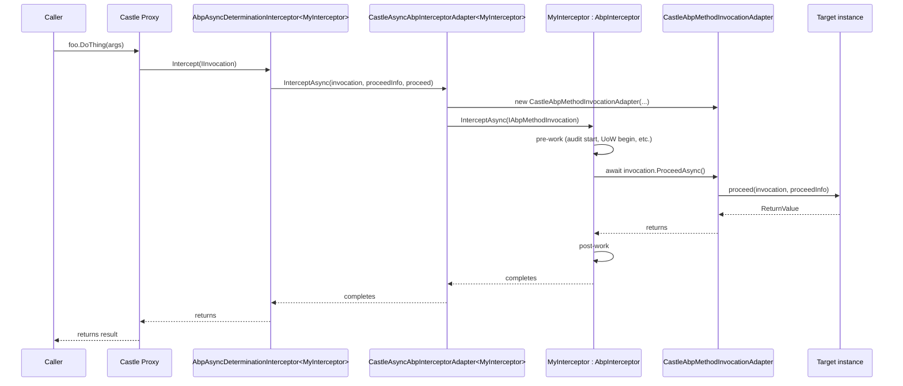

ABP Framework abstracts dynamic interception behind two interfaces that have no dependency on Castle or any other proxy library: `IAbpInterceptor` describes the cross-cutting concern, and `IAbpMethodInvocation` describes the call being intercepted. A thin adapter in `framework/src/Volo.Abp.Castle.Core/` bridges these to Castle.DynamicProxy when the application opts in. This page covers every file in `framework/src/Volo.Abp.Core/Volo/Abp/DynamicProxy/` plus the four adapter classes in `framework/src/Volo.Abp.Castle.Core/Volo/Abp/Castle/DynamicProxy/`.

## File inventory

| File | Purpose |
| --- | --- |
| `Volo.Abp.Core/Volo/Abp/DynamicProxy/IAbpInterceptor.cs` | `Task InterceptAsync(IAbpMethodInvocation invocation)`. |
| `Volo.Abp.Core/Volo/Abp/DynamicProxy/AbpInterceptor.cs` | Abstract base for `IAbpInterceptor`. |
| `Volo.Abp.Core/Volo/Abp/DynamicProxy/IAbpMethodInvocation.cs` | Library-agnostic invocation contract. |
| `Volo.Abp.Core/Volo/Abp/DynamicProxy/ProxyHelper.cs` | `IsProxy`, `UnProxy`, `GetUnProxiedType`. |
| `Volo.Abp.Core/Volo/Abp/DynamicProxy/DynamicProxyIgnoreTypes.cs` | Opt-out registry for proxy generation. |
| `Volo.Abp.Castle.Core/.../AbpAsyncDeterminationInterceptor.cs` | The `Castle.DynamicProxy.AsyncDeterminationInterceptor` subclass that wires an `IAbpInterceptor`. |
| `Volo.Abp.Castle.Core/.../CastleAsyncAbpInterceptorAdapter.cs` | The `AsyncInterceptorBase` that calls `IAbpInterceptor.InterceptAsync`. |
| `Volo.Abp.Castle.Core/.../CastleAbpMethodInvocationAdapterBase.cs` | Implements `IAbpMethodInvocation` on top of Castle's `IInvocation`. |
| `Volo.Abp.Castle.Core/.../CastleAbpMethodInvocationAdapter.cs` | Concrete adapter for void/Task methods. |
| `Volo.Abp.Castle.Core/.../CastleAbpMethodInvocationAdapterWithReturnValue.cs` | Concrete adapter for `Task<T>` methods. |
| `Volo.Abp.Castle.Core/.../AbpCastleCoreModule.cs` | Module that registers `AbpAsyncDeterminationInterceptor<>` as transient. |

## IAbpInterceptor

`IAbpInterceptor` from `framework/src/Volo.Abp.Core/Volo/Abp/DynamicProxy/IAbpInterceptor.cs` is a single async method:

```csharp
public interface IAbpInterceptor
{
    Task InterceptAsync(IAbpMethodInvocation invocation);
}
```

The base class `AbpInterceptor` is equally lean:

```csharp
public abstract class AbpInterceptor : IAbpInterceptor
{
    public abstract Task InterceptAsync(IAbpMethodInvocation invocation);
}
```

Concrete interceptors live in higher-level packages — `AuditingInterceptor`, `AuthorizationInterceptor`, `FeatureInterceptor`, `UnitOfWorkInterceptor`, etc. Each subclasses `AbpInterceptor`, performs its work, and calls `await invocation.ProceedAsync()` to invoke the next interceptor / the target method.

<Note>
  Because the interface is async-only, sync method calls flow through `InterceptAsync` too. The Castle adapter (see below) determines at runtime whether the original method was `void`/`Task`/`Task<T>` and bridges accordingly.
</Note>

## IAbpMethodInvocation

The invocation contract is intentionally a strict subset of Castle's `IInvocation`. From `framework/src/Volo.Abp.Core/Volo/Abp/DynamicProxy/IAbpMethodInvocation.cs`:

```csharp
public interface IAbpMethodInvocation
{
    object?[] Arguments { get; }
    IReadOnlyDictionary<string, object?> ArgumentsDictionary { get; }
    Type[]? GenericArguments { get; }
    object? TargetObject { get; }
    MethodInfo Method { get; }
    object ReturnValue { get; set; }
    Task ProceedAsync();
}
```

Notable choices:

- `Arguments` are mutable boxes; an interceptor *can* rewrite them before `ProceedAsync`.
- `ArgumentsDictionary` is lazily computed by the adapter (see `CastleAbpMethodInvocationAdapterBase` below) and indexed by parameter name so interceptors don't have to hard-code positions.
- `ReturnValue` is mutable but is only meaningful after `ProceedAsync` returns or before it is called when an interceptor short-circuits.
- `TargetObject` is the unproxied instance — the actual subject of the call.

## ProxyHelper

`ProxyHelper` peeks through Castle's `Castle.Proxies` namespace and exposes three utility methods:

```csharp
public static bool IsProxy(object obj) => obj.GetType().Namespace == ProxyNamespace;

public static object UnProxy(object obj)
{
    if (obj.GetType().Namespace != ProxyNamespace) return obj;
    var targetField = obj.GetType()
        .GetFields(BindingFlags.Instance | BindingFlags.NonPublic)
        .FirstOrDefault(f => f.Name == "__target");
    if (targetField == null) return obj;
    return targetField.GetValue(obj)!;
}

public static Type GetUnProxiedType(object obj)
{
    if (obj.GetType().Namespace == ProxyNamespace)
    {
        var target = UnProxy(obj);
        if (target == obj) return obj.GetType().GetTypeInfo().BaseType!;
        return target.GetType();
    }
    return obj.GetType();
}
```

These are used throughout ABP whenever code needs the concrete implementation type (for audit logging, EF Core entity-type discovery, etc.). The constant `ProxyNamespace = "Castle.Proxies"` is hard-coded here so non-Castle proxy libraries would need their own helper.

## DynamicProxyIgnoreTypes

The `DynamicProxyIgnoreTypes` static class is the safety valve for the perf concern described in its XML doc — proxying MVC controllers introduces enough overhead that ABP recommends moving cross-cutting concerns to middleware/filters for those types. The class exposes a thread-safe `HashSet<Type>` and a `Contains` check that walks inheritance by default:

```csharp
public static class DynamicProxyIgnoreTypes
{
    private static HashSet<Type> IgnoredTypes { get; } = new HashSet<Type>();

    public static void Add<T>() => Add(typeof(T));
    public static void Add(Type type) { lock (IgnoredTypes) IgnoredTypes.AddIfNotContains(type); }
    public static void Add(params Type[] types) { lock (IgnoredTypes) IgnoredTypes.AddIfNotContains(types); }

    public static bool Contains(Type type, bool includeDerivedTypes = true)
    {
        lock (IgnoredTypes)
            return includeDerivedTypes
                ? IgnoredTypes.Any(t => t.IsAssignableFrom(type))
                : IgnoredTypes.Contains(type);
    }
}
```

The doc comment quotes the issue links — [castleproject/Core#486](https://github.com/castleproject/Core/issues/486) and [abpframework/abp#3180](https://github.com/abpframework/abp/issues/3180) — and explicitly recommends middleware/filters for the affected components.

<Warning>
  When you register a class via `DynamicProxyIgnoreTypes.Add<TController>()`, the type *cannot* receive interceptor-based cross-cutting concerns (UoW, audit, authorization). You become responsible for applying them through MVC filters or middleware.
</Warning>

## The Castle bridge

`AbpCastleCoreModule` in `framework/src/Volo.Abp.Castle.Core/Volo/Abp/Castle/AbpCastleCoreModule.cs` is a one-line module:

```csharp
public class AbpCastleCoreModule : AbpModule
{
    public override void ConfigureServices(ServiceConfigurationContext context)
        => context.Services.AddTransient(typeof(AbpAsyncDeterminationInterceptor<>));
}
```

Higher-level packages depend on this module so the open generic `AbpAsyncDeterminationInterceptor<T>` is available to be closed over each concrete `IAbpInterceptor` subclass.

### AbpAsyncDeterminationInterceptor

This class is the entry point that downstream code wires into Castle's `ProxyGenerator`:

```csharp
public class AbpAsyncDeterminationInterceptor<TInterceptor> : AsyncDeterminationInterceptor
    where TInterceptor : IAbpInterceptor
{
    public AbpAsyncDeterminationInterceptor(TInterceptor abpInterceptor)
        : base(new CastleAsyncAbpInterceptorAdapter<TInterceptor>(abpInterceptor)) { }
}
```

`AsyncDeterminationInterceptor` is from the `Castle.Core.AsyncInterceptor` library — it inspects each method's return type and routes it to the appropriate `AsyncInterceptorBase` overload. The generic parameter `TInterceptor` ensures DI resolves the right concrete `IAbpInterceptor`.

### CastleAsyncAbpInterceptorAdapter

This is the actual bridge — it derives from `AsyncInterceptorBase` and forwards both flavours of `InterceptAsync`:

```csharp
public class CastleAsyncAbpInterceptorAdapter<TInterceptor> : AsyncInterceptorBase
    where TInterceptor : IAbpInterceptor
{
    private readonly TInterceptor _abpInterceptor;

    public CastleAsyncAbpInterceptorAdapter(TInterceptor abpInterceptor)
        => _abpInterceptor = abpInterceptor;

    protected override async Task InterceptAsync(IInvocation invocation, IInvocationProceedInfo proceedInfo,
        Func<IInvocation, IInvocationProceedInfo, Task> proceed)
    {
        await _abpInterceptor.InterceptAsync(
            new CastleAbpMethodInvocationAdapter(invocation, proceedInfo, proceed));
    }

    protected override async Task<TResult> InterceptAsync<TResult>(IInvocation invocation, IInvocationProceedInfo proceedInfo,
        Func<IInvocation, IInvocationProceedInfo, Task<TResult>> proceed)
    {
        var adapter = new CastleAbpMethodInvocationAdapterWithReturnValue<TResult>(invocation, proceedInfo, proceed);
        await _abpInterceptor.InterceptAsync(adapter);
        return (TResult)adapter.ReturnValue;
    }
}
```

Two adapter classes correspond to the two `InterceptAsync` overloads — one for `void`/`Task`, one for `Task<TResult>`.

### CastleAbpMethodInvocationAdapterBase

The base adapter implements every `IAbpMethodInvocation` property by deferring to Castle's `IInvocation`:

```csharp
public abstract class CastleAbpMethodInvocationAdapterBase : IAbpMethodInvocation
{
    public object?[] Arguments => Invocation.Arguments;
    public IReadOnlyDictionary<string, object?> ArgumentsDictionary => _lazyArgumentsDictionary.Value;
    public Type[]? GenericArguments => Invocation.GenericArguments;
    public object? TargetObject => Invocation.InvocationTarget ?? Invocation.MethodInvocationTarget;
    public MethodInfo Method => Invocation.MethodInvocationTarget ?? Invocation.Method;
    public object ReturnValue { get; set; } = null!;
    protected IInvocation Invocation { get; }

    protected CastleAbpMethodInvocationAdapterBase(IInvocation invocation)
    {
        Invocation = invocation;
        _lazyArgumentsDictionary = new Lazy<IReadOnlyDictionary<string, object?>>(GetArgumentsDictionary);
    }

    public abstract Task ProceedAsync();

    private IReadOnlyDictionary<string, object?> GetArgumentsDictionary()
    {
        var dict = new Dictionary<string, object?>();
        var methodParameters = Method.GetParameters();
        for (var i = 0; i < methodParameters.Length; i++)
            dict[methodParameters[i].Name!] = Invocation.Arguments[i];
        return dict;
    }
}
```

`ArgumentsDictionary` is computed lazily and indexed by `ParameterInfo.Name` — that's why interceptors like the auditing one can ask for `invocation.ArgumentsDictionary["userId"]` reliably.

### CastleAbpMethodInvocationAdapter

The concrete adapter for the `void`/`Task` overload simply stores the proceed delegate and calls it from `ProceedAsync`:

```csharp
public class CastleAbpMethodInvocationAdapter : CastleAbpMethodInvocationAdapterBase, IAbpMethodInvocation
{
    protected IInvocationProceedInfo ProceedInfo { get; }
    protected Func<IInvocation, IInvocationProceedInfo, Task> Proceed { get; }

    public CastleAbpMethodInvocationAdapter(IInvocation invocation, IInvocationProceedInfo proceedInfo,
        Func<IInvocation, IInvocationProceedInfo, Task> proceed)
        : base(invocation)
    {
        ProceedInfo = proceedInfo;
        Proceed = proceed;
    }

    public override async Task ProceedAsync()
        => await Proceed(Invocation, ProceedInfo);
}
```

The `Task<TResult>` variant follows the same pattern and stores the result back into `ReturnValue` after `await`. The Castle adapter casts `adapter.ReturnValue` back to `TResult` once `InterceptAsync` completes.

## End-to-end call sequence



## Wiring an interceptor into a registration

Although `Volo.Abp.Core` defines the abstractions, the actual attachment of interceptors to types happens in `OnServiceRegistredContext.Interceptors` — populated by registration callbacks added through `services.OnRegistred(ctx => ...)` (see [Dependency injection](/core/dependency-injection)). The Castle integration package then iterates that list when building proxies and wraps each `IAbpInterceptor` in an `AbpAsyncDeterminationInterceptor<T>`.

A simplified flow looks like:

<Steps>
  <Step title="Module registers callback">
    `OnRegistred(ctx => { if (ShouldAudit(ctx.ImplementationType)) ctx.Interceptors.Add<AuditingInterceptor>(); })`.
  </Step>
  <Step title="DefaultConventionalRegistrar fires events">
    `ConventionalRegistrarBase.TriggerServiceExposing` fires expose actions; the Castle integration's registrar fires `OnServiceRegistred` actions and stashes interceptor lists per service.
  </Step>
  <Step title="Castle integration builds proxy">
    When the service is resolved, the integration uses `ProxyGenerator.CreateInterfaceProxyWithTarget(...)` or class-proxy methods, passing one `AbpAsyncDeterminationInterceptor<T>` per attached interceptor.
  </Step>
  <Step title="Calls flow through adapter">
    Each call enters `AsyncDeterminationInterceptor`, which decides sync vs async based on the method's return type, then dispatches to `CastleAsyncAbpInterceptorAdapter`.
  </Step>
</Steps>

## Writing an interceptor

The minimal pattern is to derive from `AbpInterceptor` and override `InterceptAsync`:

```csharp
public class TimingInterceptor : AbpInterceptor, ITransientDependency
{
    public ILogger<TimingInterceptor> Logger { get; set; } = NullLogger<TimingInterceptor>.Instance;

    public override async Task InterceptAsync(IAbpMethodInvocation invocation)
    {
        var sw = Stopwatch.StartNew();
        try
        {
            await invocation.ProceedAsync();
        }
        finally
        {
            sw.Stop();
            Logger.LogInformation("{Method} took {Ms} ms", invocation.Method.Name, sw.ElapsedMilliseconds);
        }
    }
}
```

The `using System.Threading.Tasks` invocation is mandatory: every interceptor must either await `ProceedAsync()` or explicitly short-circuit by setting `invocation.ReturnValue` and returning `Task.CompletedTask`.

<Tip>
  Use `invocation.ArgumentsDictionary` instead of `invocation.Arguments[i]` for interceptors that depend on parameter names — it's resilient to method-signature edits.
</Tip>

## Aspects vs interceptors

The `Volo.Abp.Aspects` namespace (covered in [Aspects and method invocation](/core/aspects-and-method-invocation)) provides reentrancy guards that interceptors use to avoid double-applying a concern when one interceptor calls into a method already inside that concern. Specifically `AbpCrossCuttingConcerns.IsApplied(obj, AbpCrossCuttingConcerns.Auditing)` lets an interceptor check whether it is being asked to audit something already inside an audit scope. That guard is independent of the proxy library.

## Related pages

<CardGroup cols={2}>
  <Card title="DI" icon="syringe" href="/core/dependency-injection">
    `OnServiceRegistredContext.Interceptors` is the channel by which interceptors get attached.
  </Card>
  <Card title="Aspects" icon="diagram-project" href="/core/aspects-and-method-invocation">
    `AbpCrossCuttingConcerns.Applying` and `IAvoidDuplicateCrossCuttingConcerns` for reentrancy.
  </Card>
  <Card title="Threading" icon="gauge" href="/core/threading-and-async">
    `AsyncHelper.IsAsync` / `UnwrapTask` are used by the proxy library to decide sync vs async.
  </Card>
  <Card title="Exception handling" icon="triangle-exclamation" href="/core/exception-handling">
    Interceptors are also the natural place to call `IExceptionNotifier.NotifyAsync` from.
  </Card>
</CardGroup>

The DDD pages ([/ddd/overview](/ddd/overview)) demonstrate UoW and authorization interceptors in action; the data layer ([/data/overview](/data/overview)) and HTTP layer ([/infrastructure/overview](/infrastructure/overview)) both lean on this proxy plumbing.
