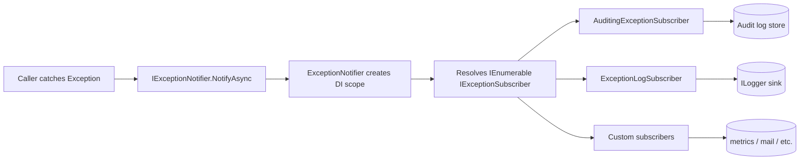
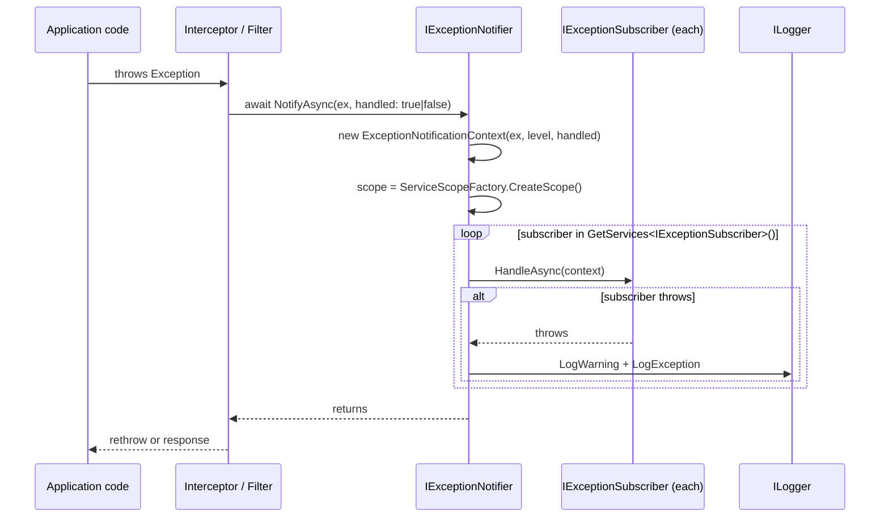

ABP Framework treats exceptions as a first-class observability signal. The `Volo.Abp.ExceptionHandling` namespace defines an in-process pub/sub bus where a single call to `IExceptionNotifier.NotifyAsync` reaches every registered `IExceptionSubscriber`, plus a set of metadata interfaces (`IHasErrorCode`, `IHasErrorDetails`, `IHasHttpStatusCode`, `IHasLogLevel`, `ILocalizeErrorMessage`, `IExceptionWithSelfLogging`) that higher layers — middleware, audit logging, MVC filters — read to shape the response and log entry. Every file in this page lives under `framework/src/Volo.Abp.Core/Volo/Abp/ExceptionHandling/` or `framework/src/Volo.Abp.Core/Volo/Abp/Logging/`.

## File inventory

| File | Symbol | Purpose |
| --- | --- | --- |
| `ExceptionHandling/IExceptionNotifier.cs` | `IExceptionNotifier` | `Task NotifyAsync(ExceptionNotificationContext)`. |
| `ExceptionHandling/ExceptionNotifier.cs` | `ExceptionNotifier` | Default implementation; iterates `IExceptionSubscriber`s. |
| `ExceptionHandling/NullExceptionNotifier.cs` | `NullExceptionNotifier` | No-op singleton; used as a default. |
| `ExceptionHandling/ExceptionNotifierExtensions.cs` | extensions | `NotifyAsync(this IExceptionNotifier, Exception, LogLevel?, bool)`. |
| `ExceptionHandling/IExceptionSubscriber.cs` | `IExceptionSubscriber` | `Task HandleAsync(ExceptionNotificationContext)`. |
| `ExceptionHandling/ExceptionSubscriber.cs` | `ExceptionSubscriber` | Abstract base, `[ExposeServices(typeof(IExceptionSubscriber))]`, transient. |
| `ExceptionHandling/ExceptionNotificationContext.cs` | DTO | `Exception`, `LogLevel`, `Handled`. |
| `ExceptionHandling/IHasErrorCode.cs` | `IHasErrorCode` | `string? Code`. |
| `ExceptionHandling/IHasErrorDetails.cs` | `IHasErrorDetails` | `string? Details`. |
| `ExceptionHandling/IHasHttpStatusCode.cs` | `IHasHttpStatusCode` | `int HttpStatusCode`. |
| `ExceptionHandling/ILocalizeErrorMessage.cs` | `ILocalizeErrorMessage` | `string LocalizeMessage(LocalizationContext)`. |
| `Logging/IHasLogLevel.cs` | `IHasLogLevel` | `LogLevel LogLevel { get; set; }`. |
| `Logging/HasLogLevelExtensions.cs` | extensions | `WithLogLevel<TException>(this TException, LogLevel)`. |
| `Logging/IExceptionWithSelfLogging.cs` | `IExceptionWithSelfLogging` | `void Log(ILogger)`. |

## IExceptionNotifier

The interface is a single async method on the receiving side. From `framework/src/Volo.Abp.Core/Volo/Abp/ExceptionHandling/IExceptionNotifier.cs`:

```csharp
public interface IExceptionNotifier
{
    Task NotifyAsync([NotNull] ExceptionNotificationContext context);
}
```

`ExceptionNotifier` (default impl) is a transient that resolves subscribers per call from a new DI scope, isolating each subscriber's failures from the next:

```csharp
public class ExceptionNotifier : IExceptionNotifier, ITransientDependency
{
    public ILogger<ExceptionNotifier> Logger { get; set; }
    protected IServiceScopeFactory ServiceScopeFactory { get; }

    public ExceptionNotifier(IServiceScopeFactory serviceScopeFactory)
    {
        ServiceScopeFactory = serviceScopeFactory;
        Logger = NullLogger<ExceptionNotifier>.Instance;
    }

    public virtual async Task NotifyAsync([NotNull] ExceptionNotificationContext context)
    {
        Check.NotNull(context, nameof(context));
        using (var scope = ServiceScopeFactory.CreateScope())
        {
            var exceptionSubscribers = scope.ServiceProvider.GetServices<IExceptionSubscriber>();
            foreach (var exceptionSubscriber in exceptionSubscribers)
            {
                try { await exceptionSubscriber.HandleAsync(context); }
                catch (Exception e)
                {
                    Logger.LogWarning($"Exception subscriber of type {exceptionSubscriber.GetType().AssemblyQualifiedName} has thrown an exception!");
                    Logger.LogException(e, LogLevel.Warning);
                }
            }
        }
    }
}
```

Two design choices stand out: scoped resolution (the subscriber bag can include scoped services like `ICurrentUser`-aware audit writers), and the try/catch wrapper that *never* lets a subscriber failure propagate back to the caller.

`NullExceptionNotifier` is the safety default used by components — like `AbpAsyncTimer` — that are constructed before the DI container exists or that may run in contexts without a notifier:

```csharp
public class NullExceptionNotifier : IExceptionNotifier
{
    public static NullExceptionNotifier Instance { get; } = new NullExceptionNotifier();
    private NullExceptionNotifier() { }
    public Task NotifyAsync(ExceptionNotificationContext context) => Task.CompletedTask;
}
```

## ExceptionNotificationContext

```csharp
public class ExceptionNotificationContext
{
    [NotNull] public Exception Exception { get; }
    public LogLevel LogLevel { get; }
    public bool Handled { get; }

    public ExceptionNotificationContext(
        [NotNull] Exception exception,
        LogLevel? logLevel = null,
        bool handled = true)
    {
        Exception = Check.NotNull(exception, nameof(exception));
        LogLevel = logLevel ?? exception.GetLogLevel();
        Handled = handled;
    }
}
```

The two non-exception fields matter:

- **`LogLevel`** — if the caller does not supply one, the context calls `exception.GetLogLevel()`. That extension lives in the `Logging` namespace and reads `IHasLogLevel.LogLevel`. So a `BusinessException` with `LogLevel = LogLevel.Warning` propagates that level into every subscriber.
- **`Handled`** — `true` means upstream code has already produced a response and is just informing observers; `false` means the exception is about to propagate. Audit-log subscribers typically distinguish the two.

## ExceptionNotifierExtensions

The static extension hides the context construction so callers can simply pass an exception:

```csharp
public static Task NotifyAsync(
    [NotNull] this IExceptionNotifier exceptionNotifier,
    [NotNull] Exception exception,
    LogLevel? logLevel = null,
    bool handled = true)
{
    Check.NotNull(exceptionNotifier, nameof(exceptionNotifier));
    return exceptionNotifier.NotifyAsync(
        new ExceptionNotificationContext(exception, logLevel, handled));
}
```

This is the call pattern you will see across the framework — `await _exceptionNotifier.NotifyAsync(ex);`.

## IExceptionSubscriber

Subscribers implement `IExceptionSubscriber.HandleAsync`. The abstract base `ExceptionSubscriber` registers itself transiently and explicitly exposes the abstraction:

```csharp
[ExposeServices(typeof(IExceptionSubscriber))]
public abstract class ExceptionSubscriber : IExceptionSubscriber, ITransientDependency
{
    public abstract Task HandleAsync(ExceptionNotificationContext context);
}
```

The `[ExposeServices(typeof(IExceptionSubscriber))]` is critical: without it, the `DefaultConventionalRegistrar`'s "interface name minus I matches type name" rule would not pick `IExceptionSubscriber` for, say, `AuditingExceptionSubscriber`. By forcing the exposure here, every derived class registers correctly without needing its own attribute.

## Subscriber composition



Notice the fan-out: every subscriber receives the same context. The order is whatever DI happens to register them in — subscribers must therefore be order-independent.

## Log-level propagation

`IHasLogLevel` is the way to attach a log level to an exception:

```csharp
public interface IHasLogLevel
{
    LogLevel LogLevel { get; set; }
}
```

`BusinessException` implements this and defaults to `LogLevel.Warning` (see [Business exceptions](/core/business-exceptions)). `HasLogLevelExtensions.WithLogLevel` is a fluent setter:

```csharp
public static TException WithLogLevel<TException>([NotNull] this TException exception, LogLevel logLevel)
    where TException : IHasLogLevel
{
    Check.NotNull(exception, nameof(exception));
    exception.LogLevel = logLevel;
    return exception;
}
```

So callers can write `throw new MyException().WithLogLevel(LogLevel.Error);` and downstream loggers will pick up the requested level.

`IExceptionWithSelfLogging` is the escape hatch for exceptions that want to fully control their log emission:

```csharp
public interface IExceptionWithSelfLogging
{
    void Log(ILogger logger);
}
```

A logger-aware infrastructure component checks for this interface first; if present, it calls `Log(logger)` and skips its default rendering of stack trace + message.

## Metadata interfaces

These three interfaces are the contract HTTP and remote-service layers read to produce well-formed error responses:

| Interface | Member | Used by |
| --- | --- | --- |
| `IHasErrorCode` | `string? Code` | Maps to `error.code` in the standard ABP error JSON. |
| `IHasErrorDetails` | `string? Details` | Maps to `error.details`. |
| `IHasHttpStatusCode` | `int HttpStatusCode` | The HTTP middleware uses this to set the response status. |
| `ILocalizeErrorMessage` | `string LocalizeMessage(LocalizationContext)` | Lets the exception localize itself given a `LocalizationContext`. |

All of these are *optional* — a subscriber or HTTP handler must defensively cast (`exception is IHasHttpStatusCode hh`) before reading. The framework's `BusinessException`/`UserFriendlyException` hierarchy implements the first two automatically; see [Business exceptions](/core/business-exceptions).

`ILocalizeErrorMessage` is special: it accepts a `LocalizationContext` (defined in `Volo.Abp.Localization`) so the exception can resolve `IStringLocalizer` instances on demand. Higher-level packages such as `Volo.Abp.AspNetCore.Mvc` invoke it once they have built the localization context for the request.

## Where exceptions get notified from

There is no single place that catches every exception — instead, ABP attaches notifiers at *every* boundary that can produce a response or persist a side effect:

- **Interceptors**: UoW, auditing, and authorization interceptors all wrap their `await invocation.ProceedAsync()` in a try/catch that calls `_exceptionNotifier.NotifyAsync(ex, handled: false)` before rethrowing.
- **MVC filters**: the AspNetCore MVC integration installs an `AbpExceptionFilter` that catches everything, calls `NotifyAsync(ex)`, then writes the response.
- **Background workers**: `AbpAsyncTimer` (in `framework/src/Volo.Abp.Threading/Volo/Abp/Threading/AbpAsyncTimer.cs`) has an injected `IExceptionNotifier` so workers can notify failures without crashing the timer.

Each call site decides the `handled` flag and the optional `LogLevel` override.

## Typical subscriber

A canonical audit-log subscriber looks like this (simplified from the AuditLogging module):

```csharp
public class AuditingExceptionSubscriber : ExceptionSubscriber
{
    private readonly IAuditingHelper _auditingHelper;

    public AuditingExceptionSubscriber(IAuditingHelper auditingHelper)
    {
        _auditingHelper = auditingHelper;
    }

    public override Task HandleAsync(ExceptionNotificationContext context)
    {
        if (!_auditingHelper.IsEnabled || !context.Handled) return Task.CompletedTask;
        _auditingHelper.AddException(context.Exception);
        return Task.CompletedTask;
    }
}
```

Because `ExceptionSubscriber` is `[ExposeServices(typeof(IExceptionSubscriber))]` and `ITransientDependency`, the class is picked up automatically by `DefaultConventionalRegistrar` as soon as its assembly is added via `Services.AddAssembly`.

## InitLogger contrast

The exception bus is *runtime* infrastructure — it requires the DI container to exist. For errors that happen during `AbpApplicationBase.ConfigureServices` (before any provider is built), the framework uses a different mechanism: `IInitLogger<T>` (in `framework/src/Volo.Abp.Core/Volo/Abp/Logging/IInitLogger.cs`). `DefaultInitLogger<T>` buffers entries in a `List<AbpInitLogEntry>`:

```csharp
public class AbpInitLogEntry
{
    public LogLevel LogLevel { get; set; }
    public EventId EventId { get; set; }
    public object State { get; set; } = default!;
    public Exception? Exception { get; set; }
    public Func<object, Exception?, string> Formatter { get; set; } = default!;
    public string Message => Formatter(State, Exception);
}
```

After initialization, `AbpApplicationBase.WriteInitLogs` (covered in [ABP application and bootstrap](/core/abp-application-and-bootstrap)) drains these into the real `ILogger<AbpApplicationBase>`. So the two pipelines complement each other — init-time goes through `IInitLogger`, runtime through `IExceptionNotifier`.

## Flow from throw to subscriber



## Composing levels and handled-flag

<Tabs>
  <Tab title="Handled exception">
    Used when a filter has already produced an HTTP error response and just needs to notify observers:
    ```csharp
    await _exceptionNotifier.NotifyAsync(ex, handled: true);
    ```
  </Tab>
  <Tab title="Unhandled exception">
    Used by interceptors that catch, notify, and rethrow so the host's terminal handler can act:
    ```csharp
    try { await invocation.ProceedAsync(); }
    catch (Exception ex)
    {
        await _exceptionNotifier.NotifyAsync(ex, handled: false);
        throw;
    }
    ```
  </Tab>
  <Tab title="Force a log level">
    Force a specific level overriding `IHasLogLevel`:
    ```csharp
    await _exceptionNotifier.NotifyAsync(ex, logLevel: LogLevel.Error);
    ```
  </Tab>
</Tabs>

## Related pages

<CardGroup cols={2}>
  <Card title="Business exceptions" icon="circle-info" href="/core/business-exceptions">
    `BusinessException`, `UserFriendlyException`, and the metadata interfaces working together.
  </Card>
  <Card title="Bootstrap" icon="rocket" href="/core/abp-application-and-bootstrap">
    `IInitLogger<T>` for init-time errors before DI is available.
  </Card>
  <Card title="DI" icon="syringe" href="/core/dependency-injection">
    `[ExposeServices(typeof(IExceptionSubscriber))]` and how the bag is resolved.
  </Card>
  <Card title="Tracing" icon="route" href="/core/tracing-and-correlation">
    Subscribers usually log the current correlation id alongside the exception.
  </Card>
</CardGroup>

Persistence ([/data/overview](/data/overview)) hooks `IExceptionNotifier` into UoW commit failures; the HTTP layer ([/infrastructure/overview](/infrastructure/overview)) wires it to `AbpExceptionFilter` so every unhandled exception produces a standard error envelope.
