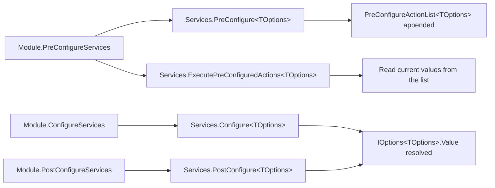

ABP Framework leans heavily on `Microsoft.Extensions.Options`. On top of it, `Volo.Abp.Core` adds three things: a `PreConfigure<TOptions>` extension that runs before any `Configure<TOptions>` so module options can be mutated *while still building* the service collection; a custom `IOptionsFactory<TOptions>` that adds validation; and an unnamed options manager that drops the locking from the BCL implementation. This page covers every file under `framework/src/Volo.Abp.Core/Volo/Abp/Options/` plus the `ServiceCollectionPreConfigureExtensions` and `ServiceCollectionOptionsExtensions` extensions used by every `AbpModule`.

## File inventory

| File | Symbol | Role |
| --- | --- | --- |
| `Options/PreConfigureActionList.cs` | `PreConfigureActionList<TOptions>` | A `List<Action<TOptions>>` with `Configure(...)` helpers. |
| `Options/AbpOptionsFactory.cs` | `AbpOptionsFactory<TOptions>` | Custom `IOptionsFactory<TOptions>` with validations. |
| `Options/AbpUnnamedOptionsManager.cs` | `AbpUnnamedOptionsManager<TOptions>` | `IOptions<TOptions>` without per-call locking. |
| `Options/AbpDynamicOptionsManager.cs` | `AbpDynamicOptionsManager<T>` | Subclasses `OptionsManager<T>`, adds `SetAsync(name)` for dynamic overrides. |
| `Microsoft/Extensions/DependencyInjection/ServiceCollectionPreConfigureExtensions.cs` | extensions | `PreConfigure`, `ExecutePreConfiguredActions`, `GetPreConfigureActions`. |
| `Microsoft/Extensions/DependencyInjection/ServiceCollectionOptionsExtensions.cs` | extensions | `AddAbpOptions<TOptions>()` factory. |
| `Modularity/AbpModule.cs` | `AbpModule.Configure / PreConfigure / PostConfigure / PostConfigureAll` | Typed helpers that delegate to the extensions. |

## Three phases recap

Microsoft's options system supports two phases: `Configure` and `PostConfigure`. ABP adds a third phase that runs **before** the `IServiceCollection` is even finalised — `PreConfigure`. The three relate as follows:

| Phase | When it runs | Where the action list lives | Typical use |
| --- | --- | --- | --- |
| `PreConfigure<TOptions>` | During `IPreConfigureServices.PreConfigureServices` of every module | `PreConfigureActionList<TOptions>` stored in an `ObjectAccessor` | Mutate options *inside `ConfigureServices`* — e.g. seed `[ExposeServices]` lists before later modules use them. |
| `Configure<TOptions>` | When `IOptions<TOptions>` is resolved | `IConfigureOptions<TOptions>` services | Standard pattern: bind config, set defaults. |
| `PostConfigure<TOptions>` | After every `Configure` runs | `IPostConfigureOptions<TOptions>` services | Final tweaks (e.g. merge multiple module contributions). |

The flow is:



## PreConfigure

The extension lives in `framework/src/Volo.Abp.Core/Microsoft/Extensions/DependencyInjection/ServiceCollectionPreConfigureExtensions.cs`:

```csharp
public static IServiceCollection PreConfigure<TOptions>(this IServiceCollection services, Action<TOptions> optionsAction)
{
    services.GetPreConfigureActions<TOptions>().Add(optionsAction);
    return services;
}

public static TOptions ExecutePreConfiguredActions<TOptions>(this IServiceCollection services)
    where TOptions : new() => services.ExecutePreConfiguredActions(new TOptions());

public static TOptions ExecutePreConfiguredActions<TOptions>(this IServiceCollection services, TOptions options)
{
    services.GetPreConfigureActions<TOptions>().Configure(options);
    return options;
}

public static PreConfigureActionList<TOptions> GetPreConfigureActions<TOptions>(this IServiceCollection services)
{
    var actionList = services.GetSingletonInstanceOrNull<IObjectAccessor<PreConfigureActionList<TOptions>>>()?.Value;
    if (actionList == null)
    {
        actionList = new PreConfigureActionList<TOptions>();
        services.AddObjectAccessor(actionList);
    }
    return actionList;
}
```

`PreConfigureActionList<TOptions>` itself is a thin `List<Action<TOptions>>`:

```csharp
public class PreConfigureActionList<TOptions> : List<Action<TOptions>>
{
    public void Configure(TOptions options)
    {
        foreach (var action in this) action(options);
    }

    public TOptions Configure()
    {
        var options = Activator.CreateInstance<TOptions>();
        Configure(options);
        return options;
    }
}
```

The list is stored in an `ObjectAccessor` (see [Dependency injection](/core/dependency-injection)) so it can be mutated by multiple modules *during* `ConfigureServices`, and read by the same modules *via* `ExecutePreConfiguredActions` — all without requiring the DI container to exist.

<Note>
  Note the subtle but important difference: `Configure` registers an `IConfigureOptions<TOptions>` that runs lazily when `IOptions<TOptions>.Value` is first read. `PreConfigure` runs *immediately* when `ExecutePreConfiguredActions` is called — usually within the same `ConfigureServices` pass.
</Note>

### Use case for PreConfigure

A canonical scenario is when a module needs to read options that another module might want to extend. Module A defines an options class with a list and exposes `AddXyz()` from `PreConfigure`. Module B (depending on A) needs the *current* state of that list to drive its own registrations. Without `PreConfigure`, B would resolve `IOptions<TOptions>.Value` — but that requires a built provider. With `PreConfigure`, B simply does:

```csharp
var snapshot = context.Services.ExecutePreConfiguredActions<MyOptions>();
foreach (var x in snapshot.Items) services.AddTransient(x);
```

## Configure and PostConfigure

These are stock `Microsoft.Extensions.Options` patterns. `AbpModule` exposes typed shortcuts (covered in [Modularity and modules](/core/modularity-and-modules)):

```csharp
protected void Configure<TOptions>(Action<TOptions> configureOptions) where TOptions : class
    => ServiceConfigurationContext.Services.Configure(configureOptions);

protected void Configure<TOptions>(IConfiguration configuration) where TOptions : class
    => ServiceConfigurationContext.Services.Configure<TOptions>(configuration);

protected void Configure<TOptions>(string name, Action<TOptions> configureOptions) where TOptions : class
    => ServiceConfigurationContext.Services.Configure(name, configureOptions);

protected void PostConfigure<TOptions>(Action<TOptions> configureOptions) where TOptions : class
    => ServiceConfigurationContext.Services.PostConfigure(configureOptions);

protected void PostConfigureAll<TOptions>(Action<TOptions> configureOptions) where TOptions : class
    => ServiceConfigurationContext.Services.PostConfigureAll(configureOptions);
```

`PostConfigureAll` is the BCL extension for applying a post-configuration to *every* named options instance — useful when a module overlays a setting on top of all instances.

## AbpOptionsFactory

The BCL ships `Microsoft.Extensions.Options.OptionsFactory<TOptions>`. ABP carries its own near-copy to add validation support before the BCL had it. From `framework/src/Volo.Abp.Core/Volo/Abp/Options/AbpOptionsFactory.cs`:

```csharp
public class AbpOptionsFactory<TOptions> : IOptionsFactory<TOptions> where TOptions : class, new()
{
    private readonly IConfigureOptions<TOptions>[] _setups;
    private readonly IPostConfigureOptions<TOptions>[] _postConfigures;
    private readonly IValidateOptions<TOptions>[] _validations;

    public virtual TOptions Create(string name)
    {
        var options = CreateInstance(name);
        ConfigureOptions(name, options);
        PostConfigureOptions(name, options);
        ValidateOptions(name, options);
        return options;
    }

    protected virtual void ConfigureOptions(string name, TOptions options)
    {
        foreach (var setup in _setups)
        {
            if (setup is IConfigureNamedOptions<TOptions> namedSetup)
                namedSetup.Configure(name, options);
            else if (name == Microsoft.Extensions.Options.Options.DefaultName)
                setup.Configure(options);
        }
    }

    protected virtual void PostConfigureOptions(string name, TOptions options)
    {
        foreach (var post in _postConfigures) post.PostConfigure(name, options);
    }

    protected virtual void ValidateOptions(string name, TOptions options)
    {
        if (_validations.Length <= 0) return;
        var failures = new List<string>();
        foreach (var validate in _validations)
        {
            var result = validate.Validate(name, options);
            if (result.Failed) failures.AddRange(result.Failures);
        }
        if (failures.Count > 0)
            throw new OptionsValidationException(name, typeof(TOptions), failures);
    }
}
```

The class header includes a `// TODO` pointing to [dotnet/runtime#258](https://github.com/aspnet/Options/pull/258) — the work is now upstream, and `AbpOptionsFactory` is essentially the back-fill.

`CreateInstance` is virtual so derived factories can populate options from sources other than `Activator.CreateInstance<TOptions>()`.

## AbpUnnamedOptionsManager

The default `IOptions<TOptions>` implementation from the BCL takes a `lock` on every read after the first. That can cause deadlocks when multi-threaded code resolves options concurrently with reentrant scopes. ABP provides an unsynchronised variant in `framework/src/Volo.Abp.Core/Volo/Abp/Options/AbpUnnamedOptionsManager.cs`:

```csharp
/// <summary>
/// This Options manager is similar to Microsoft UnnamedOptionsManager but without the locking mechanism.
/// Prevent deadlocks when accessing options in multiple threads.
/// </summary>
public class AbpUnnamedOptionsManager<TOptions> : IOptions<TOptions>
    where TOptions : class
{
    private readonly IOptionsFactory<TOptions> _factory;
    private TOptions? _value;

    public AbpUnnamedOptionsManager(IOptionsFactory<TOptions> factory) => _factory = factory;

    public TOptions Value
    {
        get
        {
            if (_value is { } value) return value;
            _value = _factory.Create(Microsoft.Extensions.Options.Options.DefaultName);
            return _value;
        }
    }
}
```

Because two threads racing through `Value` may both create an instance, the contract requires `Create` to be cheap and idempotent. `AbpUnnamedOptionsManager` is the version registered when a module calls `AddAbpOptions<TOptions>()`.

### AddAbpOptions

From `framework/src/Volo.Abp.Core/Microsoft/Extensions/DependencyInjection/ServiceCollectionOptionsExtensions.cs`:

```csharp
public static OptionsBuilder<TOptions> AddAbpOptions<TOptions>(this IServiceCollection services)
    where TOptions : class
{
    services.TryAddSingleton<IOptions<TOptions>, AbpUnnamedOptionsManager<TOptions>>();
    return services.AddOptions<TOptions>();
}
```

The XML doc warns: *"You should only use this method to register options if you need to continue using the ServiceProvider to get other options in your Options configuration method. Otherwise, please use the default AddOptions method for better performance."* The reason is that `AbpUnnamedOptionsManager` defers locking, which is fine if no recursive resolution occurs but adds a small cost compared with the BCL's optimised path.

## AbpDynamicOptionsManager

`AbpDynamicOptionsManager<T>` is the base class for options that can be *re-evaluated* at runtime — used by tenant- or settings-aware options. From `framework/src/Volo.Abp.Core/Volo/Abp/Options/AbpDynamicOptionsManager.cs`:

```csharp
public abstract class AbpDynamicOptionsManager<T> : OptionsManager<T>
    where T : class
{
    protected AbpDynamicOptionsManager(IOptionsFactory<T> factory) : base(factory) { }

    public Task SetAsync() => SetAsync(Microsoft.Extensions.Options.Options.DefaultName);

    public virtual Task SetAsync(string name)
        => OverrideOptionsAsync(name, base.Get(name));

    protected abstract Task OverrideOptionsAsync(string name, T options);
}
```

A subclass implements `OverrideOptionsAsync` to mutate the materialised options based on async data (e.g. read setting overrides from a database). The base's `Get(name)` returns the snapshot the BCL's `OptionsManager<T>` would have produced; the subclass amends it in place. Higher-level modules — `Volo.Abp.SettingManagement`, `Volo.Abp.FeatureManagement` — all derive from this base.

## Sequence: end-to-end

```mermaid
sequenceDiagram
    participant M1 as Module A
    participant M2 as Module B (depends on A)
    participant S as IServiceCollection
    participant F as AbpOptionsFactory<MyOptions>
    participant U as AbpUnnamedOptionsManager<MyOptions>
    participant App as Application code
    M1->>S: PreConfigure&lt;MyOptions&gt;(o => o.Items.Add(...))
    M2->>S: var snap = ExecutePreConfiguredActions&lt;MyOptions&gt;()
    M2->>S: Services.AddTransient(snap.Items)
    M1->>S: Configure&lt;MyOptions&gt;(o => ...)
    M2->>S: PostConfigure&lt;MyOptions&gt;(o => ...)
    App->>U: IOptions<MyOptions>.Value
    U->>F: Create("__default__")
    F->>F: ConfigureOptions / PostConfigureOptions / ValidateOptions
    F-->>U: TOptions
    U-->>App: cached value
```

## PreConfigure vs Configure — when to choose which

<Tabs>
  <Tab title="PreConfigure">
    Use when:
    - You need the *current* options inside `ConfigureServices` to decide what to register.
    - Multiple modules need to contribute to a list that a later module reads.
    - You are still building the `IServiceCollection` and there is no `IServiceProvider`.
    ```csharp
    context.Services.PreConfigure<MyOptions>(o => o.Endpoints.Add("/foo"));
    var snap = context.Services.ExecutePreConfiguredActions<MyOptions>();
    ```
  </Tab>
  <Tab title="Configure">
    Use when:
    - You set defaults that runtime code reads via `IOptions<TOptions>`.
    - You bind from `IConfiguration`.
    - You don't need the value before the provider is built.
    ```csharp
    Configure<MyOptions>(context.Configuration.GetSection("My"));
    ```
  </Tab>
  <Tab title="PostConfigure">
    Use when:
    - You overlay a setting on top of every prior contribution.
    - You depend on knowing the final list of items (validations, normalizations).
    ```csharp
    PostConfigure<MyOptions>(o => { if (o.Endpoints.Count == 0) o.Endpoints.Add("/"); });
    ```
  </Tab>
</Tabs>

## Lifetimes

Each registration mechanism has a different lifetime profile:

| Mechanism | Lifetime of options instance |
| --- | --- |
| `AddAbpOptions<TOptions>()` registers `IOptions<TOptions>` as singleton (via `AbpUnnamedOptionsManager<TOptions>`) | Singleton — built once, never re-evaluated. |
| `AddOptions<TOptions>()` (BCL default) | Singleton via `OptionsManager<TOptions>`. |
| `IOptionsSnapshot<TOptions>` (BCL) | Scoped — re-evaluated per scope. |
| `IOptionsMonitor<TOptions>` (BCL) | Singleton with change tokens. |
| `AbpDynamicOptionsManager<TOptions>` subclass | Whatever the subclass is registered as; typically scoped. |

<Warning>
  `PreConfigure` actions only run when someone calls `ExecutePreConfiguredActions`. If no one does, the actions are discarded. Don't use `PreConfigure` as a substitute for `Configure` — they are not interchangeable.
</Warning>

## Related pages

<CardGroup cols={2}>
  <Card title="Modularity" icon="cubes" href="/core/modularity-and-modules">
    `AbpModule.Configure / PreConfigure / PostConfigure / PostConfigureAll` helpers.
  </Card>
  <Card title="DI" icon="syringe" href="/core/dependency-injection">
    `PreConfigureActionList<TOptions>` is held inside an `ObjectAccessor<>`.
  </Card>
  <Card title="Bootstrap" icon="rocket" href="/core/abp-application-and-bootstrap">
    `AbpModuleLifecycleOptions.Contributors` is itself an example of an options class composed across modules.
  </Card>
  <Card title="Plug-ins" icon="puzzle-piece" href="/core/plugins-and-static-definitions">
    Plug-in sources are added through `AbpApplicationCreationOptions.PlugInSources`, a list mutated in `optionsAction`.
  </Card>
</CardGroup>

Persistence options ([/data/overview](/data/overview)) typically use `Configure<AbpDbConnectionOptions>(...)`; HTTP options ([/infrastructure/overview](/infrastructure/overview)) and remote-service options follow the same pattern.
