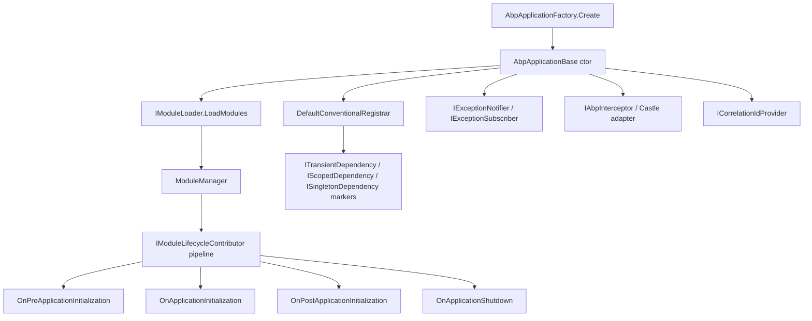
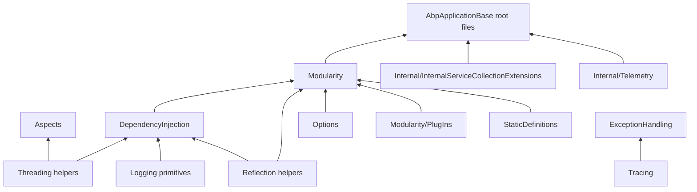

The `Volo.Abp.Core` assembly is the foundation that every ABP Framework application boots from. It lives at `framework/src/Volo.Abp.Core/` and ships the abstractions that turn a plain `Microsoft.Extensions.DependencyInjection` `IServiceCollection` into an ABP application: a startup module, a module dependency graph, conventional service registration, interception, exception subscribers, and a small library of cross-cutting helpers. This page is a map — it inventories every subdirectory of `framework/src/Volo.Abp.Core/Volo/Abp/` and links to the deep-dive page that covers each one.

<Note>
  Everything documented in this section is `Volo.Abp.Core` and the very thin `Volo.Abp.Castle.Core` layer that adapts Castle.DynamicProxy to the `IAbpInterceptor` abstraction in `framework/src/Volo.Abp.Castle.Core/Volo/Abp/Castle/`. Higher-level concerns like UoW, authorization, audit logging, EF Core or HTTP build on these primitives — see [/ddd/overview](/ddd/overview), [/data/overview](/data/overview), and [/infrastructure/overview](/infrastructure/overview).
</Note>

## Where the package lives

The package's root is `framework/src/Volo.Abp.Core/` and its csproj target is the namespace tree rooted at `Volo.Abp`. The most important top-level files in `framework/src/Volo.Abp.Core/Volo/Abp/` are the application class hierarchy (`AbpApplicationBase.cs`, `AbpApplicationFactory.cs`, `AbpApplicationWithInternalServiceProvider.cs`, `AbpApplicationWithExternalServiceProvider.cs`), the public application interfaces (`IAbpApplication.cs`, `IAbpApplicationWithInternalServiceProvider.cs`, `IAbpApplicationWithExternalServiceProvider.cs`), the host environment abstraction (`IAbpHostEnvironment.cs`, `AbpHostEnvironment.cs`), and the canonical exception hierarchy (`AbpException.cs`, `BusinessException.cs`, `UserFriendlyException.cs`, `AbpInitializationException.cs`, `AbpShutdownException.cs`).

The library also installs a set of `IServiceCollection` extensions under `framework/src/Volo.Abp.Core/Microsoft/Extensions/DependencyInjection/` — for example `ServiceCollectionConventionalRegistrationExtensions.cs`, `ServiceCollectionPreConfigureExtensions.cs`, `ServiceCollectionObjectAccessorExtensions.cs`, and `ServiceCollectionRegistrationActionExtensions.cs`. These extensions are how user code talks to `IConventionalRegistrar`, `PreConfigureActionList<TOptions>`, and `ObjectAccessor<T>`.

## Subdirectory inventory

Every folder under `framework/src/Volo.Abp.Core/Volo/Abp/` corresponds to a focused concern. The table below maps each folder to its purpose and to the sibling deep-dive that covers it.

| Folder | Representative files | Topic |
| --- | --- | --- |
| `Modularity/` | `IAbpModule.cs`, `AbpModule.cs`, `DependsOnAttribute.cs`, `ModuleLoader.cs`, `ModuleManager.cs`, `ServiceConfigurationContext.cs`, `DefaultModuleLifecycleContributor.cs` | [Modularity and modules](/core/modularity-and-modules) |
| `Modularity/PlugIns/` | `IPlugInSource.cs`, `PlugInSourceList.cs`, `FolderPlugInSource.cs`, `FilePlugInSource.cs`, `TypePlugInSource.cs` | [Plug-ins and static definitions](/core/plugins-and-static-definitions) |
| `DependencyInjection/` | `ITransientDependency.cs`, `IScopedDependency.cs`, `ISingletonDependency.cs`, `DefaultConventionalRegistrar.cs`, `ConventionalRegistrarBase.cs`, `ExposeServicesAttribute.cs`, `DependencyAttribute.cs`, `DisableConventionalRegistrationAttribute.cs`, `IObjectAccessor.cs`, `ObjectAccessor.cs`, `CachedServiceProvider.cs`, `RootServiceProvider.cs` | [Dependency injection](/core/dependency-injection) |
| `DynamicProxy/` | `IAbpInterceptor.cs`, `AbpInterceptor.cs`, `IAbpMethodInvocation.cs`, `ProxyHelper.cs`, `DynamicProxyIgnoreTypes.cs` | [Dynamic proxy and interceptors](/core/dynamic-proxy-and-interceptors) |
| `ExceptionHandling/` | `IExceptionNotifier.cs`, `ExceptionNotifier.cs`, `IExceptionSubscriber.cs`, `ExceptionNotificationContext.cs`, `IHasErrorCode.cs`, `IHasErrorDetails.cs`, `IHasHttpStatusCode.cs`, `ILocalizeErrorMessage.cs` | [Exception handling](/core/exception-handling) and [Business exceptions](/core/business-exceptions) |
| `Threading/` | `AsyncHelper.cs`, `InternalAsyncHelper.cs`, `AsyncOneTimeRunner.cs`, `OneTimeRunner.cs`, `KeyedLock.cs`, `SemaphoreSlimExtensions.cs`, `LockExtensions.cs`, `TaskCache.cs` | [Threading and async](/core/threading-and-async) |
| `Reflection/` | `AssemblyFinder.cs`, `TypeFinder.cs`, `ReflectionHelper.cs`, `AssemblyHelper.cs`, `TypeHelper.cs`, `IAssemblyFinder.cs`, `ITypeFinder.cs` | [Reflection and internal](/core/reflection-and-internal) |
| `Collections/` | `ITypeList.cs`, `TypeList.cs`, `NamedObjectList.cs`, `NamedActionList.cs` | [Collections and content](/core/collections-and-content) |
| `Content/` | `IRemoteStreamContent.cs`, `RemoteStreamContent.cs` | [Collections and content](/core/collections-and-content) |
| `Tracing/` | `ICorrelationIdProvider.cs`, `DefaultCorrelationIdProvider.cs`, `AbpCorrelationIdOptions.cs` | [Tracing and correlation](/core/tracing-and-correlation) |
| `StaticDefinitions/` | `IStaticDefinitionCache.cs`, `StaticDefinitionCache.cs` | [Plug-ins and static definitions](/core/plugins-and-static-definitions) |
| `Aspects/` | `AbpCrossCuttingConcerns.cs`, `IAvoidDuplicateCrossCuttingConcerns.cs` | [Aspects and method invocation](/core/aspects-and-method-invocation) |
| `Options/` | `AbpOptionsFactory.cs`, `AbpUnnamedOptionsManager.cs`, `AbpDynamicOptionsManager.cs`, `PreConfigureActionList.cs` | [Options and configuration](/core/options-and-configuration) |
| `Internal/` | `InternalServiceCollectionExtensions.cs`, `Utf8Helper.cs`, `Telemetry/` | [Reflection and internal](/core/reflection-and-internal) |
| `Logging/` | `IInitLogger.cs`, `IInitLoggerFactory.cs`, `DefaultInitLogger.cs`, `DefaultInitLoggerFactory.cs`, `AbpInitLogEntry.cs`, `IHasLogLevel.cs`, `IExceptionWithSelfLogging.cs` | [Exception handling](/core/exception-handling) |

## Page guide

<CardGroup cols={2}>
  <Card title="ABP application and bootstrap" icon="rocket" href="/core/abp-application-and-bootstrap">
    `AbpApplicationBase`, `AbpApplicationFactory.Create`, the internal vs external service-provider variants, and the `Initialize`/`ShutdownAsync` lifecycle.
  </Card>
  <Card title="Modularity and modules" icon="cubes" href="/core/modularity-and-modules">
    `IAbpModule`, `AbpModule`, `[DependsOn]`, `ModuleLoader`, `ModuleManager`, the `IModuleLifecycleContributor` pipeline, and the dependency graph.
  </Card>
  <Card title="Dependency injection" icon="syringe" href="/core/dependency-injection">
    The `ITransientDependency` / `IScopedDependency` / `ISingletonDependency` markers, `DefaultConventionalRegistrar`, `ExposeServicesAttribute`, `IObjectAccessor<T>`, `ICachedServiceProvider`.
  </Card>
  <Card title="Dynamic proxy and interceptors" icon="link" href="/core/dynamic-proxy-and-interceptors">
    `IAbpInterceptor`, `IAbpMethodInvocation`, the Castle adapter (`AbpAsyncDeterminationInterceptor<TInterceptor>`), and `ProxyHelper`/`DynamicProxyIgnoreTypes`.
  </Card>
  <Card title="Exception handling" icon="triangle-exclamation" href="/core/exception-handling">
    `IExceptionNotifier`, `IExceptionSubscriber`, `ExceptionNotificationContext`, and `IHasLogLevel`-driven log routing.
  </Card>
  <Card title="Business exceptions" icon="circle-info" href="/core/business-exceptions">
    `BusinessException`, `IBusinessException`, `IUserFriendlyException`, `IHasErrorCode`, `IHasErrorDetails`, `IHasHttpStatusCode`, `ILocalizeErrorMessage`.
  </Card>
  <Card title="Options and configuration" icon="sliders" href="/core/options-and-configuration">
    `PreConfigure<TOptions>`, `Configure<TOptions>`, `PostConfigure<TOptions>`, `PreConfigureActionList<TOptions>`, `AbpOptionsFactory<TOptions>`, `AbpDynamicOptionsManager<T>`.
  </Card>
  <Card title="Threading and async" icon="gauge" href="/core/threading-and-async">
    `AsyncHelper`, `InternalAsyncHelper`, `KeyedLock`, `SemaphoreSlimExtensions`, `ICancellationTokenProvider`, `IAmbientDataContext`, `IAmbientScopeProvider<T>`.
  </Card>
  <Card title="Reflection and internal" icon="microscope" href="/core/reflection-and-internal">
    `AssemblyFinder`, `TypeFinder`, `ReflectionHelper`, `TypeHelper`, `Internal/InternalServiceCollectionExtensions`, `Internal/Telemetry/TelemetryService`.
  </Card>
  <Card title="Collections and content" icon="layer-group" href="/core/collections-and-content">
    `ITypeList<TBaseType>`, `TypeList`, `NamedObjectList<T>`, `NamedActionList<T>`, `IRemoteStreamContent`, `RemoteStreamContent`.
  </Card>
  <Card title="Tracing and correlation" icon="route" href="/core/tracing-and-correlation">
    `ICorrelationIdProvider`, `DefaultCorrelationIdProvider`, `AbpCorrelationIdOptions`, and how middleware/audit logs read the current id.
  </Card>
  <Card title="Plug-ins and static definitions" icon="puzzle-piece" href="/core/plugins-and-static-definitions">
    `IPlugInSource` and its three built-in implementations plus `IStaticDefinitionCache<TKey, TValue>`.
  </Card>
  <Card title="Aspects and method invocation" icon="diagram-project" href="/core/aspects-and-method-invocation">
    `AbpCrossCuttingConcerns`, `IAvoidDuplicateCrossCuttingConcerns`, and how aspects compose with interceptors.
  </Card>
</CardGroup>

## Boot anatomy at a glance

The whole bootstrap pipeline you are about to study is anchored in three method calls inside `AbpApplicationBase.ctor` from `framework/src/Volo.Abp.Core/Volo/Abp/AbpApplicationBase.cs`:

```csharp
services.AddCoreServices();
services.AddCoreAbpServices(this, options);
Modules = LoadModules(services, options);
```

`AddCoreServices()` calls `services.AddOptions()`, `services.AddLogging()`, and `services.AddLocalization()` (see `framework/src/Volo.Abp.Core/Volo/Abp/Internal/InternalServiceCollectionExtensions.cs`). `AddCoreAbpServices` constructs the singletons `IModuleLoader`, `IAssemblyFinder`, `IInitLoggerFactory`, and `ITypeFinder`, calls `services.AddAssemblyOf<IAbpApplication>()` to run the conventional registrar against `Volo.Abp.Core` itself, and then `Configure<AbpModuleLifecycleOptions>` to install the four built-in `IModuleLifecycleContributor` types. `LoadModules` resolves the singleton `IModuleLoader` from the `IServiceCollection` and calls `LoadModules(services, StartupModuleType, options.PlugInSources)`.

## Architectural slices

The next diagram groups Core's responsibilities into layers. Each box maps to one of the sibling pages above.



## Style conventions used by the pages

<Tip>
  When a page references a file, it uses the full relative path under `framework/src/Volo.Abp.Core/` so you can `grep` for the exact source. Castle-related files live in `framework/src/Volo.Abp.Castle.Core/` and Threading helpers that depend on `IAmbientDataContext` live in `framework/src/Volo.Abp.Threading/`.
</Tip>

## Core service registrations at a glance

The full set of "always there" services that `Volo.Abp.Core` contributes — before any user module runs — is concise enough to list. Each is registered from `framework/src/Volo.Abp.Core/Volo/Abp/Internal/InternalServiceCollectionExtensions.cs` or from the conventional scan triggered by `services.AddAssemblyOf<IAbpApplication>()`.

| Service | Lifetime | Location | Notes |
| --- | --- | --- | --- |
| `IAbpApplication` | Singleton | `AbpApplicationBase` registers itself | Implements `IModuleContainer` + `IApplicationInfoAccessor`. |
| `IAbpHostEnvironment` | Singleton | `AbpHostEnvironment` ctor in base | Holds `EnvironmentName`. |
| `IModuleLoader` | Singleton | `new ModuleLoader()` in `AddCoreAbpServices` | Same instance used to load modules and stored. |
| `IAssemblyFinder`, `ITypeFinder` | Singleton | `AssemblyFinder` / `TypeFinder` | Lazily aggregate `module.AllAssemblies`. |
| `IInitLoggerFactory` | Singleton | `DefaultInitLoggerFactory` | Buffers init logs for `WriteInitLogs`. |
| `IModuleManager` | Singleton | `ModuleManager : ISingletonDependency` | Iterates `IModuleLifecycleContributor`s. |
| `IExceptionNotifier` | Transient | `ExceptionNotifier : ITransientDependency` | Resolves subscribers from a new scope per call. |
| `ICorrelationIdProvider` | Singleton | `DefaultCorrelationIdProvider : ISingletonDependency` | `AsyncLocal<string?>`. |
| `ICachedServiceProvider` | Scoped | `CachedServiceProvider` | Memoizes resolutions per scope. |
| `IRootServiceProvider` | Singleton | `RootServiceProvider` | Reads `ObjectAccessor<IServiceProvider>`. |
| `IStaticDefinitionCache<,>` | Singleton | open generic | `Lazy<Task<TValue>>` per type pair. |

These are the minimum surface every application carries. Higher-level packages — DDD, persistence, HTTP — register many more on top.

## Code-shape conventions

Beyond naming, `Volo.Abp.Core` has a handful of code-shape conventions that recur:

- **`Check.NotNull(arg, nameof(arg))` at the top of every public method**. `Check` lives at `framework/src/Volo.Abp.Core/Volo/Abp/Check.cs` and throws `ArgumentNullException` with the parameter name.
- **`[NotNull]` and `[CanBeNull]` from `JetBrains.Annotations`** decorate parameters and return values; consumers benefit from R# / Rider null-flow analysis.
- **Static singletons named `Instance`** for null-object impls (`NullExceptionNotifier.Instance`, `NullDisposable.Instance`).
- **State-passing `DisposeAction<T>`** to avoid lambda closures in hot paths (used by `KeyedLock`, `SemaphoreSlimExtensions`, `AbpCrossCuttingConcerns.Applying`).
- **`ObjectAccessor<T>` for "singleton not yet built"** — extends the lifetime of a future value into a slot that callers can fill later.
- **`AsyncLocal<T>` for ambient state** — never `ThreadLocal`, never thread-static. Async flows in .NET only honour `AsyncLocal`.

## How to navigate this section

The pages can be read in any order, but the natural flow is:

<Steps>
  <Step title="Start with bootstrap">
    Read [ABP application and bootstrap](/core/abp-application-and-bootstrap) to see how `AbpApplicationFactory.Create` produces an `IAbpApplication`.
  </Step>
  <Step title="Walk the module graph">
    Then [Modularity and modules](/core/modularity-and-modules) to understand `[DependsOn]`, `ModuleLoader`, and the four built-in `IModuleLifecycleContributor`s.
  </Step>
  <Step title="Read the DI deep dive">
    [Dependency injection](/core/dependency-injection) covers `DefaultConventionalRegistrar`, the marker interfaces, and `ObjectAccessor<T>`.
  </Step>
  <Step title="Branch by concern">
    Pick whichever concern you need next — interception, options, threading, exceptions, etc. Every page cross-links siblings.
  </Step>
</Steps>

## Reading the source directly

Every page references concrete files under `framework/src/Volo.Abp.Core/`. To browse them locally, clone the abp repo and run:

```bash
cd framework/src/Volo.Abp.Core/Volo/Abp/
find . -name '*.cs' | xargs wc -l | sort -n
```

The whole package is intentionally small — around a hundred files — and each one is focused on a single concept. That focus is what makes the deep-dive pages possible: there are very few "kitchen sink" files.

## Common naming conventions

Across `Volo.Abp.Core` you will see several recurring naming patterns. Knowing them makes the source easier to navigate:

| Pattern | Meaning | Example |
| --- | --- | --- |
| `IXProvider` | Returns the current `X` from an ambient store. | `ICorrelationIdProvider`, `ICancellationTokenProvider` |
| `IXContext` | A DTO carried through a pipeline. | `ServiceConfigurationContext`, `ApplicationInitializationContext`, `ExceptionNotificationContext` |
| `XContributor` | One participant in a list-of-contributors options class. | `IModuleLifecycleContributor` |
| `IHasX` / `IHasY` | A metadata interface implemented by exceptions or DTOs. | `IHasErrorCode`, `IHasLogLevel`, `IHasErrorDetails` |
| `IOnXContext` | An event DTO fired during DI registration. | `IOnServiceRegistredContext`, `IOnServiceExposingContext` |
| `XOptions` | An options class registered through `Configure<XOptions>`. | `AbpModuleLifecycleOptions`, `AbpCorrelationIdOptions` |
| `XActionList` | A `List<Action<...>>` stashed in an `ObjectAccessor`. | `PreConfigureActionList<T>`, `ServiceRegistrationActionList` |
| `Default*` | The first-party impl of an interface. | `DefaultConventionalRegistrar`, `DefaultCorrelationIdProvider`, `DefaultInitLogger<T>` |
| `Null*` | A safe no-op default. | `NullExceptionNotifier`, `NullCancellationTokenProvider`, `NullDisposable` |
| `Abp*` | A first-party class that may shadow a BCL one. | `AbpException`, `AbpAsyncTimer`, `AbpOptionsFactory` |

The "Null Object" pattern (`NullExceptionNotifier.Instance`, `NullCancellationTokenProvider.Instance`, `NullDisposable.Instance`) appears throughout — it lets components depend on an interface without checking for null and without forcing a full DI registration when no behaviour is needed.

## Pages by audience

Different readers care about different sub-areas. The matrix below pairs common roles with the pages that are most useful:

| Reader | Start with | Then read |
| --- | --- | --- |
| Application developer writing modules | [Modularity and modules](/core/modularity-and-modules), [Dependency injection](/core/dependency-injection) | [Options](/core/options-and-configuration), [Business exceptions](/core/business-exceptions) |
| Infrastructure author writing interceptors | [Dynamic proxy and interceptors](/core/dynamic-proxy-and-interceptors), [Aspects](/core/aspects-and-method-invocation) | [Threading](/core/threading-and-async), [Exception handling](/core/exception-handling) |
| Host / integration author wiring AspNetCore | [Bootstrap](/core/abp-application-and-bootstrap), [Plug-ins](/core/plugins-and-static-definitions) | [Tracing](/core/tracing-and-correlation), [Reflection](/core/reflection-and-internal) |
| Tooling / management UI author | [Plug-ins and static definitions](/core/plugins-and-static-definitions), [Collections and content](/core/collections-and-content) | [Modularity](/core/modularity-and-modules), [Reflection](/core/reflection-and-internal) |

The pages do not assume a particular host. They assume `Microsoft.Extensions.DependencyInjection` and `Microsoft.Extensions.Options` as the substrate.

## Quick lookup: "where does X live?"

When you know what you want but not where to find it, this table is the shortcut:

| You want... | Look at |
| --- | --- |
| To boot an ABP app from `Program.cs` | `framework/src/Volo.Abp.Core/Volo/Abp/AbpApplicationFactory.cs` |
| To write a new module | `framework/src/Volo.Abp.Core/Volo/Abp/Modularity/AbpModule.cs` |
| To register a service via convention | `framework/src/Volo.Abp.Core/Volo/Abp/DependencyInjection/ITransientDependency.cs` (and siblings) |
| To replace an existing service | `framework/src/Volo.Abp.Core/Volo/Abp/DependencyInjection/DependencyAttribute.cs` (`ReplaceServices = true`) |
| To write a new interceptor | `framework/src/Volo.Abp.Core/Volo/Abp/DynamicProxy/IAbpInterceptor.cs` |
| To throw a domain error | `framework/src/Volo.Abp.Core/Volo/Abp/BusinessException.cs` |
| To notify the exception bus | `framework/src/Volo.Abp.Core/Volo/Abp/ExceptionHandling/IExceptionNotifier.cs` |
| To configure options pre/post | `framework/src/Volo.Abp.Core/Microsoft/Extensions/DependencyInjection/ServiceCollectionPreConfigureExtensions.cs` |
| To get the current cancellation token | `framework/src/Volo.Abp.Threading/Volo/Abp/Threading/ICancellationTokenProvider.cs` |
| To get the correlation id | `framework/src/Volo.Abp.Core/Volo/Abp/Tracing/ICorrelationIdProvider.cs` |
| To load modules from a folder | `framework/src/Volo.Abp.Core/Volo/Abp/Modularity/PlugIns/FolderPlugInSource.cs` |
| To stream a file response | `framework/src/Volo.Abp.Core/Volo/Abp/Content/IRemoteStreamContent.cs` |
| To skip a concern when already applied | `framework/src/Volo.Abp.Core/Volo/Abp/Aspects/AbpCrossCuttingConcerns.cs` |

Each row corresponds to a code path documented in the deep-dive pages linked in the card grid above.

## Dependency direction within Core

Although `Volo.Abp.Core` is one assembly, its internal directories follow a strict dependency direction. Lower-level folders are referenced by higher-level ones, never the reverse:



This direction is what lets the boot pipeline run before the DI container is built — every "earlier" folder is usable from static helpers and the `ObjectAccessor<T>` pattern.

## Cross-references to the broader docs

The deep-dive pages in this section link out to three sibling sections of the wiki:

<CardGroup cols={3}>
  <Card title="DDD" icon="diagram-project" href="/ddd/overview">
    Application services, domain services, repositories, entities, and the DDD module that sits directly on `Volo.Abp.Core`.
  </Card>
  <Card title="Data" icon="database" href="/data/overview">
    Unit of Work, EF Core / MongoDB integration, transactions, audit-log persistence, and tenant-aware querying.
  </Card>
  <Card title="Infrastructure" icon="server" href="/infrastructure/overview">
    AspNetCore integration, authentication / authorization, audit logging, distributed event bus, settings and feature management.
  </Card>
</CardGroup>

Each of those depends on `Volo.Abp.Core`. Reading the Core pages first makes the later sections click much faster — the lifecycle, DI, options, and interceptor abstractions you see here are the substrate everything else is built on.

## A note on internal versus public APIs

`Volo.Abp.Core` uses `internal` sparingly — most types are public so applications and tests can reach them. Notable exceptions:

- `framework/src/Volo.Abp.Core/Volo/Abp/Internal/InternalServiceCollectionExtensions.cs` — the two methods called from `AbpApplicationBase.ctor`.
- `framework/src/Volo.Abp.Core/Volo/Abp/Reflection/AssemblyHelper.cs` — used internally and by plug-in sources.
- `AbpApplicationWithInternalServiceProvider` and `AbpApplicationWithExternalServiceProvider` — both are `internal class`. The `AbpApplicationFactory` is the only sanctioned constructor.

The result is that the framework's public surface is the *interfaces* (`IAbpApplication`, `IModuleLoader`, `IExceptionNotifier`, etc.) and the static factories (`AbpApplicationFactory`, `AbpCrossCuttingConcerns`). The concrete classes are extension points — extend if you must, but the recommended path is composition through the interfaces.

## What is *not* in Volo.Abp.Core

Important things that you might expect here but are *not*:

- **Unit of Work** — defined in `Volo.Abp.Uow` and built on the interceptor abstraction; see [/data/overview](/data/overview).
- **Authorization** — defined in `Volo.Abp.Authorization`; see [/infrastructure/overview](/infrastructure/overview).
- **Audit logging** — defined in `Volo.Abp.Auditing` and its sub-packages.
- **Application services and DTOs** — defined in `Volo.Abp.Ddd.Application` and `Volo.Abp.Ddd.Application.Contracts`; see [/ddd/overview](/ddd/overview).
- **Event bus / outbox** — `Volo.Abp.EventBus` and `Volo.Abp.EventBus.Distributed`; see [/infrastructure/overview](/infrastructure/overview).

The split is deliberate: `Volo.Abp.Core` is what *every* ABP host carries, regardless of whether it has a database, an HTTP endpoint, or any business logic.

Continue with [ABP application and bootstrap](/core/abp-application-and-bootstrap) to walk through `AbpApplicationFactory.Create`, then move to [Modularity and modules](/core/modularity-and-modules) for the dependency graph that drives configuration, initialization, and shutdown order.
