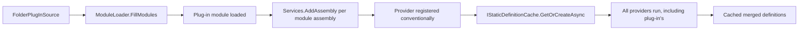

ABP Framework supports two complementary discovery mechanisms beyond the static `[DependsOn]` graph. **Plug-ins** let modules live in separately-deployed assemblies that are loaded at boot time from a folder, a file list, or an explicit type list; the loaded modules join the dependency graph as first-class participants. **Static definitions** are immutable descriptors (permissions, settings, features, navigation menu items) that providers contribute during initialization; `IStaticDefinitionCache<TKey, TValue>` lazily caches the merged set so consumers don't pay the discovery cost on every read. This page covers both — every file in `framework/src/Volo.Abp.Core/Volo/Abp/Modularity/PlugIns/` and `framework/src/Volo.Abp.Core/Volo/Abp/StaticDefinitions/`.

## File inventory

| File | Symbol | Role |
| --- | --- | --- |
| `Modularity/PlugIns/IPlugInSource.cs` | `IPlugInSource` | `Type[] GetModules()`. |
| `Modularity/PlugIns/PlugInSourceList.cs` | `PlugInSourceList` | `List<IPlugInSource>` + `GetAllModules(logger)`. |
| `Modularity/PlugIns/FolderPlugInSource.cs` | `FolderPlugInSource` | Loads `.dll`/`.exe` from a directory and scans for modules. |
| `Modularity/PlugIns/FilePlugInSource.cs` | `FilePlugInSource` | Loads explicit assembly file paths. |
| `Modularity/PlugIns/TypePlugInSource.cs` | `TypePlugInSource` | Wraps an explicit `Type[]`. |
| `Modularity/PlugIns/PlugInSourceListExtensions.cs` | extensions | `AddFolder`, `AddFiles`, `AddTypes`. |
| `Modularity/PlugIns/PlugInSourceExtensions.cs` | extensions | `GetModulesWithAllDependencies`. |
| `StaticDefinitions/IStaticDefinitionCache.cs` | `IStaticDefinitionCache<TKey, TValue>` | `GetOrCreateAsync(factory)`, `ClearAsync()`. |
| `StaticDefinitions/StaticDefinitionCache.cs` | `StaticDefinitionCache<TKey, TValue>` | `Lazy<Task<TValue>>` backed implementation. |

## IPlugInSource

The contract is minimal. From `framework/src/Volo.Abp.Core/Volo/Abp/Modularity/PlugIns/IPlugInSource.cs`:

```csharp
public interface IPlugInSource
{
    [NotNull] Type[] GetModules();
}
```

A source returns the module types it has discovered. The `ModuleLoader` will then merge them into its descriptor list — see [Modularity and modules](/core/modularity-and-modules).

## PlugInSourceList

`PlugInSourceList` is a `List<IPlugInSource>` with one important internal method:

```csharp
public class PlugInSourceList : List<IPlugInSource>
{
    [NotNull]
    internal Type[] GetAllModules(ILogger logger)
    {
        return this
            .SelectMany(pluginSource => pluginSource.GetModulesWithAllDependencies(logger))
            .Distinct()
            .ToArray();
    }
}
```

The interesting piece is `GetModulesWithAllDependencies`, an extension in `PlugInSourceExtensions`:

```csharp
public static class PlugInSourceExtensions
{
    [NotNull]
    public static Type[] GetModulesWithAllDependencies([NotNull] this IPlugInSource plugInSource, ILogger logger)
    {
        Check.NotNull(plugInSource, nameof(plugInSource));
        return plugInSource
            .GetModules()
            .SelectMany(type => AbpModuleHelper.FindAllModuleTypes(type, logger))
            .Distinct()
            .ToArray();
    }
}
```

This is why a plug-in module's own `[DependsOn]` chain is honoured — `AbpModuleHelper.FindAllModuleTypes` recursively walks dependencies, so loading one plug-in transitively loads everything it declares.

## FolderPlugInSource

`FolderPlugInSource` scans a directory for assembly files and looks for any `AbpModule.IsAbpModule(type)` matches. From `framework/src/Volo.Abp.Core/Volo/Abp/Modularity/PlugIns/FolderPlugInSource.cs`:

```csharp
public class FolderPlugInSource : IPlugInSource
{
    public string Folder { get; }
    public SearchOption SearchOption { get; set; }
    public Func<string, bool>? Filter { get; set; }

    public FolderPlugInSource([NotNull] string folder,
        SearchOption searchOption = SearchOption.TopDirectoryOnly)
    {
        Check.NotNull(folder, nameof(folder));
        Folder = folder;
        SearchOption = searchOption;
    }

    public Type[] GetModules()
    {
        var modules = new List<Type>();
        foreach (var assembly in GetAssemblies())
        {
            try
            {
                foreach (var type in assembly.GetTypes())
                    if (AbpModule.IsAbpModule(type))
                        modules.AddIfNotContains(type);
            }
            catch (Exception ex)
            {
                throw new AbpException("Could not get module types from assembly: " + assembly.FullName, ex);
            }
        }
        return modules.ToArray();
    }

    private List<Assembly> GetAssemblies()
    {
        var assemblyFiles = AssemblyHelper.GetAssemblyFiles(Folder, SearchOption);
        if (Filter != null) assemblyFiles = assemblyFiles.Where(Filter);
        return assemblyFiles.Select(AssemblyLoadContext.Default.LoadFromAssemblyPath).ToList();
    }
}
```

Three things to highlight:

- `AssemblyLoadContext.Default.LoadFromAssemblyPath` — assemblies are loaded into the *default* load context. There is no isolation; types from the plug-in are visible to the host as if they had been reference-included.
- `Filter` is a user-supplied predicate to exclude unrelated `.dll` files. A typical filter is `path => Path.GetFileName(path).StartsWith("MyCompany.Plugins.")`.
- Errors enumerating types are wrapped in `AbpException` with the assembly name — useful when a plug-in's transitive dependencies are missing.

## FilePlugInSource

`FilePlugInSource` is the explicit-files variant:

```csharp
public class FilePlugInSource : IPlugInSource
{
    public string[] FilePaths { get; }
    public FilePlugInSource(params string[]? filePaths) => FilePaths = filePaths ?? new string[0];

    public Type[] GetModules()
    {
        var modules = new List<Type>();
        foreach (var filePath in FilePaths)
        {
            var assembly = AssemblyLoadContext.Default.LoadFromAssemblyPath(filePath);
            try
            {
                foreach (var type in assembly.GetTypes())
                    if (AbpModule.IsAbpModule(type))
                        modules.AddIfNotContains(type);
            }
            catch (Exception ex)
            { throw new AbpException("Could not get module types from assembly: " + assembly.FullName, ex); }
        }
        return modules.ToArray();
    }
}
```

The semantic difference from `FolderPlugInSource` is "you list the files yourself"; the loading and scanning is identical.

## TypePlugInSource

`TypePlugInSource` is the simplest — it just hands back the types you gave it:

```csharp
public class TypePlugInSource : IPlugInSource
{
    private readonly Type[] _moduleTypes;
    public TypePlugInSource(params Type[]? moduleTypes) => _moduleTypes = moduleTypes ?? new Type[0];

    [NotNull]
    public Type[] GetModules() => _moduleTypes;
}
```

Useful when assemblies are already loaded (for example, in unit tests or when you have manual reference-include) but a particular module is not part of the startup module's `[DependsOn]` chain.

## PlugInSourceListExtensions

The fluent extensions in `framework/src/Volo.Abp.Core/Volo/Abp/Modularity/PlugIns/PlugInSourceListExtensions.cs` are the idiomatic surface:

```csharp
public static class PlugInSourceListExtensions
{
    public static void AddFolder([NotNull] this PlugInSourceList list, [NotNull] string folder,
        SearchOption searchOption = SearchOption.TopDirectoryOnly)
    {
        Check.NotNull(list, nameof(list));
        list.Add(new FolderPlugInSource(folder, searchOption));
    }

    public static void AddTypes([NotNull] this PlugInSourceList list, params Type[] moduleTypes)
    {
        Check.NotNull(list, nameof(list));
        list.Add(new TypePlugInSource(moduleTypes));
    }

    public static void AddFiles([NotNull] this PlugInSourceList list, params string[] filePaths)
    {
        Check.NotNull(list, nameof(list));
        list.Add(new FilePlugInSource(filePaths));
    }
}
```

These are what a host calls inside `optionsAction`:

```csharp
var app = await AbpApplicationFactory.CreateAsync<HostModule>(options =>
{
    options.PlugInSources.AddFolder(@"C:\ProgramData\MyApp\Plugins");
    options.PlugInSources.AddTypes(typeof(SpecialModule));
});
```

## How plug-ins join the dependency graph

```mermaid
flowchart TB
    A[optionsAction adds PlugInSources] --> B[AbpApplicationBase.LoadModules]
    B --> C[ModuleLoader.FillModules]
    C --> D[startupModule + [DependsOn] graph]
    C --> E[plugInSources.GetAllModules]
    E --> F[Each IPlugInSource.GetModules]
    F --> G[AbpModuleHelper.FindAllModuleTypes per plug-in]
    G --> H[Add to modules list with IsLoadedAsPlugIn=true]
    H --> I[SortByDependencies]
    I --> J[Startup module moved to last]
```

Inside `ModuleLoader.FillModules`:

```csharp
foreach (var moduleType in plugInSources.GetAllModules(logger))
{
    if (modules.Any(m => m.Type == moduleType)) continue; // already in static graph
    modules.Add(CreateModuleDescriptor(services, moduleType, isLoadedAsPlugIn: true));
}
```

So a plug-in that the host already references statically does not become a duplicate; it just stays as the original descriptor. The `IsLoadedAsPlugIn` flag is preserved on the descriptor so audit logs and management UIs can distinguish "linked" modules from "side-loaded" ones.

<Warning>
  Plug-ins share the default `AssemblyLoadContext` with the host. If a plug-in references a different version of a transitive dependency, you get the host's version — incompatible plug-ins will fail at type-load time. Use strict semantic versioning across plug-ins and hosts.
</Warning>

## Static definition cache

The other folder on this page — `StaticDefinitions/` — solves a different problem: providers contribute *immutable* sets of definitions (permissions, settings, features, menu items) and consumers want a cheap "give me the merged set" call. From `framework/src/Volo.Abp.Core/Volo/Abp/StaticDefinitions/IStaticDefinitionCache.cs`:

```csharp
public interface IStaticDefinitionCache<TKey, TValue>
{
    Task<TValue> GetOrCreateAsync(Func<Task<TValue>> factory);
    Task ClearAsync();
}
```

The `<TKey, TValue>` generics let the *consumer* close the type — for example a permission provider would use `IStaticDefinitionCache<PermissionDefinition, ImmutableList<PermissionDefinition>>`. The key type is purely for disambiguation in DI; there is no actual key-based lookup on the cache.

`StaticDefinitionCache<TKey, TValue>` uses a `Lazy<Task<TValue>>` for thread-safe one-time initialization:

```csharp
public class StaticDefinitionCache<TKey, TValue> : IStaticDefinitionCache<TKey, TValue>
{
    private Lazy<Task<TValue>>? _lazy;

    public virtual async Task<TValue> GetOrCreateAsync(Func<Task<TValue>> factory)
    {
        var lazy = _lazy;
        if (lazy != null) return await lazy.Value;
        var newLazy = new Lazy<Task<TValue>>(factory, LazyThreadSafetyMode.ExecutionAndPublication);
        lazy = Interlocked.CompareExchange(ref _lazy, newLazy, null) ?? newLazy;
        return await lazy.Value;
    }

    public virtual Task ClearAsync()
    {
        Interlocked.Exchange(ref _lazy, null);
        return Task.CompletedTask;
    }
}
```

The `Interlocked.CompareExchange` pattern ensures that even if two threads race past the null check, only one `Lazy` is installed; both threads end up awaiting the same task. `ClearAsync` simply nulls the field — the next call rebuilds.

### Registration

`InternalServiceCollectionExtensions.AddCoreAbpServices` registers the open generic:

```csharp
services.AddSingleton(typeof(IStaticDefinitionCache<,>), typeof(StaticDefinitionCache<,>));
```

So any module can inject `IStaticDefinitionCache<TKey, TValue>` and get a singleton bound to its specific generic instantiation.

### Typical use

A permission-management module typically writes a helper:

```csharp
public class PermissionDefinitionManager : IPermissionDefinitionManager, ISingletonDependency
{
    private readonly IStaticDefinitionCache<PermissionDefinition, ImmutableList<PermissionDefinition>> _cache;
    private readonly IPermissionDefinitionProvider[] _providers;

    public Task<ImmutableList<PermissionDefinition>> GetAllAsync()
        => _cache.GetOrCreateAsync(LoadAllAsync);

    private async Task<ImmutableList<PermissionDefinition>> LoadAllAsync()
    {
        var context = new PermissionDefinitionContext();
        foreach (var p in _providers) await p.DefineAsync(context);
        return context.Permissions.ToImmutableList();
    }
}
```

Consumers call `GetAllAsync` countless times; the providers run exactly once.

<Tip>
  `ClearAsync` is the entry point for "I just edited a static-but-runtime-overridable definition; reload". Most management modules expose an admin API that calls it.
</Tip>

## Composition: plug-ins feeding static definitions

The two systems work together: a plug-in module typically registers its own provider (`IPermissionDefinitionProvider`, `ISettingDefinitionProvider`, etc.) in its `ConfigureServices`. Because the plug-in's module is in the descriptor list, its assembly is scanned and its provider is registered conventionally. Then on the next `GetAllAsync` the provider is invoked alongside the static ones; the cache wraps the merged result.



## Worked example

<Steps>
  <Step title="Drop plug-in DLLs">
    Place `MyCompany.Plugins.Shipping.dll` and its dependencies in `C:\App\Plugins\`.
  </Step>
  <Step title="Configure plug-in source">
    ```csharp
    var app = await AbpApplicationFactory.CreateAsync<HostModule>(options =>
    {
        options.PlugInSources.AddFolder(@"C:\App\Plugins",
            SearchOption.TopDirectoryOnly);
    });
    ```
  </Step>
  <Step title="Boot">
    `ModuleLoader` finds the shipping module via `FolderPlugInSource.GetModules`, walks its `[DependsOn]` chain, registers the assembly, and runs `ConfigureServices`.
  </Step>
  <Step title="Use">
    Permissions, settings, and menu items contributed by the plug-in show up the next time `IStaticDefinitionCache.GetOrCreateAsync` runs. Call `ClearAsync()` after a hot-reload to refresh.
  </Step>
</Steps>

## Related pages

<CardGroup cols={2}>
  <Card title="Modularity" icon="cubes" href="/core/modularity-and-modules">
    `ModuleLoader.FillModules` is where plug-in modules are merged into the static graph.
  </Card>
  <Card title="Bootstrap" icon="rocket" href="/core/abp-application-and-bootstrap">
    `AbpApplicationCreationOptions.PlugInSources` is the entry point.
  </Card>
  <Card title="DI" icon="syringe" href="/core/dependency-injection">
    Plug-in assemblies are scanned through `Services.AddAssembly`.
  </Card>
  <Card title="Reflection" icon="microscope" href="/core/reflection-and-internal">
    `AssemblyHelper.LoadAssemblies` is what `FolderPlugInSource` ultimately calls.
  </Card>
</CardGroup>

Permission, setting, feature, and menu definition systems are covered under [/infrastructure/overview](/infrastructure/overview); plug-in patterns for cross-tenant data are mentioned in [/data/overview](/data/overview); DDD modules ([/ddd/overview](/ddd/overview)) ship as both statically-referenced and plug-in-loaded packages with the same code.
