The `Reflection/` and `Internal/` folders of `Volo.Abp.Core` carry the discovery primitives the rest of the framework uses to enumerate modules, types and attributes, plus the privacy-respecting telemetry pipeline that ships an "ApplicationRun" event when running on a developer's machine. This page covers every file under `framework/src/Volo.Abp.Core/Volo/Abp/Reflection/`, the helpers in `framework/src/Volo.Abp.Core/Volo/Abp/Internal/`, and the `Internal/Telemetry/` subtree.

## File inventory — Reflection

| File | Symbol | Purpose |
| --- | --- | --- |
| `Reflection/IAssemblyFinder.cs` | `IAssemblyFinder` | `IReadOnlyList<Assembly> Assemblies`. |
| `Reflection/AssemblyFinder.cs` | `AssemblyFinder` | Aggregates `module.AllAssemblies` across every `IAbpModuleDescriptor`. |
| `Reflection/ITypeFinder.cs` | `ITypeFinder` | `IReadOnlyList<Type> Types`. |
| `Reflection/TypeFinder.cs` | `TypeFinder` | Lazily walks each assembly via `AssemblyHelper.GetAllTypes`. |
| `Reflection/AssemblyHelper.cs` | `AssemblyHelper` | `LoadAssemblies`, `GetAssemblyFiles`, `GetAllTypes`. |
| `Reflection/ReflectionHelper.cs` | `ReflectionHelper` | `IsAssignableToGenericType`, attribute lookup helpers. |
| `Reflection/TypeHelper.cs` | `TypeHelper` | `IsPrimitiveExtended`, `IsNullable`, `IsFunc`, more. |

## File inventory — Internal

| File | Symbol | Purpose |
| --- | --- | --- |
| `Internal/InternalServiceCollectionExtensions.cs` | `InternalServiceCollectionExtensions` | `AddCoreServices`, `AddCoreAbpServices`. |
| `Internal/Utf8Helper.cs` | `Utf8Helper` | UTF-8 with BOM stripping. |
| `Internal/Telemetry/ITelemetryService.cs`, `TelemetryService.cs` | `TelemetryService` | Adds activities, error activities, scoped activity tracking. |
| `Internal/Telemetry/ITelemetryActivitySender.cs`, `TelemetryActivitySender.cs` | sender | Batches and POSTs activities to `AbpPlatformUrls.AbpTelemetryApiUrl`. |
| `Internal/Telemetry/Constants/AbpPlatformUrls.cs` | constants | The remote endpoint. |
| `Internal/Telemetry/Constants/ActivityNameConsts.cs` | constants | `ApplicationRun`, `Error`, etc. |
| `Internal/Telemetry/Constants/ActivityPropertyNames.cs` | constants | Property keys (e.g. `ActivityDuration`). |
| `Internal/Telemetry/Constants/TelemetryPaths.cs` | constants | Local file paths (e.g. `AccessToken`). |
| `Internal/Telemetry/Activity/ActivityContext.cs` | DTO | `Create(name, ...)`. |
| `Internal/Telemetry/Activity/ActivityEvent.cs` | DTO | Payload sent over HTTP. |
| `Internal/Telemetry/Activity/Storage/*` | storage | `ITelemetryActivityStorage`, file-backed implementation. |
| `Internal/Telemetry/EnvironmentInspection/*` | inspectors | OS, runtime, IDE, package detectors. |
| `Internal/Telemetry/Helpers/AbpPackageMetadataReader.cs` | reader | Parses `.csproj` to find `Volo.Abp.*` package versions. |
| `Internal/Telemetry/Helpers/Cryptography.cs` | helpers | Hashing for project identification. |
| `Internal/Telemetry/Helpers/MutexExecutor.cs` | helpers | Cross-process mutex around shared telemetry storage. |

## AssemblyFinder and TypeFinder

`AssemblyFinder` collects assemblies from every loaded module's `AllAssemblies` property (set by `AbpModuleDescriptor` — see [Modularity and modules](/core/modularity-and-modules)). From `framework/src/Volo.Abp.Core/Volo/Abp/Reflection/AssemblyFinder.cs`:

```csharp
public class AssemblyFinder : IAssemblyFinder
{
    private readonly IModuleContainer _moduleContainer;
    private readonly Lazy<IReadOnlyList<Assembly>> _assemblies;

    public AssemblyFinder(IModuleContainer moduleContainer)
    {
        _moduleContainer = moduleContainer;
        _assemblies = new Lazy<IReadOnlyList<Assembly>>(FindAll, LazyThreadSafetyMode.ExecutionAndPublication);
    }

    public IReadOnlyList<Assembly> Assemblies => _assemblies.Value;

    public IReadOnlyList<Assembly> FindAll()
    {
        var assemblies = new List<Assembly>();
        foreach (var module in _moduleContainer.Modules)
            assemblies.AddRange(module.AllAssemblies);
        return assemblies.Distinct().ToImmutableList();
    }
}
```

Because `IModuleContainer` is `AbpApplicationBase` (registered as a singleton in the constructor), the finder reads the descriptor list directly. The result is memoised in a `Lazy`.

`TypeFinder` walks every assembly via `AssemblyHelper.GetAllTypes` and tolerates `ReflectionTypeLoadException`:

```csharp
public class TypeFinder : ITypeFinder
{
    private readonly ILogger<TypeFinder> _logger;
    private readonly IAssemblyFinder _assemblyFinder;
    private readonly Lazy<IReadOnlyList<Type>> _types;

    public IReadOnlyList<Type> Types => _types.Value;

    private IReadOnlyList<Type> FindAll()
    {
        var allTypes = new List<Type>();
        foreach (var assembly in _assemblyFinder.Assemblies)
        {
            try
            {
                var typesInThisAssembly = AssemblyHelper.GetAllTypes(assembly);
                if (!typesInThisAssembly.Any()) continue;
                allTypes.AddRange(typesInThisAssembly.Where(type => type != null));
            }
            catch (ReflectionTypeLoadException e)
            {
                allTypes = e.Types.Select(x => x!).ToList();
                _logger.LogException(e);
            }
            catch (Exception e) { _logger.LogException(e); }
        }
        return allTypes;
    }
}
```

Both finders are registered as singletons by `InternalServiceCollectionExtensions.AddCoreAbpServices` *before* the DI container is built — they are created with `TryAddSingleton<IAssemblyFinder>(assemblyFinder)` so the `Lazy` is shared.

## AssemblyHelper

`AssemblyHelper` is `internal`. Its three jobs are loading assemblies from a folder, enumerating `*.dll` / `*.exe` files, and returning a type list:

```csharp
internal static class AssemblyHelper
{
    public static List<Assembly> LoadAssemblies(string folderPath, SearchOption searchOption)
        => GetAssemblyFiles(folderPath, searchOption)
            .Select(AssemblyLoadContext.Default.LoadFromAssemblyPath)
            .ToList();

    public static IEnumerable<string> GetAssemblyFiles(string folderPath, SearchOption searchOption)
        => Directory
            .EnumerateFiles(folderPath, "*.*", searchOption)
            .Where(s => s.EndsWith(".dll") || s.EndsWith(".exe"));

    public static IReadOnlyList<Type> GetAllTypes(Assembly assembly) => assembly.GetTypes();
}
```

`LoadAssemblies` is used by `FolderPlugInSource` (see [Plug-ins and static definitions](/core/plugins-and-static-definitions)) — that's how an ABP application can boot modules from a directory of side-loaded DLLs.

## ReflectionHelper

`ReflectionHelper` collects the small, exact, attribute-aware reflection idioms ABP needs. The header even includes `//TODO: Consider to make internal`. Important methods:

```csharp
public static bool IsAssignableToGenericType(Type givenType, Type genericType)
{
    var givenTypeInfo = givenType.GetTypeInfo();
    if (givenTypeInfo.IsGenericType && givenType.GetGenericTypeDefinition() == genericType) return true;
    foreach (var interfaceType in givenTypeInfo.GetInterfaces())
        if (interfaceType.GetTypeInfo().IsGenericType && interfaceType.GetGenericTypeDefinition() == genericType) return true;
    if (givenTypeInfo.BaseType == null) return false;
    return IsAssignableToGenericType(givenTypeInfo.BaseType, genericType);
}

public static List<Type> GetImplementedGenericTypes(Type givenType, Type genericType) { ... }

public static TAttribute? GetSingleAttributeOrDefault<TAttribute>(
    MemberInfo memberInfo, TAttribute? defaultValue = default, bool inherit = true)
    where TAttribute : Attribute { ... }

public static TAttribute? GetSingleAttributeOfMemberOrDeclaringTypeOrDefault<TAttribute>(
    MemberInfo memberInfo, TAttribute? defaultValue = default, bool inherit = true)
    where TAttribute : class { ... }

public static IEnumerable<TAttribute> GetAttributesOfMemberOrDeclaringType<TAttribute>(
    MemberInfo memberInfo, bool inherit = true)
    where TAttribute : class { ... }
```

The "member-or-declaring-type" methods are the workhorses for attributes like `[UnitOfWork]` and `[Authorize]` that can be put on either the method or the type — they unify the lookup at one call site.

## TypeHelper

`TypeHelper` is a grab-bag of type classification methods. Snippets that show its character:

```csharp
private static readonly FrozenSet<Type> NonNullablePrimitiveTypes = new HashSet<Type>
{
    typeof(byte), typeof(short), typeof(int), typeof(long), typeof(sbyte),
    typeof(ushort), typeof(uint), typeof(ulong), typeof(bool), typeof(float),
    typeof(decimal), typeof(DateTime), typeof(DateTimeOffset),
    typeof(TimeSpan), typeof(Guid)
}.ToFrozenSet();

public static bool IsNonNullablePrimitiveType(Type type) => NonNullablePrimitiveTypes.Contains(type);

public static bool IsPrimitiveExtended(Type type, bool includeNullables = true, bool includeEnums = false)
{
    if (IsPrimitiveExtendedInternal(type, includeEnums)) return true;
    if (includeNullables && IsNullable(type) && type.GenericTypeArguments.Any())
        return IsPrimitiveExtendedInternal(type.GenericTypeArguments[0], includeEnums);
    // ...
}

public static bool IsFunc(object? obj) { ... }
public static bool IsFunc<TReturn>(object? obj) { ... }
```

ABP uses `IsPrimitiveExtended` to decide whether to deep-clone a value, whether to bind it via `IConfiguration`, and whether to expose it as a `DistributedEventBus` parameter.

## Internal: AddCoreServices and AddCoreAbpServices

`InternalServiceCollectionExtensions` is the only file in `Volo.Abp.Core` that is *internal* yet pivotal. Its two methods are called from `AbpApplicationBase.ctor`:

```csharp
internal static void AddCoreServices(this IServiceCollection services)
{
    services.AddOptions();
    services.AddLogging();
    services.AddLocalization();
}

internal static void AddCoreAbpServices(this IServiceCollection services,
    IAbpApplication abpApplication, AbpApplicationCreationOptions applicationCreationOptions)
{
    var moduleLoader = new ModuleLoader();
    var assemblyFinder = new AssemblyFinder(abpApplication);
    if (!services.IsAdded<IConfiguration>())
        services.ReplaceConfiguration(ConfigurationHelper.BuildConfiguration(applicationCreationOptions.Configuration));
    services.TryAddSingleton<IModuleLoader>(moduleLoader);
    services.TryAddSingleton<IAssemblyFinder>(assemblyFinder);
    services.TryAddSingleton<IInitLoggerFactory>(new DefaultInitLoggerFactory());
    var typeFinder = new TypeFinder(services.GetInitLogger<TypeFinder>(), assemblyFinder);
    services.TryAddSingleton<ITypeFinder>(typeFinder);
    services.AddAssemblyOf<IAbpApplication>();
    services.AddTransient(typeof(ISimpleStateCheckerManager<>), typeof(SimpleStateCheckerManager<>));
    services.AddSingleton(typeof(IStaticDefinitionCache<,>), typeof(StaticDefinitionCache<,>));
    services.Configure<AbpModuleLifecycleOptions>(options =>
    {
        options.Contributors.Add<OnPreApplicationInitializationModuleLifecycleContributor>();
        options.Contributors.Add<OnApplicationInitializationModuleLifecycleContributor>();
        options.Contributors.Add<OnPostApplicationInitializationModuleLifecycleContributor>();
        options.Contributors.Add<OnApplicationShutdownModuleLifecycleContributor>();
    });
}
```

Three subtle things to notice:

1. `IConfiguration` is replaced *only if* the user has not registered one already — that's what `AbpConfigurationBuilderOptions` is for.
2. The same `ModuleLoader` instance is captured both into the local variable and the singleton — so `AbpApplicationBase.LoadModules` and any later resolution see the same instance.
3. `AddAssemblyOf<IAbpApplication>()` is the boot-strap conventional registration — it runs the registrar over `Volo.Abp.Core` itself, registering `RootServiceProvider`, `ModuleManager`, `ExceptionNotifier`, `CachedServiceProvider`, etc. through their marker interfaces.

## Utf8Helper

`Utf8Helper` reads UTF-8 streams and strips a BOM. From `framework/src/Volo.Abp.Core/Volo/Abp/Internal/Utf8Helper.cs`:

```csharp
public static class Utf8Helper
{
    public static string ReadStringFromStream(Stream stream)
    {
        var bytes = stream.GetAllBytes();
        var skipCount = HasBom(bytes) ? 3 : 0;
        return Encoding.UTF8.GetString(bytes, skipCount, bytes.Length - skipCount);
    }

    private static bool HasBom(byte[] bytes)
    {
        if (bytes.Length < 3) return false;
        if (!(bytes[0] == 0xEF && bytes[1] == 0xBB && bytes[2] == 0xBF)) return false;
        return true;
    }
}
```

Used in places like content-bundle loading and localization JSON parsing.

## Internal/Telemetry tree

The telemetry subtree implements opt-in usage tracking. The flow is:

```mermaid
flowchart LR
    A[AbpApplicationBase.SetupTelemetryTracking] --> B{Should send?}
    B -- no --> X((stop))
    B -- yes --> C[ITelemetryService.AddActivityAsync&#40;ApplicationRun&#41;]
    C --> D[ActivityContext.Create]
    D --> E[ITelemetryActivityStorage]
    E --> F[ITelemetryActivitySender.TrySendQueuedActivitiesAsync]
    F --> G[POST AbpPlatformUrls.AbpTelemetryApiUrl/api/telemetry/collect]
```



`AbpApplicationBase.ShouldSendTelemetryData` short-circuits on every condition that would make sending unsafe:

```csharp
private bool ShouldSendTelemetryData()
{
    using var scope = ServiceProvider.CreateScope();
    var abpHostEnvironment = scope.ServiceProvider.GetRequiredService<IAbpHostEnvironment>();
    var configuration = scope.ServiceProvider.GetRequiredService<IConfiguration>();

    if (RuntimeInformation.IsOSPlatform(OSPlatform.Windows) ||
        RuntimeInformation.IsOSPlatform(OSPlatform.OSX) ||
        RuntimeInformation.IsOSPlatform(OSPlatform.Linux))
    {
        return abpHostEnvironment.IsDevelopment()
            && configuration.GetValue<bool?>("Abp:Telemetry:IsEnabled") != false;
    }
    return false;
}
```

So telemetry only fires when (a) running on Windows/macOS/Linux, (b) `IAbpHostEnvironment.IsDevelopment()` is `true`, and (c) the `Abp:Telemetry:IsEnabled` config key is not explicitly `false`.

<Note>
  All of this happens inside a try/catch that *also* writes its own failures to a `Trace`-level logger — telemetry is the canonical example of "must never crash the host".
</Note>

### TelemetryService

`TelemetryService` exposes async helpers around activity creation:

```csharp
public class TelemetryService : ITelemetryService, IScopedDependency
{
    public IAsyncDisposable TrackActivityAsync(string activityName,
        Action<Dictionary<string, object>>? additionalProperties = null)
    {
        Check.NotNullOrEmpty(activityName, nameof(activityName));
        var stopwatch = Stopwatch.StartNew();
        var context = ActivityContext.Create(activityName, additionalProperties: additionalProperties);

        return new AsyncDisposeFunc(async () =>
        {
            stopwatch.Stop();
            context.Current[ActivityPropertyNames.ActivityDuration] = stopwatch.ElapsedMilliseconds;
            await AddActivityAsync(context);
        });
    }

    public async Task AddActivityAsync(string activityName, Action<Dictionary<string, object>>? additionalProperties = null)
    { ... }

    public async Task AddErrorActivityAsync(string errorMessage) { ... }
    public async Task AddErrorForActivityAsync(string failingActivity, string errorMessage) { ... }
}
```

`TrackActivityAsync` returns an `IAsyncDisposable` so callers can `await using` it for the duration of an operation and have the elapsed time logged automatically.

### TelemetryActivitySender

The sender batches up to 50 activities, retries each batch up to 3 times with linear backoff (1s, 2s, 3s), and POSTs JSON to `AbpPlatformUrls.AbpTelemetryApiUrl`:

```csharp
public class TelemetryActivitySender : ITelemetryActivitySender, IScopedDependency
{
    private const int ActivitySendBatchSize = 50;
    private const int MaxRetryAttempts = 3;
    private const int RetryDelayMilliseconds = 1000;

    public async Task TrySendQueuedActivitiesAsync()
    {
        if (!_telemetryActivityStorage.ShouldSendActivities()) return;
        await SendActivitiesAsync();
    }
    // ... batches, retries, deletes from storage on success, marks failed on non-success status
}
```

The sender attaches a bearer token if one is found at `TelemetryPaths.AccessToken` — this is the developer's authenticated token from the ABP CLI.

### EnvironmentInspection

The `EnvironmentInspection/` tree is a chain of inspectors that gather minimal, hash-anonymised metadata: which IDE is running (via `DevenvDetector`, `RiderDetector`, `VsCodeDetector`), which OS, which runtime, which ABP package versions are referenced in the calling `.csproj`. The `Helpers/AbpPackageMetadataReader` parses `*.csproj` files to enumerate `Volo.Abp.*` packages, and `Helpers/Cryptography` hashes the project file path so the same project is recognised across runs without leaking the path.

`Helpers/MutexExecutor` wraps the activity storage in a cross-process mutex so two concurrent host instances on the same developer's machine don't corrupt the file.

## Why this matters for users

If you are writing application code, you'll rarely interact with telemetry directly. But two design choices are worth knowing:

- `ITelemetryService` is registered as `IScopedDependency` — you can inject it anywhere and create activities scoped to a unit of work.
- All telemetry calls are wrapped in try/catch and fall back to `LogLevel.Trace` if anything goes wrong; failure to reach the telemetry endpoint will never break your application.

`IAssemblyFinder` and `ITypeFinder`, on the other hand, are workhorses you *will* use — `IStringLocalizerFactory`, navigation menus, permission providers, MVC view discovery and many more modules all enumerate `assemblyFinder.Assemblies` or `typeFinder.Types` rather than re-scanning.

<Tip>
  When writing a new infrastructure module, prefer `ITypeFinder` over `AppDomain.CurrentDomain.GetAssemblies()` — the former only returns assemblies the module loader knows about, which is the predictable subset.
</Tip>

## Related pages

<CardGroup cols={2}>
  <Card title="Bootstrap" icon="rocket" href="/core/abp-application-and-bootstrap">
    `AbpApplicationBase.SetupTelemetryTracking` and `WriteInitLogs` show how Reflection and Telemetry are used during boot.
  </Card>
  <Card title="Modularity" icon="cubes" href="/core/modularity-and-modules">
    `AbpModuleHelper.GetAllAssemblies` feeds `AssemblyFinder`.
  </Card>
  <Card title="DI" icon="syringe" href="/core/dependency-injection">
    `AddAssemblyOf<IAbpApplication>` is the very first conventional registration.
  </Card>
  <Card title="Plug-ins" icon="puzzle-piece" href="/core/plugins-and-static-definitions">
    `AssemblyHelper.LoadAssemblies` powers `FolderPlugInSource`.
  </Card>
</CardGroup>

Persistence ([/data/overview](/data/overview)) uses `ITypeFinder` to discover entity types; HTTP integrations ([/infrastructure/overview](/infrastructure/overview)) use it to discover controllers and Razor pages; the DDD layer ([/ddd/overview](/ddd/overview)) uses `ReflectionHelper.IsAssignableToGenericType` to detect repositories.
