`Volo.Abp.Core` and the companion `Volo.Abp.Threading` package ship the threading primitives that the rest of the framework relies on. The Core package contains the static helpers (`AsyncHelper`, `InternalAsyncHelper`, `KeyedLock`, `SemaphoreSlimExtensions`, `OneTimeRunner`/`AsyncOneTimeRunner`, `TaskCache`, `LockExtensions`) while the Threading package adds the ambient-data abstractions that propagate state across async flows (`IAmbientDataContext`, `AsyncLocalAmbientDataContext`, `IAmbientScopeProvider<T>`, `AmbientDataContextAmbientScopeProvider<T>`, `ICancellationTokenProvider` and friends). This page walks both directories.

## File inventory

### `framework/src/Volo.Abp.Core/Volo/Abp/Threading/`

| File | Symbol | Purpose |
| --- | --- | --- |
| `AsyncHelper.cs` | `AsyncHelper` | `RunSync`, `IsAsync`, `IsTaskOrTaskOfT`, `UnwrapTask`. |
| `InternalAsyncHelper.cs` | `InternalAsyncHelper` | Pre/post/finally async wrappers used by interceptors. |
| `KeyedLock.cs` | `KeyedLock` | Per-key async semaphore registry. |
| `SemaphoreSlimExtensions.cs` | extensions | `LockAsync` / `Lock` returning `IDisposable`. |
| `LockExtensions.cs` | extensions | `Locking(...)` over `lock(this)`. |
| `OneTimeRunner.cs` | `OneTimeRunner` | Run an `Action` exactly once (sync). |
| `AsyncOneTimeRunner.cs` | `AsyncOneTimeRunner` | Same idea for `Func<Task>`. |
| `TaskCache.cs` | `TaskCache` | `TrueResult` / `FalseResult` cached `Task<bool>`. |

### `framework/src/Volo.Abp.Threading/Volo/Abp/Threading/`

| File | Symbol | Purpose |
| --- | --- | --- |
| `IAmbientDataContext.cs` | `IAmbientDataContext` | `SetData(key,val)` / `GetData(key)`. |
| `AsyncLocalAmbientDataContext.cs` | `AsyncLocalAmbientDataContext` | `AsyncLocal<object?>` per key. |
| `IAmbientScopeProvider.cs` | `IAmbientScopeProvider<T>` | `BeginScope(key, value)` returning `IDisposable`. |
| `AmbientDataContextAmbientScopeProvider.cs` | provider | Concrete implementation with a stack. |
| `AsyncLocalSimpleScopeExtensions.cs` | extensions | Helpers around `AsyncLocal<T>`. |
| `ICancellationTokenProvider.cs` | `ICancellationTokenProvider` | `Token` + `Use(token)`. |
| `CancellationTokenProviderBase.cs` | base | Reads/writes `CancellationTokenOverride` via an `IAmbientScopeProvider`. |
| `CancellationTokenOverride.cs` | `CancellationTokenOverride` | Wraps a `CancellationToken` for scope storage. |
| `NullCancellationTokenProvider.cs` | `NullCancellationTokenProvider` | Singleton fallback. |
| `CancellationTokenProviderExtensions.cs` | extensions | `FallbackToProvider(...)`. |
| `AbpAsyncTimer.cs`, `AbpTimer.cs` | timers | Non-overlapping periodic timers. |
| `AbpThreadingModule.cs` | module | `[DependsOn(typeof(AbpCoreModule))]`. |
| `IRunnable.cs` | `IRunnable` | Background runnable abstraction. |

## AsyncHelper

`AsyncHelper` uses `Nito.AsyncEx.AsyncContext` to run async methods synchronously without deadlocking on the synchronization context:

```csharp
public static class AsyncHelper
{
    public static bool IsAsync([NotNull] this MethodInfo method)
    {
        Check.NotNull(method, nameof(method));
        return method.ReturnType.IsTaskOrTaskOfT();
    }

    public static bool IsTaskOrTaskOfT([NotNull] this Type type)
        => type == typeof(Task) || (type.GetTypeInfo().IsGenericType && type.GetGenericTypeDefinition() == typeof(Task<>));

    public static bool IsTaskOfT([NotNull] this Type type)
        => type.GetTypeInfo().IsGenericType && type.GetGenericTypeDefinition() == typeof(Task<>);

    public static Type UnwrapTask([NotNull] Type type)
    {
        Check.NotNull(type, nameof(type));
        if (type == typeof(Task)) return typeof(void);
        if (type.IsTaskOfT()) return type.GenericTypeArguments[0];
        return type;
    }

    public static TResult RunSync<TResult>(Func<Task<TResult>> func) => AsyncContext.Run(func);
    public static void RunSync(Func<Task> action) => AsyncContext.Run(action);
}
```

`AbpApplicationBase.SetupTelemetryTracking` calls `AsyncHelper.RunSync(InitializeTelemetryTracking)` — a legitimate sync-over-async use because it runs only during initialization. `IsAsync` and `UnwrapTask` are used by the Castle adapter to drive `AsyncDeterminationInterceptor`.

<Warning>
  `AsyncHelper.RunSync` is the *only* sanctioned way to run async code synchronously in ABP. Calling `task.Result` or `task.Wait()` from inside a synchronization context can deadlock; `Nito.AsyncEx` works because it temporarily replaces the context with one that has no blocking semantics.
</Warning>

## InternalAsyncHelper

This file is misnamed — it's been public since the TODO at the top: `//TODO: Rename since it's not internal anymore!`. Its job is to provide async wrappers that an interceptor can wrap around `await invocation.ProceedAsync()` with a `finally` block that knows the original exception:

```csharp
public static async Task AwaitTaskWithFinally(Task actualReturnValue, Action<Exception?> finalAction)
{
    Exception? exception = null;
    try { await actualReturnValue; }
    catch (Exception ex) { exception = ex; throw; }
    finally { finalAction(exception); }
}

public static async Task AwaitTaskWithPostActionAndFinally(
    Task actualReturnValue, Func<Task> postAction, Action<Exception?> finalAction)
{
    Exception? exception = null;
    try { await actualReturnValue; await postAction(); }
    catch (Exception ex) { exception = ex; throw; }
    finally { finalAction(exception); }
}
```

There are also generic `<T>` variants for `Task<T>` and a `Call*` reflection helper that constructs the generic method at runtime — useful when an interceptor only knows the return type by `Type` token. The pattern is to call `CallAwaitTaskWithFinallyAndGetResult(invocation.Method.ReturnType, actualReturnValue, finalAction)` and box the result.

## Locking helpers

### LockExtensions

`LockExtensions` adds typed `Locking` extension methods that wrap `lock(source)`:

```csharp
public static void Locking(this object source, Action action)
{
    lock (source) { action(); }
}

public static TResult Locking<T, TResult>(this T source, Func<T, TResult> func) where T : class
{
    lock (source) { return func(source); }
}
```

The pattern reads better than raw `lock` when the locked operation is one line and the locking object is a field.

### SemaphoreSlimExtensions

`SemaphoreSlimExtensions` returns `IDisposable` releasers around `SemaphoreSlim.WaitAsync` so the `using` pattern works:

```csharp
public async static ValueTask<IDisposable> LockAsync(this SemaphoreSlim semaphoreSlim)
{
    await semaphoreSlim.WaitAsync();
    return GetDispose(semaphoreSlim);
}

public async static ValueTask<IDisposable> LockAsync(this SemaphoreSlim semaphoreSlim, TimeSpan timeout)
{
    if (await semaphoreSlim.WaitAsync(timeout)) return GetDispose(semaphoreSlim);
    throw new TimeoutException();
}

private static IDisposable GetDispose(this SemaphoreSlim semaphoreSlim)
    => new DisposeAction<SemaphoreSlim>(static (s) => { s.Release(); }, semaphoreSlim);
```

The `DisposeAction<T>` (from `framework/src/Volo.Abp.Core/Volo/Abp/DisposeAction.cs`) takes a state-passing static delegate so no closure is allocated.

### KeyedLock

`KeyedLock` is a static dictionary of reference-counted semaphores. It's the right tool for "lock around access to a resource keyed by some id":

```csharp
public static class KeyedLock
{
    private static readonly Dictionary<object, RefCounted<SemaphoreSlim>> SemaphoreSlims = new();

    public static async Task<IDisposable> LockAsync(object key)
    {
        Check.NotNull(key, nameof(key));
        return await LockAsync(key, CancellationToken.None);
    }

    public static async Task<IDisposable?> TryLockAsync(object key, TimeSpan timeout, CancellationToken cancellationToken = default)
    {
        Check.NotNull(key, nameof(key));
        var semaphore = GetOrCreate(key);
        // ...
        if (acquired) return new Releaser(key);
        return null;
    }

    private static SemaphoreSlim GetOrCreate(object key)
    {
        lock (SemaphoreSlims)
        {
            if (SemaphoreSlims.TryGetValue(key, out var item)) { ++item.RefCount; return item.Value; }
            var newItem = new RefCounted<SemaphoreSlim>(new SemaphoreSlim(1, 1));
            SemaphoreSlims[key] = newItem;
            return newItem.Value;
        }
    }
}
```

`Releaser.Dispose` decrements the reference count and disposes the semaphore when no readers remain. The reference-count logic prevents the dictionary from leaking semaphores across keys that fall out of use.

<Note>
  `KeyedLock` keys must be `IEquatable` (objects work via reference equality; strings and `Guid`s work value-equal). It's perfect for "process at most one job per tenant id at a time" patterns.
</Note>

### OneTimeRunner / AsyncOneTimeRunner

These ensure a code block runs at most once. The async variant uses a `SemaphoreSlim` because `lock` cannot bridge `await`:

```csharp
public class AsyncOneTimeRunner
{
    private volatile bool _runBefore;
    private readonly SemaphoreSlim _semaphore = new SemaphoreSlim(1, 1);

    public async Task RunAsync(Func<Task> action)
    {
        if (_runBefore) return;
        using (await _semaphore.LockAsync())
        {
            if (_runBefore) return;
            await action();
            _runBefore = true;
        }
    }
}
```

The sync `OneTimeRunner` uses `lock (this)`. Both are typically instantiated as `static` fields so the once-per-application invariant holds.

### TaskCache

A tiny optimization that hands out cached `Task<bool>` instances so methods returning `Task.FromResult(true)` don't allocate:

```csharp
public static class TaskCache
{
    public static Task<bool> TrueResult { get; } = Task.FromResult(true);
    public static Task<bool> FalseResult { get; } = Task.FromResult(false);
}
```

## Ambient data context

The Threading package adds an indirection over `AsyncLocal<T>` so multiple ambient values can share one infrastructure. From `framework/src/Volo.Abp.Threading/Volo/Abp/Threading/IAmbientDataContext.cs`:

```csharp
public interface IAmbientDataContext
{
    void SetData(string key, object? value);
    object? GetData(string key);
}
```

`AsyncLocalAmbientDataContext` keeps a `ConcurrentDictionary<string, AsyncLocal<object?>>` so each key gets its own `AsyncLocal`:

```csharp
public class AsyncLocalAmbientDataContext : IAmbientDataContext, ISingletonDependency
{
    private static readonly ConcurrentDictionary<string, AsyncLocal<object?>> AsyncLocalDictionary
        = new ConcurrentDictionary<string, AsyncLocal<object?>>();

    public void SetData(string key, object? value)
    {
        var asyncLocal = AsyncLocalDictionary.GetOrAdd(key, _ => new AsyncLocal<object?>());
        asyncLocal.Value = value;
    }

    public object? GetData(string key)
    {
        var asyncLocal = AsyncLocalDictionary.GetOrAdd(key, _ => new AsyncLocal<object?>());
        return asyncLocal.Value;
    }
}
```

The dictionary is `static` so the values flow across instances of the same key — a deliberate choice to share state across DI scopes when needed.

## IAmbientScopeProvider

Plain `AsyncLocal` doesn't model a *scope*: you can set a value but not pop it without remembering the previous value. `IAmbientScopeProvider<T>` adds a stack:

```csharp
public interface IAmbientScopeProvider<T>
{
    T? GetValue(string contextKey);
    IDisposable BeginScope(string contextKey, T value);
}
```

`AmbientDataContextAmbientScopeProvider<T>` implements this on top of `IAmbientDataContext`. Each `BeginScope` allocates a `ScopeItem` (carrying a `Guid` id and a link to the outer item), stuffs the id into the `AsyncLocal`, and returns a `DisposeAction` that walks back to the outer scope on disposal:

```csharp
public IDisposable BeginScope(string contextKey, T value)
{
    var item = new ScopeItem(value, GetCurrentItem(contextKey));
    if (!ScopeDictionary.TryAdd(item.Id, item))
        throw new AbpException("Can not add item! ScopeDictionary.TryAdd returns false!");
    _dataContext.SetData(contextKey, item.Id);

    return new DisposeAction<...>(static (state) =>
    {
        var (scopeDictionary, item, dataContext, contextKey) = state;
        scopeDictionary.TryRemove(item.Id, out item);
        if (item == null) return;
        if (item.Outer == null) { dataContext.SetData(contextKey, null); return; }
        dataContext.SetData(contextKey, item.Outer.Id);
    }, (ScopeDictionary, item, _dataContext, contextKey));
}
```

The static `ScopeDictionary` is shared, but each scope is keyed by a fresh `Guid` — so concurrent scopes do not collide.

## ICancellationTokenProvider

`ICancellationTokenProvider` lets infrastructure code obtain the *current* cancellation token without having to plumb it through every call. From `framework/src/Volo.Abp.Threading/Volo/Abp/Threading/ICancellationTokenProvider.cs`:

```csharp
public interface ICancellationTokenProvider
{
    CancellationToken Token { get; }
    IDisposable Use(CancellationToken cancellationToken);
}
```

`CancellationTokenProviderBase` wires this to an `IAmbientScopeProvider<CancellationTokenOverride>`:

```csharp
public abstract class CancellationTokenProviderBase : ICancellationTokenProvider
{
    public const string CancellationTokenOverrideContextKey = "Volo.Abp.Threading.CancellationToken.Override";
    public abstract CancellationToken Token { get; }
    protected IAmbientScopeProvider<CancellationTokenOverride> CancellationTokenOverrideScopeProvider { get; }
    protected CancellationTokenOverride? OverrideValue
        => CancellationTokenOverrideScopeProvider.GetValue(CancellationTokenOverrideContextKey);

    public IDisposable Use(CancellationToken cancellationToken)
        => CancellationTokenOverrideScopeProvider.BeginScope(
            CancellationTokenOverrideContextKey,
            new CancellationTokenOverride(cancellationToken));
}
```

`NullCancellationTokenProvider` is the singleton fallback when no host integration sets one up:

```csharp
public class NullCancellationTokenProvider : CancellationTokenProviderBase
{
    public static NullCancellationTokenProvider Instance { get; } = new();
    public override CancellationToken Token => OverrideValue?.CancellationToken ?? CancellationToken.None;
    private NullCancellationTokenProvider()
        : base(new AmbientDataContextAmbientScopeProvider<CancellationTokenOverride>(new AsyncLocalAmbientDataContext())) { }
}
```

The AspNetCore integration ships an `HttpContextCancellationTokenProvider` that reads `HttpContext.RequestAborted`, while the background-job system has its own provider tied to the worker shutdown token.

## AbpAsyncTimer

`AbpAsyncTimer` is a transient timer that guarantees non-overlapping ticks — useful for periodic background work. From `framework/src/Volo.Abp.Threading/Volo/Abp/Threading/AbpAsyncTimer.cs`:

```csharp
public class AbpAsyncTimer : ITransientDependency
{
    public Func<AbpAsyncTimer, Task> Elapsed = _ => Task.CompletedTask;
    public int Period { get; set; }
    public bool RunOnStart { get; set; }
    public ILogger<AbpAsyncTimer> Logger { get; set; }
    public IExceptionNotifier ExceptionNotifier { get; set; }

    public void Start(CancellationToken cancellationToken = default)
    {
        if (Period <= 0) throw new AbpException("Period should be set before starting the timer!");
        // ...
        _taskTimer.Change(RunOnStart ? 0 : Period, Timeout.Infinite);
        _isRunning = true;
    }
    // ...
}
```

A `volatile bool _performingTasks` flag guards against overlap; exceptions are forwarded to the injected `IExceptionNotifier` (default `NullExceptionNotifier`).

## Putting it together

```mermaid
flowchart TB
    A[IAmbientDataContext] --> B[AsyncLocalAmbientDataContext]
    B --> C[IAmbientScopeProvider&lt;T&gt;]
    C --> D[AmbientDataContextAmbientScopeProvider&lt;T&gt;]
    D --> E[ICancellationTokenProvider]
    E --> F[Use&#40;token&#41; -&gt; BeginScope]
    E --> G[Token getter -&gt; GetValue]
    H[KeyedLock / SemaphoreSlimExtensions / OneTimeRunner] --> I[Locking primitives consumed by interceptors]
    J[AsyncHelper / InternalAsyncHelper] --> K[Sync-over-async + intercept-wrapping primitives]
```



## Patterns in practice

<Tabs>
  <Tab title="Override cancellation in a block">
    ```csharp
    using (_cancellationTokenProvider.Use(externalToken))
    {
        await SomethingThatUsesProvider();
    }
    ```
    Code inside the `using` sees `externalToken` as `_cancellationTokenProvider.Token`; outside, the previous token is restored.
  </Tab>
  <Tab title="Tenant-scoped lock">
    ```csharp
    using (await KeyedLock.LockAsync(tenantId))
    {
        await DoOneAtATimePerTenant();
    }
    ```
    Other callers with the same `tenantId` will queue; different tenant ids run concurrently.
  </Tab>
  <Tab title="Run a sync body once at startup">
    ```csharp
    private static readonly OneTimeRunner Runner = new();
    Runner.Run(() => DoExpensiveInitialization());
    ```
  </Tab>
  <Tab title="Lock around a semaphore">
    ```csharp
    using (await _semaphore.LockAsync(TimeSpan.FromSeconds(5)))
    {
        await ProtectedSection();
    }
    ```
    Throws `TimeoutException` if not acquired in time.
  </Tab>
</Tabs>

## Related pages

<CardGroup cols={2}>
  <Card title="Interceptors" icon="link" href="/core/dynamic-proxy-and-interceptors">
    `InternalAsyncHelper.AwaitTaskWithFinally` is exactly what an `IAbpInterceptor` wraps around `ProceedAsync`.
  </Card>
  <Card title="DI" icon="syringe" href="/core/dependency-injection">
    `AsyncLocalAmbientDataContext` is registered as `ISingletonDependency`.
  </Card>
  <Card title="Tracing" icon="route" href="/core/tracing-and-correlation">
    `DefaultCorrelationIdProvider` uses the same `AsyncLocal<T>` pattern as `AsyncLocalAmbientDataContext`.
  </Card>
  <Card title="Bootstrap" icon="rocket" href="/core/abp-application-and-bootstrap">
    `AsyncHelper.RunSync(InitializeTelemetryTracking)` is the canonical sync-over-async use inside `AbpApplicationBase`.
  </Card>
</CardGroup>

UoW propagation in [/data/overview](/data/overview) is built on `IAmbientScopeProvider`; the audit-log capture in [/infrastructure/overview](/infrastructure/overview) uses `KeyedLock` for serialised writes; and DDD application services ([/ddd/overview](/ddd/overview)) read `ICancellationTokenProvider.Token` so handlers don't need to receive a `CancellationToken` parameter explicitly.
