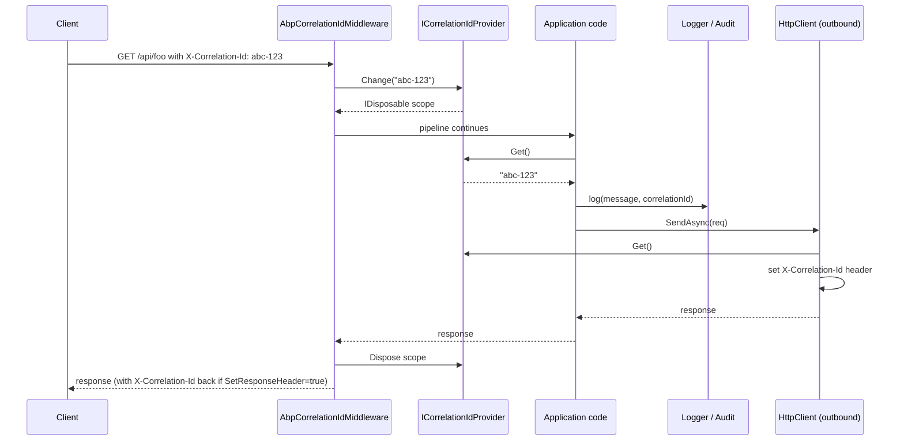
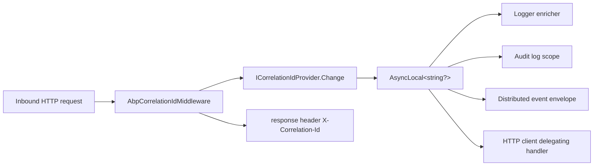

ABP Framework threads a single *correlation id* through every operation that happens during one logical interaction — an HTTP request, a background job, a queued message — so logs, audit entries, and exception notifications can be joined into one timeline. The contract is `ICorrelationIdProvider` in `Volo.Abp.Core`; the default implementation backs it with an `AsyncLocal<string?>`; and `AbpCorrelationIdOptions` configures the HTTP header used by the AspNetCore middleware that bridges client and server. This page covers every file in `framework/src/Volo.Abp.Core/Volo/Abp/Tracing/`.

## File inventory

| File | Symbol | Role |
| --- | --- | --- |
| `Tracing/ICorrelationIdProvider.cs` | `ICorrelationIdProvider` | `string? Get()`, `IDisposable Change(string?)`. |
| `Tracing/DefaultCorrelationIdProvider.cs` | `DefaultCorrelationIdProvider` | `AsyncLocal<string?>` backed `ISingletonDependency`. |
| `Tracing/AbpCorrelationIdOptions.cs` | `AbpCorrelationIdOptions` | `HttpHeaderName`, `SetResponseHeader`. |

## ICorrelationIdProvider

The interface is two methods. From `framework/src/Volo.Abp.Core/Volo/Abp/Tracing/ICorrelationIdProvider.cs`:

```csharp
public interface ICorrelationIdProvider
{
    string? Get();
    IDisposable Change(string? correlationId);
}
```

`Get()` returns the current id or `null`. `Change(id)` swaps it for the duration of a `using` block — on disposal, the previous id is restored. The disposable contract is identical to `ICancellationTokenProvider.Use` (see [Threading and async](/core/threading-and-async)) and `IAmbientScopeProvider<T>.BeginScope`.

## DefaultCorrelationIdProvider

The default implementation, in `framework/src/Volo.Abp.Core/Volo/Abp/Tracing/DefaultCorrelationIdProvider.cs`, uses a private `AsyncLocal<string?>` so the value flows across `await`:

```csharp
public class DefaultCorrelationIdProvider : ICorrelationIdProvider, ISingletonDependency
{
    private readonly AsyncLocal<string?> _currentCorrelationId = new AsyncLocal<string?>();

    private string? CorrelationId => _currentCorrelationId.Value;

    public virtual string? Get() => CorrelationId;

    public virtual IDisposable Change(string? correlationId)
    {
        var parent = CorrelationId;
        _currentCorrelationId.Value = correlationId;
        return new DisposeAction(() => { _currentCorrelationId.Value = parent; });
    }
}
```

Two design choices to note:

1. The class is `ISingletonDependency` but the `AsyncLocal` is *per logical flow* — `AsyncLocal` is implicitly per-call-context, so singletonness of the provider is fine.
2. `Change` captures the parent and restores it on disposal — that is what makes nested scopes correct. If an inner scope changes the id and an outer one reads it after the inner disposes, the outer sees the outer id again.

The `DisposeAction` (from `framework/src/Volo.Abp.Core/Volo/Abp/DisposeAction.cs`) is the throwaway closure carrier.

## AbpCorrelationIdOptions

The options class is two settings. From `framework/src/Volo.Abp.Core/Volo/Abp/Tracing/AbpCorrelationIdOptions.cs`:

```csharp
public class AbpCorrelationIdOptions
{
    public string HttpHeaderName { get; set; } = "X-Correlation-Id";
    public bool SetResponseHeader { get; set; } = true;
}
```

- **`HttpHeaderName`** — the inbound and outbound header name. The default `X-Correlation-Id` matches the de-facto industry convention.
- **`SetResponseHeader`** — when `true` (default), the server middleware also writes the correlation id back on the response. That lets clients log "here is the correlation id the server used" even when they did not send one themselves.

Higher-level integrations consume these:

- The AspNetCore middleware (`AbpCorrelationIdMiddleware`, in `Volo.Abp.AspNetCore.Tracing`) reads `request.Headers[options.HttpHeaderName]` and calls `correlationIdProvider.Change(id)` for the request scope. If no header is present, it generates a new `Guid.NewGuid().ToString("N")`.
- The HTTP client integration adds the header to every outbound request via a delegating handler that reads `correlationIdProvider.Get()`.
- The background-job runners call `correlationIdProvider.Change(job.CorrelationId)` when picking up a job.

## Flow across a single HTTP call



The provider's `AsyncLocal` carries the id through the entire downstream pipeline — application services, EF Core repositories, outbound HTTP — without any explicit parameter passing.

## Who consumes Get()?

Within `Volo.Abp.Core` no one *yet*; the consumers all live in higher-level packages. The most visible ones:

- **Logging** — most ABP logging pipelines (Serilog enrichers, NLog layouts) call `serviceProvider.GetService<ICorrelationIdProvider>().Get()` once per log entry.
- **Auditing** — `AuditLogInfo.CorrelationId` is set from `correlationIdProvider.Get()` when an audit-log scope opens.
- **Exception subscribers** — typical subscribers attach the correlation id when persisting an exception so post-mortem search is possible.
- **Distributed event bus** — outbound integration events carry `CorrelationId` in their envelope; inbound ones call `correlationIdProvider.Change(envelope.CorrelationId)` for the duration of the handler.

## Setting a custom header name

A module can change the header globally via the standard options pattern:

```csharp
public override void ConfigureServices(ServiceConfigurationContext context)
{
    Configure<AbpCorrelationIdOptions>(options =>
    {
        options.HttpHeaderName = "Trace-Id";
        options.SetResponseHeader = true;
    });
}
```

After this, the middleware will read inbound `Trace-Id` and the HTTP client will write outbound `Trace-Id`. Existing logs that already include the value remain valid.

## Manually entering a correlation scope

Background jobs, message consumers, scheduled tasks and unit tests sometimes need to enter a correlation scope by hand:

```csharp
public class CustomerNightlyJob : IBackgroundJob<CustomerNightlyJobArgs>
{
    private readonly ICorrelationIdProvider _correlationIdProvider;

    public CustomerNightlyJob(ICorrelationIdProvider correlationIdProvider)
        => _correlationIdProvider = correlationIdProvider;

    public async Task ExecuteAsync(CustomerNightlyJobArgs args)
    {
        using (_correlationIdProvider.Change(args.CorrelationId ?? Guid.NewGuid().ToString("N")))
        {
            await DoWorkAsync(args);
        }
    }
}
```

Inside the `using`, every log entry, every audit-log scope, every outbound HTTP request will carry that id. After disposal, the id reverts (or becomes `null` if there was no outer scope).

<Tip>
  When implementing custom consumers, follow the established convention: if an inbound envelope carries a correlation id, use it; otherwise generate `Guid.NewGuid().ToString("N")`. Don't reuse process-wide ids.
</Tip>

## Why a custom provider rather than `Activity.Current.Id`?

ASP.NET Core's `System.Diagnostics.Activity` infrastructure carries a `TraceId` that does much of the same work. ABP keeps its own provider because:

- ABP needs to support non-AspNetCore hosts (CLI, background workers, Blazor WASM).
- The correlation id needs to round-trip through ABP's own RemoteService envelope and event bus, which already format it as a string field — independent of Activity baggage propagation.
- `Activity.Current` can be replaced or absent inside `Task.Run`-style fire-and-forget paths; `AsyncLocal<string?>` in `DefaultCorrelationIdProvider` is the one canonical source.

Nothing prevents you from writing a custom provider that pulls the id from `Activity.Current?.RootId` — the `ICorrelationIdProvider` interface is exactly the seam.

```csharp
[Dependency(ReplaceServices = true)]
public class ActivityCorrelationIdProvider : ICorrelationIdProvider, ISingletonDependency
{
    public string? Get() => Activity.Current?.RootId;
    public IDisposable Change(string? correlationId)
    {
        var activity = new Activity("AbpCorrelationOverride").Start();
        return new DisposeAction(() => activity.Stop());
    }
}
```

Replacing the service is enough — the rest of the framework only depends on the interface.

## Putting it all together



## Common pitfalls

<Warning>
  - **Stripping the id when forwarding** — proxies that drop unknown headers will break correlation. Allow `X-Correlation-Id` (or your configured name) through.
  - **Using a synchronous wait** — `task.Wait()` blocks the synchronization context; the `AsyncLocal` is still flowing but downstream logs may run after the scope is disposed. Prefer `await`.
  - **Logging from a `static` field** — static loggers configured at class load time may not see the runtime DI provider. Use injected `ILogger<T>` instead so the enricher can read the provider.
</Warning>

## Related pages

<CardGroup cols={2}>
  <Card title="Threading" icon="gauge" href="/core/threading-and-async">
    `AsyncLocal`, `IAmbientScopeProvider<T>`, and the disposable-scope idiom shared with `ICancellationTokenProvider`.
  </Card>
  <Card title="Exception handling" icon="triangle-exclamation" href="/core/exception-handling">
    Subscribers typically attach the correlation id when persisting exceptions.
  </Card>
  <Card title="Options" icon="sliders" href="/core/options-and-configuration">
    `Configure<AbpCorrelationIdOptions>` is the standard way to change the header name.
  </Card>
  <Card title="DI" icon="syringe" href="/core/dependency-injection">
    Replacing the provider with `[Dependency(ReplaceServices = true)]`.
  </Card>
</CardGroup>

## Correlation across non-HTTP boundaries

Three other communication channels typically need to ferry the correlation id:

| Channel | Where the id rides | Mechanism |
| --- | --- | --- |
| Distributed event bus | Envelope property `CorrelationId` | Outbound publisher reads `correlationIdProvider.Get()`; inbound consumer calls `Change(...)` for the handler. |
| Background job queue | Persisted as a column on the job row | Worker calls `Change(job.CorrelationId)` before invoking the handler. |
| gRPC / SignalR | Custom metadata / header | Interceptor reads and writes the configured header name. |

Each integration ships its own middleware/handler but they all converge on `ICorrelationIdProvider` — that is the single shared seam.

## Testing patterns

For unit tests that need to assert "this method picks up the current correlation id", you don't need to wire up middleware — just call `Change` directly:

```csharp
[Fact]
public async Task Should_Capture_Current_CorrelationId()
{
    var provider = new DefaultCorrelationIdProvider();
    using (provider.Change("test-corr-id"))
    {
        var sut = new ServiceUnderTest(provider);
        await sut.DoWorkAsync();
        Assert.Equal("test-corr-id", sut.CapturedCorrelationId);
    }
}
```

Because `DefaultCorrelationIdProvider` uses `AsyncLocal`, the captured value flows across any `await` inside `DoWorkAsync` — even if the work happens on a different thread.

For tests that need a *deterministic* sequence of ids across multiple test runs, replace the provider with a stub that returns a hard-coded value:

```csharp
public class FixedCorrelationIdProvider : ICorrelationIdProvider
{
    public string Fixed { get; set; } = "fixed-id";
    public string? Get() => Fixed;
    public IDisposable Change(string? correlationId) => NullDisposable.Instance;
}
```

`NullDisposable.Instance` lives at `framework/src/Volo.Abp.Core/Volo/Abp/NullDisposable.cs` for exactly this use case.

## Comparison with related providers

| Provider | Backing store | Lifetime | Use when |
| --- | --- | --- | --- |
| `ICorrelationIdProvider` | `AsyncLocal<string?>` | Singleton | A single string flows through the entire request. |
| `ICancellationTokenProvider` | `IAmbientScopeProvider<CancellationTokenOverride>` | Singleton-ish | The current cancellation token is needed but not parameter-passed. |
| `ICurrentTenant` (`Volo.Abp.MultiTenancy`) | `IAmbientScopeProvider<TenantInfo>` | Singleton | The current tenant context is needed across async flows. |
| `ICurrentUser` (`Volo.Abp.Users`) | Scoped service reading `ClaimsPrincipal` | Scoped | The current user identity is needed inside the DI scope. |

All four use the same disposable-scope pattern at the contract level, even though their backing stores differ. That is by design — once you learn one, the others read the same.

## Replacement strategies

There are three common reasons to replace `DefaultCorrelationIdProvider`:

<Tabs>
  <Tab title="Hierarchical ids">
    Generate a child id that includes the parent — useful for tracing nested operations:
    ```csharp
    [Dependency(ReplaceServices = true)]
    public class HierarchicalCorrelationIdProvider : DefaultCorrelationIdProvider
    {
        public override IDisposable Change(string? correlationId)
        {
            var current = Get();
            var combined = current is null ? correlationId : $"{current}.{correlationId}";
            return base.Change(combined);
        }
    }
    ```
  </Tab>
  <Tab title="Per-tenant prefix">
    Tag every id with the current tenant so log search across tenants is trivial:
    ```csharp
    [Dependency(ReplaceServices = true)]
    public class TenantPrefixedCorrelationIdProvider : DefaultCorrelationIdProvider
    {
        private readonly ICurrentTenant _currentTenant;
        public TenantPrefixedCorrelationIdProvider(ICurrentTenant currentTenant)
            => _currentTenant = currentTenant;

        public override string? Get()
        {
            var inner = base.Get();
            if (inner == null) return null;
            var tenant = _currentTenant.Id;
            return tenant == null ? inner : $"t-{tenant:N}-{inner}";
        }
    }
    ```
  </Tab>
  <Tab title="W3C TraceContext">
    Bridge to OpenTelemetry's `traceparent` header:
    ```csharp
    [Dependency(ReplaceServices = true)]
    public class ActivityCorrelationIdProvider : ICorrelationIdProvider, ISingletonDependency
    {
        public string? Get() => Activity.Current?.TraceId.ToString();
        public IDisposable Change(string? correlationId) => NullDisposable.Instance;
    }
    ```
    Note that `Change` is a no-op — the W3C provider is read-only because Activity ownership belongs to OpenTelemetry.
  </Tab>
</Tabs>

In all three cases the rest of the framework continues to call `Get()` and gets the desired id.

## Performance notes

`DefaultCorrelationIdProvider.Get()` is a single `AsyncLocal<string?>.Value` read — sub-microsecond on modern runtimes. `Change()` allocates one `DisposeAction` per call; if you find yourself entering a correlation scope thousands of times per second, consider pre-allocating a per-correlation-id `IDisposable` pool. In practice, hot paths read `Get()` and never call `Change()` — the middleware enters one scope per request and is done.

The HTTP middleware that consumes these primitives is documented under [/infrastructure/overview](/infrastructure/overview); audit-logging behaviour around correlation lives in [/data/overview](/data/overview); and DDD application-service auditing patterns appear in [/ddd/overview](/ddd/overview).
