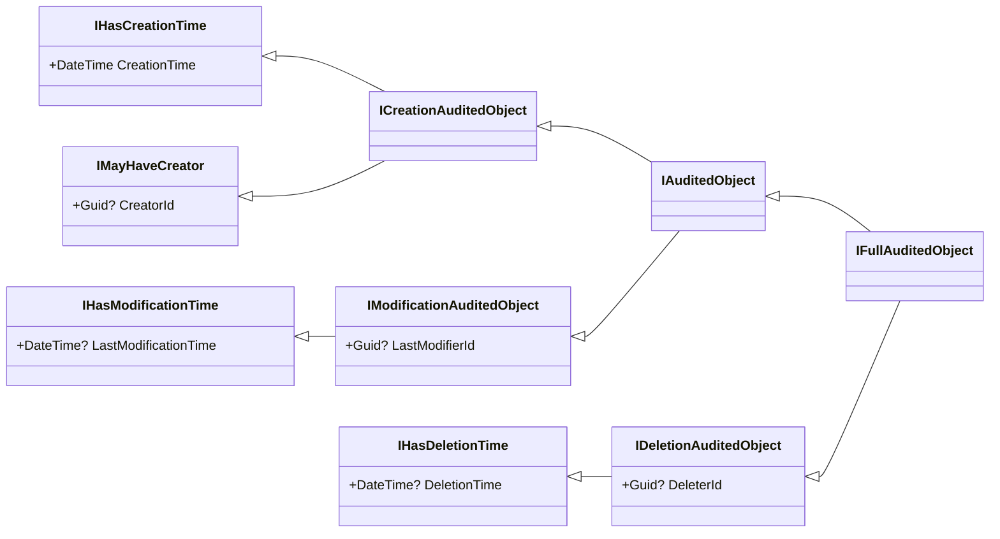
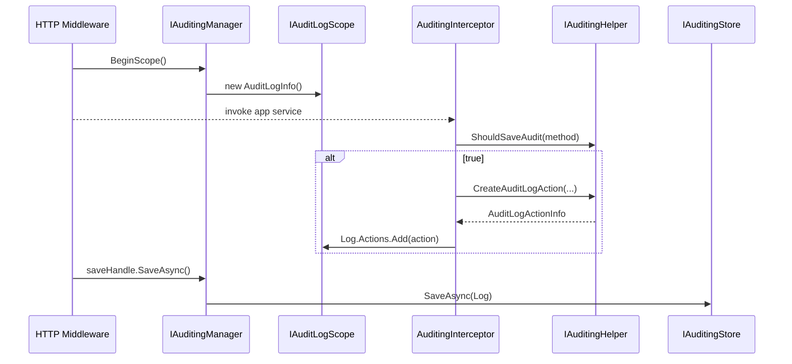

The ABP Framework draws a careful line between *what an object claims about its auditing data* and *the runtime engine that produces audit logs*. The first half lives in `Volo.Abp.Auditing.Contracts` (no DI, no DB, no opinions) and exposes the marker interfaces used by entities, DTOs and event records. The second half lives in `Volo.Abp.Auditing` and adds `AuditLogInfo`, `IAuditingHelper`, `IAuditingManager`, `IAuditingStore` and the `AuditingInterceptor`. This page walks both packages and explains how they pair together; for the persistence side see [Infrastructure: Auditing](/infrastructure/auditing) and the higher-level [Audit Logging module](/modules/audit-logging).

## Two-package design

| Package | Path | What it ships |
| --- | --- | --- |
| `Volo.Abp.Auditing.Contracts` | `framework/src/Volo.Abp.Auditing.Contracts/Volo/Abp/Auditing/` | Marker interfaces + attributes only |
| `Volo.Abp.Auditing` | `framework/src/Volo.Abp.Auditing/Volo/Abp/Auditing/` | `AuditLogInfo`, helpers, store, interceptor |

The contracts package has *no* runtime dependencies beyond `Volo.Abp.Core`, so even shared kernel projects that must not pull in DI / EF references can implement `IFullAuditedObject` and declare `[Audited]` / `[DisableAuditing]` attributes. The contracts module is just a marker — `AbpAuditingContractsModule.cs` is empty:

```csharp
public class AbpAuditingContractsModule : AbpModule
{
}
```

## Marker attributes

Two attributes drive the interceptor's opt-in/opt-out behaviour:

```csharp
[AttributeUsage(AttributeTargets.Class | AttributeTargets.Method | AttributeTargets.Property)]
public class AuditedAttribute : Attribute { }

[AttributeUsage(AttributeTargets.Class | AttributeTargets.Method | AttributeTargets.Property)]
public class DisableAuditingAttribute : Attribute
{
    public bool UpdateModificationProps { get; set; } = true;
    public bool PublishEntityEvent { get; set; } = true;
}
```

* `[Audited]` forces auditing on a target that would not otherwise qualify.
* `[DisableAuditing]` removes auditing from a class, method or property. Because it can sit on a property, you can also use it to hide sensitive columns (e.g. passwords) from `EntityHistory` snapshots. The two booleans let you keep entity events flowing while skipping the audit-log diff, or vice-versa.

The `[IAuditingEnabled]` marker is the third opt-in mechanism — it works exactly like `IValidationEnabled` in [Validation](/crosscutting/validation): the `AuditingInterceptorRegistrar` only attaches `AuditingInterceptor` to classes that implement it (and `ApplicationService` does).

## The audited-object family

The bulk of the contracts package is a small, normalized hierarchy of interfaces that entities can mix-and-match.



Each interface has a single semantic responsibility:

| Interface | Adds | File |
| --- | --- | --- |
| `IHasCreationTime` | `DateTime CreationTime` | `IHasCreationTime.cs` |
| `IMayHaveCreator` | `Guid? CreatorId` | `IMayHaveCreator.cs` |
| `IMustHaveCreator` | `Guid CreatorId` (non-null) | `IMustHaveCreator.cs` |
| `ICreationAuditedObject` | combines the two above | `ICreationAuditedObject.cs` |
| `IHasModificationTime` | `DateTime? LastModificationTime` | `IHasModificationTime.cs` |
| `IModificationAuditedObject` | `Guid? LastModifierId` | `IModificationAuditedObject.cs` |
| `IAuditedObject` | creation + modification | `IAuditedObject.cs` |
| `IHasDeletionTime` | `DateTime? DeletionTime` (extends `ISoftDelete`) | `IHasDeletionTime.cs` |
| `IDeletionAuditedObject` | `Guid? DeleterId` | `IDeletionAuditedObject.cs` |
| `IFullAuditedObject` | all of the above | `IFullAuditedObject.cs` |
| `IHasEntityVersion` | `int EntityVersion` | `IHasEntityVersion.cs` |

The generic variants such as `IFullAuditedObject<TUser>` add navigation properties so EF Core can wire the relationship to the user table — useful for read models, but optional.

```csharp
public interface IFullAuditedObject : IAuditedObject, IDeletionAuditedObject { }
public interface IFullAuditedObject<TUser>
    : IAuditedObject<TUser>, IFullAuditedObject, IDeletionAuditedObject<TUser> { }
```

`AuditPropertySetter` (in the runtime package) inspects these interfaces during entity tracking to populate the audit columns. The same interfaces are reused by [Application Services](/ddd/application-services) to decide which audit fields show up in DTOs.

### Soft-delete coupling

`IHasDeletionTime` extends `ISoftDelete`, so any entity that implements `IFullAuditedObject` automatically participates in the soft-delete filter. When a row is deleted, the auditing runtime sets `DeletionTime` and `DeleterId` and lets EF Core save it instead of issuing `DELETE`. That coupling is the reason `DeletionTime` is nullable — pre-delete it stays `null`.

### `EntityChangeType`

The companion enum is consumed everywhere a change record needs to label *what kind* of change happened:

```csharp
public enum EntityChangeType : byte
{
    Created = 0,
    Updated = 1,
    Deleted = 2
}
```

## The audit-log DTOs

`AuditLogInfo.cs` (in the runtime package) is the in-memory representation of a single request's audit log. It is intentionally serializable and holds everything the store needs to persist a row.

```csharp
[Serializable]
public class AuditLogInfo : IHasExtraProperties
{
    public string? ApplicationName { get; set; }
    public Guid? UserId { get; set; }
    public string? UserName { get; set; }
    public Guid? TenantId { get; set; }
    public string? TenantName { get; set; }
    public Guid? ImpersonatorUserId { get; set; }
    public Guid? ImpersonatorTenantId { get; set; }
    public DateTime ExecutionTime { get; set; }
    public int ExecutionDuration { get; set; }
    public string? ClientId { get; set; }
    public string? CorrelationId { get; set; }
    public string? ClientIpAddress { get; set; }
    public string? ClientName { get; set; }
    public string? BrowserInfo { get; set; }
    public string? HttpMethod { get; set; }
    public int? HttpStatusCode { get; set; }
    public string? Url { get; set; }

    public List<AuditLogActionInfo> Actions { get; set; }
    public List<Exception> Exceptions { get; }
    public ExtraPropertyDictionary ExtraProperties { get; }
    public List<EntityChangeInfo> EntityChanges { get; }
    public List<string> Comments { get; set; }
}
```

A few things to notice:

* It implements `IHasExtraProperties` (see [Object Extending](/crosscutting/object-extending)) so modules can attach arbitrary data without subclassing.
* `Actions`, `EntityChanges`, `Exceptions` and `Comments` are aggregate collections that accumulate during a request scope.
* `ToString()` produces a human-readable summary that the default `SimpleLogAuditingStore` simply forwards to `ILogger`.

`AuditLogActionInfo.cs` represents one intercepted method call:

```csharp
[Serializable]
public class AuditLogActionInfo : IHasExtraProperties
{
    public string ServiceName { get; set; } = default!;
    public string MethodName { get; set; } = default!;
    public string Parameters { get; set; } = default!;
    public DateTime ExecutionTime { get; set; }
    public int ExecutionDuration { get; set; }
    public ExtraPropertyDictionary ExtraProperties { get; }
}
```

`Parameters` is a JSON-serialized string. `IAuditSerializer` decides how arguments are stringified — `JsonAuditSerializer.cs` is the default implementation and respects `AbpAuditingOptions.IgnoredTypes` to skip unserializable values such as `Stream`, `Expression` and `CancellationToken`.

## `AbpAuditingOptions`

`AbpAuditingOptions.cs` is the toggle board for the runtime engine:

```csharp
public class AbpAuditingOptions
{
    public bool HideErrors { get; set; }            // default true
    public bool IsEnabled { get; set; }              // default true
    public string? ApplicationName { get; set; }
    public bool IsEnabledForAnonymousUsers { get; set; }
    public bool AlwaysLogOnException { get; set; }
    public bool IsEnabledForIntegrationServices { get; set; }
    public List<Func<AuditLogInfo, Task<bool>>> AlwaysLogSelectors { get; }
    public List<AuditLogContributor> Contributors { get; }
    public List<Type> IgnoredTypes { get; }
    public IEntityHistorySelectorList EntityHistorySelectors { get; }
    public bool SaveEntityHistoryWhenNavigationChanges { get; set; } = true;
    public bool IsEnabledForGetRequests { get; set; }
    public bool DisableLogActionInfo { get; set; }
}
```

| Option | Effect |
| --- | --- |
| `IsEnabled` | Global kill switch consulted by every entry point. |
| `IsEnabledForAnonymousUsers` | When false, the interceptor short-circuits for unauthenticated requests. |
| `IsEnabledForGetRequests` | The MVC integration sets this false by default so reads are not logged. |
| `IsEnabledForIntegrationServices` | Whether `[IntegrationService]`-marked services get audited. |
| `AlwaysLogOnException` | Forces a log even when other rules would skip the request. |
| `AlwaysLogSelectors` | Lambdas evaluated against the in-progress `AuditLogInfo` to force a save. |
| `Contributors` | Pre/Post `AuditLogContributor`s, see below. |
| `IgnoredTypes` | Types skipped by the serializer (defaults to `Stream`, `Expression`, `CancellationToken`). |
| `EntityHistorySelectors` | Per-entity rules deciding whether to capture `EntityChangeInfo`. |

## Core services

The runtime services that consume the above DTOs are declared in `Volo.Abp.Auditing` and are typically replaced by the [Audit Logging module](/modules/audit-logging) with database-backed implementations.

### `IAuditingHelper`

`IAuditingHelper.cs` is the policy decision-maker. It tells the rest of the framework whether a method or entity should be audited at all, and constructs the `AuditLogInfo` / `AuditLogActionInfo` records.

```csharp
public interface IAuditingHelper
{
    bool ShouldSaveAudit(MethodInfo? methodInfo, bool defaultValue = false,
        bool ignoreIntegrationServiceAttribute = false);
    bool IsEntityHistoryEnabled(Type entityType, bool defaultValue = false);

    AuditLogInfo CreateAuditLogInfo();
    AuditLogActionInfo CreateAuditLogAction(AuditLogInfo auditLog, Type? type,
        MethodInfo method, object?[] arguments);
    AuditLogActionInfo CreateAuditLogAction(AuditLogInfo auditLog, Type? type,
        MethodInfo method, IDictionary<string, object?> arguments);

    IDisposable DisableAuditing();
    bool IsAuditingEnabled();
}
```

`DisableAuditing()` returns an `IDisposable` so callers can suppress auditing for a scoped block (e.g. background-job housekeeping). `IsAuditingEnabled()` honours those scopes and is consulted by `AuditingInterceptor` before doing any work.

### `IAuditingManager`

`IAuditingManager.cs` exposes the *scope* primitive that the entire pipeline revolves around:

```csharp
public interface IAuditingManager
{
    IAuditLogScope? Current { get; }
    IAuditLogSaveHandle BeginScope();
}
```

`AuditingManager.cs` uses `IAmbientScopeProvider<IAuditLogScope>` to attach an `IAuditLogScope` to the current async-flow under the ambient key `"Volo.Abp.Auditing.IAuditLogScope"`:

```csharp
public IAuditLogSaveHandle BeginScope()
{
    var ambientScope = _ambientScopeProvider.BeginScope(
        AmbientContextKey,
        new AuditLogScope(_auditingHelper.CreateAuditLogInfo()));
    return new DisposableSaveHandle(this, ambientScope, Current!.Log, Stopwatch.StartNew());
}
```

The returned `IAuditLogSaveHandle` is what consumer code typically uses:

```csharp
using (var saveHandle = auditingManager.BeginScope())
{
    try { /* business work */ }
    finally { await saveHandle.SaveAsync(); }
}
```

`IAuditLogScope.Log` is the live `AuditLogInfo` instance — interceptors, exception filters and event handlers append to it as the request flows through the system.

### `IAuditingStore`

`IAuditingStore.cs` is the persistence boundary:

```csharp
public interface IAuditingStore
{
    Task SaveAsync(AuditLogInfo auditInfo);
}
```

The default `SimpleLogAuditingStore.cs` writes via `ILogger`:

```csharp
[Dependency(TryRegister = true)]
public class SimpleLogAuditingStore : IAuditingStore, ISingletonDependency
{
    public Task SaveAsync(AuditLogInfo auditInfo)
    {
        Logger.LogInformation(auditInfo.ToString());
        return Task.FromResult(0);
    }
}
```

Because of `TryRegister`, *any* other module that registers `IAuditingStore` (notably the database-backed [Audit Logging module](/modules/audit-logging)) takes over without conflicts.

### `AuditLogContributor`

`AuditLogContributor.cs` is the extension point for enriching a log record. Implementations override `PreContribute` (before any actions execute) and `PostContribute` (just before save):

```csharp
public abstract class AuditLogContributor
{
    public virtual void PreContribute(AuditLogContributionContext context) { }
    public virtual void PostContribute(AuditLogContributionContext context) { }
}
```

`AbpAuditingOptions.Contributors` is the ordered list. The ASP.NET Core integration ships an `HttpContextAuditLogContributor` that populates `Url`, `HttpMethod`, `ClientIpAddress`, `BrowserInfo` and `HttpStatusCode`; modules can append their own to record correlation IDs, multi-tenant info, or domain-specific metadata.

## How a request flows through



The interceptor (`AuditingInterceptor.cs`) only attaches to classes implementing `IAuditingEnabled`. It wraps the call in a stopwatch, captures the `Exception` if one is thrown, and appends to `Scope.Log.Actions`. Entity-change tracking is plugged in by the EF Core / MongoDB integrations through `EntityHistorySelectorList` — see [Infrastructure: Auditing](/infrastructure/auditing) for the persistence story.

## Putting it together

1. Entities declare which audit columns they hold by implementing one of the `IAuditedObject` family interfaces in `Volo.Abp.Auditing.Contracts`.
2. Application services implement `IAuditingEnabled` (`ApplicationService` already does) and may add `[Audited]` / `[DisableAuditing]` as needed.
3. At the start of a request, `IAuditingManager.BeginScope()` materialises a new `AuditLogInfo`.
4. `AuditingInterceptor` appends `AuditLogActionInfo`s and lets `AuditLogContributor`s enrich the record.
5. `IAuditingStore.SaveAsync` persists the final `AuditLogInfo` — either through the default log-only store or through the database store that ships with the [Audit Logging module](/modules/audit-logging).

## See also

* [Infrastructure: Auditing](/infrastructure/auditing) — `AuditingInterceptor`, `AuditPropertySetter`, and EF/MongoDB integration.
* [Audit Logging module](/modules/audit-logging) — the database-backed implementation of `IAuditingStore`.
* [Application Services](/ddd/application-services) for how `IAuditingEnabled` is wired into the base class.
* [Object Extending](/crosscutting/object-extending) for the `IHasExtraProperties` that `AuditLogInfo` implements.
