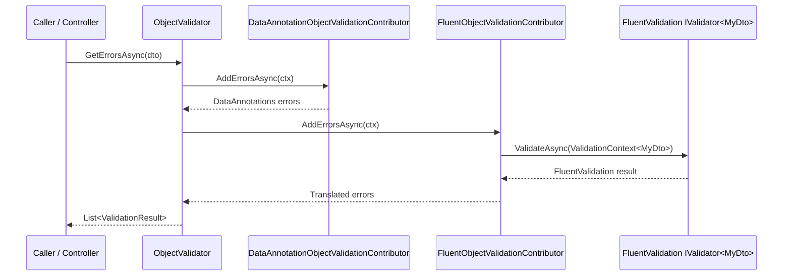

The ABP Framework integrates the popular [FluentValidation](https://docs.fluentvalidation.net/) library by introducing an `IObjectValidationContributor` that resolves an `IValidator<T>` from the container for the runtime type being validated. This page walks through the `Volo.Abp.FluentValidation` package — its module, the conventional registrar that auto-registers FluentValidation validators, and the contributor that bridges FluentValidation's `ValidationResult` back into ABP's `System.ComponentModel.DataAnnotations.ValidationResult` shape.

## Package overview

The integration ships exactly three classes under `framework/src/Volo.Abp.FluentValidation/Volo/Abp/FluentValidation/`:

| File | Type | Responsibility |
| --- | --- | --- |
| `AbpFluentValidationModule.cs` | Module | Declares dependencies and registers the conventional registrar. |
| `AbpFluentValidationConventionalRegistrar.cs` | DI registrar | Discovers `IValidator<T>` implementations and exposes them as both their concrete type and the generic interface. |
| `FluentObjectValidationContributor.cs` | Validation contributor | Resolves an `IValidator` per call and projects its results into the ABP pipeline. |

Pulling in `Volo.Abp.FluentValidation` therefore replaces no existing functionality — it *adds* one more contributor that runs in addition to `DataAnnotationObjectValidationContributor`, so FluentValidation rules and DataAnnotations can coexist on the same DTO.

## Module wiring

`AbpFluentValidationModule.cs` depends only on `AbpValidationModule` and uses `PreConfigureServices` to add the conventional registrar:

```csharp
[DependsOn(typeof(AbpValidationModule))]
public class AbpFluentValidationModule : AbpModule
{
    public override void PreConfigureServices(ServiceConfigurationContext context)
    {
        context.Services.AddConventionalRegistrar(new AbpFluentValidationConventionalRegistrar());
    }
}
```

Because `PreConfigureServices` runs before any module's `ConfigureServices`, the custom registrar is in place when ABP scans the application's assemblies for service implementations. Combined with `AbpValidationModule`'s auto-discovery (see [Validation](/crosscutting/validation)), simply depending on this module is enough — no manual `services.AddValidatorsFromAssembly()` call is required.

## Conventional registrar

The bulk of the magic lives in `AbpFluentValidationConventionalRegistrar.cs`. ABP's `DefaultConventionalRegistrar` registers services based on the standard `ITransientDependency`/`IScopedDependency`/`ISingletonDependency` markers, but FluentValidation's `AbstractValidator<T>` does not implement any of them. The override flips the rules: it only registers types that implement `IValidator<>` and registers them as `Transient`.

```csharp
public class AbpFluentValidationConventionalRegistrar : DefaultConventionalRegistrar
{
    protected override bool IsConventionalRegistrationDisabled(Type type)
    {
        return !type.GetInterfaces().Any(x => x.IsGenericType &&
                   x.GetGenericTypeDefinition() == typeof(IValidator<>))
            || base.IsConventionalRegistrationDisabled(type);
    }

    protected override ServiceLifetime? GetDefaultLifeTimeOrNull(Type type)
    {
        return ServiceLifetime.Transient;
    }

    protected override List<Type> GetExposedServiceTypes(Type type)
    {
        return new List<Type>
        {
            type,
            typeof(IValidator<>).MakeGenericType(GetFirstGenericArgumentOrNull(type, 1)!)
        };
    }

    private static Type? GetFirstGenericArgumentOrNull(Type type, int depth)
    {
        const int maxFindDepth = 8;
        if (depth >= maxFindDepth) return null;
        if (type.IsGenericType && type.GetGenericArguments().Length >= 1)
            return type.GetGenericArguments()[0];
        return GetFirstGenericArgumentOrNull(type.BaseType!, depth + 1);
    }
}
```

There are three behaviours worth highlighting:

1. **Filter.** `IsConventionalRegistrationDisabled` returns `true` for everything that does not implement `IValidator<>`, so unrelated classes in the same assembly are not registered as validators.
2. **Lifetime.** `GetDefaultLifeTimeOrNull` enforces `Transient`. FluentValidation validators are stateless, but using transient avoids accidental sharing of `RuleBuilder` state when the same validator is used inside loops.
3. **Exposed services.** `GetExposedServiceTypes` walks up to 8 levels of base classes to find the generic argument of `IValidator<>` (which can be hidden by intermediate base classes such as `AbstractValidator<MyDto>`). It registers both the concrete validator type and the closed `IValidator<MyDto>` interface, so the contributor can resolve `IValidator<MyDto>` from any scope.

### Why expose both shapes?

When you call `services.GetService<IValidator<MyDto>>()` the contributer obtains the *closed generic* interface. But test setups, custom factories or DI inspectors may want the concrete type — exposing both keeps the door open. The `BaseType` recursion handles inheritance like:

```text
public class CreateUserDtoValidator : MyCompanyValidator<CreateUserDto>
{
}
public abstract class MyCompanyValidator<T> : AbstractValidator<T>
{
}
```

`GetFirstGenericArgumentOrNull(typeof(CreateUserDtoValidator), 1)` will descend through `MyCompanyValidator<CreateUserDto>` (depth 2) into `AbstractValidator<CreateUserDto>` (depth 3) and return `CreateUserDto`, exposing the validator as `IValidator<CreateUserDto>`. The `maxFindDepth = 8` guard avoids stack issues on pathological inheritance graphs.

## The contributor bridge

`FluentObjectValidationContributor.cs` is the small class that links FluentValidation into ABP's `IObjectValidator` pipeline. It implements `IObjectValidationContributor`, the same abstraction used by `DataAnnotationObjectValidationContributor` (see [Validation](/crosscutting/validation)).

```csharp
public class FluentObjectValidationContributor : IObjectValidationContributor, ITransientDependency
{
    private readonly IServiceProvider _serviceProvider;

    public FluentObjectValidationContributor(IServiceProvider serviceProvider)
    {
        _serviceProvider = serviceProvider;
    }

    public virtual async Task AddErrorsAsync(ObjectValidationContext context)
    {
        var serviceType = typeof(IValidator<>)
            .MakeGenericType(context.ValidatingObject.GetType());
        var validator = _serviceProvider.GetService(serviceType) as IValidator;
        if (validator == null) return;

        var result = await validator.ValidateAsync((IValidationContext)Activator.CreateInstance(
            typeof(ValidationContext<>).MakeGenericType(context.ValidatingObject.GetType()),
            context.ValidatingObject)!);

        if (!result.IsValid)
        {
            context.Errors.AddRange(
                result.Errors.Select(error =>
                    new ValidationResult(error.ErrorMessage, new[] { error.PropertyName })));
        }
    }
}
```

The key design choices are:

* **Runtime-type lookup.** The contributor uses `context.ValidatingObject.GetType()` rather than a compile-time generic parameter, so polymorphic DTOs are validated against the validator registered for their actual runtime type.
* **Graceful absence.** If no `IValidator<T>` is registered for the object's type, the contributor exits silently. This matters because the contributor runs for *every* validated object — not every DTO needs a FluentValidation rule.
* **Translation to `ValidationResult`.** FluentValidation produces a `FluentValidation.Results.ValidationResult` whose errors carry `ErrorMessage` and `PropertyName`. The contributor projects each error into a `System.ComponentModel.DataAnnotations.ValidationResult(ErrorMessage, new[] { PropertyName })`, so downstream consumers (ASP.NET Core problem-details mapping, the [exception handler](/core/exception-handling), MVC `ModelState`) treat them identically to DataAnnotations errors.

### Why a non-generic `IValidationContext`?

The line `Activator.CreateInstance(typeof(ValidationContext<>).MakeGenericType(...), ...)` is needed because FluentValidation's `IValidator.ValidateAsync` accepts an `IValidationContext`, but to populate it correctly you must construct a `ValidationContext<T>` for the right `T`. Creating it via reflection lets the contributor stay non-generic while still feeding the validator the strongly-typed context it expects.

## Pipeline interaction

Because `FluentObjectValidationContributor` is just another contributor, it participates in the same iteration done by `ObjectValidator.GetErrorsAsync`:



The order is determined by `AbpValidationOptions.ObjectValidationContributors`, which is populated by `AbpValidationModule.AutoAddObjectValidationContributors` — a contributor's position in the list reflects the order its containing service was registered with the DI container.

## Authoring a validator

A typical FluentValidation rule looks like the snippet below. No `[Validator]` attribute or factory registration is required; depending on `AbpFluentValidationModule` is enough because the conventional registrar discovers the class during the regular module assembly scan.

```csharp
public class CreateBookDtoValidator : AbstractValidator<CreateBookDto>
{
    public CreateBookDtoValidator()
    {
        RuleFor(x => x.Name)
            .NotEmpty()
            .MaximumLength(BookConsts.MaxNameLength);

        RuleFor(x => x.Price)
            .GreaterThan(0);
    }
}
```

When an application service method receives `CreateBookDto`, the chain is:

1. The DI proxy calls `ValidationInterceptor` (see [Validation](/crosscutting/validation)).
2. `MethodInvocationValidator` calls `IObjectValidator.GetErrorsAsync(dto, "input", false)`.
3. `DataAnnotationObjectValidationContributor` runs first and collects DataAnnotations errors.
4. `FluentObjectValidationContributor` resolves `IValidator<CreateBookDto>`, executes the rules and adds the translated errors.
5. If the combined list is non-empty, `AbpValidationException` is thrown and caught by the [exception handler](/core/exception-handling).

## Coexistence with DataAnnotations

Because both contributors append to the same `ObjectValidationContext.Errors`, you can mix and match:

| Concern | Best handled by | Why |
| --- | --- | --- |
| `[Required]`, `[MaxLength]`, `[Range]` | DataAnnotations | Standard, supported by MVC client-side validation, recognised by Swagger. |
| Conditional rules (`When`, `Unless`) | FluentValidation | Imperative `When` clauses are awkward in DataAnnotations. |
| Cross-property checks | FluentValidation | `RuleFor(x => x.End).GreaterThan(x => x.Start)` is built-in. |
| Async checks (DB lookups) | FluentValidation | `MustAsync` / `WhenAsync` integrate naturally; DataAnnotations is sync only. |

Because FluentValidation runs after DataAnnotations, you can rely on basic invariants (non-null, length) being already enforced when your fluent rules execute. If you prefer the inverse order, swap the contributors explicitly:

```csharp
Configure<AbpValidationOptions>(options =>
{
    options.ObjectValidationContributors.Clear();
    options.ObjectValidationContributors.Add<FluentObjectValidationContributor>();
    options.ObjectValidationContributors.Add<DataAnnotationObjectValidationContributor>();
});
```

## Interaction with application services

`ApplicationService` implements `IValidationEnabled`, which makes the `ValidationInterceptor` register itself on every application service (see [Application Services](/ddd/application-services)). The combined effect is:

* You write `await _bookAppService.CreateAsync(new CreateBookDto { … })`.
* The proxy intercepts the call and invokes `IMethodInvocationValidator`.
* DataAnnotations and FluentValidation errors are aggregated into one `AbpValidationException`.
* The [exception handling](/core/exception-handling) middleware returns a single HTTP 400 with field-level details.

This means FluentValidation rules are honoured for both server-side calls (e.g. when one application service calls another) and HTTP requests reaching MVC actions, because `AbpValidationActionFilter` runs the same `IMethodInvocationValidator` (see [Validation](/crosscutting/validation)).

## Localization

`FluentObjectValidationContributor` does not itself localize messages — instead it preserves whatever string the FluentValidation rule produces. FluentValidation's built-in localization works through its own resource manager. If you want messages to come from an ABP localization resource you can resolve `IStringLocalizer<MyResource>` inside the validator's constructor and call `.WithMessage(l => l["MyKey"])`. See [Localization](/crosscutting/localization) for how to define resources.

## Testing the integration

Because the contributor and validators are normal DI services, unit tests can construct an `ObjectValidator` with handpicked contributors:

```csharp
var contributor = new FluentObjectValidationContributor(serviceProvider);
var context = new ObjectValidationContext(new CreateBookDto { Name = "" });
await contributor.AddErrorsAsync(context);
context.Errors.ShouldNotBeEmpty();
```

For integration tests, depending on `AbpFluentValidationModule` from your test module is enough — the conventional registrar will discover validators from your test assembly automatically, and any DTO passed to an application service in the test will be validated against them.

## See also

* [Validation Pipeline](/crosscutting/validation) for the underlying `IObjectValidator`/contributor model.
* [Application Services](/ddd/application-services) — `IValidationEnabled` and DTO conventions.
* [Exception Handling](/core/exception-handling) for how the aggregated `AbpValidationException` becomes an HTTP response.
* [Localization](/crosscutting/localization) for producing localized validator messages.
