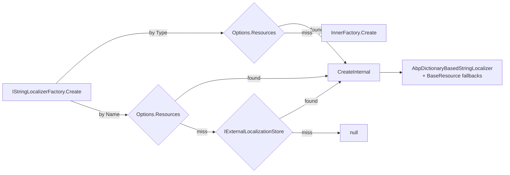

The ABP Framework builds on top of `Microsoft.Extensions.Localization` but replaces `IStringLocalizerFactory` with a richer model that supports resource inheritance, virtual-file contributors, dynamic external stores and per-resource culture fallback. This page walks through the `Volo.Abp.Localization` and `Volo.Abp.Localization.Abstractions` packages — how a `LocalizationResource` is declared with `[LocalizationResourceName]`, how `AbpStringLocalizerFactory` caches contributors, how `AbpLocalizationOptions` controls everything, and how `IExternalLocalizationStore` plugs in run-time resources.

## Package layout

The localization stack is split across two packages so that `Microsoft.Extensions.Localization` consumers can reference the abstractions without pulling in the virtual-file or threading modules.

| Package | Path | Highlights |
| --- | --- | --- |
| `Volo.Abp.Localization.Abstractions` | `framework/src/Volo.Abp.Localization.Abstractions/` | `IAbpStringLocalizerFactory`, `LocalizableString`, `LocalizationResourceNameAttribute` |
| `Volo.Abp.Localization` | `framework/src/Volo.Abp.Localization/Volo/Abp/Localization/` | `AbpStringLocalizerFactory`, `LocalizationResource`, contributors, `AbpLocalizationOptions` |

## Declaring a resource

A *resource* is just a marker class. Decorate it with `[LocalizationResourceName]` to give it a stable name independent of its CLR `FullName`:

```csharp
[LocalizationResourceName("MyProject")]
public class MyProjectResource
{
}
```

The attribute is defined in `framework/src/Volo.Abp.Localization.Abstractions/Volo/Abp/Localization/LocalizationResourceNameAttribute.cs`:

```csharp
public class LocalizationResourceNameAttribute : Attribute
{
    public string Name { get; }
    public LocalizationResourceNameAttribute(string name) { Name = name; }
    public static string GetName(Type resourceType)
    {
        return (GetOrNull(resourceType)?.Name ?? resourceType.FullName)!;
    }
}
```

Whenever ABP needs a string key for a resource it falls back to `Type.FullName` if the attribute is missing. The name is used by `LocalizationResourceDictionary` (the dictionary inside `AbpLocalizationOptions.Resources`) and by the external store's lookup methods.

## `LocalizationResourceBase` and `LocalizationResource`

`LocalizationResourceBase.cs` is the abstract bag that carries the resource's identity, fallback configuration and the contributor pipeline.

```csharp
public abstract class LocalizationResourceBase
{
    [NotNull] public string ResourceName { get; }
    public List<string> BaseResourceNames { get; }
    public string? DefaultCultureName { get; set; }
    [NotNull] public LocalizationResourceContributorList Contributors { get; }
}
```

`LocalizationResource.cs` is the typed variant. Its constructor pulls the resource name from `LocalizationResourceNameAttribute.GetName(resourceType)` and walks `IInheritedResourceTypesProvider` attributes (such as `[InheritResource(typeof(SomeOtherResource))]`) to populate `BaseResourceNames`:

```csharp
public LocalizationResource(
    [NotNull] Type resourceType,
    string? defaultCultureName = null,
    ILocalizationResourceContributor? initialContributor = null)
    : base(LocalizationResourceNameAttribute.GetName(resourceType),
           defaultCultureName,
           initialContributor)
{
    ResourceType = Check.NotNull(resourceType, nameof(resourceType));
    AddBaseResourceTypes();
}
```

The `NonTypedLocalizationResource` sibling is used when a resource only has a name (e.g. resources pulled from `IExternalLocalizationStore` at runtime).

## Registering resources from a module

Modules register their resources by populating `AbpLocalizationOptions.Resources`:

```csharp
Configure<AbpLocalizationOptions>(options =>
{
    options.Resources
        .Add<MyProjectResource>("en")
        .AddVirtualJson("/Localization/MyProject");
});
```

`LocalizationResourceDictionary.Add<T>` (in `Volo/Abp/Localization/LocalizationResourceDictionary.cs`) creates a new `LocalizationResource` and inserts it under its resource name. The `AddVirtualJson` extension comes from `LocalizationResourceExtensions.cs`:

```csharp
public static TLocalizationResource AddVirtualJson<TLocalizationResource>(
    this TLocalizationResource localizationResource,
    string virtualPath)
    where TLocalizationResource : LocalizationResourceBase
{
    localizationResource.Contributors.Add(new JsonVirtualFileLocalizationResourceContributor(
        virtualPath.EnsureStartsWith('/')));
    return localizationResource;
}
```

`AddBaseTypes` / `AddBaseResources` extensions in the same file populate `BaseResourceNames`, which the factory consults when resolving keys.

### Built-in resources

The framework itself ships a small number of resources:

| Resource | File | Module |
| --- | --- | --- |
| `AbpLocalizationResource` | `Volo/Abp/Localization/Resources/AbpLocalization/AbpLocalizationResource.cs` | `AbpLocalizationModule` |
| `DefaultResource` | `Volo/Abp/Localization/DefaultResource.cs` | `AbpLocalizationModule` |
| `AbpValidationResource` | `framework/src/Volo.Abp.Validation/Volo/Abp/Validation/Localization/AbpValidationResource.cs` | `AbpValidationModule` |

`AbpLocalizationModule.ConfigureServices` registers both `DefaultResource` and `AbpLocalizationResource` and points the latter at its embedded JSON files:

```csharp
Configure<AbpLocalizationOptions>(options =>
{
    options.Resources.Add<DefaultResource>("en");
    options.Resources.Add<AbpLocalizationResource>("en")
        .AddVirtualJson("/Localization/Resources/AbpLocalization");
});
```

## Contributors

`ILocalizationResourceContributor` (`Volo/Abp/Localization/ILocalizationResourceContributor.cs`) is the abstraction for a source of localized strings:

```csharp
public interface ILocalizationResourceContributor
{
    bool IsDynamic { get; }
    void Initialize(LocalizationResourceInitializationContext context);
    LocalizedString? GetOrNull(string cultureName, string name);
    void Fill(string cultureName, Dictionary<string, LocalizedString> dictionary);
    Task FillAsync(string cultureName, Dictionary<string, LocalizedString> dictionary);
    Task<IEnumerable<string>> GetSupportedCulturesAsync();
}
```

Each `LocalizationResourceBase.Contributors` collection is a `LocalizationResourceContributorList`, which iterates contributors in reverse during lookups so that later contributors *override* earlier ones:

```csharp
public LocalizedString? GetOrNull(string cultureName, string name,
    bool includeDynamicContributors = true)
{
    foreach (var contributor in this.Select(x => x).Reverse())
    {
        if (!includeDynamicContributors && contributor.IsDynamic) continue;
        var localString = contributor.GetOrNull(cultureName, name);
        if (localString != null) return localString;
    }
    return null;
}
```

The `IsDynamic` flag lets callers ask for *static-only* values (e.g. when generating static client-side resources at startup).

### Virtual-file JSON contributor

The most common source is JSON files served through ABP's virtual file system. `VirtualFileLocalizationResourceContributorBase.cs` provides the lazy-loaded, change-token-aware base:

```csharp
public abstract class VirtualFileLocalizationResourceContributorBase : ILocalizationResourceContributor
{
    public bool IsDynamic => false;

    public virtual void Initialize(LocalizationResourceInitializationContext context)
    {
        _resource = context.Resource;
        _virtualFileProvider = context.ServiceProvider
            .GetRequiredService<IVirtualFileProvider>();
    }

    public virtual LocalizedString? GetOrNull(string cultureName, string name)
    {
        return GetDictionaries().GetOrDefault(cultureName)?.GetOrNull(name);
    }
    // …
}
```

When `GetDictionaries()` is called for the first time it enumerates `_virtualFileProvider.GetDirectoryContents(_virtualPath)`, filters by `CanParseFile`, and converts each file into an `ILocalizationDictionary` via `CreateDictionaryFromFileContent`. It also subscribes to `ChangeToken.OnChange` so that the cache is invalidated when files are edited at runtime.

The concrete JSON implementation, `JsonVirtualFileLocalizationResourceContributor.cs`, only overrides `CanParseFile` and `CreateDictionaryFromFileContent`:

```csharp
public class JsonVirtualFileLocalizationResourceContributor
    : VirtualFileLocalizationResourceContributorBase
{
    public JsonVirtualFileLocalizationResourceContributor(string virtualPath)
        : base(virtualPath) { }

    protected override bool CanParseFile(IFileInfo file)
    {
        return file.Name.EndsWith(".json", StringComparison.OrdinalIgnoreCase);
    }

    protected override ILocalizationDictionary? CreateDictionaryFromFileContent(string jsonString)
    {
        return JsonLocalizationDictionaryBuilder.BuildFromJsonString(jsonString);
    }
}
```

`JsonLocalizationDictionaryBuilder.cs` parses the typical `{ "culture": "en", "texts": { "Key": "Value" } }` layout and produces a `StaticLocalizationDictionary`.

### Global contributors

`AbpLocalizationOptions.GlobalContributors` is a `ITypeList<ILocalizationResourceContributor>` that is *added to every resource* during initialization. `AbpStringLocalizerFactory.CreateStringLocalizerCacheItem` instantiates each global contributor with `Activator.CreateInstance` and pushes it into the resource's contributor list before any per-resource contributors run:

```csharp
foreach (var globalContributorType in AbpLocalizationOptions.GlobalContributors)
{
    resource.Contributors.Add(
        Activator.CreateInstance(globalContributorType)!
                 .As<ILocalizationResourceContributor>());
}
```

Use this when you want a single source — say, a database table — to extend every resource declared in the system.

## `AbpStringLocalizerFactory`

`AbpStringLocalizerFactory.cs` is the heart of the runtime. It implements both `IStringLocalizerFactory` (the framework interface) and `IAbpStringLocalizerFactory` (the ABP extension), so any consumer that asks for `IStringLocalizer<TResource>` ends up here.

```csharp
public class AbpStringLocalizerFactory : IStringLocalizerFactory, IAbpStringLocalizerFactory
{
    protected internal AbpLocalizationOptions AbpLocalizationOptions { get; }
    protected ResourceManagerStringLocalizerFactory InnerFactory { get; }
    protected IExternalLocalizationStore ExternalLocalizationStore { get; }
    protected ConcurrentDictionary<string, StringLocalizerCacheItem> LocalizerCache { get; }
    protected SemaphoreSlim LocalizerCacheSemaphore { get; } = new(1, 1);
    // …
}
```

Key behaviours:

1. **Replacement.** The static `Replace(IServiceCollection services)` method called from `AbpLocalizationModule.ConfigureServices` swaps in this implementation:

   ```csharp
   internal static void Replace(IServiceCollection services)
   {
       services.Replace(ServiceDescriptor.Singleton<IStringLocalizerFactory, AbpStringLocalizerFactory>());
       services.AddSingleton<ResourceManagerStringLocalizerFactory>();
   }
   ```

   The inner `ResourceManagerStringLocalizerFactory` is kept as a fallback for types that are not registered in `AbpLocalizationOptions.Resources`.

2. **Caching.** `LocalizerCache` is a `ConcurrentDictionary<string, StringLocalizerCacheItem>` keyed by `ResourceName`. Cache misses go through a `SemaphoreSlim`, so contributor initialization runs exactly once per resource even under heavy concurrency.

3. **Type and name lookups.** `Create(Type resourceType)` looks up the resource by type and falls back to `InnerFactory.Create(resourceType)`. `CreateByResourceNameOrNull(name)` first checks `Options.Resources`, then `IExternalLocalizationStore`, and returns `null` if neither knows the name:

   ```csharp
   var resource = AbpLocalizationOptions.Resources.GetOrDefault(resourceName);
   if (resource == null)
   {
       resource = ExternalLocalizationStore.GetResourceOrNull(resourceName);
       if (resource == null) return null;
   }
   return CreateInternal(resourceName, resource, lockCache);
   ```

4. **Default resource.** `CreateDefaultOrNull()` honours `AbpLocalizationOptions.DefaultResourceType`, which is what `LocalizableString.Localize` falls back to when a resource is not explicitly known.

### `AbpDictionaryBasedStringLocalizer`

The cache item wraps an `AbpDictionaryBasedStringLocalizer`, which is the localizer actually returned to callers. It composes the per-resource contributor list with localizers for each `BaseResourceName` (recursively created through the same factory) so inheritance chains "just work":

```csharp
return new StringLocalizerCacheItem(
    new AbpDictionaryBasedStringLocalizer(
        resource,
        resource.BaseResourceNames
                .Select(x => CreateByResourceNameOrNullInternal(x, lockCache: false))
                .Where(x => x != null)
                .ToList()!,
        AbpLocalizationOptions));
```

When a key is missed in the current resource, the localizer walks `BaseResourceNames` in order; when a key is missed in the current culture, it falls back to the *base* culture (e.g. `de-DE` → `de`) if `TryToGetFromBaseCulture` is true, and finally to `DefaultCultureName` if `TryToGetFromDefaultCulture` is true.

## `AbpLocalizationOptions`

`AbpLocalizationOptions.cs` is the configuration surface:

```csharp
public class AbpLocalizationOptions
{
    public LocalizationResourceDictionary Resources { get; }
    public Type? DefaultResourceType { get; set; }
    public ITypeList<ILocalizationResourceContributor> GlobalContributors { get; }
    public List<LanguageInfo> Languages { get; }
    public Dictionary<string, List<NameValue>> LanguagesMap { get; }
    public Dictionary<string, List<NameValue>> LanguageFilesMap { get; }
    public bool TryToGetFromBaseCulture { get; set; }
    public bool TryToGetFromDefaultCulture { get; set; }
}
```

| Property | Purpose |
| --- | --- |
| `Resources` | The `LocalizationResourceDictionary` populated through `Add<T>`/`AddVirtualJson`. |
| `DefaultResourceType` | Used by `AbpStringLocalizerFactory.CreateDefaultOrNull` and by `LocalizableString` when no explicit resource is given. |
| `GlobalContributors` | Contributors copied into every resource at first-use. |
| `Languages` | The list of `LanguageInfo` items exposed by `IDefaultLanguageProvider` and used by UI components. |
| `LanguagesMap` / `LanguageFilesMap` | Per-module mappings between culture codes and language/file names (used by Angular/MVC UI modules to resolve language assets). |
| `TryToGetFromBaseCulture` | Falls back from `de-DE` → `de`. Default `true`. |
| `TryToGetFromDefaultCulture` | Falls back to `DefaultCultureName` if still missing. Default `true`. |

## External localization store

`IExternalLocalizationStore` (`Volo/Abp/Localization/External/IExternalLocalizationStore.cs`) lets modules supply resources at runtime — typically from a database table managed by an admin UI. The interface is intentionally small:

```csharp
public interface IExternalLocalizationStore
{
    LocalizationResourceBase? GetResourceOrNull(string resourceName);
    Task<LocalizationResourceBase?> GetResourceOrNullAsync(string resourceName);
    Task<string[]> GetResourceNamesAsync();
    Task<LocalizationResourceBase[]> GetResourcesAsync();
}
```

`NullExternalLocalizationStore.cs` is the default registration (it returns `null` for every lookup). When you opt into the language-management module, the implementation is replaced with one that loads `NonTypedLocalizationResource` instances built from database rows.

Because `AbpStringLocalizerFactory.CreateByResourceNameOrNull` consults the store *after* checking the static `Options.Resources`, dynamic resources cannot accidentally hide compile-time ones. Conversely, the dynamic store can introduce resources whose names are not known at startup.



## `LocalizableString`

`LocalizableString.cs` (in the abstractions package) is the lightweight DTO used wherever a localized string must travel through code that doesn't have access to an `IStringLocalizer`:

```csharp
public class LocalizableString : ILocalizableString, IAsyncLocalizableString
{
    public string? ResourceName { get; }
    public Type? ResourceType { get; }
    [NotNull] public string Name { get; }

    public LocalizedString Localize(IStringLocalizerFactory stringLocalizerFactory) { … }
    public async Task<LocalizedString> LocalizeAsync(IStringLocalizerFactory stringLocalizerFactory) { … }
}
```

`Localize` first tries the resource type, then the resource name (using `CreateByResourceNameOrNull` so dynamic resources are honoured), and finally falls back to `CreateDefaultOrNull`. When no localizer is found at all, it returns `new LocalizedString(Name, Name, resourceNotFound: true)`.

This is heavily used by Permissions, Features, Settings and Menu definitions, which need to declare display names long before any user request creates a localization scope.

## Localization scopes

`AbpLocalizationModule` declares `AbpThreadingModule` as a dependency because the framework uses `IAmbientScopeProvider` to honour per-request culture changes (e.g. when the user switches language). The companion `LanguageChangedEto.cs` integration-event allows distributed components to react to a language change. None of this is exposed directly through `IStringLocalizer` — it is wired transparently through `CultureInfo.CurrentUICulture` so `IStringLocalizer<T>[key]` always picks the correct culture.

## Putting it together

1. A module declares a marker resource and (optionally) annotates it with `[LocalizationResourceName]`.
2. The module's `ConfigureServices` registers the resource into `AbpLocalizationOptions.Resources` and adds a virtual-JSON contributor.
3. `AbpStringLocalizerFactory` discovers the resource on first use, executes contributors, and creates an `AbpDictionaryBasedStringLocalizer` cached by name.
4. The resource is consumed either by an `IStringLocalizer<T>` injected into a service, or indirectly by a `LocalizableString` attached to a permission / setting / menu definition.
5. `IExternalLocalizationStore` can introduce additional resources at runtime; `GlobalContributors` can inject keys into every resource.

## See also

* [Validation Pipeline](/crosscutting/validation) — validation messages are pulled from `AbpValidationResource`.
* [Exception Handling](/core/exception-handling) for how error messages are localized.
* [Application Services](/ddd/application-services) for `LocalizableString` usage in DTO display names.
* [Object Extending](/crosscutting/object-extending) — extra-property `DisplayName`s are `ILocalizableString`s.
