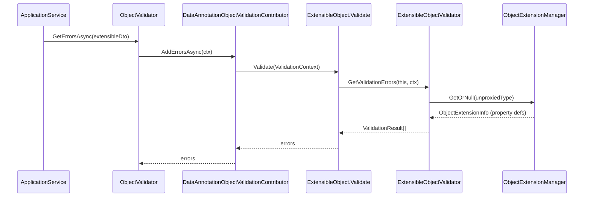

The ABP Framework's *object extending* system lets module consumers attach additional properties to types they do not own — most commonly DTOs and entities exported by reusable modules such as Identity or Tenant Management. The infrastructure ships in the `Volo.Abp.ObjectExtending` package and centres on three pieces: a singleton `ObjectExtensionManager` that holds the per-type property definitions, the `IHasExtraProperties` contract that gives objects a writable bag, and the `ExtensibleObjectValidator` that wires the definitions into the validation pipeline described in [Validation](/crosscutting/validation).

## Package overview

| File | Type | Role |
| --- | --- | --- |
| `Volo/Abp/ObjectExtending/AbpObjectExtendingModule.cs` | Module | Declares dependencies on the validation and localization abstractions. |
| `Volo/Abp/ObjectExtending/ObjectExtensionManager.cs` | Singleton | Stores `ObjectExtensionInfo` per CLR type. |
| `Volo/Abp/ObjectExtending/ObjectExtensionInfo.cs` | Container | Holds property and validator definitions for a single type. |
| `Volo/Abp/ObjectExtending/ObjectExtensionPropertyInfo.cs` | Property descriptor | Per-property metadata (type, attributes, validators, defaults, UI, policy). |
| `Volo/Abp/Data/IHasExtraProperties.cs` | Contract | Marks objects that carry an `ExtraPropertyDictionary`. |
| `Volo/Abp/Data/ExtraPropertyDictionary.cs` | Storage | `Dictionary<string, object?>` used as the runtime bag. |
| `Volo/Abp/ObjectExtending/ExtensibleObject.cs` | Base class | Convenience base that implements `IHasExtraProperties` and `IValidatableObject`. |
| `Volo/Abp/ObjectExtending/ExtensibleObjectValidator.cs` | Validator | Cross-cutting validator wired into both DataAnnotations and the validation pipeline. |

The module itself is empty apart from declaring dependencies that callers will need transitively:

```csharp
[DependsOn(
    typeof(AbpLocalizationAbstractionsModule),
    typeof(AbpValidationAbstractionsModule)
)]
public class AbpObjectExtendingModule : AbpModule { }
```

## The `IHasExtraProperties` contract

The contract is intentionally minimal:

```csharp
public interface IHasExtraProperties
{
    ExtraPropertyDictionary ExtraProperties { get; }
}
```

`ExtraPropertyDictionary` (in `Volo/Abp/Data/ExtraPropertyDictionary.cs`) is a `[Serializable] Dictionary<string, object?>` — nothing more. Because it is just a dictionary, it can be deserialized from JSON, persisted as JSON in EF Core via a value converter, or projected into MongoDB BSON without any custom plumbing.

`HasExtraPropertiesExtensions.cs` adds the ergonomic surface:

```csharp
public static bool HasProperty(this IHasExtraProperties source, string name);
public static object? GetProperty(this IHasExtraProperties source, string name, object? defaultValue = null);
public static TProperty? GetProperty<TProperty>(this IHasExtraProperties source, string name, TProperty? defaultValue = default);
public static TSource SetProperty<TSource>(this TSource source, string name, object? value, bool validate = true)
    where TSource : IHasExtraProperties;
public static TSource RemoveProperty<TSource>(this TSource source, string name)
    where TSource : IHasExtraProperties;
public static TSource SetDefaultsForExtraProperties<TSource>(this TSource source, Type? objectType = null)
    where TSource : IHasExtraProperties;
public static void SetExtraPropertiesToRegularProperties(this IHasExtraProperties source);
public static bool HasSameExtraProperties(this IHasExtraProperties source, IHasExtraProperties other);
```

Two of these methods cross the boundary into other subsystems:

* `SetProperty(name, value, validate: true)` calls `ExtensibleObjectValidator.CheckValue(source, name, value)`, which throws `AbpValidationException` if the extra property's registered validators reject the value. This makes `dto.SetProperty("Sku", "ABC")` behave like assigning to a real property with attribute validation.
* `SetDefaultsForExtraProperties` walks `ObjectExtensionManager.Instance.GetProperties(objectType)` and seeds the dictionary with each property's `GetDefaultValue()` so newly-created objects look like they have always had the extra members.

## `ExtensibleObject` base class

`ExtensibleObject.cs` is a small convenience base that combines all the bits:

```csharp
[Serializable]
public class ExtensibleObject : IHasExtraProperties, IValidatableObject
{
    public ExtraPropertyDictionary ExtraProperties { get; protected set; }

    public ExtensibleObject() : this(true) { }

    public ExtensibleObject(bool setDefaultsForExtraProperties)
    {
        ExtraProperties = new ExtraPropertyDictionary();
        if (setDefaultsForExtraProperties)
        {
            this.SetDefaultsForExtraProperties(ProxyHelper.UnProxy(this).GetType());
        }
    }

    public virtual IEnumerable<ValidationResult> Validate(ValidationContext validationContext)
    {
        return ExtensibleObjectValidator.GetValidationErrors(this, validationContext);
    }
}
```

Two things to call out:

1. The constructor uses `ProxyHelper.UnProxy(this).GetType()` so dynamic-proxy subclasses (created by the DI interceptor stack) still look up the *real* CLR type — otherwise the extension manager would never find the registration.
2. By implementing `IValidatableObject`, `ExtensibleObject` makes `DataAnnotationObjectValidationContributor` (see [Validation](/crosscutting/validation)) run `ExtensibleObjectValidator` automatically, without any extra contributor wiring. Every DTO that derives from `ExtensibleObject` therefore validates its extra properties for free.

## `ObjectExtensionManager`

The manager is a thread-safe singleton:

```csharp
public class ObjectExtensionManager
{
    public static ObjectExtensionManager Instance { get; protected set; } = new ObjectExtensionManager();
    public ConcurrentDictionary<object, object> Configuration { get; }
    protected ConcurrentDictionary<Type, ObjectExtensionInfo> ObjectsExtensions { get; }
    // …
}
```

The pivotal API is `AddOrUpdate`:

```csharp
public virtual ObjectExtensionManager AddOrUpdate<TObject>(
    Action<ObjectExtensionInfo>? configureAction = null);

public virtual ObjectExtensionManager AddOrUpdate(
    Type type, Action<ObjectExtensionInfo>? configureAction = null);

public virtual ObjectExtensionManager AddOrUpdate(
    Type[] types, Action<ObjectExtensionInfo>? configureAction = null);
```

The single-type overload uses `GetOrAdd` to create the `ObjectExtensionInfo`, then runs the configuration callback. The array overload is a thin loop:

```csharp
public virtual ObjectExtensionManager AddOrUpdate(
    [NotNull] Type type,
    Action<ObjectExtensionInfo>? configureAction = null)
{
    var extensionInfo = ObjectsExtensions.GetOrAdd(type, _ => new ObjectExtensionInfo(type));
    configureAction?.Invoke(extensionInfo);
    return this;
}
```

`ObjectExtensionManagerExtensions.cs` provides the fluent property-level shortcut that most code uses:

```csharp
public static ObjectExtensionManager AddOrUpdateProperty<TObject, TProperty>(
    this ObjectExtensionManager objectExtensionManager,
    string propertyName,
    Action<ObjectExtensionPropertyInfo>? configureAction = null)
    where TObject : IHasExtraProperties
{
    return objectExtensionManager.AddOrUpdateProperty(
        typeof(TObject), typeof(TProperty), propertyName, configureAction);
}
```

A typical module bootstrap looks like:

```csharp
ObjectExtensionManager.Instance
    .AddOrUpdate<IdentityUser>(user =>
    {
        user.AddOrUpdateProperty<string>("SocialSecurityNumber", prop =>
        {
            prop.Attributes.Add(new RequiredAttribute());
            prop.Attributes.Add(new StringLengthAttribute(11));
            prop.DefaultValue = string.Empty;
            prop.DisplayName = new LocalizableString(typeof(MyResource), "SSN");
        });
    });
```

Because the manager is a singleton, this registration is done once at startup (typically from a module's `ConfigureServices`) and shared across the entire process.

## `ObjectExtensionInfo`

`ObjectExtensionInfo.cs` is the per-type bag. It tracks properties in a `ConcurrentDictionary<string, ObjectExtensionPropertyInfo>` and keeps a list of object-level validators:

```csharp
public class ObjectExtensionInfo
{
    public Type Type { get; }
    protected ConcurrentDictionary<string, ObjectExtensionPropertyInfo> Properties { get; }
    public ConcurrentDictionary<object, object> Configuration { get; }
    public List<Action<ObjectExtensionValidationContext>> Validators { get; }

    public virtual ObjectExtensionInfo AddOrUpdateProperty(
        Type propertyType, string propertyName,
        Action<ObjectExtensionPropertyInfo>? configureAction = null)
    {
        var propertyInfo = Properties.GetOrAdd(
            propertyName,
            _ => new ObjectExtensionPropertyInfo(this, propertyType, propertyName));
        configureAction?.Invoke(propertyInfo);
        return this;
    }

    public virtual ImmutableList<ObjectExtensionPropertyInfo> GetProperties()
    {
        return Properties.OrderBy(t => t.Value.UI.Order)
                         .Select(t => t.Value)
                         .ToImmutableList();
    }
}
```

Properties are returned sorted by their UI order so generated forms and tables render them deterministically. The `Validators` list participates in `ExtensibleObjectValidator.ExecuteCustomObjectValidationActions` for cross-property checks that cannot be expressed as attributes.

## `ObjectExtensionPropertyInfo`

`ObjectExtensionPropertyInfo.cs` is the rich per-property descriptor — it is the single class that ties together validation, defaults, lookups, UI hints and policy checks:

```csharp
public class ObjectExtensionPropertyInfo : IHasNameWithLocalizableDisplayName, IBasicObjectExtensionPropertyInfo
{
    public ObjectExtensionInfo ObjectExtension { get; }
    public string Name { get; }
    public Type Type { get; }
    public List<Attribute> Attributes { get; }
    public List<Action<ObjectExtensionPropertyValidationContext>> Validators { get; }
    public ILocalizableString? DisplayName { get; set; }
    public bool? CheckPairDefinitionOnMapping { get; set; }
    public Dictionary<object, object> Configuration { get; }
    public object? DefaultValue { get; set; }
    public Func<object>? DefaultValueFactory { get; set; }
    public ExtensionPropertyLookupConfiguration Lookup { get; set; }
    public ExtensionPropertyUI UI { get; set; }
    public ExtensionPropertyPolicyConfiguration Policy { get; set; }
}
```

The most important members from a cross-cutting perspective are:

| Member | Used by |
| --- | --- |
| `Attributes` | Filtered to `ValidationAttribute` by `ExtensibleObjectValidator` (see below). |
| `Validators` | Custom delegates run per-property by `ExecuteCustomPropertyValidationActions`. |
| `DefaultValue` / `DefaultValueFactory` | Consumed by `GetDefaultValue()` and `SetDefaultsForExtraProperties`. |
| `DisplayName` | An `ILocalizableString`, see [Localization](/crosscutting/localization). |
| `Lookup` | Used by UI components to bind selects to remote endpoints. |
| `UI` | Drives create/edit modal visibility and ordering. |
| `Policy` | Hooks into `ExtensionPropertyPolicyChecker` for permission / feature / global-feature gating. |
| `CheckPairDefinitionOnMapping` | Controls whether `MapExtraPropertiesTo` allows the property to flow between paired DTOs (e.g. `GetUserOutput` ↔ `UpdateUserInput`). |

The constructor pre-populates `Attributes` from `ExtensionPropertyHelper.GetDefaultAttributes(Type)` (which adds `[Range]` for numeric types, etc.) and initialises `DefaultValue` via `TypeHelper.GetDefaultValue(Type)`.

## Validation of extra properties

`ExtensibleObjectValidator.cs` is the cross-cutting glue that runs *property-level* and *object-level* validators registered on the manager. The public entry points mirror DataAnnotations:

```csharp
public static void CheckValue(IHasExtraProperties extensibleObject,
                              string propertyName, object? value);
public static bool IsValid(IHasExtraProperties extensibleObject,
                           ValidationContext? objectValidationContext = null);
public static List<ValidationResult> GetValidationErrors(IHasExtraProperties extensibleObject,
                                                         ValidationContext? objectValidationContext = null);
public static void AddValidationErrors(IHasExtraProperties extensibleObject,
                                       List<ValidationResult> validationErrors,
                                       ValidationContext? objectValidationContext = null);
```

The `AddValidationErrors` overload is the single source of truth. It un-proxies the object, retrieves its `ObjectExtensionInfo`, and runs:

1. **`AddPropertyValidationErrors`** — iterates every defined property and combines attribute-driven and custom-delegate validation:

   ```csharp
   AddPropertyValidationAttributeErrors(extensibleObject, …, property, value);
   ExecuteCustomPropertyValidationActions(extensibleObject, …, property, value);
   ```

   Attribute validation reuses `property.GetValidationAttributes()` to filter the `Attributes` list down to `ValidationAttribute`s and runs each `attribute.GetValidationResult(value, propertyValidationContext)`. Errors carry the property name as the `MemberName` so downstream layers (MVC `ModelState`, problem-details payloads) can surface field-specific messages.

2. **`ExecuteCustomObjectValidationActions`** — runs the `Validators` collection on `ObjectExtensionInfo` for cross-property invariants such as "shipping date must be after order date".

The property-level overload (`AddValidationErrors(..., string propertyName, object? value, ...)`) is exactly what `SetProperty(..., validate: true)` delegates to, giving you immediate feedback when extra properties are set in code.

### Integration with the validation pipeline

The wider validation pipeline picks up `ExtensibleObjectValidator` through two routes:

1. **`IValidatableObject`** — `ExtensibleObject.Validate` calls it directly. Because `DataAnnotationObjectValidationContributor` calls `IValidatableObject.Validate` for any object that implements it, extra properties on any `ExtensibleObject`-derived DTO get validated alongside their normal properties.
2. **Explicit calls** — application services may call `dto.SetProperty("X", value)` which validates eagerly, or call `ExtensibleObjectValidator.GetValidationErrors(dto)` from a custom contributor.



## Mapping extra properties between objects

When an application service maps a `CreateUserInput` to a `UserDto`, you usually want the extra properties to flow with the mapping. `ExtensibleObjectMapper.cs` provides `MapExtraPropertiesTo`:

```csharp
public static void MapExtraPropertiesTo<TSource, TDestination>(
    TSource source, TDestination destination,
    MappingPropertyDefinitionChecks? definitionChecks = null,
    string[]? ignoredProperties = null)
    where TSource : IHasExtraProperties
    where TDestination : IHasExtraProperties
{
    var sourceObjectExtension = ObjectExtensionManager.Instance.GetOrNull(typeof(TSource));
    var destinationObjectExtension = ObjectExtensionManager.Instance.GetOrNull(typeof(TDestination));

    foreach (var keyValue in source.ExtraProperties)
    {
        if (CanMapProperty(keyValue.Key, sourceObjectExtension,
                           destinationObjectExtension, definitionChecks, ignoredProperties))
        {
            destination.SetProperty(keyValue.Key, keyValue.Value);
        }
    }
}
```

`MappingPropertyDefinitionChecks` (in `MappingPropertyDefinitionChecks.cs`) controls how strict the check is — *None*, *Source*, *Destination* or *Both*. Properties whose `CheckPairDefinitionOnMapping` is `true` participate even when the manager-wide policy is laxer. The same logic is reused by the AutoMapper integration (`.MapExtraProperties()`) so manually-written and auto-mapped projections behave identically.

## Configuration vs. modularity layers

Inside `Volo/Abp/ObjectExtending/Modularity/` lives a second tier of configuration types used by the [module-extension system](/modules/audit-logging) and by the module ApplicationContractsModule classes:

* `ModuleExtensionConfiguration` and `EntityExtensionConfiguration` describe extensions in a module-centric way.
* `ExtensionPropertyConfiguration` mirrors `ObjectExtensionPropertyInfo` but with API / UI / lookup sub-configurations that target DTOs and entities together.
* `ModuleExtensionConfigurationHelper` walks these definitions and applies them to the underlying `ObjectExtensionManager.Instance`.

You rarely interact with these directly — the typical entry point is `OneTimeRunner` calls in module `ConfigureServices` that build the module-extension graph from JSON-like fluent APIs. The runtime effect, however, is the same: `ObjectExtensionManager.Instance` ends up with the right `ObjectExtensionInfo`s and `ExtensibleObjectValidator` does the rest.

## Policy gating

`ObjectExtensionPropertyInfo.Policy` is an `ExtensionPropertyPolicyConfiguration` that can carry permission, feature and global-feature requirements. `ExtensionPropertyPolicyChecker.cs` is the singleton that evaluates them:

```csharp
public static Task<ImmutableList<ObjectExtensionPropertyInfo>> GetPropertiesAndCheckPolicyAsync<TObject>(
    this ObjectExtensionManager objectExtensionManager, IServiceProvider serviceProvider);
```

UI layers call this overload so that fields gated behind a missing feature or permission disappear from forms and tables, while server-side validation still enforces them when present.

## Putting it together

1. A module registers a property via `ObjectExtensionManager.Instance.AddOrUpdateProperty<TDto, string>("X", …)`.
2. The DTO inherits from `ExtensibleObject` (or implements `IHasExtraProperties`) so it carries an `ExtraPropertyDictionary`.
3. Clients populate the dictionary either through JSON deserialization or `dto.SetProperty("X", value)`.
4. When the DTO is validated — by an [application service](/ddd/application-services), by an MVC action filter, or by an explicit call — `ExtensibleObjectValidator` looks up the registration and runs the property's attribute and custom validators.
5. Mappers (AutoMapper or hand-written) copy the dictionary via `MapExtraPropertiesTo`, honouring per-property pair-definition rules.
6. Persistence (EF Core, MongoDB) serializes `ExtraProperties` as JSON without any extra ceremony, because the contract is just a `Dictionary<string, object?>`.

## See also

* [Validation Pipeline](/crosscutting/validation) — how `ExtensibleObjectValidator` plugs into `IObjectValidator`.
* [Fluent Validation](/crosscutting/fluent-validation) — combine FluentValidation rules with extra-property validators.
* [Application Services](/ddd/application-services) for DTO patterns that benefit from extending.
* [Localization](/crosscutting/localization) — `DisplayName` on extra properties is an `ILocalizableString`.
