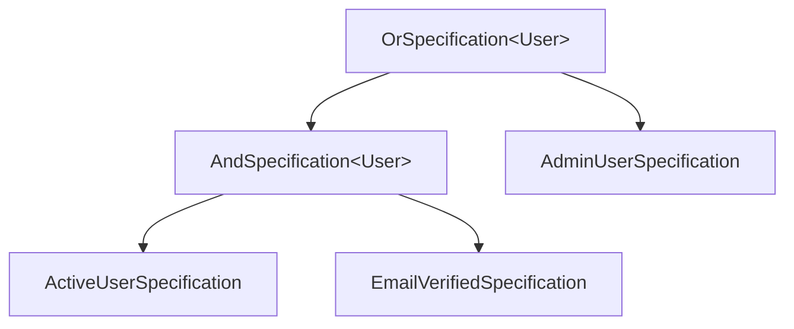

The ABP Framework provides a small but complete implementation of the *specification pattern* in the `Volo.Abp.Specifications` package. Specifications encapsulate predicate logic so it can be stored, named, composed and — crucially — translated into `Expression<Func<T, bool>>` trees that LINQ providers such as Entity Framework Core can convert into SQL. This page walks through every type in the package, the combinator helpers, and the expression-rebinding trick that lets two arbitrary expressions be `AND`/`OR`-combined safely.

## Package overview

The package only contains a module marker and a handful of expression-tree utilities, all under `framework/src/Volo.Abp.Specifications/Volo/Abp/Specifications/`:

| File | Type | Role |
| --- | --- | --- |
| `AbpSpecificationsModule.cs` | Module | Empty marker. |
| `ISpecification.cs` | Interface | The contract every specification implements. |
| `ICompositeSpecification.cs` | Interface | Extension for two-sided combinators. |
| `Specification.cs` | Abstract base | Default `IsSatisfiedBy` + implicit expression conversion. |
| `CompositeSpecification.cs` | Abstract base | Holds `Left` and `Right` sub-specifications. |
| `AndSpecification.cs` | Combinator | Logical AND. |
| `OrSpecification.cs` | Combinator | Logical OR. |
| `NotSpecification.cs` | Combinator | Logical NOT. |
| `AndNotSpecification.cs` | Combinator | `Left AND NOT Right`. |
| `AnySpecification.cs` | Constant | `x => true`. |
| `NoneSpecification.cs` | Constant | `x => false`. |
| `ExpressionSpecification.cs` | Adapter | Wraps a raw `Expression<Func<T, bool>>`. |
| `ExpressionFuncExtender.cs` | Utility | `And`/`Or` over two `Expression<Func<T, bool>>`. |
| `ParameterRebinder.cs` | Utility | Rebinds parameters when composing two lambdas. |
| `SpecificationExtensions.cs` | Extensions | Fluent `And`/`Or`/`Not`/`AndNot`. |
| `ISpecificationParser.cs` | Interface | Optional parser for string-based specifications. |

The module itself is intentionally empty — adding `typeof(AbpSpecificationsModule)` to a `[DependsOn]` chain just pulls the types into the build graph.

```csharp
public class AbpSpecificationsModule : AbpModule { }
```

## `ISpecification<T>` and `Specification<T>`

The contract is a direct translation of Martin Fowler's [specification pattern paper](http://martinfowler.com/apsupp/spec.pdf):

```csharp
public interface ISpecification<T>
{
    bool IsSatisfiedBy(T obj);
    Expression<Func<T, bool>> ToExpression();
}
```

The abstract base class `Specification<T>` implements `IsSatisfiedBy` by compiling the expression once per call. The interesting bit is the implicit conversion operator, which lets a specification flow into any API that accepts `Expression<Func<T, bool>>`:

```csharp
public abstract class Specification<T> : ISpecification<T>
{
    public virtual bool IsSatisfiedBy(T obj)
    {
        return ToExpression().Compile()(obj);
    }

    public abstract Expression<Func<T, bool>> ToExpression();

    public static implicit operator Expression<Func<T, bool>>(Specification<T> specification)
    {
        return specification.ToExpression();
    }
}
```

The implicit operator is the reason `repository.GetListAsync(mySpecification)` "just works": EF Core's `IQueryable<T>.Where(...)` overload takes an `Expression<Func<T, bool>>`, and the C# compiler silently converts your specification.

### Authoring a specification

Subclasses only need to override `ToExpression()`:

```csharp
public class ActiveUserSpecification : Specification<IdentityUser>
{
    public override Expression<Func<IdentityUser, bool>> ToExpression()
    {
        return user => user.IsActive && !user.LockoutEnabled;
    }
}
```

`IsSatisfiedBy` automatically returns `true` for any user that matches.

## Constant specifications

Two ready-made specifications cover the trivial cases:

```csharp
public sealed class AnySpecification<T> : Specification<T>
{
    public override Expression<Func<T, bool>> ToExpression() => o => true;
}

public sealed class NoneSpecification<T> : Specification<T>
{
    public override Expression<Func<T, bool>> ToExpression() => o => false;
}
```

`AnySpecification<T>` is useful as an "empty filter" — call sites that conditionally compose extra predicates can start from `Any` and `AndAlso` constraints into it. `NoneSpecification<T>` is the dual; both classes are sealed because there is no useful customization point.

## The composition story

The "real" combinators are built on top of `CompositeSpecification<T>`:

```csharp
public abstract class CompositeSpecification<T> : Specification<T>, ICompositeSpecification<T>
{
    protected CompositeSpecification(ISpecification<T> left, ISpecification<T> right)
    {
        Left = left;
        Right = right;
    }

    public ISpecification<T> Left { get; }
    public ISpecification<T> Right { get; }
}
```

Because `Left` and `Right` are public, an inspector can walk a composite specification tree to render diagnostics or build dynamic query DSLs.

### `AndSpecification<T>` / `OrSpecification<T>`

```csharp
public class AndSpecification<T> : CompositeSpecification<T>
{
    public AndSpecification(ISpecification<T> left, ISpecification<T> right) : base(left, right) { }
    public override Expression<Func<T, bool>> ToExpression()
    {
        return Left.ToExpression().And(Right.ToExpression());
    }
}

public class OrSpecification<T> : CompositeSpecification<T>
{
    public OrSpecification(ISpecification<T> left, ISpecification<T> right) : base(left, right) { }
    public override Expression<Func<T, bool>> ToExpression()
    {
        return Left.ToExpression().Or(Right.ToExpression());
    }
}
```

The `And` / `Or` extension methods come from `ExpressionFuncExtender.cs` and rely on `ParameterRebinder` to fix up parameter references — see "Parameter rebinding" below.

### `NotSpecification<T>` and `AndNotSpecification<T>`

`NotSpecification<T>` rewrites the body of the inner expression rather than wrapping it in a delegate. This keeps the resulting tree fully translatable by LINQ providers:

```csharp
public class NotSpecification<T> : Specification<T>
{
    private readonly ISpecification<T> _specification;

    public NotSpecification(ISpecification<T> specification)
    {
        _specification = specification;
    }

    public override Expression<Func<T, bool>> ToExpression()
    {
        var expression = _specification.ToExpression();
        return Expression.Lambda<Func<T, bool>>(
            Expression.Not(expression.Body),
            expression.Parameters);
    }
}
```

`AndNotSpecification<T>` composes `Left.And(!Right)` in one shot — useful when you would otherwise write `new AndSpecification(left, new NotSpecification(right))`:

```csharp
public override Expression<Func<T, bool>> ToExpression()
{
    var rightExpression = Right.ToExpression();
    var bodyNot = Expression.Not(rightExpression.Body);
    var bodyNotExpression = Expression.Lambda<Func<T, bool>>(bodyNot, rightExpression.Parameters);
    return Left.ToExpression().And(bodyNotExpression);
}
```

### `ExpressionSpecification<T>` adapter

If you already have an `Expression<Func<T, bool>>` (say, returned by some other query builder), wrap it in `ExpressionSpecification<T>` to participate in the composition story:

```csharp
public class ExpressionSpecification<T> : Specification<T>
{
    private readonly Expression<Func<T, bool>> _expression;

    public ExpressionSpecification(Expression<Func<T, bool>> expression)
    {
        _expression = expression;
    }

    public override Expression<Func<T, bool>> ToExpression() => _expression;
}
```

This makes it trivial to combine raw lambdas with named specifications:

```csharp
ISpecification<IdentityUser> spec =
    new ActiveUserSpecification()
        .And(new ExpressionSpecification<IdentityUser>(u => u.CreationTime > cutoff));
```

## Fluent extensions

`SpecificationExtensions.cs` exposes the conventional combinators as extension methods so you do not have to mention the implementation classes directly:

```csharp
public static class SpecificationExtensions
{
    public static ISpecification<T> And<T>(this ISpecification<T> specification,
                                           ISpecification<T> other);
    public static ISpecification<T> Or<T>(this ISpecification<T> specification,
                                          ISpecification<T> other);
    // …
}
```

(The full file also adds `Not` and `AndNot`.) Each method delegates to the corresponding combinator class. Because the extensions take `ISpecification<T>`, you can mix `ExpressionSpecification<T>` and custom specifications freely.

## Parameter rebinding

The trickiest part of composing two `Expression<Func<T, bool>>` instances is that the two lambdas each declare their own `ParameterExpression`. Naïvely joining them with `Expression.AndAlso(first.Body, second.Body)` produces a tree where the right-hand side still references `second`'s original parameter — which the LINQ provider sees as a free variable.

`ParameterRebinder` is an `ExpressionVisitor` that swaps parameters out as it walks the tree:

```csharp
internal class ParameterRebinder : ExpressionVisitor
{
    private readonly Dictionary<ParameterExpression, ParameterExpression> _map;

    internal ParameterRebinder(Dictionary<ParameterExpression, ParameterExpression> map)
    {
        _map = map ?? [];
    }

    internal static Expression ReplaceParameters(
        Dictionary<ParameterExpression, ParameterExpression> map, Expression exp)
    {
        return new ParameterRebinder(map).Visit(exp);
    }

    protected override Expression VisitParameter(ParameterExpression p)
    {
        if (_map.TryGetValue(p, out var replacement))
        {
            p = replacement;
        }
        return base.VisitParameter(p);
    }
}
```

`ExpressionFuncExtender.cs` uses it to build a parameter map between the two source lambdas and replace the right-hand side's parameters with the left-hand side's:

```csharp
private static Expression<T> Compose<T>(this Expression<T> first, Expression<T> second,
    Func<Expression, Expression, Expression> merge)
{
    var map = first.Parameters.Select((f, i) => new { f, s = second.Parameters[i] })
                              .ToDictionary(p => p.s, p => p.f);

    var secondBody = ParameterRebinder.ReplaceParameters(map, second.Body);

    return Expression.Lambda<T>(merge(first.Body, secondBody), first.Parameters);
}

public static Expression<Func<T, bool>> And<T>(this Expression<Func<T, bool>> first,
                                               Expression<Func<T, bool>> second)
{
    return first.Compose(second, Expression.AndAlso);
}

public static Expression<Func<T, bool>> Or<T>(this Expression<Func<T, bool>> first,
                                              Expression<Func<T, bool>> second)
{
    return first.Compose(second, Expression.OrElse);
}
```

The reference for this technique is Microsoft's old "Combining Predicates" blog post linked from the file's XML comment — the same trick is the basis of LINQKit's `PredicateBuilder`. Because the result still uses `first.Parameters`, EF Core sees a clean lambda with one parameter and can translate it directly to SQL.

## Tree shape

A composite specification is just an expression tree wrapped in a small object graph. The diagram below shows the runtime structure of `(activeSpec.And(emailVerifiedSpec)).Or(adminSpec)`:



Calling `Root.ToExpression()` performs the composition bottom-up: each leaf produces its own lambda, the AND combinator merges them with `Expression.AndAlso` and rebinds parameters, and the OR combinator does the same with `Expression.OrElse`. The final result is a single `Expression<Func<User, bool>>` with one parameter.

## Practical use

Specifications are typically used in three places.

### Repository queries

ABP repositories accept `ISpecification<T>` directly because of the implicit conversion to `Expression<Func<T, bool>>`. The result is type-safe SQL filtering with no string concatenation:

```csharp
public class UserAppService : ApplicationService
{
    private readonly IRepository<IdentityUser, Guid> _users;

    public async Task<List<IdentityUser>> GetActiveAdminsAsync()
    {
        var spec = new ActiveUserSpecification().And(new AdminSpecification());
        return await _users.GetListAsync(spec);
    }
}
```

### Domain invariants

In a DDD design (see [Application Services](/ddd/application-services)), domain services can express invariants as specifications and reuse them both for in-memory checks (`IsSatisfiedBy`) and for query filtering (`ToExpression`). This is the same code path that `IObjectValidator` in the [validation pipeline](/crosscutting/validation) follows when it wants a method-level guarantee.

### Authorisation/feature gating

A `RestrictedToPremiumTenantsSpecification` can be combined with another specification using `Or`/`AndNot` to dynamically build per-tenant filters, then handed off to a repository call that will produce SQL ending in `WHERE … AND (TenantId = @p OR IsPublic = 1)`.

## Composition reference

| Operation | Code | Resulting predicate |
| --- | --- | --- |
| And | `a.And(b)` | `x => a(x) && b(x)` |
| Or | `a.Or(b)` | `x => a(x) || b(x)` |
| Not | `new NotSpecification<T>(a)` | `x => !a(x)` |
| And-Not | `new AndNotSpecification<T>(a, b)` | `x => a(x) && !b(x)` |
| Any | `new AnySpecification<T>()` | `x => true` |
| None | `new NoneSpecification<T>()` | `x => false` |
| Adapter | `new ExpressionSpecification<T>(expr)` | wraps existing lambda |

## Specification parsing

`ISpecificationParser.cs` declares an optional contract for code that needs to deserialize a specification from text (e.g. a saved filter from the database):

```csharp
public interface ISpecificationParser
{
    // implementation-defined
}
```

The package itself does not ship a default parser — the interface exists so that downstream modules can plug a domain-specific language (such as a JSON tree or an OData expression) into the same pipeline.

## See also

* [Application Services](/ddd/application-services) — application services compose repository calls with specifications.
* [Validation Pipeline](/crosscutting/validation) — combine `IsSatisfiedBy` checks with `IValidatableObject` for cross-property invariants.
* [Object Extending](/crosscutting/object-extending) — extension properties can become parameters of dynamic specifications.
