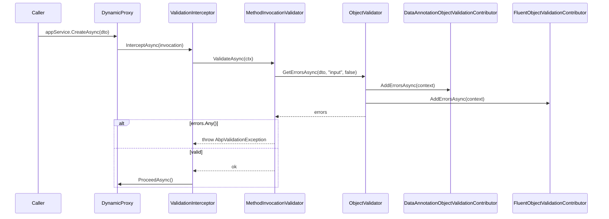

The ABP Framework ships a pluggable validation pipeline that sits between the dependency-injection container, the dynamic-proxy interceptor stack and ASP.NET Core MVC. This page covers the core abstractions in the `Volo.Abp.Validation` and `Volo.Abp.Validation.Abstractions` packages, how the `ValidationInterceptor` is automatically attached to services that opt in via `IValidationEnabled`, how contributors such as `DataAnnotationObjectValidationContributor` produce `ValidationResult`s, and how `AbpValidationActionFilter` reuses the same pipeline for MVC controllers.

## Package layout

The validation feature is split into a thin abstractions package and a runtime package. `Volo.Abp.Validation.Abstractions` only contains the exception, helper utilities and the `IHasValidationErrors` contract, so consumers can throw `AbpValidationException` without dragging in DI or interceptor machinery. `Volo.Abp.Validation` adds `IObjectValidator`, contributors, the `MethodInvocationValidator` and the `ValidationInterceptor` infrastructure.

| Package | Path | Key types |
| --- | --- | --- |
| Abstractions | `framework/src/Volo.Abp.Validation.Abstractions/Volo/Abp/Validation/` | `AbpValidationException`, `IHasValidationErrors`, `ValidationHelper` |
| Runtime | `framework/src/Volo.Abp.Validation/Volo/Abp/Validation/` | `IObjectValidator`, `ObjectValidator`, `AbpValidationOptions`, `ValidationInterceptor` |
| MVC integration | `framework/src/Volo.Abp.AspNetCore.Mvc/Volo/Abp/AspNetCore/Mvc/Validation/` | `AbpValidationActionFilter`, `IModelStateValidator` |

## The `IObjectValidator` contract

The public façade of the pipeline is `IObjectValidator`, defined in `framework/src/Volo.Abp.Validation/Volo/Abp/Validation/IObjectValidator.cs`. It exposes two awaitable methods: `ValidateAsync`, which throws `AbpValidationException` if any error is found, and `GetErrorsAsync`, which simply returns the list of `System.ComponentModel.DataAnnotations.ValidationResult` entries gathered from all registered contributors.

```csharp
public interface IObjectValidator
{
    Task ValidateAsync(
        object? validatingObject,
        string? name = null,
        bool allowNull = false
    );

    Task<List<ValidationResult>> GetErrorsAsync(
        object? validatingObject,
        string? name = null,
        bool allowNull = false
    );
}
```

The default implementation lives in `ObjectValidator.cs` (same folder). It is registered as `ITransientDependency` and resolves all `IObjectValidationContributor` types that were collected into `AbpValidationOptions.ObjectValidationContributors`. The contributor types are looked up from the service provider through a child `IServiceScope`, which lets contributors freely consume scoped services such as the current `ICurrentTenant` or `IStringLocalizer`.

```csharp
public virtual async Task<List<ValidationResult>> GetErrorsAsync(
    object? validatingObject, string? name = null, bool allowNull = false)
{
    if (validatingObject == null)
    {
        if (allowNull) return new List<ValidationResult>();
        return new List<ValidationResult>
        {
            name == null
                ? new ValidationResult("Given object is null!")
                : new ValidationResult(name + " is null!", new[] { name })
        };
    }

    var context = new ObjectValidationContext(validatingObject);
    using (var scope = ServiceScopeFactory.CreateScope())
    {
        foreach (var contributorType in Options.ObjectValidationContributors)
        {
            var contributor = (IObjectValidationContributor)
                scope.ServiceProvider.GetRequiredService(contributorType);
            await contributor.AddErrorsAsync(context);
        }
    }
    return context.Errors;
}
```

`ObjectValidationContext` (`Volo/Abp/Validation/ObjectValidationContext.cs`) is the small mutable bag that contributors share — it carries the object being validated and the running list of `ValidationResult`s.

## Contributor pattern

The contributor abstraction lives in `IObjectValidationContributor.cs`. Each contributor implements one method, `Task AddErrorsAsync(ObjectValidationContext context)`, and can append errors freely. Contributors are auto-discovered by `AbpValidationModule.AutoAddObjectValidationContributors`, which hooks into `IServiceCollection.OnRegistered` and pushes every implementer into `AbpValidationOptions.ObjectValidationContributors`.

```csharp
private static void AutoAddObjectValidationContributors(IServiceCollection services)
{
    var contributorTypes = new List<Type>();

    services.OnRegistered(context =>
    {
        if (typeof(IObjectValidationContributor).IsAssignableFrom(context.ImplementationType))
        {
            contributorTypes.Add(context.ImplementationType);
        }
    });

    services.Configure<AbpValidationOptions>(options =>
    {
        options.ObjectValidationContributors.AddIfNotContains(contributorTypes);
    });
}
```

Because of this convention you only need to mark a class with `ITransientDependency` (or one of the other lifetime markers) and implement `IObjectValidationContributor` — `AbpValidationModule` does the wiring. The shipped contributors are summarised below.

| Contributor | File | What it does |
| --- | --- | --- |
| `DataAnnotationObjectValidationContributor` | `Volo/Abp/Validation/DataAnnotationObjectValidationContributor.cs` | Runs DataAnnotations attributes and `IValidatableObject.Validate` recursively. |
| `FluentObjectValidationContributor` | `framework/src/Volo.Abp.FluentValidation/Volo/Abp/FluentValidation/FluentObjectValidationContributor.cs` | Resolves an `IValidator<T>` for the object's runtime type (see [Fluent Validation](/crosscutting/fluent-validation)). |

### DataAnnotations contributor

`DataAnnotationObjectValidationContributor` walks the object graph up to `MaxRecursiveParameterValidationDepth = 8` levels deep. For each level it:

1. Calls `AddErrors`, which iterates `TypeDescriptor.GetProperties` and forwards `ValidationAttribute`s to `IAttributeValidationResultProvider`.
2. Detects `IValidatableObject` implementations and invokes `Validate`, passing a `ValidationContext` populated with the current `IServiceProvider`.
3. Recurses into enumerable properties (excluding `IQueryable` so it never enumerates database queries) and into non-primitive sub-objects.

```csharp
public Task AddErrorsAsync(ObjectValidationContext context)
{
    ValidateObjectRecursively(context.Errors, context.ValidatingObject, currentDepth: 1);
    return Task.CompletedTask;
}
```

Recursion is short-circuited by `TypeHelper.IsPrimitiveExtended` and by `AbpValidationOptions.IgnoredTypes` — types added here are skipped completely. Properties decorated with `[DisableValidation]` (defined in `Volo/Abp/Validation/DisableValidationAttribute.cs`) are not recursed into either.

### Pluggable attribute validation result provider

To support overriding the error messages produced by DataAnnotations, the contributor delegates to `IAttributeValidationResultProvider`. The default provider, `DefaultAttributeValidationResultProvider.cs`, simply calls `attribute.GetValidationResult(value, context)`. The ASP.NET Core MVC integration replaces it with `AbpMvcAttributeValidationResultProvider` so that messages are localized through `IStringLocalizerFactory`.

## Throwing `AbpValidationException`

When `IObjectValidator.ValidateAsync` finds any errors, it constructs an `AbpValidationException` (in `Volo.Abp.Validation.Abstractions`). The exception type implements `IHasLogLevel`, `IHasValidationErrors` and `IExceptionWithSelfLogging`, so the [exception handling](/core/exception-handling) middleware can route it to a 400 response with localized field-level messages.

```csharp
public class AbpValidationException : AbpException,
    IHasLogLevel, IHasValidationErrors, IExceptionWithSelfLogging
{
    public IList<ValidationResult> ValidationErrors { get; }
    public LogLevel LogLevel { get; set; } = LogLevel.Warning;

    public AbpValidationException(string message, IList<ValidationResult> validationErrors)
        : base(message)
    {
        ValidationErrors = validationErrors;
    }
    // …
}
```

The `Log(ILogger logger)` implementation pretty-prints each validation error with its member names. Because the default level is `Warning`, validation failures do not pollute error logs.

## Method-call validation

For DI-resolved services, validation is enforced by intercepting method calls. The interceptor itself, `ValidationInterceptor.cs`, is short:

```csharp
public class ValidationInterceptor : AbpInterceptor, ITransientDependency
{
    private readonly IMethodInvocationValidator _methodInvocationValidator;

    public override async Task InterceptAsync(IAbpMethodInvocation invocation)
    {
        await ValidateAsync(invocation);
        await invocation.ProceedAsync();
    }

    protected virtual async Task ValidateAsync(IAbpMethodInvocation invocation)
    {
        await _methodInvocationValidator.ValidateAsync(
            new MethodInvocationValidationContext(
                invocation.TargetObject,
                invocation.Method,
                invocation.Arguments
            )
        );
    }
}
```

The actual checks live in `MethodInvocationValidator.cs`, which skips non-public methods, honours `[DisableValidation]` / `[EnableValidation]`, ensures parameter counts match argument counts and finally delegates each parameter to `IObjectValidator.GetErrorsAsync` with `allowNull` computed from `ParameterInfo.IsOptional`, `IsOut`, `TypeHelper.IsNullable` and `TypeHelper.IsPrimitiveExtended`.

```csharp
protected virtual async Task AddMethodParameterValidationErrorsAsync(
    IAbpValidationResult context, ParameterInfo parameterInfo, object? parameterValue)
{
    var allowNulls = parameterInfo.IsOptional ||
                     parameterInfo.IsOut ||
                     TypeHelper.IsNullable(parameterInfo.ParameterType) ||
                     TypeHelper.IsPrimitiveExtended(parameterInfo.ParameterType, includeEnums: true);

    context.Errors.AddRange(
        await _objectValidator.GetErrorsAsync(parameterValue, parameterInfo.Name, allowNulls));
}
```

### Opting in via `IValidationEnabled`

The interceptor is not attached to every service — only to classes that implement the marker `IValidationEnabled` (defined in `Volo/Abp/Validation/IValidationEnabled.cs`). The wiring happens in `ValidationInterceptorRegistrar.cs`:

```csharp
public static void RegisterIfNeeded(IOnServiceRegistredContext context)
{
    if (ShouldIntercept(context.ImplementationType))
    {
        context.Interceptors.TryAdd<ValidationInterceptor>();
    }
}

private static bool ShouldIntercept(Type type)
{
    return !DynamicProxyIgnoreTypes.Contains(type)
           && typeof(IValidationEnabled).IsAssignableFrom(type);
}
```

This callback is hooked from `AbpValidationModule.PreConfigureServices`:

```csharp
context.Services.OnRegistered(ValidationInterceptorRegistrar.RegisterIfNeeded);
```

Application services already implement `IValidationEnabled` through `ApplicationService` (see [Application Services](/ddd/application-services)), so any DTO passed to an `appService.CreateAsync(dto)` call is validated for free without registering anything extra.

### Disable/Enable attributes

`DisableValidationAttribute` and `EnableValidationAttribute` are defined next to the interceptor. They can be placed on a method, a class or even a property. `MethodInvocationValidator.IsValidationDisabled` resolves them via `ReflectionHelper.GetSingleAttributeOfMemberOrDeclaringTypeOrDefault`, with `EnableValidation` winning over a class-level `DisableValidation` so you can selectively re-enable methods on an otherwise-disabled class.

## End-to-end flow



## MVC integration

The same `IObjectValidator` and `IMethodInvocationValidator` services are reused by ASP.NET Core MVC. `AbpValidationActionFilter.cs` (in `framework/src/Volo.Abp.AspNetCore.Mvc/Volo/Abp/AspNetCore/Mvc/Validation/`) is a global `IAsyncActionFilter`. Before the action executes, it:

1. Skips non-controller actions, actions that do not produce an `ObjectResult`, and cases where `AbpAspNetCoreMvcOptions.AutoModelValidation` is off.
2. Honours `[DisableValidation]` at controller, action, or effective-method level (the *effective method* allows derived overrides to be inspected as well).
3. Calls `IModelStateValidator.Validate(context.ModelState)`, which throws `AbpValidationException` if the model binder already collected errors.
4. When the controller implements `IValidationEnabled`, materialises a `MethodInvocationValidationContext` and runs the full `IMethodInvocationValidator` pipeline against the action arguments — so DataAnnotations and FluentValidation are applied even when the binder produced no errors.

```csharp
context.GetRequiredService<IModelStateValidator>().Validate(context.ModelState);

if (context.Controller is IValidationEnabled)
{
    await ValidateActionArgumentsAsync(context, effectiveMethod);
}
```

`ModelStateValidator.cs` adapts the `ModelStateDictionary` errors into `AbpValidationResult.Errors`, preserving the field name through `new ValidationResult(error.ErrorMessage, new[] { state.Key })`. The resulting exception is then translated to a structured HTTP problem details response by [exception handling](/core/exception-handling).

## Options surface

`AbpValidationOptions.cs` is intentionally tiny but two lists matter:

```csharp
public class AbpValidationOptions
{
    public List<Type> IgnoredTypes { get; }
    public ITypeList<IObjectValidationContributor> ObjectValidationContributors { get; set; }
}
```

* `IgnoredTypes` is consulted by `DataAnnotationObjectValidationContributor` to skip whole branches of the object graph — typical entries are infrastructural types you never want to recurse into.
* `ObjectValidationContributors` is the ordered list executed by `ObjectValidator.GetErrorsAsync`. You can append your own contributor type before `Configure<AbpValidationOptions>` returns.

Configure it from a module like this:

```csharp
public override void ConfigureServices(ServiceConfigurationContext context)
{
    Configure<AbpValidationOptions>(options =>
    {
        options.IgnoredTypes.Add(typeof(MyFrameworkType));
        options.ObjectValidationContributors.Add<MyCustomContributor>();
    });
}
```

## Helpers and built-in validators

`ValidationHelper.cs` in the Abstractions package ships a single helper used widely by the codebase:

```csharp
public class ValidationHelper
{
    public static string EmailRegEx { get; set; } =
        @"^[a-zA-Z0-9.!#$%&'*+\/=?^_`{|}~-]+@[a-zA-Z0-9](?:[a-zA-Z0-9-]{0,61}[a-zA-Z0-9])?(?:\.[a-zA-Z0-9](?:[a-zA-Z0-9-]{0,61}[a-zA-Z0-9])?)*$";

    public static bool IsValidEmailAddress(string email) { … }
}
```

In addition, `Volo.Abp.Validation/Volo/Abp/Validation/StringValues/` provides typed value validators used by Settings/Features:

| Validator | File | Use case |
| --- | --- | --- |
| `StringValueValidator` | `StringValueValidator.cs` | Validates against an `IStringValueType` (numeric, boolean, selection, toggle…). |
| `NumericValueValidator` | `NumericValueValidator.cs` | Integer/decimal validation with min/max. |
| `BooleanValueValidator` | `BooleanValueValidator.cs` | Coerces a string into a boolean. |
| `AlwaysValidValueValidator` | `AlwaysValidValueValidator.cs` | Marker validator that never fails. |

These string-value validators are the building blocks behind localized settings and feature definitions, and reuse the rest of the validation infrastructure through `ValueValidatorAttribute`.

## Module dependencies

`AbpValidationModule` depends on `AbpValidationAbstractionsModule` and `AbpLocalizationModule`, and registers its localization resource so validation messages are localizable:

```csharp
[DependsOn(typeof(AbpValidationAbstractionsModule), typeof(AbpLocalizationModule))]
public class AbpValidationModule : AbpModule
{
    public override void ConfigureServices(ServiceConfigurationContext context)
    {
        Configure<AbpVirtualFileSystemOptions>(options =>
            options.FileSets.AddEmbedded<AbpValidationResource>());

        Configure<AbpLocalizationOptions>(options =>
            options.Resources
                .Add<AbpValidationResource>("en")
                .AddVirtualJson("/Volo/Abp/Validation/Localization"));
    }
}
```

The `AbpValidationResource` is the localization resource used by attribute messages — see [Localization](/crosscutting/localization) for how `LocalizationResource` and contributors are wired.

## See also

* [Fluent Validation integration](/crosscutting/fluent-validation) for plugging FluentValidation rules into the same pipeline.
* [Application Services](/ddd/application-services) — explains how `ApplicationService` implements `IValidationEnabled` to get free DTO validation.
* [Exception Handling](/core/exception-handling) for how `AbpValidationException` is translated to HTTP responses.
* [Object Extending](/crosscutting/object-extending) for validating extra properties on extensible DTOs.
