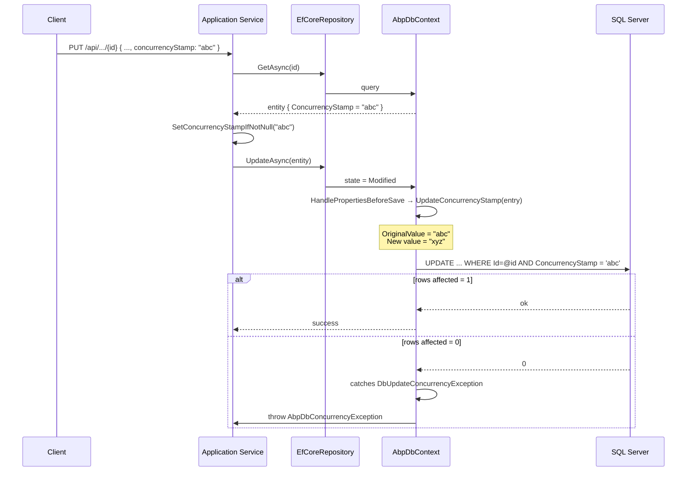

ABP's optimistic concurrency story is rooted in one marker interface — `IHasConcurrencyStamp` — and three lifecycle hooks on `AbpDbContext` that read it on insert, update and delete. There is no separate "version" column scheme and no `[Timestamp]` attribute; ABP carries a `string ConcurrencyStamp` that EF Core treats as a `ConcurrencyToken` via the convention configurer. This page covers the marker, the helper extensions, where the stamp is mutated, and how `AbpDbConcurrencyException` surfaces conflicts.

## The marker

`framework/src/Volo.Abp.Data/Volo/Abp/Domain/Entities/IHasConcurrencyStamp.cs` is the entire interface:

```csharp
namespace Volo.Abp.Domain.Entities;

public interface IHasConcurrencyStamp
{
    string ConcurrencyStamp { get; set; }
}
```

The marker lives under the `Volo.Abp.Domain.Entities` namespace because it is an *entity* concern — but it ships from `Volo.Abp.Data` rather than from `Volo.Abp.Ddd.Domain` so that even non‑DDD callers (e.g. a Dapper repository updating a row) can use the same convention.

Aggregate roots in ABP's DDD package implement it by default. `AggregateRoot<TKey>` (in `Volo.Abp.Ddd.Domain/Volo/Abp/Domain/Entities/AggregateRoot.cs`) carries `ConcurrencyStamp` as an automatically‑initialised property.

## The helper

`framework/src/Volo.Abp.Data/Volo/Abp/Data/ConcurrencyStampExtensions.cs` adds one tiny convenience:

```csharp
public static class ConcurrencyStampExtensions
{
    public static void SetConcurrencyStampIfNotNull(this IHasConcurrencyStamp entity, string? concurrencyStamp)
    {
        if (!concurrencyStamp.IsNullOrEmpty())
        {
            entity.ConcurrencyStamp = concurrencyStamp!;
        }
    }
}
```

Application services use it when mapping a DTO onto a tracked entity — the client sends back the stamp it received, and the service writes it onto the entity to enable EF Core's conflict check on `SaveChangesAsync`.

```csharp
var entity = await _repo.GetAsync(input.Id);
entity.SetConcurrencyStampIfNotNull(input.ConcurrencyStamp);
ObjectMapper.Map(input, entity);
await _repo.UpdateAsync(entity);
```

The `IfNotNull` half is critical — if you set `null`, EF Core treats `null` as the "expected original value", which never matches a row that was stored with a non‑null stamp, and every save would throw.

## The AbpDbContext hooks

`framework/src/Volo.Abp.EntityFrameworkCore/Volo/Abp/EntityFrameworkCore/AbpDbContext.cs` is where the magic happens. Three methods touch the stamp.

### On insert

`ApplyAbpConceptsForAddedEntity` calls `SetConcurrencyStampIfNull`:

```csharp
protected virtual void ApplyAbpConceptsForAddedEntity(EntityEntry entry)
{
    CheckAndSetId(entry);
    SetConcurrencyStampIfNull(entry);
    SetCreationAuditProperties(entry);
}

protected virtual void SetConcurrencyStampIfNull(EntityEntry entry)
{
    var entity = entry.Entity as IHasConcurrencyStamp;
    if (entity == null) return;

    if (entity.ConcurrencyStamp != null) return;

    entity.ConcurrencyStamp = Guid.NewGuid().ToString("N");
}
```

The check is *if null* — if the entity already carries a stamp from the constructor, ABP leaves it alone. Otherwise, the stamp is a 32‑character hex `Guid.NewGuid().ToString("N")`.

### On update

`UpdateConcurrencyStamp` is the method that **rotates** the stamp on every update. It is called from `HandlePropertiesBeforeSave` for every entity entry whose state is `Modified`.

```csharp
protected virtual void UpdateConcurrencyStamp(EntityEntry entry)
{
    var entity = entry.Entity as IHasConcurrencyStamp;
    if (entity == null) return;

    Entry(entity).Property(x => x.ConcurrencyStamp).OriginalValue = entity.ConcurrencyStamp;
    entity.ConcurrencyStamp = Guid.NewGuid().ToString("N");
}
```

The two‑line sequence is the heart of the optimistic check:

1. **Save the *current* value** as `OriginalValue`. EF Core will use this as the WHERE clause predicate (`WHERE [Id] = @id AND [ConcurrencyStamp] = @origStamp`).
2. **Generate a new value**. The new stamp is what the database will store, and what the client will receive on the next read.

A concurrent transaction that updated the row in between has already changed the stamp, so the WHERE predicate fails to match and EF Core reports zero rows affected.

### On soft delete

`ApplyAbpConceptsForDeletedEntity` carries the stamp through a soft delete. The entity is reloaded from the database (to overwrite client mutations), but the original stamp is preserved so that EF Core still issues the `IsDeleted = true` UPDATE with the correct WHERE:

```csharp
protected virtual void ApplyAbpConceptsForDeletedEntity(EntityEntry entry)
{
    if (!(entry.Entity is ISoftDelete)) return;
    if (IsHardDeleted(entry)) return;

    string? concurrencyStamp = null;
    if (entry.Entity is IHasConcurrencyStamp hasConcurrencyStamp)
    {
        concurrencyStamp = hasConcurrencyStamp.ConcurrencyStamp;
    }

    // ... (ExtraProperties handling) ...

    entry.Reload();

    if (concurrencyStamp != null && entry.Entity is IHasConcurrencyStamp)
    {
        ObjectHelper.TrySetProperty(entry.Entity.As<IHasConcurrencyStamp>(), x => x.ConcurrencyStamp, () => concurrencyStamp);
    }

    // ... apply IsDeleted ...
}
```

The `entry.Reload()` step is there because soft‑deletion turns a `Remove` into an `Update`, and EF Core would otherwise pick up the *original* values from the change tracker (which include any unsaved property mutations).

## Mapping the stamp to a `ConcurrencyToken`

ABP's `ConfigureByConvention` extension (`Volo.Abp.Ddd.Domain/Volo/Abp/Domain/Entities/EntityHelper.cs` and related EF Core extensions) configures `ConcurrencyStamp` as a `ConcurrencyToken`. The generated SQL for `UPDATE` becomes:

```sql
UPDATE [dbo].[MyEntity]
SET [Name] = @p0,
    [ConcurrencyStamp] = @p1   -- new stamp
WHERE [Id] = @p2
  AND [ConcurrencyStamp] = @p3 -- original stamp (OriginalValue)
```

If `@p3` does not match the stored stamp, the row count is `0` and EF Core raises `DbUpdateConcurrencyException`.

## Surfacing the conflict

`AbpDbContext.SaveChangesAsync` catches the EF Core exception and re‑throws as `AbpDbConcurrencyException`:

```csharp
catch (DbUpdateConcurrencyException ex)
{
    if (ex.Entries.Count > 0)
    {
        var sb = new StringBuilder();
        sb.AppendLine(ex.Entries.Count > 1
            ? "There are some entries which are not saved due to concurrency exception:"
            : "There is an entry which is not saved due to concurrency exception:");
        foreach (var entry in ex.Entries)
        {
            sb.AppendLine(entry.ToString());
        }
        Logger.LogWarning(sb.ToString());
    }
    throw new AbpDbConcurrencyException(ex.Message, ex);
}
```

`Volo/Abp/Data/AbpDbConcurrencyException.cs` is a thin `AbpException` subclass with the standard three constructors:

```csharp
public class AbpDbConcurrencyException : AbpException
{
    public AbpDbConcurrencyException() { }
    public AbpDbConcurrencyException(string message) : base(message) { }
    public AbpDbConcurrencyException(string message, Exception innerException) : base(message, innerException) { }
}
```

The exception is what application service callers should catch (or what the ASP.NET Core exception filter translates into a 409 by registering a mapping).

## End‑to‑end sequence



## What if the entity does not implement `IHasConcurrencyStamp`?

`SetConcurrencyStampIfNull` and `UpdateConcurrencyStamp` short‑circuit on `entity == null`. The conditional pattern means non‑concurrency‑checked entities incur zero extra cost. There is no global flag — you opt in per entity by implementing the interface (typically through `AggregateRoot<TKey>`).

## Behaviour matrix

| Entity implements | On insert | On update | On soft delete | On hard delete |
| --- | --- | --- | --- | --- |
| Neither concurrency nor soft delete | nothing | nothing | n/a | normal `DELETE` |
| `IHasConcurrencyStamp` only | sets stamp if `null` | rotates and uses original as WHERE | n/a | `DELETE ... WHERE ConcurrencyStamp = orig` |
| `ISoftDelete` only | nothing | normal update | reload + set `IsDeleted = true` | normal `DELETE` (hard‑delete) |
| Both | sets stamp if `null` | rotates and uses original | reload, preserve stamp, `IsDeleted = true ... WHERE ConcurrencyStamp = orig` | `DELETE ... WHERE ConcurrencyStamp = orig` |

## Manual override patterns

<AccordionGroup>
  <Accordion title="Bypass on a single update">
    Pass the *current* stamp as the original value before saving:

    ```csharp
    Context.Entry(entity).Property(x => x.ConcurrencyStamp).OriginalValue = entity.ConcurrencyStamp;
    await Context.SaveChangesAsync();
    ```

    EF Core then queries with the *current* stamp on both sides of the WHERE, which always matches. Use sparingly — usually only in admin tools.
  </Accordion>
  <Accordion title="Skip the rotation for system updates">
    Override `UpdateConcurrencyStamp` in a derived DbContext to skip rotation when `entry.Entity` belongs to a system‑updated type. This preserves the existing stamp so subsequent user updates still benefit from the check.
  </Accordion>
  <Accordion title="Cross-provider use">
    MongoDB does not have a built‑in concurrency token. `MongoDbRepository.UpdateAsync` issues `ReplaceOneAsync` with a filter that includes `ConcurrencyStamp == oldValue` when the entity implements `IHasConcurrencyStamp`. The result `ModifiedCount` is checked — zero raises `AbpDbConcurrencyException`. Same exception type, same client behaviour.
  </Accordion>
</AccordionGroup>

## Where stamp logic appears

| Caller | File | Line region | What it does |
| --- | --- | --- | --- |
| `SetConcurrencyStampIfNull` | `AbpDbContext.cs` | ~779 | Initialises stamp on insert. |
| `UpdateConcurrencyStamp` | `AbpDbContext.cs` | ~767 | Rotates on update and copies original to `EntityEntry.OriginalValue`. |
| `ApplyAbpConceptsForAddedEntity` | `AbpDbContext.cs` | ~694 | Calls `SetConcurrencyStampIfNull`. |
| `ApplyAbpConceptsForDeletedEntity` | `AbpDbContext.cs` | ~716 | Preserves stamp across soft‑delete reload. |
| `SaveChangesAsync` catch | `AbpDbContext.cs` | ~250 | Wraps `DbUpdateConcurrencyException` in `AbpDbConcurrencyException`. |
| `SetConcurrencyStampIfNotNull` | `ConcurrencyStampExtensions.cs` | full file | Helper for application services. |

## Diagnostics

When a conflict occurs the EF Core logger emits a warning with each conflicting entity entry. The relevant snippet in `AbpDbContext.SaveChangesAsync`:

```csharp
var sb = new StringBuilder();
sb.AppendLine(ex.Entries.Count > 1
    ? "There are some entries which are not saved due to concurrency exception:"
    : "There is an entry which is not saved due to concurrency exception:");
foreach (var entry in ex.Entries)
{
    sb.AppendLine(entry.ToString());
}
Logger.LogWarning(sb.ToString());
```

Filtering log scope `Microsoft.EntityFrameworkCore` at `Warning` is enough to surface the message in production.

## Pitfalls

<Warning>
The stamp is checked **per entity per save**, not per request. If your application service touches multiple aggregate roots and one of them throws `AbpDbConcurrencyException`, the surrounding UoW raises `Failed` and rolls back every change. The client must retry with the *new* stamps obtained from a refresh — there is no automatic merge.
</Warning>

<Warning>
Do not allocate a stamp manually with `Guid.NewGuid().ToString()` (with hyphens). ABP uses the `"N"` format consistently; mixing formats means the EF Core comparison still works, but stamps are not interchangeable across code paths that compare strings rather than parse them.
</Warning>

<Warning>
`AggregateRoot.SetConcurrencyStamp` is not a public method. The framework expects callers to use `SetConcurrencyStampIfNotNull` or to write directly to `entity.ConcurrencyStamp = ...` inside the domain layer.
</Warning>

## Related reading

<CardGroup cols={2}>
  <Card title="EF Core integration" href="/data/entity-framework-core">
    Where `ApplyAbpConcepts` and `HandlePropertiesBeforeSave` are wired into the save pipeline.
  </Card>
  <Card title="Aggregates" href="/ddd/entities-and-aggregates">
    `AggregateRoot<TKey>` implements `IHasConcurrencyStamp` by default.
  </Card>
  <Card title="Unit of work" href="/data/unit-of-work">
    A failed concurrency check raises `Failed` and rolls back the entire UoW.
  </Card>
  <Card title="MongoDB" href="/data/mongodb-integration">
    How `MongoDbRepository.UpdateAsync` mirrors the same `IHasConcurrencyStamp` contract.
  </Card>
</CardGroup>
