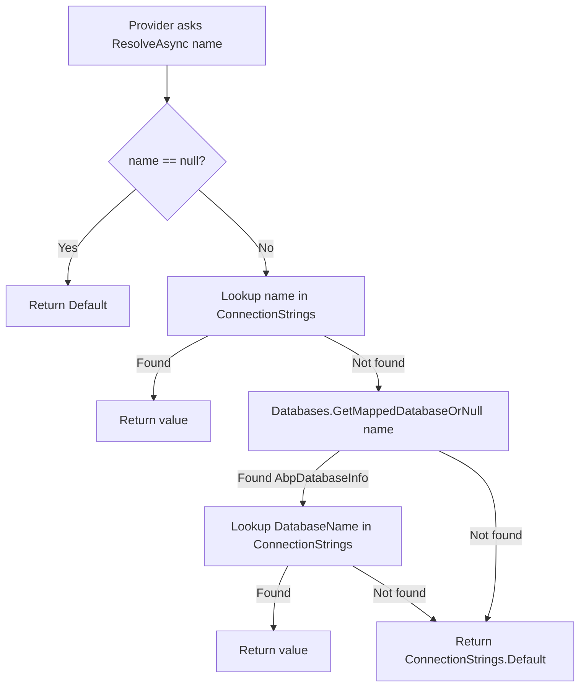
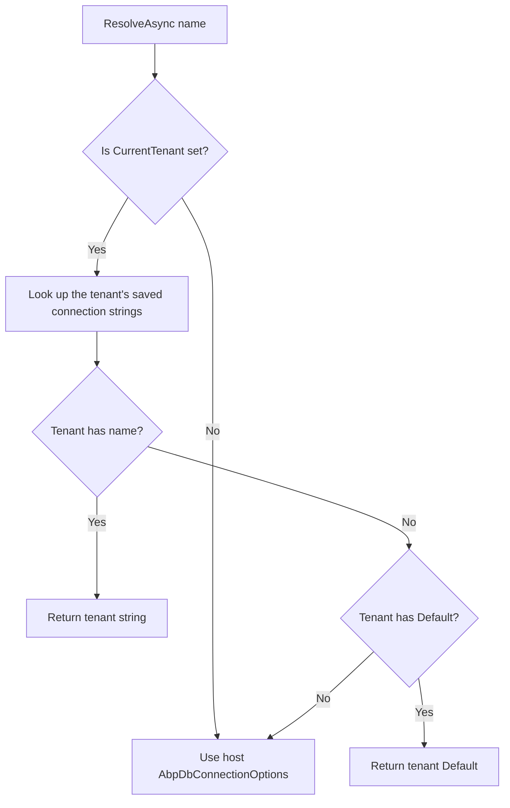

The ABP Framework decouples *who needs a connection* from *which connection it should get*. Every DbContext, MongoDbContext or Dapper repository asks `IConnectionStringResolver` for the string by a logical *name*, and the resolver consults `AbpDbConnectionOptions` (which itself is bound to `IConfiguration`) or — in multi‑tenant setups — a tenant‑aware override. This page covers `ConnectionStrings`, `IConnectionStringResolver`, `DefaultConnectionStringResolver`, `AbpDbConnectionOptions`, `[ConnectionStringName]`, and the `AbpDatabaseInfoDictionary` used to map logical connection names to a shared physical database.

## The configuration shape

`Volo/Abp/Data/ConnectionStrings.cs` is the user‑facing type. It is a string dictionary with a `Default` convenience and the well‑known key constant.

```csharp
[Serializable]
public class ConnectionStrings : Dictionary<string, string?>
{
    public const string DefaultConnectionStringName = "Default";

    public string? Default {
        get => this.GetOrDefault(DefaultConnectionStringName);
        set => this[DefaultConnectionStringName] = value;
    }
}
```

This is the type populated from `appsettings.json` by the framework's binding to `Configure<AbpDbConnectionOptions>(configuration)` in `AbpDataModule`. A typical configuration:

```json
{
  "ConnectionStrings": {
    "Default": "Server=...;Database=MyAppDb;...",
    "AbpAuditLogging": "Server=...;Database=AuditDb;...",
    "Saas": "Server=...;Database=SaasDb;..."
  }
}
```

Each entry's key is the *logical connection string name* — by convention either the full type name of a DbContext or the value of `[ConnectionStringName("X")]` on it.

## Carrying it: `AbpDbConnectionOptions`

`Volo/Abp/Data/AbpDbConnectionOptions.cs` wraps `ConnectionStrings` and `AbpDatabaseInfoDictionary` and exposes the fallback chain:

```csharp
public class AbpDbConnectionOptions
{
    public ConnectionStrings ConnectionStrings { get; set; }
    public AbpDatabaseInfoDictionary Databases { get; set; }

    public AbpDbConnectionOptions()
    {
        ConnectionStrings = new ConnectionStrings();
        Databases = new AbpDatabaseInfoDictionary();
    }

    public string? GetConnectionStringOrNull(
        string connectionStringName,
        bool fallbackToDatabaseMappings = true,
        bool fallbackToDefault = true)
    {
        var connectionString = ConnectionStrings.GetOrDefault(connectionStringName);
        if (!connectionString.IsNullOrEmpty()) return connectionString;

        if (fallbackToDatabaseMappings)
        {
            var database = Databases.GetMappedDatabaseOrNull(connectionStringName);
            if (database != null)
            {
                connectionString = ConnectionStrings.GetOrDefault(database.DatabaseName);
                if (!connectionString.IsNullOrEmpty()) return connectionString;
            }
        }

        if (fallbackToDefault)
        {
            connectionString = ConnectionStrings.Default;
            if (!connectionString.IsNullOrWhiteSpace()) return connectionString;
        }

        return null;
    }
}
```

The three steps of `GetConnectionStringOrNull` are the **resolution policy** every caller inherits:

1. Direct lookup in `ConnectionStrings`.
2. Database‑mapping lookup (see "Logical databases" below).
3. Fallback to `ConnectionStrings.Default`.

## Looking it up: `IConnectionStringResolver`

`Volo/Abp/Data/IConnectionStringResolver.cs` is the abstraction every provider calls. There is a sync method kept for back‑compat and an async one that is the canonical API.

```csharp
public interface IConnectionStringResolver
{
    [Obsolete("Use ResolveAsync method.")]
    string Resolve(string? connectionStringName = null);

    Task<string> ResolveAsync(string? connectionStringName = null);
}
```

`Volo/Abp/Data/DefaultConnectionStringResolver.cs` is the in‑process implementation. It reads the options snapshot and applies the same fallback rules:

```csharp
public class DefaultConnectionStringResolver : IConnectionStringResolver, ITransientDependency
{
    protected AbpDbConnectionOptions Options { get; }

    public DefaultConnectionStringResolver(IOptionsMonitor<AbpDbConnectionOptions> options)
    {
        Options = options.CurrentValue;
    }

    public virtual Task<string> ResolveAsync(string? connectionStringName = null)
        => Task.FromResult(ResolveInternal(connectionStringName))!;

    private string? ResolveInternal(string? connectionStringName)
    {
        if (connectionStringName == null) return Options.ConnectionStrings.Default;

        var connectionString = Options.GetConnectionStringOrNull(connectionStringName);
        if (!connectionString.IsNullOrEmpty()) return connectionString;

        return null;
    }
}
```

Notice that `DefaultConnectionStringResolver` is `ITransientDependency`. The multi‑tenant replacement (`TenantConnectionStringResolver` in `Volo.Abp.MultiTenancy`) is registered with `[Dependency(ReplaceServices = true)]` and reads the *current tenant's own connection strings* before falling back to host‑level options.

## The `[ConnectionStringName]` attribute

`Volo/Abp/Data/ConnectionStringNameAttribute.cs` makes a DbContext's connection name discoverable.

```csharp
public class ConnectionStringNameAttribute : Attribute
{
    public string Name { get; }
    public ConnectionStringNameAttribute(string name)
    {
        Check.NotNull(name, nameof(name));
        Name = name;
    }

    public static string GetConnStringName<T>() => GetConnStringName(typeof(T));

    public static string GetConnStringName(Type type)
    {
        var nameAttribute = type.GetTypeInfo().GetCustomAttribute<ConnectionStringNameAttribute>();
        if (nameAttribute == null) return type.FullName!;
        return nameAttribute.Name;
    }
}
```

This is the static helper that `UnitOfWorkDbContextProvider.GetDbContextAsync` calls (`framework/src/Volo.Abp.EntityFrameworkCore/Volo/Abp/Uow/EntityFrameworkCore/UnitOfWorkDbContextProvider.cs`, lines around 92–105):

```csharp
var targetDbContextType = EfCoreDbContextTypeProvider.GetDbContextType(typeof(TDbContext));
var connectionStringName = ConnectionStringNameAttribute.GetConnStringName(targetDbContextType);
var connectionString = await ResolveConnectionStringAsync(connectionStringName);
```

The fallback to `type.FullName` is why a DbContext like `Volo.Abp.AuditLogging.EntityFrameworkCore.AbpAuditLoggingDbContext` shows up as a connection string key by default; module authors usually decorate the context with `[ConnectionStringName("AbpAuditLogging")]` to give it a short alias.

## Logical databases

A common scenario is "multiple DbContexts that should share one physical database". `AbpDatabaseInfo` (`Volo/Abp/Data/AbpDatabaseInfo.cs`) and `AbpDatabaseInfoDictionary` (`Volo/Abp/Data/AbpDatabaseInfoDictionary.cs`) model that.

```csharp
public class AbpDatabaseInfo
{
    public string DatabaseName { get; }
    public HashSet<string> MappedConnections { get; }
    public bool IsUsedByTenants { get; set; } = true;

    internal AbpDatabaseInfo(string databaseName)
    {
        DatabaseName = databaseName;
        MappedConnections = new HashSet<string>();
    }

    public void MapConnection(params string[] connectionNames)
    {
        foreach (var connectionName in connectionNames)
        {
            MappedConnections.AddIfNotContains(connectionName);
        }
    }
}
```

A module configures the dictionary in startup:

```csharp
Configure<AbpDbConnectionOptions>(options =>
{
    options.Databases.Configure("MyAppDb", db =>
    {
        db.MapConnection("AbpAuditLogging");
        db.MapConnection("AbpIdentity");
        db.MapConnection("AbpPermissionManagement");
    });
});
```

Now, if `appsettings.json` defines only the `MyAppDb` connection string, `GetConnectionStringOrNull("AbpAuditLogging")` follows the second step in the fallback chain — `Databases.GetMappedDatabaseOrNull("AbpAuditLogging")` returns the `MyAppDb` info, and the resolver reads `ConnectionStrings["MyAppDb"]`. The index is built in `AbpDataModule.PostConfigureServices`:

```csharp
public override void PostConfigureServices(ServiceConfigurationContext context)
{
    Configure<AbpDbConnectionOptions>(options =>
    {
        options.Databases.RefreshIndexes();
    });
}
```

`RefreshIndexes()` throws `AbpException` if a connection name maps to multiple databases — preventing ambiguous mappings.

## Resolution flow



The diagram mirrors `AbpDbConnectionOptions.GetConnectionStringOrNull` exactly.

## Multi‑tenant replacement

When `Volo.Abp.MultiTenancy` is loaded, it registers a `TenantConnectionStringResolver` that overlays the host options with tenant‑specific connection strings. The decision tree (simplified):



The tenant directory entity owns its own `ConnectionStrings` collection; the resolver reads it via `ITenantStore` and falls back to the host config. The exact implementation is documented in [Multi‑tenancy connection strings](/multi-tenancy/tenant-configuration-store).

## Connection string check

Before opening a connection in production, ABP can probe it. The probe contract is in `Volo/Abp/Data/IConnectionStringChecker.cs`:

```csharp
public interface IConnectionStringChecker
{
    Task<AbpConnectionStringCheckResult> CheckAsync(string connectionString);
}
```

`AbpConnectionStringCheckResult` exposes two booleans — `Connected` and `DatabaseExists`. The default in `DefaultConnectionStringChecker.cs` returns both `false`. Each provider replaces it; the SQL Server variant in `Volo.Abp.EntityFrameworkCore.SqlServer/Volo/Abp/EntityFrameworkCore/ConnectionStrings/SqlServerConnectionStringChecker.cs` opens a `SqlConnection` to `master` with a 1‑second timeout and then `ChangeDatabaseAsync` to the originally requested catalog.

| Provider | Checker | Strategy |
| --- | --- | --- |
| SQL Server | `SqlServerConnectionStringChecker` | open `master`, then `ChangeDatabaseAsync` |
| Npgsql | `NpgsqlConnectionStringChecker` | open with `Database=postgres`, then query catalog |
| MySQL (Oracle MySQL.Data) | `MySQLConnectionStringChecker` | open with no `Database`, then `USE` the target |
| MySQL (Pomelo) | `PomeloMySQLConnectionStringChecker` | same pattern |
| Sqlite | `SqliteConnectionStringChecker` | check file exists / can open |
| Oracle | `OracleConnectionStringChecker` | open and run dummy query |
| Oracle Devart | `OracleDevartConnectionStringChecker` | same |
| MongoDB | `MongoDBConnectionStringChecker` | `ListDatabaseNames` against the parsed URL |

Each checker is registered with `[Dependency(ReplaceServices = true)]` so loading the SQL Server module overrides `DefaultConnectionStringChecker`.

## End‑to‑end: from `appsettings.json` to `SqlConnection`

```mermaid
sequenceDiagram
  participant App as Caller
  participant Repo as EfCoreRepository
  participant Prov as UnitOfWorkDbContextProvider
  participant Res as IConnectionStringResolver
  participant Opts as AbpDbConnectionOptions
  participant Cfg as IConfiguration

  Cfg-->>Opts: bind ConnectionStrings:* on startup
  App->>Repo: InsertAsync(entity)
  Repo->>Prov: GetDbContextAsync()
  Prov->>Prov: type = EfCoreDbContextTypeProvider.GetDbContextType(typeof(TDbContext))
  Prov->>Prov: name = ConnectionStringNameAttribute.GetConnStringName(type)
  Prov->>Res: ResolveAsync(name)
  Res->>Opts: GetConnectionStringOrNull(name)
  Opts-->>Res: "Server=...;Database=MyAppDb"
  Res-->>Prov: string
  Prov->>Prov: CreateDbContextAsync(connStr)
```

The provider then calls `UseSqlServer` (or `UseNpgsql` etc.) under the hood via the chosen `AbpDbContextOptions` extension method — see [EF Core providers](/data/ef-core-providers).

## Extensions helper

`Volo/Abp/Data/ConnectionStringResolverExtensions.cs` provides a typed overload that uses the `[ConnectionStringName]` attribute:

```csharp
public static Task<string> ResolveAsync<T>(this IConnectionStringResolver resolver)
{
    return resolver.ResolveAsync(ConnectionStringNameAttribute.GetConnStringName<T>());
}
```

This is what most callers use when they need the connection string for a known DbContext type without going through `IDbContextProvider`.

## Patterns to know

<AccordionGroup>
  <Accordion title="Shared physical DB, separate logical schemas">
    Configure `AbpDbConnectionOptions.Databases` to map every module's connection name to the same logical `DatabaseName`. Define only `Default` (or the `DatabaseName` value) in `appsettings.json`. Modules ship their own DbContext per bounded context but they share the underlying connection.
  </Accordion>
  <Accordion title="Per-module databases">
    Define one entry per module in `appsettings.json` under `ConnectionStrings`. Do not configure `AbpDatabaseInfoDictionary` — the first‑pass lookup will succeed.
  </Accordion>
  <Accordion title="Per-tenant connection strings">
    Enable `Volo.Abp.MultiTenancy`, register a `TenantConnectionStringResolver` replacement, and store each tenant's strings in the tenant directory entity. The resolver falls back to host strings if the tenant entry is empty.
  </Accordion>
  <Accordion title="Sharing one connection between EF Core and Dapper">
    Inject `DapperRepository<TDbContext>` which delegates to the same `IDbContextProvider<TDbContext>` and exposes the connection via `Database.GetDbConnection()`. The resolver is consulted once per UoW — both providers see the same connection string and the same open connection. See [Dapper integration](/data/dapper-integration).
  </Accordion>
</AccordionGroup>

## Pitfalls

<Warning>
`IConnectionStringResolver` is `ITransientDependency`. The implementation reads `IOptionsMonitor<AbpDbConnectionOptions>.CurrentValue` at construction; changes to options that happen after construction will not be picked up by an already‑injected instance. Inject the resolver, not the options, into long‑lived services.
</Warning>

<Warning>
`AbpDatabaseInfoDictionary.RefreshIndexes` throws if two `AbpDatabaseInfo` entries map the same connection name. The throw happens during `PostConfigureServices`, so misconfiguration surfaces at app startup, not at the first request.
</Warning>

## Quick reference

| Symbol | File | Purpose |
| --- | --- | --- |
| `ConnectionStrings` | `Volo/Abp/Data/ConnectionStrings.cs` | Dictionary bound to `appsettings.json`. |
| `AbpDbConnectionOptions` | `Volo/Abp/Data/AbpDbConnectionOptions.cs` | Options carrier with fallback policy. |
| `IConnectionStringResolver` | `Volo/Abp/Data/IConnectionStringResolver.cs` | Contract used by providers. |
| `DefaultConnectionStringResolver` | `Volo/Abp/Data/DefaultConnectionStringResolver.cs` | In‑process resolver. |
| `ConnectionStringNameAttribute` | `Volo/Abp/Data/ConnectionStringNameAttribute.cs` | Maps a DbContext type to a connection name. |
| `AbpDatabaseInfo` | `Volo/Abp/Data/AbpDatabaseInfo.cs` | One logical database. |
| `AbpDatabaseInfoDictionary` | `Volo/Abp/Data/AbpDatabaseInfoDictionary.cs` | Index of logical databases. |
| `IConnectionStringChecker` | `Volo/Abp/Data/IConnectionStringChecker.cs` | Probe a connection string. |
| `DefaultConnectionStringChecker` | `Volo/Abp/Data/DefaultConnectionStringChecker.cs` | Stub that returns false. |

## Related reading

<CardGroup cols={2}>
  <Card title="EF Core providers" href="/data/ef-core-providers">
    Each provider supplies its own connection‑string checker.
  </Card>
  <Card title="MongoDB" href="/data/mongodb-integration">
    `MongoDbContextProvider` also consults `IConnectionStringResolver`.
  </Card>
  <Card title="Multi-tenancy" href="/multi-tenancy/tenant-configuration-store">
    The replacement resolver that adds tenant‑aware lookups.
  </Card>
  <Card title="Modules" href="/core/modularity-and-modules">
    Where `AbpDbConnectionOptions` gets bound to `IConfiguration`.
  </Card>
</CardGroup>
