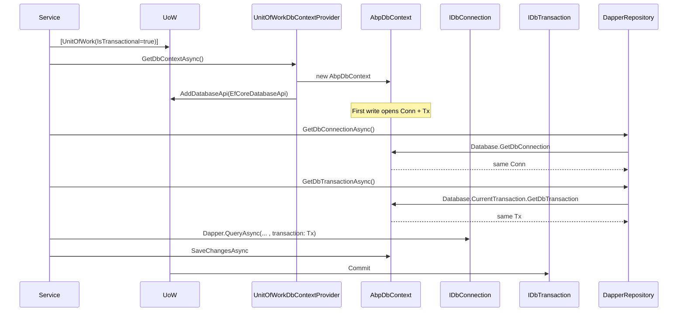
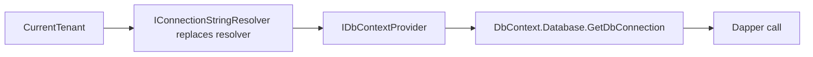

`Volo.Abp.Dapper` is the smallest data‑integration package in the ABP Framework — only three C# files — yet it solves a real problem: how do you mix raw‑SQL Dapper queries with EF Core's change‑tracked writes in a single transaction? The answer is *piggyback*: `DapperRepository<TDbContext>` reuses the EF Core `IDbContextProvider<TDbContext>` to obtain the live `IDbConnection` and `IDbTransaction`. This page walks the entire package and explains the implications.

## The package contents

The package lives in `framework/src/Volo.Abp.Dapper/` and contains:

| File | Role |
| --- | --- |
| `Volo/Abp/Dapper/AbpDapperModule.cs` | Module wiring; depends on `AbpEntityFrameworkCoreModule`. |
| `Volo/Abp/Domain/Repositories/Dapper/IDapperRepository.cs` | The contract. |
| `Volo/Abp/Domain/Repositories/Dapper/DapperRepository.cs` | The generic implementation. |

That's the entire surface. Dapper itself ships its `Connection.QueryAsync(...)` extensions; ABP only provides the wrapper that exposes the connection and transaction in a UoW‑aware way.

## The module

`AbpDapperModule.cs` carries no `ConfigureServices` body — its purpose is to assert the dependency on EF Core:

```csharp
[DependsOn(
    typeof(AbpDddDomainModule),
    typeof(AbpEntityFrameworkCoreModule))]
public class AbpDapperModule : AbpModule
{
}
```

Because `DapperRepository<TDbContext>` injects an `IDbContextProvider<TDbContext>`, the EF Core module must be loaded — there is no Dapper‑only mode.

## The contract

`Volo/Abp/Domain/Repositories/Dapper/IDapperRepository.cs`:

```csharp
public interface IDapperRepository
{
    [Obsolete("Use GetDbConnectionAsync method.")]
    IDbConnection DbConnection { get; }

    Task<IDbConnection> GetDbConnectionAsync();

    [Obsolete("Use GetDbTransactionAsync method.")]
    IDbTransaction? DbTransaction { get; }

    Task<IDbTransaction?> GetDbTransactionAsync();
}
```

Just two members in the async form: the connection and the (optional) transaction. The repository's user — a service inheriting from `DapperRepository<TDbContext>` — is expected to call any Dapper extension on the returned `IDbConnection`, passing the `IDbTransaction` along.

## The implementation

`Volo/Abp/Domain/Repositories/Dapper/DapperRepository.cs` is short enough to read in full:

```csharp
public class DapperRepository<TDbContext> : IDapperRepository, IUnitOfWorkEnabled
    where TDbContext : IEfCoreDbContext
{
    public IAbpLazyServiceProvider LazyServiceProvider { get; set; } = default!;

    public IDataFilter DataFilter => LazyServiceProvider.LazyGetRequiredService<IDataFilter>();
    public ICurrentTenant CurrentTenant => LazyServiceProvider.LazyGetRequiredService<ICurrentTenant>();
    public IUnitOfWorkManager UnitOfWorkManager => LazyServiceProvider.LazyGetRequiredService<IUnitOfWorkManager>();
    public ICancellationTokenProvider CancellationTokenProvider =>
        LazyServiceProvider.LazyGetService<ICancellationTokenProvider>(NullCancellationTokenProvider.Instance);

    private readonly IDbContextProvider<TDbContext> _dbContextProvider;

    public DapperRepository(IDbContextProvider<TDbContext> dbContextProvider)
    {
        _dbContextProvider = dbContextProvider;
    }

    [Obsolete("Use GetDbConnectionAsync method.")]
    public IDbConnection DbConnection => _dbContextProvider.GetDbContext().Database.GetDbConnection();

    public virtual async Task<IDbConnection> GetDbConnectionAsync() =>
        (await _dbContextProvider.GetDbContextAsync()).Database.GetDbConnection();

    [Obsolete("Use GetDbTransactionAsync method.")]
    public IDbTransaction? DbTransaction =>
        _dbContextProvider.GetDbContext().Database.CurrentTransaction?.GetDbTransaction();

    public virtual async Task<IDbTransaction?> GetDbTransactionAsync() =>
        (await _dbContextProvider.GetDbContextAsync()).Database.CurrentTransaction?.GetDbTransaction();

    protected virtual CancellationToken GetCancellationToken(CancellationToken preferredValue = default)
    {
        return CancellationTokenProvider.FallbackToProvider(preferredValue);
    }
}
```

Notable pieces:

- The class is `IUnitOfWorkEnabled` — every method is auto‑intercepted by the `UnitOfWorkInterceptor` so that a Dapper call always has an ambient UoW.
- `GetDbConnectionAsync` returns the result of `dbContext.Database.GetDbConnection()`. That is the *same* `DbConnection` EF Core would use for its next save. No new connection is opened.
- `GetDbTransactionAsync` returns `CurrentTransaction?.GetDbTransaction()`. If the UoW is transactional, EF Core has opened a transaction and this returns the underlying ADO.NET `IDbTransaction`. If not, it returns `null`.

## How it shares the UoW

The diagram below shows two operations — an EF Core save and a Dapper read — sharing the same connection and transaction inside one `[UnitOfWork(IsTransactional=true)]` method:



Because the `EfCoreDatabaseApi` attached to the UoW holds the `DbContext` instance and `dbContext.Database.GetDbConnection()` returns that connection, every consumer accessing the connection through `DapperRepository` ends up with the same `DbConnection` reference for the lifetime of the UoW.

## Using it: writing a Dapper repository

A typical application service writes its own thin wrapper on top of `DapperRepository<TDbContext>`:

```csharp
public class BookDapperRepository : DapperRepository<MyDbContext>, ITransientDependency
{
    public BookDapperRepository(IDbContextProvider<MyDbContext> dbContextProvider)
        : base(dbContextProvider) { }

    public async Task<int> CountSoldAsync(Guid bookId)
    {
        var conn = await GetDbConnectionAsync();
        var tx = await GetDbTransactionAsync();

        return await conn.ExecuteScalarAsync<int>(
            "select count(*) from OrderLines where BookId = @id",
            param: new { id = bookId },
            transaction: tx);
    }
}
```

Two important conventions:

1. **Pass `transaction: tx`** to every Dapper call. Without it, Dapper opens its own connection scope and your raw‑SQL read may not see uncommitted writes made by EF Core in the same UoW.
2. **Inject `IBookDapperRepository`** (a contract that exposes `CountSoldAsync`) — not `DapperRepository<MyDbContext>` directly. Encapsulating raw SQL behind an interface keeps application services testable.

## Behaviour matrix

| UoW state | `GetDbConnection` | `GetDbTransaction` | Result |
| --- | --- | --- | --- |
| No UoW | throws `AbpException` (from `IDbContextProvider`) | n/a | Repository must be called inside a UoW. |
| Non‑transactional UoW | open `DbConnection` (after first EF Core write) | `null` | Dapper executes outside any transaction. |
| Transactional UoW, before any EF Core write | open `DbConnection` (EF Core opens it eagerly when needed) | `null` until a write happens | Dapper may execute without a transaction yet. |
| Transactional UoW, after first EF Core write | open `DbConnection` | non‑null `IDbTransaction` | Dapper read sees uncommitted writes if you pass `tx`. |

The middle row is a subtle gotcha: if you do a Dapper read *first* and EF Core hasn't opened the transaction yet, your read happens outside the transaction. Use `await Context.Database.BeginTransactionAsync()` (or perform a no‑op EF Core save) to force the transaction open before the first Dapper read in a transactional UoW.

## Reading filters

`DapperRepository` exposes `DataFilter` and `CurrentTenant`. They are not applied automatically — Dapper has no model and ABP cannot inject the filter predicates into your hand‑written SQL. You must write tenant‑aware and soft‑delete‑aware WHERE clauses manually:

```csharp
public async Task<int> CountActiveAsync()
{
    var conn = await GetDbConnectionAsync();
    var tx = await GetDbTransactionAsync();

    var tenantId = CurrentTenant.Id;
    var includeDeleted = !DataFilter.IsEnabled<ISoftDelete>();

    return await conn.ExecuteScalarAsync<int>(
        @"select count(*) from Books
          where (@tenantId is null or TenantId = @tenantId)
            and (@includeDeleted = 1 or IsDeleted = 0)",
        new { tenantId, includeDeleted },
        transaction: tx);
}
```

The `DataFilter` property is for *reading* the current state; do not call `Disable<...>()` here — that toggle affects EF Core / Mongo / MemoryDb queries, not the SQL you typed by hand.

## Multi‑tenant connection strings

Because `DapperRepository` resolves the connection through the same `IDbContextProvider<TDbContext>` chain that EF Core uses, multi‑tenant connection‑string resolution applies transparently. A tenant‑aware UoW that switched to a tenant‑specific connection string for `MyDbContext` will return that connection from `GetDbConnectionAsync` — the Dapper call automatically reads/writes the tenant's database.



## What `DapperRepository` is *not*

| Concern | Status |
| --- | --- |
| Schema migration | Out of scope — use EF Core migrations. |
| Object–relational mapping | Out of scope — write SQL directly. |
| Concurrency stamps | Out of scope — implement in SQL via `WHERE ConcurrencyStamp = @stamp`. |
| Auditing | Out of scope — call `IAuditPropertySetter` manually if you need it. |
| Filtering | Out of scope — write predicates by hand using `CurrentTenant.Id` and `DataFilter.IsEnabled<...>`. |
| Distributed events | Out of scope — `DapperRepository` does not interact with the entity event publisher. |

The package is intentionally a low‑level seam. Use it for read‑heavy reports, complex joins or queries that EF Core compiles poorly. For CRUD on aggregate roots, `EfCoreRepository` remains the right tool.

## Pitfalls

<Warning>
Do not call `_dbContextProvider.GetDbContext()` (the obsolete sync overload). It emits a warning when `UnitOfWork.EnableObsoleteDbContextCreationWarning` is on and breaks async flow. Always use `GetDbConnectionAsync` / `GetDbTransactionAsync`.
</Warning>

<Warning>
`DapperRepository` is `IUnitOfWorkEnabled` but it does not implement `IRepository<TEntity>`. It will not be picked up by the EF Core repository registrar. Add explicit DI registration (`ITransientDependency` on your derived class) and inject your interface, not the generic class.
</Warning>

<Warning>
Mixing Dapper writes with EF Core writes in one UoW can confuse the change tracker. Dapper does not notify EF Core of inserts/updates, so an entity Dapper wrote will not appear in `ChangeTracker.Entries()`. If you re‑load it through a repository in the same UoW, EF Core may return a stale cached snapshot. Avoid writing the same row from both code paths in one UoW.
</Warning>

## Quick reference

| Symbol | File |
| --- | --- |
| `AbpDapperModule` | `Volo/Abp/Dapper/AbpDapperModule.cs` |
| `IDapperRepository` | `Volo/Abp/Domain/Repositories/Dapper/IDapperRepository.cs` |
| `DapperRepository<TDbContext>` | `Volo/Abp/Domain/Repositories/Dapper/DapperRepository.cs` |
| `IDbContextProvider<TDbContext>` (used by both) | `Volo.Abp.EntityFrameworkCore/Volo/Abp/EntityFrameworkCore/IDbContextProvider.cs` |
| `UnitOfWorkDbContextProvider` (resolution) | `Volo.Abp.EntityFrameworkCore/Volo/Abp/Uow/EntityFrameworkCore/UnitOfWorkDbContextProvider.cs` |

## Related reading

<CardGroup cols={2}>
  <Card title="EF Core integration" href="/data/entity-framework-core">
    Source of the `IDbContextProvider<TDbContext>` Dapper piggybacks on.
  </Card>
  <Card title="Unit of work" href="/data/unit-of-work">
    The transaction lifecycle that controls Dapper's `IDbTransaction`.
  </Card>
  <Card title="Connection strings" href="/data/connection-strings">
    Tenant‑aware string resolution that `DapperRepository` inherits automatically.
  </Card>
  <Card title="Data filtering" href="/data/data-filtering">
    Why `DataFilter.IsEnabled<...>` matters when writing Dapper SQL.
  </Card>
</CardGroup>
