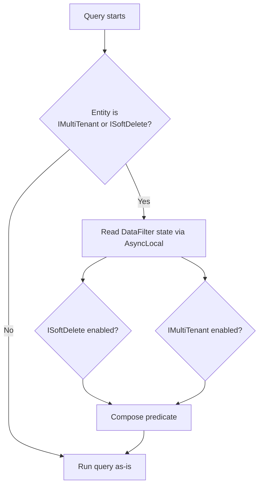

ABP Framework data filters are a per‑scope toggle for query predicates. They let a service temporarily turn off "include soft‑deleted rows" or "restrict to current tenant" without rewriting every query. The mechanism lives in `framework/src/Volo.Abp.Data/Volo/Abp/Data/` (the `DataFilter*` files) and is consumed by every provider: `AbpDbContext.CreateFilterExpression` reads it for EF Core; `MongoDbRepositoryFilterer` reads it for MongoDB; `MemoryDbRepository` reads it for the in‑memory store. This page explains the contract, the state machine, the built‑in filters, and the rules that decide what is filtered.

## The contract

Two interfaces define the API. Both live in `Volo/Abp/Data/IDataFilter.cs`.

```csharp
public interface IDataFilter<TFilter>
    where TFilter : class
{
    IDisposable Enable();
    IDisposable Disable();
    bool IsEnabled { get; }
}

public interface IDataFilter
{
    IDisposable Enable<TFilter>() where TFilter : class;
    IDisposable Disable<TFilter>() where TFilter : class;
    bool IsEnabled<TFilter>() where TFilter : class;
}
```

`IDataFilter` is a façade that resolves the per‑type filter on demand. Application code almost always injects `IDataFilter` (not the generic one) and writes `dataFilter.Disable<ISoftDelete>()`. Provider code resolves `IDataFilter<ISoftDelete>` to inspect `IsEnabled` directly.

## The state container

`Volo/Abp/Data/DataFilterState.cs` is a mutable carrier with `Clone()`:

```csharp
public class DataFilterState
{
    public bool IsEnabled { get; set; }
    public DataFilterState(bool isEnabled) { IsEnabled = isEnabled; }
    public DataFilterState Clone() => new DataFilterState(IsEnabled);
}
```

The state is held in an `AsyncLocal<DataFilterState>` per filter type. That is why `using (DataFilter.Disable<ISoftDelete>())` only affects the current async flow — nested calls and parallel requests see independent state.

## `DataFilter<TFilter>` — the working class

`Volo/Abp/Data/DataFilter.cs` contains both `DataFilter` (singleton façade) and `DataFilter<TFilter>` (the per‑filter singleton with `AsyncLocal` state). The generic implementation:

```csharp
public class DataFilter<TFilter> : IDataFilter<TFilter>
    where TFilter : class
{
    public bool IsEnabled {
        get {
            EnsureInitialized();
            return _filter.Value!.IsEnabled;
        }
    }

    private readonly AbpDataFilterOptions _options;
    private readonly AsyncLocal<DataFilterState> _filter;

    public DataFilter(IOptions<AbpDataFilterOptions> options)
    {
        _options = options.Value;
        _filter = new AsyncLocal<DataFilterState>();
    }

    public IDisposable Enable()
    {
        if (IsEnabled) { return NullDisposable.Instance; }
        _filter.Value!.IsEnabled = true;
        return new DisposeAction(() => Disable());
    }

    public IDisposable Disable()
    {
        if (!IsEnabled) { return NullDisposable.Instance; }
        _filter.Value!.IsEnabled = false;
        return new DisposeAction(() => Enable());
    }

    private void EnsureInitialized()
    {
        if (_filter.Value != null) { return; }
        _filter.Value = _options.DefaultStates.GetOrDefault(typeof(TFilter))?.Clone() ?? new DataFilterState(true);
    }
}
```

Three implementation details worth noting:

1. `EnsureInitialized` reads `AbpDataFilterOptions.DefaultStates` for the type and falls back to enabled (`new DataFilterState(true)`). That is why every built‑in filter is **on** by default.
2. `Enable` / `Disable` are no‑ops if the filter is already in the target state and return `NullDisposable.Instance` so the `using` block has nothing to revert.
3. The disposable returned by `Disable` calls `Enable` on dispose (not the original state). Nesting two `Disable<T>()` calls is therefore safe — the inner one is a no‑op.

## The façade

The non‑generic `DataFilter` is a `ISingletonDependency` that caches resolved generic filters in a `ConcurrentDictionary<Type, object>`:

```csharp
public class DataFilter : IDataFilter, ISingletonDependency
{
    private readonly ConcurrentDictionary<Type, object> _filters;
    private readonly IServiceProvider _serviceProvider;

    public IDisposable Enable<TFilter>() where TFilter : class
        => GetFilter<TFilter>().Enable();
    public IDisposable Disable<TFilter>() where TFilter : class
        => GetFilter<TFilter>().Disable();
    public bool IsEnabled<TFilter>() where TFilter : class
        => GetFilter<TFilter>().IsEnabled;

    private IDataFilter<TFilter> GetFilter<TFilter>() where TFilter : class
        => (_filters.GetOrAdd(typeof(TFilter),
                factory: () => _serviceProvider.GetRequiredService<IDataFilter<TFilter>>())
            as IDataFilter<TFilter>)!;
}
```

Registration happens in `AbpDataModule.ConfigureServices`:

```csharp
context.Services.AddSingleton(typeof(IDataFilter<>), typeof(DataFilter<>));
```

## Options

`AbpDataFilterOptions` (`Volo/Abp/Data/AbpDataFilterOptions.cs`) is the way a module changes the default state of a filter for the whole host.

```csharp
public class AbpDataFilterOptions
{
    public Dictionary<Type, DataFilterState> DefaultStates { get; }
    public AbpDataFilterOptions() => DefaultStates = new Dictionary<Type, DataFilterState>();
}
```

A module that wants `ISoftDelete` off by default would write:

```csharp
Configure<AbpDataFilterOptions>(options =>
{
    options.DefaultStates[typeof(ISoftDelete)] = new DataFilterState(isEnabled: false);
});
```

`DataFilter<TFilter>` calls `Clone()` on the entry before storing it in AsyncLocal, so toggling in one scope cannot leak to other scopes.

## The built‑in filter markers

ABP ships two filter markers that every provider knows about. They are *interfaces on entities* — the entity opts into the filter by implementing the interface. They live in the DDD package, not in `Volo.Abp.Data`, but they are referenced everywhere.

| Marker | Lives in | Effect when enabled |
| --- | --- | --- |
| `ISoftDelete` | `Volo.Abp.Ddd.Domain/Volo/Abp/Domain/Entities/ISoftDelete.cs` | Query excludes rows where `IsDeleted == true`. Delete becomes update of `IsDeleted = true`. |
| `IMultiTenant` | `Volo.Abp.MultiTenancy/Volo/Abp/MultiTenancy/IMultiTenant.cs` | Query restricts to `TenantId == CurrentTenant.Id` (or `null` if host). |

`AbpDbContext.ShouldFilterEntity<TEntity>` decides whether to attach a filter expression at all (`framework/src/Volo.Abp.EntityFrameworkCore/Volo/Abp/EntityFrameworkCore/AbpDbContext.cs`):

```csharp
protected virtual bool ShouldFilterEntity<TEntity>(IMutableEntityType entityType) where TEntity : class
{
    if (typeof(IMultiTenant).IsAssignableFrom(typeof(TEntity))) return true;
    if (typeof(ISoftDelete).IsAssignableFrom(typeof(TEntity))) return true;
    return false;
}
```

When the entity matches, `CreateFilterExpression<TEntity>` (same file, around line 960) builds the predicate. The relevant excerpt for soft delete:

```csharp
if (typeof(ISoftDelete).IsAssignableFrom(typeof(TEntity)))
{
    var softDeleteColumnName = entityTypeBuilder.Metadata.FindProperty(nameof(ISoftDelete.IsDeleted))?.GetColumnName() ?? "IsDeleted";
    expression = e => !IsSoftDeleteFilterEnabled || !EF.Property<bool>(e, softDeleteColumnName);
    // ...
}
```

`IsSoftDeleteFilterEnabled` is a property on `AbpDbContext`:

```csharp
protected virtual bool IsSoftDeleteFilterEnabled => DataFilter?.IsEnabled<ISoftDelete>() ?? false;
```

Multi‑tenant filter is the same pattern with `IMultiTenantFilterEnabled` and `CurrentTenantId`:

```csharp
if (typeof(IMultiTenant).IsAssignableFrom(typeof(TEntity)))
{
    var multiTenantColumnName = entityTypeBuilder.Metadata.FindProperty(nameof(IMultiTenant.TenantId))?.GetColumnName() ?? "TenantId";
    Expression<Func<TEntity, bool>> multiTenantFilter =
        e => !IsMultiTenantFilterEnabled || EF.Property<Guid>(e, multiTenantColumnName) == CurrentTenantId;
    // ...
}
```

The two predicates are combined with `QueryFilterExpressionHelper.CombineExpressions` (logical AND). The combined expression is registered via `entityTypeBuilder.HasAbpQueryFilter(filterExpression)` — an extension defined in `framework/src/Volo.Abp.EntityFrameworkCore/Microsoft/EntityFrameworkCore/AbpModelBuilderExtensions.cs`.

## The query‑cache key

Because EF Core caches compiled queries by predicate identity, the filter state must participate in the cache key — otherwise two queries differing only by filter state would share a compiled plan. `AbpDbContext.GetCompiledQueryCacheKey` does exactly that:

```csharp
public virtual string GetCompiledQueryCacheKey()
{
    return $"{CurrentTenantId?.ToString() ?? "Null"}:{IsSoftDeleteFilterEnabled}:{IsMultiTenantFilterEnabled}";
}
```

The key feeds into `AbpCompiledQueryCacheKeyGenerator` (`framework/src/Volo.Abp.EntityFrameworkCore/Volo/Abp/EntityFrameworkCore/GlobalFilters/AbpCompiledQueryCacheKeyGenerator.cs`).

## Optional DB‑function path

When `AbpEfCoreGlobalFilterOptions.UseDbFunction` is `true` (the SQL Server provider opts in via `AbpEntityFrameworkCoreSqlServerModule`), the predicate is rewritten to call a static EF Core DB function:

```csharp
if (UseDbFunction())
{
    expression = e => AbpEfCoreDataFilterDbFunctionMethods.SoftDeleteFilter(((ISoftDelete)e).IsDeleted, true);
    modelBuilder.ConfigureSoftDeleteDbFunction(
        AbpEfCoreDataFilterDbFunctionMethods.SoftDeleteFilterMethodInfo,
        this.GetService<AbpEfCoreCurrentDbContext>()
    );
}
```

`AbpEfCoreDataFilterDbFunctionMethods` (`Volo/Abp/EntityFrameworkCore/GlobalFilters/AbpEfCoreDataFilterDbFunctionMethods.cs`) is a stub holder; the actual SQL is generated by the SQL Server provider via the `ConfigureSoftDeleteDbFunction` extension. This indirection makes the *current* filter state participate in the SQL itself, which avoids re‑compiling the query whenever a user toggles a filter.

## Decision matrix: what gets filtered

| Entity implements | `DataFilter.IsEnabled<ISoftDelete>` | `DataFilter.IsEnabled<IMultiTenant>` | Effective predicate |
| --- | --- | --- | --- |
| Neither | (ignored) | (ignored) | none |
| `ISoftDelete` only | `true` | (ignored) | `!IsDeleted` |
| `ISoftDelete` only | `false` | (ignored) | none |
| `IMultiTenant` only | (ignored) | `true` | `TenantId == currentTenantId` |
| `IMultiTenant` only | (ignored) | `false` | none |
| Both | `true` | `true` | `!IsDeleted && TenantId == currentTenantId` |
| Both | `false` | `true` | `TenantId == currentTenantId` |
| Both | `false` | `false` | none |

The `currentTenantId` is `null` for host users and a `Guid` for tenants. EF Core's filter expression effectively becomes `TenantId == null` for the host — which is why first‑party host‑only data (settings, tenant directory) is stored with `TenantId == null`.

## Behaviour diagram



## Defining a custom filter

A custom filter is just a marker interface. Step‑by‑step:

<Steps>
  <Step title="Declare the marker">
    Add `public interface IInactivityFilter { bool IsInactive { get; } }` to your domain layer.
  </Step>
  <Step title="Implement on entities">
    Entities that should participate implement `IInactivityFilter` with a `bool IsInactive` property.
  </Step>
  <Step title="Add the query filter">
    In your `DbContext` override `OnModelCreating` and call `entityTypeBuilder.HasAbpQueryFilter(e => !DataFilter.IsEnabled<IInactivityFilter>() || !e.IsInactive);`.
  </Step>
  <Step title="Optional default state">
    `Configure<AbpDataFilterOptions>(o => o.DefaultStates[typeof(IInactivityFilter)] = new DataFilterState(true));`
  </Step>
  <Step title="Toggle at runtime">
    `using (DataFilter.Disable<IInactivityFilter>()) { var all = await repo.GetListAsync(); }`
  </Step>
</Steps>

The built‑in markers follow the same recipe — they are not magical. The only difference is that `AbpDbContext.ShouldFilterEntity` hard‑codes the two built‑ins and creates their predicates in `CreateFilterExpression` so consumers don't have to.

## Cross‑provider behaviour

MongoDB and MemoryDb reimplement the same logic. The MongoDB filterer (`framework/src/Volo.Abp.MongoDB/Volo/Abp/Domain/Repositories/MongoDB/MongoDbRepositoryFilterer.cs`) reads `IDataFilter` to decide whether to inject the `IsDeleted: false` or `TenantId == currentTenant` clauses into the BSON filter. The `MemoryDbRepository` (`framework/src/Volo.Abp.MemoryDb/Volo/Abp/Domain/Repositories/MemoryDb/MemoryDbRepository.cs`) applies the same predicate to the in‑memory `IQueryable`. A `using (dataFilter.Disable<ISoftDelete>())` block changes the behaviour of all three.

## Nesting semantics

The two `using` blocks below illustrate nesting:

```csharp
// Outer scope: ISoftDelete is enabled by default.
var deleted = await repo.GetListAsync(); // excludes soft-deleted
using (DataFilter.Disable<ISoftDelete>())
{
    var all = await repo.GetListAsync(); // includes soft-deleted
    using (DataFilter.Disable<ISoftDelete>())
    {
        // No-op: NullDisposable.Instance returned.
        var stillAll = await repo.GetListAsync(); // includes soft-deleted
    }
    // Still disabled (inner using restored what was already disabled).
    var stillAll2 = await repo.GetListAsync();
}
// Restored to enabled.
var deletedAgain = await repo.GetListAsync();
```

The inner block hits the `if (!IsEnabled) { return NullDisposable.Instance; }` short‑circuit, so the outer block is the only one that actually flips state.

## Pitfalls

<Warning>
Filter state is **AsyncLocal**, not request‑local. If you fire‑and‑forget a `Task.Run`, the spawned task will observe the parent's filter state at the moment of capture, but mutations in the parent after the capture will not propagate. Never alter filter state across detached tasks without an explicit `using` inside the new task.
</Warning>

<Warning>
A repository that uses `IQueryable.AsNoTracking()` or projects through `Select` will still receive the filter because it is applied as an EF Core **query filter** at model build time, not at query‑execution time. Use `IgnoreQueryFilters()` *or* `DataFilter.Disable<...>()` to bypass — they have the same SQL effect for the basic case, but only `DataFilter.Disable<...>()` participates in the cache key correctly across providers.
</Warning>

## Where filters are read in the source

| Caller | File | Line region |
| --- | --- | --- |
| `AbpDbContext.IsSoftDeleteFilterEnabled` | `Volo/Abp/EntityFrameworkCore/AbpDbContext.cs` | ~52 |
| `AbpDbContext.IsMultiTenantFilterEnabled` | same | ~50 |
| `AbpDbContext.CreateFilterExpression<TEntity>` | same | ~960–1006 |
| `AbpDbContext.GetCompiledQueryCacheKey` | same | ~1014 |
| `MongoDbRepositoryFilterer` | `Volo/Abp/Domain/Repositories/MongoDB/MongoDbRepositoryFilterer.cs` | applies predicate per query |
| `MemoryDbRepository` | `Volo/Abp/Domain/Repositories/MemoryDb/MemoryDbRepository.cs` | applies predicate per query |

## Related reading

<CardGroup cols={2}>
  <Card title="Unit of work" href="/data/unit-of-work">
    Filter state and UoW state are independent AsyncLocals — they can change inside the same scope.
  </Card>
  <Card title="EF Core integration" href="/data/entity-framework-core">
    Where the predicate is composed and how `HasAbpQueryFilter` differs from `HasQueryFilter`.
  </Card>
  <Card title="Multi‑tenancy filter" href="/multi-tenancy/data-isolation">
    The `IMultiTenant` interface and how `CurrentTenant.Change(...)` interacts with the filter.
  </Card>
  <Card title="Soft delete" href="/ddd/soft-delete">
    The `ISoftDelete` interface and the corresponding repository behaviour.
  </Card>
</CardGroup>
