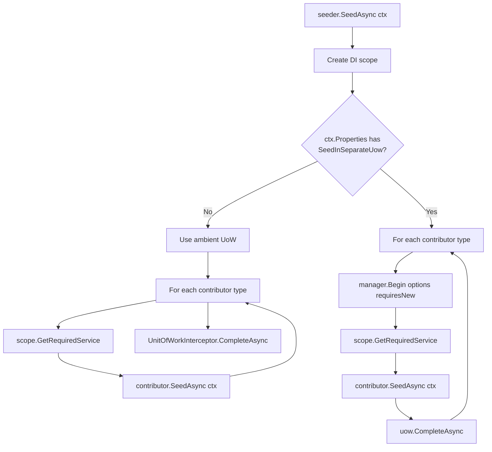
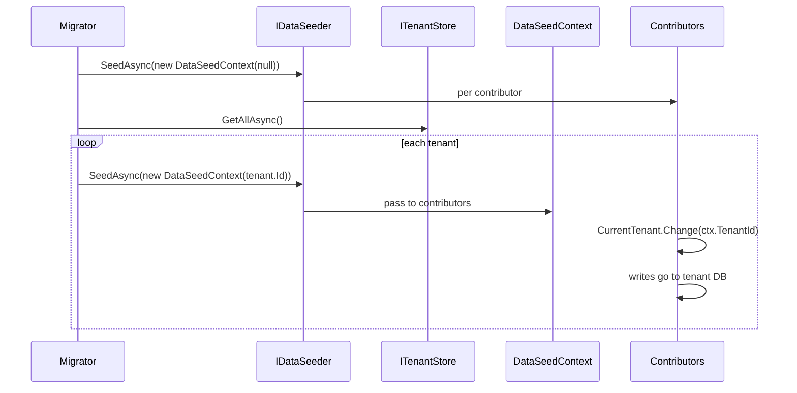

The ABP Framework's data‑seeding pipeline is a deliberately small contract: one orchestrator (`IDataSeeder`), many contributors (`IDataSeedContributor`), and a shared context (`DataSeedContext`). The pipeline runs inside a `[UnitOfWork]` so that every contributor's writes flush atomically, with an opt‑in mode to run each contributor in its own UoW. This page walks the contract files, the default `DataSeeder`, how contributors are auto‑registered, and the two execution shapes.

## The contract files

The seeding contract lives in four files under `framework/src/Volo.Abp.Data/Volo/Abp/Data/`:

| File | Purpose |
| --- | --- |
| `IDataSeeder.cs` | The orchestrator entry point. |
| `IDataSeedContributor.cs` | The unit of work a module contributes. |
| `DataSeedContext.cs` | The payload that flows from orchestrator to contributors. |
| `DataSeeder.cs` | The default implementation that iterates contributors. |
| `DataSeederExtensions.cs` | Ergonomic helpers and the well‑known property keys. |
| `AbpDataSeedOptions.cs` | The options that hold the contributor type list. |
| `DataSeedContributorList.cs` | `TypeList<IDataSeedContributor>`. |

The contracts are minimal — a single `SeedAsync(DataSeedContext)` on both sides:

```csharp
public interface IDataSeeder
{
    Task SeedAsync(DataSeedContext context);
}

public interface IDataSeedContributor
{
    Task SeedAsync(DataSeedContext context);
}
```

## The context

`Volo/Abp/Data/DataSeedContext.cs` carries the tenant id and a free‑form property bag.

```csharp
public class DataSeedContext
{
    public Guid? TenantId { get; set; }

    public object? this[string name] {
        get => Properties.GetOrDefault(name);
        set => Properties[name] = value;
    }

    public Dictionary<string, object?> Properties { get; }

    public DataSeedContext(Guid? tenantId = null)
    {
        TenantId = tenantId;
        Properties = new Dictionary<string, object?>();
    }

    public virtual DataSeedContext WithProperty(string key, object? value)
    {
        Properties[key] = value;
        return this;
    }
}
```

`TenantId` is the *target* tenant for the seed. A contributor running inside `using (CurrentTenant.Change(context.TenantId)) { ... }` will see soft‑delete, multi‑tenant and audit filters as if a user from that tenant were logged in.

## Auto‑registering contributors

`AbpDataModule.PreConfigureServices` walks every type registered with the DI container and adds those implementing `IDataSeedContributor` to `AbpDataSeedOptions.Contributors`. The relevant excerpt from `Volo/Abp/Data/AbpDataModule.cs`:

```csharp
private static void AutoAddDataSeedContributors(IServiceCollection services)
{
    var contributors = new List<Type>();

    services.OnRegistered(context =>
    {
        if (typeof(IDataSeedContributor).IsAssignableFrom(context.ImplementationType))
        {
            contributors.Add(context.ImplementationType);
        }
    });

    services.Configure<AbpDataSeedOptions>(options =>
    {
        options.Contributors.AddIfNotContains(contributors);
    });
}
```

Three implications:

- Writing a class that implements `IDataSeedContributor` and inheriting from `ITransientDependency` (or carrying any other conventional registrar attribute) is enough. The contributor is added to `AbpDataSeedOptions.Contributors`.
- Order is the order of DI registration. If a contributor depends on another's work, configure ordering explicitly via `Configure<AbpDataSeedOptions>(o => o.Contributors.Insert(0, typeof(MyFirst)))`.
- A contributor type that is registered as multiple service interfaces is still only added once — `AddIfNotContains` checks identity.

## The default `IDataSeeder`

`Volo/Abp/Data/DataSeeder.cs` is decorated with `[UnitOfWork]` at the method level and creates a fresh DI scope for the run. The full body is short enough to read in one block:

```csharp
public class DataSeeder : IDataSeeder, ITransientDependency
{
    protected IServiceScopeFactory ServiceScopeFactory { get; }
    protected AbpDataSeedOptions Options { get; }

    public DataSeeder(
        IOptions<AbpDataSeedOptions> options,
        IServiceScopeFactory serviceScopeFactory)
    {
        ServiceScopeFactory = serviceScopeFactory;
        Options = options.Value;
    }

    [UnitOfWork]
    public virtual async Task SeedAsync(DataSeedContext context)
    {
        using (var scope = ServiceScopeFactory.CreateScope())
        {
            if (context.Properties.ContainsKey(DataSeederExtensions.SeedInSeparateUow))
            {
                var manager = scope.ServiceProvider.GetRequiredService<IUnitOfWorkManager>();
                foreach (var contributorType in Options.Contributors)
                {
                    var options = context.Properties.TryGetValue(DataSeederExtensions.SeedInSeparateUowOptions, out var uowOptions)
                        ? (AbpUnitOfWorkOptions) uowOptions!
                        : new AbpUnitOfWorkOptions();
                    var requiresNew = context.Properties.TryGetValue(DataSeederExtensions.SeedInSeparateUowRequiresNew, out var obj) && (bool) obj!;

                    using (var uow = manager.Begin(options, requiresNew))
                    {
                        var contributor = (IDataSeedContributor)scope.ServiceProvider.GetRequiredService(contributorType);
                        await contributor.SeedAsync(context);
                        await uow.CompleteAsync();
                    }
                }
            }
            else
            {
                foreach (var contributorType in Options.Contributors)
                {
                    var contributor = (IDataSeedContributor)scope.ServiceProvider.GetRequiredService(contributorType);
                    await contributor.SeedAsync(context);
                }
            }
        }
    }
}
```

Two execution shapes are visible:

1. **Single UoW (default)** — `[UnitOfWork]` on the method means a single UoW wraps all contributors. They share a transaction; one failure rolls back every contributor that ran before it. This is the default for normal seeding.
2. **Per‑contributor UoW** — when `context.Properties[SeedInSeparateUow] == true`, the method explicitly opens a new UoW per contributor via `manager.Begin(options, requiresNew)`. A failure in one contributor does not roll back others that already completed.

## Toggle between shapes

`Volo/Abp/Data/DataSeederExtensions.cs` provides the toggle:

```csharp
public static class DataSeederExtensions
{
    public const string SeedInSeparateUow = "__SeedInSeparateUow";
    public const string SeedInSeparateUowOptions = "__SeedInSeparateUowOptions";
    public const string SeedInSeparateUowRequiresNew = "__SeedInSeparateUowRequiresNew";

    public static Task SeedAsync(this IDataSeeder seeder, Guid? tenantId = null)
    {
        return seeder.SeedAsync(new DataSeedContext(tenantId));
    }

    public static Task SeedInSeparateUowAsync(
        this IDataSeeder seeder,
        Guid? tenantId = null,
        AbpUnitOfWorkOptions? options = null,
        bool requiresNew = false)
    {
        var context = new DataSeedContext(tenantId);
        context.WithProperty(SeedInSeparateUow, true);
        context.WithProperty(SeedInSeparateUowOptions, options);
        context.WithProperty(SeedInSeparateUowRequiresNew, requiresNew);
        return seeder.SeedAsync(context);
    }
}
```

Calling `await seeder.SeedAsync()` runs the single‑UoW path. Calling `await seeder.SeedInSeparateUowAsync()` flips to per‑contributor UoWs.

## Decision sequence



## Writing a contributor

A contributor is one class with one `async` method. Inject the repositories you need, observe `context.TenantId` and switch the current tenant when applicable, and let ABP's UoW commit:

```csharp
public class CategoriesDataSeedContributor : IDataSeedContributor, ITransientDependency
{
    private readonly IRepository<Category, Guid> _categories;
    private readonly IGuidGenerator _guid;
    private readonly ICurrentTenant _currentTenant;

    public CategoriesDataSeedContributor(
        IRepository<Category, Guid> categories,
        IGuidGenerator guid,
        ICurrentTenant currentTenant)
    {
        _categories = categories;
        _guid = guid;
        _currentTenant = currentTenant;
    }

    public async Task SeedAsync(DataSeedContext context)
    {
        using (_currentTenant.Change(context.TenantId))
        {
            if (await _categories.AnyAsync()) { return; }

            await _categories.InsertManyAsync(new[]
            {
                new Category(_guid.Create(), "Books"),
                new Category(_guid.Create(), "Music"),
            }, autoSave: true);
        }
    }
}
```

The class is auto‑registered (`ITransientDependency`), auto‑added to `AbpDataSeedOptions.Contributors` (because it implements `IDataSeedContributor`), and inherits UoW behaviour from `IDataSeeder`'s `[UnitOfWork]` attribute. Nothing else is required.

<Note>
`IRepository<TEntity, TKey>.InsertManyAsync(autoSave: true)` is preferred over per‑entity `InsertAsync` because it allows EF Core to batch the SQL within the same `SaveChangesAsync` call. The behaviour ABP wires through `EfCoreRepository` is documented in [EF Core integration](/data/entity-framework-core).
</Note>

## Idempotence patterns

Contributors are expected to be idempotent — they are commonly called from the migration host *every* startup. Two common shapes:

<AccordionGroup>
  <Accordion title="Existence guard">
    `if (await _categories.AnyAsync()) { return; }` short‑circuits if the table is already populated. Cheap, but rough — partial seeds leak.
  </Accordion>
  <Accordion title="Per-entity upsert">
    For each candidate, call `await _repo.FindAsync(predicate)` and `await _repo.InsertAsync(new(...))` if `null`. Slower but resilient to partial state.
  </Accordion>
  <Accordion title="Tenant-aware guard">
    Wrap both branches in `using (_currentTenant.Change(context.TenantId))` so the existence query uses the multi‑tenant filter.
  </Accordion>
</AccordionGroup>

## Coordinating ordering

`AbpDataSeedOptions.Contributors` is a `TypeList<IDataSeedContributor>` — an ordered list with index‑based mutators. To make a contributor run first:

```csharp
Configure<AbpDataSeedOptions>(options =>
{
    options.Contributors.Insert(0, typeof(InitialReferenceDataSeedContributor));
});
```

To remove a contributor (rarely needed, useful in tests):

```csharp
Configure<AbpDataSeedOptions>(options =>
{
    options.Contributors.Remove(typeof(DefaultRolesSeedContributor));
});
```

The order is fixed at startup; it does not change between requests.

## Where seeders are called from

ABP solution templates invoke `IDataSeeder.SeedAsync` from two places:

| Caller | Path | When |
| --- | --- | --- |
| `*DbMigrationService` | `src/MyApp.DbMigrator/` console app | Manual or pipeline‑triggered migration. |
| `*MigrationManager` | `src/MyApp.HttpApi.Host/` startup | On app startup, after migrations apply (Run‑time migrator pattern). |

`EfCoreRuntimeDatabaseMigratorBase` (`framework/src/Volo.Abp.EntityFrameworkCore/Volo/Abp/EntityFrameworkCore/Migrations/EfCoreRuntimeDatabaseMigratorBase.cs`) is the runtime variant. It acquires a distributed lock before migrating and then calls into the seeder. The base class invokes `SeedAsync` inside its `LockAndApplyDatabaseMigrationsAsync`; module authors implement the abstract `SeedAsync(...)` hook.

## Multi‑tenant seeding

The migrator template iterates tenants and calls `seeder.SeedAsync(new DataSeedContext(tenant.Id))` once per tenant, after the host seed. Because `DataSeedContext.TenantId` flows through every contributor, and contributors switch `CurrentTenant`, each contributor's repository writes are stamped with the target `TenantId`.



`AbpDatabaseInfo.IsUsedByTenants` (`Volo/Abp/Data/AbpDatabaseInfo.cs`) controls whether a logical database participates in tenant seeding loops.

## Distributed events around seeding

`Volo/Abp/Data/ApplyDatabaseMigrationsEto.cs` and `Volo/Abp/Data/AppliedDatabaseMigrationsEto.cs` are the request/notification ETOs the runtime migrator publishes. A node that has seeded broadcasts `AppliedDatabaseMigrationsEto`; other nodes drop out of the lock loop when they observe it. This avoids two nodes seeding the same tenant database concurrently.

## Pitfalls

<Warning>
Do not call `IDataSeeder.SeedAsync` recursively from inside a contributor — the outer UoW is still open and a second invocation will reuse it (default mode), leading to duplicated reads of `Options.Contributors`. If you need to compose seeders, expose a helper method on a service and inject it into both contributors.
</Warning>

<Warning>
If a contributor throws and you used the default single‑UoW mode, every previously committed contributor in the same run is rolled back. To preserve partial progress, switch to `SeedInSeparateUowAsync`.
</Warning>

<Warning>
Auto‑registration only sees types registered in DI. A static class with a static `SeedAsync` does **not** get picked up; declare a non‑static class with `ITransientDependency` and implement the interface.
</Warning>

## Quick reference

| Symbol | File |
| --- | --- |
| `IDataSeeder` | `Volo/Abp/Data/IDataSeeder.cs` |
| `IDataSeedContributor` | `Volo/Abp/Data/IDataSeedContributor.cs` |
| `DataSeedContext` | `Volo/Abp/Data/DataSeedContext.cs` |
| `DataSeeder` | `Volo/Abp/Data/DataSeeder.cs` |
| `DataSeederExtensions` | `Volo/Abp/Data/DataSeederExtensions.cs` |
| `AbpDataSeedOptions` | `Volo/Abp/Data/AbpDataSeedOptions.cs` |
| `DataSeedContributorList` | `Volo/Abp/Data/DataSeedContributorList.cs` |
| `EfCoreRuntimeDatabaseMigratorBase` | `Volo/Abp/EntityFrameworkCore/Migrations/EfCoreRuntimeDatabaseMigratorBase.cs` |

## Related reading

<CardGroup cols={2}>
  <Card title="Unit of work" href="/data/unit-of-work">
    The lifecycle that wraps `DataSeeder.SeedAsync`.
  </Card>
  <Card title="GUID generation" href="/data/guid-generation">
    Contributors typically generate ids with `IGuidGenerator.Create()`.
  </Card>
  <Card title="Multi-tenancy" href="/multi-tenancy/data-isolation">
    `CurrentTenant.Change(...)` inside a contributor switches scope per tenant.
  </Card>
  <Card title="Migrations" href="/data/entity-framework-core">
    `EfCoreRuntimeDatabaseMigratorBase` orchestrates schema migrations and calls the seeder.
  </Card>
</CardGroup>
