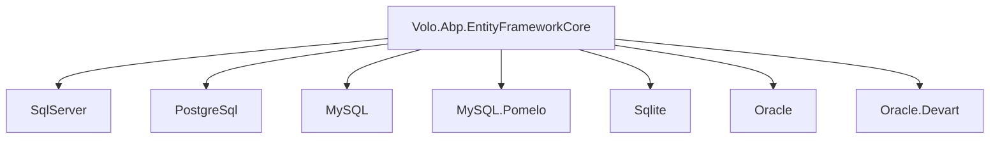
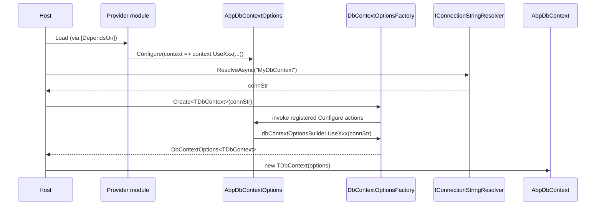
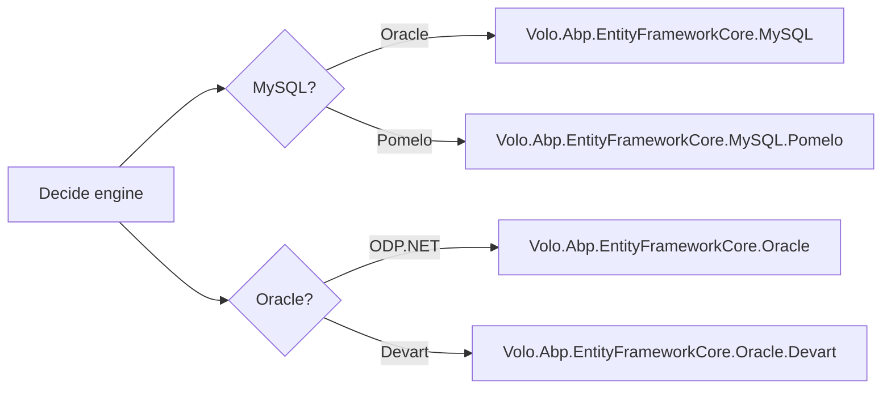

ABP keeps the database‑provider story behind small adapter packages. Each one adds a `Volo.Abp.EntityFrameworkCore.<Vendor>` module that depends on `AbpEntityFrameworkCoreModule`, exposes an `AbpDbContextOptions.UseXxx(...)` extension that delegates to the underlying EF Core provider's `UseSqlServer/UseNpgsql/UseSqlite/UseOracle/UseMySQL` builder, and registers a connection‑string checker for the engine. This page walks each of the seven provider packages and lists the file paths, module hooks, and `SequentialGuidType` chosen as default.

## Package matrix

| Provider | Package | Module file | `AbpDbContextOptions` extension | Connection checker | Default `SequentialGuidType` |
| --- | --- | --- | --- | --- | --- |
| SQL Server | `Volo.Abp.EntityFrameworkCore.SqlServer` | `Volo/Abp/EntityFrameworkCore/SqlServer/AbpEntityFrameworkCoreSqlServerModule.cs` | `UseSqlServer` | `SqlServerConnectionStringChecker` | `SequentialAtEnd` |
| PostgreSQL | `Volo.Abp.EntityFrameworkCore.PostgreSql` | `Volo/Abp/EntityFrameworkCore/PostgreSql/AbpEntityFrameworkCorePostgreSqlModule.cs` | `UseNpgsql` (and obsolete `UsePostgreSql`) | `NpgsqlConnectionStringChecker` | `SequentialAsString` |
| MySQL (Oracle MySQL.EntityFrameworkCore) | `Volo.Abp.EntityFrameworkCore.MySQL` | `Volo/Abp/EntityFrameworkCore/MySQL/AbpEntityFrameworkCoreMySQLModule.cs` | `UseMySQL` | `MySQLConnectionStringChecker` | `SequentialAsString` |
| MySQL (Pomelo) | `Volo.Abp.EntityFrameworkCore.MySQL.Pomelo` | `Volo/Abp/EntityFrameworkCore/MySQL/AbpEntityFrameworkCoreMySQLPomeloModule.cs` | `UseMySQL` | `PomeloMySQLConnectionStringChecker` | `SequentialAsString` |
| SQLite | `Volo.Abp.EntityFrameworkCore.Sqlite` | `Volo/Abp/EntityFrameworkCore/Sqlite/AbpEntityFrameworkCoreSqliteModule.cs` | `UseSqlite` | `SqliteConnectionStringChecker` | (inherits SqlServer default) |
| Oracle (ODP.NET) | `Volo.Abp.EntityFrameworkCore.Oracle` | `Volo/Abp/EntityFrameworkCore/Oracle/AbpEntityFrameworkCoreOracleModule.cs` | `UseOracle` | `OracleConnectionStringChecker` | `SequentialAsBinary` |
| Oracle (Devart) | `Volo.Abp.EntityFrameworkCore.Oracle.Devart` | `Volo/Abp/EntityFrameworkCore/Oracle/Devart/AbpEntityFrameworkCoreOracleDevartModule.cs` | `UseOracle` | `OracleDevartConnectionStringChecker` | `SequentialAsBinary` |

Every provider module depends on `typeof(AbpEntityFrameworkCoreModule)` so loading one transitively brings the core integration in.



## The common shape

The four files in every provider package are predictable:

```
<root>/Volo/Abp/EntityFrameworkCore/AbpDbContextOptions<Vendor>Extensions.cs
<root>/Volo/Abp/EntityFrameworkCore/AbpDbContextConfigurationContext<Vendor>Extensions.cs
<root>/Volo/Abp/EntityFrameworkCore/ConnectionStrings/<Vendor>ConnectionStringChecker.cs
<root>/Volo/Abp/EntityFrameworkCore/<Vendor>/AbpEntityFrameworkCore<Vendor>Module.cs
```

Plus, sometimes, a `Microsoft/EntityFrameworkCore/Abp<Vendor>ModelBuilderExtensions.cs` that calls `modelBuilder.SetDatabaseProvider(EfCoreDatabaseProvider.<Vendor>)` for design‑time scenarios.

The extension methods are thin wrappers around the EF Core builder. The pattern is identical across providers — only the type of the inner builder changes.

## SQL Server

### Extensions

`framework/src/Volo.Abp.EntityFrameworkCore.SqlServer/Volo/Abp/EntityFrameworkCore/AbpDbContextOptionsSqlServerExtensions.cs`:

```csharp
public static class AbpDbContextOptionsSqlServerExtensions
{
    public static void UseSqlServer(
        [NotNull] this AbpDbContextOptions options,
        Action<SqlServerDbContextOptionsBuilder>? sqlServerOptionsAction = null)
    {
        options.Configure(context =>
        {
            context.UseSqlServer(sqlServerOptionsAction);
        });
    }

    public static void UseSqlServer<TDbContext>(
        [NotNull] this AbpDbContextOptions options,
        Action<SqlServerDbContextOptionsBuilder>? sqlServerOptionsAction = null)
        where TDbContext : AbpDbContext<TDbContext>
    {
        options.Configure<TDbContext>(context =>
        {
            context.UseSqlServer(sqlServerOptionsAction);
        });
    }
}
```

Two overloads: one default (applies to every DbContext registered through `AddAbpDbContext`), one typed (applies only to a specific `TDbContext`).

### Module

```csharp
[DependsOn(typeof(AbpEntityFrameworkCoreModule))]
public class AbpEntityFrameworkCoreSqlServerModule : AbpModule
{
    public override void ConfigureServices(ServiceConfigurationContext context)
    {
        Configure<AbpSequentialGuidGeneratorOptions>(options =>
        {
            if (options.DefaultSequentialGuidType == null)
            {
                options.DefaultSequentialGuidType = SequentialGuidType.SequentialAtEnd;
            }
        });

        Configure<AbpEfCoreGlobalFilterOptions>(options =>
        {
            options.UseDbFunction = true;
        });
    }
}
```

`UseDbFunction = true` is the key — SQL Server supports user‑defined functions in query filters, so ABP uses the DB‑function path described in [Data filtering](/data/data-filtering) to keep filter state out of the query cache key.

### Checker

`SqlServerConnectionStringChecker` connects to `master`, switches catalogs:

```csharp
[Dependency(ReplaceServices = true)]
public class SqlServerConnectionStringChecker : IConnectionStringChecker, ITransientDependency
{
    public virtual async Task<AbpConnectionStringCheckResult> CheckAsync(string connectionString)
    {
        var result = new AbpConnectionStringCheckResult();
        try
        {
            var connString = new SqlConnectionStringBuilder(connectionString) { ConnectTimeout = 1 };
            var oldDatabaseName = connString.InitialCatalog;
            connString.InitialCatalog = "master";
            await using var conn = new SqlConnection(connString.ConnectionString);
            await conn.OpenAsync();
            result.Connected = true;
            await conn.ChangeDatabaseAsync(oldDatabaseName);
            result.DatabaseExists = true;
            await conn.CloseAsync();
            return result;
        }
        catch (Exception) { return result; }
    }
}
```

## PostgreSQL (Npgsql)

### Extensions

The PostgreSQL package keeps the historical `UsePostgreSql` for back‑compat and exposes the canonical `UseNpgsql`:

```csharp
public static class AbpDbContextOptionsPostgreSqlExtensions
{
    [Obsolete("Use 'UseNpgsql(...)' method instead. This will be removed in future versions.")]
    public static void UsePostgreSql(
        this AbpDbContextOptions options,
        Action<NpgsqlDbContextOptionsBuilder>? postgreSqlOptionsAction = null)
    {
        options.Configure(context =>
        {
            context.UseNpgsql(postgreSqlOptionsAction);
        });
    }

    public static void UseNpgsql(
        this AbpDbContextOptions options,
        Action<NpgsqlDbContextOptionsBuilder>? postgreSqlOptionsAction = null)
    {
        options.Configure(context =>
        {
            context.UseNpgsql(postgreSqlOptionsAction);
        });
    }
    // typed overloads...
}
```

### Module

```csharp
public class AbpEntityFrameworkCorePostgreSqlModule : AbpModule
{
    public override void ConfigureServices(ServiceConfigurationContext context)
    {
        Configure<AbpSequentialGuidGeneratorOptions>(options =>
        {
            if (options.DefaultSequentialGuidType == null)
                options.DefaultSequentialGuidType = SequentialGuidType.SequentialAsString;
        });
        Configure<AbpEfCoreGlobalFilterOptions>(options => { options.UseDbFunction = true; });
    }
}
```

The model‑builder extension `framework/src/Volo.Abp.EntityFrameworkCore.PostgreSql/Microsoft/EntityFrameworkCore/AbpPostgreSqlModelBuilderExtensions.cs` adds:

```csharp
public static void UsePostgreSql(this ModelBuilder modelBuilder)
{
    modelBuilder.SetDatabaseProvider(EfCoreDatabaseProvider.PostgreSql);
}
```

This is consumed in design‑time scenarios where there is no live `Database.ProviderName` to inspect.

## MySQL (Oracle MySql.EntityFrameworkCore)

### Extensions

`framework/src/Volo.Abp.EntityFrameworkCore.MySQL/Volo/Abp/EntityFrameworkCore/AbpDbContextOptionsMySQLExtensions.cs`:

```csharp
public static void UseMySQL(
    this AbpDbContextOptions options,
    Action<MySql.EntityFrameworkCore.Infrastructure.MySQLDbContextOptionsBuilder>? mySQLOptionsAction = null)
{
    options.Configure(context => { context.UseMySQL(mySQLOptionsAction); });
}
```

Type lives in `MySql.EntityFrameworkCore.Infrastructure` — Oracle's official EF Core provider.

### Module

```csharp
public class AbpEntityFrameworkCoreMySQLModule : AbpModule
{
    public override void ConfigureServices(ServiceConfigurationContext context)
    {
        Configure<AbpSequentialGuidGeneratorOptions>(options =>
        {
            if (options.DefaultSequentialGuidType == null)
                options.DefaultSequentialGuidType = SequentialGuidType.SequentialAsString;
        });
        Configure<AbpEfCoreGlobalFilterOptions>(options => { options.UseDbFunction = true; });
    }
}
```

## MySQL (Pomelo)

A second MySQL package targets Pomelo.EntityFrameworkCore.MySql, the most popular community provider. The shape is identical, but the inner builder type lives in a different namespace:

```csharp
public static class AbpDbContextOptionsMySQLExtensions
{
    public static void UseMySQL(
        this AbpDbContextOptions options,
        Action<MySqlDbContextOptionsBuilder>? mySQLOptionsAction = null)
    {
        options.Configure(context => { context.UseMySQL(mySQLOptionsAction); });
    }
}
```

(`MySqlDbContextOptionsBuilder` is in `Microsoft.EntityFrameworkCore.Infrastructure` namespace under Pomelo.)

The module file sets the same `SequentialAsString` default and `UseDbFunction = true`.

<Warning>
The two MySQL packages share the same public extension name (`UseMySQL`). Reference only one of them per host project; they cannot coexist because of the duplicate extension method.
</Warning>

## SQLite

The SQLite package is the only one with an extra options carrier and an interceptor.

### Options

`framework/src/Volo.Abp.EntityFrameworkCore.Sqlite/Volo/Abp/EntityFrameworkCore/AbpSqliteOptions.cs`:

```csharp
public class AbpSqliteOptions
{
    public int? BusyTimeout { get; set; }
}
```

### Extension

```csharp
public static class AbpDbContextOptionsSqliteExtensions
{
    public static void UseSqlite(
        this AbpDbContextOptions options,
        Action<SqliteDbContextOptionsBuilder>? sqliteOptionsAction = null)
    {
        options.Configure(context => { context.UseSqlite(sqliteOptionsAction); });
    }
}
```

### Module

The SQLite module wires the `AbpSqliteOptions.BusyTimeout` into a save‑changes interceptor:

```csharp
public class AbpEntityFrameworkCoreSqliteModule : AbpModule
{
    public override void PreConfigureServices(ServiceConfigurationContext context)
    {
        PreConfigure<AbpSqliteOptions>(options => { options.BusyTimeout = 5000; });
    }

    public override void ConfigureServices(ServiceConfigurationContext context)
    {
        Configure<AbpEfCoreGlobalFilterOptions>(options => { options.UseDbFunction = true; });

        var sqliteOptions = context.Services.ExecutePreConfiguredActions<AbpSqliteOptions>();
        if (sqliteOptions.BusyTimeout.HasValue)
        {
            Configure<AbpDbContextOptions>(options =>
            {
                options.ConfigureDefaultOnConfiguring((dbContext, dbContextOptionsBuilder) =>
                {
                    if (dbContextOptionsBuilder.Options.Extensions.Any(extension => extension is SqliteOptionsExtension))
                    {
                        dbContextOptionsBuilder.AddInterceptors(
                            new SqliteBusyTimeoutSaveChangesInterceptor(sqliteOptions.BusyTimeout.Value));
                    }
                }, overrideExisting: false);
            });
        }
    }
}
```

The interceptor (`Volo/Abp/EntityFrameworkCore/Interceptors/SqliteBusyTimeoutSaveChangesInterceptor.cs`) issues `PRAGMA busy_timeout = N` before every save so concurrent writers don't immediately raise `SQLITE_BUSY`.

### Test helper

The package also ships `AbpUnitTestSqliteConnection`:

```csharp
public class AbpUnitTestSqliteConnection : SqliteConnection
{
    public AbpUnitTestSqliteConnection(string connectionString) : base(connectionString) { }
    public override SqliteCommand CreateCommand() => new AbpSqliteCommand { /* ... */ };
}

internal class AbpSqliteCommand : SqliteCommand
{
    private readonly static SemaphoreSlim Semaphore = new SemaphoreSlim(1, 1);
    // serialises Connection setter / Dispose
}
```

It serialises command creation and disposal with a global semaphore so parallel xUnit tests sharing one in‑memory SQLite connection don't trip over Sqlite's non‑thread‑safety.

## Oracle (ODP.NET)

```csharp
public static class AbpDbContextOptionsOracleExtensions
{
    public static void UseOracle(
        this AbpDbContextOptions options,
        Action<OracleDbContextOptionsBuilder>? oracleOptionsAction = null)
    {
        options.Configure(context => { context.UseOracle(oracleOptionsAction); });
    }
}
```

The module sets `SequentialAsBinary` (Oracle stores GUIDs as `RAW(16)` and sorts them by byte order):

```csharp
public class AbpEntityFrameworkCoreOracleModule : AbpModule
{
    public override void ConfigureServices(ServiceConfigurationContext context)
    {
        Configure<AbpSequentialGuidGeneratorOptions>(options =>
        {
            if (options.DefaultSequentialGuidType == null)
                options.DefaultSequentialGuidType = SequentialGuidType.SequentialAsBinary;
        });
        Configure<AbpEfCoreGlobalFilterOptions>(options => { options.UseDbFunction = true; });
    }
}
```

## Oracle (Devart)

Devart's `dotConnect for Oracle` provider has a slightly different `OracleDbContextOptionsBuilder` and an extra `useExistingConnectionIfAvailable` parameter:

```csharp
public static class AbpDbContextOptionsOracleDevartExtensions
{
    public static void UseOracle(
        this AbpDbContextOptions options,
        Action<OracleDbContextOptionsBuilder>? oracleOptionsAction = null,
        bool useExistingConnectionIfAvailable = false)
    {
        options.Configure(context => { context.UseOracle(oracleOptionsAction, useExistingConnectionIfAvailable); });
    }
    // typed overload ...
}
```

The module sets `SequentialAsBinary` like the standard Oracle package.

## What happens at runtime



The `UseXxx` extension method is queued into `AbpDbContextOptions` at module startup; `DbContextOptionsFactory.Create<TDbContext>` plays the queue back when the host is asked for a `DbContextOptions<TDbContext>` instance.

## Choosing between two providers for one engine

Some teams want to switch between Pomelo and Oracle MySQL, or between Oracle and Devart Oracle. Because each provider's extension methods occupy the same symbol (`UseMySQL`, `UseOracle`), the choice is package‑level — you reference one or the other in the project file. There is no flag at runtime.



## `EfCoreDatabaseProvider` enum

The base context decides which provider it talks to via `Database.ProviderName` and `EfCoreDatabaseProvider` (`Volo/Abp/EntityFrameworkCore/EfCoreDatabaseProvider.cs`). The mapping in `AbpDbContext.GetDatabaseProviderOrNull`:

```csharp
switch (Database.ProviderName)
{
    case "Microsoft.EntityFrameworkCore.SqlServer": return EfCoreDatabaseProvider.SqlServer;
    case "Npgsql.EntityFrameworkCore.PostgreSQL": return EfCoreDatabaseProvider.PostgreSql;
    case "Pomelo.EntityFrameworkCore.MySql":
    case "MySql.Data.MySqlClient":                  return EfCoreDatabaseProvider.MySql;
    case "Oracle.EntityFrameworkCore":
    case "Devart.Data.Oracle.Entity.EFCore":        return EfCoreDatabaseProvider.Oracle;
    case "Microsoft.EntityFrameworkCore.Sqlite":    return EfCoreDatabaseProvider.Sqlite;
    case "Microsoft.EntityFrameworkCore.InMemory":  return EfCoreDatabaseProvider.InMemory;
    case "FirebirdSql.EntityFrameworkCore.Firebird": return EfCoreDatabaseProvider.Firebird;
    case "Microsoft.EntityFrameworkCore.Cosmos":    return EfCoreDatabaseProvider.Cosmos;
    default: return null;
}
```

Modules that need provider‑aware behaviour (e.g. naming conventions, sequence support) inspect this enum rather than the raw provider string.

## Default‑value summary

| Provider | Default `SequentialGuidType` | Reason |
| --- | --- | --- |
| SQL Server | `SequentialAtEnd` | `uniqueidentifier` sorts on last 6 bytes. |
| PostgreSQL | `SequentialAsString` | `uuid` text comparisons. |
| MySQL (both) | `SequentialAsString` | `CHAR(36)` lex order. |
| Oracle (both) | `SequentialAsBinary` | `RAW(16)` byte‑array order. |
| SQLite | (inherits) | No override — uses SQL Server default. |

## Provider module dependencies

| Module | DependsOn |
| --- | --- |
| `AbpEntityFrameworkCoreSqlServerModule` | `AbpEntityFrameworkCoreModule` |
| `AbpEntityFrameworkCorePostgreSqlModule` | `AbpEntityFrameworkCoreModule` |
| `AbpEntityFrameworkCoreMySQLModule` | `AbpEntityFrameworkCoreModule` |
| `AbpEntityFrameworkCoreMySQLPomeloModule` | `AbpEntityFrameworkCoreModule` |
| `AbpEntityFrameworkCoreSqliteModule` | `AbpEntityFrameworkCoreModule` |
| `AbpEntityFrameworkCoreOracleModule` | `AbpEntityFrameworkCoreModule` |
| `AbpEntityFrameworkCoreOracleDevartModule` | `AbpEntityFrameworkCoreModule` |

## Pitfalls

<Warning>
The `AbpDbContextOptions.UseXxx(...)` extensions queue an `Action<AbpDbContextConfigurationContext>` for *every* DbContext. If you have multiple DbContext types pointing at different engines, call the typed overload (`UseSqlServer<TDbContext>(...)`) instead.
</Warning>

<Warning>
`UseDbFunction = true` is enabled by every provider module. This requires the provider's EF Core integration to support DB functions in model builders. Custom providers that don't may need `Configure<AbpEfCoreGlobalFilterOptions>(o => o.UseDbFunction = false)`.
</Warning>

<Warning>
SQLite's `BusyTimeout` interceptor is registered through `ConfigureDefaultOnConfiguring(..., overrideExisting: false)`. If your own module replaces the default action with `overrideExisting: true`, the busy timeout interceptor will silently disappear.
</Warning>

## Related reading

<CardGroup cols={2}>
  <Card title="EF Core integration" href="/data/entity-framework-core">
    The core package that every provider builds on.
  </Card>
  <Card title="Connection strings" href="/data/connection-strings">
    Where the connection‑string checker fits in.
  </Card>
  <Card title="GUID generation" href="/data/guid-generation">
    Why each provider chooses a particular `SequentialGuidType`.
  </Card>
  <Card title="Data filtering" href="/data/data-filtering">
    How `UseDbFunction = true` affects the SQL emitted for global filters.
  </Card>
</CardGroup>
