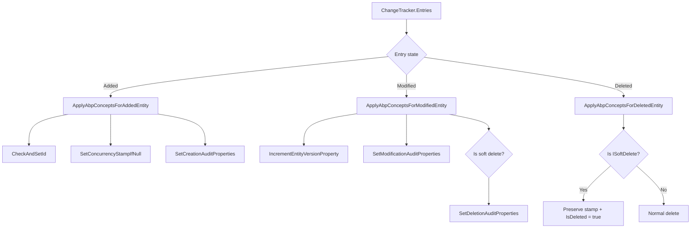
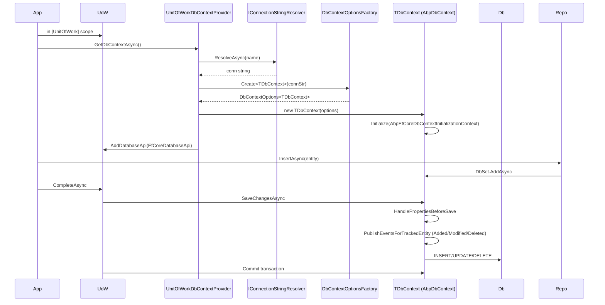
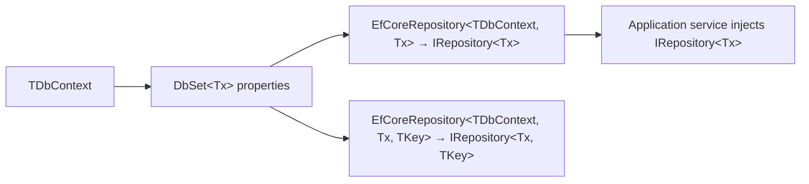

ABP's Entity Framework Core integration lives in `framework/src/Volo.Abp.EntityFrameworkCore/` and adds three concerns on top of vanilla EF Core: a UoW‑aware `DbContext` provider, an `AbpDbContext<TDbContext>` base that injects ABP concepts (audit, soft delete, multi‑tenant filter, concurrency stamp, sequential Guid) into the save pipeline, and a repository (`EfCoreRepository<TDbContext, TEntity>`) that implements the provider‑neutral `IRepository<TEntity>` contract. This page is the runtime story of how a request becomes a `SaveChangesAsync` call against a SQL Server connection.

## The four anchor files

| File | Role |
| --- | --- |
| `Volo/Abp/EntityFrameworkCore/AbpDbContext.cs` | Base class that overrides `OnModelCreating` and `SaveChangesAsync` to wire ABP concepts. |
| `Volo/Abp/EntityFrameworkCore/AbpDbContextOptions.cs` | Options carrier with `Configure` / `ConfigureConventions` / `ConfigureDefaultOnModelCreating` hooks. |
| `Volo/Abp/Uow/EntityFrameworkCore/UnitOfWorkDbContextProvider.cs` | Resolves a `TDbContext` for the active UoW, caching by connection string. |
| `Volo/Abp/Domain/Repositories/EntityFrameworkCore/EfCoreRepository.cs` | Implements `IRepository<TEntity>` over a `DbSet`. |

The supporting cast (value converters, value comparers, navigation helpers, model‑builder extensions, runtime migrator base) all hang off these four anchors.

## Module wiring

`framework/src/Volo.Abp.EntityFrameworkCore/Volo/Abp/EntityFrameworkCore/AbpEntityFrameworkCoreModule.cs` declares a dependency on `AbpDddDomainModule` and registers the provider and outbox/inbox services:

```csharp
[DependsOn(typeof(AbpDddDomainModule))]
public class AbpEntityFrameworkCoreModule : AbpModule
{
    public override void ConfigureServices(ServiceConfigurationContext context)
    {
        Configure<AbpDbContextOptions>(options =>
        {
            options.PreConfigure(abpDbContextConfigurationContext =>
            {
                abpDbContextConfigurationContext.DbContextOptions
                    .ConfigureWarnings(warnings =>
                    {
                        warnings.Ignore(CoreEventId.LazyLoadOnDisposedContextWarning);
                    });
            });
        });

        context.Services.TryAddTransient(typeof(IDbContextProvider<>), typeof(UnitOfWorkDbContextProvider<>));
        context.Services.AddTransient(typeof(IDbContextEventOutbox<>), typeof(DbContextEventOutbox<>));
        context.Services.AddTransient(typeof(IDbContextEventInbox<>), typeof(DbContextEventInbox<>));

        Configure<AbpDistributedEntityEventOptions>(options =>
        {
            options.IgnoredEventSelectors.Add<OutgoingEventRecord>();
            options.IgnoredEventSelectors.Add<IncomingEventRecord>();
        });
    }
}
```

The single line `TryAddTransient(typeof(IDbContextProvider<>), typeof(UnitOfWorkDbContextProvider<>))` is what makes `IDbContextProvider<TDbContext>` resolvable everywhere.

## `AddAbpDbContext`

The host registers DbContexts via the extension in `framework/src/Volo.Abp.EntityFrameworkCore/Microsoft/Extensions/DependencyInjection/AbpEfCoreServiceCollectionExtensions.cs`:

```csharp
public static IServiceCollection AddAbpDbContext<TDbContext>(
    this IServiceCollection services,
    Action<IAbpDbContextRegistrationOptionsBuilder>? optionsBuilder = null)
    where TDbContext : AbpDbContext<TDbContext>
{
    services.AddMemoryCache();
    var options = new AbpDbContextRegistrationOptions(typeof(TDbContext), services);

    var replacedMultiTenantDbContextTypes = typeof(TDbContext)
        .GetCustomAttributes<ReplaceDbContextAttribute>(true)
        .SelectMany(x => x.ReplacedDbContextTypes).ToList();

    foreach (var dbContextType in replacedMultiTenantDbContextTypes)
    {
        options.ReplaceDbContext(dbContextType.Type, multiTenancySides: dbContextType.MultiTenancySide);
    }

    optionsBuilder?.Invoke(options);
    services.TryAddTransient(DbContextOptionsFactory.Create<TDbContext>);

    foreach (var entry in options.ReplacedDbContextTypes)
    {
        var originalDbContextType = entry.Key.Type;
        var targetDbContextType = entry.Value ?? typeof(TDbContext);

        services.Replace(ServiceDescriptor.Transient(originalDbContextType, sp =>
        {
            var dbContextType = sp.GetRequiredService<IEfCoreDbContextTypeProvider>()
                .GetDbContextType(originalDbContextType);
            return sp.GetRequiredService(dbContextType);
        }));

        services.Configure<AbpDbContextOptions>(opts =>
        {
            var multiTenantDbContextType = new MultiTenantDbContextType(originalDbContextType, entry.Key.MultiTenancySide);
            opts.DbContextReplacements[multiTenantDbContextType] = targetDbContextType;
        });
    }

    new EfCoreRepositoryRegistrar(options).AddRepositories();
    return services;
}
```

Three side effects:

1. `DbContextOptionsFactory.Create<TDbContext>` is registered so EF Core can build the `DbContextOptions<TDbContext>` lazily once a connection string is known.
2. Every `[ReplaceDbContext]` declaration is honoured — modules can plug their own DbContext class into another module's seam.
3. `EfCoreRepositoryRegistrar` walks every `IEntity` type in the DbContext and registers a `EfCoreRepository<TDbContext, TEntity>` (and the `<TEntity, TKey>` overload) implementation of `IRepository<TEntity>`.

## `AbpDbContext<TDbContext>` — anatomy

`AbpDbContext.cs` is the largest file in the package (~1,000 lines). The header declares the rich set of lazily‑resolved services:

```csharp
public abstract class AbpDbContext<TDbContext> : DbContext, IAbpEfCoreDbContext, IAbpEfCoreDbFunctionContext, ITransientDependency
    where TDbContext : DbContext
{
    public IAbpLazyServiceProvider LazyServiceProvider { get; set; } = default!;

    protected virtual Guid? CurrentTenantId => CurrentTenant?.Id;
    protected virtual bool IsMultiTenantFilterEnabled => DataFilter?.IsEnabled<IMultiTenant>() ?? false;
    protected virtual bool IsSoftDeleteFilterEnabled => DataFilter?.IsEnabled<ISoftDelete>() ?? false;

    public ICurrentTenant CurrentTenant => LazyServiceProvider.LazyGetRequiredService<ICurrentTenant>();
    public IGuidGenerator GuidGenerator => LazyServiceProvider.LazyGetService<IGuidGenerator>(SimpleGuidGenerator.Instance);
    public IDataFilter DataFilter => LazyServiceProvider.LazyGetRequiredService<IDataFilter>();
    public IEntityChangeEventHelper EntityChangeEventHelper => LazyServiceProvider.LazyGetService<IEntityChangeEventHelper>(NullEntityChangeEventHelper.Instance);
    public IAuditPropertySetter AuditPropertySetter => LazyServiceProvider.LazyGetRequiredService<IAuditPropertySetter>();
    // ... (clock, audit log, event buses, navigation helper, options) ...
}
```

The `LazyServiceProvider` pattern means a DbContext can be instantiated by EF Core's tooling (which doesn't run inside ABP DI) and still work — every dependency is resolved on first use.

### `OnModelCreating`

```csharp
protected override void OnModelCreating(ModelBuilder modelBuilder)
{
    base.OnModelCreating(modelBuilder);
    TrySetDatabaseProvider(modelBuilder);

    foreach (var entityType in modelBuilder.Model.GetEntityTypes().ToArray())
    {
        ConfigureEntityTypeProperties(modelBuilder, entityType);
    }

    if (LazyServiceProvider == null || Options == null) { return; }

    Options.Value.DefaultOnModelCreatingAction?.Invoke(this, modelBuilder);
    foreach (var onModelCreatingAction in Options.Value.OnModelCreatingActions.GetOrDefault(typeof(TDbContext)) ?? [])
    {
        onModelCreatingAction.As<Action<DbContext, ModelBuilder>>().Invoke(this, modelBuilder);
    }
}
```

The body has two phases:

1. **Per‑entity configuration** — calls `ConfigureEntityTypeProperties` which fans out to three private generic methods via reflection.
2. **Module‑contributed actions** — invokes default actions registered through `AbpDbContextOptions.ConfigureDefaultOnModelCreating` and per‑DbContext actions from `OnModelCreatingActions`.

`ConfigureEntityTypeProperties` runs three methods per entity type:

```csharp
protected virtual void ConfigureEntityTypeProperties(ModelBuilder modelBuilder, IMutableEntityType entityType)
{
    ConfigureBasePropertiesMethodInfo
        .MakeGenericMethod(entityType.ClrType)
        .Invoke(this, new object[] { modelBuilder, entityType });
    ConfigureValueConverterMethodInfo
        .MakeGenericMethod(entityType.ClrType)
        .Invoke(this, new object[] { modelBuilder, entityType });
    ConfigureValueGeneratedMethodInfo
        .MakeGenericMethod(entityType.ClrType)
        .Invoke(this, new object[] { modelBuilder, entityType });
}
```

`ConfigureBaseProperties<TEntity>` calls `entityTypeBuilder.ConfigureByConvention()` (an extension in `AbpEntityTypeBuilderExtensions.cs`) and then `ConfigureGlobalFilters<TEntity>` which composes the soft‑delete and multi‑tenant predicates.

### `ConfigureGlobalFilters` + `CreateFilterExpression`

```csharp
protected virtual void ConfigureGlobalFilters<TEntity>(
    ModelBuilder modelBuilder,
    IMutableEntityType mutableEntityType,
    EntityTypeBuilder<TEntity> entityTypeBuilder)
    where TEntity : class
{
    if (mutableEntityType.BaseType == null && ShouldFilterEntity<TEntity>(mutableEntityType))
    {
        var filterExpression = CreateFilterExpression<TEntity>(modelBuilder, entityTypeBuilder);
        if (filterExpression != null)
        {
            entityTypeBuilder.HasAbpQueryFilter(filterExpression);
        }
    }
}

protected virtual bool ShouldFilterEntity<TEntity>(IMutableEntityType entityType) where TEntity : class
{
    if (typeof(IMultiTenant).IsAssignableFrom(typeof(TEntity))) return true;
    if (typeof(ISoftDelete).IsAssignableFrom(typeof(TEntity))) return true;
    return false;
}
```

`HasAbpQueryFilter` (in `AbpModelBuilderExtensions.cs`) layers on top of EF Core's `HasQueryFilter`. The expression body is in [Data filtering](/data/data-filtering).

### `SaveChangesAsync` — the heart

```csharp
public async override Task<int> SaveChangesAsync(bool acceptAllChangesOnSuccess, CancellationToken cancellationToken = default)
{
    try
    {
        await PublishEventsForChangedEntityOnSaveChangeAsync();

        var auditLog = AuditingManager?.Current?.Log;
        List<EntityChangeInfo>? entityChangeList = null;
        if (auditLog != null)
        {
            EntityHistoryHelper.InitializeNavigationHelper(AbpEfCoreNavigationHelper);
            entityChangeList = EntityHistoryHelper.CreateChangeList(ChangeTracker.Entries().ToList());
        }

        HandlePropertiesBeforeSave();

        var eventReport = CreateEventReport();

        var result = await base.SaveChangesAsync(acceptAllChangesOnSuccess, cancellationToken);

        PublishEntityEvents(eventReport);

        if (entityChangeList != null)
        {
            EntityHistoryHelper.UpdateChangeList(entityChangeList);
            auditLog!.EntityChanges.AddRange(entityChangeList);
            // ... log debug summary ...
        }

        return result;
    }
    catch (DbUpdateConcurrencyException ex)
    {
        // ... log + throw AbpDbConcurrencyException ...
    }
    finally
    {
        ChangeTracker.AutoDetectChangesEnabled = true;
        AbpEfCoreNavigationHelper.ResetChangedFlags();
        // ... clear navigation helper when UoW completes ...
    }
}
```

`HandlePropertiesBeforeSave` walks every `ChangeTracker.Entries()` and dispatches to the per‑entity hooks:

```csharp
protected virtual void HandlePropertiesBeforeSave()
{
    var entries = ChangeTracker.Entries().ToList();
    foreach (var entry in entries)
    {
        HandleExtraPropertiesOnSave(entry);
        if (entry.State.IsIn(EntityState.Modified, EntityState.Deleted))
        {
            UpdateConcurrencyStamp(entry);
        }
    }
    // ... and PublishEventsForTrackedEntity per entry ...
}
```

`PublishEventsForTrackedEntity` is the dispatch table that routes each state to its `ApplyAbpConceptsFor*` method.



The full text of each `ApplyAbpConceptsFor*` method is examined in [Concurrency check](/data/concurrency-check) and in the [Unit of work lifecycle flow](/flows/unit-of-work-lifecycle).

## Value converters

`framework/src/Volo.Abp.EntityFrameworkCore/Volo/Abp/EntityFrameworkCore/ValueConverters/AbpDateTimeValueConverter.cs` normalises all `DateTime` properties through `IClock`:

```csharp
public class AbpDateTimeValueConverter : ValueConverter<DateTime, DateTime>
{
    public AbpDateTimeValueConverter(IClock clock, ConverterMappingHints? mappingHints = null)
        : base(
            x => clock.Normalize(x),
            x => clock.Normalize(x), mappingHints)
    {
    }
}

public class AbpNullableDateTimeValueConverter : ValueConverter<DateTime?, DateTime?>
{
    public AbpNullableDateTimeValueConverter(IClock clock, ConverterMappingHints? mappingHints = null)
        : base(
            x => x.HasValue ? clock.Normalize(x.Value) : x,
            x => x.HasValue ? clock.Normalize(x.Value) : x, mappingHints)
    {
    }
}
```

`ConfigureValueConverter<TEntity>` opts every `DateTime` and `DateTime?` property in unless decorated with `[DisableDateTimeNormalization]`. The same code also skips owned types and types decorated with `[Owned]`.

`framework/src/Volo.Abp.EntityFrameworkCore/Volo/Abp/EntityFrameworkCore/ValueConverters/ExtraPropertiesValueConverter.cs` serialises the `ExtraPropertyDictionary` to JSON via `System.Text.Json`:

```csharp
public class ExtraPropertiesValueConverter<TEntityType> : ValueConverter<ExtraPropertyDictionary, string>
{
    public ExtraPropertiesValueConverter()
        : base(
            d => SerializeObject(d),
            s => DeserializeObject(s))
    {
    }
    // ... SerializeObject / DeserializeObject implementations ...
}
```

The serialise step filters out object‑extension properties that map to *real* columns (so they are not written twice). The deserialise step re‑hydrates extension properties using `ObjectExtensionManager` metadata.

The companion value comparer in `Volo/Abp/EntityFrameworkCore/ValueComparers/ExtraPropertyDictionaryValueComparer.cs` ensures EF Core can detect changes inside the dictionary:

```csharp
public class ExtraPropertyDictionaryValueComparer : ValueComparer<ExtraPropertyDictionary>
{
    public ExtraPropertyDictionaryValueComparer()
        : base(
            (a, b) => Compare(a, b),
            d => d.Aggregate(0, (k, v) => HashCode.Combine(k, v.GetHashCode())),
            d => new ExtraPropertyDictionary(d))
    {
    }
    // ...
}
```

## `AbpDbContextOptions`

`Volo/Abp/EntityFrameworkCore/AbpDbContextOptions.cs` is the options carrier with five surface methods:

| Method | Purpose |
| --- | --- |
| `PreConfigure(Action<AbpDbContextConfigurationContext>)` | Runs before per‑DbContext `Configure`. |
| `Configure(Action<AbpDbContextConfigurationContext>)` | Default `UseXxx(...)` action for every DbContext. |
| `Configure<TDbContext>(Action<AbpDbContextConfigurationContext>)` | Same, but only for one DbContext type. |
| `ConfigureConventions / ConfigureConventions<TDbContext>` | Hook into `ConfigureConventions`. |
| `ConfigureDefaultOnModelCreating / ConfigureDefaultOnConfiguring` | Default actions invoked from `AbpDbContext` overrides. |

`AbpDbContextConfigurationContext` (`framework/src/Volo.Abp.EntityFrameworkCore/Volo/Abp/EntityFrameworkCore/DependencyInjection/AbpDbContextConfigurationContext.cs`) exposes `DbContextOptions` (the `DbContextOptionsBuilder`), `ConnectionString`, `ConnectionStringName`, and the existing `DbConnection` if any. The provider modules attach `UseSqlServer(...)`, `UseNpgsql(...)`, etc. to this context — see [EF Core providers](/data/ef-core-providers).

## `UnitOfWorkDbContextProvider`

`framework/src/Volo.Abp.EntityFrameworkCore/Volo/Abp/Uow/EntityFrameworkCore/UnitOfWorkDbContextProvider.cs` is the per‑UoW context cache. The async path is the one to read:

```csharp
public virtual async Task<TDbContext> GetDbContextAsync()
{
    var unitOfWork = UnitOfWorkManager.Current;
    if (unitOfWork == null)
    {
        throw new AbpException("A DbContext can only be created inside a unit of work!");
    }

    var targetDbContextType = EfCoreDbContextTypeProvider.GetDbContextType(typeof(TDbContext));
    var connectionStringName = ConnectionStringNameAttribute.GetConnStringName(targetDbContextType);
    var connectionString = await ResolveConnectionStringAsync(connectionStringName);

    var dbContextKey = $"{targetDbContextType.FullName}_{connectionString}";

    var databaseApi = unitOfWork.FindDatabaseApi(dbContextKey);

    if (databaseApi == null)
    {
        databaseApi = new EfCoreDatabaseApi(
            await CreateDbContextAsync(unitOfWork, connectionStringName, connectionString)
        );
        unitOfWork.AddDatabaseApi(dbContextKey, databaseApi);
    }

    return (TDbContext)((EfCoreDatabaseApi)databaseApi).DbContext;
}
```

Two key behaviours:

- The cache key is `"{FullName}_{connectionString}"`, so the same DbContext type pointed at two different connections produces two contexts.
- The wrapper `EfCoreDatabaseApi` (`Volo/Abp/Uow/EntityFrameworkCore/EfCoreDatabaseApi.cs`) implements `IDatabaseApi`, `ISupportsSavingChanges`, and `ISupportsRollback`, so the UoW's `CompleteAsync` knows how to flush and roll back EF Core changes.

## `EfCoreRepository<TDbContext, TEntity>`

`framework/src/Volo.Abp.EntityFrameworkCore/Volo/Abp/Domain/Repositories/EntityFrameworkCore/EfCoreRepository.cs` is the bridge from `IRepository<TEntity>` (provider neutral) to a typed `DbSet<TEntity>` on `TDbContext`. Its `InsertAsync` is representative:

```csharp
public async override Task<TEntity> InsertAsync(TEntity entity, bool autoSave = false, CancellationToken cancellationToken = default)
{
    CheckAndSetId(entity);
    var dbContext = await GetDbContextAsync();
    var savedEntity = (await GetDbSetInternal(dbContext).AddAsync(entity, GetCancellationToken(cancellationToken))).Entity;
    if (autoSave)
    {
        await dbContext.SaveChangesAsync(GetCancellationToken(cancellationToken));
    }
    return savedEntity;
}

protected virtual Task<TDbContext> GetDbContextAsync()
{
    if (!EntityHelper.IsMultiTenant<TEntity>())
    {
        using (CurrentTenant.Change(null))
        {
            return _dbContextProvider.GetDbContextAsync();
        }
    }
    return _dbContextProvider.GetDbContextAsync();
}
```

The `EntityHelper.IsMultiTenant<TEntity>` branch is important: a host‑only entity (e.g. `Tenant`) must always use the host connection, even if the call originated from a tenant‑aware service. The `using (CurrentTenant.Change(null))` block forces the connection resolver to ignore the current tenant.

`EfCoreRepository<TDbContext, TEntity, TKey>` adds the `IRepository<TEntity, TKey>` half (`GetAsync(TKey)`, `FindAsync(TKey)`, `DeleteAsync(TKey)`).

## Schema migration: `EfCoreRuntimeDatabaseMigratorBase`

`framework/src/Volo.Abp.EntityFrameworkCore/Volo/Abp/EntityFrameworkCore/Migrations/EfCoreRuntimeDatabaseMigratorBase.cs` is the base class an application solution implements for runtime migration. The skeleton:

```csharp
public abstract class EfCoreRuntimeDatabaseMigratorBase<TDbContext> : ITransientDependency
    where TDbContext : DbContext, IEfCoreDbContext
{
    protected int MinValueToWaitOnFailure { get; set; } = 5000;
    protected int MaxValueToWaitOnFailure { get; set; } = 15000;

    protected string DatabaseName { get; }
    protected bool AlwaysSeedTenantDatabases { get; set; } = false;

    protected IUnitOfWorkManager UnitOfWorkManager { get; }
    protected IServiceProvider ServiceProvider { get; }
    protected ICurrentTenant CurrentTenant { get; }
    protected IAbpDistributedLock DistributedLock { get; }
    protected IDistributedEventBus DistributedEventBus { get; }
    protected ILogger<EfCoreRuntimeDatabaseMigratorBase<TDbContext>> Logger { get; }
    // ...
    public virtual async Task CheckAndApplyDatabaseMigrationsAsync()
    {
        await TryAsync(LockAndApplyDatabaseMigrationsAsync);
    }

    protected virtual async Task LockAndApplyDatabaseMigrationsAsync()
    {
        await using (var handle = await DistributedLock.TryAcquireAsync("DatabaseMigration_" + DatabaseName))
        {
            // ... migrate host, broadcast event, migrate tenants ...
        }
    }
}
```

The relevant module‑facing concepts:

- The base acquires a distributed lock keyed on the database name to prevent two nodes migrating concurrently.
- It iterates tenants via `ITenantStore` once the host migration is done, applying tenant migrations and calling `IDataSeeder` for each tenant (see [Data seeding](/data/data-seeding)).
- `AlwaysSeedTenantDatabases` toggles whether tenant seed runs every startup (off by default for performance).

The `IAbpEfCoreDbSchemaMigrator` interface mentioned by older docs has been folded into application modules; the runtime base class above is the in‑framework counterpart used today.

## Provider package surface

Each EF Core provider package adds:

- An `AbpDbContextOptions.UseXxx(...)` extension that delegates to EF Core's own `UseSqlServer(...)` etc. on the inner `DbContextOptionsBuilder`.
- A corresponding `AbpDbContextConfigurationContext.UseXxx(...)` extension.
- A `IConnectionStringChecker` implementation registered with `[Dependency(ReplaceServices = true)]`.
- An `AbpModule` (e.g. `AbpEntityFrameworkCoreSqlServerModule`) that sets the default `SequentialGuidType`.

The full list and code excerpts are in [EF Core providers](/data/ef-core-providers).

## Lifecycle at one glance



## Repository registration

`framework/src/Volo.Abp.EntityFrameworkCore/Volo/Abp/EntityFrameworkCore/DependencyInjection/EfCoreRepositoryRegistrar.cs` walks `DbContext` properties typed `DbSet<TEntity>`, derives the entity types, and registers a closed `EfCoreRepository<TDbContext, TEntity>` per entity, plus the keyed overload for entities implementing `IEntity<TKey>`.



This is why an application service injects `IRepository<TEntity, Guid>` without ever naming a DbContext type — the registrar bridges the two.

## Pitfalls

<Warning>
`AbpDbContext` does **not** override `SaveChanges` (synchronous). Calling the sync overload bypasses ABP's audit, event and concurrency logic. Always use `SaveChangesAsync` (which `EfCoreRepository.InsertAsync(autoSave: true)` does internally).
</Warning>

<Warning>
Inheriting from `AbpDbContext<TDbContext>` is required for ABP concepts to apply. A custom DbContext that derives directly from `DbContext` will skip every hook discussed on this page. Use `[ConnectionStringName]` and `AbpDbContext<TDbContext>` as the baseline.
</Warning>

<Warning>
`OnConfiguring` runs once per DbContext instance. If a long‑running host is starting many DbContexts, the `DefaultOnConfiguringAction` registered through `AbpDbContextOptions` is invoked every time — keep it cheap. Heavy initialization belongs in module startup.
</Warning>

## Quick reference

| Symbol | File |
| --- | --- |
| `AbpDbContext<TDbContext>` | `Volo/Abp/EntityFrameworkCore/AbpDbContext.cs` |
| `AbpDbContextOptions` | `Volo/Abp/EntityFrameworkCore/AbpDbContextOptions.cs` |
| `AbpDbContextOptionsExtension` | `Volo/Abp/EntityFrameworkCore/AbpDbContextOptionsExtension.cs` |
| `IDbContextProvider<TDbContext>` | `Volo/Abp/EntityFrameworkCore/IDbContextProvider.cs` |
| `UnitOfWorkDbContextProvider<TDbContext>` | `Volo/Abp/Uow/EntityFrameworkCore/UnitOfWorkDbContextProvider.cs` |
| `EfCoreDatabaseApi` | `Volo/Abp/Uow/EntityFrameworkCore/EfCoreDatabaseApi.cs` |
| `EfCoreTransactionApi` | `Volo/Abp/Uow/EntityFrameworkCore/EfCoreTransactionApi.cs` |
| `EfCoreRepository<TDbContext, TEntity>` | `Volo/Abp/Domain/Repositories/EntityFrameworkCore/EfCoreRepository.cs` |
| `AbpDateTimeValueConverter` | `Volo/Abp/EntityFrameworkCore/ValueConverters/AbpDateTimeValueConverter.cs` |
| `ExtraPropertiesValueConverter<T>` | `Volo/Abp/EntityFrameworkCore/ValueConverters/ExtraPropertiesValueConverter.cs` |
| `ExtraPropertyDictionaryValueComparer` | `Volo/Abp/EntityFrameworkCore/ValueComparers/ExtraPropertyDictionaryValueComparer.cs` |
| `EfCoreRuntimeDatabaseMigratorBase<TDbContext>` | `Volo/Abp/EntityFrameworkCore/Migrations/EfCoreRuntimeDatabaseMigratorBase.cs` |
| `AbpEntityFrameworkCoreModule` | `Volo/Abp/EntityFrameworkCore/AbpEntityFrameworkCoreModule.cs` |
| `AddAbpDbContext<TDbContext>` | `Microsoft/Extensions/DependencyInjection/AbpEfCoreServiceCollectionExtensions.cs` |

## Related reading

<CardGroup cols={2}>
  <Card title="Unit of work" href="/data/unit-of-work">
    Where `EfCoreDatabaseApi` and `EfCoreTransactionApi` are committed.
  </Card>
  <Card title="EF Core providers" href="/data/ef-core-providers">
    `UseSqlServer`, `UseNpgsql`, `UseMySQL`, `UseSqlite`, `UseOracle` extensions.
  </Card>
  <Card title="Concurrency check" href="/data/concurrency-check">
    The save‑path hooks `UpdateConcurrencyStamp` and `SetConcurrencyStampIfNull`.
  </Card>
  <Card title="Data filtering" href="/data/data-filtering">
    How `CreateFilterExpression` composes the `ISoftDelete` and `IMultiTenant` predicates.
  </Card>
</CardGroup>
