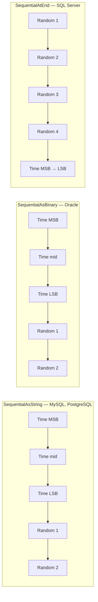

ABP's entities use `Guid` as the canonical primary‑key type, and `Volo.Abp.Guids` exists to give you `Guid` values that *cluster well in a B‑tree index*. Without care, `Guid.NewGuid()` produces random 128‑bit values that scatter index pages and degrade insert performance under load. The package provides three variants of sequential `Guid` generation that align with the index format each database engine uses, plus a registration that picks the right default per EF Core provider. This page covers the entire `Volo.Abp.Guids` source tree.

## Package contents

`framework/src/Volo.Abp.Guids/` is six files:

| File | Purpose |
| --- | --- |
| `Volo/Abp/Guids/AbpGuidsModule.cs` | Empty module; exposed for `[DependsOn]`. |
| `Volo/Abp/Guids/IGuidGenerator.cs` | The contract. |
| `Volo/Abp/Guids/SimpleGuidGenerator.cs` | `Guid.NewGuid()` wrapper, useful in tests. |
| `Volo/Abp/Guids/SequentialGuidGenerator.cs` | The main implementation. |
| `Volo/Abp/Guids/SequentialGuidType.cs` | Enum: `SequentialAsString`, `SequentialAsBinary`, `SequentialAtEnd`. |
| `Volo/Abp/Guids/AbpSequentialGuidGeneratorOptions.cs` | Options carrier with `GetDefaultSequentialGuidType()`. |

## The contract

`IGuidGenerator.cs` is a single‑method interface:

```csharp
public interface IGuidGenerator
{
    Guid Create();
}
```

Every framework type that needs a new `Guid` injects `IGuidGenerator`. `AbpDbContext` reads it lazily via the `LazyServiceProvider`:

```csharp
public IGuidGenerator GuidGenerator => LazyServiceProvider.LazyGetService<IGuidGenerator>(SimpleGuidGenerator.Instance);
```

The lazy fallback to `SimpleGuidGenerator.Instance` means that even a DbContext used without DI (e.g. during EF Core design‑time scaffolding) still gets a working generator.

## `SimpleGuidGenerator`

`SimpleGuidGenerator.cs` is a `Guid.NewGuid()` wrapper exposed via a static `Instance`:

```csharp
public class SimpleGuidGenerator : IGuidGenerator
{
    public static SimpleGuidGenerator Instance { get; } = new SimpleGuidGenerator();
    public virtual Guid Create() => Guid.NewGuid();
}
```

It is **not** auto‑registered. It is used in two situations:

- The `LazyGetService` fallback shown above.
- Test code that wants deterministic `Guid.NewGuid()` semantics without the sequential timestamp.

## `SequentialGuidGenerator`

`SequentialGuidGenerator.cs` is the auto‑registered (`ITransientDependency`) implementation. Its strategy is:

1. Generate 10 cryptographically random bytes.
2. Take the current UTC time in milliseconds (`DateTime.UtcNow.Ticks / 10000L`) as a 48‑bit timestamp (cycles every ~5,900 years).
3. Lay timestamp + random bytes in the order required by `SequentialGuidType`.

Here is the production code verbatim:

```csharp
public class SequentialGuidGenerator : IGuidGenerator, ITransientDependency
{
    public AbpSequentialGuidGeneratorOptions Options { get; }
    private static readonly RandomNumberGenerator RandomNumberGenerator = RandomNumberGenerator.Create();

    public SequentialGuidGenerator(IOptions<AbpSequentialGuidGeneratorOptions> options)
    {
        Options = options.Value;
    }

    public Guid Create() => Create(Options.GetDefaultSequentialGuidType());

    public Guid Create(SequentialGuidType guidType)
    {
        var randomBytes = new byte[10];
        RandomNumberGenerator.GetBytes(randomBytes);

        long timestamp = DateTime.UtcNow.Ticks / 10000L;
        byte[] timestampBytes = BitConverter.GetBytes(timestamp);
        if (BitConverter.IsLittleEndian) { Array.Reverse(timestampBytes); }

        byte[] guidBytes = new byte[16];
        switch (guidType)
        {
            case SequentialGuidType.SequentialAsString:
            case SequentialGuidType.SequentialAsBinary:
                Buffer.BlockCopy(timestampBytes, 2, guidBytes, 0, 6);
                Buffer.BlockCopy(randomBytes, 0, guidBytes, 6, 10);
                if (guidType == SequentialGuidType.SequentialAsString && BitConverter.IsLittleEndian)
                {
                    Array.Reverse(guidBytes, 0, 4);
                    Array.Reverse(guidBytes, 4, 2);
                }
                break;

            case SequentialGuidType.SequentialAtEnd:
                Buffer.BlockCopy(randomBytes, 0, guidBytes, 0, 10);
                Buffer.BlockCopy(timestampBytes, 2, guidBytes, 10, 6);
                break;
        }
        return new Guid(guidBytes);
    }
}
```

The single `RandomNumberGenerator` static field is safe to use from multiple threads (the BCL's `RandomNumberGenerator` is thread‑safe), and there is no other shared mutable state — making `Create()` lock‑free.

## The three variants



The `SequentialGuidType.cs` enum documents the intent:

```csharp
public enum SequentialGuidType
{
    /// <summary>
    /// The GUID should be sequential when formatted using the <see cref="Guid.ToString()" /> method.
    /// Used by MySql and PostgreSql.
    /// </summary>
    SequentialAsString,

    /// <summary>
    /// The GUID should be sequential when formatted using the <see cref="Guid.ToByteArray()" /> method.
    /// Used by Oracle.
    /// </summary>
    SequentialAsBinary,

    /// <summary>
    /// The sequential portion of the GUID should be located at the end of the Data4 block.
    /// Used by SqlServer.
    /// </summary>
    SequentialAtEnd
}
```

The choice matters because each engine sorts `Guid` values differently:

| Engine | Stored as | Sort order | Optimal `SequentialGuidType` |
| --- | --- | --- | --- |
| SQL Server | `uniqueidentifier` | Sorts on the last 6 bytes first | `SequentialAtEnd` |
| Oracle | `RAW(16)` | Byte‑array order | `SequentialAsBinary` |
| MySQL | `CHAR(36)` (text) | Lexicographic on the string form | `SequentialAsString` |
| PostgreSQL | `uuid` | Lexicographic on string form (text comparisons) | `SequentialAsString` |
| SQLite | `BLOB`/`TEXT` | depends | typically `SequentialAsString` |

## Options carrier

`AbpSequentialGuidGeneratorOptions.cs`:

```csharp
public class AbpSequentialGuidGeneratorOptions
{
    public SequentialGuidType? DefaultSequentialGuidType { get; set; }

    public SequentialGuidType GetDefaultSequentialGuidType()
    {
        return DefaultSequentialGuidType ?? SequentialGuidType.SequentialAtEnd;
    }
}
```

The framework defaults to `SequentialAtEnd` (SQL Server) so that a host without any EF Core provider still gets a sensible value. Each provider module overrides the default in its own `ConfigureServices`.

## How providers set the default

Every EF Core provider module sets `DefaultSequentialGuidType` for its database. From `framework/src/Volo.Abp.EntityFrameworkCore.SqlServer/Volo/Abp/EntityFrameworkCore/SqlServer/AbpEntityFrameworkCoreSqlServerModule.cs`:

```csharp
public override void ConfigureServices(ServiceConfigurationContext context)
{
    Configure<AbpSequentialGuidGeneratorOptions>(options =>
    {
        if (options.DefaultSequentialGuidType == null)
        {
            options.DefaultSequentialGuidType = SequentialGuidType.SequentialAtEnd;
        }
    });

    Configure<AbpEfCoreGlobalFilterOptions>(options =>
    {
        options.UseDbFunction = true;
    });
}
```

The same pattern is used in the other provider modules; each sets the value that aligns with its engine's sort order. The `if (options.DefaultSequentialGuidType == null)` guard means later modules can still override, and explicit user configuration (`Configure<AbpSequentialGuidGeneratorOptions>(o => o.DefaultSequentialGuidType = ...)`) wins.

## When `IGuidGenerator` is invoked

The framework invokes `IGuidGenerator.Create()` in a small number of well‑defined places. Three of them sit on the hot path of every insert:

| Caller | File | Why |
| --- | --- | --- |
| `AbpDbContext.TrySetGuidId` | `Volo/Abp/EntityFrameworkCore/AbpDbContext.cs` ~803 | If an entity's `Guid` id is the default value and there is no `[DatabaseGenerated]`, set it. |
| `MongoDbRepository.InsertAsync` | `Volo/Abp/Domain/Repositories/MongoDB/MongoDbRepository.cs` | Same convention for Mongo. |
| `MemoryDbRepository.InsertAsync` | `Volo/Abp/Domain/Repositories/MemoryDb/MemoryDbRepository.cs` | Same convention for in‑memory. |

The DbContext version is the one most readers will recognise:

```csharp
protected virtual void TrySetGuidId(EntityEntry entry, IEntity<Guid> entity)
{
    if (entity.Id != default) return;

    var idProperty = entry.Property("Id").Metadata.PropertyInfo!;

    var dbGeneratedAttr = ReflectionHelper
        .GetSingleAttributeOrDefault<DatabaseGeneratedAttribute>(idProperty);

    if (dbGeneratedAttr != null && dbGeneratedAttr.DatabaseGeneratedOption != DatabaseGeneratedOption.None)
    {
        return;
    }

    EntityHelper.TrySetId(entity, () => GuidGenerator.Create(), true);
}
```

If you want SQL Server to generate the id (e.g. via `newsequentialid()`), apply `[DatabaseGenerated(DatabaseGeneratedOption.Identity)]` on the property and `TrySetGuidId` will leave it untouched.

## Bytes, formats and lexicographic order

A small worked example clarifies *why* the byte ordering matters. Consider three sequential calls roughly 1 millisecond apart on a little‑endian machine. The 48‑bit timestamp prefix (after `Array.Reverse` to make it big‑endian) is, e.g., `00 00 01 8C D7 4E F2 11`. The last six bytes are what go into the layout.

| Variant | First 6 bytes of GUID | Last 6 bytes of GUID | `ToString()` prefix | `ToByteArray()` prefix |
| --- | --- | --- | --- | --- |
| `SequentialAsString` | timestamp (reversed via `Array.Reverse(guidBytes, 0, 4); Array.Reverse(guidBytes, 4, 2);`) | random | sequential | not necessarily |
| `SequentialAsBinary` | timestamp (raw) | random | not necessarily | sequential |
| `SequentialAtEnd` | random | timestamp | not necessarily | last 6 bytes sequential |

For SQL Server's `uniqueidentifier`, the engine compares the last 6 bytes first when sorting (`Data4`'s last 6 bytes). That is exactly the region the framework fills with the timestamp under `SequentialAtEnd`, so new rows append at the end of the clustered index.

## Test scenarios

<AccordionGroup>
  <Accordion title="Deterministic test IDs">
    Replace `IGuidGenerator` with a fake. The test base in many ABP modules uses `TestGuidGenerator` (in `Volo.Abp.TestBase`) that wraps `SimpleGuidGenerator` or returns a pre‑seeded sequence. Inject and `[Dependency(ReplaceServices = true)]`.
  </Accordion>
  <Accordion title="Manual variant per call">
    `SequentialGuidGenerator` exposes a `Create(SequentialGuidType)` overload not on the interface. Cast the resolved generator to `SequentialGuidGenerator` to access it — useful when generating IDs for a database engine that differs from the configured default.
  </Accordion>
  <Accordion title="Same Guid type across providers">
    If you mix MongoDB and SQL Server in one host, both will use the default chosen by whichever provider module ran last. To force a particular variant, register your preference with `Configure<AbpSequentialGuidGeneratorOptions>(o => o.DefaultSequentialGuidType = SequentialGuidType.SequentialAtEnd);` *after* the provider modules.
  </Accordion>
</AccordionGroup>

## Quality properties

The sequential generator gives you three useful properties at once:

1. **Index‑friendly inserts** — clustered indexes append rather than fragment.
2. **Unique across machines** — the random component is cryptographic; ~10 bytes of entropy per ID.
3. **Roughly monotonic per millisecond** — within the same ms the timestamp half is fixed and the random half disambiguates; the *next* ms always increases the timestamp.

The trade‑off is a tiny information leak — the creation time of a row is recoverable from the GUID. For most line‑of‑business applications this is unimportant; for security‑sensitive identifiers (session tokens, password reset codes) use `SimpleGuidGenerator` or — better — a dedicated cryptographic token type.

## Pitfalls

<Warning>
`SequentialGuidGenerator` consumes 10 bytes of `RandomNumberGenerator` per call. On extremely high‑throughput inserts (>100k/s on a single process) this becomes measurable. If you observe contention, batch insertions or pre‑allocate IDs using `Create()` in a producer thread.
</Warning>

<Warning>
Switching the `DefaultSequentialGuidType` mid‑lifetime does not migrate existing data. New rows will be sequential under the new variant but mix poorly with the old ones for clustered‑index purposes. Migrate by rebuilding the clustered index after the switch.
</Warning>

<Warning>
A `Guid` from `SequentialAsString` is *not* RFC 4122 compliant. The high bits do not encode the documented "version" of the UUID. Treat sequential `Guid`s as opaque keys; don't try to read version/variant fields out of them.
</Warning>

## Quick reference

| Symbol | File |
| --- | --- |
| `IGuidGenerator` | `Volo/Abp/Guids/IGuidGenerator.cs` |
| `SimpleGuidGenerator` | `Volo/Abp/Guids/SimpleGuidGenerator.cs` |
| `SequentialGuidGenerator` | `Volo/Abp/Guids/SequentialGuidGenerator.cs` |
| `SequentialGuidType` | `Volo/Abp/Guids/SequentialGuidType.cs` |
| `AbpSequentialGuidGeneratorOptions` | `Volo/Abp/Guids/AbpSequentialGuidGeneratorOptions.cs` |
| `AbpGuidsModule` | `Volo/Abp/Guids/AbpGuidsModule.cs` |
| `TrySetGuidId` (caller) | `Volo/Abp/EntityFrameworkCore/AbpDbContext.cs` ~803 |

## Related reading

<CardGroup cols={2}>
  <Card title="EF Core integration" href="/data/entity-framework-core">
    Where `TrySetGuidId` and `IGuidGenerator.Create()` plug into the insert lifecycle.
  </Card>
  <Card title="EF Core providers" href="/data/ef-core-providers">
    Each provider module sets the default `SequentialGuidType` for its database.
  </Card>
  <Card title="Entities" href="/ddd/domain-entities-and-aggregates">
    Why ABP entities use `Guid` as the canonical key type.
  </Card>
  <Card title="MongoDB" href="/data/mongodb-integration">
    The same `IGuidGenerator` is consulted in `MongoDbRepository`.
  </Card>
</CardGroup>
