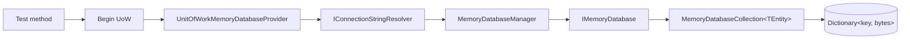

`Volo.Abp.MemoryDb` is the test‑oriented data provider. It implements the same `IRepository<TEntity>` contract that EF Core and MongoDB providers do, but the "database" is a dictionary held in a `MemoryDatabase` singleton. The point is to let modules be unit‑tested without spinning up SQL Server or MongoDB while still exercising the *same* ABP concepts — audit, soft delete, multi‑tenant filter, optimistic concurrency. This page walks the package layout and the lifecycle.

## Package layout

`framework/src/Volo.Abp.MemoryDb/` ships these files (grouped by concern):

| Concern | File |
| --- | --- |
| Module | `Volo/Abp/MemoryDb/AbpMemoryDbModule.cs` |
| Context | `Volo/Abp/MemoryDb/MemoryDbContext.cs` |
| Database | `Volo/Abp/Domain/Repositories/MemoryDb/IMemoryDatabase.cs`, `MemoryDatabase.cs`, `MemoryDatabaseManager.cs` |
| Collection | `Volo/Abp/Domain/Repositories/MemoryDb/IMemoryDatabaseCollection.cs`, `MemoryDatabaseCollection.cs` |
| Serialization | `Volo/Abp/Domain/Repositories/MemoryDb/IMemoryDbSerializer.cs`, `Utf8JsonMemoryDbSerializer.cs`, `Utf8JsonMemoryDbSerializerOptions.cs` |
| Id generation | `Volo/Abp/Domain/Repositories/MemoryDb/InMemoryIdGenerator.cs` |
| Repository | `Volo/Abp/Domain/Repositories/MemoryDb/IMemoryDbRepository.cs`, `MemoryDbRepository.cs`, `MemoryDbCoreRepositoryExtensions.cs` |
| Database provider | `Volo/Abp/MemoryDb/IMemoryDatabaseProvider.cs`, `Volo/Abp/Uow/MemoryDb/UnitOfWorkMemoryDatabaseProvider.cs`, `MemoryDbDatabaseApi.cs` |
| Registration | `Volo/Abp/MemoryDb/DependencyInjection/AbpMemoryDbContextRegistrationOptions.cs`, `IAbpMemoryDbContextRegistrationOptionsBuilder.cs`, `MemoryDbRepositoryRegistrar.cs` |
| Service collection | `Microsoft/Extensions/DependencyInjection/AbpMemoryDbServiceCollectionExtensions.cs` |

The module's `ConfigureServices` registers the open generic provider and the collection type:

```csharp
[DependsOn(typeof(AbpDddDomainModule))]
public class AbpMemoryDbModule : AbpModule
{
    public override void ConfigureServices(ServiceConfigurationContext context)
    {
        context.Services.TryAddTransient(typeof(IMemoryDatabaseProvider<>), typeof(UnitOfWorkMemoryDatabaseProvider<>));
        context.Services.TryAddTransient(typeof(IMemoryDatabaseCollection<>), typeof(MemoryDatabaseCollection<>));
    }
}
```

## `MemoryDbContext`

`Volo/Abp/MemoryDb/MemoryDbContext.cs` is the analogue of `AbpDbContext` and `AbpMongoDbContext`. It carries the set of entity types but no behaviour — there are no queries, no model builder, no `SaveChanges`.

```csharp
public abstract class MemoryDbContext : ISingletonDependency
{
    private static readonly Type[] EmptyTypeList = new Type[0];
    public virtual IReadOnlyList<Type> GetEntityTypes() => EmptyTypeList;
}
```

A test project typically defines its own context that overrides `GetEntityTypes()` to list the entities, then registers it via `services.AddMemoryDbContext<TestDbContext>()`.

## `IMemoryDatabase` and `MemoryDatabase`

`IMemoryDatabase` is the multi‑entity bag:

```csharp
public interface IMemoryDatabase
{
    IMemoryDatabaseCollection<TEntity> Collection<TEntity>() where TEntity : class, IEntity;
    TKey GenerateNextId<TEntity, TKey>();
}
```

`MemoryDatabase` is the singleton implementation backed by two `ConcurrentDictionary`s — one keyed by entity type for the collections, one for the per‑type id generators:

```csharp
public class MemoryDatabase : IMemoryDatabase, ITransientDependency
{
    private readonly ConcurrentDictionary<Type, object> _sets;
    private readonly ConcurrentDictionary<Type, InMemoryIdGenerator> _entityIdGenerators;
    private readonly IServiceProvider _serviceProvider;

    public IMemoryDatabaseCollection<TEntity> Collection<TEntity>() where TEntity : class, IEntity
    {
        return (_sets.GetOrAdd(typeof(TEntity),
                _ => _serviceProvider.GetRequiredService<IMemoryDatabaseCollection<TEntity>>())
            as IMemoryDatabaseCollection<TEntity>)!;
    }

    public TKey GenerateNextId<TEntity, TKey>()
    {
        return _entityIdGenerators
            .GetOrAdd(typeof(TEntity), () => new InMemoryIdGenerator())
            .GenerateNext<TKey>();
    }
}
```

`InMemoryIdGenerator` is a tiny incrementing counter — useful for `int`/`long` keyed entities. `Guid` keys use `IGuidGenerator` exactly like other providers.

## `MemoryDatabaseCollection`

`Volo/Abp/Domain/Repositories/MemoryDb/MemoryDatabaseCollection.cs` is where the in‑memory store actually lives — a `Dictionary<string, byte[]>` keyed on the entity's composite key.

```csharp
public class MemoryDatabaseCollection<TEntity> : IMemoryDatabaseCollection<TEntity>
    where TEntity : class, IEntity
{
    private readonly Dictionary<string, byte[]> _dictionary = [];
    private readonly IMemoryDbSerializer _memoryDbSerializer;

    public void Add(TEntity entity)
    {
        _dictionary.Add(GetEntityKey(entity), _memoryDbSerializer.Serialize(entity));
    }

    public void Update(TEntity entity)
    {
        if (!_dictionary.ContainsKey(GetEntityKey(entity))) return;

        var originalEntity = _memoryDbSerializer
            .Deserialize(_dictionary[GetEntityKey(entity)], typeof(TEntity)).As<TEntity>();

        if (entity is IHasConcurrencyStamp hasConcurrencyStamp &&
            originalEntity is IHasConcurrencyStamp originalHasConcurrencyStamp)
        {
            if (hasConcurrencyStamp.ConcurrencyStamp != originalHasConcurrencyStamp.ConcurrencyStamp)
            {
                throw new AbpDbConcurrencyException(
                    "Database operation expected to affect 1 row but actually affected 0 row. " +
                    "Data may have been modified or deleted since entities were loaded. " +
                    "This exception has been thrown on optimistic concurrency check.");
            }
        }

        _dictionary[GetEntityKey(entity)] = _memoryDbSerializer.Serialize(entity);
    }

    public void Remove(TEntity entity) => _dictionary.Remove(GetEntityKey(entity));

    private string GetEntityKey(TEntity entity) => entity.GetKeys().JoinAsString(",");
}
```

Two observations:

- The entity is serialised to bytes on insert and update. That is what makes the collection behave like a real database — modifying the entity object after `Add` does *not* leak into the stored snapshot.
- `IHasConcurrencyStamp` is enforced here, raising the same `AbpDbConcurrencyException` that EF Core would raise on a stamp mismatch. Tests can therefore assert concurrency behaviour without a real database.

## `IMemoryDbSerializer`

The default serializer is `Utf8JsonMemoryDbSerializer` (`Volo/Abp/Domain/Repositories/MemoryDb/Utf8JsonMemoryDbSerializer.cs`) which uses `System.Text.Json` via `Utf8JsonMemoryDbSerializerOptions`. It is replaceable — tests that need different semantics can register a custom serializer with `[Dependency(ReplaceServices = true)]`.

## `MemoryDbRepository`

`Volo/Abp/Domain/Repositories/MemoryDb/MemoryDbRepository.cs` implements `IRepository<TEntity>` over the in‑memory collection. The interface lists are the same as the EF Core and Mongo repositories — so a test can swap providers without changing the service under test.

```csharp
public class MemoryDbRepository<TMemoryDbContext, TEntity> : RepositoryBase<TEntity>, IMemoryDbRepository<TEntity>
    where TMemoryDbContext : MemoryDbContext
    where TEntity : class, IEntity
{
    public virtual async Task<IMemoryDatabaseCollection<TEntity>> GetCollectionAsync()
    {
        return (await GetDatabaseAsync()).Collection<TEntity>();
    }

    public Task<IMemoryDatabase> GetDatabaseAsync() => DatabaseProvider.GetDatabaseAsync();

    public override async Task<IQueryable<TEntity>> GetQueryableAsync()
    {
        return ApplyDataFilters((await GetCollectionAsync()).AsQueryable());
    }
    // ... InsertAsync / UpdateAsync / DeleteAsync apply audit + concurrency + filter ...
}
```

`ApplyDataFilters` (inherited from `RepositoryBase<TEntity>`) wraps the queryable with the same `ISoftDelete` and `IMultiTenant` predicates that `AbpDbContext.CreateFilterExpression` builds for EF Core. The `DataFilter.IsEnabled<ISoftDelete>()` toggle therefore affects in‑memory queries too — which is exactly why this is a useful test target.

`MemoryDbRepository<TMemoryDbContext, TEntity, TKey>` adds the keyed overload.

## `IMemoryDatabaseProvider` + `UnitOfWorkMemoryDatabaseProvider`

`framework/src/Volo.Abp.MemoryDb/Volo/Abp/MemoryDb/IMemoryDatabaseProvider.cs` exposes both the context and the database:

```csharp
public interface IMemoryDatabaseProvider<TMemoryDbContext>
    where TMemoryDbContext : MemoryDbContext
{
    [Obsolete("Use GetDbContextAsync method.")]
    TMemoryDbContext DbContext { get; }
    Task<TMemoryDbContext> GetDbContextAsync();

    [Obsolete("Use GetDatabaseAsync method.")]
    IMemoryDatabase GetDatabase();
    Task<IMemoryDatabase> GetDatabaseAsync();
}
```

`UnitOfWorkMemoryDatabaseProvider` (in `Volo/Abp/Uow/MemoryDb/UnitOfWorkMemoryDatabaseProvider.cs`) resolves the database the same way the EF Core provider resolves a DbContext — by looking it up on the current UoW and creating it on first access:

```csharp
public async Task<IMemoryDatabase> GetDatabaseAsync()
{
    var unitOfWork = _unitOfWorkManager.Current;
    if (unitOfWork == null)
    {
        throw new AbpException($"A {nameof(IMemoryDatabase)} instance can only be created inside a unit of work!");
    }

    var connectionString = await _connectionStringResolver.ResolveAsync<TMemoryDbContext>();
    var dbContextKey = $"{typeof(TMemoryDbContext).FullName}_{connectionString}";

    var databaseApi = unitOfWork.GetOrAddDatabaseApi(
        dbContextKey,
        () => new MemoryDbDatabaseApi(_memoryDatabaseManager.Get(connectionString)));

    return ((MemoryDbDatabaseApi)databaseApi).Database;
}
```

The provider still consults `IConnectionStringResolver` so that the same "connection string" (any opaque test identifier) maps to the same `IMemoryDatabase` across the test session. `MemoryDatabaseManager` (`Volo/Abp/Domain/Repositories/MemoryDb/MemoryDatabaseManager.cs`) is a singleton that caches one `IMemoryDatabase` per connection string.



## Transaction semantics

`MemoryDbDatabaseApi` implements `IDatabaseApi` only — it does not implement `ISupportsRollback`. The implications:

- The UoW's `CompleteAsync` does *not* invoke any `SaveChanges` on the in‑memory store (writes happen on `Add`/`Update`/`Remove` directly).
- The UoW's `RollbackAsync` cannot roll back in‑memory writes. Tests that need rollback semantics either discard the database after each test (typical) or use the EF Core SQLite in‑memory provider instead.

For most unit tests the lack of rollback is irrelevant because each test creates a new DI container and a new `MemoryDatabase` instance.

## Test patterns

<AccordionGroup>
  <Accordion title="Per-test isolation">
    The ABP test base (`AbpIntegratedTest<TStartupModule>`) creates a fresh DI container per test class. Because `MemoryDatabaseManager` is registered per container, every test class gets its own clean memory database.
  </Accordion>
  <Accordion title="Cross-context queries">
    A test can register multiple `MemoryDbContext` types — the registrar walks each one and registers repositories. All contexts share the same `MemoryDatabaseManager` but each gets its own `IMemoryDatabase` keyed on the resolved connection string.
  </Accordion>
  <Accordion title="Seeding">
    Use the same `IDataSeedContributor` pattern as production. The seeder loops the contributors, each inserts via `IRepository<T>.InsertAsync(...)`, the writes land in the dictionary. The next test fixture can call `seeder.SeedAsync()` to repopulate.
  </Accordion>
</AccordionGroup>

## Registration

`framework/src/Volo.Abp.MemoryDb/Microsoft/Extensions/DependencyInjection/AbpMemoryDbServiceCollectionExtensions.cs` exposes `AddMemoryDbContext<T>`:

```csharp
services.AddMemoryDbContext<TestDbContext>(options =>
{
    options.AddDefaultRepositories();
});
```

The shape is the same as `AddAbpDbContext` (see [EF Core integration](/data/entity-framework-core)) and `AddMongoDbContext` (see [MongoDB](/data/mongodb-integration)). `AddDefaultRepositories()` triggers `MemoryDbRepositoryRegistrar.AddRepositories()` which iterates `MemoryDbContext.GetEntityTypes()` and registers per‑entity repositories.

## Behaviour vs. EF Core

| Concept | EF Core | MemoryDb |
| --- | --- | --- |
| Storage | RDBMS | `Dictionary<string, byte[]>` per entity type |
| Change tracking | `ChangeTracker` | none — writes are immediate |
| Transactions | yes | no (writes are not buffered) |
| Soft delete filter | global query filter expression | `ApplyDataFilters` on the queryable |
| Multi‑tenant filter | global query filter expression | `ApplyDataFilters` on the queryable |
| Concurrency stamp | `WHERE ... AND ConcurrencyStamp = @orig` | dictionary lookup + stamp compare |
| Audit | `IAuditPropertySetter` | `IAuditPropertySetter` |
| Guid id generation | `TrySetGuidId` via `IGuidGenerator` | same |
| Integer id generation | DB sequence / identity | `InMemoryIdGenerator` |
| Cancellation | yes | best‑effort (operations are synchronous) |

## Pitfalls

<Warning>
`MemoryDatabaseCollection<TEntity>` uses a plain `Dictionary<string, byte[]>` — it is **not** thread‑safe. The collection assumes single‑threaded access within one test. If your test fans out parallel operations on the same collection, you may observe corruption. Wrap parallel scenarios in your own synchronisation or use the EF Core in‑memory provider.
</Warning>

<Warning>
The provider stores entities by **composite key string** (`entity.GetKeys().JoinAsString(",")`). Two entities with the same `Id` but different secondary keys collide; double‑check `GetKeys()` for composite entities in tests.
</Warning>

<Warning>
There is no `RollbackAsync`. A test that begins a transactional UoW, makes a change, and discards the UoW without `CompleteAsync` will *not* see the change reverted — the dictionary already holds the new bytes. Tests should rely on fresh fixtures rather than rollback.
</Warning>

## Quick reference

| Symbol | File |
| --- | --- |
| `MemoryDbContext` | `Volo/Abp/MemoryDb/MemoryDbContext.cs` |
| `IMemoryDatabase` | `Volo/Abp/Domain/Repositories/MemoryDb/IMemoryDatabase.cs` |
| `MemoryDatabase` | `Volo/Abp/Domain/Repositories/MemoryDb/MemoryDatabase.cs` |
| `IMemoryDatabaseCollection<TEntity>` | `Volo/Abp/Domain/Repositories/MemoryDb/IMemoryDatabaseCollection.cs` |
| `MemoryDatabaseCollection<TEntity>` | `Volo/Abp/Domain/Repositories/MemoryDb/MemoryDatabaseCollection.cs` |
| `MemoryDatabaseManager` | `Volo/Abp/Domain/Repositories/MemoryDb/MemoryDatabaseManager.cs` |
| `IMemoryDbSerializer` | `Volo/Abp/Domain/Repositories/MemoryDb/IMemoryDbSerializer.cs` |
| `IMemoryDatabaseProvider<TMemoryDbContext>` | `Volo/Abp/MemoryDb/IMemoryDatabaseProvider.cs` |
| `UnitOfWorkMemoryDatabaseProvider<TMemoryDbContext>` | `Volo/Abp/Uow/MemoryDb/UnitOfWorkMemoryDatabaseProvider.cs` |
| `MemoryDbRepository<TMemoryDbContext, TEntity>` | `Volo/Abp/Domain/Repositories/MemoryDb/MemoryDbRepository.cs` |
| `AbpMemoryDbModule` | `Volo/Abp/MemoryDb/AbpMemoryDbModule.cs` |
| `AddMemoryDbContext<T>` | `Microsoft/Extensions/DependencyInjection/AbpMemoryDbServiceCollectionExtensions.cs` |

## Related reading

<CardGroup cols={2}>
  <Card title="EF Core integration" href="/data/entity-framework-core">
    Behaviour the MemoryDb provider mirrors so tests are realistic.
  </Card>
  <Card title="Data filtering" href="/data/data-filtering">
    `ApplyDataFilters` reuses the same `IDataFilter` state.
  </Card>
  <Card title="Concurrency check" href="/data/concurrency-check">
    The exception type raised by `MemoryDatabaseCollection.Update` matches the EF Core path.
  </Card>
  <Card title="Unit of work" href="/data/unit-of-work">
    Why a memory DB still needs a UoW around its operations.
  </Card>
</CardGroup>
