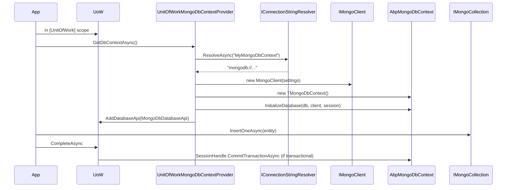

`Volo.Abp.MongoDB` mirrors the EF Core integration: there is an abstract context (`AbpMongoDbContext`), a UoW‑aware provider (`UnitOfWorkMongoDbContextProvider`), a repository (`MongoDbRepository`), and a registration pipeline that wires every domain repository interface to a concrete `MongoDbRepository<TDbContext, TEntity>`. This page walks the moving parts in `framework/src/Volo.Abp.MongoDB/`, the BSON convention setup, the model builder used to register collections, and the connection lifecycle.

## The anchor files

| File | Role |
| --- | --- |
| `Volo/Abp/MongoDB/IAbpMongoDbContext.cs` | Contract for ABP's Mongo context. |
| `Volo/Abp/MongoDB/AbpMongoDbContext.cs` | Abstract base every Mongo context inherits. |
| `Volo/Abp/MongoDB/AbpMongoDbContextOptions.cs` | Mongo client settings + multi‑tenant context replacements. |
| `Volo/Abp/MongoDB/IMongoDbContextProvider.cs` | Resolves a `TMongoDbContext` for the active UoW. |
| `Volo/Abp/Uow/MongoDB/UnitOfWorkMongoDbContextProvider.cs` | The implementation registered by `AbpMongoDbModule`. |
| `Volo/Abp/Domain/Repositories/MongoDB/MongoDbRepository.cs` | Implements `IRepository<TEntity>` over `IMongoCollection<TEntity>`. |
| `Volo/Abp/MongoDB/AbpMongoDbModule.cs` | Module wiring. |
| `Volo/Abp/MongoDB/DependencyInjection/AbpMongoDbContextRegistrationOptions.cs` | Registration options builder. |
| `Volo/Abp/MongoDB/DependencyInjection/MongoDbRepositoryRegistrar.cs` | Walks the context and registers per‑entity repositories. |
| `Microsoft/Extensions/DependencyInjection/AbpMongoDbServiceCollectionExtensions.cs` | The `AddMongoDbContext<T>` extension. |

## The context contract

`framework/src/Volo.Abp.MongoDB/Volo/Abp/MongoDB/IAbpMongoDbContext.cs`:

```csharp
public interface IAbpMongoDbContext
{
    IMongoClient Client { get; }
    IMongoDatabase Database { get; }
    IMongoCollection<T> Collection<T>();
    IClientSessionHandle? SessionHandle { get; }
}
```

The four members are everything a repository needs: the client (for transactions), the database (for ad‑hoc commands), `Collection<T>()` (the entity collection), and the session handle (active during a transactional UoW).

## `AbpMongoDbContext`

`AbpMongoDbContext.cs` is intentionally minimal — most of the work happens in the registrar and the repository.

```csharp
public abstract class AbpMongoDbContext : IAbpMongoDbContext, ITransientDependency
{
    public IAbpLazyServiceProvider LazyServiceProvider { get; set; } = default!;
    public IMongoModelSource ModelSource { get; set; } = default!;
    public IMongoClient Client { get; private set; } = default!;
    public IMongoDatabase Database { get; private set; } = default!;
    public IClientSessionHandle? SessionHandle { get; private set; }

    protected internal virtual void CreateModel(IMongoModelBuilder modelBuilder) { }

    public virtual void InitializeDatabase(IMongoDatabase database, IMongoClient client, IClientSessionHandle? sessionHandle)
    {
        Database = database;
        Client = client;
        SessionHandle = sessionHandle;
    }

    public virtual IMongoCollection<T> Collection<T>()
    {
        return Database.GetCollection<T>(GetCollectionName<T>());
    }

    public virtual void InitializeCollections(IMongoDatabase database)
    {
        Database = database;
        ModelSource.GetModel(this);
    }

    protected virtual string GetCollectionName<T>() => GetEntityModel<T>().CollectionName;

    protected virtual IMongoEntityModel GetEntityModel<TEntity>()
    {
        var model = ModelSource.GetModel(this).Entities.GetOrDefault(typeof(TEntity));
        if (model == null)
        {
            throw new AbpException("Could not find a model for given entity type: " + typeof(TEntity).AssemblyQualifiedName);
        }
        return model;
    }
}
```

Three responsibilities:

- `CreateModel(IMongoModelBuilder)` is the analogue of EF Core's `OnModelCreating`. A user context overrides it to declare collections and their conventions.
- `InitializeDatabase(...)` is called by the provider once it has resolved the client and database.
- `Collection<T>()` does the lookup via `IMongoEntityModel` which holds the collection name.

The `IMongoModelSource` cache (in `Volo/Abp/MongoDB/IMongoModelSource.cs`) memoizes the model per concrete context type so that `CreateModel` runs only once even if many context instances are created.

## Registering a context

`framework/src/Volo.Abp.MongoDB/Microsoft/Extensions/DependencyInjection/AbpMongoDbServiceCollectionExtensions.cs` exposes the registration entry point:

```csharp
public static IServiceCollection AddMongoDbContext<TMongoDbContext>(
    this IServiceCollection services,
    Action<IAbpMongoDbContextRegistrationOptionsBuilder>? optionsBuilder = null)
    where TMongoDbContext : AbpMongoDbContext
{
    var options = new AbpMongoDbContextRegistrationOptions(typeof(TMongoDbContext), services);

    var replacedDbContextTypes = typeof(TMongoDbContext).GetCustomAttributes<ReplaceDbContextAttribute>(true)
        .SelectMany(x => x.ReplacedDbContextTypes).ToList();

    foreach (var dbContextType in replacedDbContextTypes)
    {
        options.ReplaceDbContext(dbContextType.Type, multiTenancySides: dbContextType.MultiTenancySide);
    }

    optionsBuilder?.Invoke(options);

    foreach (var entry in options.ReplacedDbContextTypes)
    {
        var originalDbContextType = entry.Key.Type;
        var targetDbContextType = entry.Value ?? typeof(TMongoDbContext);

        services.Replace(ServiceDescriptor.Transient(originalDbContextType, sp =>
        {
            var dbContextType = sp.GetRequiredService<IMongoDbContextTypeProvider>().GetDbContextType(originalDbContextType);
            return sp.GetRequiredService(dbContextType);
        }));

        services.Configure<AbpMongoDbContextOptions>(opts =>
        {
            var multiTenantDbContextType = new MultiTenantDbContextType(originalDbContextType, entry.Key.MultiTenancySide);
            opts.DbContextReplacements[multiTenantDbContextType] = targetDbContextType;
        });
    }

    new MongoDbRepositoryRegistrar(options).AddRepositories();
    return services;
}
```

The structure mirrors `AddAbpDbContext` (see [EF Core integration](/data/entity-framework-core)) — the replace‑db‑context attribute path, the multi‑tenant registration, and the per‑entity repository registrar are identical in shape.

## `IAbpMongoDbContextRegistrationOptionsBuilder`

`framework/src/Volo.Abp.MongoDB/Volo/Abp/MongoDB/DependencyInjection/IAbpMongoDbContextRegistrationOptionsBuilder.cs` is just a marker:

```csharp
public interface IAbpMongoDbContextRegistrationOptionsBuilder : IAbpCommonDbContextRegistrationOptionsBuilder
{
}
```

`IAbpCommonDbContextRegistrationOptionsBuilder` lives in `Volo.Abp.Ddd.Domain` and exposes `ReplaceDbContext`, `AddDefaultRepositories`, `AddRepository<TEntity, TRepository>`, etc. — the same builder used by EF Core. That commonality is intentional: the surface for both stores is the same.

## Conventional context registration

`framework/src/Volo.Abp.MongoDB/Volo/Abp/MongoDB/DependencyInjection/AbpMongoDbConventionalRegistrar.cs` is added to the DI conventional registrars by `AbpMongoDbModule.PreConfigureServices`:

```csharp
public class AbpMongoDbConventionalRegistrar : DefaultConventionalRegistrar
{
    protected override bool IsConventionalRegistrationDisabled(Type type)
    {
        return !typeof(IAbpMongoDbContext).IsAssignableFrom(type)
               || type == typeof(AbpMongoDbContext)
               || base.IsConventionalRegistrationDisabled(type);
    }

    protected override List<Type> GetExposedServiceTypes(Type type)
        => new List<Type> { typeof(IAbpMongoDbContext) };

    protected override ServiceLifetime? GetDefaultLifeTimeOrNull(Type type) => ServiceLifetime.Transient;
}
```

Every concrete `IAbpMongoDbContext` derivative gets registered automatically as `Transient` and exposed under `IAbpMongoDbContext`. That's why a service can inject `IAbpMongoDbContext` (e.g. for ad‑hoc commands) without listing the type explicitly.

## `AbpMongoDbContextOptions`

`AbpMongoDbContextOptions.cs` carries a hook to customise the `MongoClientSettings` and the multi‑tenant replacement dictionary.

```csharp
public class AbpMongoDbContextOptions
{
    internal Dictionary<MultiTenantDbContextType, Type> DbContextReplacements { get; }
    public Action<MongoClientSettings>? MongoClientSettingsConfigurer { get; set; }

    public AbpMongoDbContextOptions() { DbContextReplacements = new Dictionary<MultiTenantDbContextType, Type>(); }

    internal Type GetReplacedTypeOrSelf(Type dbContextType, MultiTenancySides multiTenancySides = MultiTenancySides.Both)
    {
        var replacementType = dbContextType;
        while (true)
        {
            var foundType = DbContextReplacements.LastOrDefault(x => x.Key.Type == replacementType && x.Key.MultiTenancySide.HasFlag(multiTenancySides));
            if (!foundType.Equals(default(KeyValuePair<MultiTenantDbContextType, Type>)))
            {
                if (foundType.Value == dbContextType)
                {
                    throw new AbpException("Circular DbContext replacement found for " + dbContextType.AssemblyQualifiedName);
                }
                replacementType = foundType.Value;
            }
            else { return replacementType; }
        }
    }
}
```

`MongoClientSettingsConfigurer` is the hook for SSL, replica‑set, server selection — anything you'd normally set on `MongoClientSettings`. The provider invokes it after parsing the connection string.

## `AbpMongoDbModule`

`AbpMongoDbModule.cs` registers BSON serialisers in its static constructor and wires the provider, filterer, conventional registrar and outbox/inbox services.

```csharp
[DependsOn(typeof(AbpDddDomainModule))]
public class AbpMongoDbModule : AbpModule
{
    static AbpMongoDbModule()
    {
        AbpBsonSerializer.RemoveSerializer<Guid>();
        BsonSerializer.RegisterSerializer(new GuidSerializer(GuidRepresentation.Standard));
        BsonTypeMapper.RegisterCustomTypeMapper(typeof(Guid), new AbpGuidCustomBsonTypeMapper());
    }

    public override void PreConfigureServices(ServiceConfigurationContext context)
    {
        context.Services.AddConventionalRegistrar(new AbpMongoDbConventionalRegistrar());
    }

    public override void ConfigureServices(ServiceConfigurationContext context)
    {
        context.Services.TryAddTransient(typeof(IMongoDbContextProvider<>), typeof(UnitOfWorkMongoDbContextProvider<>));
        context.Services.TryAddEnumerable(ServiceDescriptor.Transient(typeof(IMongoDbRepositoryFilterer<>), typeof(MongoDbRepositoryFilterer<>)));
        context.Services.TryAddEnumerable(ServiceDescriptor.Transient(typeof(IMongoDbRepositoryFilterer<,>), typeof(MongoDbRepositoryFilterer<,>)));
        context.Services.AddTransient(typeof(IMongoDbContextEventOutbox<>), typeof(MongoDbContextEventOutbox<>));
        context.Services.AddTransient(typeof(IMongoDbContextEventInbox<>), typeof(MongoDbContextEventInbox<>));
        // ... distributed entity event ignored selectors ...
    }
}
```

The Guid serialiser swap is critical. Vanilla MongoDB stores Guids as `LegacyGuid` (a byte‑swapped representation) by default; ABP forces `GuidRepresentation.Standard` so that the bytes match what `Guid.ToByteArray()` produces — which is what every other ABP integration assumes.

## `IMongoDbContextProvider`

`framework/src/Volo.Abp.MongoDB/Volo/Abp/MongoDB/IMongoDbContextProvider.cs`:

```csharp
public interface IMongoDbContextProvider<TMongoDbContext>
    where TMongoDbContext : IAbpMongoDbContext
{
    [Obsolete("Use CreateDbContextAsync")]
    TMongoDbContext GetDbContext();
    Task<TMongoDbContext> GetDbContextAsync(CancellationToken cancellationToken = default);
}
```

The async path is the one to call. The implementation in `framework/src/Volo.Abp.MongoDB/Volo/Abp/Uow/MongoDB/UnitOfWorkMongoDbContextProvider.cs` follows the EF Core pattern: resolve the connection string, cache the context per UoW under a key that includes the connection string, attach a `MongoDbDatabaseApi` to the UoW so `SaveChangesAsync`/`Commit` propagate.

## `MongoDbRepository`

`framework/src/Volo.Abp.MongoDB/Volo/Abp/Domain/Repositories/MongoDB/MongoDbRepository.cs` is the EF Core repository's twin. Important members:

```csharp
public class MongoDbRepository<TMongoDbContext, TEntity>
    : RepositoryBase<TEntity>, IMongoDbRepository<TEntity>
    where TMongoDbContext : IAbpMongoDbContext
    where TEntity : class, IEntity
{
    public virtual async Task<IMongoCollection<TEntity>> GetCollectionAsync(CancellationToken cancellationToken = default)
    {
        return (await GetDbContextAsync(GetCancellationToken(cancellationToken))).Collection<TEntity>();
    }

    protected Task<TMongoDbContext> GetDbContextAsync(CancellationToken cancellationToken = default)
    {
        cancellationToken = GetCancellationToken(cancellationToken);
        if (!EntityHelper.IsMultiTenant<TEntity>())
        {
            using (CurrentTenant.Change(null))
            {
                return DbContextProvider.GetDbContextAsync(cancellationToken);
            }
        }
        return DbContextProvider.GetDbContextAsync(cancellationToken);
    }

    public IGuidGenerator GuidGenerator => LazyServiceProvider.LazyGetService<IGuidGenerator>(SimpleGuidGenerator.Instance);
    // ... AuditPropertySetter, EntityChangeEventHelper, bulk operation provider ...
}
```

The host‑connection switch in `GetDbContextAsync` is identical to `EfCoreRepository.GetDbContextAsync` — multi‑tenancy‑unaware entities (like `Tenant` itself) always use the host's connection string.

The two extra dependencies are `IMongoDbRepositoryFilterer<TEntity>` (composes the `IMultiTenant` / `ISoftDelete` BSON filters) and `IMongoDbBulkOperationProvider` (optional bulk‑write provider for batched inserts).

`MongoDbRepository<TMongoDbContext, TEntity, TKey>` adds the keyed `IRepository<TEntity, TKey>` half — `GetAsync(TKey)`, `FindAsync(TKey)`, `DeleteAsync(TKey)`.

## The repository registrar

`framework/src/Volo.Abp.MongoDB/Volo/Abp/MongoDB/DependencyInjection/MongoDbRepositoryRegistrar.cs` walks the registered context type, discovers entities via the model (declared in the user's `CreateModel` override), and registers a closed `MongoDbRepository<TMongoDbContext, TEntity>` per entity. This is what makes `IRepository<MyEntity, Guid>` injectable without naming the context type in user code.

## Lifecycle: a write



When the chosen Mongo deployment is a replica set with transactions enabled and `IsTransactional == true` on the UoW, the provider opens a session and the UoW's `CompleteAsync` triggers `CommitTransactionAsync`. When the deployment is standalone or `IsTransactional == false`, writes are committed immediately by the driver and there is no rollback.

## BSON conventions

The static constructor of `AbpMongoDbModule` is half of ABP's BSON wiring. The other half is `AbpBsonClassMapExtensions` (`Volo/Abp/MongoDB/AbpBsonClassMapExtensions.cs`) which is invoked inside the user context's `CreateModel`:

```csharp
modelBuilder.Entity<Book>(b =>
{
    b.CollectionName = "Books";
    b.BsonMap.UnmapMember(x => x.IgnoredField);
});
```

Two ABP‑specific things `AbpBsonClassMap` does automatically when the entity implements certain interfaces:

| Interface | Configuration |
| --- | --- |
| `IHasExtraProperties` | `ExtraProperties` is mapped to a sub‑document, with a custom serializer that preserves dynamic keys. |
| `IMayHaveCreator`, `IModificationAuditedObject` | Audit timestamps map as Mongo `BsonDateTime` (UTC). |
| `IHasConcurrencyStamp` | Mapped as a string property; the repository uses it as part of the `ReplaceOneAsync` filter. |
| `ISoftDelete` | `IsDeleted` is mapped; the repository's filterer skips deleted documents when the filter is enabled. |
| `IMultiTenant` | `TenantId` is mapped; the filterer adds `TenantId == currentTenantId` when the filter is enabled. |

## The model builder

`IMongoModelBuilder` (defined in `Volo/Abp/MongoDB/IMongoModelBuilder.cs`) exposes `Entity<TEntity>(Action<IMongoEntityModelBuilder<TEntity>>)` and an internal `IReadOnlyDictionary<Type, IMongoEntityModel>` of registered entities. A user context's `CreateModel` typically reads as:

```csharp
public class MyShopMongoDbContext : AbpMongoDbContext
{
    public IMongoCollection<Order> Orders => Collection<Order>();
    public IMongoCollection<Product> Products => Collection<Product>();

    protected internal override void CreateModel(IMongoModelBuilder modelBuilder)
    {
        base.CreateModel(modelBuilder);
        modelBuilder.Entity<Order>(b => { b.CollectionName = "orders"; });
        modelBuilder.Entity<Product>(b => { b.CollectionName = "products"; });
    }
}
```

The repository registrar reads these declarations to know which entities to register.

## `AbpMongoDbContextExtensions`

A small helper `AbpMongoDbContextExtensions.ToAbpMongoDbContext` (`Volo/Abp/MongoDB/AbpMongoDbContextExtensions.cs`) downcasts an `IAbpMongoDbContext` to the concrete `AbpMongoDbContext` with a clear error message if the cast fails:

```csharp
public static AbpMongoDbContext ToAbpMongoDbContext(this IAbpMongoDbContext dbContext)
{
    var abpMongoDbContext = dbContext as AbpMongoDbContext;
    if (abpMongoDbContext == null)
    {
        throw new AbpException($"The type {dbContext.GetType().AssemblyQualifiedName} should be convertable to {typeof(AbpMongoDbContext).AssemblyQualifiedName}!");
    }
    return abpMongoDbContext;
}
```

This is used by infrastructure code (e.g. the outbox/inbox) that needs access to internal helpers not in `IAbpMongoDbContext`.

## How writes apply ABP concepts

MongoDB doesn't have an EF Core‑style `ChangeTracker`. `MongoDbRepository` applies ABP concepts directly on insert/update/delete:

| Operation | Concept | Implementation |
| --- | --- | --- |
| `InsertAsync` | Guid id | `CheckAndSetId(entity)` via `IGuidGenerator` |
| `InsertAsync` | Audit | `AuditPropertySetter.SetCreationProperties(entity)` |
| `InsertAsync` | Concurrency stamp | sets fresh stamp if implementing `IHasConcurrencyStamp` |
| `UpdateAsync` | Concurrency stamp | filter includes old stamp; raises `AbpDbConcurrencyException` on miss |
| `UpdateAsync` | Audit | `AuditPropertySetter.SetModificationProperties(entity)` |
| `DeleteAsync` | Soft delete | if `ISoftDelete`, becomes `UpdateAsync` with `IsDeleted = true` |
| `DeleteAsync` | Audit | `AuditPropertySetter.SetDeletionProperties(entity)` |

The same `IAuditPropertySetter` is used by both EF Core and MongoDB so audit semantics are identical across stores.

## Connection‑string checker

`framework/src/Volo.Abp.MongoDB/Volo/Abp/MongoDB/ConnectionStrings/MongoDBConnectionStringChecker.cs` opens a client and runs `ListDatabaseNames` to confirm both connectivity and that the targeted database is reachable. Registered with `[Dependency(ReplaceServices = true)]` so it replaces `DefaultConnectionStringChecker`.

## Pitfalls

<Warning>
`MongoClientSettings.GuidRepresentation` defaults to `Standard` only because `AbpMongoDbModule`'s static constructor calls `BsonSerializer.RegisterSerializer(new GuidSerializer(GuidRepresentation.Standard))`. If you register your own Guid serialiser elsewhere (especially before the module loads), you may end up with mixed representations and unreadable existing data.
</Warning>

<Warning>
Transactional MongoDB requires a replica set or sharded cluster. On a standalone `mongod`, `IsTransactional = true` on the UoW will throw at `CommitTransactionAsync`. Either run a one‑node replica set in development or leave the UoW non‑transactional for Mongo writes.
</Warning>

<Warning>
`AbpMongoDbContext` is `ITransientDependency` — a new instance is created per UoW, but the `IMongoClient` instance should be cached and reused (it manages its own connection pool). The cache is built into `AbpMongoClientFactory`; do not instantiate `MongoClient` yourself in production code.
</Warning>

## Quick reference

| Symbol | File |
| --- | --- |
| `IAbpMongoDbContext` | `Volo/Abp/MongoDB/IAbpMongoDbContext.cs` |
| `AbpMongoDbContext` | `Volo/Abp/MongoDB/AbpMongoDbContext.cs` |
| `AbpMongoDbContextOptions` | `Volo/Abp/MongoDB/AbpMongoDbContextOptions.cs` |
| `IMongoDbContextProvider<TMongoDbContext>` | `Volo/Abp/MongoDB/IMongoDbContextProvider.cs` |
| `UnitOfWorkMongoDbContextProvider<TMongoDbContext>` | `Volo/Abp/Uow/MongoDB/UnitOfWorkMongoDbContextProvider.cs` |
| `MongoDbRepository<TMongoDbContext, TEntity>` | `Volo/Abp/Domain/Repositories/MongoDB/MongoDbRepository.cs` |
| `IAbpMongoDbContextRegistrationOptionsBuilder` | `Volo/Abp/MongoDB/DependencyInjection/IAbpMongoDbContextRegistrationOptionsBuilder.cs` |
| `AbpMongoDbContextRegistrationOptions` | `Volo/Abp/MongoDB/DependencyInjection/AbpMongoDbContextRegistrationOptions.cs` |
| `AbpMongoDbConventionalRegistrar` | `Volo/Abp/MongoDB/DependencyInjection/AbpMongoDbConventionalRegistrar.cs` |
| `MongoDbRepositoryRegistrar` | `Volo/Abp/MongoDB/DependencyInjection/MongoDbRepositoryRegistrar.cs` |
| `AbpMongoDbModule` | `Volo/Abp/MongoDB/AbpMongoDbModule.cs` |
| `AddMongoDbContext<T>` | `Microsoft/Extensions/DependencyInjection/AbpMongoDbServiceCollectionExtensions.cs` |

## Related reading

<CardGroup cols={2}>
  <Card title="Unit of work" href="/data/unit-of-work">
    Where the Mongo `IDatabaseApi` and session handle are committed.
  </Card>
  <Card title="Data filtering" href="/data/data-filtering">
    `MongoDbRepositoryFilterer` applies `ISoftDelete` / `IMultiTenant` as BSON filters.
  </Card>
  <Card title="Concurrency check" href="/data/concurrency-check">
    `ReplaceOneAsync` uses `IHasConcurrencyStamp` in the filter.
  </Card>
  <Card title="Connection strings" href="/data/connection-strings">
    `MongoDBConnectionStringChecker` and how the resolver supplies the URL.
  </Card>
</CardGroup>
