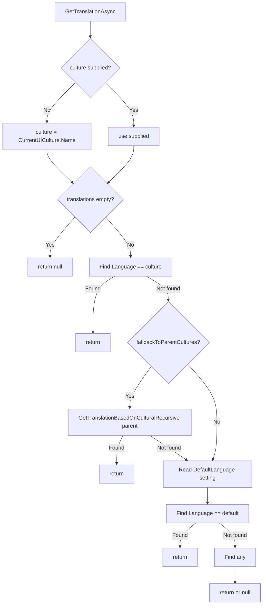

`Volo.Abp.MultiLingualObjects` is the framework's pattern for *entity*‑level translations — as opposed to UI string localisation, which lives in `Volo.Abp.Localization`. The shape is the canonical one: each translatable aggregate carries a collection of translation entities, each translation pins a language tag, and a manager resolves the right one for the current `CultureInfo` with fallback through the parent culture chain and finally to the default language. This page walks the four files of the package and the resolver's behaviour.

## Package layout

The package lives at `framework/src/Volo.Abp.MultiLingualObjects/Volo/Abp/MultiLingualObjects/` and contains exactly five files:

| File | Role |
| --- | --- |
| `IMultiLingualObject.cs` | Generic interface entities implement to carry translations. |
| `IObjectTranslation.cs` | Interface each translation entity implements to expose `Language`. |
| `IMultiLingualObjectManager.cs` | The resolver contract. |
| `MultiLingualObjectManager.cs` | The default implementation. |
| `AbpMultiLingualObjectsModule.cs` | Module declaration. |

The module depends only on localization:

```csharp
[DependsOn(typeof(AbpLocalizationModule))]
public class AbpMultiLingualObjectsModule : AbpModule
{
}
```

That dependency exists because the fallback step reads `LocalizationSettingNames.DefaultLanguage` from `ISettingProvider`.

## The two domain interfaces

`Volo/Abp/MultiLingualObjects/IMultiLingualObject.cs`:

```csharp
public interface IMultiLingualObject<TTranslation>
    where TTranslation : class, IObjectTranslation
{
    ICollection<TTranslation> Translations { get; set; }
}
```

`Volo/Abp/MultiLingualObjects/IObjectTranslation.cs`:

```csharp
public interface IObjectTranslation
{
    string Language { get; set; }
}
```

The contract is intentionally minimal. The translatable entity (e.g. `Product`) declares `ICollection<ProductTranslation> Translations`, and the translation entity (`ProductTranslation`) carries the language tag (e.g. `"en"`, `"tr-TR"`) plus whatever translatable fields make sense.

```csharp
public class Product : AggregateRoot<Guid>, IMultiLingualObject<ProductTranslation>
{
    public ICollection<ProductTranslation> Translations { get; set; } = new List<ProductTranslation>();
    // ...non-translatable fields like Sku, Price...
}

public class ProductTranslation : IObjectTranslation
{
    public Guid ProductId { get; set; }
    public string Language { get; set; } = default!;
    public string Name { get; set; } = default!;
    public string Description { get; set; } = default!;
}
```

The split is the framework convention: non‑translatable fields stay on the root, translatable fields live in the translation entity, one row per language.

## The resolver contract

`Volo/Abp/MultiLingualObjects/IMultiLingualObjectManager.cs` declares four overloads:

```csharp
public interface IMultiLingualObjectManager
{
    Task<TTranslation?> GetTranslationAsync<TMultiLingual, TTranslation>(
        TMultiLingual multiLingual,
        string? culture = null,
        bool fallbackToParentCultures = true)
        where TMultiLingual : IMultiLingualObject<TTranslation>
        where TTranslation : class, IObjectTranslation;

    Task<TTranslation?> GetTranslationAsync<TTranslation>(
        IEnumerable<TTranslation> translations,
        string? culture = null,
        bool fallbackToParentCultures = true)
        where TTranslation : class, IObjectTranslation;

    Task<List<TTranslation?>> GetBulkTranslationsAsync<TTranslation>(
        IEnumerable<IEnumerable<TTranslation>> translationsCombined,
        string? culture = null,
        bool fallbackToParentCultures = true)
        where TTranslation : class, IObjectTranslation;

    Task<List<(TMultiLingual entity, TTranslation? translation)>> GetBulkTranslationsAsync<TMultiLingual, TTranslation>(
        IEnumerable<TMultiLingual> multiLinguals,
        string? culture = null,
        bool fallbackToParentCultures = true)
        where TMultiLingual : IMultiLingualObject<TTranslation>
        where TTranslation : class, IObjectTranslation;
}
```

Two single‑entity overloads (one accepts the multi‑lingual entity, the other a bare collection of translations) and two bulk overloads (the bulk pattern avoids hitting `ISettingProvider` once per entity).

## The default implementation

`Volo/Abp/MultiLingualObjects/MultiLingualObjectManager.cs` is `ITransientDependency`. The single‑translation method is the most important:

```csharp
public class MultiLingualObjectManager : IMultiLingualObjectManager, ITransientDependency
{
    protected ISettingProvider SettingProvider { get; }
    protected const int MaxCultureFallbackDepth = 5;

    public MultiLingualObjectManager(ISettingProvider settingProvider)
    {
        SettingProvider = settingProvider;
    }

    public virtual async Task<TTranslation?> GetTranslationAsync<TTranslation>(
        IEnumerable<TTranslation>? translations,
        string? culture,
        bool fallbackToParentCultures)
        where TTranslation : class, IObjectTranslation
    {
        culture ??= CultureInfo.CurrentUICulture.Name;

        if (translations == null || !translations.Any())
        {
            return null;
        }

        var translation = translations.FirstOrDefault(pt => pt.Language == culture);
        if (translation != null) { return translation; }

        if (fallbackToParentCultures)
        {
            translation = GetTranslationBasedOnCulturalRecursive(
                CultureInfo.CurrentUICulture.Parent,
                translations,
                0
            );
            if (translation != null) { return translation; }
        }

        var defaultLanguage = await SettingProvider.GetOrNullAsync(LocalizationSettingNames.DefaultLanguage);
        translation = translations.FirstOrDefault(pt => pt.Language == defaultLanguage);
        if (translation != null) { return translation; }

        translation = translations.FirstOrDefault();
        return translation;
    }
}
```

The fallback ladder is the heart of the manager. In order:

1. **Exact culture match** — first translation whose `Language == culture`.
2. **Parent culture chain** — walk `CultureInfo.CurrentUICulture.Parent` recursively (capped at `MaxCultureFallbackDepth = 5`).
3. **Default language setting** — read `LocalizationSettingNames.DefaultLanguage` from `ISettingProvider`.
4. **First available translation** — give up and return whatever exists.

The recursive helper:

```csharp
protected virtual TTranslation? GetTranslationBasedOnCulturalRecursive<TTranslation>(
    CultureInfo? culture, IEnumerable<TTranslation>? translations, int currentDepth)
    where TTranslation : class, IObjectTranslation
{
    if (culture == null ||
        culture.Name.IsNullOrWhiteSpace() ||
        translations == null || !translations.Any() ||
        currentDepth > MaxCultureFallbackDepth)
    {
        return null;
    }

    var translation = translations.FirstOrDefault(pt => pt.Language.Equals(culture.Name, StringComparison.OrdinalIgnoreCase));
    return translation ?? GetTranslationBasedOnCulturalRecursive(culture.Parent, translations, currentDepth + 1);
}
```

The comparison is `OrdinalIgnoreCase` — `"en-US"` matches `"en-us"`, but it does *not* match `"en"`. The fallback to `"en"` happens because `CultureInfo("en-US").Parent` returns `CultureInfo("en")` and the recursion continues.

## Fallback diagram



## Bulk resolution

`GetBulkTranslationsAsync` is the optimisation for list views — render a paginated grid of 100 products without hitting `ISettingProvider` 100 times. The method takes an enumerable of translation collections and resolves them in one pass, then reads the default language *once* if any item still needs it:

```csharp
public virtual async Task<List<TTranslation?>> GetBulkTranslationsAsync<TTranslation>(
    IEnumerable<IEnumerable<TTranslation>>? translationsCombined,
    string? culture,
    bool fallbackToParentCultures)
    where TTranslation : class, IObjectTranslation
{
    culture ??= CultureInfo.CurrentUICulture.Name;
    if (translationsCombined == null || !translationsCombined.Any()) return new();

    var someHaveNoTranslations = false;
    var res = new List<TTranslation?>();
    foreach (var translations in translationsCombined)
    {
        if (!translations.Any()) { res.Add(null); continue; }
        var translation = translations.FirstOrDefault(pt => pt.Language == culture);
        if (translation != null) { res.Add(translation); }
        else
        {
            if (fallbackToParentCultures)
            {
                translation = GetTranslationBasedOnCulturalRecursive(
                    CultureInfo.CurrentUICulture.Parent, translations, 0);
                if (translation != null) { res.Add(translation); }
                else { res.Add(null); someHaveNoTranslations = true; }
            }
            else { res.Add(null); someHaveNoTranslations = true; }
        }
    }

    if (someHaveNoTranslations)
    {
        var defaultLanguage = await SettingProvider.GetOrNullAsync(LocalizationSettingNames.DefaultLanguage);
        // ... second pass to fill in defaults / any-available ...
    }
    return res;
}
```

The `someHaveNoTranslations` flag gates the second pass — when every entity in the batch resolves on its first try, the default‑language setting is never read.

## The entity overload

`GetTranslationAsync<TMultiLingual, TTranslation>(TMultiLingual multiLingual, ...)` simply forwards:

```csharp
public virtual Task<TTranslation?> GetTranslationAsync<TMultiLingual, TTranslation>(
    TMultiLingual multiLingual,
    string? culture = null,
    bool fallbackToParentCultures = true)
    where TMultiLingual : IMultiLingualObject<TTranslation>
    where TTranslation : class, IObjectTranslation
{
    return GetTranslationAsync(multiLingual.Translations, culture: culture, fallbackToParentCultures: fallbackToParentCultures);
}
```

The bulk version `GetBulkTranslationsAsync<TMultiLingual, TTranslation>(IEnumerable<TMultiLingual> multiLinguals, ...)` does the same:

```csharp
public virtual async Task<List<(TMultiLingual entity, TTranslation? translation)>> GetBulkTranslationsAsync<TMultiLingual, TTranslation>(
    IEnumerable<TMultiLingual> multiLinguals,
    string? culture,
    bool fallbackToParentCultures)
    where TMultiLingual : IMultiLingualObject<TTranslation>
    where TTranslation : class, IObjectTranslation
{
    var resInitial = await GetBulkTranslationsAsync(
        multiLinguals.Select(x => x.Translations), culture, fallbackToParentCultures);
    var index = 0;
    var res = new List<(TMultiLingual entity, TTranslation? translation)>();
    foreach (var item in multiLinguals)
    {
        var t = resInitial[index++];
        res.Add((item, t));
    }
    return res;
}
```

The result is a list of `(entity, translation)` pairs — convenient for projecting onto a DTO.

## A typical application service

```csharp
public class ProductAppService : ApplicationService
{
    private readonly IRepository<Product, Guid> _products;
    private readonly IMultiLingualObjectManager _multiLingualManager;

    public ProductAppService(
        IRepository<Product, Guid> products,
        IMultiLingualObjectManager multiLingualManager)
    {
        _products = products;
        _multiLingualManager = multiLingualManager;
    }

    public async Task<ProductDto> GetAsync(Guid id)
    {
        var product = await _products.GetAsync(id, includeDetails: true);

        var tr = await _multiLingualManager
            .GetTranslationAsync<Product, ProductTranslation>(product);

        return new ProductDto
        {
            Id = product.Id,
            Sku = product.Sku,
            Price = product.Price,
            Name = tr?.Name ?? string.Empty,
            Description = tr?.Description ?? string.Empty,
        };
    }

    public async Task<List<ProductDto>> ListAsync()
    {
        var products = await _products.GetListAsync(includeDetails: true);

        var paired = await _multiLingualManager
            .GetBulkTranslationsAsync<Product, ProductTranslation>(products);

        return paired.Select(p => new ProductDto
        {
            Id = p.entity.Id,
            Sku = p.entity.Sku,
            Name = p.translation?.Name ?? string.Empty,
            // ...
        }).ToList();
    }
}
```

Notice `includeDetails: true` — the manager works on the in‑memory `Translations` collection, so the EF Core query must eager‑load translations. The DDD package's `IRepository<TEntity, TKey>.GetAsync(TKey, includeDetails: true)` does that via the entity's `WithDetailsActions` registration; for ad‑hoc queries, `await query.Include(p => p.Translations)` is the manual path.

## Behaviour table

| Scenario | `Language == culture` | Parent culture match | DefaultLanguage match | Result |
| --- | --- | --- | --- | --- |
| Direct hit | yes | — | — | exact translation |
| Parent fallback | no | yes | — | parent‑culture translation |
| Default fallback | no | no | yes | default‑language translation |
| Any fallback | no | no | no, but list non‑empty | first translation |
| Empty list | — | — | — | `null` |
| `fallbackToParentCultures = false` | no | (skipped) | yes | default‑language translation |
| `fallbackToParentCultures = false`, no default | no | (skipped) | no | first translation or `null` |

## Threading and lifetime

`MultiLingualObjectManager` is `ITransientDependency` — a new instance per resolution. `ISettingProvider` is the only injected dependency and is itself transient/scoped. The recursion in `GetTranslationBasedOnCulturalRecursive` reads `CultureInfo.CurrentUICulture` *each call*; if the calling code changed the current UI culture (e.g. via `CultureHelper.Use("fr-FR")`), the manager observes the new value.

## Pitfalls

<Warning>
The manager does not load translations — it only resolves the right one from a pre‑loaded collection. If `multiLingual.Translations` is `null` or empty because EF Core lazy‑loaded the parent without including children, you'll get `null` even though translations exist in the database. Always `Include` the translation collection or use `IRepository<T>.GetAsync(id, includeDetails: true)`.
</Warning>

<Warning>
The recursion cap is hard‑coded at `MaxCultureFallbackDepth = 5`. For most cultures the chain (`en-US → en → invariant`) is shorter than the cap, but exotic locales with deep parent chains can exhaust it. Custom managers should override the constant or copy the recursion with a different cap.
</Warning>

<Warning>
`Language` comparison in the exact‑match step (`pt.Language == culture`) is *ordinal case‑sensitive*. The parent‑recursive comparison uses `OrdinalIgnoreCase`. To avoid subtle bugs, store the language tag in canonical form (`"en-US"`, not `"en-us"`) when writing translations.
</Warning>

## Quick reference

| Symbol | File |
| --- | --- |
| `IMultiLingualObject<TTranslation>` | `Volo/Abp/MultiLingualObjects/IMultiLingualObject.cs` |
| `IObjectTranslation` | `Volo/Abp/MultiLingualObjects/IObjectTranslation.cs` |
| `IMultiLingualObjectManager` | `Volo/Abp/MultiLingualObjects/IMultiLingualObjectManager.cs` |
| `MultiLingualObjectManager` | `Volo/Abp/MultiLingualObjects/MultiLingualObjectManager.cs` |
| `AbpMultiLingualObjectsModule` | `Volo/Abp/MultiLingualObjects/AbpMultiLingualObjectsModule.cs` |
| `LocalizationSettingNames.DefaultLanguage` | `Volo.Abp.Localization/Volo/Abp/Localization/LocalizationSettingNames.cs` |
| `ISettingProvider` | `Volo.Abp.Settings/Volo/Abp/Settings/ISettingProvider.cs` |

## Related reading

<CardGroup cols={2}>
  <Card title="Localization" href="/crosscutting/localization">
    The UI‑string sibling, including how `DefaultLanguage` is configured.
  </Card>
  <Card title="Entities" href="/ddd/domain-entities-and-aggregates">
    `AggregateRoot<TKey>` carries the `Translations` collection by convention.
  </Card>
  <Card title="EF Core integration" href="/data/entity-framework-core">
    How `WithDetailsActions` automates the eager‑load of translation collections.
  </Card>
  <Card title="Settings" href="/security/settings-runtime">
    `ISettingProvider` reads `LocalizationSettingNames.DefaultLanguage` for the final fallback step.
  </Card>
</CardGroup>
