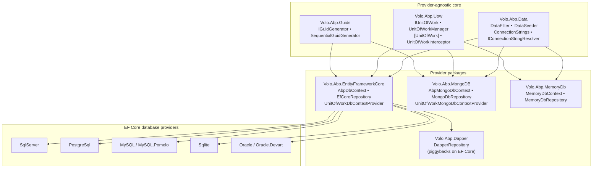
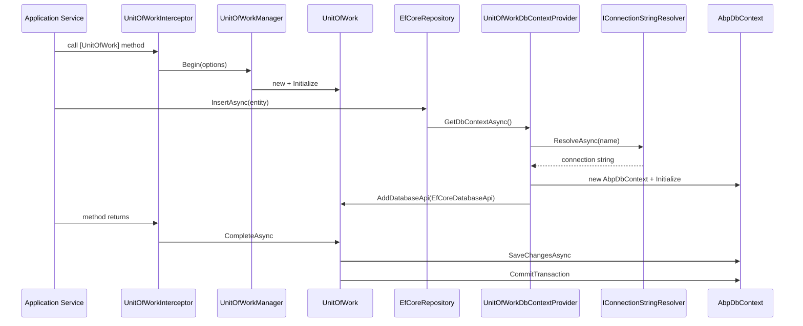
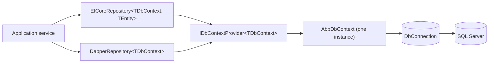

The ABP Framework data stack is split into two **provider‑agnostic** packages — `Volo.Abp.Data` and `Volo.Abp.Uow` — and a family of **provider packages** that adapt the abstractions to a concrete database technology. This page is a map of that layering: which abstraction lives where, how a provider plugs in, and how the runtime composes a request that ends in a `SaveChangesAsync` call. Subsequent pages in this section drill into each package; this one is the index.

## The three layers

ABP keeps the data concern in three tiers. The bottom tier — `Volo.Abp.Data` (under `framework/src/Volo.Abp.Data/Volo/Abp/Data/`) — defines pure abstractions: `IDataFilter`, `IDataSeeder`, `IConnectionStringResolver`, `ConnectionStrings`, `IHasConcurrencyStamp`, plus the `AbpDataModule` that wires them. The middle tier — `Volo.Abp.Uow` (under `framework/src/Volo.Abp.Uow/Volo/Abp/Uow/`) — owns the unit‑of‑work lifecycle (`IUnitOfWork`, `UnitOfWorkManager`, `UnitOfWorkInterceptor`, `[UnitOfWork]`) and *does not know what a database is*. The top tier is the provider packages: `Volo.Abp.EntityFrameworkCore`, `Volo.Abp.MongoDB`, `Volo.Abp.Dapper`, `Volo.Abp.MemoryDb`. Each provider exposes its DbContext/collection abstraction (`AbpDbContext<T>`, `AbpMongoDbContext`, `MemoryDbContext`) and a `DatabaseApi` adapter that gets attached to the active `IUnitOfWork`.

## Cross‑cutting concerns owned by `Volo.Abp.Data`

Several behaviours sit in `Volo.Abp.Data` because every provider needs them. `IDataFilter` (`IDataFilter.cs`) and `DataFilter` (`DataFilter.cs`) give a generic, AsyncLocal scoped switch for filters like `ISoftDelete` and `IMultiTenant`; providers consult `DataFilter.IsEnabled<ISoftDelete>()` when generating queries. `IDataSeeder` (`IDataSeeder.cs`) and `DataSeeder` (`DataSeeder.cs`) drive the seed contributor loop, wrapping the work in a `[UnitOfWork]`. `IConnectionStringResolver` (`IConnectionStringResolver.cs`) and `DefaultConnectionStringResolver` (`DefaultConnectionStringResolver.cs`) turn a connection‑string *name* into an actual string by consulting `AbpDbConnectionOptions.ConnectionStrings`. Finally, `IHasConcurrencyStamp` (under `Volo/Abp/Domain/Entities/IHasConcurrencyStamp.cs`) is the cross‑provider opt‑in marker for optimistic concurrency.

## How a provider plugs in

Providers don't fork the abstractions — they implement a thin set of contracts and let the `IUnitOfWorkManager` own the lifetime. The contract list is short and uniform.

| Abstraction (in `Volo.Abp.Data` / `Volo.Abp.Uow`) | EF Core implementation | MongoDB implementation | MemoryDb implementation |
| --- | --- | --- | --- |
| `IDatabaseApi` (`Volo/Abp/Uow/IDatabaseApi.cs`) | `EfCoreDatabaseApi` | `MongoDbDatabaseApi` | `MemoryDbDatabaseApi` |
| `ITransactionApi` (`Volo/Abp/Uow/ITransactionApi.cs`) | `EfCoreTransactionApi` | `MongoDbTransactionApi` | — (no transactions) |
| `IDbContextProvider<TDbContext>` | `UnitOfWorkDbContextProvider<TDbContext>` | `UnitOfWorkMongoDbContextProvider<T>` | `UnitOfWorkMemoryDatabaseProvider<T>` |
| `IRepository<TEntity>` | `EfCoreRepository<TDbContext,TEntity>` | `MongoDbRepository<TDbContext,TEntity>` | `MemoryDbRepository<TDbContext,TEntity>` |
| `IDataSeedContributor` (consumer side) | written per module | written per module | written per module |

The pattern is always the same: the provider's `DbContextProvider` resolves the connection string through `IConnectionStringResolver`, instantiates the context, wraps it in a `DatabaseApi`, and registers that API with `UnitOfWorkManager.Current` so that `CompleteAsync` will call `SaveChangesAsync` and `CommitAsync` on it. See `framework/src/Volo.Abp.EntityFrameworkCore/Volo/Abp/Uow/EntityFrameworkCore/UnitOfWorkDbContextProvider.cs` for the canonical implementation.

## A request walked end to end

The diagram is the runtime composition of all three tiers. Nothing in `Volo.Abp.Data` or `Volo.Abp.Uow` references `Microsoft.EntityFrameworkCore`; the provider is the only piece that does.

## Where to read next

Use this table as a reading order; every link maps to a focused page in this section.

| Topic | Page | Anchor file |
| --- | --- | --- |
| Walk of the `Volo.Abp.Data` directory | [Volo.Abp.Data package](/data/volo-abp-data-package) | `framework/src/Volo.Abp.Data/Volo/Abp/Data/` |
| Begin / Complete / Rollback flow | [Unit of work](/data/unit-of-work) | `Volo/Abp/Uow/UnitOfWork.cs` |
| `IDataFilter` and built‑in filters | [Data filtering](/data/data-filtering) | `Volo/Abp/Data/DataFilter.cs` |
| Connection string lookup | [Connection strings](/data/connection-strings) | `DefaultConnectionStringResolver.cs` |
| Seed contributors | [Data seeding](/data/data-seeding) | `DataSeeder.cs` |
| `IHasConcurrencyStamp` plumbing | [Concurrency check](/data/concurrency-check) | `AbpDbContext.cs` |
| Sequential `Guid` generation | [GUID generation](/data/guid-generation) | `SequentialGuidGenerator.cs` |
| EF Core context lifecycle | [Entity Framework Core](/data/entity-framework-core) | `AbpDbContext.cs` |
| Per‑provider extension methods | [EF Core providers](/data/ef-core-providers) | `AbpDbContextOptions*Extensions.cs` |
| Mongo collections and registration | [MongoDB integration](/data/mongodb-integration) | `AbpMongoDbContext.cs` |
| Raw‑SQL alongside EF Core | [Dapper integration](/data/dapper-integration) | `DapperRepository.cs` |
| In‑memory test repository | [MemoryDb](/data/memory-db) | `MemoryDbRepository.cs` |
| Specifications at runtime | [Specifications runtime](/data/specifications-runtime) | `Specification.cs` |
| Translated entities | [Multi‑lingual objects](/data/multi-lingual-objects) | `MultiLingualObjectManager.cs` |

## Companion sections in the wiki

The data stack relies heavily on three other parts of ABP that have their own deep‑dive pages.

<CardGroup cols={3}>
  <Card title="Domain entities" href="/ddd/entities-and-aggregates">
    `IEntity`, `IEntity<TKey>`, `ISoftDelete`, `IMultiTenant` — the markers `AbpDbContext` reads.
  </Card>
  <Card title="Repositories" href="/ddd/repositories">
    The provider‑neutral `IRepository<TEntity>` interface that `EfCoreRepository`, `MongoDbRepository`, and `MemoryDbRepository` all implement.
  </Card>
  <Card title="Unit of work lifecycle" href="/flows/unit-of-work-lifecycle">
    The full runtime sequence from interceptor to `SaveChangesAsync`, annotated with the events that fire at each step.
  </Card>
</CardGroup>

## What this layering buys you

The split between `Volo.Abp.Data` + `Volo.Abp.Uow` and the provider packages is not just hygiene — it is what enables several user‑facing features.

<AccordionGroup>
  <Accordion title="Swappable providers without rewriting modules">
    Because modules depend on `IRepository<TEntity, TKey>` (defined in `Volo.Abp.Ddd.Domain`) rather than on `EfCoreRepository`, a module can be ported from SQL Server to MongoDB by changing the registration in `*.cs` `AddAbpDbContext` / `AddMongoDbContext` calls. The provider‑specific code path is centralised in `IDbContextProvider<T>` / `IMongoDbContextProvider<T>` and is wired by `framework/src/Volo.Abp.EntityFrameworkCore/Volo/Abp/EntityFrameworkCore/AbpEntityFrameworkCoreModule.cs` (`TryAddTransient(typeof(IDbContextProvider<>), typeof(UnitOfWorkDbContextProvider<>))`).
  </Accordion>
  <Accordion title="Single transaction across providers">
    A `IUnitOfWork` instance holds a dictionary of `IDatabaseApi` and `ITransactionApi` (see `Volo/Abp/Uow/UnitOfWork.cs` lines 50‑52 and `GetOrAddDatabaseApi` at lines 213‑221). When `CompleteAsync` runs (lines 128‑183) it iterates every registered API and calls `SaveChangesAsync` then `CommitAsync` in order. That is why a service can touch an EF Core context and a Mongo collection from the same UoW without losing atomicity per‑store.
  </Accordion>
  <Accordion title="Filters that travel across stores">
    `IDataFilter<ISoftDelete>` is one singleton per AsyncLocal scope (see `DataFilter<TFilter>` and the `_filter` `AsyncLocal<DataFilterState>` field in `Volo/Abp/Data/DataFilter.cs`). EF Core consults it through the model filter expression in `AbpDbContext.CreateFilterExpression<TEntity>` (`Volo/Abp/EntityFrameworkCore/AbpDbContext.cs` around line 970); MongoDB consults it inside `MongoDbRepositoryFilterer`. A `using (DataFilter.Disable<ISoftDelete>())` block affects every store that participates.
  </Accordion>
</AccordionGroup>

## Module graph

The composition is enforced by `[DependsOn]` declarations. The relevant edges are listed below — open the referenced module file to confirm.

| Module | DependsOn (data‑related) | File |
| --- | --- | --- |
| `AbpDataModule` | `AbpObjectExtendingModule`, `AbpUnitOfWorkModule`, `AbpEventBusAbstractionsModule` | `Volo/Abp/Data/AbpDataModule.cs` |
| `AbpUnitOfWorkModule` | — (registers `UnitOfWorkInterceptorRegistrar`) | `Volo/Abp/Uow/AbpUnitOfWorkModule.cs` |
| `AbpEntityFrameworkCoreModule` | `AbpDddDomainModule` | `Volo/Abp/EntityFrameworkCore/AbpEntityFrameworkCoreModule.cs` |
| `AbpEntityFrameworkCoreSqlServerModule` | `AbpEntityFrameworkCoreModule` | `Volo/Abp/EntityFrameworkCore/SqlServer/AbpEntityFrameworkCoreSqlServerModule.cs` |
| `AbpMongoDbModule` | `AbpDddDomainModule` | `Volo/Abp/MongoDB/AbpMongoDbModule.cs` |
| `AbpMemoryDbModule` | `AbpDddDomainModule` | `Volo/Abp/MemoryDb/AbpMemoryDbModule.cs` |
| `AbpDapperModule` | `AbpDddDomainModule`, `AbpEntityFrameworkCoreModule` | `Volo/Abp/Dapper/AbpDapperModule.cs` |
| `AbpMultiLingualObjectsModule` | `AbpLocalizationModule` | `Volo/Abp/MultiLingualObjects/AbpMultiLingualObjectsModule.cs` |

<Note>
`Volo.Abp.Specifications` and `Volo.Abp.Guids` are referenced indirectly. `Volo.Abp.Guids` is included transitively wherever entities have `Guid` keys; `Volo.Abp.Specifications` is referenced by `Volo.Abp.Ddd.Domain` so that `IRepository<TEntity>.GetListAsync(ISpecification<TEntity>)` compiles.
</Note>

## Conventions to keep in mind

Three conventions repeat across all providers and are worth memorising before reading the rest of the section.

1. **A repository must be inside a `IUnitOfWork`**. `UnitOfWorkDbContextProvider.GetDbContextAsync` throws `AbpException("A DbContext can only be created inside a unit of work!")` if `UnitOfWorkManager.Current` is `null` (see `UnitOfWorkDbContextProvider.cs` lines 92‑96).
2. **The connection string name is the DbContext type's full name**, unless overridden by `[ConnectionStringName("...")]` (`Volo/Abp/Data/ConnectionStringNameAttribute.cs`).
3. **Auto‑set `Guid` ids**. `AbpDbContext.ApplyAbpConceptsForAddedEntity → CheckAndSetId → TrySetGuidId` (`AbpDbContext.cs` lines 794‑822) uses `IGuidGenerator.Create()` to fill an empty `Guid` id unless the entity property has `[DatabaseGenerated]`.

With this map in mind you are ready to read [`volo-abp-data-package`](/data/volo-abp-data-package), which is the file‑by‑file walk of the bottom layer.

## Reading the layer from a write path

Many readers internalise the layering by tracing one path end‑to‑end. The path below is the same one any `InsertAsync(entity)` follows in an ABP application, with each step paired to the source file that owns it.

| Step | Responsibility | File |
| --- | --- | --- |
| Application service is intercepted | Wrap call in a UoW | `Volo.Abp.Uow/Volo/Abp/Uow/UnitOfWorkInterceptor.cs` |
| `UnitOfWorkManager.Begin(options)` | Allocate or reuse a UoW | `Volo.Abp.Uow/Volo/Abp/Uow/UnitOfWorkManager.cs` |
| Repository call (`InsertAsync`) | Materialise a DbContext | `Volo.Abp.EntityFrameworkCore/Volo/Abp/Domain/Repositories/EntityFrameworkCore/EfCoreRepository.cs` |
| `IDbContextProvider<TDbContext>.GetDbContextAsync()` | Resolve connection string and cache context on the UoW | `Volo.Abp.EntityFrameworkCore/Volo/Abp/Uow/EntityFrameworkCore/UnitOfWorkDbContextProvider.cs` |
| `IConnectionStringResolver.ResolveAsync` | Look up the connection string by name | `Volo.Abp.Data/Volo/Abp/Data/DefaultConnectionStringResolver.cs` |
| `AbpDbContext` runs the ABP concept hooks | Audit, soft delete, concurrency, Guid id | `Volo.Abp.EntityFrameworkCore/Volo/Abp/EntityFrameworkCore/AbpDbContext.cs` |
| UoW.`CompleteAsync` | Flush every `IDatabaseApi` + commit transactions | `Volo.Abp.Uow/Volo/Abp/Uow/UnitOfWork.cs` |

The walk crosses three packages (`Volo.Abp.Uow`, `Volo.Abp.Data`, `Volo.Abp.EntityFrameworkCore`) but the seams are all at the abstractions: nothing in the EF Core package leaks into `Volo.Abp.Data`, and nothing in `Volo.Abp.Uow` knows about EF Core.

## Two repositories, one UoW, one transaction

The agnostic layering also enables one scenario worth highlighting: a single UoW that mixes EF Core writes and Dapper reads against the same connection. Because `DapperRepository<TDbContext>` obtains its `IDbConnection` and `IDbTransaction` from the EF Core `IDbContextProvider<TDbContext>` (see [Dapper integration](/data/dapper-integration)), both repositories share the same `DbConnection` and — if the UoW is transactional — the same `IDbTransaction`. The UoW does not need to know that two repositories participated; the `EfCoreDatabaseApi` it holds is enough.

## Reading order recommendation

If this is your first deep dive, read the pages in this order — each builds on concepts from the previous one.

1. [Volo.Abp.Data package](/data/volo-abp-data-package) — the abstractions.
2. [Unit of work](/data/unit-of-work) — the lifetime model every store plugs into.
3. [Data filtering](/data/data-filtering) — the per‑request switch.
4. [Connection strings](/data/connection-strings) — how names map to physical databases.
5. [GUID generation](/data/guid-generation) — why ids cluster well.
6. [Entity Framework Core](/data/entity-framework-core) — the canonical provider.
7. [EF Core providers](/data/ef-core-providers) — the per‑vendor surface.
8. [Concurrency check](/data/concurrency-check) — the optimistic check, end to end.
9. [Data seeding](/data/data-seeding) — the migrator/seed pipeline.
10. [MongoDB](/data/mongodb-integration), [Dapper](/data/dapper-integration), [MemoryDb](/data/memory-db) — the alternates.
11. [Specifications runtime](/data/specifications-runtime) — composable predicates.
12. [Multi‑lingual objects](/data/multi-lingual-objects) — translation resolution.

