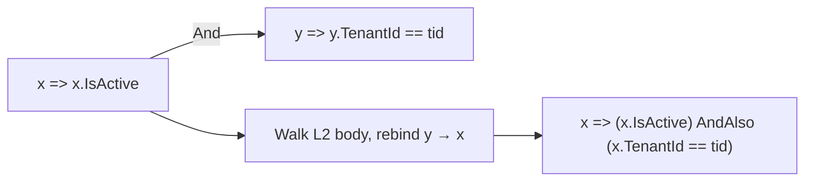
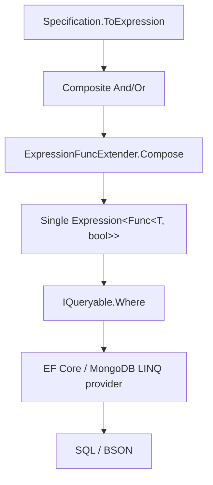

`Volo.Abp.Specifications` is a tiny package — fewer than twenty files — that implements the Specification pattern over LINQ expression trees. The point at runtime is one method, `Specification<T>.ToExpression()`, plus an implicit conversion to `Expression<Func<T, bool>>` that lets a specification be passed directly to any `IQueryable<T>.Where(...)` call. This page walks the package, the composite operators, the expression composition trick, and how specifications meet repositories at the call site.

## Package layout

The full file set under `framework/src/Volo.Abp.Specifications/Volo/Abp/Specifications/`:

| File | Role |
| --- | --- |
| `ISpecification.cs` | Two‑method contract. |
| `Specification.cs` | Abstract base with implicit conversion. |
| `CompositeSpecification.cs` | Base for binary composites. |
| `ICompositeSpecification.cs` | Marker exposing `Left`/`Right`. |
| `AndSpecification.cs`, `OrSpecification.cs`, `AndNotSpecification.cs`, `NotSpecification.cs` | Logical combinators. |
| `AnySpecification.cs`, `NoneSpecification.cs` | Constant `true`/`false`. |
| `ExpressionSpecification.cs` | Wraps a raw lambda. |
| `SpecificationExtensions.cs` | `.And(...)`, `.Or(...)`, `.AndNot(...)`, `.Not()` over `ISpecification<T>`. |
| `ExpressionFuncExtender.cs` | The `Expression<Func<T,bool>>` compose trick. |
| `ParameterRebinder.cs` | Helper used by `ExpressionFuncExtender`. |
| `ISpecificationParser.cs` | Optional contract for translating to engine‑specific criteria. |
| `AbpSpecificationsModule.cs` | Empty module. |

The module's only job is to participate in `[DependsOn]`:

```csharp
public class AbpSpecificationsModule : AbpModule
{
}
```

## The contract

`Volo/Abp/Specifications/ISpecification.cs` defines two members:

```csharp
public interface ISpecification<T>
{
    bool IsSatisfiedBy(T obj);
    Expression<Func<T, bool>> ToExpression();
}
```

`IsSatisfiedBy` is the in‑memory predicate — useful in domain code that owns a single instance. `ToExpression()` is what makes the pattern composable with LINQ providers (EF Core, MongoDB.Driver.Linq, in‑memory).

## The base

`Volo/Abp/Specifications/Specification.cs` is the abstract base every concrete specification derives from:

```csharp
public abstract class Specification<T> : ISpecification<T>
{
    public virtual bool IsSatisfiedBy(T obj)
    {
        return ToExpression().Compile()(obj);
    }

    public abstract Expression<Func<T, bool>> ToExpression();

    public static implicit operator Expression<Func<T, bool>>(Specification<T> specification)
    {
        return specification.ToExpression();
    }
}
```

Three properties of this base are important at runtime:

1. **Default `IsSatisfiedBy`** compiles the expression once per call. Specifications in hot paths that are evaluated in memory should cache the compiled delegate themselves.
2. **The implicit conversion** is the bridge to LINQ. Anywhere a method accepts `Expression<Func<T, bool>>`, a `Specification<T>` can be passed directly — including `IQueryable<T>.Where(...)`.
3. **`ToExpression` is abstract**, so derived types must produce a real expression tree (not just a `Func<T, bool>`). That is what lets EF Core translate the predicate into SQL.

## Concrete specifications

The package ships seven concretes. Five are infrastructural:

```csharp
public sealed class AnySpecification<T> : Specification<T>
{
    public override Expression<Func<T, bool>> ToExpression() => o => true;
}

public sealed class NoneSpecification<T> : Specification<T>
{
    public override Expression<Func<T, bool>> ToExpression() => o => false;
}

public class ExpressionSpecification<T> : Specification<T>
{
    private readonly Expression<Func<T, bool>> _expression;
    public ExpressionSpecification(Expression<Func<T, bool>> expression) { _expression = expression; }
    public override Expression<Func<T, bool>> ToExpression() => _expression;
}

public class NotSpecification<T> : Specification<T>
{
    private readonly ISpecification<T> _specification;
    public NotSpecification(ISpecification<T> specification) { _specification = specification; }
    public override Expression<Func<T, bool>> ToExpression()
    {
        var expression = _specification.ToExpression();
        return Expression.Lambda<Func<T, bool>>(
            Expression.Not(expression.Body),
            expression.Parameters
        );
    }
}
```

`AndSpecification` and `OrSpecification` are the composites:

```csharp
public class AndSpecification<T> : CompositeSpecification<T>
{
    public AndSpecification(ISpecification<T> left, ISpecification<T> right) : base(left, right) { }
    public override Expression<Func<T, bool>> ToExpression()
        => Left.ToExpression().And(Right.ToExpression());
}

public class OrSpecification<T> : CompositeSpecification<T>
{
    public OrSpecification(ISpecification<T> left, ISpecification<T> right) : base(left, right) { }
    public override Expression<Func<T, bool>> ToExpression()
        => Left.ToExpression().Or(Right.ToExpression());
}
```

`AndNotSpecification` is the convenience `A && !B`.

## The expression‑compose trick

The `And` / `Or` methods on `Expression<Func<T, bool>>` are not the BCL's — they are defined in `framework/src/Volo.Abp.Specifications/Volo/Abp/Specifications/ExpressionFuncExtender.cs`:

```csharp
public static class ExpressionFuncExtender
{
    private static Expression<T> Compose<T>(this Expression<T> first, Expression<T> second,
        Func<Expression, Expression, Expression> merge)
    {
        var map = first.Parameters.Select((f, i) => new { f, s = second.Parameters[i] })
            .ToDictionary(p => p.s, p => p.f);

        var secondBody = ParameterRebinder.ReplaceParameters(map, second.Body);
        return Expression.Lambda<T>(merge(first.Body, secondBody), first.Parameters);
    }

    public static Expression<Func<T, bool>> And<T>(this Expression<Func<T, bool>> first,
        Expression<Func<T, bool>> second)
        => first.Compose(second, Expression.AndAlso);

    public static Expression<Func<T, bool>> Or<T>(this Expression<Func<T, bool>> first,
        Expression<Func<T, bool>> second)
        => first.Compose(second, Expression.OrElse);
}
```

The `Compose` body solves the *parameter problem*: two lambdas declared `x => ...` and `y => ...` have different `ParameterExpression` nodes. Just concatenating the bodies produces an expression whose two halves reference different parameters and that EF Core cannot translate. The compose trick rebuilds the second lambda's body so its parameter references point to the first lambda's parameter — making the combined expression a single, well‑formed predicate.

`ParameterRebinder` (`Volo/Abp/Specifications/ParameterRebinder.cs`) is the `ExpressionVisitor` that walks the second body and rewrites each parameter reference using the map.



The output is one lambda using one parameter — EF Core translates it to SQL.

## Extension API

`SpecificationExtensions.cs` adds the fluent surface over `ISpecification<T>` itself:

```csharp
public static ISpecification<T> And<T>(this ISpecification<T> specification, ISpecification<T> other)
{
    Check.NotNull(specification, nameof(specification));
    Check.NotNull(other, nameof(other));
    return new AndSpecification<T>(specification, other);
}

public static ISpecification<T> Or<T>(this ISpecification<T> specification, ISpecification<T> other) { ... }
public static ISpecification<T> AndNot<T>(this ISpecification<T> specification, ISpecification<T> other) { ... }
public static ISpecification<T> Not<T>(this ISpecification<T> specification) { ... }
```

The four extensions return new composites; specifications are *immutable*. A spec composed once can be reused freely across requests because none of the state is mutable.

## Hitting a repository

`Volo.Abp.Ddd.Domain`'s `IRepository<TEntity>` does not declare an explicit `GetListAsync(ISpecification<TEntity>)` overload — and it does not need one. Because `Specification<T>` has an implicit conversion to `Expression<Func<T, bool>>`, every repository method that takes a predicate accepts a specification transparently. The `IReadOnlyBasicRepository<TEntity>.GetCountAsync(Expression<Func<TEntity, bool>>)` is one such method; `IBasicRepository<TEntity, TKey>.GetPagedListAsync(int skip, int max, string sorting, ...)` is not — paged listing in ABP is handled via `IQueryable<TEntity>` from `GetQueryableAsync()`.

The two canonical call shapes:

```csharp
// 1) Pass directly to IQueryable.Where:
var queryable = await _repo.GetQueryableAsync();
var matches = await queryable.Where(spec).ToListAsync();

// 2) Pass to a predicate parameter:
var count = await _repo.CountAsync(spec);
```

In shape #1 the implicit conversion turns `spec` into the LINQ predicate. In shape #2 the repository method declares an `Expression<Func<TEntity, bool>>` parameter and the conversion applies automatically.

```mermaid
sequenceDiagram
  participant App
  participant Spec as Specification&lt;T&gt;
  participant Repo as IRepository&lt;T&gt;
  participant Q as IQueryable&lt;T&gt;
  participant DB

  App->>Spec: build And/Or graph
  App->>Repo: GetQueryableAsync()
  Repo-->>App: IQueryable&lt;T&gt;
  App->>Q: Where(spec)
  Note over App,Q: implicit Specification → Expression&lt;Func&lt;T,bool&gt;&gt;
  App->>DB: enumerate
  DB-->>App: results
```

## Domain‑level specs

The pattern shines when domain rules become first‑class objects. A typical `Volo.Abp.Identity` style:

```csharp
public class ActiveUserSpec : Specification<IdentityUser>
{
    public override Expression<Func<IdentityUser, bool>> ToExpression()
        => u => u.IsActive && !u.IsDeleted;
}

public class UserInRoleSpec : Specification<IdentityUser>
{
    private readonly string _roleName;
    public UserInRoleSpec(string roleName) { _roleName = roleName; }

    public override Expression<Func<IdentityUser, bool>> ToExpression()
        => u => u.Roles.Any(r => r.Name == _roleName);
}

// usage:
var spec = new ActiveUserSpec().And(new UserInRoleSpec("Admin"));
var q = await _users.GetQueryableAsync();
var admins = await q.Where(spec).ToListAsync();
```

The composed `spec` is one specification graph. It is reusable, testable, and translates to a single SQL `WHERE` clause once `Where(spec)` is evaluated.

## How LINQ translation works

The diagram captures the three layers from the user's call to the actual SQL:



The crucial guarantee: the output of `Compose` is **one** expression tree. EF Core walks its body once to produce SQL; the LINQ provider does not need to know specifications exist.

## `IsSatisfiedBy` in domain logic

For aggregates that need to apply a rule to a *single* instance — invariants, command validation — `IsSatisfiedBy` is the entry point:

```csharp
public class Order : AggregateRoot<Guid>
{
    public OrderStatus Status { get; private set; }
    public bool CanShip() => new OrderIsPaidSpec().IsSatisfiedBy(this);
}

public class OrderIsPaidSpec : Specification<Order>
{
    public override Expression<Func<Order, bool>> ToExpression()
        => o => o.Status == OrderStatus.Paid;
}
```

`IsSatisfiedBy` here compiles the expression on every call. For hot paths the typical optimisation is to override `IsSatisfiedBy` to write the predicate directly:

```csharp
public override bool IsSatisfiedBy(Order obj) => obj.Status == OrderStatus.Paid;
```

This preserves the LINQ translation path through `ToExpression()` while avoiding the compile cost in the in‑memory branch.

## `CompositeSpecification` and `ICompositeSpecification`

`CompositeSpecification<T>` stores `Left` / `Right` for introspection:

```csharp
public abstract class CompositeSpecification<T> : Specification<T>, ICompositeSpecification<T>
{
    protected CompositeSpecification(ISpecification<T> left, ISpecification<T> right)
    {
        Left = left;
        Right = right;
    }
    public ISpecification<T> Left { get; }
    public ISpecification<T> Right { get; }
}
```

A custom inspector or specification parser (see below) can walk the graph by pattern‑matching on `ICompositeSpecification<T>` to learn the structure.

## `ISpecificationParser`

`Volo/Abp/Specifications/ISpecificationParser.cs` is provided for cases where a specification must be translated to *something other than* a LINQ expression — historically NHibernate's `ICriteria`, today perhaps a query DSL in front of Elasticsearch.

```csharp
public interface ISpecificationParser<out TCriteria>
{
    TCriteria Parse<T>(ISpecification<T> specification);
}
```

ABP itself does not ship an implementation; this is a contract for downstream code.

## Behaviour table

| Operation | Builds | Equivalent SQL clause |
| --- | --- | --- |
| `new ExpressionSpecification<T>(x => x.A)` | wraps `x => x.A` | `A` |
| `specA.And(specB)` | `AndSpecification<T>(specA, specB)` | `(A) AND (B)` |
| `specA.Or(specB)` | `OrSpecification<T>(specA, specB)` | `(A) OR (B)` |
| `specA.Not()` | `NotSpecification<T>(specA)` | `NOT (A)` |
| `specA.AndNot(specB)` | `AndNotSpecification<T>(specA, specB)` | `(A) AND NOT (B)` |
| `new AnySpecification<T>()` | `o => true` | omitted (always true) |
| `new NoneSpecification<T>()` | `o => false` | `1 = 0` |

## Pitfalls

<Warning>
Specifications that capture closure variables compile into expression trees that **embed the captured constant at composition time**. Mutating the variable after the spec is built does not change the predicate the database sees. If you need a dynamic value, take it as a constructor parameter on the specification and rebuild the spec each call.
</Warning>

<Warning>
The `IsSatisfiedBy` default compiles the expression on each call. For collections evaluated in memory, cache the compiled delegate or override `IsSatisfiedBy` to write the predicate directly. This is a real cost in hot paths.
</Warning>

<Warning>
The implicit conversion only fires when the destination type is `Expression<Func<T, bool>>`. Passing a `Specification<T>` to a method that accepts `Func<T, bool>` does *not* convert — you must call `.IsSatisfiedBy` or `.ToExpression().Compile()` explicitly.
</Warning>

## Quick reference

| Symbol | File |
| --- | --- |
| `ISpecification<T>` | `Volo/Abp/Specifications/ISpecification.cs` |
| `Specification<T>` | `Volo/Abp/Specifications/Specification.cs` |
| `CompositeSpecification<T>` | `Volo/Abp/Specifications/CompositeSpecification.cs` |
| `AndSpecification<T>` | `Volo/Abp/Specifications/AndSpecification.cs` |
| `OrSpecification<T>` | `Volo/Abp/Specifications/OrSpecification.cs` |
| `NotSpecification<T>` | `Volo/Abp/Specifications/NotSpecification.cs` |
| `AndNotSpecification<T>` | `Volo/Abp/Specifications/AndNotSpecification.cs` |
| `AnySpecification<T>` | `Volo/Abp/Specifications/AnySpecification.cs` |
| `NoneSpecification<T>` | `Volo/Abp/Specifications/NoneSpecification.cs` |
| `ExpressionSpecification<T>` | `Volo/Abp/Specifications/ExpressionSpecification.cs` |
| `SpecificationExtensions` | `Volo/Abp/Specifications/SpecificationExtensions.cs` |
| `ExpressionFuncExtender` | `Volo/Abp/Specifications/ExpressionFuncExtender.cs` |
| `ParameterRebinder` | `Volo/Abp/Specifications/ParameterRebinder.cs` |
| `ISpecificationParser<TCriteria>` | `Volo/Abp/Specifications/ISpecificationParser.cs` |

## Related reading

<CardGroup cols={2}>
  <Card title="Repositories" href="/ddd/repositories">
    Predicate parameters across `IRepository<TEntity>` that accept specifications via implicit conversion.
  </Card>
  <Card title="EF Core integration" href="/data/entity-framework-core">
    Where `IQueryable<TEntity>.Where(...)` becomes SQL.
  </Card>
  <Card title="MongoDB" href="/data/mongodb-integration">
    MongoDB.Driver.Linq translates the composed expression to BSON filters.
  </Card>
  <Card title="Data filtering" href="/data/data-filtering">
    ABP's global filters are also expression‑based; specifications compose with them at `Where` time.
  </Card>
</CardGroup>
