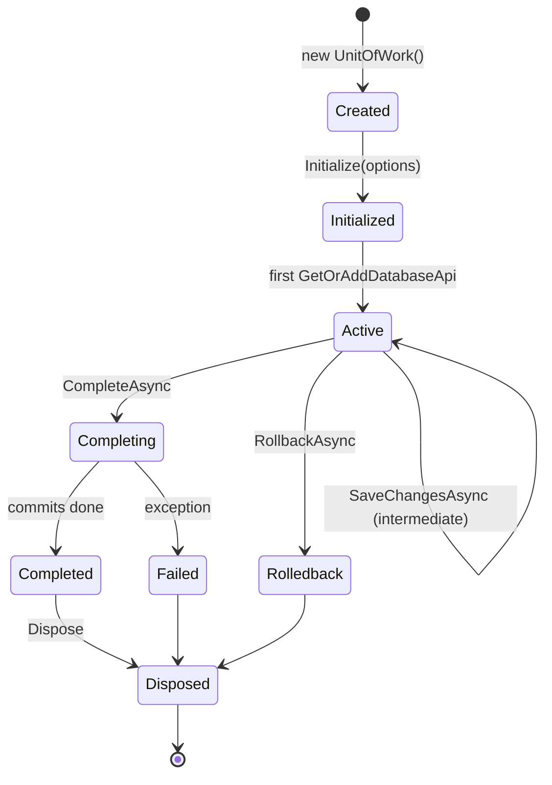
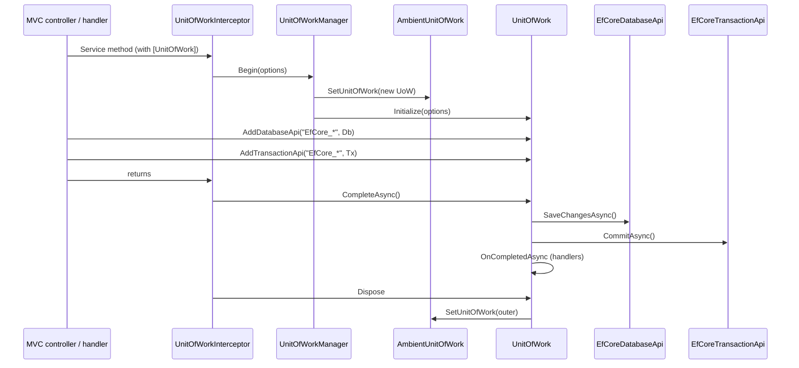
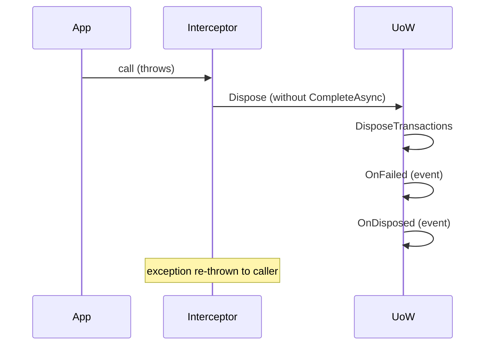

`Volo.Abp.Uow` is the ambient transaction scope of the ABP Framework. It is a tiny package — under thirty C# files in `framework/src/Volo.Abp.Uow/Volo/Abp/Uow/` — but it is the linchpin of every write operation that touches the database. This page walks the begin / complete / rollback lifecycle, the `[UnitOfWork]` attribute that decorates application services, the `UnitOfWorkInterceptor` that picks the attribute up, and the nested‑UoW pattern that lets one outer transaction span several method calls.

## Why ABP needs its own UoW

EF Core has `DbContext.SaveChangesAsync` and `IDbContextTransaction`; MongoDB has `IClientSessionHandle`; Dapper has nothing at all. ABP's `IUnitOfWork` is the common denominator: a per‑request object that holds *any number* of `IDatabaseApi` adapters (one per active store) and `ITransactionApi` adapters, and lets the application layer reason about a single atomic boundary regardless of which providers participated. The contract lives in `framework/src/Volo.Abp.Uow/Volo/Abp/Uow/IUnitOfWork.cs`.

```csharp
public interface IUnitOfWork : IDatabaseApiContainer, ITransactionApiContainer, IDisposable
{
    Guid Id { get; }
    Dictionary<string, object> Items { get; }
    event EventHandler<UnitOfWorkFailedEventArgs> Failed;
    event EventHandler<UnitOfWorkEventArgs> Disposed;
    IAbpUnitOfWorkOptions Options { get; }
    IUnitOfWork? Outer { get; }
    bool IsReserved { get; }
    bool IsDisposed { get; }
    bool IsCompleted { get; }
    string? ReservationName { get; }
    void SetOuter(IUnitOfWork? outer);
    void Initialize([NotNull] AbpUnitOfWorkOptions options);
    void Reserve([NotNull] string reservationName);
    Task SaveChangesAsync(CancellationToken cancellationToken = default);
    Task CompleteAsync(CancellationToken cancellationToken = default);
    Task RollbackAsync(CancellationToken cancellationToken = default);
    void OnCompleted(Func<Task> handler);
    void AddOrReplaceLocalEvent(UnitOfWorkEventRecord eventRecord, Predicate<UnitOfWorkEventRecord>? replacementSelector = null);
    void AddOrReplaceDistributedEvent(UnitOfWorkEventRecord eventRecord, Predicate<UnitOfWorkEventRecord>? replacementSelector = null);
}
```

The two container interfaces — `IDatabaseApiContainer` (`Volo/Abp/Uow/IDatabaseApiContainer.cs`) and `ITransactionApiContainer` (`Volo/Abp/Uow/ITransactionApiContainer.cs`) — are how providers attach their state. Their core methods (`AddDatabaseApi`, `GetOrAddDatabaseApi`, same for transactions) appear directly on `IUnitOfWork`.

## The lifecycle, top to bottom



The state transitions are enforced inside `framework/src/Volo.Abp.Uow/Volo/Abp/Uow/UnitOfWork.cs`. The pieces that matter most are:

- `Initialize(AbpUnitOfWorkOptions options)` — throws `AbpException("This unit of work has already been initialized.")` if called twice. It also calls `_defaultOptions.Normalize(options.Clone())` so global defaults can override what the caller supplied.
- `CompleteAsync` — the only path that commits. It calls `SaveChangesAsync` on every registered database API, drains the local and distributed event buffers (saving changes between each drain pass so newly added events stay inside the same transaction), commits every `ITransactionApi`, sets `IsCompleted = true`, and finally fires the `OnCompleted` handlers.
- `RollbackAsync` — sets `_isRolledback = true`, calls `RollbackAsync` on every `ISupportsRollback` database/transaction API.
- `Dispose` — calls `DisposeTransactions`; if completion did not happen (`!IsCompleted || _exception != null`) it raises `Failed` first, then always raises `Disposed`.

The relevant excerpt from `CompleteAsync` shows the event‑draining loop, which is unique to ABP:

```csharp
public virtual async Task CompleteAsync(CancellationToken cancellationToken = default)
{
    if (_isRolledback) { return; }
    PreventMultipleComplete();
    try
    {
        _isCompleting = true;
        await SaveChangesAsync(cancellationToken);

        LocalEvents.AddRange(GetEventsRecords(LocalEventWithPredicates));
        LocalEventWithPredicates.Clear();
        DistributedEvents.AddRange(GetEventsRecords(DistributedEventWithPredicates));
        DistributedEventWithPredicates.Clear();

        while (LocalEvents.Any() || DistributedEvents.Any())
        {
            if (LocalEvents.Any())
            {
                var localEventsToBePublished = LocalEvents.OrderBy(e => e.EventOrder).ToArray();
                LocalEvents.Clear();
                await UnitOfWorkEventPublisher.PublishLocalEventsAsync(localEventsToBePublished);
            }

            if (DistributedEvents.Any())
            {
                var distributedEventsToBePublished = DistributedEvents.OrderBy(e => e.EventOrder).ToArray();
                DistributedEvents.Clear();
                await UnitOfWorkEventPublisher.PublishDistributedEventsAsync(distributedEventsToBePublished);
            }

            await SaveChangesAsync(cancellationToken);
            // refill from predicate buffers ...
        }

        await CommitTransactionsAsync(cancellationToken);
        IsCompleted = true;
        await OnCompletedAsync();
    }
    catch (Exception ex)
    {
        _exception = ex;
        throw;
    }
}
```

The loop is the reason a domain event raised by an event handler still ends up in the same `SaveChangesAsync` round‑trip — every drain pass flushes pending entity changes.

`RollbackAllAsync` swallows exceptions silently on a per‑API basis so that one provider's failure does not stop the others from rolling back:

```csharp
protected virtual async Task RollbackAllAsync(CancellationToken cancellationToken)
{
    foreach (var databaseApi in GetAllActiveDatabaseApis())
    {
        if (databaseApi is ISupportsRollback supportsRollbackDatabaseApi)
        {
            try { await supportsRollbackDatabaseApi.RollbackAsync(cancellationToken); } catch { }
        }
    }
    foreach (var transactionApi in GetAllActiveTransactionApis())
    {
        if (transactionApi is ISupportsRollback supportsRollbackTransactionApi)
        {
            try { await supportsRollbackTransactionApi.RollbackAsync(cancellationToken); } catch { }
        }
    }
}
```

## Options

`AbpUnitOfWorkOptions.cs` is a three‑field carrier — `IsTransactional`, `IsolationLevel`, `Timeout` (milliseconds) — with a `Clone()` helper.

```csharp
public class AbpUnitOfWorkOptions : IAbpUnitOfWorkOptions
{
    public bool IsTransactional { get; set; }
    public IsolationLevel? IsolationLevel { get; set; }
    public int? Timeout { get; set; }
    // ...
    public AbpUnitOfWorkOptions Clone() => new AbpUnitOfWorkOptions
    {
        IsTransactional = IsTransactional,
        IsolationLevel = IsolationLevel,
        Timeout = Timeout
    };
}
```

`AbpUnitOfWorkDefaultOptions` (`Volo/Abp/Uow/AbpUnitOfWorkDefaultOptions.cs`) holds module‑level defaults and a `Normalize(AbpUnitOfWorkOptions)` method `UnitOfWork.Initialize` calls. The default `IsTransactional` value is computed lazily — see the interceptor below.

## `UnitOfWorkManager`

`UnitOfWorkManager` (`Volo/Abp/Uow/UnitOfWorkManager.cs`) is a singleton (`ISingletonDependency`). It exposes `IUnitOfWork? Current` (which delegates to `IAmbientUnitOfWork.GetCurrentByChecking`) and four methods: `Begin`, `Reserve`, `BeginReserved`, `TryBeginReserved`.

`Begin` is the canonical entry point. It returns a `ChildUnitOfWork` if there is already a current UoW and `requiresNew == false`; otherwise it creates a brand‑new one from a fresh DI scope.

```csharp
public IUnitOfWork Begin(AbpUnitOfWorkOptions options, bool requiresNew = false)
{
    Check.NotNull(options, nameof(options));

    var currentUow = Current;
    if (currentUow != null && !requiresNew)
    {
        return new ChildUnitOfWork(currentUow);
    }

    var unitOfWork = CreateNewUnitOfWork();
    unitOfWork.Initialize(options);

    return unitOfWork;
}
```

`CreateNewUnitOfWork()` is where the DI scope is created and where the `Disposed` handler ensures `_ambientUnitOfWork` reverts to the outer UoW on exit and the DI scope is released:

```csharp
private IUnitOfWork CreateNewUnitOfWork()
{
    var scope = _serviceScopeFactory.CreateScope();
    try
    {
        var outerUow = _ambientUnitOfWork.UnitOfWork;
        var unitOfWork = scope.ServiceProvider.GetRequiredService<IUnitOfWork>();
        unitOfWork.SetOuter(outerUow);
        _ambientUnitOfWork.SetUnitOfWork(unitOfWork);

        unitOfWork.Disposed += (sender, args) =>
        {
            _ambientUnitOfWork.SetUnitOfWork(outerUow);
            scope.Dispose();
        };
        return unitOfWork;
    }
    catch { scope.Dispose(); throw; }
}
```

## `IAmbientUnitOfWork`

`Volo/Abp/Uow/AmbientUnitOfWork.cs` is the AsyncLocal carrier. It implements both `IAmbientUnitOfWork` and `IUnitOfWorkAccessor` and exposes `GetCurrentByChecking()` which **walks `Outer`** to skip reserved/disposed/completed UoWs.

```csharp
public IUnitOfWork? GetCurrentByChecking()
{
    var uow = UnitOfWork;
    while (uow != null && (uow.IsReserved || uow.IsDisposed || uow.IsCompleted))
    {
        uow = uow.Outer;
    }
    return uow;
}
```

This is why `UnitOfWorkManager.Current` returns `null` once the active UoW has been disposed but its AsyncLocal hasn't yet been popped — the walk skips stale entries.

## `ChildUnitOfWork`

`Volo/Abp/Uow/ChildUnitOfWork.cs` is the proxy used for nested calls. Every method delegates to the parent **except** `CompleteAsync` (returns `Task.CompletedTask`) and `Dispose` (no‑op). That asymmetry is the entire reason nested `[UnitOfWork]` calls don't double‑commit and don't dispose the outer scope.

```csharp
public Task CompleteAsync(CancellationToken cancellationToken = default)
{
    return Task.CompletedTask;
}
public void Dispose() { }
```

Internally `ChildUnitOfWork` forwards `Failed` / `Disposed` from the parent so that listeners attached to the child still fire.

## The `[UnitOfWork]` attribute

`Volo/Abp/Uow/UnitOfWorkAttribute.cs` is declarative. It carries optional `IsTransactional`, `Timeout`, `IsolationLevel`, and a `IsDisabled` switch. `SetOptions` copies the populated fields onto an `AbpUnitOfWorkOptions` instance — `null` properties leave the defaults alone.

```csharp
[AttributeUsage(AttributeTargets.Method | AttributeTargets.Class | AttributeTargets.Interface)]
public class UnitOfWorkAttribute : Attribute
{
    public bool? IsTransactional { get; set; }
    public int? Timeout { get; set; }
    public IsolationLevel? IsolationLevel { get; set; }
    public bool IsDisabled { get; set; }
    // constructors omitted ...
    public virtual void SetOptions(AbpUnitOfWorkOptions options)
    {
        if (IsTransactional.HasValue) options.IsTransactional = IsTransactional.Value;
        if (Timeout.HasValue) options.Timeout = Timeout;
        if (IsolationLevel.HasValue) options.IsolationLevel = IsolationLevel;
    }
}
```

`UnitOfWorkHelper.IsUnitOfWorkMethod` (`Volo/Abp/Uow/UnitOfWorkHelper.cs`) checks the method, then the declaring type, then the conventional marker `IUnitOfWorkEnabled`. The return short‑circuits on `attr.IsDisabled`.

## `UnitOfWorkInterceptor`

`Volo/Abp/Uow/UnitOfWorkInterceptor.cs` is the AOP glue. It is registered for every type that returns `true` from `UnitOfWorkHelper.IsUnitOfWorkType`, courtesy of `UnitOfWorkInterceptorRegistrar`.

```csharp
public class UnitOfWorkInterceptor : AbpInterceptor, ITransientDependency
{
    public override async Task InterceptAsync(IAbpMethodInvocation invocation)
    {
        if (!UnitOfWorkHelper.IsUnitOfWorkMethod(invocation.Method, out var unitOfWorkAttribute))
        {
            await invocation.ProceedAsync();
            return;
        }

        using (var scope = _serviceScopeFactory.CreateScope())
        {
            var options = CreateOptions(scope.ServiceProvider, invocation, unitOfWorkAttribute);
            var unitOfWorkManager = scope.ServiceProvider.GetRequiredService<IUnitOfWorkManager>();

            // Trying to begin a reserved UOW by AbpUnitOfWorkMiddleware
            if (unitOfWorkManager.TryBeginReserved(UnitOfWork.UnitOfWorkReservationName, options))
            {
                await invocation.ProceedAsync();
                if (unitOfWorkManager.Current != null)
                {
                    await unitOfWorkManager.Current.SaveChangesAsync();
                }
                return;
            }

            using (var uow = unitOfWorkManager.Begin(options))
            {
                await invocation.ProceedAsync();
                await uow.CompleteAsync();
            }
        }
    }
}
```

Note the two branches: `TryBeginReserved` is the ASP.NET Core middleware path — the request middleware reserves a UoW under `UnitOfWork.UnitOfWorkReservationName = "_AbpActionUnitOfWork"` before MVC binds the action, and the interceptor "activates" it. The fall‑through path is the standalone `Begin`.

The `IsTransactional` decision logic in `CreateOptions` deserves attention:

```csharp
if (unitOfWorkAttribute?.IsTransactional == null)
{
    var defaultOptions = serviceProvider.GetRequiredService<IOptions<AbpUnitOfWorkDefaultOptions>>().Value;
    options.IsTransactional = defaultOptions.CalculateIsTransactional(
        autoValue: serviceProvider.GetRequiredService<IUnitOfWorkTransactionBehaviourProvider>().IsTransactional
                   ?? !invocation.Method.Name.StartsWith("Get", StringComparison.InvariantCultureIgnoreCase)
    );
}
```

If the attribute does not explicitly set `IsTransactional`, the interceptor asks `IUnitOfWorkTransactionBehaviourProvider` (ASP.NET Core registers one that reads `[HttpGet]` etc.), and if that returns `null` it falls back to "method name does not start with `Get`" — a heuristic that defaults `GetXxx` to non‑transactional.

## End‑to‑end sequence



The corresponding lifecycle, told from the perspective of the [unit of work lifecycle](/flows/unit-of-work-lifecycle) flow page, gives the same diagram annotated with the events fired.

## Reservation, nested UoWs, and `requiresNew`

There are three composition modes.

| Mode | Caller code | Behaviour |
| --- | --- | --- |
| Standalone | `using (var uow = mgr.Begin(opts)) { ... await uow.CompleteAsync(); }` | New UoW, owns its scope. |
| Nested | inner `Begin` while outer is active | Returns `ChildUnitOfWork`; outer commits. |
| Force new | `mgr.Begin(opts, requiresNew: true)` | Always creates a new UoW. The outer remains alive but inactive (its AsyncLocal is overwritten until the new one disposes). |
| Reserved | `mgr.Reserve("name", requiresNew)` + later `BeginReserved("name", opts)` / `TryBeginReserved` | Defers initialisation. Used by ASP.NET Core middleware to allocate a UoW slot before MVC binds the action; the interceptor activates it. |

The `Reserve` path is what makes ASP.NET Core integration possible without double‑starting a UoW on every request.

```csharp
public IUnitOfWork Reserve(string reservationName, bool requiresNew = false)
{
    if (!requiresNew &&
        _ambientUnitOfWork.UnitOfWork != null &&
        _ambientUnitOfWork.UnitOfWork.IsReservedFor(reservationName))
    {
        return new ChildUnitOfWork(_ambientUnitOfWork.UnitOfWork);
    }

    var unitOfWork = CreateNewUnitOfWork();
    unitOfWork.Reserve(reservationName);
    return unitOfWork;
}
```

`IsReservedFor` (`UnitOfWorkExtensions.cs`) is a one‑liner: `unitOfWork.IsReserved && unitOfWork.ReservationName == reservationName`.

## `IUnitOfWorkEnabled` — the conventional opt‑in

`Volo/Abp/Uow/IUnitOfWorkEnabled.cs` is an empty marker interface. Any type that implements it is treated by `UnitOfWorkHelper.IsUnitOfWorkType` as if every public method had `[UnitOfWork]`. Repositories (`RepositoryBase<TEntity>`) implement this directly, so a service that calls a repository inherits the UoW behaviour without decorating anything.

```csharp
public static bool IsUnitOfWorkType(TypeInfo implementationType)
{
    if (HasUnitOfWorkAttribute(implementationType) || AnyMethodHasUnitOfWorkAttribute(implementationType))
        return true;
    if (typeof(IUnitOfWorkEnabled).GetTypeInfo().IsAssignableFrom(implementationType))
        return true;
    return false;
}
```

## Events emitted

A UoW is observable via two events and two collections.

| Event / collection | Member | Fired when |
| --- | --- | --- |
| `event Failed` | `UnitOfWork.Failed` | `Dispose` runs while `!IsCompleted` or with stored exception. |
| `event Disposed` | `UnitOfWork.Disposed` | Always on `Dispose`. |
| `OnCompleted(Func<Task>)` | Adds to `CompletedHandlers` | After commits, before returning from `CompleteAsync`. |
| `AddOrReplaceLocalEvent` / `AddOrReplaceDistributedEvent` | Buffered until `CompleteAsync` drains them | Each drain pass also calls `SaveChangesAsync`. |

The `Failed` handler is registered by the auditing module to write the failure to the audit log; the `Disposed` handler is how the DI scope opened in `CreateNewUnitOfWork` is released.

## Exception flow



When the wrapped method throws, the `using (var uow = ...)` block disposes the UoW *without* calling `CompleteAsync`. `Dispose` then sees `!IsCompleted` and fires `Failed`. The pending writes are never `SaveChangesAsync`'d — the underlying connection's transaction is rolled back by EF Core when the transaction's `Dispose` runs.

## `AbpUnitOfWorkModule`

The module file (`Volo/Abp/Uow/AbpUnitOfWorkModule.cs`) does exactly one thing: install the interceptor registrar.

```csharp
public class AbpUnitOfWorkModule : AbpModule
{
    public override void PreConfigureServices(ServiceConfigurationContext context)
    {
        context.Services.OnRegistered(UnitOfWorkInterceptorRegistrar.RegisterIfNeeded);
    }
}
```

`UnitOfWorkInterceptorRegistrar.RegisterIfNeeded` calls `UnitOfWorkHelper.IsUnitOfWorkType` and, if `true`, calls `context.Interceptors.TryAdd<UnitOfWorkInterceptor>()`. That single hook is how the interceptor wraps every UoW‑bearing service automatically.

## Decision table for `IsTransactional`

| `[UnitOfWork(IsTransactional = …)]` | `IUnitOfWorkTransactionBehaviourProvider.IsTransactional` | Method name | Resulting `IsTransactional` |
| --- | --- | --- | --- |
| `true` | (ignored) | (any) | `true` |
| `false` | (ignored) | (any) | `false` |
| absent | `true` | (any) | `true` |
| absent | `false` | (any) | `false` |
| absent | `null` | `GetX` | `false` (heuristic) |
| absent | `null` | `CreateX`, `UpdateX`, ... | `true` (heuristic) |

The provider is ASP.NET Core‑aware; for non‑web hosts (CLI seeders, background workers) the provider is the null implementation `NullUnitOfWorkTransactionBehaviourProvider`, so the heuristic dominates.

## Related reading

<CardGroup cols={2}>
  <Card title="Unit of work lifecycle (flow)" href="/flows/unit-of-work-lifecycle">
    Step‑by‑step trace of a single request, including the middleware reservation path.
  </Card>
  <Card title="EF Core integration" href="/data/entity-framework-core">
    Where `EfCoreDatabaseApi` and `EfCoreTransactionApi` are constructed.
  </Card>
  <Card title="Interceptors and DI" href="/core/dynamic-proxy-and-interceptors">
    How `AbpInterceptor` is wired in — the framework behind `UnitOfWorkInterceptor`.
  </Card>
  <Card title="Data filtering" href="/data/data-filtering">
    Filter state also lives in `AsyncLocal` storage, in parallel with the UoW.
  </Card>
</CardGroup>

The next page, [Data filtering](/data/data-filtering), explores another AsyncLocal mechanism that participates in the same per‑request scope.
