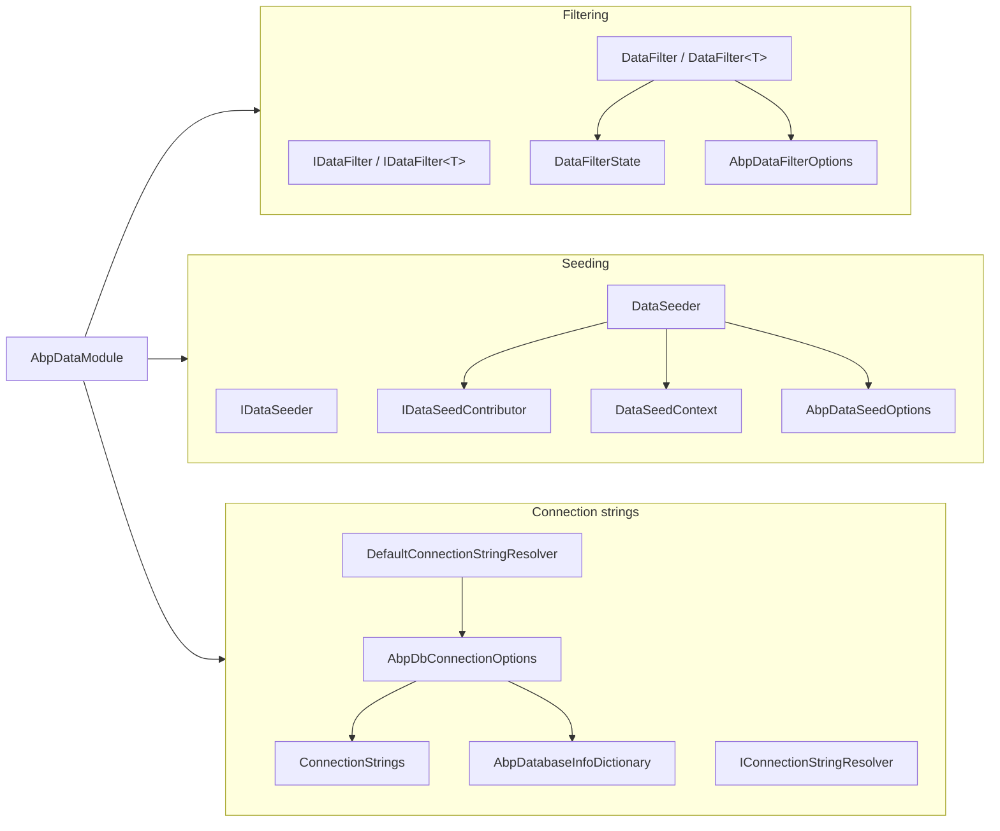
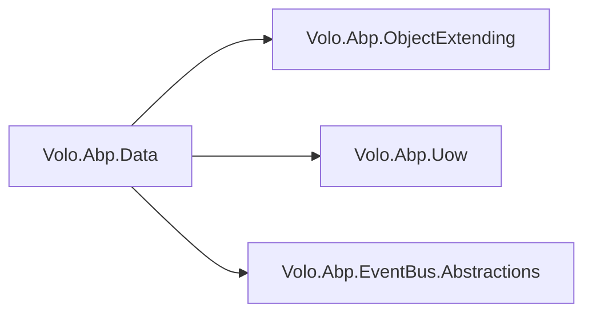

`Volo.Abp.Data` is the agnostic core of the ABP Framework data layer. It contains no reference to Entity Framework Core, MongoDB or any specific driver — only the abstractions that every provider implements. This page walks the contents of `framework/src/Volo.Abp.Data/Volo/Abp/Data/` directory by directory, file by file, so that when you later open the EF Core or MongoDB packages you already recognise every type they call into.

## Directory map

The package lives under one namespace, `Volo.Abp.Data`, with one stray file under `Volo.Abp.Domain.Entities`. The full source tree is small — 32 C# files — and groups into four logical clusters: filtering, seeding, connection strings, and database metadata, plus a small set of cross‑cutting types (the module, the concurrency exception, the migration ETOs).

| Cluster | Files |
| --- | --- |
| Filtering | `IDataFilter.cs`, `DataFilter.cs`, `DataFilterExtensions.cs`, `DataFilterState.cs`, `AbpDataFilterOptions.cs` |
| Seeding | `IDataSeeder.cs`, `DataSeeder.cs`, `IDataSeedContributor.cs`, `DataSeedContext.cs`, `DataSeedContributorList.cs`, `DataSeederExtensions.cs`, `AbpDataSeedOptions.cs` |
| Connection strings | `ConnectionStrings.cs`, `IConnectionStringResolver.cs`, `DefaultConnectionStringResolver.cs`, `AbpDbConnectionOptions.cs`, `ConnectionStringResolverExtensions.cs`, `ConnectionStringNameAttribute.cs` |
| Connection checks | `IConnectionStringChecker.cs`, `DefaultConnectionStringChecker.cs`, `AbpConnectionStringCheckResult.cs` |
| Database metadata | `AbpDatabaseInfo.cs`, `AbpDatabaseInfoDictionary.cs`, `AbpCommonDbProperties.cs` |
| Concurrency | `ConcurrencyStampExtensions.cs`, `AbpDbConcurrencyException.cs`, `Volo/Abp/Domain/Entities/IHasConcurrencyStamp.cs` |
| Migration / events | `AbpDataMigrationEnvironment.cs`, `AbpDataMigrationEnvironmentExtensions.cs`, `ApplyDatabaseMigrationsEto.cs`, `AppliedDatabaseMigrationsEto.cs` |
| Module | `AbpDataModule.cs` |



## `AbpDataModule.cs` — the wiring

`Volo/Abp/Data/AbpDataModule.cs` declares the module dependencies, registers `AbpDbConnectionOptions` against `IConfiguration`, registers the open generic `IDataFilter<>` → `DataFilter<>`, scans the DI container for any registered `IDataSeedContributor` implementation, and refreshes the database‑info index in `PostConfigureServices`. The full body is short enough to read inline.

```csharp
[DependsOn(
    typeof(AbpObjectExtendingModule),
    typeof(AbpUnitOfWorkModule),
    typeof(AbpEventBusAbstractionsModule)
)]
public class AbpDataModule : AbpModule
{
    public override void PreConfigureServices(ServiceConfigurationContext context)
    {
        AutoAddDataSeedContributors(context.Services);
    }

    public override void ConfigureServices(ServiceConfigurationContext context)
    {
        var configuration = context.Services.GetConfiguration();
        Configure<AbpDbConnectionOptions>(configuration);
        context.Services.AddSingleton(typeof(IDataFilter<>), typeof(DataFilter<>));
    }

    public override void PostConfigureServices(ServiceConfigurationContext context)
    {
        Configure<AbpDbConnectionOptions>(options =>
        {
            options.Databases.RefreshIndexes();
        });
    }
    // ...
}
```

The `AutoAddDataSeedContributors` helper uses `services.OnRegistered` to harvest every type that implements `IDataSeedContributor` and adds it to `AbpDataSeedOptions.Contributors`. This is the reason a freshly written seed contributor "just works" without manual registration.

<Note>
`AbpDataModule` depends on `AbpUnitOfWorkModule` because `DataSeeder.SeedAsync` is decorated with `[UnitOfWork]` and needs the interceptor registered. It depends on `AbpEventBusAbstractionsModule` because the package publishes `ApplyDatabaseMigrationsEto` / `AppliedDatabaseMigrationsEto` distributed events.
</Note>

## Filtering files

`IDataFilter.cs` defines two interfaces. The closed `IDataFilter` returns disposables that scope filter state, while the generic `IDataFilter<TFilter>` is the per‑filter facet that providers actually consult.

```csharp
public interface IDataFilter<TFilter>
    where TFilter : class
{
    IDisposable Enable();
    IDisposable Disable();
    bool IsEnabled { get; }
}

public interface IDataFilter
{
    IDisposable Enable<TFilter>() where TFilter : class;
    IDisposable Disable<TFilter>() where TFilter : class;
    bool IsEnabled<TFilter>() where TFilter : class;
}
```

`DataFilter.cs` provides both implementations. The non‑generic `DataFilter` is a `ISingletonDependency` that lazily resolves a `IDataFilter<TFilter>` per type and caches it in a `ConcurrentDictionary<Type, object>`. The generic `DataFilter<TFilter>` is a singleton too, but its state lives in an `AsyncLocal<DataFilterState>` so that each request sees its own enabled/disabled stack.

`DataFilterState.cs` is a one‑field carrier (`bool IsEnabled`) with a `Clone()` method, used to copy the default state into `AsyncLocal` storage. `AbpDataFilterOptions.cs` exposes `Dictionary<Type, DataFilterState> DefaultStates` so modules can pre‑seed which filters start enabled. `DataFilterExtensions.cs` adds two ergonomic overloads — `Enable<TFilter>(this IDataFilter)` returns `IDisposable` directly, mirroring the inner `Enable()`. See [Data filtering](/data/data-filtering) for a behavioural walk.

## Seeding files

The seeding contract is intentionally small. `IDataSeeder.cs` declares one method, `IDataSeedContributor.cs` declares the same shape for contributors, and `DataSeedContext.cs` is the payload carrier.

```csharp
public interface IDataSeeder
{
    Task SeedAsync(DataSeedContext context);
}

public interface IDataSeedContributor
{
    Task SeedAsync(DataSeedContext context);
}
```

`DataSeedContext.cs` carries an optional `TenantId` and a free‑form `Dictionary<string, object?> Properties`, with a `WithProperty` fluent helper. Two well‑known property names are defined in `DataSeederExtensions.cs`: `SeedInSeparateUow`, `SeedInSeparateUowOptions`, `SeedInSeparateUowRequiresNew`. They are consumed by `DataSeeder.SeedAsync` to switch from "run all contributors in the ambient UoW" to "run each contributor in its own `Begin`/`CompleteAsync` block".

```csharp
[UnitOfWork]
public virtual async Task SeedAsync(DataSeedContext context)
{
    using (var scope = ServiceScopeFactory.CreateScope())
    {
        if (context.Properties.ContainsKey(DataSeederExtensions.SeedInSeparateUow))
        {
            var manager = scope.ServiceProvider.GetRequiredService<IUnitOfWorkManager>();
            foreach (var contributorType in Options.Contributors)
            {
                var options = context.Properties.TryGetValue(DataSeederExtensions.SeedInSeparateUowOptions, out var uowOptions)
                    ? (AbpUnitOfWorkOptions) uowOptions!
                    : new AbpUnitOfWorkOptions();
                var requiresNew = context.Properties.TryGetValue(DataSeederExtensions.SeedInSeparateUowRequiresNew, out var obj) && (bool) obj!;

                using (var uow = manager.Begin(options, requiresNew))
                {
                    var contributor = (IDataSeedContributor)scope.ServiceProvider.GetRequiredService(contributorType);
                    await contributor.SeedAsync(context);
                    await uow.CompleteAsync();
                }
            }
        }
        else
        {
            foreach (var contributorType in Options.Contributors)
            {
                var contributor = (IDataSeedContributor)scope.ServiceProvider.GetRequiredService(contributorType);
                await contributor.SeedAsync(context);
            }
        }
    }
}
```

`DataSeedContributorList.cs` is `TypeList<IDataSeedContributor>` and `AbpDataSeedOptions.cs` exposes it as `Contributors`. The full pattern is covered in [Data seeding](/data/data-seeding).

## Connection string files

`ConnectionStrings.cs` is the user‑facing options shape: a `Dictionary<string, string?>` with a convenience `Default` property and the constant `DefaultConnectionStringName = "Default"`.

```csharp
public class ConnectionStrings : Dictionary<string, string?>
{
    public const string DefaultConnectionStringName = "Default";

    public string? Default {
        get => this.GetOrDefault(DefaultConnectionStringName);
        set => this[DefaultConnectionStringName] = value;
    }
}
```

`AbpDbConnectionOptions.cs` wraps `ConnectionStrings` with an `AbpDatabaseInfoDictionary Databases` and the `GetConnectionStringOrNull(name, fallbackToDatabaseMappings, fallbackToDefault)` lookup. The fallback chain is: direct lookup → database mapping → `Default`.

`IConnectionStringResolver.cs` is the abstraction every provider's `DbContextProvider` calls. `DefaultConnectionStringResolver.cs` is the in‑process implementation; multi‑tenant scenarios replace it with a tenant‑aware resolver that reads the resolved tenant's own connection string (see the `Volo.Abp.MultiTenancy` package). `ConnectionStringNameAttribute.cs` declares the `[ConnectionStringName("X")]` decorator and a static `GetConnStringName(Type)` that falls back to `type.FullName` when the attribute is absent — that fallback is why your DbContext class name shows up in `appsettings.json` as a key.

`ConnectionStringResolverExtensions.cs` exposes a typed overload — `ResolveAsync<T>()` — that internally calls `ConnectionStringNameAttribute.GetConnStringName<T>()`. See [Connection strings](/data/connection-strings).

## Connection check files

`IConnectionStringChecker.cs` and `AbpConnectionStringCheckResult.cs` declare a two‑boolean (`Connected`, `DatabaseExists`) probe. `DefaultConnectionStringChecker.cs` is a stub that always returns `false`/`false`; each EF Core provider replaces it with a real implementation:

| Provider | Checker class | File |
| --- | --- | --- |
| SQL Server | `SqlServerConnectionStringChecker` | `Volo.Abp.EntityFrameworkCore.SqlServer/Volo/Abp/EntityFrameworkCore/ConnectionStrings/SqlServerConnectionStringChecker.cs` |
| Npgsql | `NpgsqlConnectionStringChecker` | `Volo.Abp.EntityFrameworkCore.PostgreSql/.../NpgsqlConnectionStringChecker.cs` |
| MySQL (Oracle MySQL) | `MySQLConnectionStringChecker` | `Volo.Abp.EntityFrameworkCore.MySQL/.../MySQLConnectionStringChecker.cs` |
| MySQL (Pomelo) | `PomeloMySQLConnectionStringChecker` | `Volo.Abp.EntityFrameworkCore.MySQL.Pomelo/.../PomeloMySQLConnectionStringChecker.cs` |
| Sqlite | `SqliteConnectionStringChecker` | `Volo.Abp.EntityFrameworkCore.Sqlite/.../SqliteConnectionStringChecker.cs` |
| Oracle | `OracleConnectionStringChecker` | `Volo.Abp.EntityFrameworkCore.Oracle/.../OracleConnectionStringChecker.cs` |
| Oracle Devart | `OracleDevartConnectionStringChecker` | `Volo.Abp.EntityFrameworkCore.Oracle.Devart/.../OracleDevartConnectionStringChecker.cs` |
| MongoDB | `MongoDBConnectionStringChecker` | `Volo.Abp.MongoDB/Volo/Abp/MongoDB/ConnectionStrings/MongoDBConnectionStringChecker.cs` |

The SQL Server probe is representative — it opens with a 1‑second timeout, switches to `master`, then changes to the originally requested database.

```csharp
[Dependency(ReplaceServices = true)]
public class SqlServerConnectionStringChecker : IConnectionStringChecker, ITransientDependency
{
    public virtual async Task<AbpConnectionStringCheckResult> CheckAsync(string connectionString)
    {
        var result = new AbpConnectionStringCheckResult();
        try
        {
            var connString = new SqlConnectionStringBuilder(connectionString) { ConnectTimeout = 1 };
            var oldDatabaseName = connString.InitialCatalog;
            connString.InitialCatalog = "master";

            await using var conn = new SqlConnection(connString.ConnectionString);
            await conn.OpenAsync();
            result.Connected = true;
            await conn.ChangeDatabaseAsync(oldDatabaseName);
            result.DatabaseExists = true;
            // ...
```

## Database metadata files

`AbpDatabaseInfo.cs` represents a single logical database — `DatabaseName`, the `HashSet<string> MappedConnections`, and a `bool IsUsedByTenants` flag.

```csharp
public class AbpDatabaseInfo
{
    public string DatabaseName { get; }
    public HashSet<string> MappedConnections { get; }
    public bool IsUsedByTenants { get; set; } = true;
    // ...
    public void MapConnection(params string[] connectionNames) { /* ... */ }
}
```

`AbpDatabaseInfoDictionary.cs` is a `Dictionary<string, AbpDatabaseInfo>` with a secondary `ConnectionIndex` for reverse lookup and a `RefreshIndexes()` method called from `AbpDataModule.PostConfigureServices`. `AbpCommonDbProperties.cs` defines the SQL schema name constant (`AbpCommonDbProperties.DbSchema`) used by ABP's first‑party EF Core entity configurations.

## Concurrency files

`Volo/Abp/Domain/Entities/IHasConcurrencyStamp.cs` is one of the most‑checked markers in the framework.

```csharp
namespace Volo.Abp.Domain.Entities;

public interface IHasConcurrencyStamp
{
    string ConcurrencyStamp { get; set; }
}
```

`ConcurrencyStampExtensions.cs` adds `SetConcurrencyStampIfNotNull` so service code can do `existing.SetConcurrencyStampIfNotNull(input.ConcurrencyStamp)` without null‑guarding. `AbpDbConcurrencyException.cs` is the exception `AbpDbContext.SaveChangesAsync` throws when EF Core raises a `DbUpdateConcurrencyException`. See [Concurrency check](/data/concurrency-check) for the EF Core integration.

## Migration files

The package emits two event payloads to coordinate distributed migrations.

| File | Purpose |
| --- | --- |
| `ApplyDatabaseMigrationsEto.cs` | Signal *please apply migrations* across nodes. |
| `AppliedDatabaseMigrationsEto.cs` | Notification that migrations have been applied. |
| `AbpDataMigrationEnvironment.cs` | Strings constants used as environment names ("Development", etc.). |
| `AbpDataMigrationEnvironmentExtensions.cs` | Static helpers to read the current environment. |

These are consumed by `EfCoreRuntimeDatabaseMigratorBase` (see `framework/src/Volo.Abp.EntityFrameworkCore/Volo/Abp/EntityFrameworkCore/Migrations/EfCoreRuntimeDatabaseMigratorBase.cs`).

## Quick reference: where is X?

| Symbol | File |
| --- | --- |
| `IDataFilter` | `Volo/Abp/Data/IDataFilter.cs` |
| `IDataFilter<TFilter>` | same file |
| `DataFilter` | `Volo/Abp/Data/DataFilter.cs` |
| `DataFilter<TFilter>` | same file |
| `DataFilterState` | `Volo/Abp/Data/DataFilterState.cs` |
| `AbpDataFilterOptions` | `Volo/Abp/Data/AbpDataFilterOptions.cs` |
| `IDataSeeder` | `Volo/Abp/Data/IDataSeeder.cs` |
| `DataSeeder` | `Volo/Abp/Data/DataSeeder.cs` |
| `IDataSeedContributor` | `Volo/Abp/Data/IDataSeedContributor.cs` |
| `DataSeedContext` | `Volo/Abp/Data/DataSeedContext.cs` |
| `AbpDataSeedOptions` | `Volo/Abp/Data/AbpDataSeedOptions.cs` |
| `ConnectionStrings` | `Volo/Abp/Data/ConnectionStrings.cs` |
| `IConnectionStringResolver` | `Volo/Abp/Data/IConnectionStringResolver.cs` |
| `DefaultConnectionStringResolver` | `Volo/Abp/Data/DefaultConnectionStringResolver.cs` |
| `AbpDbConnectionOptions` | `Volo/Abp/Data/AbpDbConnectionOptions.cs` |
| `ConnectionStringNameAttribute` | `Volo/Abp/Data/ConnectionStringNameAttribute.cs` |
| `AbpDatabaseInfo` | `Volo/Abp/Data/AbpDatabaseInfo.cs` |
| `AbpDatabaseInfoDictionary` | `Volo/Abp/Data/AbpDatabaseInfoDictionary.cs` |
| `IConnectionStringChecker` | `Volo/Abp/Data/IConnectionStringChecker.cs` |
| `DefaultConnectionStringChecker` | `Volo/Abp/Data/DefaultConnectionStringChecker.cs` |
| `IHasConcurrencyStamp` | `Volo/Abp/Domain/Entities/IHasConcurrencyStamp.cs` |
| `AbpDbConcurrencyException` | `Volo/Abp/Data/AbpDbConcurrencyException.cs` |
| `AbpDataModule` | `Volo/Abp/Data/AbpDataModule.cs` |

## Dependencies declared by the package

The csproj (`framework/src/Volo.Abp.Data/Volo.Abp.Data.csproj`, implied by the `[DependsOn]` attributes) takes references on only three other ABP packages.



This minimal surface is what lets every provider package depend on `Volo.Abp.Data` without pulling EF Core or Mongo into the host process by accident.

## Cross‑links

<CardGroup cols={2}>
  <Card title="Modules" href="/core/modules">
    The `[DependsOn]` graph and `AbpModule` lifecycle that `AbpDataModule` participates in.
  </Card>
  <Card title="Options" href="/core/options-pattern">
    `Configure<AbpDbConnectionOptions>` follows the standard ABP options registration pattern.
  </Card>
  <Card title="Unit of work" href="/data/unit-of-work">
    The `[UnitOfWork]` attribute that `DataSeeder.SeedAsync` is decorated with.
  </Card>
  <Card title="Multi‑tenancy" href="/multi-tenancy/connection-strings">
    How `IConnectionStringResolver` is replaced when a tenant has its own connection string.
  </Card>
</CardGroup>

The next page, [Unit of work](/data/unit-of-work), opens the sister package — `Volo.Abp.Uow` — and follows the begin/complete/rollback lifecycle that `DataSeeder` relies on.
