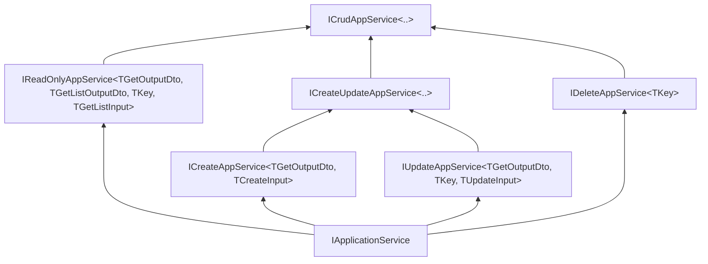

The `Volo.Abp.Ddd.Application.Contracts` package is the *public face* of every ABP Framework module: it holds DTOs, application-service interfaces, permission definition base classes, feature/setting definition contracts, and the localization resources used in shared validation messages. Everything in this package is intentionally infrastructure-free so it can be shared with HTTP API client proxies, Blazor WebAssembly UIs, Angular client gen targets, and downstream microservices. This page maps the directory tree, walks the `IApplicationService` / `IRemoteService` markers, breaks down the `ICrudAppService<...>` interface tower (`IReadOnlyAppService`, `ICreateAppService`, `IUpdateAppService`, `IDeleteAppService`, `ICreateUpdateAppService`), and finishes with the `AbpDddApplicationContractsModule` and the localization resource it ships.

## Package layout

| Folder | Contents |
|---|---|
| `Volo/Abp/Application/Services/` | Application-service marker + interface tower (no implementations) |
| `Volo/Abp/Application/Dtos/` | DTO base classes + result/request interfaces (see [DTOs page](/ddd/application-dtos)) |
| `Volo/Abp/Application/Localization/Resources/AbpDdd/` | `AbpDddApplicationContractsResource` + embedded JSON for cross-cutting messages |
| `AbpDddApplicationContractsModule.cs` (root) | Module class |

## What "contracts" means

A *contract* in ABP parlance is anything that can be referenced by both the server-side implementation and a remote client. Contracts must:

- **not** reference EF Core, MongoDB, or any persistence framework;
- **not** reference repositories or domain services;
- **not** reference `Volo.Abp.Ddd.Application` (the implementation layer);
- be safe to compile against `netstandard2.0` so they can ship to Blazor WASM.

This is enforced by the package's `[DependsOn]` list — it only pulls in localization, auditing contracts, and the data module:

```csharp
// framework/src/Volo.Abp.Ddd.Application.Contracts/Volo/Abp/Application/AbpDddApplicationContractsModule.cs
using Volo.Abp.Application.Localization.Resources.AbpDdd;
using Volo.Abp.Auditing;
using Volo.Abp.Data;
using Volo.Abp.Localization;
using Volo.Abp.Modularity;
using Volo.Abp.VirtualFileSystem;

namespace Volo.Abp.Application;

[DependsOn(
    typeof(AbpLocalizationModule),
    typeof(AbpAuditingContractsModule),
    typeof(AbpDataModule)
)]
public class AbpDddApplicationContractsModule : AbpModule
{
    public override void ConfigureServices(ServiceConfigurationContext context)
    {
        Configure<AbpVirtualFileSystemOptions>(options =>
        {
            options.FileSets.AddEmbedded<AbpDddApplicationContractsModule>();
        });

        Configure<AbpLocalizationOptions>(options =>
        {
            options.Resources
                .Add<AbpDddApplicationContractsResource>("en")
                .AddVirtualJson("/Volo/Abp/Application/Localization/Resources/AbpDdd");
        });
    }
}
```

The module's `ConfigureServices` registers the embedded `AbpDddApplicationContractsResource` so error messages like "MaxResultCountExceededExceptionMessage" (used by `LimitedResultRequestDto`) can be looked up by client and server alike.

## `IApplicationService` — the universal marker

```csharp
// framework/src/Volo.Abp.Ddd.Application.Contracts/Volo/Abp/Application/Services/IApplicationService.cs
namespace Volo.Abp.Application.Services;

public interface IApplicationService : IRemoteService
{
}
```

`IRemoteService` is the broader concept — it includes app services *and* integration-style services that aren't `IApplicationService`:

```csharp
// framework/src/Volo.Abp.Core/Volo/Abp/IRemoteService.cs
namespace Volo.Abp;

public interface IRemoteService
{
}
```

Every interface you put in `*.Application.Contracts/Services` should extend `IApplicationService` so ABP's auto-controller and dynamic-proxy systems recognise it.

## The application service interface tower

ABP factors CRUD into separate interfaces, then composes them in `ICrudAppService<...>`. Each leaf interface drives one HTTP verb in the auto-generated controllers, and each is independently consumable so you can pick exactly the operations you want.



### `ICreateAppService<TEntityDto>`

```csharp
// framework/src/Volo.Abp.Ddd.Application.Contracts/Volo/Abp/Application/Services/ICreateAppService.cs
public interface ICreateAppService<TEntityDto> : ICreateAppService<TEntityDto, TEntityDto>
{
}

public interface ICreateAppService<TGetOutputDto, in TCreateInput> : IApplicationService
{
    Task<TGetOutputDto> CreateAsync(TCreateInput input);
}
```

The one-parameter overload says "use the same DTO type for both input and output" — fine for simple cases. The two-parameter overload separates them; this is what `CrudAppService` ultimately uses.

### `IUpdateAppService<TEntityDto, TKey>`

```csharp
// framework/src/Volo.Abp.Ddd.Application.Contracts/Volo/Abp/Application/Services/IUpdateAppService.cs
public interface IUpdateAppService<TEntityDto, in TKey> : IUpdateAppService<TEntityDto, TKey, TEntityDto>
{
}

public interface IUpdateAppService<TGetOutputDto, in TKey, in TUpdateInput> : IApplicationService
{
    Task<TGetOutputDto> UpdateAsync(TKey id, TUpdateInput input);
}
```

### `IDeleteAppService<TKey>`

The single-method delete contract — the minimal idempotent surface, returning nothing on success:

```csharp
// framework/src/Volo.Abp.Ddd.Application.Contracts/Volo/Abp/Application/Services/IDeleteAppService.cs
public interface IDeleteAppService<in TKey> : IApplicationService
{
    Task DeleteAsync(TKey id);
}
```

### `IReadOnlyAppService<...>` — get + list

The read surface returns either a single DTO or a `PagedResultDto<T>` (from the [DTOs page](/ddd/application-dtos)):

```csharp
// framework/src/Volo.Abp.Ddd.Application.Contracts/Volo/Abp/Application/Services/IReadOnlyAppService.cs
public interface IReadOnlyAppService<TEntityDto, in TKey>
    : IReadOnlyAppService<TEntityDto, TEntityDto, TKey, PagedAndSortedResultRequestDto>
{
}

public interface IReadOnlyAppService<TEntityDto, in TKey, in TGetListInput>
    : IReadOnlyAppService<TEntityDto, TEntityDto, TKey, TGetListInput>
{
}

public interface IReadOnlyAppService<TGetOutputDto, TGetListOutputDto, in TKey, in TGetListInput>
    : IApplicationService
{
    Task<TGetOutputDto> GetAsync(TKey id);

    Task<PagedResultDto<TGetListOutputDto>> GetListAsync(TGetListInput input);
}
```

Three notes:

1. The shortest overload defaults the list input to `PagedAndSortedResultRequestDto` — see the [DTOs page](/ddd/application-dtos).
2. `TGetOutputDto` and `TGetListOutputDto` can differ — common when you return more detail from `GetAsync` than from `GetListAsync` (lookup screens often need only `id`/`displayName`).
3. The `in` variance markers on the type parameters lets a client treat `IReadOnlyAppService<DerivedDto, ...>` as `IReadOnlyAppService<BaseDto, ...>` if appropriate.

### `ICreateUpdateAppService<...>` — combined CRUD-minus-D

`ICreateUpdateAppService<...>` is the "form" pattern — `CreateAsync` plus `UpdateAsync` that take the same DTO. It does not include `GetAsync` or `DeleteAsync`:

```csharp
// framework/src/Volo.Abp.Ddd.Application.Contracts/Volo/Abp/Application/Services/ICreateUpdateAppService.cs
public interface ICreateUpdateAppService<TEntityDto, in TKey>
    : ICreateUpdateAppService<TEntityDto, TKey, TEntityDto, TEntityDto>
{
}

public interface ICreateUpdateAppService<TEntityDto, in TKey, in TCreateUpdateInput>
    : ICreateUpdateAppService<TEntityDto, TKey, TCreateUpdateInput, TCreateUpdateInput>
{
}

public interface ICreateUpdateAppService<TGetOutputDto, in TKey, in TCreateUpdateInput, in TUpdateInput>
    : ICreateAppService<TGetOutputDto, TCreateUpdateInput>,
        IUpdateAppService<TGetOutputDto, TKey, TUpdateInput>
{
}
```

### `ICrudAppService<...>` — full CRUD

`ICrudAppService<...>` is just the union: read-only + create-update + delete. Six overloads progressively split the DTO/input parameters:

```csharp
// framework/src/Volo.Abp.Ddd.Application.Contracts/Volo/Abp/Application/Services/ICrudAppService.cs
public interface ICrudAppService<TEntityDto, in TKey>
    : ICrudAppService<TEntityDto, TKey, PagedAndSortedResultRequestDto>
{
}

public interface ICrudAppService<TEntityDto, in TKey, in TGetListInput>
    : ICrudAppService<TEntityDto, TKey, TGetListInput, TEntityDto>
{
}

public interface ICrudAppService<TEntityDto, in TKey, in TGetListInput, in TCreateInput>
    : ICrudAppService<TEntityDto, TKey, TGetListInput, TCreateInput, TCreateInput>
{
}

public interface ICrudAppService<TEntityDto, in TKey, in TGetListInput, in TCreateInput, in TUpdateInput>
    : ICrudAppService<TEntityDto, TEntityDto, TKey, TGetListInput, TCreateInput, TUpdateInput>
{
}

public interface ICrudAppService<TGetOutputDto, TGetListOutputDto, in TKey, in TGetListInput, in TCreateInput, in TUpdateInput>
    : IReadOnlyAppService<TGetOutputDto, TGetListOutputDto, TKey, TGetListInput>,
        ICreateUpdateAppService<TGetOutputDto, TKey, TCreateInput, TUpdateInput>,
        IDeleteAppService<TKey>
{
}
```

The most general overload has six type parameters; each shorter overload defaults one of them:

| Overload arity | Default substituted |
|---|---|
| `<TEntityDto, TKey>` | `TGetListInput = PagedAndSortedResultRequestDto`, all DTOs collapsed |
| `<TEntityDto, TKey, TGetListInput>` | `TCreateInput = TEntityDto`, ... |
| `<TEntityDto, TKey, TGetListInput, TCreateInput>` | `TUpdateInput = TCreateInput` |
| `<TEntityDto, TKey, TGetListInput, TCreateInput, TUpdateInput>` | `TGetListOutputDto = TEntityDto` |
| `<TGetOutputDto, TGetListOutputDto, TKey, TGetListInput, TCreateInput, TUpdateInput>` | All explicit |

A typical app service declaration is therefore short:

```csharp
public interface IBookAppService :
    ICrudAppService<
        BookDto,
        Guid,
        PagedAndSortedResultRequestDto,
        CreateUpdateBookDto>
{
}
```

The implementation side is on the [CRUD AppService page](/ddd/crud-app-service).

## Method-by-method surface

The complete CRUD surface, mapped to its source interface:

| Method | Defined in | HTTP verb (auto-controller) |
|---|---|---|
| `Task<TGetOutputDto> GetAsync(TKey id)` | `IReadOnlyAppService<...>` | `GET /api/app/book/{id}` |
| `Task<PagedResultDto<TGetListOutputDto>> GetListAsync(TGetListInput input)` | `IReadOnlyAppService<...>` | `GET /api/app/book` |
| `Task<TGetOutputDto> CreateAsync(TCreateInput input)` | `ICreateAppService<...>` | `POST /api/app/book` |
| `Task<TGetOutputDto> UpdateAsync(TKey id, TUpdateInput input)` | `IUpdateAppService<...>` | `PUT /api/app/book/{id}` |
| `Task DeleteAsync(TKey id)` | `IDeleteAppService<...>` | `DELETE /api/app/book/{id}` |

ABP's auto-controller convention strips the `AppService` suffix from the type name and the `Async` suffix from the method name to derive route segments.

## The `AbpDddApplicationContractsResource`

The package ships one localization resource class:

```csharp
// framework/src/Volo.Abp.Ddd.Application.Contracts/Volo/Abp/Application/Localization/Resources/AbpDdd/AbpDddApplicationContractsResource.cs
public class AbpDddApplicationContractsResource
{
}
```

It is bound to embedded JSON via `AddVirtualJson("/Volo/Abp/Application/Localization/Resources/AbpDdd")` in the module's `ConfigureServices`. The most important entry it ships is `MaxResultCountExceededExceptionMessage`, used by `LimitedResultRequestDto.Validate(...)` when a client sends `MaxResultCount > MaxMaxResultCount`.

## Permission / feature / setting definitions in the contracts package

By convention, your module's `*.Application.Contracts` project also hosts the static *definition* classes:

| Type | Base class | Lives in |
|---|---|---|
| Permission definitions | `PermissionDefinitionProvider` | `Volo.Abp.Authorization.Permissions` |
| Feature definitions | `FeatureDefinitionProvider` | `Volo.Abp.Features` |
| Setting definitions | `SettingDefinitionProvider` | `Volo.Abp.Settings` |

These base classes are not in the `Volo.Abp.Ddd.Application.Contracts` package itself — they're in their respective abstraction modules, which the contracts package pulls in transitively. Putting them in `*.Application.Contracts` keeps the strings (permission names like `"BookStore.Books.Create"`) available to both server and client.

## Cross-references in the contracts surface

Here's how the application-contracts types relate to the DTO types from the contracts package and the implementation classes from the application package:

```mermaid
graph LR
    subgraph Contracts package
      ICreate["ICreateAppService<...>"]
      IUpdate["IUpdateAppService<...>"]
      IDelete["IDeleteAppService<...>"]
      IRO["IReadOnlyAppService<...>"]
      ICRUD["ICrudAppService<...>"]
      PagedDto["PagedResultDto<T>"]
      PagedReq["PagedAndSortedResultRequestDto"]
      EntityDto["EntityDto<TKey>"]
    end
    subgraph Application package
      AppSvc["ApplicationService"]
      Read["ReadOnlyAppService<...>"]
      Crud["CrudAppService<...>"]
    end

    ICRUD --> ICreate
    ICRUD --> IUpdate
    ICRUD --> IDelete
    ICRUD --> IRO
    Read -.implements.-> IRO
    Crud -.implements.-> ICRUD
    AppSvc <|-- Read
    Read <|-- Crud
    IRO -.uses.-> PagedDto
    IRO -.uses.-> PagedReq
    ICreate -.uses.-> EntityDto
```

## Why this matters for client generation

ABP's *dynamic HTTP client proxy* feature (`Volo.Abp.Http.Client.DynamicProxying`) generates HTTP-calling implementations of every `IApplicationService` interface at runtime. Because the interface tower is in `*.Application.Contracts`, you can reference that one project from a Blazor WASM app and call `_bookAppService.GetListAsync(...)` exactly as if you were on the server — the proxy handles HTTP serialization.

Similarly, the `Volo.Abp.AspNetCore.Mvc.Client` and `Volo.Abp.AspNetCore.Mvc.Conventions.Routes` features look at the same interfaces to wire up the *server-side* auto-controllers. This dual use is the entire reason contracts must remain infrastructure-free.

## Cross-references

- [DTOs page](/ddd/application-dtos) — types referenced by these contracts.
- [CRUD app service page](/ddd/crud-app-service) — the concrete implementation that satisfies `ICrudAppService<...>`.
- [Application services page](/ddd/application-services) — the implementation layer's lazy-DI base class.
- [Overview](/ddd/overview) — the four-package dependency diagram.
- [Identity module](/modules/identity) — real-world `IIdentityUserAppService` implementing this interface tower.
