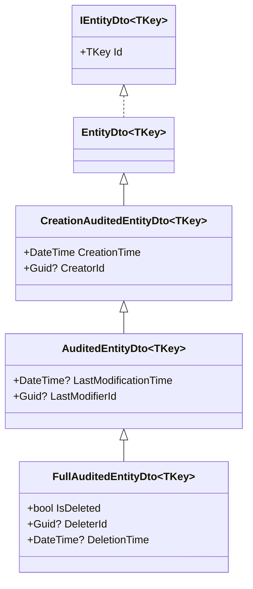

The `Volo.Abp.Ddd.Application.Contracts` package's `Dtos/` folder is the canonical home for ABP Framework DTO base classes. Every DTO you ship over the wire — single entity payloads, list results, paged results, list-request envelopes — has a base class here that already implements the right interfaces, validation rules, and constructor patterns. This page walks the marker interfaces (`IEntityDto`, `IListResult`, `IPagedResult`, `IHasTotalCount`, `ILimitedResultRequest`, `IPagedResultRequest`, `IPagedAndSortedResultRequest`, `ISortedResultRequest`), the concrete base classes (`EntityDto<TKey>`, `CreationAuditedEntityDto`, `AuditedEntityDto`, `FullAuditedEntityDto`, `ListResultDto<T>`, `PagedResultDto<T>`, `LimitedResultRequestDto`, `PagedResultRequestDto`, `PagedAndSortedResultRequestDto`), and the `Extensible*` variants that integrate with [Object extending](/ddd/object-extending).

## Interface map

The interface contracts in `Application/Dtos/` are short and orthogonal:

| Interface | Property | File |
|---|---|---|
| `IEntityDto` | (marker) | `IEntityDto.cs` |
| `IEntityDto<TKey>` | `TKey Id { get; set; }` | `IEntityDto.cs` |
| `IListResult<T>` | `IReadOnlyList<T> Items` | `IListResult.cs` |
| `IHasTotalCount` | `long TotalCount` | `IHasTotalCount.cs` |
| `IPagedResult<T>` | combines the two above | `IPagedResult.cs` |
| `ILimitedResultRequest` | `int MaxResultCount` | `ILimitedResultRequest.cs` |
| `IPagedResultRequest` | adds `int SkipCount` | `IPagedResultRequest.cs` |
| `ISortedResultRequest` | `string? Sorting` | `ISortedResultRequest.cs` |
| `IPagedAndSortedResultRequest` | combines paged + sorted | `IPagedAndSortedResultRequest.cs` |

The interfaces split read responses (`IListResult`, `IPagedResult`) from read requests (`ILimitedResultRequest`, `IPagedResultRequest`, `ISortedResultRequest`) — both halves are needed for paged-list endpoints, and the framework's `AbstractKeyReadOnlyAppService.ApplySorting`/`ApplyPaging` use interface-based pattern matching, so any input that *implements* the right interface gets the right behaviour automatically (see [CRUD app service](/ddd/crud-app-service)).

## `IEntityDto` markers

`IEntityDto` and its keyed companion are the two-marker pair that every entity-shaped DTO implements:

```csharp
// framework/src/Volo.Abp.Ddd.Application.Contracts/Volo/Abp/Application/Dtos/IEntityDto.cs
public interface IEntityDto
{
}

public interface IEntityDto<TKey> : IEntityDto, IKeyedObject
{
    TKey Id { get; set; }
}
```

`IKeyedObject` (from `Volo.Abp.Core`) declares `string? GetObjectKey()` — useful for cache keys and Blazor render keys.

## `EntityDto` / `EntityDto<TKey>`

The non-generic base is essentially a `ToString` override for debugging. The generic adds `Id` and `GetObjectKey()`:

```csharp
// framework/src/Volo.Abp.Ddd.Application.Contracts/Volo/Abp/Application/Dtos/EntityDto.cs
[Serializable]
public abstract class EntityDto : IEntityDto //TODO: Consider to delete this class
{
    public override string ToString()
    {
        return $"[DTO: {GetType().Name}]";
    }
}

[Serializable]
public abstract class EntityDto<TKey> : EntityDto, IEntityDto<TKey>
{
    public TKey Id { get; set; } = default!;

    public override string ToString()
    {
        return $"[DTO: {GetType().Name}] Id = {Id}";
    }

    public virtual string? GetObjectKey()
    {
        return Id?.ToString();
    }
}
```

The `// TODO: Consider to delete this class` comment in the source flags the non-generic `EntityDto` as legacy — the recommended path is to use `EntityDto<TKey>` or implement `IEntityDto<TKey>` directly.

## Auditing DTO family

The auditing DTO classes mirror the [entity auditing classes](/ddd/domain-entities-and-aggregates) one-to-one. The chain is `EntityDto<TKey>` → `CreationAuditedEntityDto<TKey>` → `AuditedEntityDto<TKey>` → `FullAuditedEntityDto<TKey>`.

```csharp
// framework/src/Volo.Abp.Ddd.Application.Contracts/Volo/Abp/Application/Dtos/CreationAuditedEntityDto.cs
[Serializable]
public abstract class CreationAuditedEntityDto : EntityDto, ICreationAuditedObject
{
    public DateTime CreationTime { get; set; }
    public Guid? CreatorId { get; set; }
}

[Serializable]
public abstract class CreationAuditedEntityDto<TPrimaryKey> : EntityDto<TPrimaryKey>, ICreationAuditedObject
{
    public DateTime CreationTime { get; set; }
    public Guid? CreatorId { get; set; }
}
```

```csharp
// framework/src/Volo.Abp.Ddd.Application.Contracts/Volo/Abp/Application/Dtos/AuditedEntityDto.cs
[Serializable]
public abstract class AuditedEntityDto : CreationAuditedEntityDto, IAuditedObject
{
    public DateTime? LastModificationTime { get; set; }
    public Guid? LastModifierId { get; set; }
}

[Serializable]
public abstract class AuditedEntityDto<TPrimaryKey> : CreationAuditedEntityDto<TPrimaryKey>, IAuditedObject
{
    public DateTime? LastModificationTime { get; set; }
    public Guid? LastModifierId { get; set; }
}
```

```csharp
// framework/src/Volo.Abp.Ddd.Application.Contracts/Volo/Abp/Application/Dtos/FullAuditedEntityDto.cs
[Serializable]
public abstract class FullAuditedEntityDto : AuditedEntityDto, IFullAuditedObject
{
    public bool IsDeleted { get; set; }
    public Guid? DeleterId { get; set; }
    public DateTime? DeletionTime { get; set; }
}

[Serializable]
public abstract class FullAuditedEntityDto<TPrimaryKey> : AuditedEntityDto<TPrimaryKey>, IFullAuditedObject
{
    public bool IsDeleted { get; set; }
    public Guid? DeleterId { get; set; }
    public DateTime? DeletionTime { get; set; }
}
```

A key difference from the *entity* counterparts: the DTO setters are `public`, not `protected`. DTOs are deserialized on the boundary so they need writable setters — the entities, which are mutated through domain methods, do not.

`*WithUserDto` variants also exist (e.g. `AuditedEntityWithUserDto<TPrimaryKey, TUserDto>`) for embedding a creator/modifier user DTO directly in the response.

### Class diagram



## List and paged results

`ListResultDto<T>` wraps an `IReadOnlyList<T>` while defaulting to an empty list on first read so consumers never need a null check:

```csharp
// framework/src/Volo.Abp.Ddd.Application.Contracts/Volo/Abp/Application/Dtos/ListResultDto.cs
[Serializable]
public class ListResultDto<T> : IListResult<T>
{
    public IReadOnlyList<T> Items
    {
        get { return _items ?? (_items = new List<T>()); }
        set { _items = value; }
    }
    private IReadOnlyList<T>? _items;

    public ListResultDto() { }

    public ListResultDto(IReadOnlyList<T> items)
    {
        Items = items;
    }
}
```

`PagedResultDto<T>` extends it with `TotalCount`:

```csharp
// framework/src/Volo.Abp.Ddd.Application.Contracts/Volo/Abp/Application/Dtos/PagedResultDto.cs
[Serializable]
public class PagedResultDto<T> : ListResultDto<T>, IPagedResult<T>
{
    public long TotalCount { get; set; }

    public PagedResultDto() { }

    public PagedResultDto(long totalCount, IReadOnlyList<T> items)
        : base(items)
    {
        TotalCount = totalCount;
    }
}
```

The `IPagedResult<T>` interface composes the two underlying contracts:

```csharp
// framework/src/Volo.Abp.Ddd.Application.Contracts/Volo/Abp/Application/Dtos/IPagedResult.cs
public interface IPagedResult<T> : IListResult<T>, IHasTotalCount
{
}
```

## List request DTOs

The request side is a small hierarchy built around `LimitedResultRequestDto`. The base class also implements `IValidatableObject` so the framework runs validation automatically on the boundary:

```csharp
// framework/src/Volo.Abp.Ddd.Application.Contracts/Volo/Abp/Application/Dtos/LimitedResultRequestDto.cs
[Serializable]
public class LimitedResultRequestDto : ILimitedResultRequest, IValidatableObject
{
    public static int DefaultMaxResultCount { get; set; } = 10;
    public static int MaxMaxResultCount { get; set; } = 1000;

    [Range(1, int.MaxValue)]
    public virtual int MaxResultCount { get; set; } = DefaultMaxResultCount;

    public virtual IEnumerable<ValidationResult> Validate(ValidationContext validationContext)
    {
        if (MaxResultCount > MaxMaxResultCount)
        {
            var localizer = validationContext.GetRequiredService<IStringLocalizer<AbpDddApplicationContractsResource>>();

            yield return new ValidationResult(
                localizer[
                    "MaxResultCountExceededExceptionMessage",
                    nameof(MaxResultCount),
                    MaxMaxResultCount,
                    typeof(LimitedResultRequestDto).FullName!,
                    nameof(MaxMaxResultCount)
                ],
                new[] { nameof(MaxResultCount) });
        }
    }
}
```

The two `static` properties `DefaultMaxResultCount` (10) and `MaxMaxResultCount` (1000) are global knobs — change them in `ConfigureServices` to make every list endpoint return more or fewer items by default.

`PagedResultRequestDto` adds `SkipCount`:

```csharp
// framework/src/Volo.Abp.Ddd.Application.Contracts/Volo/Abp/Application/Dtos/PagedResultRequestDto.cs
[Serializable]
public class PagedResultRequestDto : LimitedResultRequestDto, IPagedResultRequest
{
    [Range(0, int.MaxValue)]
    public virtual int SkipCount { get; set; }
}
```

`PagedAndSortedResultRequestDto` adds `Sorting`:

```csharp
// framework/src/Volo.Abp.Ddd.Application.Contracts/Volo/Abp/Application/Dtos/PagedAndSortedResultRequestDto.cs
[Serializable]
public class PagedAndSortedResultRequestDto : PagedResultRequestDto, IPagedAndSortedResultRequest
{
    public virtual string? Sorting { get; set; }
}
```

The `Sorting` string uses [System.Linq.Dynamic.Core](https://github.com/zzzprojects/System.Linq.Dynamic.Core) syntax — `"Name"`, `"Name DESC"`, `"Name ASC, Age DESC"`. This is exactly the shape `AbstractKeyReadOnlyAppService.ApplySorting` expects.

### Underlying interfaces

```csharp
// framework/src/Volo.Abp.Ddd.Application.Contracts/Volo/Abp/Application/Dtos/ILimitedResultRequest.cs
public interface ILimitedResultRequest
{
    int MaxResultCount { get; set; }
}
```

```csharp
// framework/src/Volo.Abp.Ddd.Application.Contracts/Volo/Abp/Application/Dtos/IPagedResultRequest.cs
public interface IPagedResultRequest : ILimitedResultRequest
{
    int SkipCount { get; set; }
}
```

```csharp
// framework/src/Volo.Abp.Ddd.Application.Contracts/Volo/Abp/Application/Dtos/ISortedResultRequest.cs
public interface ISortedResultRequest
{
    string? Sorting { get; set; }
}
```

```csharp
// framework/src/Volo.Abp.Ddd.Application.Contracts/Volo/Abp/Application/Dtos/IPagedAndSortedResultRequest.cs
public interface IPagedAndSortedResultRequest : IPagedResultRequest, ISortedResultRequest
{
}
```

## The `Extensible*` family

Every base class with state has an `Extensible*` counterpart that derives from `ExtensibleObject` (file `framework/src/Volo.Abp.ObjectExtending/Volo/Abp/ObjectExtending/ExtensibleObject.cs`) instead of nothing. These add an `ExtraProperties` dictionary populated from `ObjectExtensionManager` ([details](/ddd/object-extending)) — letting a host application add new properties to a DTO without subclassing.

### `ExtensibleEntityDto`

```csharp
// framework/src/Volo.Abp.Ddd.Application.Contracts/Volo/Abp/Application/Dtos/ExtensibleEntityDto.cs
[Serializable]
public abstract class ExtensibleEntityDto<TKey> : ExtensibleObject, IEntityDto<TKey>
{
    public TKey Id { get; set; } = default!;

    protected ExtensibleEntityDto() : this(true) { }

    protected ExtensibleEntityDto(bool setDefaultsForExtraProperties)
        : base(setDefaultsForExtraProperties)
    {
    }

    public override string ToString() => $"[DTO: {GetType().Name}] Id = {Id}";

    public virtual string? GetObjectKey() => Id?.ToString();
}

[Serializable]
public abstract class ExtensibleEntityDto : ExtensibleObject, IEntityDto
{
    protected ExtensibleEntityDto() : this(true) { }

    protected ExtensibleEntityDto(bool setDefaultsForExtraProperties)
        : base(setDefaultsForExtraProperties)
    {
    }

    public override string ToString() => $"[DTO: {GetType().Name}]";
}
```

The constructor parameter `setDefaultsForExtraProperties` (default `true`) decides whether to look up `ObjectExtensionManager` defaults at construction time — set it `false` in test scenarios to avoid touching the manager.

### `ExtensibleAuditedEntityDto`

The extensible auditing branch mirrors the standard one:

```csharp
// framework/src/Volo.Abp.Ddd.Application.Contracts/Volo/Abp/Application/Dtos/ExtensibleAuditedEntityDto.cs
[Serializable]
public abstract class ExtensibleAuditedEntityDto<TPrimaryKey>
    : ExtensibleCreationAuditedEntityDto<TPrimaryKey>, IAuditedObject
{
    public DateTime? LastModificationTime { get; set; }
    public Guid? LastModifierId { get; set; }

    protected ExtensibleAuditedEntityDto() : this(true) { }

    protected ExtensibleAuditedEntityDto(bool setDefaultsForExtraProperties)
        : base(setDefaultsForExtraProperties) { }
}
```

The same pattern exists for `ExtensibleCreationAuditedEntityDto`, `ExtensibleFullAuditedEntityDto`, `ExtensibleFullAuditedEntityWithUserDto`, etc.

### `ExtensibleListResultDto` and `ExtensiblePagedResultDto`

Even list/paged result DTOs have extensible variants — useful when the list result has metadata that's also extension-driven (a search-result page that exposes facets, for example):

```csharp
// framework/src/Volo.Abp.Ddd.Application.Contracts/Volo/Abp/Application/Dtos/ListResultDto.cs (excerpt)
[Serializable]
public class ExtensibleListResultDto<T> : ExtensibleObject, IListResult<T>
{
    public IReadOnlyList<T> Items
    {
        get { return _items ?? (_items = new List<T>()); }
        set { _items = value; }
    }
    private IReadOnlyList<T>? _items;

    public ExtensibleListResultDto() { }

    public ExtensibleListResultDto(IReadOnlyList<T> items)
    {
        Items = items;
    }
}
```

```csharp
// framework/src/Volo.Abp.Ddd.Application.Contracts/Volo/Abp/Application/Dtos/PagedResultDto.cs (excerpt)
[Serializable]
public class ExtensiblePagedResultDto<T> : ExtensibleListResultDto<T>, IPagedResult<T>
{
    public long TotalCount { get; set; }

    public ExtensiblePagedResultDto() { }

    public ExtensiblePagedResultDto(long totalCount, IReadOnlyList<T> items)
        : base(items)
    {
        TotalCount = totalCount;
    }
}
```

`ExtensibleLimitedResultRequestDto` and `ExtensiblePagedResultRequestDto` similarly mirror the non-extensible request DTOs.

## Choosing a DTO base class

| Need | Base class |
|---|---|
| A response with an `Id` | `EntityDto<TKey>` |
| A response showing who created and when | `CreationAuditedEntityDto<TKey>` |
| A response showing creation + modification audit | `AuditedEntityDto<TKey>` |
| A response showing audit + soft-delete | `FullAuditedEntityDto<TKey>` |
| A response with extra-property support | `ExtensibleAuditedEntityDto<TKey>` (etc.) |
| A list response | `ListResultDto<T>` |
| A paged response | `PagedResultDto<T>` |
| A list-only request | `LimitedResultRequestDto` |
| A paged request | `PagedResultRequestDto` |
| A paged + sorted request (most common) | `PagedAndSortedResultRequestDto` |

## DTOs in action

The diagram below shows a paged list endpoint round-trip — request DTO in, paged result DTO out:

```mermaid
sequenceDiagram
    participant Client
    participant Ctrl as Auto-Controller
    participant App as BookAppService.GetListAsync
    participant Repo as IRepository&lt;Book, Guid&gt;

    Client->>Ctrl: GET /api/app/book?Sorting=Name&SkipCount=0&MaxResultCount=10
    Note over Ctrl: Bind to PagedAndSortedResultRequestDto<br/>Validate via IValidatableObject
    Ctrl->>App: GetListAsync(input)
    App->>Repo: GetCountAsync()
    Repo-->>App: 42
    App->>Repo: GetPagedListAsync(0, 10, "Name", false)
    Repo-->>App: List<Book>
    Note over App: ObjectMapper.Map&lt;List&lt;Book&gt;, List&lt;BookDto&gt;&gt;
    App-->>Ctrl: PagedResultDto&lt;BookDto&gt;(42, items)
    Ctrl-->>Client: { totalCount: 42, items: [...] }
```

Notice that `MaxResultCount` defaults to 10 (the static `DefaultMaxResultCount` on `LimitedResultRequestDto`) and `SkipCount` defaults to 0 — so a client that sends just `GET /api/app/book` gets the first page automatically.

## Extension methods over DTOs

`ListResultDto<T>` and `PagedResultDto<T>` both have the same `Items` initialiser idiom — the property's getter materialises an empty list on first read. Consumers can therefore use a fluent pattern like:

```csharp
return new PagedResultDto<BookDto>
{
    TotalCount = totalCount,
    Items = items
};
```

without worrying about nullability.

## Cross-references

- [Application contracts](/ddd/application-contracts) — the service interfaces that consume these DTOs as inputs and outputs.
- [CRUD app service](/ddd/crud-app-service) — `CrudAppService<TEntity, TDto, TKey>` returns `PagedResultDto<TDto>` and accepts `PagedAndSortedResultRequestDto`.
- [Object extending](/ddd/object-extending) — the `ExtensibleObject` base and `ObjectExtensionManager` that power `Extensible*Dto`.
- [Entities & aggregates](/ddd/domain-entities-and-aggregates) — the entity-side mirror of these DTO classes.
- [Identity module](/modules/identity) — uses `IdentityUserDto : ExtensibleEntityDto<Guid>` and friends.
