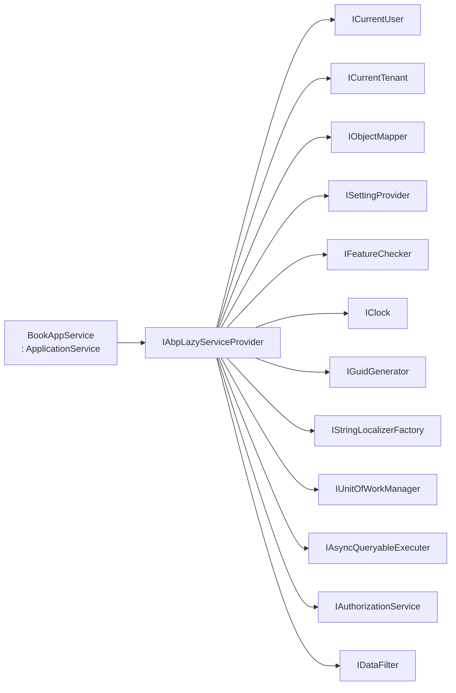

The `Volo.Abp.Ddd.Application` package's `ApplicationService` class (file `framework/src/Volo.Abp.Ddd.Application/Volo/Abp/Application/Services/ApplicationService.cs`) is the recommended base for every CQRS-style use case in an ABP Framework solution. Its job is to ferry DTOs across the boundary between the HTTP/transport layer and the domain layer, while letting the framework apply cross-cutting concerns: authorization, validation, auditing, unit-of-work, feature checking, exception handling, and structured localization. This page covers the marker-interface stack, the lazy services every derived class gets for free (`CurrentUser`, `CurrentTenant`, `ObjectMapper`, `SettingProvider`, `FeatureChecker`, `IAuthorizationService`, `IClock`, `IGuidGenerator`, `IStringLocalizerFactory`, `IDataFilter`, `IUnitOfWorkManager`, `IAsyncQueryableExecuter`), the `LocalizationResource` / `L` localizer pattern, the `CheckPolicyAsync` helper, and how `IAvoidDuplicateCrossCuttingConcerns` keeps interceptors from stacking.

## The `IApplicationService` marker

The interface is the smallest possible contract — it doesn't even declare a method:

```csharp
// framework/src/Volo.Abp.Ddd.Application.Contracts/Volo/Abp/Application/Services/IApplicationService.cs
namespace Volo.Abp.Application.Services;

/// <summary>
/// This interface must be implemented by all application services to register and identify them by convention.
/// </summary>
public interface IApplicationService : IRemoteService
{
}
```

`IRemoteService` (from `Volo.Abp.Core`) is itself an empty marker — it signals that the service is exposed over a remote transport (HTTP, signalR, gRPC). Together they enable two framework features: ABP's *auto API controller* feature lifts every `IApplicationService` into a controller, and ABP's *dynamic HTTP client proxy* feature generates a typed client for every `IRemoteService`.

```csharp
// framework/src/Volo.Abp.Core/Volo/Abp/IRemoteService.cs
public interface IRemoteService { }
```

## `ApplicationService` — the base class declaration

The full class signature shows the full set of marker interfaces it implements. Each marker switches on a piece of framework behaviour:

```csharp
// framework/src/Volo.Abp.Ddd.Application/Volo/Abp/Application/Services/ApplicationService.cs
public abstract class ApplicationService :
    IApplicationService,
    IAvoidDuplicateCrossCuttingConcerns,
    IValidationEnabled,
    IUnitOfWorkEnabled,
    IAuditingEnabled,
    IGlobalFeatureCheckingEnabled,
    ITransientDependency
{
    public IAbpLazyServiceProvider LazyServiceProvider { get; set; } = default!;

    [Obsolete("Use LazyServiceProvider instead.")]
    public IServiceProvider ServiceProvider { get; set; } = default!;

    public static string[] CommonPostfixes { get; set; } = { "AppService", "ApplicationService", "Service" };

    public List<string> AppliedCrossCuttingConcerns { get; } = new();
    // ...
}
```

The marker stack:

| Marker | File | Effect |
|---|---|---|
| `IApplicationService` | `Volo.Abp.Ddd.Application.Contracts` | Conventional registration; exposed by auto API controllers |
| `IRemoteService` | `Volo.Abp.Core` | Inherits via `IApplicationService` |
| `IAvoidDuplicateCrossCuttingConcerns` | `Volo.Abp.Auditing` | Lets ABP skip re-running concerns when one service calls another |
| `IValidationEnabled` | `Volo.Abp.Validation` | Validation interceptor checks inputs at the proxy boundary |
| `IUnitOfWorkEnabled` | `Volo.Abp.Uow` | UoW interceptor opens an ambient unit of work per public call |
| `IAuditingEnabled` | `Volo.Abp.Auditing` | Audit-log interceptor records call info |
| `IGlobalFeatureCheckingEnabled` | `Volo.Abp.GlobalFeatures` | Global feature interceptor checks `[RequiresGlobalFeature]` |
| `ITransientDependency` | `Volo.Abp.DependencyInjection` | Conventional registration as transient |

`CommonPostfixes` controls how the framework strips suffixes when naming generated HTTP routes (`/api/app/book` from `BookAppService`) and proxies.

`AppliedCrossCuttingConcerns` is the bookkeeping list used by `IAvoidDuplicateCrossCuttingConcerns` to remember which interceptors have already fired in this call chain, so they don't double-fire when another `ApplicationService` is invoked from within the current one.

## Lazy-resolved dependencies

Like `DomainService`, `ApplicationService` uses property injection of `IAbpLazyServiceProvider` and exposes a long menu of cross-cutting services as protected lazy properties. The full list from the file:

```csharp
// framework/src/Volo.Abp.Ddd.Application/Volo/Abp/Application/Services/ApplicationService.cs (excerpt)
protected IUnitOfWorkManager UnitOfWorkManager =>
    LazyServiceProvider.LazyGetRequiredService<IUnitOfWorkManager>();

protected IAsyncQueryableExecuter AsyncExecuter =>
    LazyServiceProvider.LazyGetRequiredService<IAsyncQueryableExecuter>();

protected Type? ObjectMapperContext { get; set; }
protected IObjectMapper ObjectMapper => LazyServiceProvider.LazyGetService<IObjectMapper>(provider =>
    ObjectMapperContext == null
        ? provider.GetRequiredService<IObjectMapper>()
        : (IObjectMapper)provider.GetRequiredService(typeof(IObjectMapper<>).MakeGenericType(ObjectMapperContext)));

protected IGuidGenerator GuidGenerator => LazyServiceProvider.LazyGetService<IGuidGenerator>(SimpleGuidGenerator.Instance);

protected ILoggerFactory LoggerFactory => LazyServiceProvider.LazyGetRequiredService<ILoggerFactory>();

protected ICurrentTenant CurrentTenant => LazyServiceProvider.LazyGetRequiredService<ICurrentTenant>();

protected IDataFilter DataFilter => LazyServiceProvider.LazyGetRequiredService<IDataFilter>();

protected ICurrentUser CurrentUser => LazyServiceProvider.LazyGetRequiredService<ICurrentUser>();

protected ISettingProvider SettingProvider => LazyServiceProvider.LazyGetRequiredService<ISettingProvider>();

protected IClock Clock => LazyServiceProvider.LazyGetRequiredService<IClock>();

protected IAuthorizationService AuthorizationService => LazyServiceProvider.LazyGetRequiredService<IAuthorizationService>();

protected IFeatureChecker FeatureChecker => LazyServiceProvider.LazyGetRequiredService<IFeatureChecker>();

protected IStringLocalizerFactory StringLocalizerFactory => LazyServiceProvider.LazyGetRequiredService<IStringLocalizerFactory>();
```

The matrix below summarizes what each accessor is for:

| Property | Type | Common use |
|---|---|---|
| `UnitOfWorkManager` | `IUnitOfWorkManager` | Manually open a nested or non-transactional UoW |
| `CurrentUnitOfWork` | `IUnitOfWork?` | Shortcut for `UnitOfWorkManager?.Current` |
| `AsyncExecuter` | `IAsyncQueryableExecuter` | Provider-agnostic `ToListAsync`, `CountAsync`, `FirstAsync` |
| `ObjectMapper` | `IObjectMapper` | DTO ↔ entity mapping (AutoMapper by default) |
| `GuidGenerator` | `IGuidGenerator` | Sequential Guid PKs |
| `LoggerFactory` | `ILoggerFactory` | Create category loggers |
| `Logger` | `ILogger` | Pre-created logger named `GetType().FullName` |
| `CurrentTenant` | `ICurrentTenant` | Read or switch tenant context |
| `DataFilter` | `IDataFilter` | Enable/disable `ISoftDelete`/`IMultiTenant` filters |
| `CurrentUser` | `ICurrentUser` | Read the authenticated user id, name, roles |
| `SettingProvider` | `ISettingProvider` | Read tenant-scoped settings |
| `Clock` | `IClock` | Replace `DateTime.UtcNow` |
| `AuthorizationService` | `IAuthorizationService` | Imperative permission checks |
| `FeatureChecker` | `IFeatureChecker` | Tenant-scoped feature flags |
| `StringLocalizerFactory` | `IStringLocalizerFactory` | Create localizers for any resource |

The DI graph behind this is illustrated below:



Every accessor is a lazy property: the dependency is resolved at first access and cached, so unused services cost nothing.

## The `L` localizer pattern

`ApplicationService` exposes a property called `L` that returns an `IStringLocalizer`. The trick is the `LocalizationResource` property — set it to a resource type (e.g. `typeof(BookStoreResource)`) and `L` automatically uses the right localizer. The implementation:

```csharp
// framework/src/Volo.Abp.Ddd.Application/Volo/Abp/Application/Services/ApplicationService.cs (excerpt)
protected IStringLocalizer L {
    get {
        if (_localizer == null)
        {
            _localizer = CreateLocalizer();
        }
        return _localizer;
    }
}
private IStringLocalizer? _localizer;

protected Type? LocalizationResource {
    get => _localizationResource;
    set {
        _localizationResource = value;
        _localizer = null;
    }
}
private Type? _localizationResource = typeof(DefaultResource);

protected virtual IStringLocalizer CreateLocalizer()
{
    if (LocalizationResource != null)
    {
        return StringLocalizerFactory.Create(LocalizationResource);
    }

    var localizer = StringLocalizerFactory.CreateDefaultOrNull();
    if (localizer == null)
    {
        throw new AbpException($"Set {nameof(LocalizationResource)} or define the default localization resource type (by configuring the {nameof(AbpLocalizationOptions)}.{nameof(AbpLocalizationOptions.DefaultResourceType)}) to be able to use the {nameof(L)} object!");
    }

    return localizer;
}
```

Two patterns:

1. **Module convention** — set `LocalizationResource = typeof(BookStoreResource)` in a shared base class for every app service in your module.
2. **Default resource** — set `AbpLocalizationOptions.DefaultResourceType` once per host and skip the per-class assignment.

Usage in a method body is just `throw new UserFriendlyException(L["BookNotFound"])` — the framework picks the correct culture string at runtime.

## `CheckPolicyAsync` — imperative authorization

While most permission checks should be declared as `[Authorize("Books.Create")]` on the method, you sometimes want to short-circuit early. The `CheckPolicyAsync` helper integrates with ASP.NET Core's `IAuthorizationService`:

```csharp
// framework/src/Volo.Abp.Ddd.Application/Volo/Abp/Application/Services/ApplicationService.cs
protected virtual async Task CheckPolicyAsync(string? policyName)
{
    if (string.IsNullOrEmpty(policyName))
    {
        return;
    }

    await AuthorizationService.CheckAsync(policyName!);
}
```

The `IAuthorizationService.CheckAsync` extension method (from `Volo.Abp.Authorization`) throws `AbpAuthorizationException` if the policy is not granted. Note that an empty string is silently a no-op — that's the contract `CrudAppService` relies on for optional `CreatePolicyName` / `UpdatePolicyName` / `DeletePolicyName` properties.

## The `ObjectMapperContext` pattern

ABP supports multiple mapping profiles per project — one for each module. The `ObjectMapperContext` property determines which profile to use:

```csharp
// excerpt
protected Type? ObjectMapperContext { get; set; }
protected IObjectMapper ObjectMapper => LazyServiceProvider.LazyGetService<IObjectMapper>(provider =>
    ObjectMapperContext == null
        ? provider.GetRequiredService<IObjectMapper>()
        : (IObjectMapper)provider.GetRequiredService(typeof(IObjectMapper<>).MakeGenericType(ObjectMapperContext)));
```

Setting `ObjectMapperContext = typeof(BookStoreApplicationModule)` resolves `IObjectMapper<BookStoreApplicationModule>` — the specialised mapper that AutoMapper builds from your `BookStoreApplicationAutoMapperProfile`.

## How cross-cutting concerns are applied

The marker interfaces don't directly hook into the call stack — ABP uses dynamic proxies (Castle.Core) and conventional interceptor registration. The big picture:

```mermaid
sequenceDiagram
    participant HTTP as ABP Auto API Controller
    participant Proxy as DynamicProxy
    participant Authz as AuthorizationInterceptor
    participant Valid as ValidationInterceptor
    participant Audit as AuditingInterceptor
    participant Feat as GlobalFeatureCheckingInterceptor
    participant UoW as UnitOfWorkInterceptor
    participant Svc as BookAppService.CreateAsync
    participant Repo as IRepository&lt;Book, Guid&gt;

    HTTP->>Proxy: CreateAsync(dto)
    Proxy->>Authz: [Authorize("Books.Create")]
    Authz-->>Proxy: pass
    Proxy->>Valid: ValidateAsync(dto)
    Valid-->>Proxy: pass
    Proxy->>Audit: BeginAudit()
    Proxy->>Feat: CheckGlobalFeature
    Proxy->>UoW: Begin transactional UoW
    UoW->>Svc: invoke
    Svc->>Repo: InsertAsync(entity)
    Svc-->>UoW: BookDto
    UoW->>UoW: SaveChanges + commit
    UoW-->>Proxy: BookDto
    Audit-->>Proxy: log
    Proxy-->>HTTP: BookDto
```

`IAvoidDuplicateCrossCuttingConcerns` matters in chains: if `BookAppService.CreateAsync` calls `AuthorAppService.GetAsync` internally, the audit/validation/UoW interceptors check `AppliedCrossCuttingConcerns` first and skip re-running concerns that already ran on the outer call.

## A typical custom application service

The snippet below shows the surface area you actually use day-to-day. Note that none of the cross-cutting services appear in the constructor — they all come from the base class via lazy DI.

```csharp
public class BookAppService : ApplicationService, IBookAppService
{
    private readonly IRepository<Book, Guid> _bookRepository;
    private readonly BookManager _bookManager;

    public BookAppService(
        IRepository<Book, Guid> bookRepository,
        BookManager bookManager)
    {
        _bookRepository = bookRepository;
        _bookManager = bookManager;

        LocalizationResource = typeof(BookStoreResource);
        ObjectMapperContext = typeof(BookStoreApplicationModule);
    }

    [Authorize("BookStore.Books.Create")]
    public async Task<BookDto> CreateAsync(CreateBookDto input)
    {
        var book = await _bookManager.CreateAsync(input.Name, input.Type, input.Price);
        await _bookRepository.InsertAsync(book, autoSave: true);

        Logger.LogInformation("Book created: {Name} by {UserId}", book.Name, CurrentUser.Id);

        return ObjectMapper.Map<Book, BookDto>(book);
    }

    public async Task<PagedResultDto<BookDto>> GetListAsync(PagedAndSortedResultRequestDto input)
    {
        await CheckPolicyAsync("BookStore.Books.Get");

        var query = (await _bookRepository.GetQueryableAsync())
            .OrderBy(input.Sorting ?? nameof(Book.Name))
            .Skip(input.SkipCount)
            .Take(input.MaxResultCount);

        var total = await _bookRepository.GetCountAsync();
        var items = await AsyncExecuter.ToListAsync(query);

        return new PagedResultDto<BookDto>(total, ObjectMapper.Map<List<Book>, List<BookDto>>(items));
    }
}
```

Notable details:

- `_bookManager` is the domain service from the [Domain services page](/ddd/domain-services-and-managers) — application services call domain services but never the other way around.
- `_bookRepository` is the abstract `IRepository<Book, Guid>` from the [Repositories page](/ddd/domain-repositories).
- `AsyncExecuter`, `ObjectMapper`, `Logger`, `CurrentUser` are all from the lazy base class.

## `IApplicationService` is excluded from API description

In `AbpDddApplicationModule.ConfigureServices`, the framework ensures `IApplicationService` and its kin never appear in the generated API model:

```csharp
// framework/src/Volo.Abp.Ddd.Application/Volo/Abp/Application/AbpDddApplicationModule.cs
public override void ConfigureServices(ServiceConfigurationContext context)
{
    Configure<AbpApiDescriptionModelOptions>(options =>
    {
        options.IgnoredInterfaces.AddIfNotContains(typeof(IRemoteService));
        options.IgnoredInterfaces.AddIfNotContains(typeof(IApplicationService));
        options.IgnoredInterfaces.AddIfNotContains(typeof(IUnitOfWorkEnabled));
        options.IgnoredInterfaces.AddIfNotContains(typeof(IAuditingEnabled));
        options.IgnoredInterfaces.AddIfNotContains(typeof(IValidationEnabled));
        options.IgnoredInterfaces.AddIfNotContains(typeof(IGlobalFeatureCheckingEnabled));
    });
}
```

This is what makes the generated OpenAPI document clean — only the *operations* you wrote appear, not their interceptor-marker scaffolding.

## When to *not* use `ApplicationService`

The base class is opinionated. If you want a remote service without the unit-of-work and validation interceptors, implement `IRemoteService` directly and inject only what you need. If you want a non-remote service exposed only to other server-side code, drop both `IApplicationService` and `IRemoteService` — use `IDomainService` and the [DomainService base class](/ddd/domain-services-and-managers).

## Related pages

| Page | Why visit |
|---|---|
| [CRUD app service](/ddd/crud-app-service) | The base class that derives from `ApplicationService` with `CreateAsync` / `UpdateAsync` / `DeleteAsync` already implemented |
| [Application contracts](/ddd/application-contracts) | The `IApplicationService` interface lives here and is consumed by the dynamic HTTP client proxy |
| [Application DTOs](/ddd/application-dtos) | DTO base classes used as inputs/outputs |
| [Domain services](/ddd/domain-services-and-managers) | What `ApplicationService.CreateAsync` typically calls |
| [Unit of work](/data/unit-of-work) | How `IUnitOfWorkEnabled` plays out at runtime |
| [Identity module](/modules/identity) | Real-world consumers — see `IdentityUserAppService` |
