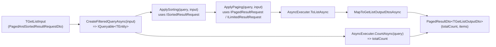
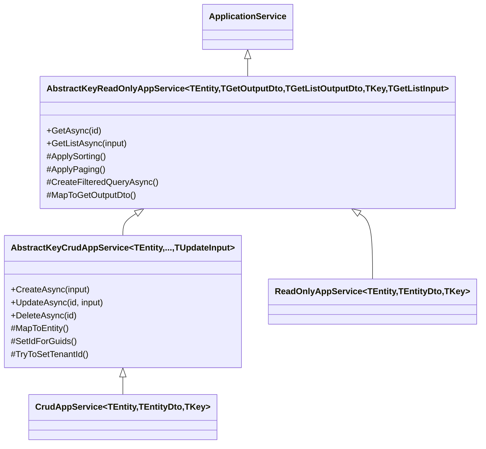

`CrudAppService<...>` (file `framework/src/Volo.Abp.Ddd.Application/Volo/Abp/Application/Services/CrudAppService.cs`) is the most-used base class in ABP Framework — five lines of code in your project give you a fully working REST endpoint with `GetAsync`, `GetListAsync`, `CreateAsync`, `UpdateAsync`, and `DeleteAsync` already wired to a repository and the framework's auto-controller, validation, auditing, and unit-of-work pipeline. This page covers the seven progressively-typed overloads of `CrudAppService`, the parallel `ReadOnlyAppService` family, the `AbstractKeyCrudAppService` / `AbstractKeyReadOnlyAppService` hierarchy underneath them, the default implementations of every method, the override hooks (`MapToEntity`, `MapToGetOutputDto`, `ApplySorting`, `ApplyPaging`, `CreateFilteredQueryAsync`, `SetIdForGuids`, `TryToSetTenantId`), and the policy hooks (`CreatePolicyName`, `UpdatePolicyName`, `DeletePolicyName`, `GetPolicyName`, `GetListPolicyName`).

## The two layers

ABP factors the CRUD machinery into two layers — an "abstract key" layer that works on any `IEntity` (including composite-key entities) and a thin convenience layer that constrains `TEntity : IEntity<TKey>` for the common single-key case. The same factoring applies to read-only:

| Read-only layer | Read-only convenience |
|---|---|
| `AbstractKeyReadOnlyAppService<TEntity, TGetOutputDto, TGetListOutputDto, TKey, TGetListInput>` | `ReadOnlyAppService<TEntity, TGetOutputDto, TGetListOutputDto, TKey, TGetListInput>` |

| CRUD layer | CRUD convenience |
|---|---|
| `AbstractKeyCrudAppService<TEntity, TGetOutputDto, TGetListOutputDto, TKey, TGetListInput, TCreateInput, TUpdateInput>` | `CrudAppService<TEntity, TGetOutputDto, TGetListOutputDto, TKey, TGetListInput, TCreateInput, TUpdateInput>` |

The "abstract key" layer takes `IRepository<TEntity>` (the keyless one) because it has to support composite-key cases — it then implements `GetEntityByIdAsync(TKey id)` as an abstract method, leaving you to write the lookup. The convenience layer takes `IRepository<TEntity, TKey>` and implements `GetEntityByIdAsync` for you.

## The seven `CrudAppService` overloads

`CrudAppService<...>` ships with seven overloads, each defaulting more type parameters. The shortest is three arguments; the longest is seven. The actual definitions:

```csharp
// framework/src/Volo.Abp.Ddd.Application/Volo/Abp/Application/Services/CrudAppService.cs
public abstract class CrudAppService<TEntity, TEntityDto, TKey>
    : CrudAppService<TEntity, TEntityDto, TKey, PagedAndSortedResultRequestDto>
    where TEntity : class, IEntity<TKey>
{
    protected CrudAppService(IRepository<TEntity, TKey> repository) : base(repository) { }
}

public abstract class CrudAppService<TEntity, TEntityDto, TKey, TGetListInput>
    : CrudAppService<TEntity, TEntityDto, TKey, TGetListInput, TEntityDto>
    where TEntity : class, IEntity<TKey>
{
    protected CrudAppService(IRepository<TEntity, TKey> repository) : base(repository) { }
}

public abstract class CrudAppService<TEntity, TEntityDto, TKey, TGetListInput, TCreateInput>
    : CrudAppService<TEntity, TEntityDto, TKey, TGetListInput, TCreateInput, TCreateInput>
    where TEntity : class, IEntity<TKey>
{
    protected CrudAppService(IRepository<TEntity, TKey> repository) : base(repository) { }
}

public abstract class CrudAppService<TEntity, TEntityDto, TKey, TGetListInput, TCreateInput, TUpdateInput>
    : CrudAppService<TEntity, TEntityDto, TEntityDto, TKey, TGetListInput, TCreateInput, TUpdateInput>
    where TEntity : class, IEntity<TKey>
{
    protected CrudAppService(IRepository<TEntity, TKey> repository) : base(repository) { }

    protected override Task<TEntityDto> MapToGetListOutputDtoAsync(TEntity entity)
    {
        return MapToGetOutputDtoAsync(entity);
    }

    protected override TEntityDto MapToGetListOutputDto(TEntity entity)
    {
        return MapToGetOutputDto(entity);
    }
}

public abstract class CrudAppService<TEntity, TGetOutputDto, TGetListOutputDto, TKey, TGetListInput, TCreateInput, TUpdateInput>
    : AbstractKeyCrudAppService<TEntity, TGetOutputDto, TGetListOutputDto, TKey, TGetListInput, TCreateInput, TUpdateInput>
    where TEntity : class, IEntity<TKey>
{
    protected new IRepository<TEntity, TKey> Repository { get; }

    protected CrudAppService(IRepository<TEntity, TKey> repository) : base(repository)
    {
        Repository = repository;
    }

    protected override async Task DeleteByIdAsync(TKey id)
    {
        await Repository.DeleteAsync(id);
    }

    protected override async Task<TEntity> GetEntityByIdAsync(TKey id)
    {
        return await Repository.GetAsync(id);
    }

    protected override void MapToEntity(TUpdateInput updateInput, TEntity entity)
    {
        if (updateInput is IEntityDto<TKey> entityDto)
        {
            entityDto.Id = entity.Id;
        }

        base.MapToEntity(updateInput, entity);
    }

    protected override IQueryable<TEntity> ApplyDefaultSorting(IQueryable<TEntity> query)
    {
        if (typeof(TEntity).IsAssignableTo<IHasCreationTime>())
        {
            return query.OrderByDescending(e => ((IHasCreationTime)e).CreationTime);
        }
        else
        {
            return query.OrderByDescending(e => e.Id);
        }
    }
}
```

The most general overload (last) is the only one that actually has a body — every shorter overload defaults type parameters and forwards the constructor.

The type-parameter defaulting:

| Overload (`<...>`) | Defaults applied |
|---|---|
| `<TEntity, TEntityDto, TKey>` | `TGetListInput = PagedAndSortedResultRequestDto` |
| `<TEntity, TEntityDto, TKey, TGetListInput>` | `TCreateInput = TEntityDto` |
| `<TEntity, TEntityDto, TKey, TGetListInput, TCreateInput>` | `TUpdateInput = TCreateInput` |
| `<TEntity, TEntityDto, TKey, TGetListInput, TCreateInput, TUpdateInput>` | `TGetOutputDto = TGetListOutputDto = TEntityDto`; collapses output mapping |
| `<TEntity, TGetOutputDto, TGetListOutputDto, TKey, TGetListInput, TCreateInput, TUpdateInput>` | Full control |

A typical declaration uses the 3- or 4-parameter version:

```csharp
public class BookAppService :
    CrudAppService<Book, BookDto, Guid, PagedAndSortedResultRequestDto, CreateUpdateBookDto>,
    IBookAppService
{
    public BookAppService(IRepository<Book, Guid> repository) : base(repository)
    {
        GetPolicyName     = BookStorePermissions.Books.Default;
        GetListPolicyName = BookStorePermissions.Books.Default;
        CreatePolicyName  = BookStorePermissions.Books.Create;
        UpdatePolicyName  = BookStorePermissions.Books.Edit;
        DeletePolicyName  = BookStorePermissions.Books.Delete;
    }
}
```

## `AbstractKeyCrudAppService` — the implementation

The base class where all the work happens. Its constructor takes the keyless `IRepository<TEntity>` and exposes it as `Repository`. The five public methods (`CreateAsync`, `UpdateAsync`, `DeleteAsync`, plus the inherited `GetAsync` and `GetListAsync` from `AbstractKeyReadOnlyAppService`) all follow the same pattern: check policy, do the work, return a mapped DTO.

```csharp
// framework/src/Volo.Abp.Ddd.Application/Volo/Abp/Application/Services/AbstractKeyCrudAppService.cs
public abstract class AbstractKeyCrudAppService<TEntity, TGetOutputDto, TGetListOutputDto, TKey, TGetListInput, TCreateInput, TUpdateInput>
    : AbstractKeyReadOnlyAppService<TEntity, TGetOutputDto, TGetListOutputDto, TKey, TGetListInput>,
        ICrudAppService<TGetOutputDto, TGetListOutputDto, TKey, TGetListInput, TCreateInput, TUpdateInput>
    where TEntity : class, IEntity
{
    protected IRepository<TEntity> Repository { get; }

    protected virtual string? CreatePolicyName { get; set; }
    protected virtual string? UpdatePolicyName { get; set; }
    protected virtual string? DeletePolicyName { get; set; }

    protected AbstractKeyCrudAppService(IRepository<TEntity> repository) : base(repository)
    {
        Repository = repository;
    }

    public virtual async Task<TGetOutputDto> CreateAsync(TCreateInput input)
    {
        await CheckCreatePolicyAsync();

        var entity = await MapToEntityAsync(input);

        TryToSetTenantId(entity);

        await Repository.InsertAsync(entity, autoSave: true);

        return await MapToGetOutputDtoAsync(entity);
    }

    public virtual async Task<TGetOutputDto> UpdateAsync(TKey id, TUpdateInput input)
    {
        await CheckUpdatePolicyAsync();

        var entity = await GetEntityByIdAsync(id);
        //TODO: Check if input has id different than given id and normalize if it's default value, throw ex otherwise
        await MapToEntityAsync(input, entity);
        await Repository.UpdateAsync(entity, autoSave: true);

        return await MapToGetOutputDtoAsync(entity);
    }

    public virtual async Task DeleteAsync(TKey id)
    {
        await CheckDeletePolicyAsync();

        await DeleteByIdAsync(id);
    }

    protected abstract Task DeleteByIdAsync(TKey id);
    // CheckCreatePolicyAsync, CheckUpdatePolicyAsync, CheckDeletePolicyAsync all call CheckPolicyAsync(PolicyName)
    // MapToEntity, MapToEntityAsync (input -> new entity)
    // MapToEntity, MapToEntityAsync (input -> existing entity)
    // SetIdForGuids, TryToSetTenantId, HasTenantIdProperty
}
```

### Step-by-step: `CreateAsync(input)`

1. **`CheckCreatePolicyAsync()`** — if `CreatePolicyName` was set in the constructor, throw `AbpAuthorizationException` if the current user is not granted it.
2. **`MapToEntityAsync(input)`** — by default calls `MapToEntity(input)`, which uses `ObjectMapper.Map<TCreateInput, TEntity>(input)`, then `SetIdForGuids(entity)` if `TKey == Guid`.
3. **`TryToSetTenantId(entity)`** — if the entity implements `IMultiTenant`, set its `TenantId` to `CurrentTenant.Id`.
4. **`Repository.InsertAsync(entity, autoSave: true)`** — persist immediately.
5. **`MapToGetOutputDtoAsync(entity)`** — by default `ObjectMapper.Map<TEntity, TGetOutputDto>(entity)`.

### Step-by-step: `UpdateAsync(id, input)`

1. **`CheckUpdatePolicyAsync()`**.
2. **`GetEntityByIdAsync(id)`** — abstract method that in `CrudAppService` calls `Repository.GetAsync(id)` (throws `EntityNotFoundException` on miss).
3. **`MapToEntityAsync(input, entity)`** — by default `ObjectMapper.Map(input, entity)` so the entity is mutated in-place. The `CrudAppService` override also resets `entityDto.Id = entity.Id` so a client can't change the id via the body.
4. **`Repository.UpdateAsync(entity, autoSave: true)`**.
5. Map output and return.

### Step-by-step: `DeleteAsync(id)`

1. **`CheckDeletePolicyAsync()`**.
2. **`DeleteByIdAsync(id)`** — abstract; `CrudAppService` calls `Repository.DeleteAsync(id)`.

### `MapToEntity` overrides

The base implementation uses `ObjectMapper`:

```csharp
// excerpt from AbstractKeyCrudAppService.cs
protected virtual Task<TEntity> MapToEntityAsync(TCreateInput createInput)
{
    return Task.FromResult(MapToEntity(createInput));
}

protected virtual TEntity MapToEntity(TCreateInput createInput)
{
    var entity = ObjectMapper.Map<TCreateInput, TEntity>(createInput);
    SetIdForGuids(entity);
    return entity;
}

protected virtual void SetIdForGuids(TEntity entity)
{
    if (entity is IEntity<Guid> entityWithGuidId && entityWithGuidId.Id == Guid.Empty)
    {
        EntityHelper.TrySetId(
            entityWithGuidId,
            () => GuidGenerator.Create(),
            true // checkForDisableIdGenerationAttribute
        );
    }
}

protected virtual Task MapToEntityAsync(TUpdateInput updateInput, TEntity entity)
{
    MapToEntity(updateInput, entity);
    return Task.CompletedTask;
}

protected virtual void MapToEntity(TUpdateInput updateInput, TEntity entity)
{
    ObjectMapper.Map(updateInput, entity);
}
```

When you need to write a property the mapper can't reach (e.g. invoke an aggregate method to enforce an invariant), override `MapToEntityAsync(input, entity)`. The override hook takes both the input DTO and the existing entity so you can call domain methods like `book.ChangePrice(input.Price)`.

The `SetIdForGuids` is the magic that lets clients create entities without providing an id — if the entity is `IEntity<Guid>` and its current `Id` is `Guid.Empty`, ABP generates one through `GuidGenerator`. The `checkForDisableIdGenerationAttribute: true` argument means a `[DisableIdGeneration]` attribute on the entity's `Id` property opts out.

### Multi-tenancy

```csharp
protected virtual void TryToSetTenantId(TEntity entity)
{
    if (entity is IMultiTenant && HasTenantIdProperty(entity))
    {
        var tenantId = CurrentTenant.Id;

        if (!tenantId.HasValue) return;

        var propertyInfo = entity.GetType().GetProperty(nameof(IMultiTenant.TenantId));
        if (propertyInfo == null || propertyInfo.GetSetMethod(true) == null) return;

        propertyInfo.SetValue(entity, tenantId);
    }
}

protected virtual bool HasTenantIdProperty(TEntity entity)
{
    return entity.GetType().GetProperty(nameof(IMultiTenant.TenantId)) != null;
}
```

The reflection is needed because `IMultiTenant.TenantId` has only a getter in the interface; the setter is private/protected on entities (so callers can't change tenant arbitrarily). This helper reaches in via `GetSetMethod(true)` (`nonPublic: true`) to set it once at creation time.

## `AbstractKeyReadOnlyAppService` — `GetAsync` and `GetListAsync`

The read half is the source of `GetAsync(id)`, `GetListAsync(input)`, `CreateFilteredQueryAsync`, `ApplySorting`, `ApplyPaging`, and the policy hooks for reads:

```csharp
// framework/src/Volo.Abp.Ddd.Application/Volo/Abp/Application/Services/AbstractKeyReadOnlyAppService.cs
public abstract class AbstractKeyReadOnlyAppService<TEntity, TGetOutputDto, TGetListOutputDto, TKey, TGetListInput>
    : ApplicationService,
        IReadOnlyAppService<TGetOutputDto, TGetListOutputDto, TKey, TGetListInput>
    where TEntity : class, IEntity
{
    protected IReadOnlyRepository<TEntity> ReadOnlyRepository { get; }

    protected virtual string? GetPolicyName { get; set; }
    protected virtual string? GetListPolicyName { get; set; }

    protected AbstractKeyReadOnlyAppService(IReadOnlyRepository<TEntity> repository)
    {
        ReadOnlyRepository = repository;
    }

    public virtual async Task<TGetOutputDto> GetAsync(TKey id)
    {
        await CheckGetPolicyAsync();
        var entity = await GetEntityByIdAsync(id);
        return await MapToGetOutputDtoAsync(entity);
    }

    public virtual async Task<PagedResultDto<TGetListOutputDto>> GetListAsync(TGetListInput input)
    {
        await CheckGetListPolicyAsync();

        var query = await CreateFilteredQueryAsync(input);
        var totalCount = await AsyncExecuter.CountAsync(query);

        var entities = new List<TEntity>();
        var entityDtos = new List<TGetListOutputDto>();

        if (totalCount > 0)
        {
            query = ApplySorting(query, input);
            query = ApplyPaging(query, input);

            entities = await AsyncExecuter.ToListAsync(query);
            entityDtos = await MapToGetListOutputDtosAsync(entities);
        }

        return new PagedResultDto<TGetListOutputDto>(totalCount, entityDtos);
    }

    protected abstract Task<TEntity> GetEntityByIdAsync(TKey id);
}
```

The list pipeline is:



### `CreateFilteredQueryAsync` — the override hook for filtering

The default just returns the queryable from the repository:

```csharp
protected virtual async Task<IQueryable<TEntity>> CreateFilteredQueryAsync(TGetListInput input)
{
    return await ReadOnlyRepository.GetQueryableAsync();
}
```

Override this to apply input-specific filters — search terms, date ranges, foreign-key restrictions. Whatever you return, the `ApplySorting`, `ApplyPaging`, and `CountAsync` pipeline takes care of the rest.

### `ApplySorting` — picks based on input interfaces

```csharp
protected virtual IQueryable<TEntity> ApplySorting(IQueryable<TEntity> query, TGetListInput input)
{
    if (input is ISortedResultRequest sortInput)
    {
        if (!sortInput.Sorting.IsNullOrWhiteSpace())
        {
            return query.OrderBy(sortInput.Sorting!);
        }
    }

    if (input is ILimitedResultRequest)
    {
        return ApplyDefaultSorting(query);
    }

    return query;
}
```

The `query.OrderBy(string)` call is the System.Linq.Dynamic.Core extension — strings like `"Name DESC"` become real `OrderByDescending` calls. If the input has no `Sorting` string but *is* limited (paged), the framework falls back to `ApplyDefaultSorting` — required because skip/take needs a stable order.

The default sorting in `AbstractKeyReadOnlyAppService.ApplyDefaultSorting` looks for `IHasCreationTime`:

```csharp
protected virtual IQueryable<TEntity> ApplyDefaultSorting(IQueryable<TEntity> query)
{
    if (typeof(TEntity).IsAssignableTo<IHasCreationTime>())
    {
        return query.OrderByDescending(e => ((IHasCreationTime)e).CreationTime);
    }

    throw new AbpException("No sorting specified but this query requires sorting. Override the ApplySorting or the ApplyDefaultSorting method for your application service derived from AbstractKeyReadOnlyAppService!");
}
```

But the `CrudAppService` overload (with `IRepository<TEntity, TKey>`) overrides it to fall back to `OrderByDescending(e => e.Id)` so even entities with no `CreationTime` get a default ordering:

```csharp
// CrudAppService.cs (most general overload)
protected override IQueryable<TEntity> ApplyDefaultSorting(IQueryable<TEntity> query)
{
    if (typeof(TEntity).IsAssignableTo<IHasCreationTime>())
    {
        return query.OrderByDescending(e => ((IHasCreationTime)e).CreationTime);
    }
    else
    {
        return query.OrderByDescending(e => e.Id);
    }
}
```

### `ApplyPaging`

```csharp
protected virtual IQueryable<TEntity> ApplyPaging(IQueryable<TEntity> query, TGetListInput input)
{
    if (input is IPagedResultRequest pagedInput)
    {
        return query.PageBy(pagedInput);
    }

    if (input is ILimitedResultRequest limitedInput)
    {
        return query.Take(limitedInput.MaxResultCount);
    }

    return query;
}
```

`query.PageBy(pagedInput)` is the ABP extension from `Volo.Abp.Ddd.Application/System/Linq/AbpPagingQueryableExtensions.cs` that calls `query.Skip(SkipCount).Take(MaxResultCount)`.

### Mapping hooks

The DTO-mapping overrides are the standard "sync + async" pair pattern — `MapToGetOutputDto` is synchronous and the default; `MapToGetOutputDtoAsync` returns it via `Task.FromResult`. Overriding the async version takes precedence:

```csharp
protected virtual Task<TGetOutputDto> MapToGetOutputDtoAsync(TEntity entity)
{
    return Task.FromResult(MapToGetOutputDto(entity));
}

protected virtual TGetOutputDto MapToGetOutputDto(TEntity entity)
{
    return ObjectMapper.Map<TEntity, TGetOutputDto>(entity);
}

protected virtual async Task<List<TGetListOutputDto>> MapToGetListOutputDtosAsync(List<TEntity> entities)
{
    var dtos = new List<TGetListOutputDto>();
    foreach (var entity in entities)
    {
        dtos.Add(await MapToGetListOutputDtoAsync(entity));
    }
    return dtos;
}

protected virtual Task<TGetListOutputDto> MapToGetListOutputDtoAsync(TEntity entity)
{
    return Task.FromResult(MapToGetListOutputDto(entity));
}

protected virtual TGetListOutputDto MapToGetListOutputDto(TEntity entity)
{
    return ObjectMapper.Map<TEntity, TGetListOutputDto>(entity);
}
```

When `TGetOutputDto == TGetListOutputDto` (the more common case), the convenience overload `CrudAppService<TEntity, TEntityDto, TKey, TGetListInput, TCreateInput, TUpdateInput>` aliases the two list-mapping overrides to the single-entity ones:

```csharp
// CrudAppService.cs (the 6-arg overload)
protected override Task<TEntityDto> MapToGetListOutputDtoAsync(TEntity entity) => MapToGetOutputDtoAsync(entity);
protected override TEntityDto MapToGetListOutputDto(TEntity entity) => MapToGetOutputDto(entity);
```

So you only have to override one method when you customise mapping.

## Policy hook table

The five permission hooks are protected `string?` properties — set them in the constructor and the corresponding `Check…PolicyAsync` calls will check the named policy via `IAuthorizationService.CheckAsync`. Setting them to `null` or empty makes the operation public.

| Property | Checked in | When |
|---|---|---|
| `GetPolicyName` | `CheckGetPolicyAsync` (from `AbstractKeyReadOnlyAppService`) | Start of `GetAsync(id)` |
| `GetListPolicyName` | `CheckGetListPolicyAsync` | Start of `GetListAsync(input)` |
| `CreatePolicyName` | `CheckCreatePolicyAsync` | Start of `CreateAsync(input)` |
| `UpdatePolicyName` | `CheckUpdatePolicyAsync` | Start of `UpdateAsync(id, input)` |
| `DeletePolicyName` | `CheckDeletePolicyAsync` | Start of `DeleteAsync(id)` |

Each check call:

```csharp
protected virtual async Task CheckCreatePolicyAsync()
{
    await CheckPolicyAsync(CreatePolicyName);
}
```

And `CheckPolicyAsync` (on `ApplicationService` — see [Application services](/ddd/application-services)):

```csharp
protected virtual async Task CheckPolicyAsync(string? policyName)
{
    if (string.IsNullOrEmpty(policyName)) return;
    await AuthorizationService.CheckAsync(policyName!);
}
```

## `ReadOnlyAppService` — the read-only convenience layer

`ReadOnlyAppService<...>` provides the same overload progression but skipping `Create`/`Update`/`Delete`:

```csharp
// framework/src/Volo.Abp.Ddd.Application/Volo/Abp/Application/Services/ReadOnlyAppService.cs
public abstract class ReadOnlyAppService<TEntity, TEntityDto, TKey>
    : ReadOnlyAppService<TEntity, TEntityDto, TEntityDto, TKey, PagedAndSortedResultRequestDto>
    where TEntity : class, IEntity<TKey>
{
    protected ReadOnlyAppService(IReadOnlyRepository<TEntity, TKey> repository) : base(repository) { }
}

public abstract class ReadOnlyAppService<TEntity, TEntityDto, TKey, TGetListInput>
    : ReadOnlyAppService<TEntity, TEntityDto, TEntityDto, TKey, TGetListInput>
    where TEntity : class, IEntity<TKey>
{
    protected ReadOnlyAppService(IReadOnlyRepository<TEntity, TKey> repository) : base(repository) { }
}

public abstract class ReadOnlyAppService<TEntity, TGetOutputDto, TGetListOutputDto, TKey, TGetListInput>
    : AbstractKeyReadOnlyAppService<TEntity, TGetOutputDto, TGetListOutputDto, TKey, TGetListInput>
    where TEntity : class, IEntity<TKey>
{
    protected IReadOnlyRepository<TEntity, TKey> Repository { get; }

    protected ReadOnlyAppService(IReadOnlyRepository<TEntity, TKey> repository) : base(repository)
    {
        Repository = repository;
    }

    protected override async Task<TEntity> GetEntityByIdAsync(TKey id)
    {
        return await Repository.GetAsync(id);
    }

    protected override IQueryable<TEntity> ApplyDefaultSorting(IQueryable<TEntity> query)
    {
        if (typeof(TEntity).IsAssignableTo<ICreationAuditedObject>())
        {
            return query.OrderByDescending(e => ((ICreationAuditedObject)e).CreationTime);
        }
        else
        {
            return query.OrderByDescending(e => e.Id);
        }
    }
}
```

The only differences from `CrudAppService`'s read half: it takes `IReadOnlyRepository<TEntity, TKey>` (so the conventional registrar marks change tracking off — see [Repositories](/ddd/domain-repositories)) and the default sorting checks `ICreationAuditedObject` instead of `IHasCreationTime`.

## Hierarchy summary



## Method override table

Each override slot, what it does by default, and why you'd override it:

| Override | Default | When to override |
|---|---|---|
| `MapToGetOutputDto(entity)` | `ObjectMapper.Map<TEntity, TGetOutputDto>` | When AutoMapper can't reach a computed property |
| `MapToGetListOutputDto(entity)` | Aliased to `MapToGetOutputDto` in the convenience overload | Different shape for list vs detail (e.g. omit a heavy child collection) |
| `MapToEntity(createInput)` | `ObjectMapper.Map<TCreateInput, TEntity>` + `SetIdForGuids` | When entity has a non-default constructor |
| `MapToEntity(updateInput, entity)` | `ObjectMapper.Map(updateInput, entity)` | When update needs to call aggregate methods (e.g. domain invariants) |
| `CreateFilteredQueryAsync(input)` | `await Repository.GetQueryableAsync()` | Apply search / foreign-key / date-range filters |
| `ApplySorting(query, input)` | `OrderBy(input.Sorting)` or fall back to default | Custom multi-column sort logic |
| `ApplyDefaultSorting(query)` | `OrderByDescending(CreationTime)` else `Id` | Pick a different fallback |
| `ApplyPaging(query, input)` | `query.PageBy(pagedInput)` | Cursor-based paging |
| `SetIdForGuids(entity)` | `GuidGenerator.Create()` if `IEntity<Guid>` | Use a different id-assignment strategy |
| `TryToSetTenantId(entity)` | Reflectively set `TenantId` for `IMultiTenant` | Custom tenant assignment |
| `GetEntityByIdAsync(id)` | `Repository.GetAsync(id)` | Custom lookup logic (e.g. with includes) |
| `DeleteByIdAsync(id)` | `Repository.DeleteAsync(id)` | Soft-delete with extra steps (cascade) |

## A full BookAppService

The recipe in production:

```csharp
public class BookAppService :
    CrudAppService<
        Book,                              // entity
        BookDto,                           // get / list output DTO
        Guid,                              // key
        PagedAndSortedResultRequestDto,    // list request
        CreateUpdateBookDto>,              // create + update input
    IBookAppService
{
    public BookAppService(IRepository<Book, Guid> repository) : base(repository)
    {
        GetPolicyName     = BookStorePermissions.Books.Default;
        GetListPolicyName = BookStorePermissions.Books.Default;
        CreatePolicyName  = BookStorePermissions.Books.Create;
        UpdatePolicyName  = BookStorePermissions.Books.Edit;
        DeletePolicyName  = BookStorePermissions.Books.Delete;
    }

    protected override async Task<IQueryable<Book>> CreateFilteredQueryAsync(PagedAndSortedResultRequestDto input)
    {
        var query = await Repository.GetQueryableAsync();
        // your filter logic here
        return query;
    }
}
```

The interface goes into `*.Application.Contracts`:

```csharp
public interface IBookAppService :
    ICrudAppService<
        BookDto,
        Guid,
        PagedAndSortedResultRequestDto,
        CreateUpdateBookDto>
{
}
```

The DTOs go alongside it. Five files in total, plus an AutoMapper profile, and you have a complete REST endpoint with auth, validation, multi-tenancy, soft-delete, and auditing.

## Cross-references

- [Application services](/ddd/application-services) — the `ApplicationService` base whose lazy DI we inherit.
- [Application contracts](/ddd/application-contracts) — the `ICrudAppService<...>` interfaces this class implements.
- [Application DTOs](/ddd/application-dtos) — the `PagedAndSortedResultRequestDto`/`PagedResultDto<T>` types used here.
- [Repositories](/ddd/domain-repositories) — `IRepository<TEntity, TKey>` underneath.
- [Domain services](/ddd/domain-services-and-managers) — what you should call from inside `MapToEntity(updateInput, entity)`.
- [Unit of work](/data/unit-of-work) — explains `autoSave: true` semantics.
- [Identity module](/modules/identity) — real `IdentityRoleAppService : CrudAppService<...>` derivations.
