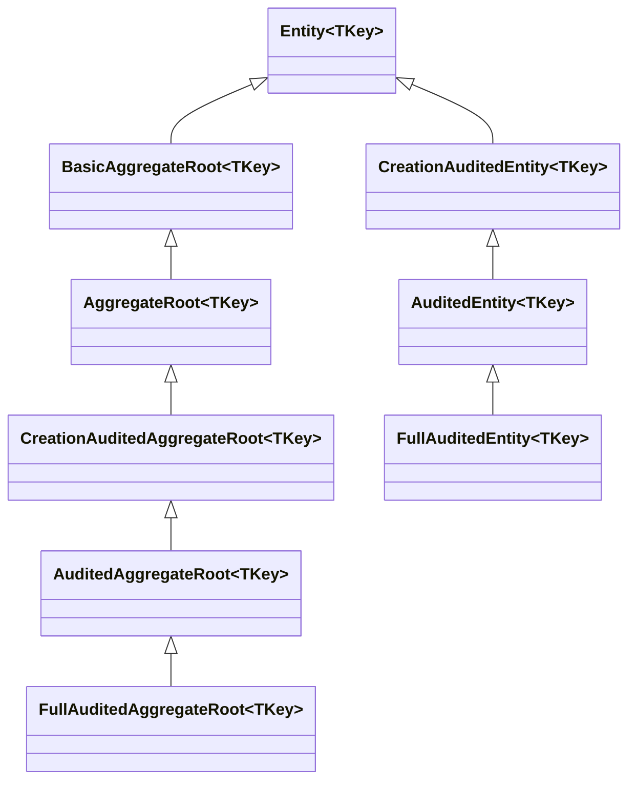
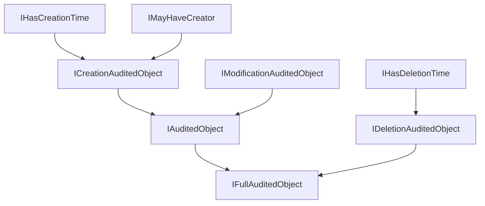

The `Volo.Abp.Ddd.Domain` package gives ABP Framework applications a small set of abstract base classes for entities and aggregates, plus a coordinated family of marker interfaces (`IHasCreationTime`, `IAuditedObject`, `IFullAuditedObject`, `ISoftDelete`, `IMultiTenant`, `IHasConcurrencyStamp`) that drive auditing, soft-delete, concurrency, and multi-tenant filtering across the rest of the framework. This page covers the `Entity`/`Entity<TKey>` pair, the three aggregate-root flavours (`AggregateRoot`, `BasicAggregateRoot`, `AggregateRoot<TKey>`), the audited and `WithUser` derivatives, the equality semantics in `EntityHelper`, the domain-event surface from `IGeneratesDomainEvents`, and how `ExtraProperties`/`ConcurrencyStamp` are populated in the constructors.

## The class hierarchy at a glance

The whole hierarchy fits in `framework/src/Volo.Abp.Ddd.Domain/Volo/Abp/Domain/Entities/` (the unkeyed base classes) and its `Auditing/` subfolder (the audited derivatives). The diagram below shows the inheritance chain for the keyed (`<TKey>`) branch — the unkeyed branch is identical with the same class names sans the type parameter.



Each level adds exactly one capability: a primary key (`Entity<TKey>`), domain-event recording (`BasicAggregateRoot`), extra properties + concurrency stamp (`AggregateRoot`), creation auditing (`CreationAudited*`), modification auditing (`Audited*`), and deletion auditing + soft delete (`FullAudited*`).

## `IEntity` and `IEntity<TKey>`

Every entity in ABP implements `IEntity` (file `Volo/Abp/Domain/Entities/IEntity.cs`). The base interface declares only the composite-key accessor; the generic specialisation adds the `Id` property:

```csharp
// framework/src/Volo.Abp.Ddd.Domain/Volo/Abp/Domain/Entities/IEntity.cs
public interface IEntity : IKeyedObject
{
    /// <summary>Returns an array of ordered keys for this entity.</summary>
    object?[] GetKeys();
}

public interface IEntity<TKey> : IEntity
{
    /// <summary>Unique identifier for this entity.</summary>
    TKey Id { get; }
}
```

`IKeyedObject` (from `Volo.Abp.Core`) requires `string? GetObjectKey()` — the framework uses this for cache keys, distributed lock keys, and the `KeysAsString` field on `EntityEto`.

## `Entity` and `Entity<TKey>` base classes

The non-generic `Entity` is abstract — concrete entities must override `GetKeys()` to expose their composite-key columns. The constructor tries to stamp the current tenant id via `EntityHelper.TrySetTenantId` so multi-tenant entities are created in the right tenant scope:

```csharp
// framework/src/Volo.Abp.Ddd.Domain/Volo/Abp/Domain/Entities/Entity.cs
[Serializable]
public abstract class Entity : IEntity
{
    protected Entity()
    {
        EntityHelper.TrySetTenantId(this);
    }

    public override string ToString()
    {
        return $"[ENTITY: {GetType().Name}] Keys = {GetKeys().JoinAsString(", ")}";
    }

    public virtual string? GetObjectKey()
    {
        var keys = GetKeys();
        return keys.Length switch
        {
            0 => null,
            1 when keys[0] != null => keys[0]?.ToString(),
            _ => KeyedObjectHelper.EncodeCompositeKey(keys)
        };
    }

    public abstract object?[] GetKeys();

    public bool EntityEquals(IEntity other)
    {
        return EntityHelper.EntityEquals(this, other);
    }
}
```

The keyed override fills in `Id`, sets a single-element `GetKeys()` array, and overloads the constructor:

```csharp
// framework/src/Volo.Abp.Ddd.Domain/Volo/Abp/Domain/Entities/Entity.cs
[Serializable]
public abstract class Entity<TKey> : Entity, IEntity<TKey>
{
    public virtual TKey Id { get; protected set; } = default!;

    protected Entity() { }
    protected Entity(TKey id) { Id = id; }

    public override object?[] GetKeys() => [Id];

    public override string ToString()
        => $"[ENTITY: {GetType().Name}] Id = {Id}";
}
```

Note that `Id`'s setter is `protected`. The framework's `EntityHelper.TrySetId(...)` (with optional `DisableIdGenerationAttribute` skip) is the canonical way to assign it from the outside.

## `EntityHelper.EntityEquals` — what equality means

ABP defines entity equality in `EntityHelper.EntityEquals` (file `Volo/Abp/Domain/Entities/EntityHelper.cs`). The rules are reproduced from the source:

1. Two `null` entities are not equal.
2. Same instance is equal (`ReferenceEquals`).
3. One type must be assignable to the other (inheritance is allowed; cross-type comparisons are not).
4. Multi-tenant entities with different `TenantId` are not equal.
5. *Transient* entities (both have default keys) are not equal — newly constructed entities are not considered equal to one another.
6. All keys compared pairwise must be equal.

This is why two new `Book()` instances are *not* equal even though both have `Id == Guid.Empty`. The relevant excerpt:

```csharp
// framework/src/Volo.Abp.Ddd.Domain/Volo/Abp/Domain/Entities/EntityHelper.cs
//Transient objects are not considered as equal
if (HasDefaultKeys(entity1) && HasDefaultKeys(entity2))
{
    return false;
}
```

## `IAggregateRoot` — and the three concrete bases

`IAggregateRoot` is a marker interface that extends `IEntity`. Anything implementing it is treated by ABP repositories as an aggregate root (i.e. a transactional consistency boundary). Three abstract classes implement it:

| Class | Adds | Implements (beyond `IEntity`) |
|---|---|---|
| `BasicAggregateRoot` | Domain event recording | `IAggregateRoot`, `IGeneratesDomainEvents` |
| `AggregateRoot` | Extra properties + concurrency stamp | `IHasExtraProperties`, `IHasConcurrencyStamp` |
| `AggregateRoot<TKey>` | Same as `AggregateRoot`, plus `Id` | (via `BasicAggregateRoot<TKey>`) |

```csharp
// framework/src/Volo.Abp.Ddd.Domain/Volo/Abp/Domain/Entities/IAggregateRoot.cs
public interface IAggregateRoot : IEntity { }
public interface IAggregateRoot<TKey> : IEntity<TKey>, IAggregateRoot { }
```

### `BasicAggregateRoot` — the domain-event surface

`BasicAggregateRoot` records local and distributed events on internal collections that the framework later drains in `UnitOfWork.SaveChangesAsync`:

```csharp
// framework/src/Volo.Abp.Ddd.Domain/Volo/Abp/Domain/Entities/BasicAggregateRoot.cs
public abstract class BasicAggregateRoot : Entity, IAggregateRoot, IGeneratesDomainEvents
{
    private ICollection<DomainEventRecord>? _distributedEvents;
    private ICollection<DomainEventRecord>? _localEvents;

    public virtual IEnumerable<DomainEventRecord> GetLocalEvents()
        => _localEvents ?? Array.Empty<DomainEventRecord>();
    public virtual IEnumerable<DomainEventRecord> GetDistributedEvents()
        => _distributedEvents ?? Array.Empty<DomainEventRecord>();

    public virtual void ClearLocalEvents() => _localEvents?.Clear();
    public virtual void ClearDistributedEvents() => _distributedEvents?.Clear();

    protected virtual void AddLocalEvent(object eventData)
    {
        _localEvents ??= new Collection<DomainEventRecord>();
        _localEvents.Add(new DomainEventRecord(eventData, EventOrderGenerator.GetNext()));
    }

    protected virtual void AddDistributedEvent(object eventData)
    {
        _distributedEvents ??= new Collection<DomainEventRecord>();
        _distributedEvents.Add(new DomainEventRecord(eventData, EventOrderGenerator.GetNext()));
    }
}
```

The `IGeneratesDomainEvents` interface (file `IGeneratesDomainEvents.cs`) is the contract the unit of work depends on — it lets the framework process events from any class without knowing about `BasicAggregateRoot`:

```csharp
// framework/src/Volo.Abp.Ddd.Domain/Volo/Abp/Domain/Entities/IGeneratesDomainEvents.cs
public interface IGeneratesDomainEvents
{
    IEnumerable<DomainEventRecord> GetLocalEvents();
    IEnumerable<DomainEventRecord> GetDistributedEvents();
    void ClearLocalEvents();
    void ClearDistributedEvents();
}
```

`DomainEventRecord` is a value object pairing the event payload with an order counter:

```csharp
// framework/src/Volo.Abp.Ddd.Domain/Volo/Abp/Domain/Entities/DomainEventRecord.cs
public class DomainEventRecord
{
    public object EventData { get; }
    public long EventOrder { get; }

    public DomainEventRecord(object eventData, long eventOrder)
    {
        EventData = eventData;
        EventOrder = eventOrder;
    }
}
```

### `AggregateRoot` — extra properties + concurrency stamp

The most common base class adds two ABP-specific capabilities: an `ExtraPropertyDictionary` (the basis of [object extending](/ddd/object-extending)) and a `ConcurrencyStamp` (an opaque token EF Core uses for optimistic concurrency). Both are initialised in the constructor:

```csharp
// framework/src/Volo.Abp.Ddd.Domain/Volo/Abp/Domain/Entities/AggregateRoot.cs
[Serializable]
public abstract class AggregateRoot : BasicAggregateRoot, IHasExtraProperties, IHasConcurrencyStamp
{
    public virtual ExtraPropertyDictionary ExtraProperties { get; protected set; }

    [DisableAuditing]
    public virtual string ConcurrencyStamp { get; set; }

    protected AggregateRoot()
    {
        ConcurrencyStamp = Guid.NewGuid().ToString("N");
        ExtraProperties = new ExtraPropertyDictionary();
        this.SetDefaultsForExtraProperties();
    }

    public virtual IEnumerable<ValidationResult> Validate(ValidationContext validationContext)
        => ExtensibleObjectValidator.GetValidationErrors(this, validationContext);
}
```

The keyed `AggregateRoot<TKey>` has the same body plus the `Id` constructor overload:

```csharp
[Serializable]
public abstract class AggregateRoot<TKey> : BasicAggregateRoot<TKey>, IHasExtraProperties, IHasConcurrencyStamp
{
    public virtual ExtraPropertyDictionary ExtraProperties { get; protected set; }

    [DisableAuditing]
    public virtual string ConcurrencyStamp { get; set; }

    protected AggregateRoot()
    {
        ConcurrencyStamp = Guid.NewGuid().ToString("N");
        ExtraProperties = new ExtraPropertyDictionary();
        this.SetDefaultsForExtraProperties();
    }

    protected AggregateRoot(TKey id) : base(id)
    {
        ConcurrencyStamp = Guid.NewGuid().ToString("N");
        ExtraProperties = new ExtraPropertyDictionary();
        this.SetDefaultsForExtraProperties();
    }
    // Validate(...) identical
}
```

The `[DisableAuditing]` attribute on `ConcurrencyStamp` is there because the framework rewrites the stamp on every save — auditing it would be noise.

`IHasConcurrencyStamp` is a one-property contract defined in the `Volo.Abp.Data` package (so that non-aggregate types can opt in too):

```csharp
// framework/src/Volo.Abp.Data/Volo/Abp/Domain/Entities/IHasConcurrencyStamp.cs
public interface IHasConcurrencyStamp
{
    string ConcurrencyStamp { get; set; }
}
```

Its maximum SQL length is published as a constant in `Volo/Abp/Domain/Entities/ConcurrencyStampConsts.cs`:

```csharp
// framework/src/Volo.Abp.Ddd.Domain/Volo/Abp/Domain/Entities/ConcurrencyStampConsts.cs
public static class ConcurrencyStampConsts
{
    public const int MaxLength = 40;
}
```

## The auditing interface family

Every auditing capability is opt-in via interface. ABP ships these in `Volo.Abp.Auditing.Contracts`:

| Interface | Adds | File |
|---|---|---|
| `IHasCreationTime` | `DateTime CreationTime { get; }` | `Volo/Abp/Auditing/IHasCreationTime.cs` |
| `IMayHaveCreator` | `Guid? CreatorId { get; }` | `Volo/Abp/Auditing/IMayHaveCreator.cs` |
| `ICreationAuditedObject` | combination of the two above | `Volo/Abp/Auditing/ICreationAuditedObject.cs` |
| `IHasModificationTime` | `DateTime? LastModificationTime { get; }` | `Volo/Abp/Auditing/IHasModificationTime.cs` |
| `IModificationAuditedObject` | adds `LastModifierId` | `Volo/Abp/Auditing/IModificationAuditedObject.cs` |
| `IAuditedObject` | `ICreationAuditedObject + IModificationAuditedObject` | `Volo/Abp/Auditing/IAuditedObject.cs` |
| `IHasDeletionTime` | `DateTime? DeletionTime { get; }` | `Volo/Abp/Auditing/IHasDeletionTime.cs` |
| `IDeletionAuditedObject` | adds `DeleterId` | `Volo/Abp/Auditing/IDeletionAuditedObject.cs` |
| `IFullAuditedObject` | `IAuditedObject + IDeletionAuditedObject` | `Volo/Abp/Auditing/IFullAuditedObject.cs` |
| `ISoftDelete` | `bool IsDeleted { get; }` | `Volo/Abp/ISoftDelete.cs` (in `Volo.Abp.Core`) |
| `IMultiTenant` | `Guid? TenantId { get; }` | `Volo/Abp/MultiTenancy/IMultiTenant.cs` |

The interface hierarchy mirrors the class hierarchy:



For example, `ICreationAuditedObject` simply composes the two parents:

```csharp
// framework/src/Volo.Abp.Auditing.Contracts/Volo/Abp/Auditing/ICreationAuditedObject.cs
public interface ICreationAuditedObject : IHasCreationTime, IMayHaveCreator { }

public interface ICreationAuditedObject<TCreator> : ICreationAuditedObject, IMayHaveCreator<TCreator> { }
```

`IFullAuditedObject` glues everything together:

```csharp
// framework/src/Volo.Abp.Auditing.Contracts/Volo/Abp/Auditing/IFullAuditedObject.cs
public interface IFullAuditedObject : IAuditedObject, IDeletionAuditedObject { }
```

`ISoftDelete` itself lives in `Volo.Abp.Core`, not in auditing:

```csharp
// framework/src/Volo.Abp.Core/Volo/Abp/ISoftDelete.cs
public interface ISoftDelete
{
    bool IsDeleted { get; }
}
```

And `IMultiTenant`:

```csharp
// framework/src/Volo.Abp.MultiTenancy.Abstractions/Volo/Abp/MultiTenancy/IMultiTenant.cs
public interface IMultiTenant
{
    Guid? TenantId { get; }
}
```

## Concrete auditing entity classes

Each of the unkeyed/keyed concrete classes simply implements the corresponding interface. The pattern is identical across the entity and aggregate-root branches.

### Entities

```csharp
// framework/src/Volo.Abp.Ddd.Domain/Volo/Abp/Domain/Entities/Auditing/CreationAuditedEntity.cs
[Serializable]
public abstract class CreationAuditedEntity : Entity, ICreationAuditedObject
{
    public virtual DateTime CreationTime { get; protected set; }
    public virtual Guid? CreatorId { get; protected set; }
}

[Serializable]
public abstract class CreationAuditedEntity<TKey> : Entity<TKey>, ICreationAuditedObject
{
    public virtual DateTime CreationTime { get; protected set; }
    public virtual Guid? CreatorId { get; protected set; }

    protected CreationAuditedEntity() { }
    protected CreationAuditedEntity(TKey id) : base(id) { }
}
```

```csharp
// framework/src/Volo.Abp.Ddd.Domain/Volo/Abp/Domain/Entities/Auditing/AuditedEntity.cs
[Serializable]
public abstract class AuditedEntity : CreationAuditedEntity, IAuditedObject
{
    public virtual DateTime? LastModificationTime { get; set; }
    public virtual Guid? LastModifierId { get; set; }
}

[Serializable]
public abstract class AuditedEntity<TKey> : CreationAuditedEntity<TKey>, IAuditedObject
{
    public virtual DateTime? LastModificationTime { get; set; }
    public virtual Guid? LastModifierId { get; set; }

    protected AuditedEntity() { }
    protected AuditedEntity(TKey id) : base(id) { }
}
```

```csharp
// framework/src/Volo.Abp.Ddd.Domain/Volo/Abp/Domain/Entities/Auditing/FullAuditedEntity.cs
[Serializable]
public abstract class FullAuditedEntity : AuditedEntity, IFullAuditedObject
{
    public virtual bool IsDeleted { get; set; }
    public virtual Guid? DeleterId { get; set; }
    public virtual DateTime? DeletionTime { get; set; }
}
```

### Aggregate roots

The aggregate-root family mirrors the entity family but each concrete class inherits from `AggregateRoot` rather than `Entity`, so they pick up `ExtraProperties`, `ConcurrencyStamp`, and the domain-event surface for free.

```csharp
// framework/src/Volo.Abp.Ddd.Domain/Volo/Abp/Domain/Entities/Auditing/CreationAuditedAggregateRoot.cs
[Serializable]
public abstract class CreationAuditedAggregateRoot : AggregateRoot, ICreationAuditedObject
{
    public virtual DateTime CreationTime { get; protected set; }
    public virtual Guid? CreatorId { get; protected set; }
}
```

```csharp
// framework/src/Volo.Abp.Ddd.Domain/Volo/Abp/Domain/Entities/Auditing/AuditedAggregateRoot.cs
[Serializable]
public abstract class AuditedAggregateRoot : CreationAuditedAggregateRoot, IAuditedObject
{
    public virtual DateTime? LastModificationTime { get; set; }
    public virtual Guid? LastModifierId { get; set; }
}
```

```csharp
// framework/src/Volo.Abp.Ddd.Domain/Volo/Abp/Domain/Entities/Auditing/FullAuditedAggregateRoot.cs
[Serializable]
public abstract class FullAuditedAggregateRoot : AuditedAggregateRoot, IFullAuditedObject
{
    public virtual bool IsDeleted { get; set; }
    public virtual Guid? DeleterId { get; set; }
    public virtual DateTime? DeletionTime { get; set; }
}
```

## Concrete classes table

The full set of concrete classes you can derive from is reproduced here. Pick the row whose interface column lists the capabilities you need.

| Class | Key | Interfaces implemented (in addition to `IEntity` / `IAggregateRoot`) |
|---|---|---|
| `Entity` | composite (you implement `GetKeys()`) | — |
| `Entity<TKey>` | `TKey Id` | — |
| `BasicAggregateRoot` | composite | `IGeneratesDomainEvents` |
| `BasicAggregateRoot<TKey>` | `TKey Id` | `IGeneratesDomainEvents` |
| `AggregateRoot` | composite | `IHasExtraProperties`, `IHasConcurrencyStamp`, `IGeneratesDomainEvents` |
| `AggregateRoot<TKey>` | `TKey Id` | same as above |
| `CreationAuditedEntity` / `<TKey>` | varies | `ICreationAuditedObject` |
| `CreationAuditedEntityWithUser` / `<TKey>` | varies | `ICreationAuditedObject<IUser>` |
| `AuditedEntity` / `<TKey>` | varies | `IAuditedObject` |
| `AuditedEntityWithUser` / `<TKey>` | varies | `IAuditedObject<IUser>` |
| `FullAuditedEntity` / `<TKey>` | varies | `IFullAuditedObject` |
| `FullAuditedEntityWithUser` / `<TKey>` | varies | `IFullAuditedObject<IUser>` |
| `CreationAuditedAggregateRoot` / `<TKey>` | varies | `ICreationAuditedObject` + extras |
| `CreationAuditedAggregateRootWithUser` / `<TKey>` | varies | `ICreationAuditedObject<IUser>` + extras |
| `AuditedAggregateRoot` / `<TKey>` | varies | `IAuditedObject` + extras |
| `AuditedAggregateRootWithUser` / `<TKey>` | varies | `IAuditedObject<IUser>` + extras |
| `FullAuditedAggregateRoot` / `<TKey>` | varies | `IFullAuditedObject` + extras |
| `FullAuditedAggregateRootWithUser` / `<TKey>` | varies | `IFullAuditedObject<IUser>` + extras |

The "WithUser" variants add a navigation property to the related user entity — see `Volo/Abp/Domain/Entities/Auditing/AuditedEntityWithUser.cs` and friends.

## `EntityHelper` — multi-tenancy and key inspection

`EntityHelper` (file `Volo/Abp/Domain/Entities/EntityHelper.cs`) is a static toolbox used by the framework and useful in custom code. Three of its methods are worth knowing:

`TrySetTenantId` is called from `Entity`'s constructor:

```csharp
public static void TrySetTenantId(IEntity entity)
{
    if (entity is not IMultiTenant multiTenantEntity) return;

    var tenantId = AsyncLocalCurrentTenantAccessor.Instance.Current?.TenantId;
    if (tenantId == multiTenantEntity.TenantId) return;

    ObjectHelper.TrySetProperty(
        multiTenantEntity,
        x => x.TenantId,
        () => tenantId
    );
}
```

`HasDefaultId<TKey>` recognises the EF Core quirk of attaching int/long PKs as `0` / `-1`:

```csharp
public static bool HasDefaultId<TKey>(IEntity<TKey> entity)
{
    if (EqualityComparer<TKey>.Default.Equals(entity.Id, default!)) return true;
    if (typeof(TKey) == typeof(int))  return Convert.ToInt32(entity.Id)  <= 0;
    if (typeof(TKey) == typeof(long)) return Convert.ToInt64(entity.Id) <= 0;
    return false;
}
```

`FindPrimaryKeyType` discovers `TKey` via reflection by walking `IEntity<>` implementations — the conventional repository registrar uses it.

`TrySetId` cooperates with `DisableIdGenerationAttribute` (file `Volo/Abp/Domain/Entities/DisableIdGenerationAttribute.cs`):

```csharp
public class DisableIdGenerationAttribute : Attribute { }
```

Annotate an entity's `Id` property with `[DisableIdGeneration]` to opt out of the framework's automatic Guid assignment.

## How auditing is applied at save time

Auditing properties are not assigned in the entity constructor — they are stamped by the `Volo.Abp.Auditing` framework during the unit-of-work commit phase. This is why `CreationTime`, `CreatorId`, etc. have `protected` setters on the entity classes but `public` setters on the matching DTOs (`CreationAuditedEntityDto` uses `public` so the API layer can deserialise them).

```mermaid
sequenceDiagram
    participant DS as Domain Service
    participant Repo as IRepository
    participant UoW as IUnitOfWork
    participant Auditor as IAuditingHelper

    DS->>Repo: InsertAsync(book)
    Repo->>UoW: Track entity
    Note over UoW: Commit phase
    UoW->>Auditor: SetCreationAuditProperties(book, currentUserId)
    Auditor-->>UoW: book.CreationTime = Clock.Now; book.CreatorId = userId
    UoW->>UoW: Persist + publish ETO
```

The same flow stamps `LastModificationTime`/`LastModifierId` on update and `DeletionTime`/`DeleterId`/`IsDeleted = true` on soft-delete.

## Soft delete and multi-tenancy in queries

Repositories built on `RepositoryBase<TEntity>` automatically apply soft-delete and multi-tenant filters when the entity implements the right interfaces — the implementation in `Volo/Abp/Domain/Repositories/RepositoryBase.cs` is reproduced here:

```csharp
// framework/src/Volo.Abp.Ddd.Domain/Volo/Abp/Domain/Repositories/RepositoryBase.cs
protected virtual TQueryable ApplyDataFilters<TQueryable, TOtherEntity>(TQueryable query)
    where TQueryable : IQueryable<TOtherEntity>
{
    if (typeof(ISoftDelete).IsAssignableFrom(typeof(TOtherEntity)))
    {
        query = (TQueryable)query.WhereIf(DataFilter.IsEnabled<ISoftDelete>(),
            e => ((ISoftDelete)e!).IsDeleted == false);
    }

    if (typeof(IMultiTenant).IsAssignableFrom(typeof(TOtherEntity)))
    {
        var tenantId = CurrentTenant.Id;
        query = (TQueryable)query.WhereIf(DataFilter.IsEnabled<IMultiTenant>(),
            e => ((IMultiTenant)e!).TenantId == tenantId);
    }

    return query;
}
```

So implementing `ISoftDelete` on your entity is *enough* — you don't write `.Where(x => !x.IsDeleted)` anywhere; the framework adds it for you, and `IDataFilter.Disable<ISoftDelete>()` is the way to opt out.

## Picking a base class — a decision matrix

| Need | Base class |
|---|---|
| Plain entity with composite key | `Entity` |
| Entity with `Id` | `Entity<TKey>` |
| Aggregate root, no audit, no extras (lookup tables) | `BasicAggregateRoot<TKey>` |
| Aggregate root, extra props & concurrency (most common) | `AggregateRoot<TKey>` |
| Track who created and when | `CreationAuditedAggregateRoot<TKey>` |
| Track who modified and when | `AuditedAggregateRoot<TKey>` |
| Soft delete + full audit | `FullAuditedAggregateRoot<TKey>` |
| Multi-tenant aware | any of the above + `IMultiTenant` |

## Related pages

Continue to [Domain repositories](/ddd/domain-repositories) for the persistence contracts that consume these entities, [Domain services and managers](/ddd/domain-services-and-managers) for the operations that mutate them, and [Object extending](/ddd/object-extending) for the `ExtraProperties` mechanism. The unit-of-work integration story is on the [unit of work](/data/unit-of-work) page. For the identity module's concrete entities (`IdentityUser`, `IdentityRole`) built on `FullAuditedAggregateRoot<Guid>`, see [Identity module](/modules/identity).
