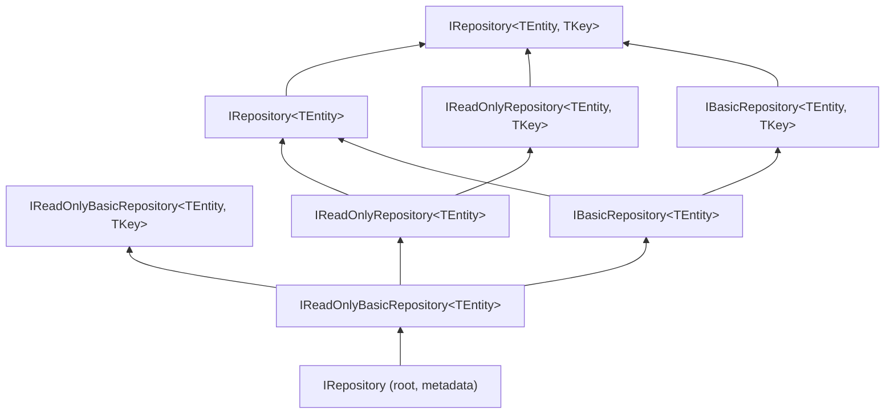

ABP Framework's repository abstractions live in `Volo.Abp.Ddd.Domain/Volo/Abp/Domain/Repositories/`. They split CRUD into an ascending tower of interfaces — `IRepository` → `IReadOnlyBasicRepository` → `IBasicRepository` → `IReadOnlyRepository` → `IRepository<TEntity, TKey>` — that lets a consumer ask for exactly the capability surface it needs. This page walks every interface in the tower, the matching `BasicRepositoryBase` / `RepositoryBase` abstract implementations, the conventional registrar, the `IAsyncQueryableExecuter` bridge to provider-specific async LINQ, the change-tracking hook, and how EF Core and MongoDB providers slot in.

## The interface tower

The five-tier interface hierarchy lives entirely inside `Volo/Abp/Domain/Repositories/`. The non-generic root carries metadata only:

```csharp
// framework/src/Volo.Abp.Ddd.Domain/Volo/Abp/Domain/Repositories/IRepository.cs
public interface IRepository
{
    bool? IsChangeTrackingEnabled { get; }

    string? EntityName { get; set; }

    string ProviderName { get; }
}
```

The tower built on top of it:



## `IReadOnlyBasicRepository<TEntity>` — list, count, paged list

The minimal read surface gives you three methods. None of them require a key type:

```csharp
// framework/src/Volo.Abp.Ddd.Domain/Volo/Abp/Domain/Repositories/IReadOnlyBasicRepository.cs
public interface IReadOnlyBasicRepository<TEntity> : IRepository
    where TEntity : class, IEntity
{
    Task<List<TEntity>> GetListAsync(bool includeDetails = false, CancellationToken cancellationToken = default);

    Task<long> GetCountAsync(CancellationToken cancellationToken = default);

    Task<List<TEntity>> GetPagedListAsync(
        int skipCount,
        int maxResultCount,
        string sorting,
        bool includeDetails = false,
        CancellationToken cancellationToken = default);
}
```

The `<TKey>` overload adds the two single-entity lookups:

```csharp
public interface IReadOnlyBasicRepository<TEntity, TKey> : IReadOnlyBasicRepository<TEntity>
    where TEntity : class, IEntity<TKey>
{
    [NotNull]
    Task<TEntity> GetAsync(TKey id, bool includeDetails = true, CancellationToken cancellationToken = default);

    Task<TEntity?> FindAsync(TKey id, bool includeDetails = true, CancellationToken cancellationToken = default);
}
```

`GetAsync(id)` throws `EntityNotFoundException` when missing; `FindAsync(id)` returns `null`. This is the standard contract throughout ABP — every `*AppService.GetAsync(id)` ultimately calls one of these.

## `IBasicRepository<TEntity>` — insert/update/delete

`IBasicRepository<TEntity>` extends the read surface with persistence operations. All methods take an `autoSave` flag that triggers `IUnitOfWork.SaveChangesAsync` immediately rather than waiting for the ambient unit of work's commit:

```csharp
// framework/src/Volo.Abp.Ddd.Domain/Volo/Abp/Domain/Repositories/IBasicRepository.cs
public interface IBasicRepository<TEntity> : IReadOnlyBasicRepository<TEntity>
    where TEntity : class, IEntity
{
    [NotNull]
    Task<TEntity> InsertAsync([NotNull] TEntity entity, bool autoSave = false, CancellationToken cancellationToken = default);

    Task InsertManyAsync([NotNull] IEnumerable<TEntity> entities, bool autoSave = false, CancellationToken cancellationToken = default);

    [NotNull]
    Task<TEntity> UpdateAsync([NotNull] TEntity entity, bool autoSave = false, CancellationToken cancellationToken = default);

    Task UpdateManyAsync([NotNull] IEnumerable<TEntity> entities, bool autoSave = false, CancellationToken cancellationToken = default);

    Task DeleteAsync([NotNull] TEntity entity, bool autoSave = false, CancellationToken cancellationToken = default);

    Task DeleteManyAsync([NotNull] IEnumerable<TEntity> entities, bool autoSave = false, CancellationToken cancellationToken = default);
}
```

The `<TKey>` overload adds delete-by-id variants:

```csharp
public interface IBasicRepository<TEntity, TKey> : IBasicRepository<TEntity>, IReadOnlyBasicRepository<TEntity, TKey>
    where TEntity : class, IEntity<TKey>
{
    Task DeleteAsync(TKey id, bool autoSave = false, CancellationToken cancellationToken = default);

    Task DeleteManyAsync([NotNull] IEnumerable<TKey> ids, bool autoSave = false, CancellationToken cancellationToken = default);
}
```

## `IReadOnlyRepository<TEntity>` — queryable + details

`IReadOnlyRepository<TEntity>` adds an `IQueryable<TEntity>` accessor and "include details" support. This is the surface you use when you want to write LINQ queries directly against the repository:

```csharp
// framework/src/Volo.Abp.Ddd.Domain/Volo/Abp/Domain/Repositories/IReadOnlyRepository.cs
public interface IReadOnlyRepository<TEntity> : IReadOnlyBasicRepository<TEntity>
    where TEntity : class, IEntity
{
    IAsyncQueryableExecuter AsyncExecuter { get; }

    [Obsolete("Use WithDetailsAsync method.")]
    IQueryable<TEntity> WithDetails();

    [Obsolete("Use WithDetailsAsync method.")]
    IQueryable<TEntity> WithDetails(params Expression<Func<TEntity, object>>[] propertySelectors);

    Task<IQueryable<TEntity>> WithDetailsAsync();

    Task<IQueryable<TEntity>> WithDetailsAsync(params Expression<Func<TEntity, object>>[] propertySelectors);

    Task<IQueryable<TEntity>> GetQueryableAsync();

    Task<List<TEntity>> GetListAsync(
        [NotNull] Expression<Func<TEntity, bool>> predicate,
        bool includeDetails = false,
        CancellationToken cancellationToken = default);
}
```

`IAsyncQueryableExecuter` (from `Volo.Abp.Linq`) bridges to provider-specific async methods like EF Core's `ToListAsync` so generic code can stay provider-agnostic.

## `IRepository<TEntity>` — full surface

Combining read + basic CUD + queryable + the find/get/delete-by-predicate triplet gives you `IRepository<TEntity>`:

```csharp
// framework/src/Volo.Abp.Ddd.Domain/Volo/Abp/Domain/Repositories/IRepository.cs
public interface IRepository<TEntity> : IReadOnlyRepository<TEntity>, IBasicRepository<TEntity>
    where TEntity : class, IEntity
{
    Task<TEntity?> FindAsync(
        [NotNull] Expression<Func<TEntity, bool>> predicate,
        bool includeDetails = true,
        CancellationToken cancellationToken = default
    );

    Task<TEntity> GetAsync(
        [NotNull] Expression<Func<TEntity, bool>> predicate,
        bool includeDetails = true,
        CancellationToken cancellationToken = default
    );

    Task DeleteAsync(
        [NotNull] Expression<Func<TEntity, bool>> predicate,
        bool autoSave = false,
        CancellationToken cancellationToken = default
    );

    Task DeleteDirectAsync(
        [NotNull] Expression<Func<TEntity, bool>> predicate,
        CancellationToken cancellationToken = default
    );
}

public interface IRepository<TEntity, TKey> : IRepository<TEntity>, IReadOnlyRepository<TEntity, TKey>, IBasicRepository<TEntity, TKey>
    where TEntity : class, IEntity<TKey>
{
}
```

`DeleteDirectAsync` is special: per its XML docs, it "directly deletes entities from database, without fetching them. Some features (like soft-delete, multi-tenancy and audit logging) won't work." So treat it as a bulk-delete escape hatch, not a normal call path.

### Capability matrix

| Capability | `IReadOnlyBasicRepository` | `IBasicRepository` | `IReadOnlyRepository` | `IRepository` |
|---|---|---|---|---|
| `GetListAsync()` | ✓ | ✓ | ✓ | ✓ |
| `GetCountAsync()` | ✓ | ✓ | ✓ | ✓ |
| `GetPagedListAsync(...)` | ✓ | ✓ | ✓ | ✓ |
| `GetAsync(id)` / `FindAsync(id)` (with `<TKey>`) | ✓ | ✓ | ✓ | ✓ |
| `InsertAsync` / `UpdateAsync` / `DeleteAsync(entity)` | – | ✓ | – | ✓ |
| `IQueryable<T>` via `GetQueryableAsync()` / `WithDetailsAsync` | – | – | ✓ | ✓ |
| `FindAsync(predicate)` / `GetAsync(predicate)` | – | – | – | ✓ |
| `DeleteAsync(predicate)` / `DeleteDirectAsync(predicate)` | – | – | – | ✓ |

Inject the **narrowest** interface that satisfies your dependency — for a read screen, `IReadOnlyRepository<Book, Guid>` is preferable to `IRepository<Book, Guid>` because the conventional registrar configures change tracking off for the former.

## `BasicRepositoryBase<TEntity>` — abstract base

The implementations the providers extend live in `BasicRepositoryBase` and `RepositoryBase`. `BasicRepositoryBase<TEntity>` resolves cross-cutting services lazily, the same way `DomainService` does:

```csharp
// framework/src/Volo.Abp.Ddd.Domain/Volo/Abp/Domain/Repositories/BasicRepositoryBase.cs
public abstract class BasicRepositoryBase<TEntity> :
    IBasicRepository<TEntity>,
    IServiceProviderAccessor,
    IUnitOfWorkEnabled
    where TEntity : class, IEntity
{
    public IAbpLazyServiceProvider LazyServiceProvider { get; set; } = default!;
    public IServiceProvider ServiceProvider { get; set; } = default!;

    public IDataFilter DataFilter => LazyServiceProvider.LazyGetRequiredService<IDataFilter>();
    public ICurrentTenant CurrentTenant => LazyServiceProvider.LazyGetRequiredService<ICurrentTenant>();
    public IAsyncQueryableExecuter AsyncExecuter => LazyServiceProvider.LazyGetRequiredService<IAsyncQueryableExecuter>();
    public IUnitOfWorkManager UnitOfWorkManager => LazyServiceProvider.LazyGetRequiredService<IUnitOfWorkManager>();
    public ICancellationTokenProvider CancellationTokenProvider =>
        LazyServiceProvider.LazyGetService<ICancellationTokenProvider>(NullCancellationTokenProvider.Instance);
    public ILoggerFactory? LoggerFactory => LazyServiceProvider.LazyGetService<ILoggerFactory>();
    public ILogger Logger =>
        LazyServiceProvider.LazyGetService<ILogger>(provider => LoggerFactory?.CreateLogger(GetType().FullName!) ?? NullLogger.Instance);
    public IEntityChangeTrackingProvider EntityChangeTrackingProvider =>
        LazyServiceProvider.LazyGetRequiredService<IEntityChangeTrackingProvider>();

    public bool? IsChangeTrackingEnabled { get; protected set; }
    public string? EntityName { get; set; }
    public string ProviderName { get; }

    protected BasicRepositoryBase(string providerName)
    {
        ProviderName = Check.NotNullOrWhiteSpace(providerName, nameof(providerName));
    }

    public abstract Task<TEntity> InsertAsync(TEntity entity, bool autoSave = false, CancellationToken cancellationToken = default);

    public virtual async Task InsertManyAsync(IEnumerable<TEntity> entities, bool autoSave = false, CancellationToken cancellationToken = default)
    {
        foreach (var entity in entities) { await InsertAsync(entity, cancellationToken: cancellationToken); }
        if (autoSave) { await SaveChangesAsync(cancellationToken); }
    }

    protected virtual Task SaveChangesAsync(CancellationToken cancellationToken)
    {
        if (UnitOfWorkManager?.Current != null)
        {
            return UnitOfWorkManager.Current.SaveChangesAsync(cancellationToken);
        }
        return Task.CompletedTask;
    }

    public abstract Task<TEntity> UpdateAsync(TEntity entity, bool autoSave = false, CancellationToken cancellationToken = default);
    public abstract Task DeleteAsync(TEntity entity, bool autoSave = false, CancellationToken cancellationToken = default);
    public abstract Task<List<TEntity>> GetListAsync(bool includeDetails = false, CancellationToken cancellationToken = default);
    public abstract Task<List<TEntity>> GetListAsync(Expression<Func<TEntity, bool>> predicate, bool includeDetails = false, CancellationToken cancellationToken = default);
    public abstract Task<long> GetCountAsync(CancellationToken cancellationToken = default);
    public abstract Task<List<TEntity>> GetPagedListAsync(int skipCount, int maxResultCount, string sorting, bool includeDetails = false, CancellationToken cancellationToken = default);

    protected virtual bool ShouldTrackingEntityChange()
    {
        if (IsChangeTrackingEnabled.HasValue) return IsChangeTrackingEnabled.Value;
        if (EntityChangeTrackingProvider.Enabled.HasValue) return EntityChangeTrackingProvider.Enabled.Value;
        return true; // default: track
    }
}
```

A few important things to note:

| Member | Why it matters |
|---|---|
| `ProviderName` (`"EntityFrameworkCore"`, `"MongoDB"`, ...) | Routes provider-specific extension methods to the right implementation |
| `IsChangeTrackingEnabled` | When the registrar instantiates a read-only repository, it sets this to `false` so EF Core skips the change tracker |
| `IMarker` interfaces (`IServiceProviderAccessor`, `IUnitOfWorkEnabled`) | `IUnitOfWorkEnabled` is what triggers the `[UnitOfWork]` interceptor to open a UoW around repository calls |
| `SaveChangesAsync` | The reason `autoSave: true` works — it pushes through to the ambient `IUnitOfWork.Current` |

The `<TKey>` overload supplies `GetAsync(TKey)` and `DeleteAsync(TKey)` via the find pattern:

```csharp
public abstract class BasicRepositoryBase<TEntity, TKey> : BasicRepositoryBase<TEntity>, IBasicRepository<TEntity, TKey>
    where TEntity : class, IEntity<TKey>
{
    protected BasicRepositoryBase(string providerName) : base(providerName) { }

    public virtual async Task<TEntity> GetAsync(TKey id, bool includeDetails = true, CancellationToken cancellationToken = default)
    {
        var entity = await FindAsync(id, includeDetails, cancellationToken);
        if (entity == null) throw new EntityNotFoundException<TEntity>(id);
        return entity;
    }

    public abstract Task<TEntity?> FindAsync(TKey id, bool includeDetails = true, CancellationToken cancellationToken = default);

    public virtual async Task DeleteAsync(TKey id, bool autoSave = false, CancellationToken cancellationToken = default)
    {
        var entity = await FindAsync(id, cancellationToken: cancellationToken);
        if (entity == null) return;
        await DeleteAsync(entity, autoSave, cancellationToken);
    }
    // DeleteManyAsync(ids, ...) iterates DeleteAsync(id)
}
```

## `RepositoryBase<TEntity>` — adds queryable & data filters

`RepositoryBase` extends `BasicRepositoryBase` with the queryable surface and the soft-delete/multi-tenant filter helpers introduced on the [entities page](/ddd/domain-entities-and-aggregates):

```csharp
// framework/src/Volo.Abp.Ddd.Domain/Volo/Abp/Domain/Repositories/RepositoryBase.cs
public abstract class RepositoryBase<TEntity> : BasicRepositoryBase<TEntity>, IRepository<TEntity>, IUnitOfWorkManagerAccessor
    where TEntity : class, IEntity
{
    protected RepositoryBase(string providerName) : base(providerName) { }

    [Obsolete("Use WithDetailsAsync method.")]
    public virtual IQueryable<TEntity> WithDetails() => GetQueryable();
    [Obsolete("Use WithDetailsAsync method.")]
    public virtual IQueryable<TEntity> WithDetails(params Expression<Func<TEntity, object>>[] propertySelectors) => GetQueryable();

    public virtual Task<IQueryable<TEntity>> WithDetailsAsync() => GetQueryableAsync();
    public virtual Task<IQueryable<TEntity>> WithDetailsAsync(params Expression<Func<TEntity, object>>[] propertySelectors) => GetQueryableAsync();

    [Obsolete("Use GetQueryableAsync method.")]
    protected abstract IQueryable<TEntity> GetQueryable();

    public abstract Task<IQueryable<TEntity>> GetQueryableAsync();

    public abstract Task<TEntity?> FindAsync(
        Expression<Func<TEntity, bool>> predicate,
        bool includeDetails = true,
        CancellationToken cancellationToken = default);

    public async Task<TEntity> GetAsync(
        Expression<Func<TEntity, bool>> predicate,
        bool includeDetails = true,
        CancellationToken cancellationToken = default)
    {
        var entity = await FindAsync(predicate, includeDetails, cancellationToken);
        if (entity == null) throw new EntityNotFoundException<TEntity>();
        return entity;
    }

    public abstract Task DeleteAsync(Expression<Func<TEntity, bool>> predicate, bool autoSave = false, CancellationToken cancellationToken = default);
    public abstract Task DeleteDirectAsync(Expression<Func<TEntity, bool>> predicate, CancellationToken cancellationToken = default);

    protected virtual TQueryable ApplyDataFilters<TQueryable>(TQueryable query)
        where TQueryable : IQueryable<TEntity> => ApplyDataFilters<TQueryable, TEntity>(query);

    protected virtual TQueryable ApplyDataFilters<TQueryable, TOtherEntity>(TQueryable query)
        where TQueryable : IQueryable<TOtherEntity>
    {
        if (typeof(ISoftDelete).IsAssignableFrom(typeof(TOtherEntity)))
        {
            query = (TQueryable)query.WhereIf(DataFilter.IsEnabled<ISoftDelete>(), e => ((ISoftDelete)e!).IsDeleted == false);
        }

        if (typeof(IMultiTenant).IsAssignableFrom(typeof(TOtherEntity)))
        {
            var tenantId = CurrentTenant.Id;
            query = (TQueryable)query.WhereIf(DataFilter.IsEnabled<IMultiTenant>(), e => ((IMultiTenant)e!).TenantId == tenantId);
        }

        return query;
    }
}
```

The provider implementation (EF Core's `EfCoreRepository<TDbContext, TEntity>` or MongoDB's `MongoDbRepository<TMongoDbContext, TEntity>`) just overrides `GetQueryableAsync`, `FindAsync`, `InsertAsync`, etc., and inherits the rest.

## `IAsyncQueryableExecuter` — async LINQ without provider lock-in

`IReadOnlyRepository<TEntity>` exposes `AsyncExecuter` so application services can call `await AsyncExecuter.ToListAsync(query)` without referencing EF Core's `Microsoft.EntityFrameworkCore` namespace. The implementation registered by the EF Core provider knows how to call EF Core's static `ToListAsync`; the MongoDB provider does the equivalent for `IMongoQueryable<T>`. From the application layer's perspective both look identical.

## Conventional registration

ABP's `AbpRepositoryConventionalRegistrar` auto-registers every concrete `IRepository` implementation found at startup. Crucially, it exposes the *interface* (not the class) so injecting a concrete `EfCoreRepository<TDbContext, Book>` from outside the data layer is intentionally hard:

```csharp
// framework/src/Volo.Abp.Ddd.Domain/Volo/Abp/Domain/Repositories/AbpRepositoryConventionalRegistrar.cs
public class AbpRepositoryConventionalRegistrar : DefaultConventionalRegistrar
{
    public static bool ExposeRepositoryClasses { get; set; }

    protected override bool IsConventionalRegistrationDisabled(Type type)
    {
        return !typeof(IRepository).IsAssignableFrom(type) || base.IsConventionalRegistrationDisabled(type);
    }

    protected override List<Type> GetExposedServiceTypes(Type type)
    {
        if (ExposeRepositoryClasses) return base.GetExposedServiceTypes(type);

        return base.GetExposedServiceTypes(type)
            .Where(x => x.IsInterface)
            .ToList();
    }

    protected override ServiceLifetime? GetDefaultLifeTimeOrNull(Type type) => ServiceLifetime.Transient;
}
```

This registrar is added in `AbpDddDomainModule.PreConfigureServices` ([overview](/ddd/overview)).

## Default repository helper

`ServiceCollectionRepositoryExtensions.AddDefaultRepository` wires every interface in the tower to a single concrete repository class — providers use it to register one repository against `IRepository<Book>`, `IRepository<Book, Guid>`, `IReadOnlyRepository<Book, Guid>`, `IBasicRepository<Book>`, and so on, all in one shot. The first half of the method is reproduced below; the symmetrical `<TKey>` branch follows the same pattern.

```csharp
// framework/src/Volo.Abp.Ddd.Domain/Microsoft/Extensions/DependencyInjection/ServiceCollectionRepositoryExtensions.cs
public static IServiceCollection AddDefaultRepository(
    this IServiceCollection services,
    Type entityType,
    Type repositoryImplementationType,
    bool replaceExisting = false)
{
    //IReadOnlyBasicRepository<TEntity>
    var readOnlyBasicRepositoryInterface = typeof(IReadOnlyBasicRepository<>).MakeGenericType(entityType);
    if (readOnlyBasicRepositoryInterface.IsAssignableFrom(repositoryImplementationType))
    {
        RegisterService(services, readOnlyBasicRepositoryInterface, repositoryImplementationType, replaceExisting, true);

        //IReadOnlyRepository<TEntity>
        var readOnlyRepositoryInterface = typeof(IReadOnlyRepository<>).MakeGenericType(entityType);
        if (readOnlyRepositoryInterface.IsAssignableFrom(repositoryImplementationType))
        {
            RegisterService(services, readOnlyRepositoryInterface, repositoryImplementationType, replaceExisting, true);
        }

        //IBasicRepository<TEntity>
        var basicRepositoryInterface = typeof(IBasicRepository<>).MakeGenericType(entityType);
        if (basicRepositoryInterface.IsAssignableFrom(repositoryImplementationType))
        {
            RegisterService(services, basicRepositoryInterface, repositoryImplementationType, replaceExisting);

            //IRepository<TEntity>
            var repositoryInterface = typeof(IRepository<>).MakeGenericType(entityType);
            if (repositoryInterface.IsAssignableFrom(repositoryImplementationType))
            {
                RegisterService(services, repositoryInterface, repositoryImplementationType, replaceExisting);
            }
        }
    }
    // ... <TKey> branch follows
    return services;
}
```

The fourth boolean argument to `RegisterService` is `replaceForReadOnly` — for the read-only services the registrar can mark the registration as change-tracking-disabled.

## Change tracking

Two attributes control whether the framework tracks change events on the entities a repository returns:

| Type | File | Effect |
|---|---|---|
| `EnableEntityChangeTrackingAttribute` | `Volo/Abp/Domain/ChangeTracking/EnableEntityChangeTrackingAttribute.cs` | Forces tracking even on interfaces that default to off |
| `DisableEntityChangeTrackingAttribute` | `Volo/Abp/Domain/ChangeTracking/DisableEntityChangeTrackingAttribute.cs` | Forces tracking off (e.g., for a read-only method) |

The resolution logic in `BasicRepositoryBase.ShouldTrackingEntityChange()` (shown above) is:

1. If the repository sets `IsChangeTrackingEnabled` explicitly, use that.
2. Else, look up the `IEntityChangeTrackingProvider.Enabled` (set by interceptors based on the attributes above).
3. Default to tracking enabled.

## Unit-of-work integration

Repositories implement `IUnitOfWorkEnabled` (a marker) so the `UnitOfWorkInterceptor` opens an ambient unit of work when a repository method is called outside one. When the calling application service is decorated with `[UnitOfWork]`, the repository simply joins that existing UoW. The save semantics flow from `BasicRepositoryBase.SaveChangesAsync`:

```mermaid
sequenceDiagram
    participant AppSvc as ApplicationService<br/>(implicit UoW)
    participant Repo as IRepository&lt;Book&gt;
    participant UoW as IUnitOfWorkManager.Current
    participant DB as Provider (EF / Mongo)

    AppSvc->>Repo: InsertAsync(book, autoSave: true)
    Repo->>DB: Track inserted entity
    Repo->>UoW: SaveChangesAsync()
    UoW->>DB: Commit changes
    AppSvc->>Repo: UpdateAsync(book, autoSave: false)
    Note over Repo,DB: change is buffered
    AppSvc-->>UoW: returns => UoW commits
    UoW->>DB: Commit changes
```

The deeper UoW model is on the dedicated [Unit of Work](/data/unit-of-work) page.

## How EF Core & MongoDB plug in

The two first-party providers each ship a `RepositoryBase` subclass:

| Provider | Concrete repository | Project |
|---|---|---|
| Entity Framework Core | `EfCoreRepository<TDbContext, TEntity>` and `<TDbContext, TEntity, TKey>` | `framework/src/Volo.Abp.EntityFrameworkCore` |
| MongoDB | `MongoDbRepository<TMongoDbContext, TEntity>` and `<TMongoDbContext, TEntity, TKey>` | `framework/src/Volo.Abp.MongoDB` |
| Dapper (lite read repository) | implements `IDapperRepository<TDbContext>` | `framework/src/Volo.Abp.Dapper` |

When you call `options.AddRepository<Book, EfCoreBookRepository>()` in your DbContext-registration options, the framework runs `AddDefaultRepository` above to register your concrete class against every interface in the tower. The full data integration story — including DbContext registration options, MongoDB collection mapping, and `ReplaceDbContextAttribute` — is covered in the [data overview](/data/overview).

## Repository-level extensions

Beyond the interface methods, two extension classes give you idiomatic LINQ helpers:

- `RepositoryAsyncExtensions` (file `Volo/Abp/Domain/Repositories/RepositoryAsyncExtensions.cs`) — `AnyAsync`, `AllAsync`, `CountAsync`, `LongCountAsync`, `FirstAsync`, `FirstOrDefaultAsync`, `LastAsync`, `LastOrDefaultAsync`, `SingleAsync`, `SingleOrDefaultAsync`, `MinAsync`, `MaxAsync`, `SumAsync`, `AverageAsync`, `ContainsAsync` overloads that delegate to `AsyncExecuter`.
- `RepositoryExtensions` (file `Volo/Abp/Domain/Repositories/RepositoryExtensions.cs`) — `EnsureCollectionLoadedAsync`, `EnsurePropertyLoadedAsync` for repositories that also implement `ISupportsExplicitLoading`.

These extensions are why `await _bookRepository.AnyAsync(b => b.Name == name)` works even though `AnyAsync` is not part of `IRepository<Book>`.

## Picking the right interface — a cheat sheet

| Scenario | Inject |
|---|---|
| Read-only screen, no LINQ needed | `IReadOnlyBasicRepository<Book, Guid>` |
| Read-only screen, custom LINQ | `IReadOnlyRepository<Book, Guid>` |
| Insert / update on a single aggregate | `IBasicRepository<Book, Guid>` |
| Anything else (the default) | `IRepository<Book, Guid>` |

A custom repository interface (e.g. `IBookRepository : IRepository<Book, Guid>`) is the right place to put queries with non-trivial includes or joins — the [identity module](/modules/identity) does exactly this with `IIdentityUserRepository` exposing `FindByNormalizedUserNameAsync`.

## Cross-references

- [Entities & aggregates](/ddd/domain-entities-and-aggregates) — types these repositories operate on.
- [Specifications](/ddd/specifications) — predicate combinators used together with the queryable surface.
- [Application services](/ddd/application-services) and [CRUD app service](/ddd/crud-app-service) — primary repository consumers.
- [Data overview](/data/overview) and [Unit of work](/data/unit-of-work) — provider configuration and transactional boundaries.
- [Identity module](/modules/identity) — concrete custom repositories like `IIdentityUserRepository`.
