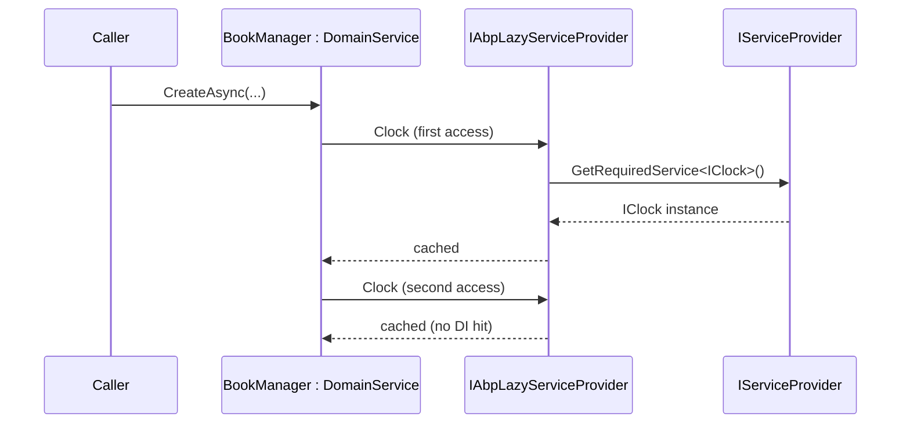
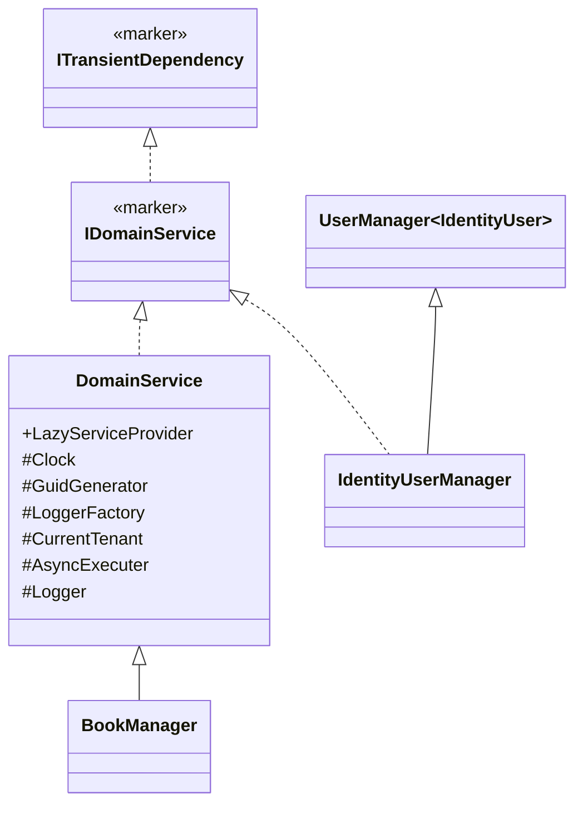
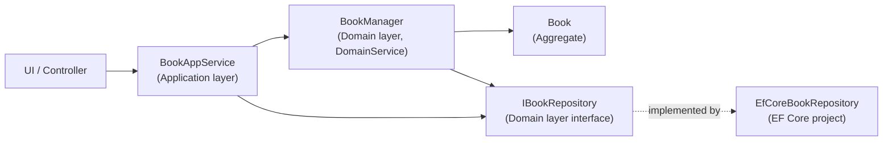

In ABP Framework, a **domain service** encapsulates business logic that doesn't naturally fit inside a single aggregate — it usually orchestrates two or more aggregates, calls infrastructure (a repository, the clock), and is named with the `Manager` suffix by convention (`IdentityUserManager`, `OrganizationUnitManager`). This page covers the `IDomainService` marker, the `DomainService` base class with its lazy-resolved dependencies (`IClock`, `IGuidGenerator`, `ICurrentTenant`, `IAsyncQueryableExecuter`, `ILoggerFactory`, `ILogger`), the conventional registration that turns implementations into transient services, and a real-world walkthrough of `IdentityUserManager` from the identity module.

## `IDomainService` — a marker that enables conventional DI

The `IDomainService` interface is intentionally empty. Its only job is to be a hook for ABP's conventional registrar. It extends `ITransientDependency`, so any class implementing it (or inheriting from `DomainService`) is automatically registered with a transient lifetime:

```csharp
// framework/src/Volo.Abp.Ddd.Domain/Volo/Abp/Domain/Services/IDomainService.cs
using Volo.Abp.DependencyInjection;

namespace Volo.Abp.Domain.Services;

/// <summary>
/// This interface can be implemented by all domain services to identify them by convention.
/// </summary>
public interface IDomainService : ITransientDependency
{
}
```

Because `ITransientDependency` itself is picked up by ABP's `DefaultConventionalRegistrar` (see `Volo.Abp.Core`'s `DependencyInjection` namespace), you do not have to call `services.AddTransient<IBookManager, BookManager>()` anywhere — the manager is wired up the moment its assembly is loaded as part of an `AbpModule`.

## The `DomainService` base class

`DomainService` is the recommended base for your `XxxManager` classes. It exposes property-injected `LazyServiceProvider` and resolves the most common cross-cutting services lazily — meaning the constructor does not have to take fifteen parameters and the service provider only resolves what you actually use:

```csharp
// framework/src/Volo.Abp.Ddd.Domain/Volo/Abp/Domain/Services/DomainService.cs
using System;
using Microsoft.Extensions.Logging;
using Microsoft.Extensions.Logging.Abstractions;
using Volo.Abp.DependencyInjection;
using Volo.Abp.Guids;
using Volo.Abp.Linq;
using Volo.Abp.MultiTenancy;
using Volo.Abp.Timing;

namespace Volo.Abp.Domain.Services;

public abstract class DomainService : IDomainService
{
    public IAbpLazyServiceProvider LazyServiceProvider { get; set; } = default!;

    [Obsolete("Use LazyServiceProvider instead.")]
    public IServiceProvider ServiceProvider { get; set; } = default!;

    protected IClock Clock => LazyServiceProvider.LazyGetRequiredService<IClock>();

    protected IGuidGenerator GuidGenerator =>
        LazyServiceProvider.LazyGetService<IGuidGenerator>(SimpleGuidGenerator.Instance);

    protected ILoggerFactory LoggerFactory =>
        LazyServiceProvider.LazyGetRequiredService<ILoggerFactory>();

    protected ICurrentTenant CurrentTenant =>
        LazyServiceProvider.LazyGetRequiredService<ICurrentTenant>();

    protected IAsyncQueryableExecuter AsyncExecuter =>
        LazyServiceProvider.LazyGetRequiredService<IAsyncQueryableExecuter>();

    protected ILogger Logger =>
        LazyServiceProvider.LazyGetService<ILogger>(provider =>
            LoggerFactory?.CreateLogger(GetType().FullName!) ?? NullLogger.Instance);
}
```

The pre-resolved services and their roles:

| Property | Type | Source | Purpose |
|---|---|---|---|
| `Clock` | `IClock` | `Volo.Abp.Timing` | Replaces `DateTime.UtcNow` for testability + timezone awareness |
| `GuidGenerator` | `IGuidGenerator` | `Volo.Abp.Guids` | Sequential Guid generation for primary keys |
| `LoggerFactory` | `ILoggerFactory` | `Microsoft.Extensions.Logging` | Create category-named loggers |
| `CurrentTenant` | `ICurrentTenant` | `Volo.Abp.MultiTenancy` | Read or scope to the active tenant id |
| `AsyncExecuter` | `IAsyncQueryableExecuter` | `Volo.Abp.Linq` | Provider-agnostic `ToListAsync`, `CountAsync`, etc. |
| `Logger` | `ILogger` | derived from `LoggerFactory` | Concrete logger named after the manager class |

Two subtleties to note: `GuidGenerator` falls back to `SimpleGuidGenerator.Instance` if no `IGuidGenerator` is registered (so even unit tests work), and `Logger` falls back to `NullLogger.Instance`. Both use `LazyGetService` with a factory, while truly required services use `LazyGetRequiredService`.

## Why "lazy" matters

`IAbpLazyServiceProvider` (from `Volo.Abp.DependencyInjection`) caches resolved services per-instance — so reading `Clock` 50 times in the same call costs exactly one DI resolution. More importantly, services that the method never touches are *never* resolved. A `BookManager.CountAsync` that only uses `Clock` will pay nothing for `IAsyncQueryableExecuter` even though it's exposed by the base class.



## The `XxxManager` convention

ABP modules name their domain services `XxxManager`, expose them as concrete classes (not interfaces), and place them in the `*.Domain` project alongside the aggregate they manage. The pattern is illustrated by the table below, which shows real domain services from the identity module:

| Manager class | File | Aggregate(s) coordinated |
|---|---|---|
| `IdentityUserManager` | `modules/identity/src/Volo.Abp.Identity.Domain/Volo/Abp/Identity/IdentityUserManager.cs` | `IdentityUser` + roles, claims, link users |
| `IdentityRoleManager` | `modules/identity/src/Volo.Abp.Identity.Domain/Volo/Abp/Identity/IdentityRoleManager.cs` | `IdentityRole` |
| `IdentityClaimTypeManager` | `modules/identity/src/Volo.Abp.Identity.Domain/Volo/Abp/Identity/IdentityClaimTypeManager.cs` | `IdentityClaimType` |
| `IdentityUserDelegationManager` | `modules/identity/src/Volo.Abp.Identity.Domain/Volo/Abp/Identity/IdentityUserDelegationManager.cs` | `IdentityUserDelegation` |
| `IdentityLinkUserManager` | `modules/identity/src/Volo.Abp.Identity.Domain/Volo/Abp/Identity/IdentityLinkUserManager.cs` | `IdentityLinkUser` |
| `OrganizationUnitManager` | `modules/identity/src/Volo.Abp.Identity.Domain/Volo/Abp/Identity/OrganizationUnitManager.cs` | `OrganizationUnit` tree |

### Case study: `IdentityUserManager`

`IdentityUserManager` is one of the most complex domain services in the framework. It implements `IDomainService` directly (rather than inheriting from `DomainService`) because it also has to inherit from ASP.NET Core Identity's `UserManager<IdentityUser>`:

```csharp
// modules/identity/src/Volo.Abp.Identity.Domain/Volo/Abp/Identity/IdentityUserManager.cs
public class IdentityUserManager : UserManager<IdentityUser>, IDomainService
{
    protected IIdentityRoleRepository RoleRepository { get; }
    protected IIdentityUserRepository UserRepository { get; }
    protected IOrganizationUnitRepository OrganizationUnitRepository { get; }
    protected ISettingProvider SettingProvider { get; }
    protected ICancellationTokenProvider CancellationTokenProvider { get; }
    protected IDistributedEventBus DistributedEventBus { get; }
    protected IIdentityLinkUserRepository IdentityLinkUserRepository { get; }
    protected IDistributedCache<AbpDynamicClaimCacheItem> DynamicClaimCache { get; }
    protected override CancellationToken CancellationToken => CancellationTokenProvider.Token;
    protected IOptions<AbpMultiTenancyOptions> MultiTenancyOptions { get; }
    protected ICurrentTenant CurrentTenant { get; }
    protected IDataFilter DataFilter { get; }

    public IdentityUserManager(
        IdentityUserStore store,
        IIdentityRoleRepository roleRepository,
        IIdentityUserRepository userRepository,
        IOptions<IdentityOptions> optionsAccessor,
        IPasswordHasher<IdentityUser> passwordHasher,
        IEnumerable<IUserValidator<IdentityUser>> userValidators,
        IEnumerable<IPasswordValidator<IdentityUser>> passwordValidators,
        ILookupNormalizer keyNormalizer,
        IdentityErrorDescriber errors,
        IServiceProvider services,
        ILogger<IdentityUserManager> logger,
        ICancellationTokenProvider cancellationTokenProvider,
        IOrganizationUnitRepository organizationUnitRepository,
        ISettingProvider settingProvider,
        IDistributedEventBus distributedEventBus,
        IIdentityLinkUserRepository identityLinkUserRepository,
        IDistributedCache<AbpDynamicClaimCacheItem> dynamicClaimCache,
        IOptions<AbpMultiTenancyOptions> multiTenancyOptions,
        ICurrentTenant currentTenant,
        IDataFilter dataFilter)
        : base(...) { /* ... */ }
}
```

When you can't share `DomainService`'s base behaviour (because you must inherit from an external library's class), the pattern is to simply implement `IDomainService` directly and take dependencies via constructor injection. Conventional registration still applies because `IDomainService` extends `ITransientDependency`.

### Case study: a typical manager

A vanilla `BookManager` that extends `DomainService` looks like the snippet below — note that the manager *creates* aggregates but never persists them (that's the application service's job to call the repository):

```csharp
public class BookManager : DomainService
{
    private readonly IBookRepository _bookRepository;

    public BookManager(IBookRepository bookRepository)
    {
        _bookRepository = bookRepository;
    }

    public async Task<Book> CreateAsync(string name, BookType type, float price)
    {
        if (await _bookRepository.AnyAsync(b => b.Name == name))
        {
            throw new BookAlreadyExistsException(name);
        }

        return new Book(
            GuidGenerator.Create(),  // from DomainService
            name,
            type,
            Clock.Now,               // from DomainService
            price
        );
    }
}
```

The manager uses `GuidGenerator` and `Clock` directly off the base class — no constructor parameters needed.

## Registration pipeline

The diagram below traces how an arbitrary `BookManager : DomainService` class ends up in DI:


You can verify this by searching for `AddTransient` in your bootstrap log — `BookManager` will appear with `Volo.Abp.DependencyInjection.DefaultConventionalRegistrar` as the registrant.

## Property injection of `LazyServiceProvider`

`DomainService` uses property injection for `LazyServiceProvider` instead of a constructor parameter. This decision is what lets derived classes keep their constructor signatures clean — only the *intent-revealing* dependencies (like an `IBookRepository`) appear in the constructor, while infrastructure (clock, guids, current tenant) is wired up later by ABP's property-injection step.

```csharp
public IAbpLazyServiceProvider LazyServiceProvider { get; set; } = default!;
```

The `= default!` means "I promise it'll be assigned before any method runs" — and `AbpServiceProviderExtensions.SetPropertyInjections` (in `Volo.Abp.Core`) does that assignment after construction, before the instance is handed to the caller.

## Domain services vs. application services

| Concern | Domain service | Application service |
|---|---|---|
| Layer | `*.Domain` | `*.Application` |
| Naming | `XxxManager` | `XxxAppService` |
| Base class | `DomainService` | `ApplicationService` ([details](/ddd/application-services)) |
| Marker interface | `IDomainService` | `IApplicationService` |
| DTOs | Works on entities directly | Works on DTOs ([details](/ddd/application-dtos)) |
| Authorization | Not applied by default | Applied via `[Authorize]` / `CheckPolicyAsync` |
| Unit of work | Joins an outer UoW | `[UnitOfWork]` (transactional) by default |
| Used by | Application services and other managers | HTTP controllers, other app services |

The rule of thumb: an application service translates DTOs to domain calls; a domain service contains pure business logic and never sees a DTO.

## Cross-references

`DomainService`'s `IAsyncQueryableExecuter` accessor is the same one the [repositories page](/ddd/domain-repositories) discusses — it abstracts over EF Core / MongoDB / in-memory LINQ. Its `Clock` and `GuidGenerator` come from the cross-cutting modules listed in `AbpDddDomainModule`'s `[DependsOn]` block ([overview](/ddd/overview)).



Continue to the [Application services](/ddd/application-services) page to see how managers are usually invoked from a transaction-aware caller, or to [Identity module](/modules/identity) to read the full source of `IdentityUserManager` and the other identity managers listed above.

## Where managers should *not* go

A common mistake is to put data-access concerns into a manager — calls like `_dbContext.Books.Where(...)` or `_collection.Find(...)`. These break the domain layer's promise of being persistence-agnostic. The right home for those operations is a *custom repository* method (e.g. `IBookRepository.FindByAuthorAsync`), implemented in the EF Core / MongoDB project. The manager then calls the repository through its abstraction.

| Symptom | Better home |
|---|---|
| Manager directly references `DbContext` | EF Core repository |
| Manager projects to a DTO | Application service |
| Manager opens a transaction manually | Application service decorated with `[UnitOfWork]` |
| Manager handles HTTP-specific concerns | Application service |
| Manager imports `Microsoft.AspNetCore.*` | Refactor — `Domain` must not depend on ASP.NET |

The `IUser` data-filter check `if (typeof(TEntity).IsAssignableFrom(IMultiTenant))` from `RepositoryBase` (covered on the [Repositories page](/ddd/domain-repositories)) is *not* a manager's job either — the repository handles it for you.

## A summary chart



Notice the manager talks to the repository through its interface — never to a concrete EF Core repository or `DbContext`. This keeps the [Identity module](/modules/identity)'s `IdentityUserManager` independent of EF Core, and that's exactly what makes it possible to swap MongoDB underneath the identity module without rewriting the manager.

## Summary table

| Concept | Where |
|---|---|
| `IDomainService` marker | `framework/src/Volo.Abp.Ddd.Domain/Volo/Abp/Domain/Services/IDomainService.cs` |
| `DomainService` base class | `framework/src/Volo.Abp.Ddd.Domain/Volo/Abp/Domain/Services/DomainService.cs` |
| Real-world example | `modules/identity/src/Volo.Abp.Identity.Domain/Volo/Abp/Identity/IdentityUserManager.cs` |
| Registration mechanism | `Volo.Abp.DependencyInjection.DefaultConventionalRegistrar` (in `Volo.Abp.Core`) |
| Lifetime | Transient (set by `IDomainService : ITransientDependency`) |
| Naming convention | `XxxManager` for the class, no interface unless polymorphism is required |
