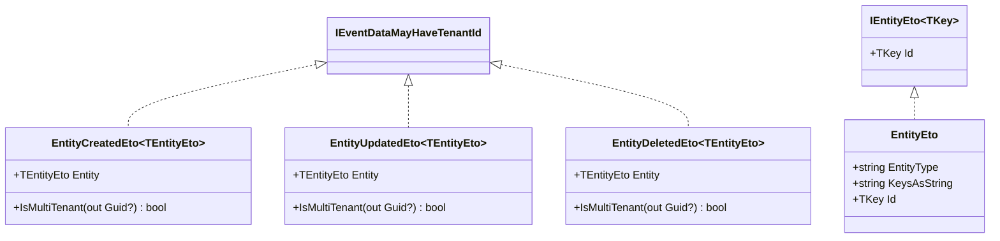
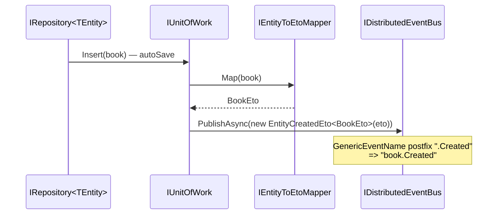
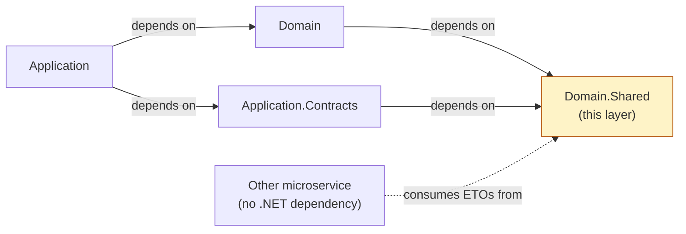

The `Volo.Abp.Ddd.Domain.Shared` package is the smallest layer in ABP Framework's DDD stack — it intentionally ships only types that *both* the domain layer (producers) and external clients (consumers in other microservices or processes) need to agree on. This page walks the entire directory tree under `framework/src/Volo.Abp.Ddd.Domain.Shared/`, explains the role of each class file (modules, `EntityEto`, `EntityCreatedEto<T>`, `EntityUpdatedEto<T>`, `EntityDeletedEto<T>`, the `EtoMappingDictionary`, and the auto-event selector lists), and shows how `AbpDistributedEntityEventOptions` is configured.

## Why a "shared" package exists

In a microservice or modular monolith, the *publisher* of a `BookCreated` distributed event and the *subscriber* in a different process must agree on the wire shape of the event without sharing the publisher's entity class, repository, or DbContext. ABP solves this by putting all the event-to-object (`Eto`) types in `Domain.Shared`, which is the only layer the application's contracts package and the consumer process can both reference. The package's `.csproj` file `Volo.Abp.Ddd.Domain.Shared.csproj` therefore has zero dependencies on persistence, mapping, or application packages.

## Directory layout

The whole package fits in one folder. Every file lives under `Volo/Abp/Domain/Entities/Events/Distributed/` except the module class:

| File | Role |
|---|---|
| `Volo/Abp/Domain/AbpDddDomainSharedModule.cs` | Module entry point — declares `[DependsOn]` |
| `Volo/Abp/Domain/Entities/Events/Distributed/EntityEto.cs` | Generic, type-erased ETO base & strongly-typed `EntityEto<TKey>` |
| `Volo/Abp/Domain/Entities/Events/Distributed/IEntityEto.cs` | Marker interface `IEntityEto<TKey>` |
| `Volo/Abp/Domain/Entities/Events/Distributed/EntityCreatedEto.cs` | `EntityCreatedEto<TEntityEto>` distributed event wrapper |
| `Volo/Abp/Domain/Entities/Events/Distributed/EntityUpdatedEto.cs` | `EntityUpdatedEto<TEntityEto>` distributed event wrapper |
| `Volo/Abp/Domain/Entities/Events/Distributed/EntityDeletedEto.cs` | `EntityDeletedEto<TEntityEto>` distributed event wrapper |
| `Volo/Abp/Domain/Entities/Events/Distributed/EtoMappingDictionary.cs` | `Dictionary<Type, EtoMappingDictionaryItem>` to register entity-to-ETO maps |
| `Volo/Abp/Domain/Entities/Events/Distributed/EtoMappingDictionaryItem.cs` | One mapping entry — target `EtoType` plus optional `ObjectMappingContextType` |
| `Volo/Abp/Domain/Entities/Events/Distributed/AbpDistributedEntityEventOptions.cs` | Options object with `AutoEventSelectors`, `IgnoredEventSelectors`, `EtoMappings` |
| `Volo/Abp/Domain/Entities/Events/Distributed/IAutoEntityDistributedEventSelectorList.cs` | Type-selector list interface |
| `Volo/Abp/Domain/Entities/Events/Distributed/AutoEntityDistributedEventSelectorList.cs` | Default implementation backed by `List<NamedTypeSelector>` |
| `Volo/Abp/Domain/Entities/Events/Distributed/IEntityToEtoMapper.cs` | Runtime resolver — `object? Map(object entityObj)` |

## `AbpDddDomainSharedModule`

The full source is below — it is a marker module that pulls in two abstractions modules and registers no services itself. Every other DDD package (`Volo.Abp.Ddd.Domain`, `Volo.Abp.Ddd.Application.Contracts`) declares `AbpDddDomainSharedModule` in its `[DependsOn]` list so the ETOs are always available.

```csharp
// framework/src/Volo.Abp.Ddd.Domain.Shared/Volo/Abp/Domain/AbpDddDomainSharedModule.cs
using Volo.Abp.EventBus.Abstractions;
using Volo.Abp.Modularity;
using Volo.Abp.MultiTenancy;

namespace Volo.Abp.Domain;

[DependsOn(
    typeof(AbpMultiTenancyAbstractionsModule),
    typeof(AbpEventBusAbstractionsModule)
)]
public class AbpDddDomainSharedModule : AbpModule
{
}
```

Notice the dependencies are *abstractions* (`AbpMultiTenancyAbstractionsModule`, `AbpEventBusAbstractionsModule`) — they introduce no implementation, so consumers can swap their own multi-tenancy implementation or use a different event bus.

## `EntityEto` — the type-erased base and the strongly-typed generic

`EntityEto` is a serializable POCO carrying two strings: the CLR type name of the entity and a stringified composite-key value. It is meant for cases where the consumer doesn't know the entity's TKey:

```csharp
// framework/src/Volo.Abp.Ddd.Domain.Shared/Volo/Abp/Domain/Entities/Events/Distributed/EntityEto.cs
[Serializable]
public class EntityEto : EtoBase
{
    public string EntityType { get; set; } = default!;

    public string KeysAsString { get; set; } = default!;

    public EntityEto()
    {
    }

    public EntityEto(string entityType, string keysAsString)
    {
        EntityType = entityType;
        KeysAsString = keysAsString;
    }
}

public abstract class EntityEto<TKey> : IEntityEto<TKey>
{
    public TKey Id { get; set; } = default!;
}
```

The `EntityEto<TKey>` generic is the abstract base for application-defined ETOs — e.g. you would define `public class BookEto : EntityEto<Guid> { ... }` in your `*.Domain.Shared` project. The single-property `IEntityEto<TKey>` interface in the same folder is what `EntityEto<TKey>` implements:

```csharp
// framework/src/Volo.Abp.Ddd.Domain.Shared/Volo/Abp/Domain/Entities/Events/Distributed/IEntityEto.cs
public interface IEntityEto<TKey>
{
    /// <summary>Unique identifier for this entity.</summary>
    TKey Id { get; set; }
}
```

## The three distributed-event wrappers

`EntityCreatedEto<TEntityEto>`, `EntityUpdatedEto<TEntityEto>`, and `EntityDeletedEto<TEntityEto>` are nearly identical — each wraps one ETO instance and stamps it with a `[GenericEventName(Postfix = "...")]` so the event bus picks a stable name like `book.Created` or `book.Deleted` for cross-process delivery. The `EntityCreatedEto` source illustrates the pattern:

```csharp
// framework/src/Volo.Abp.Ddd.Domain.Shared/Volo/Abp/Domain/Entities/Events/Distributed/EntityCreatedEto.cs
[Serializable]
[GenericEventName(Postfix = ".Created")]
public class EntityCreatedEto<TEntityEto> : IEventDataMayHaveTenantId
{
    public TEntityEto Entity { get; set; }

    public EntityCreatedEto(TEntityEto entity)
    {
        Entity = entity;
    }

    public virtual bool IsMultiTenant(out Guid? tenantId)
    {
        if (Entity is IMultiTenant multiTenantEntity)
        {
            tenantId = multiTenantEntity.TenantId;
            return true;
        }

        tenantId = null;
        return false;
    }
}
```

`EntityUpdatedEto<TEntityEto>` (file `EntityUpdatedEto.cs`) uses `[GenericEventName(Postfix = ".Updated")]`, and `EntityDeletedEto<TEntityEto>` (file `EntityDeletedEto.cs`) uses `.Deleted`. All three implement `IEventDataMayHaveTenantId` so distributed event bus subscribers in other tenants are properly filtered.

The relationship is summarised here:



## `AbpDistributedEntityEventOptions` — the configuration root

A consuming module configures distributed entity events by binding `AbpDistributedEntityEventOptions`. The full type lives in `Volo/Abp/Domain/Entities/Events/Distributed/AbpDistributedEntityEventOptions.cs`:

```csharp
// framework/src/Volo.Abp.Ddd.Domain.Shared/Volo/Abp/Domain/Entities/Events/Distributed/AbpDistributedEntityEventOptions.cs
public class AbpDistributedEntityEventOptions
{
    public IAutoEntityDistributedEventSelectorList AutoEventSelectors { get; }

    public IAutoEntityDistributedEventSelectorList IgnoredEventSelectors { get; }

    public EtoMappingDictionary EtoMappings { get; set; }

    public AbpDistributedEntityEventOptions()
    {
        AutoEventSelectors = new AutoEntityDistributedEventSelectorList();
        IgnoredEventSelectors = new AutoEntityDistributedEventSelectorList();
        EtoMappings = new EtoMappingDictionary();
    }
}
```

The three knobs map to a coherent picture:

| Property | Purpose | Backing type |
|---|---|---|
| `AutoEventSelectors` | Pick entity types whose CUD operations *should* publish distributed events | `IAutoEntityDistributedEventSelectorList` |
| `IgnoredEventSelectors` | Pick entity types whose CUD operations *must not* publish | `IAutoEntityDistributedEventSelectorList` |
| `EtoMappings` | Tell ABP which ETO type to use for which entity type, plus an optional object-mapping context | `EtoMappingDictionary` |

### Selector lists

The list interface is just a typed `IList<NamedTypeSelector>` — `NamedTypeSelector` lives in `Volo.Abp.Core` and carries a name plus a `Func<Type, bool>` predicate:

```csharp
// framework/src/Volo.Abp.Ddd.Domain.Shared/Volo/Abp/Domain/Entities/Events/Distributed/IAutoEntityDistributedEventSelectorList.cs
public interface IAutoEntityDistributedEventSelectorList : IList<NamedTypeSelector>
{
}
```

The concrete implementation is a straight `List<NamedTypeSelector>` subclass:

```csharp
// framework/src/Volo.Abp.Ddd.Domain.Shared/Volo/Abp/Domain/Entities/Events/Distributed/AutoEntityDistributedEventSelectorList.cs
public class AutoEntityDistributedEventSelectorList
    : List<NamedTypeSelector>, IAutoEntityDistributedEventSelectorList
{
}
```

Extension methods that wrap the common cases (`.AllEntities()`, `.Add<TEntity>()`) live in `Volo.Abp.Ddd.Domain` so we can keep this layer dependency-free.

### `EtoMappingDictionary`

`EtoMappingDictionary` is a thin `Dictionary<Type, EtoMappingDictionaryItem>` with a typed `Add` helper, ideal for the `[ConfigureServices]` style:

```csharp
// framework/src/Volo.Abp.Ddd.Domain.Shared/Volo/Abp/Domain/Entities/Events/Distributed/EtoMappingDictionary.cs
public class EtoMappingDictionary : Dictionary<Type, EtoMappingDictionaryItem>
{
    public void Add<TEntity, TEntityEto>(Type? objectMappingContextType = null)
    {
        this[typeof(TEntity)] = new EtoMappingDictionaryItem(typeof(TEntityEto), objectMappingContextType);
    }
}
```

Each entry is an `EtoMappingDictionaryItem` value object:

```csharp
// framework/src/Volo.Abp.Ddd.Domain.Shared/Volo/Abp/Domain/Entities/Events/Distributed/EtoMappingDictionaryItem.cs
public class EtoMappingDictionaryItem
{
    public Type EtoType { get; }

    public Type? ObjectMappingContextType { get; }

    public EtoMappingDictionaryItem(Type etoType, Type? objectMappingContextType = null)
    {
        EtoType = etoType;
        ObjectMappingContextType = objectMappingContextType;
    }
}
```

A typical configuration in a consumer module's `ConfigureServices` would call `Configure<AbpDistributedEntityEventOptions>(o => o.EtoMappings.Add<Book, BookEto>())`.

## `IEntityToEtoMapper`

The runtime side of the mapping dictionary is the interface `IEntityToEtoMapper` — the implementation lives in the `Domain` layer (`Volo.Abp.Ddd.Domain/Volo/Abp/Domain/Entities/Events/Distributed/EntityToEtoMapper.cs`), but the contract is shipped from `Domain.Shared` so consumers can mock or replace it:

```csharp
// framework/src/Volo.Abp.Ddd.Domain.Shared/Volo/Abp/Domain/Entities/Events/Distributed/IEntityToEtoMapper.cs
public interface IEntityToEtoMapper
{
    object? Map(object entityObj);
}
```

The single `Map(object entityObj)` method takes any entity instance and returns `null` (if no mapping is registered) or the configured ETO type from `EtoMappings`.

## End-to-end flow

The diagram below traces what happens after an aggregate is saved through a repository: the unit of work's commit phase looks up the entity's ETO mapping in `EtoMappings`, asks `IEntityToEtoMapper.Map` for the ETO instance, wraps it in `EntityCreatedEto<TEto>`, and publishes it on the distributed event bus.



## Why this layer must stay tiny

`Domain.Shared` is the layer most likely to be shared with mobile apps, console workers, or other microservices that subscribe to entity events. Every type you add here becomes part of your public versioning contract. The framework therefore keeps it deliberately small — five DTO-style ETOs, three configuration types, and one module class. When you build your own module's `*.Domain.Shared` project, follow the same rule: put only enums, constants, exception codes, ETOs, and localization resource markers there; never put entity classes or repository interfaces.

## Cross-layer links

`AbpDddDomainSharedModule` is referenced from:

| Module | File |
|---|---|
| `AbpDddDomainModule` (depends on it) | `framework/src/Volo.Abp.Ddd.Domain/Volo/Abp/Domain/AbpDddDomainModule.cs` |
| `AbpDddApplicationContractsModule` (transitively via `AbpDataModule`) | `framework/src/Volo.Abp.Ddd.Application.Contracts/Volo/Abp/Application/AbpDddApplicationContractsModule.cs` |
| `AbpDddApplicationModule` (transitively) | `framework/src/Volo.Abp.Ddd.Application/Volo/Abp/Application/AbpDddApplicationModule.cs` |

Continue to [Entities & Aggregates](/ddd/domain-entities-and-aggregates) for the entity hierarchy that produces the events described here, or to [Repositories](/ddd/domain-repositories) for the persistence side that triggers the unit-of-work commit. The full event-bus configuration story is on the [data overview](/data/overview) page.

## What belongs in your own `*.Domain.Shared` project

When you scaffold an ABP module, the matching `Acme.BookStore.Domain.Shared` project should *only* contain types that are safe to share with any consumer. The checklist:

| Type | Belongs in `Domain.Shared`? |
|---|---|
| `enum BookType { Adventure, ... }` | ✓ — Stable contract |
| Constant strings like `BookConsts.MaxNameLength = 128` | ✓ — Used by both domain and DTO validation |
| `BookAlreadyExistsException : BusinessException` with an `ErrorCode` | ✓ — Both producer and consumer need the code |
| `class BookEto : EntityEto<Guid>` | ✓ — Wire format for distributed events |
| `BookStoreResource` localization marker class | ✓ — Resource keys shared across layers |
| `class Book : AggregateRoot<Guid>` | ✗ — Goes in `Domain` (it has EF Core mappings) |
| `class BookDto : EntityDto<Guid>` | ✗ — Goes in `Application.Contracts` |
| `interface IBookRepository` | ✗ — Goes in `Domain` |

The rule of thumb: if a non-.NET microservice in another process needs the type to deserialize the bus message, it goes here.

## Cross-package references



Notice the dashed arrow from "Other microservice" — any consumer that subscribes to `book.Created` events only needs the `BookEto` type and the `EntityCreatedEto<TEto>` wrapper, both available from this layer.

## Summary

| Capability | File you would extend |
|---|---|
| Add a new module-wide enum | new `.cs` under `Volo/Abp/Domain/...` inside `Domain.Shared` |
| Register a new ETO mapping | `Configure<AbpDistributedEntityEventOptions>(o => o.EtoMappings.Add<Book, BookEto>())` in a *consumer* module |
| Add a new module-wide error code | inherit `BusinessException`, place the type in `Domain.Shared` |
| Add a new localization resource | new `*Resource` class in `Domain.Shared` + JSON files |

The next step is to dive into [Entities & Aggregates](/ddd/domain-entities-and-aggregates) where the producers of these ETOs (the `AggregateRoot` subclasses) live.
