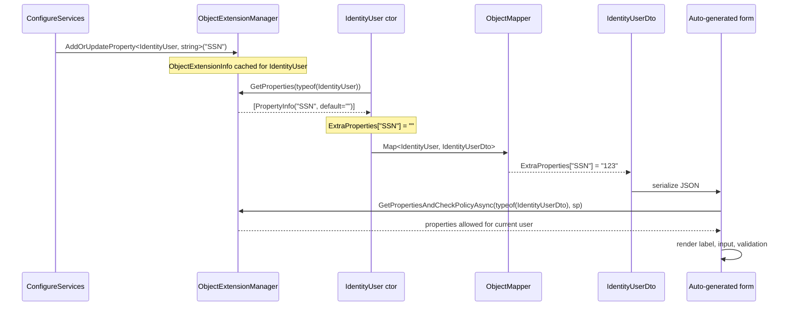

The `Volo.Abp.ObjectExtending` package gives ABP Framework an answer to a hard problem: how do you add a `SocialSecurityNumber` property to `IdentityUser` (which lives inside the framework's identity module) without forking the source? The solution is *object extending* — a runtime metadata layer where a host application calls `ObjectExtensionManager.Instance.AddOrUpdateProperty<IdentityUser, string>("SSN")` once at startup and every instance of `IdentityUser` (and its DTOs) magically gets a key/value pair in its `ExtraProperties` dictionary with the right validation, default value, mapping, and policy checks. This page walks `IHasExtraProperties`, `ExtraPropertyDictionary`, the `HasExtraPropertiesExtensions` helpers, `ExtensibleObject`, `ObjectExtensionManager`, `ObjectExtensionInfo`, `ObjectExtensionPropertyInfo`, `MappingPropertyDefinitionChecks`, and the configuration knobs (`UI`, `Lookup`, `Policy`, `Validators`, `Attributes`, `DefaultValueFactory`).

## The three core types

| Type | File | Role |
|---|---|---|
| `IHasExtraProperties` | `Volo.Abp.ObjectExtending/Volo/Abp/Data/IHasExtraProperties.cs` | Marker requiring `ExtraProperties` dictionary |
| `ExtraPropertyDictionary` | `Volo.Abp.ObjectExtending/Volo/Abp/Data/ExtraPropertyDictionary.cs` | Just `Dictionary<string, object?>` |
| `ExtensibleObject` | `Volo.Abp.ObjectExtending/Volo/Abp/ObjectExtending/ExtensibleObject.cs` | Base class implementing `IHasExtraProperties` + `IValidatableObject` |
| `ObjectExtensionManager` | `Volo.Abp.ObjectExtending/Volo/Abp/ObjectExtending/ObjectExtensionManager.cs` | Process-wide registry of extension metadata |
| `ObjectExtensionInfo` | `Volo.Abp.ObjectExtending/Volo/Abp/ObjectExtending/ObjectExtensionInfo.cs` | Per-object-type definition: properties + validators |
| `ObjectExtensionPropertyInfo` | `Volo.Abp.ObjectExtending/Volo/Abp/ObjectExtending/ObjectExtensionPropertyInfo.cs` | One extra property: name, type, UI/lookup/policy config |

## `IHasExtraProperties`

```csharp
// framework/src/Volo.Abp.ObjectExtending/Volo/Abp/Data/IHasExtraProperties.cs
namespace Volo.Abp.Data;

public interface IHasExtraProperties
{
    ExtraPropertyDictionary ExtraProperties { get; }
}
```

The simplest contract in the package — any object that wants to carry extra properties just exposes one dictionary.

## `ExtraPropertyDictionary`

```csharp
// framework/src/Volo.Abp.ObjectExtending/Volo/Abp/Data/ExtraPropertyDictionary.cs
[Serializable]
public class ExtraPropertyDictionary : Dictionary<string, object?>
{
    public ExtraPropertyDictionary() { }

    public ExtraPropertyDictionary(IDictionary<string, object?> dictionary) : base(dictionary) { }
}
```

Subclassing `Dictionary<string, object?>` (instead of using it directly) gives the framework a unique type to look up serialisers and EF Core value converters for.

## Where it's wired in

The framework's most important `IHasExtraProperties` implementer is `AggregateRoot` (from the [Entities & aggregates page](/ddd/domain-entities-and-aggregates)):

```csharp
// framework/src/Volo.Abp.Ddd.Domain/Volo/Abp/Domain/Entities/AggregateRoot.cs
public abstract class AggregateRoot : BasicAggregateRoot,
    IHasExtraProperties,
    IHasConcurrencyStamp
{
    public virtual ExtraPropertyDictionary ExtraProperties { get; protected set; }

    protected AggregateRoot()
    {
        ConcurrencyStamp = Guid.NewGuid().ToString("N");
        ExtraProperties = new ExtraPropertyDictionary();
        this.SetDefaultsForExtraProperties();
    }
    // ...
}
```

`this.SetDefaultsForExtraProperties()` is the bridge — it walks `ObjectExtensionManager.Instance.GetProperties(typeof(AggregateRoot))` and copies every property's default value into `ExtraProperties`. The DTO side mirrors this — `ExtensibleObject` does the same in its constructor (and is the base class for every `Extensible*Dto` from the [DTOs page](/ddd/application-dtos)).

## `ExtensibleObject`

```csharp
// framework/src/Volo.Abp.ObjectExtending/Volo/Abp/ObjectExtending/ExtensibleObject.cs
[Serializable]
public class ExtensibleObject : IHasExtraProperties, IValidatableObject
{
    public ExtraPropertyDictionary ExtraProperties { get; protected set; }

    public ExtensibleObject() : this(true) { }

    public ExtensibleObject(bool setDefaultsForExtraProperties)
    {
        ExtraProperties = new ExtraPropertyDictionary();

        if (setDefaultsForExtraProperties)
        {
            this.SetDefaultsForExtraProperties(ProxyHelper.UnProxy(this).GetType());
        }
    }

    public virtual IEnumerable<ValidationResult> Validate(ValidationContext validationContext)
    {
        return ExtensibleObjectValidator.GetValidationErrors(this, validationContext);
    }
}
```

Two things matter here:

1. **`ProxyHelper.UnProxy(this).GetType()`** — when ABP wraps the object in a dynamic proxy (because the object service is intercepted), `this.GetType()` would return the proxy type, not the real class. `UnProxy` peels off the proxy so the extension lookup works on the actual user type.
2. **`Validate(...)`** — every `ExtensibleObject` automatically participates in ASP.NET Core's model validation pipeline; `ExtensibleObjectValidator.GetValidationErrors` runs the per-property validators registered through `ObjectExtensionPropertyInfo.Validators`.

## `HasExtraPropertiesExtensions` — the helper API

The extension class `Volo.Abp.Data.HasExtraPropertiesExtensions` defines the methods you call from user code: `HasProperty`, `GetProperty`, `SetProperty`, `RemoveProperty`, `SetDefaultsForExtraProperties`, `SetExtraPropertiesToRegularProperties`, `HasSameExtraProperties`. The most important ones:

```csharp
// framework/src/Volo.Abp.ObjectExtending/Volo/Abp/Data/HasExtraPropertiesExtensions.cs
public static bool HasProperty(this IHasExtraProperties source, string name)
{
    return source.ExtraProperties.ContainsKey(name);
}

public static object? GetProperty(this IHasExtraProperties source, string name, object? defaultValue = null)
{
    return source.ExtraProperties.GetOrDefault(name) ?? defaultValue;
}

public static TProperty? GetProperty<TProperty>(this IHasExtraProperties source, string name, TProperty? defaultValue = default)
{
    return TypeHelper.ChangeTypePrimitiveExtended<TProperty>(
        source.GetProperty(name, (object?) defaultValue)
    ) ?? defaultValue;
}

public static TSource SetProperty<TSource>(
    this TSource source,
    string name,
    object? value,
    bool validate = true)
    where TSource : IHasExtraProperties
{
    if (validate)
    {
        ExtensibleObjectValidator.CheckValue(source, name, value);
    }

    source.ExtraProperties[name] = value;

    return source;
}

public static TSource RemoveProperty<TSource>(this TSource source, string name)
    where TSource : IHasExtraProperties
{
    source.ExtraProperties.Remove(name);
    return source;
}
```

The fluent return-`source` pattern lets you chain:

```csharp
user.SetProperty("SSN", "123-45-6789")
    .SetProperty("HireDate", DateTime.Today);
```

`GetProperty<T>` uses `TypeHelper.ChangeTypePrimitiveExtended` so reading `int Foo = user.GetProperty<int>("Foo")` works even when the value came back from JSON as a `long` or `string`.

`SetDefaultsForExtraProperties` is the method invoked from `AggregateRoot` and `ExtensibleObject` constructors:

```csharp
public static TSource SetDefaultsForExtraProperties<TSource>(this TSource source, Type? objectType = null)
    where TSource : IHasExtraProperties
{
    if (objectType == null) objectType = typeof(TSource);

    var properties = ObjectExtensionManager.Instance
        .GetProperties(objectType);

    foreach (var property in properties)
    {
        if (source.HasProperty(property.Name)) continue;

        source.ExtraProperties[property.Name] = property.GetDefaultValue();
    }

    return source;
}
```

`SetExtraPropertiesToRegularProperties` is the inverse — if your entity has a real CLR property named the same as an extra property (because you "upgraded" it to a first-class column), it pushes the value back into the regular property:

```csharp
public static void SetExtraPropertiesToRegularProperties(this IHasExtraProperties source)
{
    var properties = source.GetType().GetProperties()
        .Where(x => source.ExtraProperties.ContainsKey(x.Name)
                    && x.GetSetMethod(true) != null)
        .ToList();

    foreach (var property in properties)
    {
        property.SetValue(source, source.ExtraProperties[property.Name]);
        source.RemoveProperty(property.Name);
    }
}
```

## `ObjectExtensionManager`

The process-wide registry. There's a singleton via `Instance`, and you can also construct your own for testing:

```csharp
// framework/src/Volo.Abp.ObjectExtending/Volo/Abp/ObjectExtending/ObjectExtensionManager.cs
public class ObjectExtensionManager
{
    public static ObjectExtensionManager Instance { get; protected set; } = new ObjectExtensionManager();

    public ConcurrentDictionary<object, object> Configuration { get; }

    protected ConcurrentDictionary<Type, ObjectExtensionInfo> ObjectsExtensions { get; }

    protected internal ObjectExtensionManager()
    {
        ObjectsExtensions = new ConcurrentDictionary<Type, ObjectExtensionInfo>();
        Configuration = new ConcurrentDictionary<object, object>();
    }

    public virtual ObjectExtensionManager AddOrUpdate<TObject>(
        Action<ObjectExtensionInfo>? configureAction = null)
    {
        return AddOrUpdate(typeof(TObject), configureAction);
    }

    public virtual ObjectExtensionManager AddOrUpdate(
        Type[] types,
        Action<ObjectExtensionInfo>? configureAction = null)
    {
        foreach (var type in types)
        {
            AddOrUpdate(type, configureAction);
        }
        return this;
    }

    public virtual ObjectExtensionManager AddOrUpdate(
        Type type,
        Action<ObjectExtensionInfo>? configureAction = null)
    {
        var extensionInfo = ObjectsExtensions.GetOrAdd(type, _ => new ObjectExtensionInfo(type));
        configureAction?.Invoke(extensionInfo);
        return this;
    }

    public virtual ObjectExtensionInfo? GetOrNull<TObject>() => GetOrNull(typeof(TObject));
    public virtual ObjectExtensionInfo? GetOrNull(Type type) => ObjectsExtensions.GetOrDefault(type);

    public virtual ImmutableList<ObjectExtensionInfo> GetExtendedObjects()
        => ObjectsExtensions.Values.ToImmutableList();
}
```

`AddOrUpdate(...)` adds or updates per-type extension info. The `Configuration` ConcurrentDictionary is a free-form bag for cross-cutting metadata (e.g. the module configuration helpers from the `Modularity/` subfolder store their settings here).

## `ObjectExtensionInfo`

One per extended type. It owns the property dictionary and the type-level validators:

```csharp
// framework/src/Volo.Abp.ObjectExtending/Volo/Abp/ObjectExtending/ObjectExtensionInfo.cs
public class ObjectExtensionInfo
{
    public Type Type { get; }

    protected ConcurrentDictionary<string, ObjectExtensionPropertyInfo> Properties { get; }

    public ConcurrentDictionary<object, object> Configuration { get; }

    public List<Action<ObjectExtensionValidationContext>> Validators { get; }

    public ObjectExtensionInfo(Type type)
    {
        Type = Check.NotNull(type, nameof(type));
        Properties = new ConcurrentDictionary<string, ObjectExtensionPropertyInfo>();
        Configuration = new ConcurrentDictionary<object, object>();
        Validators = new List<Action<ObjectExtensionValidationContext>>();
    }

    public virtual bool HasProperty(string propertyName)
        => Properties.ContainsKey(propertyName);

    public virtual ObjectExtensionInfo AddOrUpdateProperty<TProperty>(
        string propertyName,
        Action<ObjectExtensionPropertyInfo>? configureAction = null)
    {
        return AddOrUpdateProperty(typeof(TProperty), propertyName, configureAction);
    }

    public virtual ObjectExtensionInfo AddOrUpdateProperty(
        Type propertyType,
        string propertyName,
        Action<ObjectExtensionPropertyInfo>? configureAction = null)
    {
        var propertyInfo = Properties.GetOrAdd(propertyName,
            _ => new ObjectExtensionPropertyInfo(this, propertyType, propertyName));

        configureAction?.Invoke(propertyInfo);
        return this;
    }

    public virtual ImmutableList<ObjectExtensionPropertyInfo> GetProperties()
        => Properties.OrderBy(t => t.Value.UI.Order).Select(t => t.Value).ToImmutableList();

    public virtual ObjectExtensionPropertyInfo? GetPropertyOrNull(string propertyName)
        => Properties.GetOrDefault(propertyName);
}
```

Notice `GetProperties()` orders by `UI.Order` — the UI order is part of the property metadata.

## `ObjectExtensionPropertyInfo`

The richest type in the package. It carries everything ABP needs to render, validate, map, and authorize a single extra property:

```csharp
// framework/src/Volo.Abp.ObjectExtending/Volo/Abp/ObjectExtending/ObjectExtensionPropertyInfo.cs
public class ObjectExtensionPropertyInfo : IHasNameWithLocalizableDisplayName, IBasicObjectExtensionPropertyInfo
{
    public ObjectExtensionInfo ObjectExtension { get; }

    public string Name { get; }
    public Type Type { get; }

    public List<Attribute> Attributes { get; }
    public List<Action<ObjectExtensionPropertyValidationContext>> Validators { get; }
    public ILocalizableString? DisplayName { get; set; }

    public bool? CheckPairDefinitionOnMapping { get; set; }

    public Dictionary<object, object> Configuration { get; }

    public object? DefaultValue { get; set; }
    public Func<object>? DefaultValueFactory { get; set; }

    public ExtensionPropertyLookupConfiguration Lookup { get; set; }
    public ExtensionPropertyUI UI { get; set; }
    public ExtensionPropertyPolicyConfiguration Policy { get; set; }

    public ObjectExtensionPropertyInfo(ObjectExtensionInfo objectExtension, Type type, string name)
    {
        ObjectExtension = Check.NotNull(objectExtension, nameof(objectExtension));
        Type = Check.NotNull(type, nameof(type));
        Name = Check.NotNull(name, nameof(name));

        Configuration = new Dictionary<object, object>();
        Attributes = new List<Attribute>();
        Validators = new List<Action<ObjectExtensionPropertyValidationContext>>();

        Attributes.AddRange(ExtensionPropertyHelper.GetDefaultAttributes(Type));
        DefaultValue = TypeHelper.GetDefaultValue(Type);
        Lookup = new ExtensionPropertyLookupConfiguration();
        UI = new ExtensionPropertyUI();
        Policy = new ExtensionPropertyPolicyConfiguration();
    }

    public object? GetDefaultValue()
        => ExtensionPropertyHelper.GetDefaultValue(Type, DefaultValueFactory, DefaultValue);

    public class ExtensionPropertyUI
    {
        public int Order { get; set; }
        public ExtensionPropertyUICreateModal CreateModal { get; set; }
        public ExtensionPropertyUIEditModal EditModal { get; set; }
        // ...
    }
    // ExtensionPropertyUICreateModal / EditModal: IsVisible, IsReadOnly
}
```

Properties exposed and their effects:

| Slot | Used by | Effect |
|---|---|---|
| `Attributes` | EF Core mapping, validation | `[Required]`, `[StringLength(100)]`, custom attributes |
| `Validators` | `ExtensibleObjectValidator` | Per-property callbacks producing `ValidationResult` |
| `DisplayName` | UI generation | Localized label |
| `DefaultValue` / `DefaultValueFactory` | `SetDefaultsForExtraProperties` | Seed value on construction |
| `Lookup` (`ExtensionPropertyLookupConfiguration`) | UI | Dropdown source (URL, value field, display field) |
| `UI` (`ExtensionPropertyUI`) | Auto-generated UI | Order, visibility, read-only flags for create/edit modals |
| `Policy` (`ExtensionPropertyPolicyConfiguration`) | UI + Auth | Permission/feature/global-feature gates |
| `Configuration` (free-form dict) | Anything | Extension key/value bag |
| `CheckPairDefinitionOnMapping` | `MapExtraPropertiesTo` | Whether the destination must declare the same extra property |

## Configuration: `ExtensionPropertyHelper.GetDefaultAttributes`

When you register a `string` property the framework pre-populates `Attributes` with sensible defaults — `[StringLength]` based on the string's metadata if any — via `ExtensionPropertyHelper.GetDefaultAttributes`. This is why a freshly-added string extra property gets reasonable max-length validation without explicit configuration.

`GetDefaultValue` consults the factory first, falls back to the static `DefaultValue`, and finally to `TypeHelper.GetDefaultValue(Type)`:

```csharp
public object? GetDefaultValue()
    => ExtensionPropertyHelper.GetDefaultValue(Type, DefaultValueFactory, DefaultValue);
```

## `ObjectExtensionManagerExtensions` — the fluent API

This is the surface most modules use. The full set is in `ObjectExtensionManagerExtensions.cs`; the key entries:

```csharp
// framework/src/Volo.Abp.ObjectExtending/Volo/Abp/ObjectExtending/ObjectExtensionManagerExtensions.cs
public static ObjectExtensionManager AddOrUpdateProperty<TObject, TProperty>(
    this ObjectExtensionManager objectExtensionManager,
    string propertyName,
    Action<ObjectExtensionPropertyInfo>? configureAction = null)
    where TObject : IHasExtraProperties
{
    return objectExtensionManager.AddOrUpdateProperty(
        typeof(TObject),
        typeof(TProperty),
        propertyName,
        configureAction
    );
}

public static ObjectExtensionManager AddOrUpdateProperty<TProperty>(
    this ObjectExtensionManager objectExtensionManager,
    Type[] objectTypes,
    string propertyName,
    Action<ObjectExtensionPropertyInfo>? configureAction = null)
{
    return objectExtensionManager.AddOrUpdateProperty(
        objectTypes,
        typeof(TProperty),
        propertyName, configureAction
    );
}

public static ImmutableList<ObjectExtensionPropertyInfo> GetProperties<TObject>(
    this ObjectExtensionManager objectExtensionManager)
{
    return objectExtensionManager.GetProperties(typeof(TObject));
}

public static ObjectExtensionPropertyInfo? GetPropertyOrNull<TObject>(
    this ObjectExtensionManager objectExtensionManager,
    string propertyName)
{
    return objectExtensionManager.GetPropertyOrNull(typeof(TObject), propertyName);
}

public async static Task<ImmutableList<ObjectExtensionPropertyInfo>> GetPropertiesAndCheckPolicyAsync(
    this ObjectExtensionManager objectExtensionManager,
    Type objectType,
    IServiceProvider serviceProvider)
{
    var extensionPropertyPolicyConfigurationChecker
        = serviceProvider.GetRequiredService<ExtensionPropertyPolicyChecker>();
    var properties = new List<ObjectExtensionPropertyInfo>();
    foreach (var propertyInfo in objectExtensionManager.GetProperties(objectType))
    {
        if (await extensionPropertyPolicyConfigurationChecker.CheckPolicyAsync(propertyInfo.Policy))
        {
            properties.Add(propertyInfo);
        }
    }
    return properties.ToImmutableList();
}
```

The async `GetPropertiesAndCheckPolicyAsync` is what the UI uses to render only the extra properties the current user is allowed to see.

## End-to-end: adding SSN to IdentityUser

The canonical example. In your `*.Domain` module's `ConfigureServices`:

```csharp
public override void ConfigureServices(ServiceConfigurationContext context)
{
    ObjectExtensionManager.Instance
        .AddOrUpdateProperty<IdentityUser, string>("SocialSecurityNumber",
            options =>
            {
                options.Attributes.Add(new RequiredAttribute());
                options.Attributes.Add(new StringLengthAttribute(20));
                options.DefaultValue = "";
                options.UI.Order = 100;
                options.DisplayName = new LocalizableString(typeof(MyResource), "SSN");
            })
        .AddOrUpdateProperty<IdentityUser, DateTime>("HireDate",
            options =>
            {
                options.DefaultValueFactory = () => DateTime.Today;
            });
}
```

To do the same for *both* the entity and its DTO at once, use the `Type[]` overload:

```csharp
ObjectExtensionManager.Instance.AddOrUpdateProperty<string>(
    new[] { typeof(IdentityUser), typeof(IdentityUserDto), typeof(IdentityUserCreateDto), typeof(IdentityUserUpdateDto) },
    "SocialSecurityNumber",
    options => options.Attributes.Add(new RequiredAttribute()));
```

Read/write at runtime:

```csharp
string ssn = user.GetProperty<string>("SocialSecurityNumber");
user.SetProperty("SocialSecurityNumber", "123-45-6789");
```

## How the dictionary flows through the stack

The picture is end-to-end — from registration at boot to UI render:



## `ExtensibleObjectMapper` — copying extras across DTO mappings

When `IObjectMapper.Map<TSource, TDestination>(source)` copies between two `IHasExtraProperties` types, ABP's `ExtensibleObjectMapper` (file `Volo.Abp.ObjectExtending/Volo/Abp/ObjectExtending/ExtensibleObjectMapper.cs`) is invoked to copy `ExtraProperties` too. The `MappingPropertyDefinitionChecks` enum controls *which* keys to copy:

```csharp
// framework/src/Volo.Abp.ObjectExtending/Volo/Abp/ObjectExtending/MappingPropertyDefinitionChecks.cs
[Flags]
public enum MappingPropertyDefinitionChecks : byte
{
    Null = 0,
    /// <summary>No check. Copy all extra properties from the source to the destination.</summary>
    None = 1 << 0,
    /// <summary>Copy the extra properties defined for the source class.</summary>
    Source = 1 << 1,
    /// <summary>Copy the extra properties defined for the destination class.</summary>
    Destination = 1 << 2,
    /// <summary>Copy extra properties defined for both of the source and destination classes.</summary>
    Both = Source | Destination
}
```

| Value | Behaviour |
|---|---|
| `None` | Copy every extra property regardless of whether either side declares it |
| `Source` | Copy only props defined on `TSource` (loose copy, useful for entity→DTO) |
| `Destination` | Copy only props defined on `TDest` |
| `Both` | The strict default — props must be defined on both sides |

You set this per-property by overriding `ObjectExtensionPropertyInfo.CheckPairDefinitionOnMapping`, or globally via the `MapExtraProperties()` configuration of the AutoMapper integration.

## Validation flow

Every `ExtensibleObject` (and every `AggregateRoot`) implements `IValidatableObject.Validate`, which delegates to `ExtensibleObjectValidator.GetValidationErrors`. The walk:

1. For each property registered in the type's `ObjectExtensionInfo.Properties`:
   - Pull the current value from `ExtraProperties[key]`.
   - Apply each `Attribute` in `Attributes` via `Validator.TryValidateValue`.
   - Run each callback in `Validators` (the per-property validators).
2. Run each `Action<ObjectExtensionValidationContext>` in `ObjectExtensionInfo.Validators` (type-level validators).
3. Yield all collected `ValidationResult` objects.

This means: an extra property with `Attributes.Add(new RequiredAttribute())` actually fails ASP.NET Core model binding the same way a regular `[Required]` property would.

## Policy gates on extra properties

`ExtensionPropertyPolicyConfiguration` (file `Volo/Abp/ObjectExtending/ExtensionPropertyPolicyConfiguration.cs`) defines three sub-configurations: `Feature`, `Permission`, `GlobalFeature`. `ExtensionPropertyPolicyChecker.CheckPolicyAsync` evaluates them via `IFeatureChecker`, `IAuthorizationService.AuthorizeAsync`, and `GlobalFeatureManager.Instance.IsEnabled` respectively. A property whose policy fails is filtered out of UI rendering by `GetPropertiesAndCheckPolicyAsync` — you can register a `SocialSecurityNumber` extra property visible only to HR-role users.

## The module class

The package's module is bare — all behaviour is exposed via the static `ObjectExtensionManager.Instance`:

```csharp
// framework/src/Volo.Abp.ObjectExtending/Volo/Abp/ObjectExtending/AbpObjectExtendingModule.cs
[DependsOn(
    typeof(AbpLocalizationAbstractionsModule),
    typeof(AbpValidationAbstractionsModule)
)]
public class AbpObjectExtendingModule : AbpModule
{
}
```

## Per-module convenience: `ModuleExtensionConfiguration`

The `Modularity/` sub-namespace defines a higher-level configuration model used by published ABP modules (Identity, BlobStoring, etc.) so consumers can extend many related types in one block:

```csharp
ObjectExtensionManager.Instance.Modules()
    .ConfigureIdentity(identity =>
    {
        identity.ConfigureUser(user =>
        {
            user.AddOrUpdateProperty<string>("SSN", options =>
            {
                options.Attributes.Add(new RequiredAttribute());
            });
        });
    });
```

This pattern internally walks the module's known entity + DTO list and calls `AddOrUpdateProperty` on each one. The relevant files are under `Volo/Abp/ObjectExtending/Modularity/` — `ModuleExtensionConfiguration`, `EntityExtensionConfiguration`, `ExtensionPropertyApiCreateConfiguration`, `ExtensionPropertyApiUpdateConfiguration`, `ExtensionPropertyApiGetConfiguration`, etc.

## When to use object extending vs. inheritance

| Need | Use |
|---|---|
| Extend a module entity you don't own | Object extending |
| Extend a module DTO you don't own | Object extending |
| First-class, queryable property in your *own* aggregate | Real C# property |
| Tenant-customisable schema | Object extending (works with EF Core JSON columns) |
| Add a navigation property | Real C# property (objects extending only stores values) |

Object extending stores values as a JSON column (in EF Core) or a sub-document (in MongoDB). That makes the extras queryable only with `JSON_VALUE` / `$.extras.SSN`-style operators — fine for filters but not as fast as a regular indexed column.

## Cross-references

- [Entities & aggregates](/ddd/domain-entities-and-aggregates) — `AggregateRoot.ExtraProperties` is the entity-side hook.
- [Application DTOs](/ddd/application-dtos) — the `Extensible*Dto` family that derives from `ExtensibleObject`.
- [Application contracts](/ddd/application-contracts) — extra properties travel through HTTP as part of `ExtensibleEntityDto<TKey>`.
- [Data overview](/data/overview) — how EF Core / MongoDB serialise `ExtraPropertyDictionary` columns.
- [Identity module](/modules/identity) — the canonical extension target (`IdentityUser`, `IdentityRole`).
