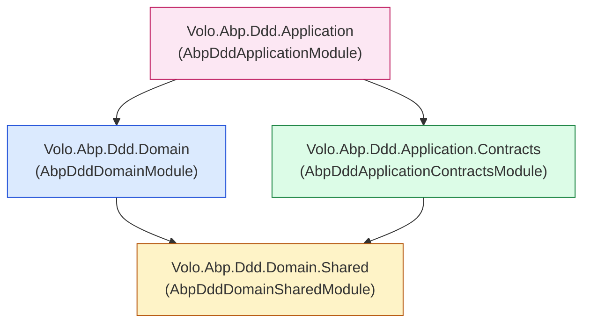

The ABP Framework ships its Domain-Driven Design building blocks across four NuGet packages that map one-to-one to the four DDD layers of a typical solution. This page introduces those packages — `Volo.Abp.Ddd.Domain.Shared`, `Volo.Abp.Ddd.Domain`, `Volo.Abp.Ddd.Application.Contracts`, and `Volo.Abp.Ddd.Application` — explains the strict dependency direction between them, lists the ABP modules each one depends on (declared in their `AbpModule` classes), and points to the deep-dive page for every base class you will derive from when building an aggregate, repository, application service, or DTO.

## The four DDD packages

Every layer is a separate `.csproj` under `framework/src/`. The package name is also the namespace prefix and the `AbpModule` class name:

| Package | Module class | Layer role |
|---|---|---|
| `Volo.Abp.Ddd.Domain.Shared` | `AbpDddDomainSharedModule` | Constants, enums, distributed ETOs — referenced by every other layer |
| `Volo.Abp.Ddd.Domain` | `AbpDddDomainModule` | Entities, aggregates, repositories, domain services, value objects |
| `Volo.Abp.Ddd.Application.Contracts` | `AbpDddApplicationContractsModule` | DTOs, application-service interfaces, `IRemoteService` surface |
| `Volo.Abp.Ddd.Application` | `AbpDddApplicationModule` | `ApplicationService`, `CrudAppService`, mapping helpers |

The module graph is encoded in `[DependsOn(...)]` attributes. `AbpDddDomainModule` declares its dependency on `AbpDddDomainSharedModule` in `Volo.Abp.Ddd.Domain/Volo/Abp/Domain/AbpDddDomainModule.cs`:

```csharp
// framework/src/Volo.Abp.Ddd.Domain/Volo/Abp/Domain/AbpDddDomainModule.cs
[DependsOn(
    typeof(AbpAuditingModule),
    typeof(AbpDataModule),
    typeof(AbpEventBusModule),
    typeof(AbpGuidsModule),
    typeof(AbpTimingModule),
    typeof(AbpObjectMappingModule),
    typeof(AbpExceptionHandlingModule),
    typeof(AbpSpecificationsModule),
    typeof(AbpCachingModule),
    typeof(AbpDddDomainSharedModule)
)]
public class AbpDddDomainModule : AbpModule
{
    public override void PreConfigureServices(ServiceConfigurationContext context)
    {
        context.Services.AddConventionalRegistrar(new AbpRepositoryConventionalRegistrar());
        context.Services.OnRegistered(ChangeTrackingInterceptorRegistrar.RegisterIfNeeded);
    }
}
```

The application layer module `AbpDddApplicationModule` in `Volo.Abp.Ddd.Application/Volo/Abp/Application/AbpDddApplicationModule.cs` chains the domain module *and* the contracts module, plus all cross-cutting modules (security, validation, object mapping, settings, features):

```csharp
// framework/src/Volo.Abp.Ddd.Application/Volo/Abp/Application/AbpDddApplicationModule.cs
[DependsOn(
    typeof(AbpDddDomainModule),
    typeof(AbpDddApplicationContractsModule),
    typeof(AbpSecurityModule),
    typeof(AbpObjectMappingModule),
    typeof(AbpValidationModule),
    typeof(AbpAuthorizationModule),
    typeof(AbpHttpAbstractionsModule),
    typeof(AbpSettingsModule),
    typeof(AbpFeaturesModule),
    typeof(AbpGlobalFeaturesModule)
)]
public class AbpDddApplicationModule : AbpModule { /* ... */ }
```

`AbpDddApplicationContractsModule` (file `Volo.Abp.Ddd.Application.Contracts/Volo/Abp/Application/AbpDddApplicationContractsModule.cs`) depends only on `AbpLocalizationModule`, `AbpAuditingContractsModule`, and `AbpDataModule` — a deliberately tiny surface so that clients (Blazor, Angular, MVC) can reference contracts without dragging in EF Core or other infrastructure.

## Dependency diagram

The arrow direction is *"depends on"*. Notice that contracts and domain layers do **not** reference each other — they are sibling outputs of the domain-shared root:



This shape is enforced by ABP's modular boot: `AbpDddDomainSharedModule` (in `Volo.Abp.Ddd.Domain.Shared/Volo/Abp/Domain/AbpDddDomainSharedModule.cs`) is the *only* DDD module that depends on nothing inside the DDD stack:

```csharp
// framework/src/Volo.Abp.Ddd.Domain.Shared/Volo/Abp/Domain/AbpDddDomainSharedModule.cs
[DependsOn(
    typeof(AbpMultiTenancyAbstractionsModule),
    typeof(AbpEventBusAbstractionsModule)
)]
public class AbpDddDomainSharedModule : AbpModule { }
```

## Dependency rules

The dependency rules below are enforced by the package graph — a project simply cannot reference symbols in a layer it does not depend on.

| Rule | Allowed direction | Enforced where |
|---|---|---|
| Shared constants & ETOs flow upward | `Domain.Shared` → everywhere | All other DDD `[DependsOn]` lists include `AbpDddDomainSharedModule` (directly or transitively) |
| Domain knows nothing of Application | `Domain` → `Domain.Shared` only | `AbpDddDomainModule.csproj` does not reference `Application.Contracts` |
| Contracts know nothing of Domain | `Application.Contracts` → `Domain.Shared` only | `AbpDddApplicationContractsModule` `[DependsOn]` excludes domain module |
| Application orchestrates both | `Application` → `Domain` + `Application.Contracts` | `AbpDddApplicationModule` `[DependsOn]` includes both |

The reason `Application.Contracts` doesn't depend on `Domain` is that remote clients (HTTP API proxies, mobile UIs) must be able to ship without EF Core, repositories, or entity classes. Look at the contracts module dependencies — none of them are persistence-related:

```csharp
// framework/src/Volo.Abp.Ddd.Application.Contracts/Volo/Abp/Application/AbpDddApplicationContractsModule.cs
[DependsOn(
    typeof(AbpLocalizationModule),
    typeof(AbpAuditingContractsModule),
    typeof(AbpDataModule)
)]
public class AbpDddApplicationContractsModule : AbpModule
{
    public override void ConfigureServices(ServiceConfigurationContext context)
    {
        Configure<AbpVirtualFileSystemOptions>(options =>
        {
            options.FileSets.AddEmbedded<AbpDddApplicationContractsModule>();
        });

        Configure<AbpLocalizationOptions>(options =>
        {
            options.Resources
                .Add<AbpDddApplicationContractsResource>("en")
                .AddVirtualJson("/Volo/Abp/Application/Localization/Resources/AbpDdd");
        });
    }
}
```

## What each layer contains

The directory under each package's `Volo/Abp/...` namespace folder maps to a clearly bounded set of types. The next table is the index for the rest of this section — every entry has its own dedicated page.

| Layer (package) | Top-level folders under `Volo/Abp/` | Page |
|---|---|---|
| `Domain.Shared` | `Domain/Entities/Events/Distributed/` (ETOs) | [Domain.Shared](/ddd/domain-shared) |
| `Domain` | `Domain/Entities`, `Domain/Entities/Auditing`, `Domain/Repositories`, `Domain/Services`, `Domain/Values`, `Domain/ChangeTracking` | [Entities & aggregates](/ddd/domain-entities-and-aggregates), [Domain services](/ddd/domain-services-and-managers), [Repositories](/ddd/domain-repositories), [Value objects](/ddd/value-objects-and-enumerations) |
| `Application.Contracts` | `Application/Dtos`, `Application/Services` (interfaces), `Application/Localization` | [Application contracts](/ddd/application-contracts), [DTOs](/ddd/application-dtos) |
| `Application` | `Application/Services` (`ApplicationService`, `CrudAppService`, `ReadOnlyAppService`, `AbstractKeyCrudAppService`) | [Application services](/ddd/application-services), [CRUD service](/ddd/crud-app-service) |

The `Volo.Abp.Specifications` package (file `framework/src/Volo.Abp.Specifications/Volo/Abp/Specifications/AbpSpecificationsModule.cs`) is referenced by `AbpDddDomainModule` and provides the predicate-combinator types covered on the [Specifications page](/ddd/specifications). The `Volo.Abp.ObjectExtending` package is referenced transitively through `AbpDataModule` and gives entities and DTOs the `IHasExtraProperties` surface explored in [Object extending](/ddd/object-extending).

## How the four packages interact in a solution

A typical ABP solution mirrors this exact layering. For each business module (`Acme.BookStore.Books`, for example) you will have four projects whose names end with `.Domain.Shared`, `.Domain`, `.Application.Contracts`, `.Application` — each depending on the matching ABP DDD package. The flow of a single HTTP request through them is:

```mermaid
sequenceDiagram
    participant Client
    participant AppSvc as Application<br/>(BookAppService)
    participant Repo as Domain<br/>(IRepository&lt;Book, Guid&gt;)
    participant DS as Domain.Shared<br/>(EntityCreatedEto&lt;BookEto&gt;)

    Client->>AppSvc: POST /books { CreateBookDto }
    Note over AppSvc: from Application.Contracts:<br/>ICrudAppService, PagedResultDto, CreateBookDto
    AppSvc->>Repo: InsertAsync(book, autoSave:true)
    Repo-->>AppSvc: Book
    Note over Repo,DS: AbpDddDomainModule's<br/>entity-events publishes ETO from Domain.Shared
    AppSvc-->>Client: BookDto
```

Notice three boundary crossings: the request DTO is from `Application.Contracts`; the entity and repository are from `Domain`; the distributed ETO type that announces the creation is from `Domain.Shared` so message-bus listeners in other microservices can subscribe without importing the producer's `Domain` project.

## Cross-cutting concerns wired by the application module

`ApplicationService` (file `Volo.Abp.Ddd.Application/Volo/Abp/Application/Services/ApplicationService.cs`) implements a long list of marker interfaces that turn on framework interception. These markers are also added to `AbpApiDescriptionModelOptions.IgnoredInterfaces` so they never appear in generated client proxies:

```csharp
// framework/src/Volo.Abp.Ddd.Application/Volo/Abp/Application/AbpDddApplicationModule.cs
public override void ConfigureServices(ServiceConfigurationContext context)
{
    Configure<AbpApiDescriptionModelOptions>(options =>
    {
        options.IgnoredInterfaces.AddIfNotContains(typeof(IRemoteService));
        options.IgnoredInterfaces.AddIfNotContains(typeof(IApplicationService));
        options.IgnoredInterfaces.AddIfNotContains(typeof(IUnitOfWorkEnabled));
        options.IgnoredInterfaces.AddIfNotContains(typeof(IAuditingEnabled));
        options.IgnoredInterfaces.AddIfNotContains(typeof(IValidationEnabled));
        options.IgnoredInterfaces.AddIfNotContains(typeof(IGlobalFeatureCheckingEnabled));
    });
}
```

`AbpDddDomainModule.PreConfigureServices` also installs a conventional registrar for repositories (see `Volo.Abp.Ddd.Domain/Volo/Abp/Domain/Repositories/AbpRepositoryConventionalRegistrar.cs`) so any class implementing `IRepository` is auto-registered as transient with its interface as the exposed service:

```csharp
// framework/src/Volo.Abp.Ddd.Domain/Volo/Abp/Domain/Repositories/AbpRepositoryConventionalRegistrar.cs
public class AbpRepositoryConventionalRegistrar : DefaultConventionalRegistrar
{
    public static bool ExposeRepositoryClasses { get; set; }

    protected override bool IsConventionalRegistrationDisabled(Type type)
    {
        return !typeof(IRepository).IsAssignableFrom(type) || base.IsConventionalRegistrationDisabled(type);
    }

    protected override ServiceLifetime? GetDefaultLifeTimeOrNull(Type type)
    {
        return ServiceLifetime.Transient;
    }
}
```

Together with `ChangeTrackingInterceptorRegistrar.RegisterIfNeeded` (file `Volo.Abp.Ddd.Domain/Volo/Abp/Domain/ChangeTracking/ChangeTrackingInterceptorRegistrar.cs`), this is the only DI plumbing the four DDD packages add — everything else is plain conventions.

## Layered base classes at a glance

The table below shows the base classes you most commonly derive from in each layer. Each row links to the dedicated deep-dive page.

| You want to build | Derive from | Defined in | Page |
|---|---|---|---|
| An aggregate root with Guid key, audit, soft delete | `FullAuditedAggregateRoot<Guid>` | `Volo.Abp.Ddd.Domain/Volo/Abp/Domain/Entities/Auditing/FullAuditedAggregateRoot.cs` | [Entities & aggregates](/ddd/domain-entities-and-aggregates) |
| A simple entity with composite key | `Entity` (override `GetKeys()`) | `Volo.Abp.Ddd.Domain/Volo/Abp/Domain/Entities/Entity.cs` | [Entities & aggregates](/ddd/domain-entities-and-aggregates) |
| A value object | `ValueObject` | `Volo.Abp.Ddd.Domain/Volo/Abp/Domain/Values/ValueObject.cs` | [Value objects](/ddd/value-objects-and-enumerations) |
| A domain manager (`XxxManager`) | `DomainService` | `Volo.Abp.Ddd.Domain/Volo/Abp/Domain/Services/DomainService.cs` | [Domain services](/ddd/domain-services-and-managers) |
| A custom repository | `RepositoryBase<TEntity,TKey>` | `Volo.Abp.Ddd.Domain/Volo/Abp/Domain/Repositories/RepositoryBase.cs` | [Repositories](/ddd/domain-repositories) |
| An application service | `ApplicationService` | `Volo.Abp.Ddd.Application/Volo/Abp/Application/Services/ApplicationService.cs` | [Application services](/ddd/application-services) |
| A full CRUD application service | `CrudAppService<TEntity,TDto,TKey>` | `Volo.Abp.Ddd.Application/Volo/Abp/Application/Services/CrudAppService.cs` | [CRUD service](/ddd/crud-app-service) |
| An audited DTO | `AuditedEntityDto<TKey>` | `Volo.Abp.Ddd.Application.Contracts/Volo/Abp/Application/Dtos/AuditedEntityDto.cs` | [DTOs](/ddd/application-dtos) |
| A specification | `Specification<T>` | `Volo.Abp.Specifications/Volo/Abp/Specifications/Specification.cs` | [Specifications](/ddd/specifications) |
| An extensible entity | implement `IHasExtraProperties` | `Volo.Abp.ObjectExtending/Volo/Abp/Data/IHasExtraProperties.cs` | [Object extending](/ddd/object-extending) |

## Where to go next

<CardGroup cols={2}>
  <Card title="Domain.Shared" href="/ddd/domain-shared" icon="cube">
    Walk the smallest layer first — distributed ETOs, mapping dictionaries, and the one module class that all other layers depend on.
  </Card>
  <Card title="Entities & Aggregates" href="/ddd/domain-entities-and-aggregates" icon="diagram-project">
    Entity, AggregateRoot, BasicAggregateRoot, and every concrete auditing base class.
  </Card>
  <Card title="Repositories" href="/ddd/domain-repositories" icon="database">
    The full `IRepository<TEntity, TKey>` surface and how providers plug in.
  </Card>
  <Card title="Application Services" href="/ddd/application-services" icon="gears">
    `ApplicationService`'s lazy service providers and cross-cutting markers.
  </Card>
  <Card title="CRUD AppService" href="/ddd/crud-app-service" icon="layer-group">
    All seven `CrudAppService` overloads and their default `GetAsync`/`CreateAsync`/`UpdateAsync` implementations.
  </Card>
  <Card title="Object Extending" href="/ddd/object-extending" icon="puzzle-piece">
    `ObjectExtensionManager.Instance.AddOrUpdateProperty<...>(...)` and `IHasExtraProperties`.
  </Card>
</CardGroup>

For the persistence layer that plugs into the repository contracts described on the next page, jump to the [data overview](/data/overview) and the [unit of work](/data/unit-of-work) page. The [identity module](/modules/identity) is referenced throughout the DDD pages as a real-world example of an ABP module that follows this exact four-layer split.

## How a typical solution lays out projects

When you create an ABP module (or solution) named `Acme.BookStore`, the convention is to ship four projects per bounded context:

| Project | References the ABP DDD package | Contains |
|---|---|---|
| `Acme.BookStore.Domain.Shared` | `Volo.Abp.Ddd.Domain.Shared` | Enums, constants, error codes, distributed `BookEto`, localization resources |
| `Acme.BookStore.Domain` | `Volo.Abp.Ddd.Domain` | `Book` aggregate, `BookManager`, `IBookRepository` interface |
| `Acme.BookStore.Application.Contracts` | `Volo.Abp.Ddd.Application.Contracts` | `IBookAppService`, `BookDto`, `CreateBookDto`, `BookStorePermissions` |
| `Acme.BookStore.Application` | `Volo.Abp.Ddd.Application` | `BookAppService : CrudAppService<...>`, AutoMapper profile |

The project graph mirrors the framework's package graph one-to-one. EF Core or MongoDB integration goes into an additional `Acme.BookStore.EntityFrameworkCore` project that references the `Domain` project (not `Application` — the persistence layer should never see DTOs).

## Layer cheat sheet

| If you find yourself writing... | Move it to... |
|---|---|
| `using Microsoft.EntityFrameworkCore;` in `Domain` | An `*.EntityFrameworkCore` project |
| `new Book(...)` from a controller | Move to a `BookAppService` (`Application`) |
| `BookDto` in `Domain` | Move to `Application.Contracts` |
| `IBookRepository` in `Application.Contracts` | Move to `Domain` |
| `[Authorize]` on a method in `Domain` | Move to `Application` |
| Distributed event handler in `Application` | Move to `Domain` or to a dedicated `*.EventHandlers` project |

The packages enforce this in code — you cannot make `Application.Contracts` reference `EntityFrameworkCore` without the build erroring on transitive `[DependsOn]` checks.

## A note on the `Volo.Abp.Specifications` package

`Volo.Abp.Specifications` is the only DDD-adjacent package that lives outside the four `Volo.Abp.Ddd.*` projects. It is pulled in as a dependency by `AbpDddDomainModule` (see the `[DependsOn]` block above). Everything it exports — `ISpecification<T>`, `Specification<T>`, the combinators — is therefore available from the `Domain` layer onwards, but not from `Domain.Shared`. The detailed walk-through is on the [Specifications](/ddd/specifications) page.

Similarly, `Volo.Abp.ObjectExtending` is transitively available via `AbpDataModule`, which `AbpDddDomainSharedModule` references. This is why `AggregateRoot` (in `Domain`) can implement `IHasExtraProperties` without an extra `[DependsOn]` entry. The full picture is on the [Object extending](/ddd/object-extending) page.

## Quick file index

The pages in this section reference these files most often — bookmark them while reading the deep dives:

| Reference | File path |
|---|---|
| Module: `AbpDddDomainSharedModule` | `framework/src/Volo.Abp.Ddd.Domain.Shared/Volo/Abp/Domain/AbpDddDomainSharedModule.cs` |
| Module: `AbpDddDomainModule` | `framework/src/Volo.Abp.Ddd.Domain/Volo/Abp/Domain/AbpDddDomainModule.cs` |
| Module: `AbpDddApplicationContractsModule` | `framework/src/Volo.Abp.Ddd.Application.Contracts/Volo/Abp/Application/AbpDddApplicationContractsModule.cs` |
| Module: `AbpDddApplicationModule` | `framework/src/Volo.Abp.Ddd.Application/Volo/Abp/Application/AbpDddApplicationModule.cs` |
| `Entity` / `Entity<TKey>` | `framework/src/Volo.Abp.Ddd.Domain/Volo/Abp/Domain/Entities/Entity.cs` |
| `AggregateRoot` | `framework/src/Volo.Abp.Ddd.Domain/Volo/Abp/Domain/Entities/AggregateRoot.cs` |
| `BasicAggregateRoot` | `framework/src/Volo.Abp.Ddd.Domain/Volo/Abp/Domain/Entities/BasicAggregateRoot.cs` |
| `IRepository` | `framework/src/Volo.Abp.Ddd.Domain/Volo/Abp/Domain/Repositories/IRepository.cs` |
| `RepositoryBase` | `framework/src/Volo.Abp.Ddd.Domain/Volo/Abp/Domain/Repositories/RepositoryBase.cs` |
| `DomainService` | `framework/src/Volo.Abp.Ddd.Domain/Volo/Abp/Domain/Services/DomainService.cs` |
| `ApplicationService` | `framework/src/Volo.Abp.Ddd.Application/Volo/Abp/Application/Services/ApplicationService.cs` |
| `CrudAppService` | `framework/src/Volo.Abp.Ddd.Application/Volo/Abp/Application/Services/CrudAppService.cs` |
| `EntityDto` | `framework/src/Volo.Abp.Ddd.Application.Contracts/Volo/Abp/Application/Dtos/EntityDto.cs` |
| `Specification<T>` | `framework/src/Volo.Abp.Specifications/Volo/Abp/Specifications/Specification.cs` |
| `ValueObject` | `framework/src/Volo.Abp.Ddd.Domain/Volo/Abp/Domain/Values/ValueObject.cs` |
| `ObjectExtensionManager` | `framework/src/Volo.Abp.ObjectExtending/Volo/Abp/ObjectExtending/ObjectExtensionManager.cs` |
