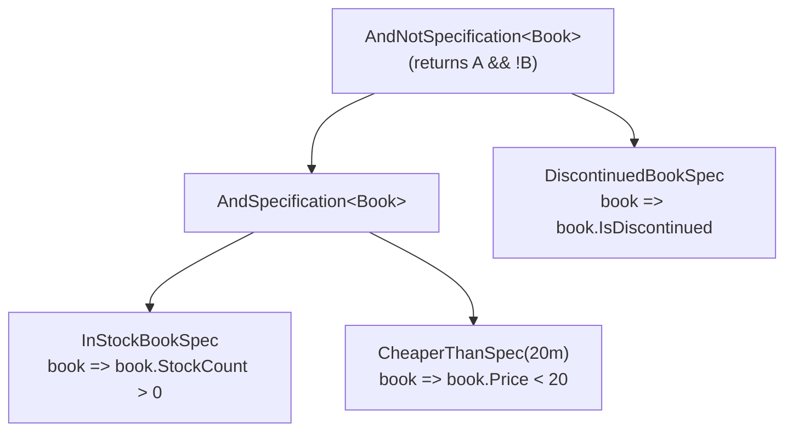

The `Volo.Abp.Specifications` package implements the classic Specification pattern as defined by Eric Evans and Martin Fowler, but tuned for LINQ-to-Entities — every specification is *both* an `IsSatisfiedBy(obj)` predicate (for in-memory use) and an `Expression<Func<T, bool>>` (translatable to SQL). This page covers `ISpecification<T>`, the abstract `Specification<T>` base, `CompositeSpecification<T>`, the binary combinators (`And`, `Or`, `AndNot`), the unary inverter (`Not`), the constant specs (`Any`, `None`), `ExpressionSpecification<T>`, the `SpecificationExtensions` operator class, the implicit conversion to `Expression<Func<T, bool>>`, and the `ParameterRebinder` that fixes EF Core's "two ParameterExpressions referring to the same lambda" problem.

## Why specifications

A specification is a reusable, named, composable query predicate. Instead of scattering `query.Where(x => x.Price > 100 && !x.IsDiscontinued)` across multiple application services, you write:

```csharp
var spec = new ExpensiveBookSpec().And(new InStockBookSpec());
var books = await AsyncExecuter.ToListAsync(query.Where(spec));
```

The lambda is now named, unit-testable, and combinable.

## Package contents

The whole feature is fewer than 15 files, all under `framework/src/Volo.Abp.Specifications/Volo/Abp/Specifications/`:

| File | Type | Role |
|---|---|---|
| `AbpSpecificationsModule.cs` | module class | Empty module — pulls itself into other modules' graphs |
| `ISpecification.cs` | interface | `IsSatisfiedBy(T)` + `ToExpression()` |
| `Specification.cs` | abstract class | Base for all custom specs, with implicit conversion to expression |
| `ICompositeSpecification.cs` | interface | Adds `Left`, `Right` accessors |
| `CompositeSpecification.cs` | abstract class | Base for binary spec combinators |
| `AndSpecification.cs` | class | Combines via `&&` |
| `OrSpecification.cs` | class | Combines via `||` |
| `AndNotSpecification.cs` | class | `left && !right` |
| `NotSpecification.cs` | class | Inverts a single spec |
| `AnySpecification.cs` | sealed | Always-true (`o => true`) |
| `NoneSpecification.cs` | sealed | Always-false (`o => false`) |
| `ExpressionSpecification.cs` | class | Wrap a raw expression as a spec |
| `SpecificationExtensions.cs` | static | Fluent `.And()`, `.Or()`, `.AndNot()`, `.Not()` extension methods |
| `ExpressionFuncExtender.cs` | static | `Expression<Func<T,bool>>.And()` / `.Or()` for raw expressions |
| `ParameterRebinder.cs` | internal | `ExpressionVisitor` that rewires `ParameterExpression`s when composing |
| `ISpecificationParser.cs` | interface | Plug-in point for "translate spec → ORM-specific criteria" |

## `ISpecification<T>`

```csharp
// framework/src/Volo.Abp.Specifications/Volo/Abp/Specifications/ISpecification.cs
public interface ISpecification<T>
{
    bool IsSatisfiedBy(T obj);

    Expression<Func<T, bool>> ToExpression();
}
```

Every spec must answer two questions: "does this particular object satisfy me?" (for in-memory validation, business-rule checks) and "what predicate would let a repository filter against me?" (for SQL translation).

## `Specification<T>` — the abstract base

The default `IsSatisfiedBy` simply compiles the expression and invokes it. The implicit conversion operator means you can pass any concrete spec wherever an `Expression<Func<T, bool>>` is expected:

```csharp
// framework/src/Volo.Abp.Specifications/Volo/Abp/Specifications/Specification.cs
public abstract class Specification<T> : ISpecification<T>
{
    public virtual bool IsSatisfiedBy(T obj)
    {
        return ToExpression().Compile()(obj);
    }

    public abstract Expression<Func<T, bool>> ToExpression();

    public static implicit operator Expression<Func<T, bool>>(Specification<T> specification)
    {
        return specification.ToExpression();
    }
}
```

Because `Expression<Func<T,bool>>` has an `Implicit` from any `Specification<T>`, you can write:

```csharp
ISpecification<Book> spec = new InStockBookSpec();
Expression<Func<Book, bool>> predicate = (Specification<Book>)spec;
// or, with concrete type:
var query = (await Repository.GetQueryableAsync()).Where(new InStockBookSpec());
```

## Defining a specification

The simplest custom spec just provides `ToExpression()`:

```csharp
public class InStockBookSpec : Specification<Book>
{
    public override Expression<Func<Book, bool>> ToExpression()
        => book => book.StockCount > 0;
}
```

Specs that need parameters take them via the constructor — they're plain objects:

```csharp
public class CheaperThanSpec : Specification<Book>
{
    private readonly decimal _maxPrice;

    public CheaperThanSpec(decimal maxPrice) => _maxPrice = maxPrice;

    public override Expression<Func<Book, bool>> ToExpression()
        => book => book.Price < _maxPrice;
}
```

## Composing — the `And`, `Or`, `Not`, `AndNot` operators

`CompositeSpecification<T>` is the base for any binary combinator. It captures the two operands and exposes them via the `ICompositeSpecification<T>` interface so external tooling (visualisers, schema generators) can introspect the tree:

```csharp
// framework/src/Volo.Abp.Specifications/Volo/Abp/Specifications/ICompositeSpecification.cs
public interface ICompositeSpecification<T> : ISpecification<T>
{
    ISpecification<T> Left { get; }
    ISpecification<T> Right { get; }
}
```

```csharp
// framework/src/Volo.Abp.Specifications/Volo/Abp/Specifications/CompositeSpecification.cs
public abstract class CompositeSpecification<T> : Specification<T>, ICompositeSpecification<T>
{
    protected CompositeSpecification(ISpecification<T> left, ISpecification<T> right)
    {
        Left = left;
        Right = right;
    }

    public ISpecification<T> Left { get; }
    public ISpecification<T> Right { get; }
}
```

### `AndSpecification<T>`

```csharp
// framework/src/Volo.Abp.Specifications/Volo/Abp/Specifications/AndSpecification.cs
public class AndSpecification<T> : CompositeSpecification<T>
{
    public AndSpecification(ISpecification<T> left, ISpecification<T> right) : base(left, right) { }

    public override Expression<Func<T, bool>> ToExpression()
    {
        return Left.ToExpression().And(Right.ToExpression());
    }
}
```

### `OrSpecification<T>`

```csharp
// framework/src/Volo.Abp.Specifications/Volo/Abp/Specifications/OrSpecification.cs
public class OrSpecification<T> : CompositeSpecification<T>
{
    public OrSpecification(ISpecification<T> left, ISpecification<T> right) : base(left, right) { }

    public override Expression<Func<T, bool>> ToExpression()
    {
        return Left.ToExpression().Or(Right.ToExpression());
    }
}
```

### `AndNotSpecification<T>`

The `right` predicate is inverted via `Expression.Not(...)` before being `AND`-ed with `left`:

```csharp
// framework/src/Volo.Abp.Specifications/Volo/Abp/Specifications/AndNotSpecification.cs
public class AndNotSpecification<T> : CompositeSpecification<T>
{
    public AndNotSpecification(ISpecification<T> left, ISpecification<T> right) : base(left, right) { }

    public override Expression<Func<T, bool>> ToExpression()
    {
        var rightExpression = Right.ToExpression();

        var bodyNot = Expression.Not(rightExpression.Body);
        var bodyNotExpression = Expression.Lambda<Func<T, bool>>(bodyNot, rightExpression.Parameters);

        return Left.ToExpression().And(bodyNotExpression);
    }
}
```

### `NotSpecification<T>`

```csharp
// framework/src/Volo.Abp.Specifications/Volo/Abp/Specifications/NotSpecification.cs
public class NotSpecification<T> : Specification<T>
{
    private readonly ISpecification<T> _specification;

    public NotSpecification(ISpecification<T> specification)
    {
        _specification = specification;
    }

    public override Expression<Func<T, bool>> ToExpression()
    {
        var expression = _specification.ToExpression();
        return Expression.Lambda<Func<T, bool>>(
            Expression.Not(expression.Body),
            expression.Parameters
        );
    }
}
```

### `AnySpecification<T>` and `NoneSpecification<T>`

The trivial cases — useful as starting points when composing dynamically:

```csharp
// framework/src/Volo.Abp.Specifications/Volo/Abp/Specifications/AnySpecification.cs
public sealed class AnySpecification<T> : Specification<T>
{
    public override Expression<Func<T, bool>> ToExpression() => o => true;
}
```

```csharp
// framework/src/Volo.Abp.Specifications/Volo/Abp/Specifications/NoneSpecification.cs
public sealed class NoneSpecification<T> : Specification<T>
{
    public override Expression<Func<T, bool>> ToExpression() => o => false;
}
```

`new AnySpecification<Book>()` is the identity for `Or`; `new NoneSpecification<Book>()` is the identity for `And`.

### `ExpressionSpecification<T>`

When the predicate is already an `Expression`, wrap it in `ExpressionSpecification` rather than writing a class:

```csharp
// framework/src/Volo.Abp.Specifications/Volo/Abp/Specifications/ExpressionSpecification.cs
public class ExpressionSpecification<T> : Specification<T>
{
    private readonly Expression<Func<T, bool>> _expression;

    public ExpressionSpecification(Expression<Func<T, bool>> expression)
    {
        _expression = expression;
    }

    public override Expression<Func<T, bool>> ToExpression() => _expression;
}
```

## The `SpecificationExtensions` operator class

This is the fluent API you'll use day-to-day. Every method validates its arguments with ABP's `Check.NotNull` helper before constructing a combinator:

```csharp
// framework/src/Volo.Abp.Specifications/Volo/Abp/Specifications/SpecificationExtensions.cs
public static class SpecificationExtensions
{
    public static ISpecification<T> And<T>([NotNull] this ISpecification<T> specification, [NotNull] ISpecification<T> other)
    {
        Check.NotNull(specification, nameof(specification));
        Check.NotNull(other, nameof(other));
        return new AndSpecification<T>(specification, other);
    }

    public static ISpecification<T> Or<T>([NotNull] this ISpecification<T> specification, [NotNull] ISpecification<T> other)
    {
        Check.NotNull(specification, nameof(specification));
        Check.NotNull(other, nameof(other));
        return new OrSpecification<T>(specification, other);
    }

    public static ISpecification<T> AndNot<T>([NotNull] this ISpecification<T> specification, [NotNull] ISpecification<T> other)
    {
        Check.NotNull(specification, nameof(specification));
        Check.NotNull(other, nameof(other));
        return new AndNotSpecification<T>(specification, other);
    }

    public static ISpecification<T> Not<T>([NotNull] this ISpecification<T> specification)
    {
        Check.NotNull(specification, nameof(specification));
        return new NotSpecification<T>(specification);
    }
}
```

The result is a fluent DSL:

```csharp
var spec = new InStockBookSpec()
    .And(new CheaperThanSpec(20m))
    .AndNot(new DiscontinuedBookSpec());
```

## The `ExpressionFuncExtender` and the parameter problem

When you `AND` or `OR` two `Expression<Func<T, bool>>` instances naïvely, the result has two distinct `ParameterExpression`s representing the same lambda parameter — EF Core's expression visitor will then throw because the parameter is unbound. `ExpressionFuncExtender` solves this by rebinding the second expression's parameter to point at the first expression's parameter before combining bodies:

```csharp
// framework/src/Volo.Abp.Specifications/Volo/Abp/Specifications/ExpressionFuncExtender.cs
public static class ExpressionFuncExtender
{
    private static Expression<T> Compose<T>(this Expression<T> first, Expression<T> second,
        Func<Expression, Expression, Expression> merge)
    {
        // build parameter map (from parameters of second to parameters of first)
        var map = first.Parameters.Select((f, i) => new { f, s = second.Parameters[i] })
            .ToDictionary(p => p.s, p => p.f);

        // replace parameters in the second lambda expression with parameters from the first
        var secondBody = ParameterRebinder.ReplaceParameters(map, second.Body);

        // apply composition of lambda expression bodies to parameters from the first expression
        return Expression.Lambda<T>(merge(first.Body, secondBody), first.Parameters);
    }

    public static Expression<Func<T, bool>> And<T>(this Expression<Func<T, bool>> first,
        Expression<Func<T, bool>> second) => first.Compose(second, Expression.AndAlso);

    public static Expression<Func<T, bool>> Or<T>(this Expression<Func<T, bool>> first,
        Expression<Func<T, bool>> second) => first.Compose(second, Expression.OrElse);
}
```

`ParameterRebinder` is the `ExpressionVisitor` that performs the substitution:

```csharp
// framework/src/Volo.Abp.Specifications/Volo/Abp/Specifications/ParameterRebinder.cs
internal class ParameterRebinder : ExpressionVisitor
{
    private readonly Dictionary<ParameterExpression, ParameterExpression> _map;

    internal ParameterRebinder(Dictionary<ParameterExpression, ParameterExpression> map)
    {
        _map = map ?? [];
    }

    internal static Expression ReplaceParameters(Dictionary<ParameterExpression, ParameterExpression> map,
        Expression exp)
    {
        return new ParameterRebinder(map).Visit(exp);
    }

    protected override Expression VisitParameter(ParameterExpression p)
    {
        if (_map.TryGetValue(p, out var replacement))
        {
            p = replacement;
        }

        return base.VisitParameter(p);
    }
}
```

The XML comment in `ExpressionFuncExtender.cs` itself credits Meek's MSDN blog post for the technique. The result is that two specs like `x => x.Price > 10` and `y => y.Stock > 0` combine into `x => x.Price > 10 && x.Stock > 0` (note: the `y` parameter has been rewritten to `x`), which EF Core can translate to SQL.

## A composition example

Picture combining three specs into a single SQL `WHERE` clause:

```csharp
var spec = new InStockBookSpec()
              .And(new CheaperThanSpec(20m))
              .AndNot(new DiscontinuedBookSpec());

var query = await Repository.GetQueryableAsync();
var matches = await AsyncExecuter.ToListAsync(query.Where(spec));
```

The expression tree built behind the scenes looks like:



The final `ToExpression()` is `book => book.StockCount > 0 && book.Price < 20 && !book.IsDiscontinued`. EF Core translates that directly to a single SQL predicate — no in-memory evaluation, no client-side filtering.

## Where to use specifications

`ISpecification<T>` is registered into the module graph of `AbpDddDomainModule` via:

```csharp
// framework/src/Volo.Abp.Ddd.Domain/Volo/Abp/Domain/AbpDddDomainModule.cs (excerpt)
[DependsOn(
    /* ... */
    typeof(AbpSpecificationsModule),
    /* ... */
)]
public class AbpDddDomainModule : AbpModule { /* ... */ }
```

This means every domain service ([details](/ddd/domain-services-and-managers)) and every repository consumer ([details](/ddd/domain-repositories)) can take an `ISpecification<TEntity>` parameter:

```csharp
public async Task<List<Book>> FindBooksAsync(ISpecification<Book> spec)
{
    var queryable = await _bookRepository.GetQueryableAsync();
    return await AsyncExecuter.ToListAsync(queryable.Where(spec));
}
```

The `.Where(spec)` call works because `Specification<Book>` implicitly converts to `Expression<Func<Book, bool>>` thanks to the operator defined in `Specification.cs`.

## `ISpecificationParser` — translating specs to other criteria models

When the target ORM doesn't speak LINQ (NHibernate's `ICriteria`, raw `IMongoQuery`, a custom search index), the `ISpecificationParser` interface lets you walk the spec tree and emit a target-specific query object:

```csharp
// framework/src/Volo.Abp.Specifications/Volo/Abp/Specifications/ISpecificationParser.cs
public interface ISpecificationParser<out TCriteria>
{
    TCriteria Parse<T>(ISpecification<T> specification);
}
```

A typical implementation pattern-matches on the spec subtypes — `AndSpecification<T>`, `NotSpecification<T>`, your own custom subclasses — and builds the target criteria. ABP itself ships no concrete parser; the contract is reserved for application-specific translators.

## The module class

`AbpSpecificationsModule` (file `framework/src/Volo.Abp.Specifications/Volo/Abp/Specifications/AbpSpecificationsModule.cs`) is intentionally empty — the specification types are pure POCOs and need no DI registration:

```csharp
public class AbpSpecificationsModule : AbpModule
{
}
```

## Algebraic identities at a glance

The combinators obey the usual Boolean algebra identities — useful when you build specs dynamically:

| Identity | Meaning |
|---|---|
| `spec.And(new AnySpecification<T>()) == spec` | `Any` is the identity for `And` |
| `spec.Or(new NoneSpecification<T>()) == spec` | `None` is the identity for `Or` |
| `spec.Not().Not() == spec` (in practice — at the expression level) | Double negation cancels |
| `new NoneSpecification<T>().And(x) == None` | `None` short-circuits `And` |
| `new AnySpecification<T>().Or(x) == Any` | `Any` short-circuits `Or` |

(These identities are not *enforced* by the framework — `spec.And(new AnySpecification<T>())` still produces an `AndSpecification`, just one EF Core trivially optimises away.)

## Cross-references

- [Repositories](/ddd/domain-repositories) — where specs are usually applied via `query.Where(spec)`.
- [Domain services](/ddd/domain-services-and-managers) — common place to compose specs from request DTOs.
- [Application services](/ddd/application-services) and [CRUD app service](/ddd/crud-app-service) — consume specs through `CreateFilteredQueryAsync`.
- [Data overview](/data/overview) — provider-level execution.
