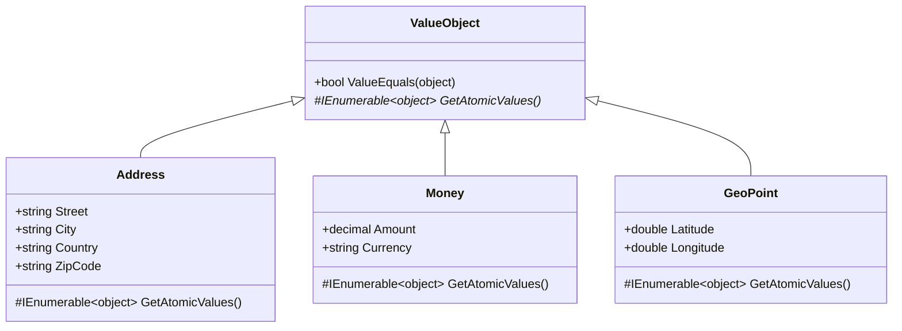

A **value object** has no identity — two `Money(10, "USD")` instances are interchangeable, while two `Order` instances with the same total are still distinct domain entities. ABP Framework ships exactly one tiny class to support this distinction: `ValueObject` (file `framework/src/Volo.Abp.Ddd.Domain/Volo/Abp/Domain/Values/ValueObject.cs`). This page covers the `ValueObject` implementation, its `GetAtomicValues()` extension point, the `ValueEquals` algorithm that walks nested value objects, the `EntityHelper.IsValueObject` predicate that the rest of the framework uses to distinguish entities from value objects, and the rationale for ABP not shipping a built-in `Enumeration` base class.

## `ValueObject` source

The whole class is roughly 50 lines:

```csharp
// framework/src/Volo.Abp.Ddd.Domain/Volo/Abp/Domain/Values/ValueObject.cs
//Inspired from https://docs.microsoft.com/en-us/dotnet/standard/microservices-architecture/microservice-ddd-cqrs-patterns/implement-value-objects

namespace Volo.Abp.Domain.Values;

public abstract class ValueObject
{
    protected abstract IEnumerable<object> GetAtomicValues();

    public bool ValueEquals(object obj)
    {
        if (obj == null || obj.GetType() != GetType())
        {
            return false;
        }

        var other = (ValueObject)obj;

        var thisValues = GetAtomicValues().GetEnumerator();
        var otherValues = other.GetAtomicValues().GetEnumerator();

        var thisMoveNext = thisValues.MoveNext();
        var otherMoveNext = otherValues.MoveNext();
        while (thisMoveNext && otherMoveNext)
        {
            if (ReferenceEquals(thisValues.Current, null) ^ ReferenceEquals(otherValues.Current, null))
            {
                return false;
            }

            if (thisValues.Current is ValueObject currentValueObject && otherValues.Current is ValueObject otherValueObject)
            {
                if (!currentValueObject.ValueEquals(otherValueObject))
                {
                    return false;
                }
            }
            else if (thisValues.Current != null && !thisValues.Current.Equals(otherValues.Current))
            {
                return false;
            }

            thisMoveNext = thisValues.MoveNext();
            otherMoveNext = otherValues.MoveNext();

            if (thisMoveNext != otherMoveNext)
            {
                return false;
            }
        }

        return !thisMoveNext && !otherMoveNext;
    }
}
```

The comment at the top credits the Microsoft `eShopOnContainers` reference — ABP deliberately uses the canonical .NET implementation.

## The contract — `GetAtomicValues()`

`GetAtomicValues()` is the only abstract member. It returns the *components* that define equality. The canonical example is `Address`:

```csharp
public class Address : ValueObject
{
    public string Street { get; }
    public string City { get; }
    public string Country { get; }
    public string ZipCode { get; }

    public Address(string street, string city, string country, string zipCode)
    {
        Street = street;
        City = city;
        Country = country;
        ZipCode = zipCode;
    }

    protected override IEnumerable<object> GetAtomicValues()
    {
        yield return Street;
        yield return City;
        yield return Country;
        yield return ZipCode;
    }
}
```

Two `Address` instances with the same four atomic values are equal — the runtime identity of the objects is irrelevant.

## The `ValueEquals` algorithm

The walk through `ValueEquals` follows three rules:

| Rule | Meaning |
|---|---|
| Same exact type | `GetType() != GetType()` ⇒ unequal. A `Money` and a `Currency` with the same `Amount` are not equal. |
| Same length of atomic sequence | If one enumerator finishes first, they're unequal. |
| Per-element equality | XOR null-check (exactly one null ⇒ unequal); nested `ValueObject` ⇒ recurse; otherwise `Equals(...)`. |

The XOR check `ReferenceEquals(thisValues.Current, null) ^ ReferenceEquals(otherValues.Current, null)` is the standard trick for "exactly one of these is null". The recursion into nested `ValueObject`s ensures that a `Price` containing an `Address` (for "billed-to") still has correct value equality.

## A worked example

Given two `Money` instances:

```csharp
public class Money : ValueObject
{
    public decimal Amount { get; }
    public string Currency { get; }

    public Money(decimal amount, string currency) { Amount = amount; Currency = currency; }

    protected override IEnumerable<object> GetAtomicValues()
    {
        yield return Amount;
        yield return Currency;
    }
}

var a = new Money(10m, "USD");
var b = new Money(10m, "USD");

a.ValueEquals(b);   // true
a == b;             // false (reference equality)
```

ABP's `ValueObject` does **not** override `Equals` or `==` — only `ValueEquals` is defined. This is intentional: not overriding `Equals` keeps existing reference-equality semantics intact for any framework code that compares values by reference (e.g., HashSet lookups across requests).

## How the framework distinguishes value objects from entities

`EntityHelper` (file `framework/src/Volo.Abp.Ddd.Domain/Volo/Abp/Domain/Entities/EntityHelper.cs`) exposes a predicate that callers use to decide whether to treat a type as an entity or as a value-object payload:

```csharp
public static Func<Type, bool> IsValueObjectPredicate = type => typeof(ValueObject).IsAssignableFrom(type);

public static bool IsValueObject([NotNull] Type type)
{
    Check.NotNull(type, nameof(type));
    return IsValueObjectPredicate(type);
}

public static bool IsValueObject(object? obj)
{
    return obj != null && IsValueObject(obj.GetType());
}
```

The static field is *replaceable* — `EntityHelper.IsValueObjectPredicate = t => t.IsDefined(typeof(MyValueObjectAttribute), false);` lets you opt-in via attribute rather than base-class inheritance, which is sometimes preferable if you already have a deep type hierarchy.

## How ORMs treat ABP value objects

EF Core's "owned types" map exactly to the value-object concept — they have no identity and are stored as columns on the owner's table. The recommendation for ABP entities containing a `ValueObject` is to call `builder.OwnsOne(b => b.Address)` in the EF Core configuration. This is covered in the [data overview](/data/overview).

MongoDB serialisation handles value objects naturally because BSON has no identity column at the document level — a `Money` simply becomes a nested document with `Amount` and `Currency` fields.

## Class diagram



## Value object vs entity — the key differences

| Concern | `Entity` / `Entity<TKey>` | `ValueObject` |
|---|---|---|
| Identity | Has `GetKeys()` / `Id` | None — defined by its values |
| Equality | `EntityHelper.EntityEquals` (by key) | `ValueObject.ValueEquals` (by atomic values) |
| Mutability | Mutable (state changes over time) | Conceptually immutable (you replace, not mutate) |
| Lifecycle in DB | Persisted as a row with its own PK | Persisted as columns of the owning row (EF Core "owned types") |
| Equality semantics | Same id ⇒ same entity even if attributes differ | Same values ⇒ same value object even across instances |
| Belongs to | Aggregate root or repository | Aggregate or another value object |
| Detection helper | `EntityHelper.IsEntity(type)` | `EntityHelper.IsValueObject(type)` |
| Base class | `Entity`, `AggregateRoot<TKey>`, ... ([entities](/ddd/domain-entities-and-aggregates)) | `ValueObject` |

## Mutability — a convention, not an enforcement

The `ValueObject` base class does **not** make derived classes immutable — it's your responsibility to use `init` setters or constructor-only assignment. The convention in the ABP codebase and most DDD literature is:

```csharp
public class Color : ValueObject
{
    public int R { get; }
    public int G { get; }
    public int B { get; }

    public Color(int r, int g, int b) { R = r; G = g; B = b; }

    public Color With(int? r = null, int? g = null, int? b = null)
        => new Color(r ?? R, g ?? G, b ?? B);

    protected override IEnumerable<object> GetAtomicValues()
    {
        yield return R;
        yield return G;
        yield return B;
    }
}
```

`With(...)` returns a new instance rather than mutating — the `Color` you started with is still the same colour, you just got a different one back.

## On `Enumeration`

The classic *Smart Enumeration* pattern (a value object whose atomic values are an `int Id` and a `string Name`, with named static instances like `OrderStatus.Pending`) is widely used in DDD applications. The ABP Framework codebase **does not ship** an `Enumeration` base class — there is no file matching `Enumeration.cs` anywhere in `framework/src/`. The recommended path in ABP is to either:

| Option | When to use |
|---|---|
| Plain C# `enum` | When values are stable, integral, and serialisable. EF Core stores them as `int`. |
| Class derived from `ValueObject` | When the "enum" needs methods or rich behaviour, you get value equality via `ValueObject` |
| Reference data table (entity) | When the set of allowed values is configurable at runtime |

If you do want a Smart Enumeration you can build it on top of `ValueObject` — define `Id` and `Name` as the atomic values, expose static readonly instances, and add lookup methods like `FromName(string)`. Because it derives from `ValueObject`, `ValueEquals` works correctly out of the box.

```csharp
public abstract class Enumeration : ValueObject
{
    public int Id { get; }
    public string Name { get; }

    protected Enumeration(int id, string name)
    {
        Id = id;
        Name = name;
    }

    protected override IEnumerable<object> GetAtomicValues()
    {
        yield return Id;
        yield return Name;
    }

    public override string ToString() => Name;
}

public class CardType : Enumeration
{
    public static readonly CardType Amex = new(1, nameof(Amex));
    public static readonly CardType Visa = new(2, nameof(Visa));
    public static readonly CardType MasterCard = new(3, nameof(MasterCard));

    public CardType(int id, string name) : base(id, name) { }
}
```

This pattern works inside the same DDD layering described in the [overview](/ddd/overview) — put `CardType` in the `*.Domain.Shared` project so it's referenceable from contracts and from the domain.

## Common pitfalls

| Pitfall | Why it bites | Fix |
|---|---|---|
| Forgetting a field in `GetAtomicValues()` | Two "different" instances compare equal | Audit the override every time a field is added |
| Yielding mutable collections | Two instances containing equal lists evaluate as `Equals` on the list reference, not on items | Wrap with `string.Join` or a comparer-aware adapter |
| Adding `[Key]` attribute by accident | EF Core treats it as an entity | Use owned-type configuration (`builder.OwnsOne(...)`) |
| Calling `obj.Equals(other)` | Reference equality — won't be value equality | Call `obj.ValueEquals(other)` instead |
| Using `ValueObject` in a `HashSet<>` | `GetHashCode` is not overridden | Override `GetHashCode` based on the same atomic values, or use a custom `IEqualityComparer<T>` |

## Cross-references

- [Entities & aggregates](/ddd/domain-entities-and-aggregates) — the *other* half of DDD's identity/no-identity divide.
- [Domain services](/ddd/domain-services-and-managers) — where value objects are typically composed and returned.
- [Domain.Shared](/ddd/domain-shared) — where smart-enum-style value objects (`CardType` above) belong.
- [Data overview](/data/overview) — provider-specific guidance for owned types and BSON serialisation of value objects.
